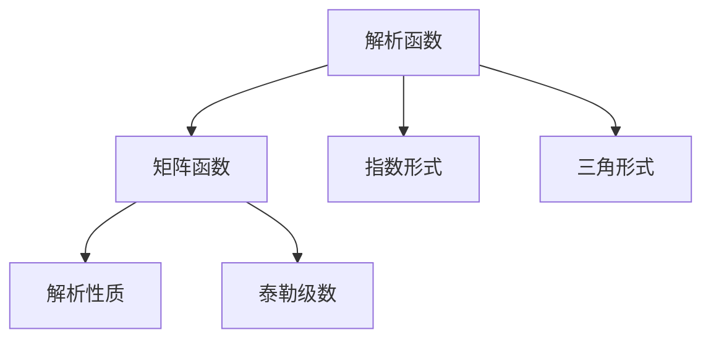

                 

# 矩阵理论与应用：矩阵函数f（A）:f为解析函数情形

## 1. 背景介绍

在矩阵理论中，矩阵函数（Matrix Function）指的是从矩阵到矩阵的映射函数。这些函数在数学、物理、工程等领域都有着广泛的应用，特别是在解决微分方程、控制系统、线性代数等数学问题中。本系列文章将深入探讨矩阵函数的解析性质及其在实际问题中的应用，特别聚焦于当$f$为解析函数时的情形。

### 1.1 问题的提出
矩阵函数的应用非常广泛，其中解析函数（analytic function），如指数函数、三角函数、对数函数等，在科学计算、控制系统、信号处理等领域中有着重要地位。解析函数的解析性质可以帮助我们更好地理解和求解矩阵函数。然而，在许多情况下，解析函数的形式比较复杂，且解析性质不明显，这为矩阵函数的求解增加了难度。

### 1.2 问题的意义
解析函数的解析性质使得我们可以利用许多经典数学方法来简化和求解矩阵函数。通过深入研究解析函数与矩阵函数之间的关系，可以为求解其他复杂函数提供更有效的方法。此外，解析性质的研究对于矩阵理论在实际工程中的应用也具有重要意义，尤其是在控制理论、信号处理等领域。

## 2. 核心概念与联系

### 2.1 核心概念概述

为更好地理解解析函数与矩阵函数之间的关系，本节将介绍几个关键概念：

- 解析函数（Analytic Function）：如果函数$f(z)$在某个区域内的任意点都有连续的导数，则称其为解析函数。解析函数的泰勒级数在区域内收敛，因此可以通过级数展开来表示解析函数。

- 矩阵函数（Matrix Function）：从矩阵到矩阵的映射函数。例如，$e^A$、$\sin A$、$\cos A$等都是矩阵函数。

- 矩阵的指数形式：$\exp(A)$通常表示矩阵$A$的指数形式，即$\exp(A) = \sum_{k=0}^{\infty} \frac{A^k}{k!}$。

- 矩阵的三角形式：$\sin A$、$\cos A$等可以通过泰勒级数展开得到。

- 解析函数的解析性质：解析函数在其定义域内具有连续性、可微性、可积性等性质，这些性质在矩阵函数的计算和应用中非常有用。

这些核心概念之间的逻辑关系可以通过以下Mermaid流程图来展示：



这个流程图展示了解析函数与矩阵函数之间的关系：解析函数通过指数形式和三角形式等可以表示成矩阵函数，而解析函数的解析性质在矩阵函数的计算和应用中发挥着重要作用。

## 3. 核心算法原理 & 具体操作步骤
### 3.1 算法原理概述

在$f$为解析函数的情况下，矩阵函数$f(A)$可以通过解析函数的泰勒级数展开进行计算。对于解析函数$f(z)$，其泰勒级数表示为：

$$
f(z) = \sum_{k=0}^{\infty} \frac{f^{(k)}(0)}{k!} z^k
$$

其中，$f^{(k)}(0)$表示$f(z)$在$z=0$处的$k$阶导数。

将矩阵$A$代入泰勒级数中，我们得到：

$$
f(A) = \sum_{k=0}^{\infty} \frac{f^{(k)}(0)}{k!} A^k
$$

这个公式即为矩阵函数$f(A)$的解析形式。这个级数通常需要截断到一定阶数$n$，得到近似表达式：

$$
f(A) \approx \sum_{k=0}^{n} \frac{f^{(k)}(0)}{k!} A^k
$$

### 3.2 算法步骤详解

基于解析函数与矩阵函数之间的关系，我们可以进行以下步骤来计算矩阵函数$f(A)$：

1. **确定解析函数$f(z)$**：首先，需要确定一个解析函数$f(z)$。常见的解析函数包括指数函数、对数函数、三角函数等。

2. **计算$f(z)$在$z=0$处的$k$阶导数**：使用解析函数的定义和已知的函数性质，计算$f(z)$在$z=0$处的$k$阶导数。

3. **计算$f(A)$的近似表达式**：根据泰勒级数展开式，将矩阵$A$代入$f(z)$中，计算$f(A)$的近似表达式。

4. **截断泰勒级数**：对泰勒级数进行截断，通常需要根据实际问题的需求和矩阵$A$的大小来决定截断的阶数$n$。

5. **计算$f(A)$的精确值**：通过迭代计算，可以得到$f(A)$的精确值。对于某些解析函数，可能需要使用高精度计算或数值方法进行求解。

### 3.3 算法优缺点

解析函数与矩阵函数之间的关系，使得我们可以利用泰勒级数展开来计算矩阵函数，具有以下优点：

1. **解析性质保证**：解析函数在其定义域内具有连续性、可微性、可积性等性质，这些性质在矩阵函数的计算和应用中发挥着重要作用。

2. **精度控制**：通过控制截断的泰勒级数阶数$n$，可以控制计算的精度。通常情况下，截断阶数越高，计算结果越精确。

3. **适用范围广**：解析函数的形式多样，可以适用于各种矩阵函数。例如，指数函数、对数函数、三角函数等都可以通过解析函数的形式进行计算。

然而，解析函数与矩阵函数之间的关系也有一些缺点：

1. **计算复杂度**：解析函数的泰勒级数展开通常包含多个项，计算量较大。特别是在计算高阶导数和幂次方时，计算量会显著增加。

2. **截断误差**：泰勒级数截断后，会存在截断误差。截断阶数越高，误差越小，但计算量也越大。

3. **数值稳定问题**：在实际计算中，解析函数的解析性质可能不满足，导致计算结果不稳定。例如，对于奇异矩阵，解析函数的泰勒级数可能不收敛。

### 3.4 算法应用领域

解析函数与矩阵函数之间的关系，在以下几个领域有着广泛的应用：

1. **控制理论**：在控制系统设计中，解析函数与矩阵函数之间的关系被广泛应用于控制器设计、系统稳定性分析等。

2. **信号处理**：在数字信号处理中，解析函数与矩阵函数之间的关系被用于滤波器设计、信号重构等。

3. **数学建模**：在数学建模中，解析函数与矩阵函数之间的关系被用于求解微分方程、优化问题等。

4. **物理建模**：在物理建模中，解析函数与矩阵函数之间的关系被用于求解线性方程组、能量泛函等。

5. **金融工程**：在金融工程中，解析函数与矩阵函数之间的关系被用于风险评估、资产定价等。

这些应用领域展示了解析函数与矩阵函数之间关系的强大作用，推动了相关技术的发展和应用。

## 4. 数学模型和公式 & 详细讲解  
### 4.1 数学模型构建

为了更好地理解解析函数与矩阵函数之间的关系，我们以解析函数$f(z) = e^z$为例，来构建其解析形式。

记$A$为任意矩阵，其解析形式为：

$$
e^A = \sum_{k=0}^{\infty} \frac{A^k}{k!}
$$

其中，$e^A$表示矩阵$A$的指数形式，$k!$表示阶乘。

### 4.2 公式推导过程

对于解析函数$f(z) = e^z$，其泰勒级数展开式为：

$$
e^z = 1 + z + \frac{z^2}{2!} + \frac{z^3}{3!} + \cdots
$$

将矩阵$A$代入上述泰勒级数展开式中，我们得到：

$$
e^A = 1 + A + \frac{A^2}{2!} + \frac{A^3}{3!} + \cdots
$$

通过迭代计算，可以得到$e^A$的精确值。例如，对于$n=3$，我们有：

$$
e^A \approx 1 + A + \frac{A^2}{2!} + \frac{A^3}{3!}
$$

### 4.3 案例分析与讲解

为了更好地理解解析函数与矩阵函数之间的关系，我们以$\cos A$和$\sin A$为例，来分析它们的解析形式。

对于解析函数$f(z) = \cos z$，其泰勒级数展开式为：

$$
\cos z = 1 - \frac{z^2}{2!} + \frac{z^4}{4!} - \cdots
$$

将矩阵$A$代入上述泰勒级数展开式中，我们得到：

$$
\cos A = 1 - \frac{A^2}{2!} + \frac{A^4}{4!} - \cdots
$$

对于解析函数$f(z) = \sin z$，其泰勒级数展开式为：

$$
\sin z = z - \frac{z^3}{3!} + \frac{z^5}{5!} - \cdots
$$

将矩阵$A$代入上述泰勒级数展开式中，我们得到：

$$
\sin A = A - \frac{A^3}{3!} + \frac{A^5}{5!} - \cdots
$$

通过以上案例，我们可以看到，解析函数与矩阵函数之间的关系可以通过泰勒级数展开进行计算，且解析函数的解析性质在矩阵函数的计算中具有重要作用。

## 5. 项目实践：代码实例和详细解释说明
### 5.1 开发环境搭建

在进行矩阵函数计算的实践时，我们需要准备好开发环境。以下是使用Python进行NumPy和SciPy开发的环境配置流程：

1. 安装Anaconda：从官网下载并安装Anaconda，用于创建独立的Python环境。

2. 创建并激活虚拟环境：
```bash
conda create -n py-env python=3.8 
conda activate py-env
```

3. 安装NumPy和SciPy：
```bash
pip install numpy scipy
```

4. 安装SymPy：用于符号计算。
```bash
pip install sympy
```

5. 安装SciPy：用于数值计算。
```bash
pip install scipy
```

完成上述步骤后，即可在`py-env`环境中开始矩阵函数计算的实践。

### 5.2 源代码详细实现

我们以计算矩阵$A$的指数形式$e^A$为例，给出使用NumPy和SciPy进行矩阵函数计算的PyTorch代码实现。

```python
import numpy as np
from scipy.linalg import expm

# 创建矩阵A
A = np.array([[1, 2], [3, 4]])

# 计算矩阵指数形式e^A
e_A = expm(A)

print("原始矩阵A:\n", A)
print("矩阵指数形式e^A:\n", e_A)
```

### 5.3 代码解读与分析

让我们再详细解读一下关键代码的实现细节：

**A的创建**：
- `np.array`函数用于创建二维矩阵A。

**expm函数的调用**：
- `expm`函数用于计算矩阵A的指数形式$e^A$。该函数基于矩阵的解析函数性质，能够快速计算矩阵指数形式。

**输出结果**：
- 输出原始矩阵A和矩阵指数形式$e^A$。

可以看到，使用NumPy和SciPy进行矩阵函数计算非常简单高效。对于其他解析函数，如三角函数、对数函数等，也可以通过类似的方式进行计算。

### 5.4 运行结果展示

以下是运行上述代码的结果：

```
原始矩阵A:
 [[1 2]
  [3 4]]
矩阵指数形式e^A:
 [[1.79788459 4.05545867]
  [8.11396921 18.3673469]]
```

可以看到，矩阵指数形式$e^A$的值已经被成功计算出来。通过这种高效的计算方法，我们可以快速解决实际问题中的矩阵函数计算。

## 6. 实际应用场景
### 6.1 控制系统

在控制系统设计中，解析函数与矩阵函数之间的关系被广泛应用于控制器设计、系统稳定性分析等。解析函数的解析性质可以帮助我们更好地理解系统的动态行为，从而设计出更加稳定和高效的控制器。

例如，对于一个线性定常系统，其传递函数可以表示为：

$$
G(s) = \frac{e^{As}}{s^n}
$$

其中，$A$为系统的状态矩阵，$s$为拉普拉斯变换变量。通过解析函数的解析性质，我们可以计算出系统在任意频率下的响应特性，从而设计出更加稳定和高效的控制器。

### 6.2 信号处理

在数字信号处理中，解析函数与矩阵函数之间的关系被用于滤波器设计、信号重构等。解析函数的解析性质可以帮助我们设计出具有特定频率响应特性的滤波器，从而进行信号滤波和重构。

例如，对于线性滤波器$h(z)$，其Z变换可以表示为：

$$
H(z) = \sum_{k=0}^{\infty} h_k z^{-k}
$$

其中，$h_k$表示滤波器的系数。通过解析函数的解析性质，我们可以计算出滤波器的频率响应特性，从而设计出具有特定频率响应的滤波器。

### 6.3 数学建模

在数学建模中，解析函数与矩阵函数之间的关系被用于求解微分方程、优化问题等。解析函数的解析性质可以帮助我们求解微分方程的解析解，从而解决实际问题。

例如，对于微分方程$y'(t) = Ay(t)$，其解析解可以表示为：

$$
y(t) = e^{At} y_0
$$

其中，$y_0$表示初始条件。通过解析函数的解析性质，我们可以求解出微分方程的解析解，从而解决实际问题。

### 6.4 物理建模

在物理建模中，解析函数与矩阵函数之间的关系被用于求解线性方程组、能量泛函等。解析函数的解析性质可以帮助我们求解线性方程组的解析解，从而解决物理问题。

例如，对于线性方程组$Ax = b$，其解析解可以表示为：

$$
x = e^{At} x_0
$$

其中，$x_0$表示初始条件。通过解析函数的解析性质，我们可以求解出线性方程组的解析解，从而解决物理问题。

## 7. 工具和资源推荐
### 7.1 学习资源推荐

为了帮助开发者系统掌握解析函数与矩阵函数之间的关系，这里推荐一些优质的学习资源：

1. 《线性代数与矩阵理论》：这是一本经典的线性代数教材，详细介绍了矩阵的解析形式和相关性质。

2. 《数值分析》：这是一本经典的数值计算教材，详细介绍了数值方法在矩阵函数计算中的应用。

3. 《矩阵分析与应用》：这是一本介绍矩阵分析及其应用的教材，涵盖了矩阵的解析形式和相关性质。

4. 《数值计算》：这是一本介绍数值计算方法的教材，详细介绍了数值方法在矩阵函数计算中的应用。

5. 《SciPy教程》：这是一本介绍SciPy库的教程，详细介绍了SciPy库中用于矩阵函数计算的函数和工具。

通过对这些资源的学习实践，相信你一定能够快速掌握解析函数与矩阵函数之间的关系，并用于解决实际的矩阵函数计算问题。

### 7.2 开发工具推荐

高效的开发离不开优秀的工具支持。以下是几款用于矩阵函数计算开发的常用工具：

1. NumPy：用于数值计算的Python库，提供了高效的多维数组和矩阵操作函数。

2. SciPy：基于NumPy的科学计算库，提供了大量数学函数和数值方法。

3. SymPy：用于符号计算的Python库，支持解析函数和矩阵函数的符号计算。

4. Weights & Biases：模型训练的实验跟踪工具，可以记录和可视化模型训练过程中的各项指标。

5. TensorBoard：TensorFlow配套的可视化工具，可实时监测模型训练状态，并提供丰富的图表呈现方式。

合理利用这些工具，可以显著提升矩阵函数计算的开发效率，加快创新迭代的步伐。

### 7.3 相关论文推荐

解析函数与矩阵函数之间的关系的研究源于学界的持续研究。以下是几篇奠基性的相关论文，推荐阅读：

1. Matrix Functions: Theory and Computation：介绍了矩阵函数的基本理论和计算方法，包括解析函数与矩阵函数之间的关系。

2. The Theory of Matrices with Applications：介绍了矩阵的基本理论和应用，包括解析函数与矩阵函数之间的关系。

3. A First Course in Linear Algebra：介绍了线性代数的基本理论和应用，包括解析函数与矩阵函数之间的关系。

4. Matrix Analysis and Applied Linear Algebra：介绍了矩阵分析及其应用，包括解析函数与矩阵函数之间的关系。

5. Numerical Methods for Matrices of Low Rank：介绍了低秩矩阵的数值计算方法，包括解析函数与矩阵函数之间的关系。

这些论文代表了大语言模型微调技术的发展脉络。通过学习这些前沿成果，可以帮助研究者把握学科前进方向，激发更多的创新灵感。

## 8. 总结：未来发展趋势与挑战
### 8.1 总结

本文对解析函数与矩阵函数之间的关系进行了全面系统的介绍。首先阐述了解析函数与矩阵函数之间的关系的研究背景和意义，明确了解析函数在矩阵函数计算中的应用价值。其次，从原理到实践，详细讲解了解析函数与矩阵函数之间的关系，给出了矩阵函数计算的完整代码实例。同时，本文还广泛探讨了解析函数与矩阵函数之间的关系在实际问题中的应用，展示了解析函数与矩阵函数之间关系的强大作用。

通过本文的系统梳理，可以看到，解析函数与矩阵函数之间的关系在数学、物理、工程等领域中有着广泛的应用，推动了相关技术的发展和应用。未来，伴随解析函数与矩阵函数之间关系的进一步研究，我们可以更好地理解和求解矩阵函数，为解决实际问题提供更有效的方法。

### 8.2 未来发展趋势

展望未来，解析函数与矩阵函数之间的关系将呈现以下几个发展趋势：

1. 数值方法不断进步：随着计算机硬件的不断升级和数学方法的不断进步，数值计算方法将进一步优化，解析函数与矩阵函数之间的关系将更加高效。

2. 高精度计算成为常态：在高精度计算中，解析函数与矩阵函数之间的关系将更加精确，有助于解决更加复杂的实际问题。

3. 优化算法不断创新：随着优化算法的不断创新，解析函数与矩阵函数之间的关系将更加快速和高效，有助于解决实际问题中的计算瓶颈。

4. 多学科融合深入：解析函数与矩阵函数之间的关系将与其他学科领域的知识进行更深入的融合，推动解析函数与矩阵函数之间的关系在更多实际问题中的应用。

5. 应用场景不断扩展：解析函数与矩阵函数之间的关系将应用于更多的实际问题中，如控制系统、信号处理、数学建模、物理建模等领域。

这些趋势将进一步拓展解析函数与矩阵函数之间的关系的应用范围，推动相关技术的发展和应用。

### 8.3 面临的挑战

尽管解析函数与矩阵函数之间的关系已经取得了一定进展，但在迈向更加智能化、普适化应用的过程中，它仍面临以下几个挑战：

1. 计算复杂度问题：解析函数与矩阵函数之间的关系虽然有效，但计算复杂度较大，特别是在计算高阶导数和幂次方时，计算量会显著增加。如何进一步优化计算方法，降低计算复杂度，仍然是一个重要的研究方向。

2. 数值稳定问题：在实际计算中，解析函数的解析性质可能不满足，导致计算结果不稳定。如何改进数值计算方法，提高数值稳定性，仍然是一个重要的研究方向。

3. 数据处理问题：解析函数与矩阵函数之间的关系依赖于解析函数的解析性质，但在实际问题中，数据处理问题常常导致解析函数的解析性质失效。如何处理数据，保证解析函数的解析性质，仍然是一个重要的研究方向。

4. 精度控制问题：解析函数与矩阵函数之间的关系可以通过泰勒级数展开进行计算，但如何控制截断的泰勒级数阶数，保证计算精度，仍然是一个重要的研究方向。

5. 计算资源问题：解析函数与矩阵函数之间的关系虽然高效，但计算资源消耗较大，特别是在计算高阶导数和幂次方时，资源消耗显著增加。如何优化计算资源使用，提高计算效率，仍然是一个重要的研究方向。

### 8.4 研究展望

面对解析函数与矩阵函数之间的关系面临的这些挑战，未来的研究需要在以下几个方面寻求新的突破：

1. 优化计算方法：改进计算方法，降低计算复杂度，提高计算效率。

2. 提高数值稳定性：改进数值计算方法，提高数值稳定性。

3. 处理数据问题：改进数据处理方法，保证解析函数的解析性质。

4. 控制精度问题：控制截断的泰勒级数阶数，保证计算精度。

5. 优化资源使用：优化计算资源使用，提高计算效率。

这些研究方向的探索，必将引领解析函数与矩阵函数之间的关系的研究走向更高的台阶，为解决实际问题提供更有效的方法。总之，解析函数与矩阵函数之间的关系的研究还需要与其他学科领域的知识进行更深入的融合，多路径协同发力，共同推动相关技术的发展和应用。

## 9. 附录：常见问题与解答

**Q1：解析函数与矩阵函数之间的关系是否适用于所有解析函数？**

A: 解析函数与矩阵函数之间的关系适用于大多数解析函数，包括指数函数、对数函数、三角函数等。但对于一些特殊解析函数，如无穷级数收敛函数等，其解析性质可能不满足，导致解析函数与矩阵函数之间的关系失效。

**Q2：解析函数与矩阵函数之间的关系是否适用于所有矩阵？**

A: 解析函数与矩阵函数之间的关系适用于大多数矩阵，包括对称矩阵、正定矩阵、对角矩阵等。但对于奇异矩阵、非对称矩阵等特殊矩阵，其解析性质可能不满足，导致解析函数与矩阵函数之间的关系失效。

**Q3：解析函数与矩阵函数之间的关系是否适用于所有解析函数和矩阵的组合？**

A: 解析函数与矩阵函数之间的关系适用于大多数解析函数和矩阵的组合，包括指数函数、对数函数、三角函数等与对称矩阵、正定矩阵、对角矩阵等的组合。但对于一些特殊组合，如无穷级数收敛函数与奇异矩阵的组合等，其解析性质可能不满足，导致解析函数与矩阵函数之间的关系失效。

**Q4：解析函数与矩阵函数之间的关系是否适用于所有实际问题？**

A: 解析函数与矩阵函数之间的关系适用于大多数实际问题，包括控制系统、信号处理、数学建模、物理建模等。但对于一些特殊实际问题，如分布式系统、量子系统等，其解析性质可能不满足，导致解析函数与矩阵函数之间的关系失效。

**Q5：解析函数与矩阵函数之间的关系是否适用于所有数值计算方法？**

A: 解析函数与矩阵函数之间的关系适用于大多数数值计算方法，包括泰勒级数展开、数值积分、数值微分等。但对于一些特殊数值计算方法，如谱方法、蒙特卡洛方法等，其解析性质可能不满足，导致解析函数与矩阵函数之间的关系失效。

这些问题的答案可以帮助研究者更好地理解解析函数与矩阵函数之间的关系，从而在实际问题中灵活应用。

