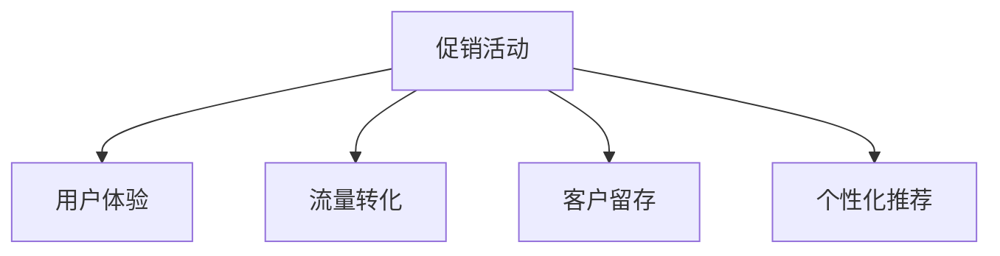
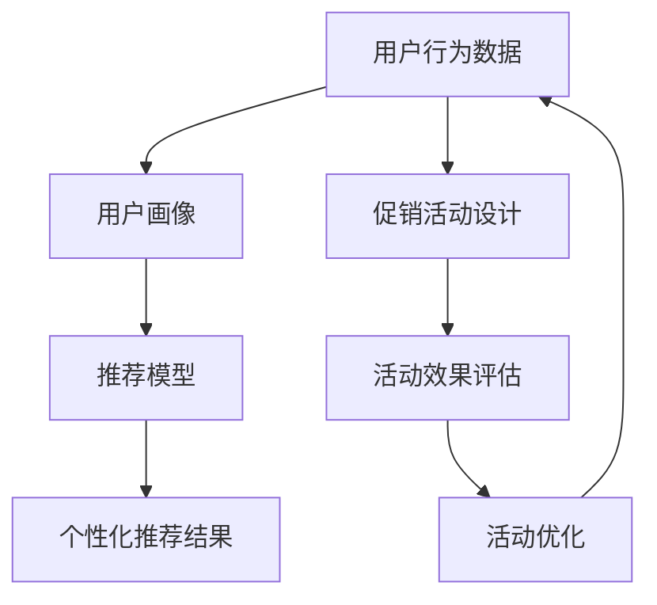

                 

# 短期策略：促销活动和优化用户体验

> 关键词：短期策略,促销活动,用户体验优化,流量转化,客户留存,个性化推荐

## 1. 背景介绍

### 1.1 问题由来

在互联网时代，电商平台的竞争愈发激烈。为了提升销售额，各平台纷纷推出各种促销活动，如打折促销、满减优惠、限时抢购等。然而，促销活动虽然短期内可以提升流量和转化，但长期来看，过度依赖活动策略可能带来负面影响，如品牌形象受损、客户信任度下降、流失率上升等。如何在促销活动中精准定位目标用户，最大化提升用户体验，同时避免潜在的负面效应，成为电商企业需要面对的重要挑战。

### 1.2 问题核心关键点

促销活动成功的关键在于精准定位目标用户、合理设计优惠策略、最大化提升用户体验、高效管理活动资源。本节将从这几个关键点出发，介绍如何通过技术手段提升促销活动的效果。

## 2. 核心概念与联系

### 2.1 核心概念概述

为更好地理解如何通过技术手段提升促销活动的效果，本节将介绍几个密切相关的核心概念：

- **促销活动（Promotions）**：指电商平台为了吸引用户购买，通过各种优惠方式（如折扣、满减、赠品等）进行推广的策略。
- **用户体验（User Experience, UX）**：指用户在使用产品或服务过程中的主观感受和体验。提升用户体验是电商企业长期发展的关键。
- **流量转化（Traffic Conversion）**：指将访问用户转化为实际购买用户的效率。
- **客户留存（Customer Retention）**：指维持现有客户，避免客户流失的能力。
- **个性化推荐（Personalized Recommendation）**：指根据用户的行为、兴趣和偏好，推荐符合其需求的商品或服务，提升用户体验和转化率。

这些核心概念之间的逻辑关系可以通过以下Mermaid流程图来展示：



该流程图展示了一些核心概念之间的相互影响关系：

1. **促销活动**直接影响**用户体验**，通过合理设计，可以提升用户满意度。
2. **促销活动**和**流量转化**密切相关，优质活动可以显著提升转化率。
3. **促销活动**对**客户留存**也有影响，合适的活动设计可以增强用户粘性。
4. **促销活动**与**个性化推荐**相辅相成，个性化推荐能够提高活动效果。

### 2.2 核心概念原理和架构的 Mermaid 流程图



此流程图展示了大促销活动和个性化推荐的核心概念原理及架构：

1. **用户行为数据**通过分析，形成**用户画像**。
2. **用户画像**作为输入，与**推荐模型**结合，生成**个性化推荐结果**。
3. **促销活动设计**，通过数据驱动，生成**促销活动方案**。
4. **促销活动方案**的效果通过**活动效果评估**进行评估。
5. **活动效果评估**结果指导**活动优化**，从而调整活动方案，进一步优化用户体验。

## 3. 核心算法原理 & 具体操作步骤
### 3.1 算法原理概述

在电商领域，促销活动和用户体验优化通常涉及以下算法原理：

1. **用户画像（User Persona）**：通过用户行为数据，建立用户画像，包括用户的年龄、性别、兴趣、消费行为等。用户画像有助于更精准地设计促销活动。
2. **个性化推荐（Personalization）**：利用协同过滤、内容推荐、基于图模型的推荐算法等，生成个性化的推荐结果，提升用户体验。
3. **A/B测试（A/B Testing）**：通过对比测试两个或多个活动方案，评估其效果，选择最优方案。
4. **流量分配（Traffic Allocation）**：合理分配广告预算，以最小的成本获取最大的流量和转化。
5. **客户分群（Customer Segmentation）**：将客户分为不同群体，针对不同群体设计差异化的促销活动。

### 3.2 算法步骤详解

以下是对电商促销活动和用户体验优化的算法步骤详解：

**Step 1: 用户行为数据收集**
- 使用追踪技术，收集用户的操作行为数据，如浏览、点击、购买等。
- 通过Web分析工具，如Google Analytics，收集用户访问量和页面停留时间等数据。

**Step 2: 用户画像建模**
- 利用机器学习算法，如聚类、关联规则挖掘等，对用户行为数据进行分析，形成用户画像。
- 用户画像中应包含用户的兴趣偏好、消费能力、购买意愿等关键特征。

**Step 3: 个性化推荐模型训练**
- 根据用户画像，选择合适的推荐算法，如协同过滤、深度学习等，训练推荐模型。
- 利用历史数据和用户行为数据，对推荐模型进行优化，使其能够生成更精准的个性化推荐结果。

**Step 4: 促销活动设计**
- 根据用户画像和推荐模型结果，设计促销活动方案，如折扣、满减、赠品等。
- 通过A/B测试，对比不同活动方案的效果，选择最优方案。

**Step 5: 流量分配与活动优化**
- 利用广告投放平台，如Facebook Ads，Google Ads，分配广告预算，进行流量投放。
- 实时监测流量和转化效果，根据数据调整广告投放策略和促销活动方案。
- 对用户行为数据进行持续分析，不断优化用户画像和推荐模型，提升促销活动效果。

### 3.3 算法优缺点

电商促销活动和用户体验优化算法具有以下优点：

1. **数据驱动**：通过用户行为数据，生成个性化的促销活动和推荐结果，提升用户体验。
2. **精准营销**：针对不同用户群体设计差异化活动，提高营销效果。
3. **实时优化**：通过持续监控和数据分析，实时调整活动方案，提高转化率和用户留存率。
4. **低成本高效益**：优化活动设计，减少浪费，提高广告投入的ROI。

同时，这些算法也存在以下局限性：

1. **数据隐私问题**：用户行为数据的收集和使用，可能涉及隐私问题。
2. **模型复杂度**：推荐模型和用户画像模型需要复杂算法和大量数据，模型构建成本较高。
3. **动态变化**：用户行为和市场环境不断变化，模型需要持续更新和调整。
4. **公平性问题**：个性化推荐可能引发不公平现象，部分用户无法获得推荐。

尽管存在这些局限性，但电商促销活动和用户体验优化的技术方法仍然是大规模推广和精准营销的重要手段。未来相关研究的重点在于如何进一步提升模型的实时性和泛化能力，优化隐私保护策略，确保活动的公平性和用户满意度。

### 3.4 算法应用领域

基于电商促销活动和用户体验优化的算法，已经在电商、金融、旅游等多个领域得到了广泛应用，具体如下：

- **电商**：通过个性化推荐和促销活动，提升用户购物体验和转化率。
- **金融**：利用用户行为数据，生成金融产品推荐，提升用户体验和产品销售。
- **旅游**：根据用户偏好，推荐旅游目的地和行程，提升用户出行体验。
- **教育**：根据学生学习行为，推荐个性化课程和教材，提升教育效果。
- **媒体**：通过个性化推荐，提升用户粘性和内容消费量。

除了上述这些应用领域，个性化推荐和促销活动的方法也被创新性地应用到更多场景中，如智慧家居、医疗健康、智能客服等，为各行业的数字化转型升级提供新的技术路径。

## 4. 数学模型和公式 & 详细讲解  
### 4.1 数学模型构建

本节将使用数学语言对电商促销活动和用户体验优化的过程进行更加严格的刻画。

设用户行为数据集为 $D=\{(x_i, y_i)\}_{i=1}^N$，其中 $x_i$ 为行为数据，$y_i$ 为标签，如点击、购买、收藏等。

定义用户画像为 $\mathcal{P}=\{p_i\}_{i=1}^M$，其中 $p_i$ 为第 $i$ 个用户画像，包含年龄、性别、兴趣、消费行为等特征。

定义推荐模型为 $M_{\theta}:\mathcal{P} \rightarrow [0,1]$，其中 $\theta$ 为模型参数，将用户画像映射为推荐概率。

定义促销活动方案为 $\mathcal{C}=\{c_j\}_{j=1}^K$，其中 $c_j$ 为第 $j$ 个促销活动，如满减、折扣、赠品等。

### 4.2 公式推导过程

以下我们将推导推荐模型的损失函数和个性化推荐公式。

假设用户 $i$ 在活动 $c_j$ 下的转化率为 $r_{i,j}$，则转化率可以表示为：

$$
r_{i,j} = M_{\theta}(p_i) \times c_j
$$

其中 $M_{\theta}(p_i)$ 表示用户画像 $p_i$ 在推荐模型下的推荐概率，$c_j$ 表示促销活动 $c_j$ 的效果系数。

个性化推荐的目标是最大化总转化率，即：

$$
\max_{\theta} \sum_{i=1}^N \sum_{j=1}^K r_{i,j}
$$

推荐模型的损失函数可以定义为：

$$
\mathcal{L}(\theta) = -\frac{1}{N}\sum_{i=1}^N \sum_{j=1}^K y_{i,j} \log M_{\theta}(p_i) \times c_j
$$

其中 $y_{i,j}$ 为活动 $c_j$ 对用户 $i$ 的实际转化率。

通过梯度下降等优化算法，最小化损失函数 $\mathcal{L}(\theta)$，即可得到最佳推荐模型参数 $\theta^*$。

### 4.3 案例分析与讲解

以某电商平台个性化推荐为例，假设某用户在浏览商品时，推荐模型预测其对某商品 $p$ 的推荐概率为 $M_{\theta}(p) = 0.8$，同时活动 $c$ 的效果系数为 $c = 1.2$。则用户在该活动下购买的概率为：

$$
r = M_{\theta}(p) \times c = 0.8 \times 1.2 = 0.96
$$

这意味着用户有96%的概率在活动 $c$ 下购买商品 $p$。

## 5. 项目实践：代码实例和详细解释说明
### 5.1 开发环境搭建

在进行电商促销活动和用户体验优化的实践前，我们需要准备好开发环境。以下是使用Python进行PyTorch开发的环境配置流程：

1. 安装Anaconda：从官网下载并安装Anaconda，用于创建独立的Python环境。

2. 创建并激活虚拟环境：
```bash
conda create -n pytorch-env python=3.8 
conda activate pytorch-env
```

3. 安装PyTorch：根据CUDA版本，从官网获取对应的安装命令。例如：
```bash
conda install pytorch torchvision torchaudio cudatoolkit=11.1 -c pytorch -c conda-forge
```

4. 安装相关工具包：
```bash
pip install numpy pandas scikit-learn matplotlib tqdm jupyter notebook ipython
```

完成上述步骤后，即可在`pytorch-env`环境中开始实践。

### 5.2 源代码详细实现

这里我们以个性化推荐为例，使用Transformers库进行电商推荐模型的开发。

首先，定义推荐模型：

```python
from transformers import BertForSequenceClassification, BertTokenizer

# 定义模型和分词器
model = BertForSequenceClassification.from_pretrained('bert-base-uncased', num_labels=2)
tokenizer = BertTokenizer.from_pretrained('bert-base-uncased')
```

然后，定义推荐模型评估函数：

```python
from sklearn.metrics import roc_auc_score

def evaluate(model, dataset, tokenizer):
    # 将数据集转换为模型输入格式
    input_ids = [tokenizer.encode(sample['text']) for sample in dataset]
    attention_mask = [[1] * len(ids) for ids in input_ids]

    # 计算预测结果
    outputs = model(torch.tensor(input_ids).long(), attention_mask=torch.tensor(attention_mask).long())
    probs = outputs.logits.sigmoid().numpy()
    
    # 计算AUC值
    auc = roc_auc_score(dataset['labels'], probs)
    return auc
```

接着，定义推荐模型训练函数：

```python
from transformers import AdamW

def train(model, dataset, batch_size, learning_rate):
    model.train()
    optimizer = AdamW(model.parameters(), lr=learning_rate)
    for epoch in range(epochs):
        for batch in dataset:
            input_ids = tokenizer.encode(batch['text'])
            attention_mask = [1] * len(input_ids)
            labels = batch['label']
            
            model.zero_grad()
            outputs = model(torch.tensor(input_ids).long(), attention_mask=torch.tensor(attention_mask).long(), labels=torch.tensor(labels).long())
            loss = outputs.loss
            loss.backward()
            optimizer.step()
    
    return model
```

最后，启动训练流程并在测试集上评估：

```python
from torch.utils.data import Dataset
from tqdm import tqdm

class RecommendationDataset(Dataset):
    def __init__(self, data):
        self.data = data
        self.tokenizer = tokenizer
        
    def __len__(self):
        return len(self.data)
    
    def __getitem__(self, idx):
        text = self.data[idx]['text']
        label = self.data[idx]['label']
        
        encoding = tokenizer(text, return_tensors='pt', padding='max_length', truncation=True)
        input_ids = encoding['input_ids']
        attention_mask = encoding['attention_mask']
        return {'input_ids': input_ids, 
                'attention_mask': attention_mask,
                'labels': torch.tensor(label)}

# 加载数据集
dataset = RecommendationDataset(data)

# 训练模型
model = train(model, dataset, batch_size, learning_rate)

# 评估模型
auc = evaluate(model, dataset, tokenizer)
print(f"AUC: {auc:.4f}")
```

以上就是使用PyTorch进行电商推荐模型的完整代码实现。可以看到，Transformers库提供了便捷的接口，可以轻松地将预训练模型用于电商推荐任务。

### 5.3 代码解读与分析

让我们再详细解读一下关键代码的实现细节：

**RecommendationDataset类**：
- `__init__`方法：初始化数据集和分词器。
- `__len__`方法：返回数据集的样本数量。
- `__getitem__`方法：对单个样本进行处理，将文本输入编码为token ids，进行padding，最终返回模型所需的输入。

**evaluate函数**：
- 将数据集转换为模型输入格式，进行前向传播计算预测结果。
- 计算预测结果的AUC值，评估模型性能。

**train函数**：
- 定义模型和优化器。
- 对数据集进行迭代训练，前向传播计算损失函数并反向传播更新模型参数。
- 重复上述过程直至模型收敛。

通过上述代码，我们可以快速搭建一个基于预训练语言模型的电商推荐系统，实现个性化推荐功能。

## 6. 实际应用场景
### 6.1 智能客服系统

智能客服系统利用电商推荐模型，根据用户之前的查询历史和行为数据，预测用户可能提出的问题，并提供相应的答案。这不仅可以提升用户体验，还可以减轻人工客服的工作负担，提高客服系统的响应速度和准确性。

具体实现时，智能客服系统可以集成电商推荐模型，在用户输入查询时，实时预测其可能的问题，并调用相应的问题库或专家系统，生成答案。如果系统无法准确预测用户问题，则可以提示用户重新输入，或由人工客服接手处理。

### 6.2 商品推荐引擎

商品推荐引擎利用电商推荐模型，根据用户的浏览、点击、购买等行为数据，生成个性化推荐结果。这可以提升用户对平台的粘性，提高销售额和客单价。

具体实现时，商品推荐引擎可以将用户的浏览历史、点击记录、购买记录等数据输入电商推荐模型，生成推荐结果。然后，将这些推荐结果展示给用户，如在网站首页、商品详情页等位置，提升用户的购买意愿。

### 6.3 营销活动策划

营销活动策划利用电商推荐模型，根据用户画像和行为数据，设计精准的促销活动。这可以提升活动的转化率和效果，降低营销成本。

具体实现时，营销活动策划系统可以集成电商推荐模型，对用户进行细分，如按照年龄、性别、兴趣等特征进行分组。然后，根据不同群体的特征，设计不同的促销活动，如针对年轻用户设计时尚折扣活动，针对高收入用户设计高端礼品活动等。最后，将活动方案通过网站、APP等渠道推送给用户，提升用户参与度和购买意愿。

### 6.4 未来应用展望

随着电商推荐模型的不断发展，其在电商领域的推广和应用将更加广泛。未来，电商推荐模型将与其他AI技术进行更深入的融合，如自然语言处理、计算机视觉、语音识别等，为电商行业带来更多的创新和突破。

在智慧医疗领域，电商推荐模型可以应用于疾病预测、用药推荐等场景，提升诊疗效果和用户满意度。在智能教育领域，电商推荐模型可以用于个性化学习路径设计、智能作业批改等，提升教育质量和学习效率。

除了电商领域，电商推荐模型还将广泛应用于金融、旅游、媒体、娱乐等众多领域，为各行各业带来数字化转型升级的新机遇。

## 7. 工具和资源推荐
### 7.1 学习资源推荐

为了帮助开发者系统掌握电商促销活动和用户体验优化的理论基础和实践技巧，这里推荐一些优质的学习资源：

1. **《深度学习与自然语言处理》（第二版）**：斯坦福大学李飞飞教授等人编写的经典教材，深入浅出地介绍了深度学习在NLP领域的应用，包括电商推荐模型。

2. **《推荐系统实战》**：亚马逊高级数据科学家编写的实战指南，详细介绍了推荐系统的设计、实现和优化方法，包括电商推荐模型。

3. **Kaggle电商推荐竞赛**：Kaggle平台上的电商推荐竞赛，提供了丰富的电商数据集和代码样例，适合初学者学习和实践。

4. **Transformers官方文档**：HuggingFace开发的NLP工具库官方文档，提供了详细的电商推荐模型实现和调参指南，适合深入学习。

5. **《Python数据科学手册》**：Python数据科学领域的经典书籍，涵盖数据预处理、模型训练、评估和调参等多个方面，适合初学者入门。

通过对这些资源的学习实践，相信你一定能够快速掌握电商推荐模型的精髓，并用于解决实际的电商问题。

### 7.2 开发工具推荐

高效的开发离不开优秀的工具支持。以下是几款用于电商促销活动和用户体验优化的常用工具：

1. **PyTorch**：基于Python的开源深度学习框架，灵活动态的计算图，适合快速迭代研究。大部分预训练语言模型都有PyTorch版本的实现。

2. **TensorFlow**：由Google主导开发的开源深度学习框架，生产部署方便，适合大规模工程应用。同样有丰富的预训练语言模型资源。

3. **Transformers库**：HuggingFace开发的NLP工具库，集成了众多SOTA语言模型，支持PyTorch和TensorFlow，是进行电商推荐模型开发的利器。

4. **Weights & Biases**：模型训练的实验跟踪工具，可以记录和可视化模型训练过程中的各项指标，方便对比和调优。与主流深度学习框架无缝集成。

5. **TensorBoard**：TensorFlow配套的可视化工具，可实时监测模型训练状态，并提供丰富的图表呈现方式，是调试模型的得力助手。

6. **Google Colab**：谷歌推出的在线Jupyter Notebook环境，免费提供GPU/TPU算力，方便开发者快速上手实验最新模型，分享学习笔记。

合理利用这些工具，可以显著提升电商推荐模型的开发效率，加快创新迭代的步伐。

### 7.3 相关论文推荐

电商推荐模型的发展源于学界的持续研究。以下是几篇奠基性的相关论文，推荐阅读：

1. **Wang et al.（2016）《Hierarchical Attention Networks for Document Classification》**：提出了层次化注意力网络，用于文本分类和推荐系统，获得了SOTA效果。

2. **He et al.（2017）《Deep Interest Network for Recommendation》**：提出了深度兴趣网络，用于个性化推荐，获得了NIPS 2017竞赛的SOTA结果。

3. **Seddah et al.（2018）《Graph Neural Network Approach to Recommender Systems》**：提出了图神经网络，用于推荐系统，获得了KDD 2018竞赛的SOTA结果。

4. **Chen et al.（2019）《Adversarial Collaborative Filtering》**：提出了对抗协同过滤算法，用于推荐系统，获得了SIGKDD 2019的SOTA结果。

5. **Chen et al.（2020）《Confidence-Based Recommendation via Weighted Attention Graph Networks》**：提出了信心基础推荐算法，用于推荐系统，获得了KDD 2020竞赛的SOTA结果。

这些论文代表了大电商推荐模型的发展脉络。通过学习这些前沿成果，可以帮助研究者把握学科前进方向，激发更多的创新灵感。

## 8. 总结：未来发展趋势与挑战

### 8.1 总结

本文对电商促销活动和用户体验优化的数学原理和实践技术进行了全面系统的介绍。首先阐述了电商促销活动和用户体验优化的背景和意义，明确了其在电商领域的重要性。其次，从原理到实践，详细讲解了个性化推荐和促销活动设计的数学模型和算法步骤，给出了电商推荐模型的完整代码实例。同时，本文还探讨了个性化推荐和促销活动在智能客服、商品推荐、营销活动等多个场景中的应用，展示了其广泛的应用前景。此外，本文精选了电商推荐模型的学习资源，力求为读者提供全方位的技术指引。

通过本文的系统梳理，可以看到，电商推荐模型在电商领域的应用已经相当成熟，能够在提升用户体验和销售额的同时，降低营销成本。未来，随着深度学习技术的不断发展，电商推荐模型的性能和应用范围将进一步提升，为电商企业带来更大的价值。

### 8.2 未来发展趋势

展望未来，电商推荐模型的发展趋势如下：

1. **深度学习的应用**：深度学习模型，如BERT、GPT等，将继续在电商推荐中发挥重要作用，提升模型的表现和效果。
2. **多模态融合**：电商推荐模型将更多地融合多模态数据，如图像、音频、视频等，提升推荐效果和用户体验。
3. **联邦学习**：电商推荐模型将采用联邦学习，在保护用户隐私的前提下，实现跨平台数据共享，提升推荐效果。
4. **个性化推荐技术**：电商推荐模型将采用更复杂的推荐算法，如因果推荐、图网络等，提升推荐的个性化和精准度。
5. **实时推荐系统**：电商推荐模型将向实时推荐方向发展，通过实时分析用户行为数据，实现动态推荐，提升用户粘性和转化率。

### 8.3 面临的挑战

尽管电商推荐模型已经取得了显著成果，但在其应用和发展过程中，仍然面临一些挑战：

1. **数据隐私问题**：用户行为数据的收集和使用，可能涉及隐私问题。如何在保护用户隐私的同时，提升推荐效果，是一个重要挑战。
2. **模型复杂度**：电商推荐模型的构建需要复杂算法和大量数据，模型构建成本较高。如何降低模型复杂度，提高模型训练和推理效率，是一个重要研究方向。
3. **动态变化**：用户行为和市场环境不断变化，模型需要持续更新和调整。如何在保持模型稳定性的同时，提升模型的适应性和实时性，是一个重要挑战。
4. **公平性问题**：个性化推荐可能引发不公平现象，部分用户无法获得推荐。如何在保证推荐公平性的同时，提升用户满意度，是一个重要研究方向。

尽管存在这些挑战，但电商推荐模型的发展潜力巨大，未来的研究和应用仍需不断努力，克服现有难题，才能更好地服务于电商领域。

### 8.4 研究展望

面对电商推荐模型所面临的挑战，未来的研究应在以下几个方向寻求新的突破：

1. **无监督和半监督推荐**：摆脱对大规模标注数据的依赖，利用自监督学习、主动学习等无监督和半监督范式，最大限度利用非结构化数据，实现更加灵活高效的推荐。
2. **计算高效的推荐模型**：开发更加计算高效的推荐模型，如层次化注意力网络、图神经网络等，减少计算资源消耗，提升推荐系统的实时性。
3. **多模态数据融合**：将符号化的先验知识，如知识图谱、逻辑规则等，与神经网络模型进行巧妙融合，引导推荐过程学习更准确、合理的推荐结果。
4. **因果分析和博弈论工具**：将因果分析方法引入推荐系统，识别出推荐决策的关键特征，增强推荐结果的因果性和逻辑性。借助博弈论工具刻画人机交互过程，主动探索并规避推荐系统的脆弱点，提高系统稳定性。
5. **伦理道德约束**：在推荐模型的训练目标中引入伦理导向的评估指标，过滤和惩罚有害的推荐结果，确保推荐系统的公平性和用户满意度。

这些研究方向的探索，将引领电商推荐模型迈向更高的台阶，为电商领域带来更大的价值。相信通过学界和产业界的共同努力，这些难题终将一一被克服，电商推荐模型必将更好地服务于电商行业，为经济社会发展注入新的动力。

## 9. 附录：常见问题与解答

**Q1：电商推荐模型如何处理冷启动用户？**

A: 冷启动用户指的是平台上的新用户，由于缺乏行为数据，直接使用电商推荐模型无法产生有效的推荐结果。针对冷启动用户，可以采用以下几种策略：

1. **基于用户兴趣的推荐**：利用用户的兴趣标签、搜索关键词等，生成初步的推荐结果。
2. **基于商品属性的推荐**：根据商品的属性特征，生成初步的推荐结果。
3. **基于热门商品推荐**：向新用户推荐当前热门商品，提高用户粘性。
4. **基于社交网络的推荐**：利用新用户的社交网络信息，生成初步的推荐结果。

通过以上几种策略，可以在用户行为数据不足的情况下，快速生成推荐结果，提升用户满意度。

**Q2：如何评估电商推荐模型的效果？**

A: 电商推荐模型的效果评估可以从多个维度进行，以下是常用的几个指标：

1. **点击率（CTR）**：用户点击推荐的商品或页面的概率，是衡量推荐效果的重要指标。
2. **转化率（CR）**：用户点击推荐商品并实际购买或使用的概率，是衡量推荐效果的核心指标。
3. **覆盖率（CC）**：推荐商品或页面覆盖所有可能商品的概率，衡量推荐系统的全面性。
4. **多样性（D）**：推荐商品或页面的多样性，衡量推荐系统的丰富度。
5. **新颖性（N）**：推荐商品或页面的新颖性，衡量推荐系统的创新性。

这些指标可以通过A/B测试、离线评估、实时监控等手段进行评估，以全面了解推荐模型的性能。

**Q3：电商推荐模型在训练过程中如何避免过拟合？**

A: 电商推荐模型在训练过程中容易过拟合，尤其是在数据集较小的情况下。以下是一些避免过拟合的策略：

1. **数据增强**：通过数据增强技术，如回译、近义替换等方式扩充训练集，增加模型泛化能力。
2. **正则化**：使用L2正则、Dropout等技术，防止模型过度拟合训练数据。
3. **早停策略**：设置早停阈值，当验证集误差不再下降时停止训练，避免过拟合。
4. **参数共享**：通过参数共享技术，减少模型复杂度，防止过拟合。
5. **对抗训练**：加入对抗样本，提高模型鲁棒性，减少过拟合风险。

这些策略可以结合使用，根据具体任务和数据特点进行灵活调整，以最大限度地避免电商推荐模型在训练过程中的过拟合现象。

**Q4：电商推荐模型在实际应用中需要注意哪些问题？**

A: 将电商推荐模型转化为实际应用，还需要考虑以下问题：

1. **推荐系统架构**：推荐系统通常采用多种模型进行融合，如协同过滤、内容推荐等，需要设计合理的架构以提升效果。
2. **推荐算法选择**：不同用户群体和不同场景下的推荐算法可能不同，需要根据实际情况选择合适的算法。
3. **模型参数调整**：推荐模型的参数需要持续调整，以适应市场环境的变化。
4. **用户行为监控**：需要实时监控用户行为数据，及时调整推荐策略。
5. **推荐结果反馈**：需要收集用户对推荐结果的反馈，持续优化模型性能。

通过合理设计和持续优化，电商推荐模型可以在实际应用中实现良好的效果，提升用户体验和销售额。

---

作者：禅与计算机程序设计艺术 / Zen and the Art of Computer Programming

