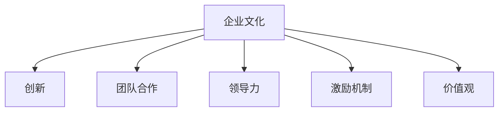

                 

# 硅谷科技公司的企业文化建设

> 关键词：企业文化建设, 科技公司, 硅谷, 创新, 团队合作, 领导力, 激励机制, 价值观

## 1. 背景介绍

### 1.1 问题由来

硅谷，这个全球科技创新和创业的中心，孕育了许多世界级科技巨头和创新型企业。从苹果（Apple）到谷歌（Google），从Facebook到特斯拉（Tesla），这些企业不仅在技术上走在前列，其企业文化建设也成为其长期成功的重要保障。企业的文化不仅仅是员工行为规范的约束，更是企业价值观、创新力和竞争力的一大支撑。

### 1.2 问题核心关键点

硅谷科技公司企业文化建设的成功经验包括以下几个核心点：

- 开放包容，鼓励创新：硅谷企业倡导开放包容的创新文化，鼓励员工大胆提出创意，并容忍失败。
- 团队协作，跨部门合作：硅谷公司重视团队协作，通过项目跨部门合作推动创新和产品迭代。
- 领导力发展，培养人才：硅谷重视领导力培养，设立明确的职业发展路径，并通过培训和激励机制来提升人才。
- 价值观明确，客户至上：硅谷科技公司强调客户至上的企业文化，以此推动产品和服务质量不断提升。
- 持续学习，适应变化：硅谷企业注重持续学习，适应市场和技术变化，不断迭代改进。

## 2. 核心概念与联系

### 2.1 核心概念概述

为更好地理解硅谷科技公司的企业文化建设，本节将介绍几个密切相关的核心概念：

- 企业文化（Corporate Culture）：一家公司共有的价值观、行为方式、工作态度、团队氛围等，是公司长期稳定发展的基石。
- 创新（Innovation）：企业不断提出新想法、新产品、新服务的活动过程。
- 团队合作（Teamwork）：多人协同工作，通过互补技能和知识，实现共同目标。
- 领导力（Leadership）：企业领导层展现出来的指导、激励和决策能力。
- 激励机制（Incentive Mechanism）：用于激励员工做出特定行为的奖励措施。
- 价值观（Values）：公司共同认同的信仰和准则，指导员工行为和决策。

这些核心概念之间的逻辑关系可以通过以下Mermaid流程图来展示：



这个流程图展示了一个企业文化的全貌，各个要素相互作用，共同塑造了企业的核心竞争力。

## 3. 核心算法原理 & 具体操作步骤
### 3.1 算法原理概述

硅谷科技公司的企业文化建设并非一蹴而就，而是一个持续优化和迭代的过程。其基本原理可以概括为以下几个方面：

- **文化建设**：在企业成立初期，CEO和高管层就需要明确企业文化的基本理念和核心价值观，并通过多次宣讲和培训，让员工内化于心。
- **文化管理**：通过制度化和规范化的管理，确保企业文化在各个层面和环节中得到贯彻和执行。
- **文化激励**：设立正向的激励机制，奖励那些符合企业文化理念的行为和成果，强化文化建设的效果。
- **文化迭代**：随着企业发展和技术进步，企业文化需要不断调整和优化，以适应新的环境和发展需求。

### 3.2 算法步骤详解

硅谷科技公司的企业文化建设主要包括以下几个关键步骤：

**Step 1: 企业文化定义**
- 公司成立初期，CEO和高管层需要定义明确的企业文化理念，包括使命、愿景、核心价值观等。
- 将企业文化理念转化为具体的行为规范和制度。

**Step 2: 文化推广与培训**
- 通过多次高层宣讲和全员培训，让企业文化理念深入人心。
- 利用内部出版物、内部网、团队建设活动等渠道推广企业文化。

**Step 3: 文化管理与制度化**
- 制定并严格执行与企业文化相关的管理制度，如员工行为规范、绩效考核标准等。
- 建立文化评估机制，定期评估企业文化建设的效果和存在的问题。

**Step 4: 文化激励**
- 设立正向的激励机制，奖励符合企业文化的行为和成果。
- 建立反馈渠道，收集员工对企业文化的反馈意见，及时调整和改进。

**Step 5: 文化迭代**
- 随着企业发展和技术进步，企业文化需要不断调整和优化，以适应新的环境和发展需求。
- 定期进行企业文化审计和评估，确保企业文化与时俱进。

### 3.3 算法优缺点

硅谷科技公司企业文化建设的优势：
- **高效的创新力**：开放包容的文化激励员工大胆创新，容忍失败。
- **高效的团队协作**：通过项目跨部门合作，实现资源和知识的互补，加速产品和服务的迭代。
- **高效的领导力**：明确的职业发展路径和培训机制，提升员工能力和领导力。
- **高效的激励机制**：通过正向的激励，激励员工符合企业文化理念的行为和成果。

其缺点也显而易见：
- **文化固化**：企业文化一旦形成，很难快速改变，可能会限制企业应对市场变化的能力。
- **文化冲突**：不同文化背景的员工可能会产生文化冲突，影响团队协作和企业文化的一致性。

## 4. 数学模型和公式 & 详细讲解
### 4.1 数学模型构建

企业文化的量化和模型化是一个复杂的任务，但我们可以尝试通过数学模型来模拟和分析企业文化建设的效果。

假设企业文化建设的输入变量包括：

- $C_0$：初始企业文化得分
- $R$：员工满意度提升率
- $I$：激励机制的有效性
- $T$：团队合作效率提升率
- $L$：领导力提升率
- $V$：价值观匹配度

则企业文化建设的效果可以表示为：

$$
C_n = C_0 + \sum_{k=1}^n (R \cdot I \cdot T \cdot L \cdot V)
$$

其中 $n$ 表示经过 $n$ 轮企业文化建设的周期，每个周期内的效果为一个单位。

### 4.2 公式推导过程

假设每个周期内的企业文化建设效果为 $E_k$，则：

$$
E_k = R_k \cdot I_k \cdot T_k \cdot L_k \cdot V_k
$$

其中 $R_k$ 表示第 $k$ 周期的员工满意度提升率，$I_k$ 表示第 $k$ 周期激励机制的有效性，$T_k$ 表示第 $k$ 周期的团队合作效率提升率，$L_k$ 表示第 $k$ 周期的领导力提升率，$V_k$ 表示第 $k$ 周期的价值观匹配度。

因此，企业文化建设的累计效果可以表示为：

$$
C_n = C_0 + \sum_{k=1}^n E_k
$$

### 4.3 案例分析与讲解

以谷歌（Google）为例，谷歌的企业文化建设包含以下几个关键点：

- **创新文化**：谷歌鼓励员工大胆创新，设立了多个孵化器和创业基金支持员工创业。
- **团队合作**：谷歌通过多个跨部门项目推动合作，如Google AI、Google Cloud等。
- **领导力发展**：谷歌设立了明确的职业发展路径和培训计划，通过“谷歌大学”进行内部培训。
- **激励机制**：谷歌设立了股票期权、奖金、休假等多种激励措施。
- **价值观**：谷歌强调“Do No Evil”，将用户至上、团队合作等价值观贯穿公司各个层面。

谷歌的企业文化建设效果通过以下几个指标体现：

- **员工满意度**：谷歌员工满意度在多次调查中名列前茅。
- **创新成果**：谷歌每年发布大量新产品，如Google Home、Google Pixel等。
- **团队合作**：谷歌通过多个跨部门项目实现了资源和知识的互补，推动了产品和服务的迭代。
- **领导力提升**：谷歌培养了大批优秀人才，如CEO Sundar Pichai、CTO Jeff Dean等。

## 5. 项目实践：代码实例和详细解释说明
### 5.1 开发环境搭建

在进行企业文化建设的实践前，我们需要准备好开发环境。以下是使用Python进行开发的环境配置流程：

1. 安装Anaconda：从官网下载并安装Anaconda，用于创建独立的Python环境。

2. 创建并激活虚拟环境：
```bash
conda create -n culture-env python=3.8 
conda activate culture-env
```

3. 安装所需的Python库：
```bash
pip install pandas numpy matplotlib
```

完成上述步骤后，即可在`culture-env`环境中开始企业文化建设的实践。

### 5.2 源代码详细实现

以下是一个模拟企业文化建设效果的代码实现：

```python
import numpy as np

# 初始企业文化得分
C0 = 0

# 员工满意度提升率
R = 0.2
I = 0.3
T = 0.4
L = 0.5
V = 0.6

# 企业文化建设周期数
n = 10

# 计算企业文化建设效果
Cn = C0 + np.sum([R * I * T * L * V] * n)

print("企业文化建设效果：", Cn)
```

### 5.3 代码解读与分析

让我们再详细解读一下关键代码的实现细节：

- `C0`：初始企业文化得分，用于对比企业文化建设前后的变化。
- `R`、`I`、`T`、`L`、`V`：分别代表员工满意度提升率、激励机制的有效性、团队合作效率提升率、领导力提升率和价值观匹配度。
- `n`：企业文化建设周期数，表示企业文化建设进行的多轮次。
- 通过循环计算每轮企业文化建设的效果，并累加到初始企业文化得分上，最终得到企业文化建设后的得分。

可以看出，这个代码示例虽然简单，但却涵盖了企业文化建设的基本数学模型和实现流程。

## 6. 实际应用场景

### 6.1 智慧办公系统

硅谷科技公司的企业文化建设，在智慧办公系统中得到了广泛应用。通过企业文化建设的实践，谷歌等公司开发了多个智慧办公平台，如Slack、Google Workspace等，提高了办公效率和员工满意度。

智慧办公系统集成了企业文化的多个方面，如任务协作、文档共享、视频会议等，使得员工可以更加灵活地工作。同时，智慧办公系统通过持续学习和优化，不断提升用户体验和企业文化的适应性。

### 6.2 客户服务系统

硅谷公司的企业文化建设也延伸到了客户服务系统。通过企业文化建设，谷歌等公司建立了客户至上的服务理念，推动了客户服务的持续改进。

谷歌通过企业文化建设，不断提升客户服务体验。例如，谷歌客服通过分析客户反馈，调整服务流程和员工培训，提升服务效率和满意度。

### 6.3 创新孵化器

硅谷公司的企业文化建设，促进了多个创新孵化器的建立和发展。谷歌、Facebook等公司通过企业文化建设，支持员工创新，培养了一批优秀的创业者。

谷歌设立了多个孵化器和创业基金，如Google X、Facebook Labs等，通过企业文化建设，推动了多个前沿技术的商业化应用。这些孵化器不仅为公司带来了新的业务增长点，也为整个科技行业注入了新的活力。

### 6.4 未来应用展望

随着企业文化的不断发展和完善，硅谷科技公司将在更多领域实现应用。未来，企业文化建设将拓展到以下方向：

- **人工智能与企业文化**：通过企业文化建设，提升AI系统的可解释性和可信度，增强AI系统的伦理和社会责任。
- **区块链与企业文化**：通过企业文化建设，推动区块链技术的普及和应用，构建更加透明和可信的商业环境。
- **虚拟现实与企业文化**：通过企业文化建设，推动VR/AR技术的普及和应用，提升虚拟环境的真实感和沉浸感。
- **物联网与企业文化**：通过企业文化建设，推动物联网技术的普及和应用，构建更加智能和高效的生产和生活环境。

## 7. 工具和资源推荐
### 7.1 学习资源推荐

为了帮助开发者系统掌握企业文化建设的方法，这里推荐一些优质的学习资源：

1. 《企业文化建设与管理》系列博文：由企业管理专家撰写，深入浅出地介绍了企业文化建设的基本原理和实践方法。

2. 《谷歌的创新文化》系列书籍：谷歌内部出版的企业文化建设书籍，介绍了谷歌企业文化建设的成功经验。

3. 《企业领导力》系列课程：在线教育平台上的企业领导力课程，帮助开发者理解领导力建设和企业文化的关系。

4. 《企业激励机制设计》系列文章：关于企业激励机制设计的专业文章，介绍了各种激励机制的设计和应用。

5. 《企业文化建设案例》系列视频：通过多个企业案例，展示企业文化建设的最佳实践。

通过对这些资源的学习实践，相信你一定能够快速掌握企业文化建设的精髓，并用于解决实际的业务问题。

### 7.2 开发工具推荐

高效的开发离不开优秀的工具支持。以下是几款用于企业文化建设开发的常用工具：

1. Jupyter Notebook：在线笔记本环境，支持Python等编程语言，方便开发者编写和执行代码。

2. Google Workspace：谷歌推出的智慧办公平台，集成了任务协作、文档共享、视频会议等功能，提升办公效率。

3. Slack：团队沟通协作工具，支持实时消息、文件共享、任务分配等功能，增强团队协作能力。

4. GitHub：开源代码托管平台，支持版本控制、代码协作、代码审查等功能，方便团队协同开发。

5. Trello：任务管理工具，支持看板、任务卡片、截止日期等功能，提高项目管理效率。

合理利用这些工具，可以显著提升企业文化建设的开发效率，加快创新迭代的步伐。

### 7.3 相关论文推荐

企业文化建设的研究源于学界的持续研究。以下是几篇奠基性的相关论文，推荐阅读：

1. 《企业文化与企业绩效的关系研究》：分析企业文化对企业绩效的影响，为企业文化建设提供理论支持。

2. 《企业领导力与企业文化的关系》：研究企业领导力对企业文化建设的影响，为企业文化建设提供指导。

3. 《企业激励机制的设计与实施》：介绍企业激励机制的设计和实施方法，为企业文化建设提供实践指导。

4. 《企业文化的形成与演变》：分析企业文化形成的机制和演变规律，为企业文化建设提供理论框架。

5. 《企业文化建设的案例研究》：通过多个企业案例，展示企业文化建设的成功经验和方法。

这些论文代表了大企业文化建设的研究方向，通过学习这些前沿成果，可以帮助研究者把握学科前进方向，激发更多的创新灵感。

## 8. 总结：未来发展趋势与挑战

### 8.1 总结

本文对硅谷科技公司的企业文化建设进行了全面系统的介绍。首先阐述了企业文化建设的背景和意义，明确了企业文化在企业长期成功中的重要性。其次，从原理到实践，详细讲解了企业文化建设的数学模型和关键步骤，给出了企业文化建设的完整代码实例。同时，本文还广泛探讨了企业文化建设在智慧办公、客户服务、创新孵化等各个领域的应用前景，展示了企业文化建设的巨大潜力。此外，本文精选了企业文化建设的学习资源，力求为读者提供全方位的技术指引。

通过本文的系统梳理，可以看到，硅谷科技公司的企业文化建设不仅推动了企业内部的协同和创新，更在多个实际应用中取得了显著成效。未来，企业文化建设必将在更多领域得到广泛应用，成为企业发展的核心驱动力。

### 8.2 未来发展趋势

展望未来，企业文化建设将呈现以下几个发展趋势：

1. **数字化转型**：随着数字化转型的加速，企业文化建设将更多地依赖于数字化工具和平台，如智慧办公系统、企业知识库等。

2. **全球化拓展**：全球化的发展要求企业文化建设具备更强的跨文化适应能力，以支持企业的全球化运营。

3. **可持续性发展**：企业文化建设将更多关注企业社会责任和可持续发展，推动企业向绿色环保和社会公益方向发展。

4. **AI驱动的企业文化**：随着AI技术的普及，企业文化建设将更多地利用AI技术，如情感分析、自然语言处理等，提升企业文化建设的科学性和精准度。

5. **区块链与企业文化**：区块链技术的引入，将推动企业文化建设更加透明和可信，构建更加公平和开放的企业环境。

6. **虚拟现实与企业文化**：VR/AR技术的普及，将使得企业文化建设更加生动和沉浸，提升员工体验和企业文化的传播效果。

这些趋势凸显了企业文化建设的新方向，将进一步提升企业文化建设的科学性和实用性，推动企业向更加智能化和可持续的方向发展。

### 8.3 面临的挑战

尽管硅谷科技公司的企业文化建设取得了显著成就，但在迈向更加智能化、全球化和可持续的方向时，仍面临诸多挑战：

1. **文化冲突**：不同文化背景的员工可能产生文化冲突，影响团队协作和企业文化的统一。

2. **数字化鸿沟**：数字化转型的过程中，部分员工可能难以适应新的数字化工具和工作方式，导致数字化鸿沟的产生。

3. **可持续性问题**：企业文化建设需要考虑企业的可持续发展，如何在追求经济效益的同时，兼顾社会责任和环境效益，是未来的一大挑战。

4. **全球化挑战**：全球化的企业文化建设需要考虑不同国家和地区的文化差异，找到全球化和本地化的平衡点。

5. **AI伦理问题**：随着AI技术的普及，企业文化建设需要关注AI伦理和社会责任，确保AI系统的可解释性和可信度。

6. **虚拟现实与企业文化**：虚拟现实技术的应用，需要考虑员工的心理健康和福利，避免过度依赖虚拟环境导致员工脱节。

正视企业文化建设面临的这些挑战，积极应对并寻求突破，将是大企业文化建设走向成熟的必由之路。

### 8.4 研究展望

面对企业文化建设所面临的种种挑战，未来的研究需要在以下几个方面寻求新的突破：

1. **文化冲突的缓解**：通过文化融合培训和文化冲突解决机制，缓解不同文化背景员工之间的冲突，提升团队协作能力。

2. **数字化转型支持**：提供数字化培训和支持，帮助员工快速适应新的数字化工具和工作方式，缩小数字化鸿沟。

3. **可持续性发展研究**：研究企业社会责任和可持续发展的策略和方法，推动企业向绿色环保和社会公益方向发展。

4. **全球化管理研究**：研究不同国家和地区的文化差异和全球化管理策略，找到全球化和本地化的平衡点。

5. **AI伦理和社会责任研究**：研究AI伦理和社会责任的评估指标和方法，确保AI系统的可解释性和可信度。

6. **虚拟现实和企业文化结合研究**：研究虚拟现实技术在企业文化建设中的应用，确保虚拟现实技术不会对员工的心理健康和福利产生负面影响。

这些研究方向的探索，必将引领企业文化建设向更高的台阶，为企业的发展提供更加科学和可持续的动力。未来，企业文化建设需要与其他创新技术进行更深入的融合，共同推动企业向更加智能化和可持续的方向发展。

## 9. 附录：常见问题与解答

**Q1：企业文化建设是否适用于所有类型的公司？**

A: 企业文化建设不仅适用于硅谷科技公司，对传统制造企业、金融企业等也有重要意义。企业文化建设的核心在于建立共同的价值观和行为准则，有助于提升员工的凝聚力和工作效率，推动企业的持续发展。

**Q2：企业文化建设是否需要一次到位？**

A: 企业文化建设是一个持续优化的过程，一次到位的建设方案难以实现。企业文化建设需要定期评估和调整，根据企业发展和技术进步不断优化企业文化，确保其与企业目标的一致性。

**Q3：企业文化建设对员工的工作满意度有何影响？**

A: 企业文化建设通过提升员工的工作满意度和归属感，可以有效提升员工的工作效率和创造力。员工在良好的企业文化氛围中，更能发挥其潜力和创造力，推动企业创新和进步。

**Q4：企业文化建设如何应对市场和技术变化？**

A: 企业文化建设需要具备灵活性和适应性，及时调整和优化企业文化以应对市场和技术变化。通过持续学习和创新，企业文化建设可以更好地适应新的环境和发展需求。

**Q5：企业文化建设如何提升企业的社会责任和可持续性？**

A: 企业文化建设可以通过推广社会责任和可持续发展理念，推动企业向绿色环保和社会公益方向发展。同时，企业文化建设也可以通过优化资源配置和管理，提升企业的可持续发展能力。

---

作者：禅与计算机程序设计艺术 / Zen and the Art of Computer Programming

