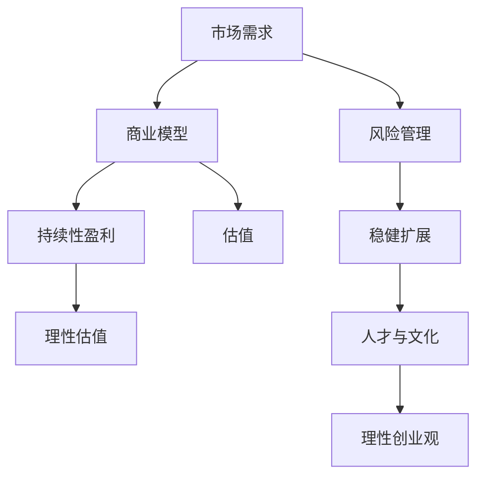

                 

# 硅谷科技泡沫的教训:理性创业观

## 1. 背景介绍

### 1.1 问题由来
硅谷，作为全球科技创新与创业的热土，长期以来以科技泡沫著称。自20世纪90年代末互联网泡沫破裂以来，硅谷经历了数次科技泡沫，如2000年的互联网泡沫、2010年的社交媒体泡沫、2018年的区块链泡沫等。这些泡沫不仅是资金和市场的疯狂，更反映了深层次的创业文化与商业逻辑问题。

科技泡沫不仅对投资者造成巨大损失，也对创业者和企业造成了严重冲击。历史上一些大公司如雅虎、思科等在泡沫破裂后元气大伤，错过转型的黄金期。这些教训告诫我们，科技创新应遵循理性和谨慎，不能被短期的资本狂热所左右。

### 1.2 问题核心关键点
科技泡沫的教训告诉我们，理性创业观应包含以下关键点：

1. **市场需求驱动**：真正的创新来自于用户真实需求，而非过分追求新奇与技术堆砌。
2. **持续性盈利**：商业模型的可持续性是科技创业的基石，不能依赖市场炒作。
3. **理性估值**：正确评估公司价值，避免资本市场的无理性炒作。
4. **风险管理**：全面识别和管理创业过程中的各种风险，包括市场风险、技术风险、管理风险等。
5. **稳健扩展**：保持公司财务的稳健性，防止过度扩张引发的财务危机。
6. **人才与文化**：创业团队应注重人才选拔和企业文化建设，打造长期发展的团队。

## 2. 核心概念与联系

### 2.1 核心概念概述

本节将介绍几个与科技泡沫和理性创业观密切相关的核心概念：

- **科技泡沫**：指在特定时期内，由于市场预期和投机炒作导致资产价格严重偏离实际价值的现象。硅谷的科技泡沫多发生在新兴技术或热潮中。

- **市场需求**：指消费者、企业等市场主体对产品或服务的需求量和愿意支付的价格。

- **商业模型**：指企业如何识别并满足市场需求，以及如何从商业活动中获取收入和利润的策略。

- **估值**：指投资者根据企业的财务表现、市场趋势、行业地位等因素，对企业未来现金流的预测和折现，确定企业市场价值。

- **风险管理**：指企业识别、评估和管理可能对企业目标产生负面影响的各种风险的策略和方法。

- **稳健扩展**：指企业在保持财务健康的前提下，逐步增加市场份额和业务规模的过程。

- **人才与文化**：指创业团队在人才选拔和企业文化建设方面的策略，以打造具有吸引力和长期发展潜力的团队。

这些概念之间的逻辑关系可以通过以下Mermaid流程图来展示：



这个流程图展示了大语言模型的核心概念及其之间的关系：

1. 市场需求驱动企业识别商业模型。
2. 商业模型决定了企业的持续性盈利和估值方式。
3. 持续性盈利和估值应理性客观，防止泡沫。
4. 风险管理是企业稳健扩展的前提。
5. 稳健扩展需要持续的人才和文化支持。
6. 合理的人才与文化是理性创业观的核心。

## 3. 核心算法原理 & 具体操作步骤
### 3.1 算法原理概述

理性创业观的核心在于理性和稳妥的商业决策。其核心算法原理包括：

- **市场需求评估**：通过数据分析、市场调研等手段，识别真实用户需求，避免基于炒作而非需求的技术创新。
- **商业模型设计**：根据市场需求，设计合理的商业模式，确保持续盈利。
- **估值合理化**：使用科学的方法评估公司价值，避免无理性的市场炒作。
- **风险全面管理**：识别和评估创业过程中各种风险，并采取措施降低风险。
- **稳健扩展**：在保持财务健康的前提下，逐步扩展业务规模。
- **人才与文化建设**：选拔优秀人才，营造有利于长期发展的企业文化。

### 3.2 算法步骤详解

以下是理性创业观的详细步骤：

**Step 1: 市场需求评估**
- 进行详细的市场调研，收集用户反馈，分析行业趋势，识别真实需求。
- 使用问卷调查、用户访谈等方法，量化需求规模和强度。
- 分析竞争对手，评估市场容量和增长潜力。

**Step 2: 商业模型设计**
- 根据市场需求，设计可持续的商业模式。例如：SaaS、订阅制、软件即服务、广告收入等。
- 考虑业务扩张模式，包括产品多元化、市场细分、地理扩展等。
- 设定明确的财务目标和收入预测。

**Step 3: 估值合理化**
- 使用DCF（折现现金流法）、PS（市盈率）、EV（企业价值）等方法，合理评估公司价值。
- 定期进行财务审计，确保财务报表的真实性。
- 关注市场动态，及时调整估值模型。

**Step 4: 风险全面管理**
- 识别潜在的市场、技术、法律等风险。
- 制定风险管理计划，包括保险、合同、法律咨询等。
- 定期评估风险状态，采取措施降低风险。

**Step 5: 稳健扩展**
- 保持合理的资本结构，避免过度借贷。
- 增加产品或服务线，提升市场竞争力。
- 逐步增加市场份额，避免过度扩张引发的财务危机。

**Step 6: 人才与文化建设**
- 选拔具有专业知识、经验和团队协作能力的优秀人才。
- 营造尊重知识、鼓励创新的企业文化。
- 提供良好的工作环境和激励机制，留住人才。

### 3.3 算法优缺点

理性创业观的优点在于：

1. **稳健性**：基于市场需求和可持续商业模式，避免泡沫风险。
2. **可持续性**：注重持续盈利，确保企业长期发展。
3. **科学性**：使用科学估值方法，合理评估企业价值。
4. **全面性**：全面管理各类风险，确保企业稳健扩展。

缺点在于：

1. **缓慢性**：由于谨慎决策，可能需要较长的时间来验证和实施商业模式。
2. **保守性**：过于保守可能导致错失市场机会。
3. **复杂性**：需要全面的市场和财务分析，对团队和资源要求较高。

### 3.4 算法应用领域

理性创业观的核心算法适用于各种创业场景，特别是对资金和市场依赖性较大的科技行业。其应用领域包括：

1. **互联网创业**：如电子商务、社交媒体、在线教育等。
2. **科技初创公司**：如人工智能、大数据、生物科技等。
3. **软件公司**：如SaaS、云服务、应用软件等。
4. **新兴技术创业**：如区块链、物联网、虚拟现实等。

## 4. 数学模型和公式 & 详细讲解 & 举例说明（备注：数学公式请使用latex格式，latex嵌入文中独立段落使用 $$，段落内使用 $)
### 4.1 数学模型构建

本节将使用数学语言对理性创业观的评估和估值方法进行更加严格的刻画。

记市场需求为 $D$，商业模型为 $M$，盈利能力为 $R$，估值结果为 $V$。假设市场需求 $D$ 遵循正态分布 $N(\mu, \sigma^2)$，商业模型 $M$ 的盈利能力 $R$ 为 $R(D)$，估值模型为 $V(D, R)$。

### 4.2 公式推导过程

假设市场需求 $D$ 服从正态分布 $N(\mu, \sigma^2)$，商业模型 $M$ 的盈利能力 $R(D)$ 为线性函数，即 $R(D) = aD + b$。其中 $a$ 和 $b$ 为常数。则估值模型 $V(D, R)$ 可以表示为：

$$
V(D, R) = R(D) \times \text{PS} + \text{EV}
$$

其中 $\text{PS}$ 为市盈率，$\text{EV}$ 为企业价值。假设 $\text{PS} = 10$，则有：

$$
V(D, R) = (aD + b) \times 10 + \text{EV}
$$

根据市场需求 $D$ 的分布，计算出不同需求水平下的盈利能力 $R(D)$ 和估值结果 $V(D, R)$。

### 4.3 案例分析与讲解

假设某初创公司专注于在线教育市场，市场需求 $D$ 服从 $N(10000, 5000)$，商业模型 $M$ 的盈利能力 $R(D) = 0.1D + 50$。使用上述公式计算估值：

$$
V(D, R) = (0.1D + 50) \times 10 + \text{EV}
$$

计算不同市场需求水平下的估值：

- 当 $D = 10000$ 时，$R = 0.1 \times 10000 + 50 = 1050$，$V = 10 \times 1050 + \text{EV}$
- 当 $D = 12000$ 时，$R = 0.1 \times 12000 + 50 = 1210$，$V = 10 \times 1210 + \text{EV}$

通过市场需求和盈利能力的关系，可以得出在不同市场需求下的估值变化。

## 5. 项目实践：代码实例和详细解释说明
### 5.1 开发环境搭建

在进行理性创业观的评估和估值实践前，我们需要准备好开发环境。以下是使用Python进行理性创业观评估的开发环境配置流程：

1. 安装Anaconda：从官网下载并安装Anaconda，用于创建独立的Python环境。

2. 创建并激活虚拟环境：
```bash
conda create -n rca-env python=3.8 
conda activate rca-env
```

3. 安装必要的Python包：
```bash
pip install numpy scipy pandas scikit-learn statsmodels matplotlib seaborn
```

4. 准备数据集：
```bash
# 准备市场需求数据
import pandas as pd
df = pd.read_csv('demand_data.csv')

# 准备商业模型参数
profit_model = lambda x: 0.1 * x + 50
```

完成上述步骤后，即可在`rca-env`环境中开始理性创业观的评估实践。

### 5.2 源代码详细实现

以下是使用Python计算理性创业观估值的具体代码实现：

```python
import numpy as np
from scipy.stats import norm

# 市场需求分布参数
mu = 10000
sigma = 5000

# 商业模型参数
profit_rate = 0.1
base_profit = 50
ps = 10

# 计算不同市场需求下的盈利能力和估值
market_demands = np.arange(5000, 20000, 1000)
profits = [profit_rate * demand + base_profit for demand in market_demands]
valuations = [ps * profit for profit in profits]

# 绘制市场需求-估值曲线
plt.plot(market_demands, valuations, 'o-', label='市场需求与估值')
plt.xlabel('市场需求')
plt.ylabel('估值')
plt.title('市场需求与估值关系')
plt.legend()
plt.show()
```

这个代码实现了计算不同市场需求下的盈利能力和估值，并通过Matplotlib绘制市场需求与估值的关系曲线。

### 5.3 代码解读与分析

让我们再详细解读一下关键代码的实现细节：

**市场需求的参数化**：
- 使用NumPy生成市场需求数组，范围从5000到20000。
- 根据市场需求，计算不同市场需求下的盈利能力。

**估值计算**：
- 使用SciPy的`norm`函数生成市场需求的正态分布。
- 根据市场需求和盈利能力，计算不同市场需求下的估值。

**可视化展示**：
- 使用Matplotlib绘制市场需求与估值的关系曲线。
- 添加图例和标题，清晰展示市场需求对估值的影响。

**数据分析**：
- 通过观察市场需求与估值的关系，可以看出估值随着市场需求的增加而线性增长。
- 市场需求的不确定性也会影响估值波动。

## 6. 实际应用场景
### 6.1 智能制造

理性创业观在智能制造领域的实际应用中，可以帮助企业识别市场需求，设计合理的商业模式，进行科学估值和风险管理，从而实现稳健扩展和长期发展。

以智能制造中的工业互联网平台为例：
- 企业可以通过市场调研和数据分析，识别智能制造的需求，设计基于云平台、SaaS等商业模式。
- 通过持续创新和优化，提高平台的用户粘性和盈利能力。
- 利用科学估值方法，合理评估平台价值，吸引投资者和用户。
- 制定全面的风险管理策略，确保平台的稳定运行。

### 6.2 新零售

理性创业观在新零售领域的实际应用中，可以帮助企业识别市场需求，设计合理的商业模式，进行科学估值和风险管理，从而实现稳健扩展和长期发展。

以新零售中的在线电商平台为例：
- 企业可以通过市场调研和数据分析，识别用户的购物需求，设计基于订阅制、佣金制等商业模式。
- 通过提升用户体验和个性化推荐，提高平台的用户粘性和盈利能力。
- 利用科学估值方法，合理评估平台价值，吸引投资者和用户。
- 制定全面的风险管理策略，确保平台的稳定运行。

### 6.3 可再生能源

理性创业观在可再生能源领域的实际应用中，可以帮助企业识别市场需求，设计合理的商业模式，进行科学估值和风险管理，从而实现稳健扩展和长期发展。

以太阳能光伏项目为例：
- 企业可以通过市场调研和数据分析，识别光伏项目的需求，设计基于项目服务、发电交易等商业模式。
- 通过提高光伏项目的效率和可靠性，提高项目的盈利能力。
- 利用科学估值方法，合理评估项目价值，吸引投资者和合作伙伴。
- 制定全面的风险管理策略，确保项目的稳定运行。

### 6.4 未来应用展望

随着技术的不断进步和市场的日益成熟，理性创业观将更加广泛地应用于各种创业场景，为科技创新和市场发展提供指导。未来，理性创业观将更加注重数据驱动、科学评估和风险管理，帮助企业实现更高的创新效率和市场竞争力。

## 7. 工具和资源推荐
### 7.1 学习资源推荐

为了帮助创业者系统掌握理性创业观的理论基础和实践技巧，这里推荐一些优质的学习资源：

1. 《创业的艺术》系列博文：由知名创业导师撰写，深入浅出地介绍了创业过程中的市场需求、商业模式、估值等核心概念。

2. 《从0到1》书籍：彼得·蒂尔的经典之作，详细讲述了创业企业的创立和运营策略，包含大量实际案例和经验总结。

3. 《精益创业》书籍：埃里克·里斯的著作，介绍了精益创业方法论，通过最小可行产品和快速迭代，降低创业风险。

4. 《科技创业的数学》课程：Coursera开设的科技创业数学分析课程，通过数学模型和数据分析，提升创业决策的科学性。

5. 《创业项目评估》课程：Udemy上的创业项目评估课程，讲解如何识别市场需求、设计商业模型、进行科学估值等。

通过对这些资源的学习实践，相信你一定能够快速掌握理性创业观的精髓，并用于解决实际的创业问题。
###  7.2 开发工具推荐

高效的开发离不开优秀的工具支持。以下是几款用于理性创业观评估开发的常用工具：

1. Jupyter Notebook：开源的交互式计算平台，支持Python、R等语言，适合数据分析和模型验证。

2. Scikit-learn：Python的机器学习库，提供了丰富的数据分析和建模工具，适合科学计算和统计分析。

3. Statsmodels：Python的统计分析库，提供了各种统计模型和数据可视化工具，适合商业模型评估和风险管理。

4. Pandas：Python的数据处理库，提供了高效的数据读写、清洗和分析工具，适合数据预处理和探索性分析。

5. Seaborn：基于Matplotlib的高级数据可视化库，提供了更丰富的图表类型和交互功能，适合科学数据分析和展示。

合理利用这些工具，可以显著提升理性创业观的评估和估值工作的开发效率，加快创新迭代的步伐。

### 7.3 相关论文推荐

理性创业观的研究源于学界的持续探索。以下是几篇奠基性的相关论文，推荐阅读：

1. 《创业企业价值评估模型研究》：探讨了创业企业价值评估的多种方法，包括DCF、DCF-FC、PV-GC等。

2. 《市场需求驱动的商业模型设计》：研究了市场需求对商业模型设计的影响，提出了基于市场调研的商业模型设计方法。

3. 《创业企业风险管理》：分析了创业企业面临的各种风险，提出了全面的风险管理策略和措施。

4. 《理性创业与科学估值》：探讨了理性创业的核心要素和科学估值方法，强调了市场需求和风险管理的结合。

5. 《科技创业的理论与实践》：总结了科技创业的多个成功案例，介绍了市场需求、商业模型、风险管理等核心要素。

这些论文代表了大语言模型微调技术的发展脉络。通过学习这些前沿成果，可以帮助研究者把握学科前进方向，激发更多的创新灵感。

## 8. 总结：未来发展趋势与挑战
### 8.1 总结

本文对理性创业观进行了全面系统的介绍。首先阐述了理性创业观的研究背景和意义，明确了理性创业在市场需求、商业模型、估值等方面的核心思想。其次，从原理到实践，详细讲解了理性创业观的数学模型和操作步骤，给出了理性创业观评估的完整代码实例。同时，本文还广泛探讨了理性创业观在智能制造、新零售、可再生能源等多个行业领域的应用前景，展示了理性创业观的广泛适用性。此外，本文精选了理性创业观的学习资源，力求为创业者提供全方位的技术指引。

通过本文的系统梳理，可以看到，理性创业观作为理性决策和稳健发展的核心范式，对于科技创业具有重要的指导意义。其核心在于市场需求驱动、持续性盈利、科学估值、风险管理、稳健扩展和人才与文化建设，能够帮助企业有效识别市场需求，设计合理的商业模式，评估和管理风险，从而实现长期的稳健发展。

### 8.2 未来发展趋势

展望未来，理性创业观将呈现以下几个发展趋势：

1. **数据驱动决策**：随着大数据和AI技术的发展，企业将更加依赖数据驱动的决策，优化市场需求分析和商业模型设计。

2. **科学估值普及**：科学估值方法将被更多企业所接受，提升创业项目的价值评估准确性和透明度。

3. **风险管理智能化**：智能化风险管理系统将帮助企业更全面、更及时地识别和管理各类风险，降低创业不确定性。

4. **跨领域应用拓展**：理性创业观将不仅限于科技创业，更多应用于其他行业的创业和转型，提升全行业的创新效率。

5. **国际化与全球化**：理性创业观将更多关注全球市场和国际化战略，帮助企业在全球范围内拓展业务。

6. **可持续性与社会责任**：企业将更加注重可持续性和社会责任，实现商业价值与社会价值的双重增长。

以上趋势凸显了理性创业观在科技创业和全行业中的重要作用，其应用前景将更加广泛和深入。

### 8.3 面临的挑战

尽管理性创业观已经取得了一定的进展，但在迈向更加智能化、普适化应用的过程中，仍面临诸多挑战：

1. **数据获取难度**：高质量的市场和财务数据获取成本高，数据隐私和安全问题也日益凸显。

2. **市场变化快**：市场需求和技术趋势变化快，企业需要快速适应，灵活调整战略。

3. **资源限制**：创业资源有限，企业需要平衡财务健康和业务扩展。

4. **人才短缺**：具有多学科背景和实战经验的人才资源紧缺，影响企业的长期发展。

5. **政策环境不确定**：政府政策变化可能对企业发展带来不确定性，影响企业的投资和运营决策。

6. **跨文化挑战**：国际化扩展过程中，企业需要应对不同市场文化和法律环境，面临更大风险。

正视这些挑战，积极应对并寻求突破，将使理性创业观更加成熟，更好地指导企业的持续创新和发展。

### 8.4 研究展望

面对理性创业观面临的种种挑战，未来的研究需要在以下几个方面寻求新的突破：

1. **数据获取与处理**：开发高效、低成本的数据获取和处理技术，提升数据的质量和可用性。

2. **快速响应机制**：建立快速响应机制，及时调整市场需求和商业模型，以应对市场变化。

3. **资源优化配置**：利用优化算法和智能化系统，优化资源配置，提升创业效率。

4. **人才引进与培养**：制定人才引进和培养计划，吸引和培养具有多学科背景和实战经验的人才。

5. **政策环境分析**：深入分析政策环境变化，制定灵活的战略规划和应对措施。

6. **跨文化管理**：建立跨文化管理机制，适应不同市场文化和法律环境，降低国际化风险。

这些研究方向的探索，必将使理性创业观在科技创新和市场发展中发挥更大作用，帮助企业实现稳健扩展和长期发展。

## 9. 附录：常见问题与解答
----------------------------------------------------------------

**Q1：如何识别真实市场需求？**

A: 识别真实市场需求的关键在于深入调研和数据分析。具体步骤包括：
1. 进行市场调研：通过问卷调查、用户访谈等方式，收集用户需求数据。
2. 数据清洗与分析：使用数据处理工具，如Pandas，清洗和分析数据，挖掘真实需求。
3. 需求验证：通过小规模实验或MVP（最小可行产品）验证市场需求，确保真实性和可行性。

**Q2：如何进行科学的估值？**

A: 科学估值的关键在于基于市场数据和财务模型进行客观评估。具体步骤包括：
1. 收集市场数据：包括市场规模、增长率、竞争环境等。
2. 建立财务模型：根据市场需求和商业模型，建立收入、成本和利润的财务模型。
3. 使用估值方法：如DCF（折现现金流法）、DCF-FC（自由现金流法）等，计算企业价值。
4. 定期调整估值：根据市场动态和财务表现，定期更新估值模型，确保准确性。

**Q3：如何管理创业风险？**

A: 风险管理的关键在于全面识别和评估各类风险，并采取有效措施降低风险。具体步骤包括：
1. 风险识别：通过市场调研、数据分析和专家咨询，识别潜在风险。
2. 风险评估：使用量化工具，如风险矩阵、VaR（价值在险值）等，评估风险大小和影响。
3. 风险应对：制定风险管理计划，包括保险、合同、法律咨询等，降低风险。
4. 风险监控：定期监测风险状态，及时调整风险应对措施，防止风险升级。

**Q4：如何实现稳健扩展？**

A: 稳健扩展的关键在于保持财务健康，逐步增加市场份额。具体步骤包括：
1. 财务健康：保持合理的资本结构，避免过度借贷和扩张。
2. 业务扩展：逐步增加市场份额和业务规模，提高市场竞争力。
3. 现金流管理：关注现金流状况，确保资金链健康。
4. 多元化战略：发展多元业务，分散风险，提升企业抗风险能力。

**Q5：如何建设人才与文化？**

A: 人才与文化建设的关键在于选拔优秀人才，营造有利于长期发展的企业文化。具体步骤包括：
1. 人才选拔：选拔具有专业知识、经验和团队协作能力的优秀人才。
2. 团队建设：打造高效的团队协作机制，提升团队凝聚力和战斗力。
3. 文化营造：营造尊重知识、鼓励创新的企业文化，提高员工满意度。
4. 激励机制：建立科学的激励机制，留住优秀人才，提升工作积极性。

**Q6：如何避免科技泡沫？**

A: 避免科技泡沫的关键在于理性评估市场和财务状况，避免过度炒作和投机。具体措施包括：
1. 真实市场需求：基于市场调研和数据分析，识别真实需求，避免基于炒作的技术创新。
2. 持续性盈利：设计可持续的商业模式，确保企业持续盈利。
3. 科学估值：使用科学方法评估企业价值，避免无理性的市场炒作。
4. 风险管理：全面识别和评估创业过程中的各种风险，采取有效措施降低风险。
5. 稳健扩展：保持财务健康，逐步增加市场份额，避免过度扩张引发的财务危机。
6. 人才与文化：选拔优秀人才，营造有利于长期发展的企业文化，提升企业的竞争力和抗风险能力。

通过以上问答，希望你能更好地理解理性创业观的核心思想和操作方法，提升科技创业的成功率和企业的持续发展能力。

---

作者：禅与计算机程序设计艺术 / Zen and the Art of Computer Programming

