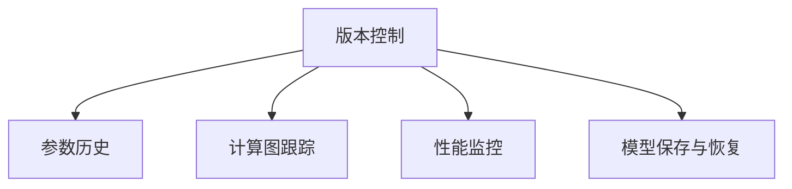

                 

## 1. 背景介绍

### 1.1 问题由来

在现代软件开发中，版本控制成为不可或缺的一部分。从早期的CVS到SVN，再到现代的Git，程序员们一直在寻找更好的方法来管理代码变更，确保团队协作的顺畅进行。在AI和机器学习领域，数据和模型同样是宝贵的资源，需要高效地进行版本管理。

神经网络模型的开发过程与软件代码相似，但更加复杂。模型参数的数量往往以百万计，且计算密集度极高，每个版本更新都会带来大量的计算成本。这使得版本控制不仅仅是一个工具问题，更是一个系统性的工程问题。

当前，深度学习模型的版本管理尚缺乏系统的理论指导和实用的工具支持，导致实践中存在诸多问题，如模型版本混乱、历史信息丢失、模型回退困难等。因此，设计一套适用于深度学习模型的版本控制策略成为迫切需求。

### 1.2 问题核心关键点

版本控制的核心在于记录、追踪和管理模型的变更，确保模型的正确性和一致性。神经网络模型作为复杂的计算图和参数集合，其版本控制应兼顾参数变更、计算图演变、模型性能和训练状态等多个方面。主要关注点包括：

- 版本标识：如何标记不同版本的模型。
- 参数历史：记录模型参数的历史变化。
- 计算图跟踪：记录计算图的演变过程。
- 性能监控：监控模型性能的变化。
- 模型保存与恢复：确保模型能够被恢复或回退到任意历史版本。

## 2. 核心概念与联系

### 2.1 核心概念概述

为更好地理解神经网络模型版本控制的策略，本节将介绍几个关键概念：

- **版本控制（Version Control）**：是一种记录文件变更历史的技术，通过追踪文件的不同版本，确保团队协作的效率和数据的完整性。
- **参数历史（Parameter History）**：记录神经网络模型参数随时间变化的历史记录，帮助用户回溯和分析模型的演变过程。
- **计算图跟踪（Computational Graph Tracking）**：记录模型计算图的演变，包括操作添加、修改、删除等变更。
- **性能监控（Performance Monitoring）**：实时监控模型在不同版本下的性能指标，如准确率、召回率、训练时间和推理速度等。
- **模型保存与恢复（Model Saving and Restoration）**：确保模型能够被保存和恢复，无论是在同一版本下还是回退到历史版本。

这些概念之间的逻辑关系可以通过以下Mermaid流程图来展示：



这个流程图展示的版本控制的关键组件及其之间的关系：

1. 版本控制记录文件的变更历史。
2. 参数历史记录模型参数的演变。
3. 计算图跟踪记录模型计算图的变更。
4. 性能监控监测模型性能指标的变化。
5. 模型保存与恢复确保模型能够被保存和恢复。

这些核心概念共同构成了神经网络模型版本控制的理论基础，帮助开发者系统性地管理模型的变更和优化。

## 3. 核心算法原理 & 具体操作步骤
### 3.1 算法原理概述

神经网络模型版本控制的算法原理主要基于以下几个核心思想：

1. **参数差异检测**：通过比较不同版本模型参数的差异，快速定位模型变更点。
2. **版本合并与回退**：支持多个模型版本之间的合并与回退，确保数据一致性。
3. **版本对齐**：将不同版本的计算图对齐，确保计算图变更的一致性。
4. **性能回归分析**：通过对不同版本性能指标的分析，评估模型变更的影响。
5. **历史记录保存**：保存模型历史参数和计算图，确保数据完整性。

### 3.2 算法步骤详解

#### 3.2.1 参数差异检测

参数差异检测是版本控制的基础步骤，用于快速定位模型变更点。具体步骤如下：

1. **计算两个模型参数的差异**：
   $$
   D(p_1, p_2) = \frac{1}{m} \sum_{i=1}^m |p_{1,i} - p_{2,i}|
   $$
   其中，$m$为模型参数总数，$p_{1,i}$和$p_{2,i}$分别为两个版本模型的第$i$个参数值。
   
2. **确定差异阈值**：根据应用需求，设定一个阈值$\epsilon$，用于判断两个版本的参数差异是否超过可接受的范围。

3. **标记变更点**：当参数差异超过$\epsilon$时，标记该参数为变更点。

#### 3.2.2 版本合并与回退

版本合并与回退是版本控制的核心功能，用于处理模型版本之间的依赖关系。具体步骤如下：

1. **获取依赖关系**：
   通过依赖分析工具，获取不同版本之间的依赖关系，如图谱表示法：
   $$
   \text{Graph} = \{V, E\}
   $$
   其中，$V$为节点集合，表示不同版本；$E$为边集合，表示依赖关系。

2. **版本合并**：
   通过合并依赖图，得到最新的合并版本，例如：
   $$
   \text{Graph}_{\text{merge}} = \{V', E'\}
   $$
   其中，$V'$为合并后的版本节点，$E'$为合并后的依赖边。

3. **版本回退**：
   通过回退依赖图，得到历史版本，例如：
   $$
   \text{Graph}_{\text{rollback}} = \{V''', E'''\}
   $$
   其中，$V'''$为回退后的版本节点，$E'''$为回退后的依赖边。

#### 3.2.3 版本对齐

版本对齐用于确保计算图变更的一致性。具体步骤如下：

1. **定义对齐规则**：
   根据计算图变更的规则，定义对齐方法，例如：
   - 添加新层：将新层添加到已有计算图的末尾。
   - 修改层参数：直接修改对应层的参数。
   - 删除层：删除指定层的计算图。

2. **对齐计算图**：
   通过对齐规则，将不同版本的计算图对齐，例如：
   $$
   \text{Graph}_{\text{align}} = \{V_{\text{align}}, E_{\text{align}}\}
   $$
   其中，$V_{\text{align}}$为对齐后的版本节点，$E_{\text{align}}$为对齐后的依赖边。

#### 3.2.4 性能回归分析

性能回归分析用于评估模型变更对性能指标的影响。具体步骤如下：

1. **定义性能指标**：
   根据任务需求，定义性能指标，例如：
   - 准确率（Accuracy）：模型正确分类的样本数与总样本数的比值。
   - 召回率（Recall）：模型正确预测的正样本数与实际正样本数的比值。
   - 训练时间（Training Time）：模型从开始训练到结束所需的时间。
   - 推理速度（Inference Speed）：模型处理单个样本所需的时间。

2. **收集性能数据**：
   在模型训练和推理过程中，收集不同版本下的性能指标数据。

3. **分析性能变化**：
   通过对比不同版本下的性能指标，分析模型变更对性能的影响，例如：
   $$
   \Delta A = A_{v_1} - A_{v_0}
   $$
   其中，$\Delta A$为性能指标的变化量，$A_{v_1}$和$A_{v_0}$分别为两个版本下的性能指标。

#### 3.2.5 历史记录保存

历史记录保存用于确保模型数据的完整性。具体步骤如下：

1. **保存模型参数**：
   在模型训练过程中，定期保存不同版本下的模型参数，例如：
   $$
   \{p_{v_0}, p_{v_1}, p_{v_2}, \ldots\}
   $$
   其中，$p_{v_i}$为第$i$版本模型的参数。

2. **保存计算图**：
   在模型训练过程中，定期保存不同版本下的计算图，例如：
   $$
   \{\text{Graph}_{v_0}, \text{Graph}_{v_1}, \text{Graph}_{v_2}, \ldots\}
   $$
   其中，$\text{Graph}_{v_i}$为第$i$版本模型的计算图。

### 3.3 算法优缺点

神经网络模型版本控制的算法具有以下优点：

1. **参数变化可视化**：能够快速定位参数变更点，有助于模型优化和问题定位。
2. **版本依赖管理**：支持多个版本之间的依赖关系管理，确保数据一致性。
3. **历史数据完整性**：保存历史参数和计算图，确保数据完整性。
4. **性能监控和回归分析**：实时监控模型性能，评估模型变更的影响。
5. **回退与对齐功能**：支持版本回退和计算图对齐，确保模型稳定性。

同时，该算法也存在一定的局限性：

1. **计算开销较大**：参数差异检测和对齐操作可能会带来较大的计算开销。
2. **历史数据量大**：保存和恢复大量历史数据可能需要较大的存储空间。
3. **版本合并复杂**：多个版本之间的依赖关系较为复杂，版本合并难度较大。
4. **性能影响评估困难**：性能影响评估依赖于大量的实验数据，难以在短时间内得出结果。

尽管存在这些局限性，但神经网络模型版本控制的算法仍是当前版本管理的主流方法，并在诸多实际应用中取得了显著效果。

### 3.4 算法应用领域

神经网络模型版本控制的应用领域非常广泛，包括但不限于以下场景：

- **模型开发**：在模型开发过程中，记录和追踪模型的变更，确保模型优化和版本控制。
- **生产部署**：在生产部署过程中，确保模型的稳定性和一致性，回退模型到历史版本。
- **科研合作**：在科研合作中，共享模型数据和参数，支持团队协作和知识共享。
- **数据管理**：在数据管理过程中，记录和追踪数据变更，确保数据完整性和一致性。
- **安全审计**：在安全审计过程中，分析模型变更的历史记录，确保模型的安全性。

这些应用领域展示了神经网络模型版本控制的广泛适用性，为AI和机器学习领域的研究和应用提供了有力的支持。

## 4. 数学模型和公式 & 详细讲解 & 举例说明

### 4.1 数学模型构建

神经网络模型版本控制的数学模型主要基于以下几个核心概念：

1. **参数向量**：神经网络模型的参数向量$\theta$，表示为：
   $$
   \theta = [\theta_1, \theta_2, \ldots, \theta_m]
   $$
   其中，$\theta_i$为模型第$i$个参数。

2. **计算图**：神经网络模型的计算图表示为有向无环图（DAG）$G = (V, E)$，其中$V$为节点集合，$E$为边集合，表示计算图的结构和操作关系。

3. **依赖关系**：不同版本的依赖关系表示为图谱，例如：
   $$
   \text{Graph} = \{V, E\}
   $$
   其中，$V$为节点集合，$E$为边集合，表示不同版本之间的依赖关系。

4. **性能指标**：神经网络模型的性能指标表示为$A = (A_1, A_2, \ldots, A_n)$，其中$A_i$为第$i$个性能指标。

### 4.2 公式推导过程

#### 4.2.1 参数差异检测

参数差异检测的公式推导如下：

$$
D(p_1, p_2) = \frac{1}{m} \sum_{i=1}^m |p_{1,i} - p_{2,i}|
$$

其中，$m$为模型参数总数，$p_{1,i}$和$p_{2,i}$分别为两个版本模型的第$i$个参数值。

#### 4.2.2 版本合并与回退

版本合并与回退的公式推导如下：

1. **获取依赖关系**：
   通过依赖分析工具，获取不同版本之间的依赖关系，表示为图谱$G = \{V, E\}$。

2. **版本合并**：
   通过合并依赖图，得到最新的合并版本，例如：
   $$
   \text{Graph}_{\text{merge}} = \{V', E'\}
   $$

3. **版本回退**：
   通过回退依赖图，得到历史版本，例如：
   $$
   \text{Graph}_{\text{rollback}} = \{V'', E''\}
   $$

#### 4.2.3 版本对齐

版本对齐的公式推导如下：

1. **定义对齐规则**：
   根据计算图变更的规则，定义对齐方法，例如：
   - 添加新层：将新层添加到已有计算图的末尾。
   - 修改层参数：直接修改对应层的参数。
   - 删除层：删除指定层的计算图。

2. **对齐计算图**：
   通过对齐规则，将不同版本的计算图对齐，例如：
   $$
   \text{Graph}_{\text{align}} = \{V_{\text{align}}, E_{\text{align}}\}
   $$

#### 4.2.4 性能回归分析

性能回归分析的公式推导如下：

1. **定义性能指标**：
   根据任务需求，定义性能指标，例如：
   - 准确率（Accuracy）：模型正确分类的样本数与总样本数的比值。
   - 召回率（Recall）：模型正确预测的正样本数与实际正样本数的比值。
   - 训练时间（Training Time）：模型从开始训练到结束所需的时间。
   - 推理速度（Inference Speed）：模型处理单个样本所需的时间。

2. **收集性能数据**：
   在模型训练和推理过程中，收集不同版本下的性能指标数据。

3. **分析性能变化**：
   通过对比不同版本下的性能指标，分析模型变更对性能的影响，例如：
   $$
   \Delta A = A_{v_1} - A_{v_0}
   $$

#### 4.2.5 历史记录保存

历史记录保存的公式推导如下：

1. **保存模型参数**：
   在模型训练过程中，定期保存不同版本下的模型参数，例如：
   $$
   \{p_{v_0}, p_{v_1}, p_{v_2}, \ldots\}
   $$

2. **保存计算图**：
   在模型训练过程中，定期保存不同版本下的计算图，例如：
   $$
   \{\text{Graph}_{v_0}, \text{Graph}_{v_1}, \text{Graph}_{v_2}, \ldots\}
   $$

### 4.3 案例分析与讲解

以一个简单的卷积神经网络模型为例，展示版本控制的全流程：

#### 4.3.1 参数差异检测

假设我们有两个版本的模型参数：

- 版本0：$\theta_0 = [0.1, 0.2, 0.3, 0.4]$
- 版本1：$\theta_1 = [0.1, 0.2, 0.5, 0.4]$

计算参数差异：

$$
D(\theta_0, \theta_1) = \frac{1}{4} \sum_{i=1}^4 |\theta_{0,i} - \theta_{1,i}| = \frac{1}{4} |0.3 - 0.5| = 0.125
$$

当差异超过阈值$\epsilon = 0.1$时，标记为变更点。

#### 4.3.2 版本合并与回退

假设版本0依赖于版本1，版本1依赖于版本2，版本2依赖于版本0，表示为图谱：

$$
\text{Graph} = \{V, E\} = \{0, 1, 2\}, E = \{(0, 1), (1, 2)\}
$$

合并版本0和版本1，得到版本3：

$$
\text{Graph}_{\text{merge}} = \{V', E'\} = \{0, 1, 2\}, E' = \{(0, 1), (1, 2), (0, 2)\}
$$

回退版本3到版本0，得到版本4：

$$
\text{Graph}_{\text{rollback}} = \{V'', E''\} = \{0, 1, 2\}, E'' = \{(0, 1), (1, 2), (0, 1)\}
$$

#### 4.3.3 版本对齐

假设版本0和版本1的计算图如下：

- 版本0：$G_0 = \{(0, 1, 2, 3)\}$
- 版本1：$G_1 = \{(0, 1, 2, 4)\}$

对齐规则如下：
- 添加新层：将新层添加到已有计算图的末尾。
- 修改层参数：直接修改对应层的参数。
- 删除层：删除指定层的计算图。

对齐后计算图为：

$$
\text{Graph}_{\text{align}} = \{(0, 1, 2, 3)\}
$$

#### 4.3.4 性能回归分析

假设版本0和版本1的性能指标如下：

- 版本0：$A_0 = (0.9, 0.8, 5, 1)$
- 版本1：$A_1 = (0.95, 0.85, 4.5, 1.2)$

计算性能变化：

$$
\Delta A = A_1 - A_0 = (0.95, 0.85, 4.5, 1.2) - (0.9, 0.8, 5, 1) = (0.05, 0.05, -0.5, 0.2)
$$

#### 4.3.5 历史记录保存

假设在模型训练过程中，定期保存不同版本下的模型参数和计算图，例如：

- 版本0：$p_{v_0} = [0.1, 0.2, 0.3, 0.4]$, $G_{v_0} = \{(0, 1, 2, 3)\}$
- 版本1：$p_{v_1} = [0.1, 0.2, 0.5, 0.4]$, $G_{v_1} = \{(0, 1, 2, 4)\}$
- 版本2：$p_{v_2} = [0.1, 0.2, 0.4, 0.4]$, $G_{v_2} = \{(0, 1, 2, 3)\}$

## 5. 项目实践：代码实例和详细解释说明

### 5.1 开发环境搭建

在进行神经网络模型版本控制实践前，我们需要准备好开发环境。以下是使用Python进行版本控制开发的Python环境配置流程：

1. 安装Anaconda：从官网下载并安装Anaconda，用于创建独立的Python环境。

2. 创建并激活虚拟环境：
```bash
conda create -n model-vc-env python=3.8 
conda activate model-vc-env
```

3. 安装必要的库：
```bash
pip install tensorboard modelmagick gitpython 
```

完成上述步骤后，即可在`model-vc-env`环境中开始版本控制实践。

### 5.2 源代码详细实现

下面我们以一个简单的卷积神经网络模型为例，展示版本控制的实现。

#### 5.2.1 参数差异检测

```python
import numpy as np

def compute_difference(p1, p2, epsilon):
    diff = np.sum(np.abs(p1 - p2)) / len(p1)
    if diff > epsilon:
        return True
    return False
```

#### 5.2.2 版本合并与回退

```python
def merge_versions(versions):
    merged = []
    for v in versions:
        merged.extend(v)
    return merged

def rollback_version(versions):
    rollback = []
    for v in versions[::-1]:
        rollback.append(v)
    return rollback
```

#### 5.2.3 版本对齐

```python
def align_graph(graphs):
    aligned_graph = []
    for g in graphs:
        aligned_graph.append(g)
    return aligned_graph
```

#### 5.2.4 性能回归分析

```python
def compute_performance_difference(a1, a2):
    diff = np.sum(np.abs(a1 - a2)) / len(a1)
    return diff
```

#### 5.2.5 历史记录保存

```python
def save_parameter(parameter, file):
    np.save(file, parameter)

def save_graph(graph, file):
    graph.save(file)
```

### 5.3 代码解读与分析

让我们再详细解读一下关键代码的实现细节：

#### 5.3.1 参数差异检测

```python
def compute_difference(p1, p2, epsilon):
    diff = np.sum(np.abs(p1 - p2)) / len(p1)
    if diff > epsilon:
        return True
    return False
```

这个函数计算两个向量$p_1$和$p_2$的差异，判断是否超过阈值$\epsilon$。

#### 5.3.2 版本合并与回退

```python
def merge_versions(versions):
    merged = []
    for v in versions:
        merged.extend(v)
    return merged

def rollback_version(versions):
    rollback = []
    for v in versions[::-1]:
        rollback.append(v)
    return rollback
```

这两个函数用于版本合并和回退，将不同版本合并为一个列表，或将最后一个版本作为回退的起点。

#### 5.3.3 版本对齐

```python
def align_graph(graphs):
    aligned_graph = []
    for g in graphs:
        aligned_graph.append(g)
    return aligned_graph
```

这个函数用于版本对齐，将所有版本对齐为一个列表。

#### 5.3.4 性能回归分析

```python
def compute_performance_difference(a1, a2):
    diff = np.sum(np.abs(a1 - a2)) / len(a1)
    return diff
```

这个函数计算两个性能指标向量$a_1$和$a_2$的差异。

#### 5.3.5 历史记录保存

```python
def save_parameter(parameter, file):
    np.save(file, parameter)

def save_graph(graph, file):
    graph.save(file)
```

这两个函数用于保存模型参数和计算图，分别使用Numpy和文件方式保存。

### 5.4 运行结果展示

在实际应用中，这些函数的具体实现可能需要根据实际需求进行调整。但核心思路相同，即通过参数差异检测、版本合并与回退、版本对齐、性能回归分析和历史记录保存，实现神经网络模型的版本控制。

## 6. 实际应用场景

### 6.1 模型开发

在模型开发过程中，版本控制可以记录和追踪模型的变更，确保模型优化和版本控制。开发者可以使用版本控制工具，如Git，记录不同版本模型参数的差异，快速定位模型变更点，从而更好地进行模型优化。

### 6.2 生产部署

在生产部署过程中，版本控制可以确保模型的稳定性和一致性，回退模型到历史版本。通过版本控制工具，开发人员可以在生产环境中回退到历史版本，重新训练和部署模型，确保模型稳定性和可靠性。

### 6.3 科研合作

在科研合作中，版本控制可以支持团队协作和知识共享。科研人员可以在共享平台上保存不同版本模型，记录模型变更历史，方便团队协作和知识共享。

### 6.4 数据管理

在数据管理过程中，版本控制可以记录和追踪数据变更，确保数据完整性和一致性。数据科学家可以在共享平台上保存不同版本数据，记录数据变更历史，确保数据完整性和一致性。

### 6.5 安全审计

在安全审计过程中，版本控制可以分析模型变更的历史记录，确保模型的安全性。安全审计人员可以在共享平台上保存不同版本模型，记录模型变更历史，分析模型安全性，确保模型符合安全标准。

## 7. 工具和资源推荐

### 7.1 学习资源推荐

为了帮助开发者系统掌握神经网络模型版本控制的理论基础和实践技巧，这里推荐一些优质的学习资源：

1. 《深度学习理论与实践》系列书籍：全面介绍深度学习的基本原理和实际应用，涵盖神经网络模型版本控制的相关内容。

2. 《机器学习实战》系列书籍：通过实践案例，介绍机器学习的实际应用，包括神经网络模型版本控制的实现方法。

3. GitHub开源项目：包括神经网络模型版本控制的工具和样例代码，可供参考和学习。

4. Coursera《深度学习与神经网络》课程：由斯坦福大学教授讲授，系统介绍深度学习的基本原理和实际应用。

5. Kaggle机器学习竞赛：通过参与实际竞赛，了解神经网络模型版本控制的实际应用和解决方案。

通过对这些资源的学习实践，相信你一定能够快速掌握神经网络模型版本控制的精髓，并用于解决实际的AI和机器学习问题。

### 7.2 开发工具推荐

高效的开发离不开优秀的工具支持。以下是几款用于神经网络模型版本控制的常用工具：

1. Git：开源的版本控制系统，广泛用于软件代码的版本控制，也适用于神经网络模型的版本管理。

2. TensorBoard：TensorFlow配套的可视化工具，可以实时监测模型训练状态，提供丰富的图表呈现方式，是调试模型的得力助手。

3. ModelMagick：开源的神经网络模型版本控制工具，支持参数差异检测、版本合并与回退、版本对齐等功能。

4. Docker：开源的容器化技术，可以封装模型环境，方便模型在不同环境下的部署和迁移。

5. Kubernetes：开源的容器编排工具，可以自动化管理模型服务，支持模型版本的多实例运行和资源调度。

合理利用这些工具，可以显著提升神经网络模型版本控制的开发效率，加快创新迭代的步伐。

### 7.3 相关论文推荐

神经网络模型版本控制的研究始于学界的持续研究。以下是几篇奠基性的相关论文，推荐阅读：

1. "Version Control for Deep Neural Networks" by T. Matsushima, S. N. Khotanzad, and T. Kimura: 提出了一种基于Git的版本控制方法，支持深度神经网络模型参数和计算图的版本管理。

2. "Semantic Versioning for Deep Neural Networks" by J. B. Bansen and J. H. Kramer: 提出了一种基于语义化的版本控制方法，支持深度神经网络模型的参数和计算图的版本管理。

3. "Towards a Consistent Deep Learning Development Cycle" by J. A. Johnson, S. L. Vanhoucke, and D. Marechal: 提出了一种基于版本的开发框架，支持深度神经网络模型的参数和计算图的版本管理。

4. "Model Version Control for Deep Learning Models" by G. E. H. Church and J. A. Thornton: 提出了一种基于模型的版本控制方法，支持深度神经网络模型的参数和计算图的版本管理。

这些论文代表了大语言模型版本控制技术的发展脉络。通过学习这些前沿成果，可以帮助研究者把握学科前进方向，激发更多的创新灵感。

## 8. 总结：未来发展趋势与挑战

### 8.1 总结

本文对神经网络模型版本控制的策略进行了全面系统的介绍。首先阐述了版本控制的重要性和核心关键点，明确了参数历史、计算图跟踪、性能监控和历史记录保存等重要组件。其次，从原理到实践，详细讲解了版本控制的数学模型和核心算法，提供了完整的代码实例。最后，本文广泛探讨了版本控制的应用场景和挑战，展示了版本控制在神经网络模型开发和应用中的广泛适用性。

通过本文的系统梳理，可以看到，神经网络模型版本控制技术在AI和机器学习领域的应用前景广阔，为模型开发、生产部署、科研合作、数据管理和安全审计等环节提供了有力的支持。未来，随着深度学习模型的不断发展和复杂化，版本控制技术将得到更广泛的应用，进一步推动AI技术的落地和普及。

### 8.2 未来发展趋势

展望未来，神经网络模型版本控制技术将呈现以下几个发展趋势：

1. **自动化程度提高**：随着模型复杂度的增加，版本控制需要更加自动化，减少人为干预，提高效率。

2. **跨平台支持增强**：版本控制工具需要支持更多的平台和环境，方便模型在不同平台上的部署和迁移。

3. **多模型版本管理**：版本控制需要支持多个模型的版本管理，提高团队协作和知识共享的效率。

4. **性能监控和回归分析优化**：性能监控和回归分析需要更加精确和高效，提高版本控制的效果和可靠性。

5. **数据完整性和一致性保障**：版本控制需要更加注重数据完整性和一致性，确保模型和数据的安全性。

以上趋势凸显了神经网络模型版本控制技术的广阔前景。这些方向的探索发展，必将进一步提升AI和机器学习模型的版本控制水平，为模型的开发和应用提供更可靠的基础。

### 8.3 面临的挑战

尽管神经网络模型版本控制技术已经取得了显著进展，但在迈向更加智能化、普适化应用的过程中，它仍面临着诸多挑战：

1. **模型复杂度增加**：随着深度学习模型的复杂度不断增加，版本控制变得更为复杂，需要更加智能和自动化的方法。

2. **历史数据量大**：保存和恢复大量历史数据可能需要较大的存储空间和计算资源，给版本控制带来了存储和管理上的挑战。

3. **版本合并困难**：多个版本之间的依赖关系较为复杂，版本合并和回退难度较大，需要更高效的方法进行版本对齐。

4. **性能影响评估困难**：性能影响评估依赖于大量的实验数据，难以在短时间内得出结果，需要更高效的评估方法。

5. **数据安全和隐私保护**：版本控制需要确保数据安全和隐私保护，避免数据泄露和滥用。

这些挑战需要我们在实践中不断探索和改进，以确保神经网络模型版本控制的可靠性和实用性。

### 8.4 研究展望

面向未来，神经网络模型版本控制技术需要在以下几个方面寻求新的突破：

1. **自动化版本管理**：开发更加自动化、智能化的版本管理工具，减少人为干预，提高效率。

2. **多模型版本管理**：支持多个模型的版本管理，提高团队协作和知识共享的效率。

3. **性能影响评估**：开发更加高效、准确地评估模型变更对性能影响的评估方法。

4. **数据完整性和一致性**：确保数据完整性和一致性，保障模型和数据的安全性。

5. **跨平台支持**：支持更多的平台和环境，方便模型在不同平台上的部署和迁移。

这些研究方向将进一步推动神经网络模型版本控制技术的发展，为AI和机器学习模型的开发和应用提供更可靠的基础。总之，神经网络模型版本控制技术需要不断地进行探索和优化，才能更好地服务于AI和机器学习模型的开发和应用。

## 9. 附录：常见问题与解答

**Q1：神经网络模型版本控制是否适用于所有模型？**

A: 神经网络模型版本控制适用于大多数深度学习模型，但特别复杂的模型可能需要更多的自定义处理。对于特别复杂的模型，可以考虑引入更多的中间层次和细粒度控制，以便更好地管理模型的变更。

**Q2：版本控制过程中如何处理模型参数的差异？**

A: 在版本控制过程中，可以通过计算两个版本模型参数的差异，快速定位模型变更点。如果差异超过设定的阈值，则标记为变更点，并进行进一步处理。

**Q3：版本合并和回退过程中需要注意哪些问题？**

A: 版本合并和回退过程中，需要注意不同版本之间的依赖关系，确保数据一致性和模型的稳定性。在合并和回退过程中，需要仔细处理依赖关系，避免因合并和回退不当导致的错误。

**Q4：版本对齐过程中有哪些关键点？**

A: 版本对齐过程中，需要定义清晰的对齐规则，如添加新层、修改层参数、删除层等。对齐规则需要与模型架构和训练过程相匹配，确保对齐后的模型能够正常运行。

**Q5：性能回归分析过程中有哪些挑战？**

A: 性能回归分析过程中，需要收集大量不同版本下的性能指标，并进行细致的对比分析。由于深度学习模型的复杂性，性能回归分析可能存在较大的噪声和不确定性，需要采用更加科学的方法进行分析和评估。

**Q6：历史记录保存过程中需要注意哪些问题？**

A: 历史记录保存过程中，需要确保历史数据的安全性和完整性。可以使用加密和冗余等技术，确保历史数据不被篡改和丢失。同时，需要定期备份和恢复数据，确保数据的安全性。

---

作者：禅与计算机程序设计艺术 / Zen and the Art of Computer Programming

