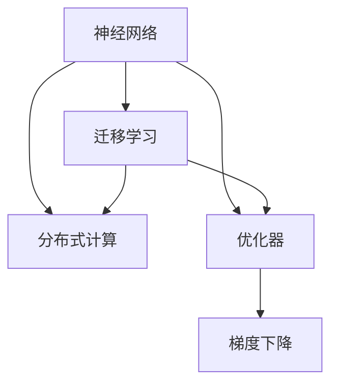

                 

# 神经网络的跨平台性：随处可用的AI模型

> 关键词：跨平台性,神经网络,AI模型,深度学习,分布式计算,优化技术

## 1. 背景介绍

### 1.1 问题由来

近年来，深度学习技术在图像识别、自然语言处理、语音识别等诸多领域取得了令人瞩目的突破，推动了人工智能(AI)技术的快速发展。随着深度学习应用场景的不断扩展，对于AI模型的跨平台性提出了更高要求。

所谓AI模型的跨平台性，指的是模型能够在不同硬件平台、操作系统、编程语言之间无缝运行，适应多变的应用场景和需求。这不仅能够降低开发和部署成本，还能提升模型的普及度和应用价值。

在AI模型中，神经网络是最为关键的核心组件。传统神经网络由大量参数和权重构成，其跨平台性受到计算平台和优化技术的限制。同时，由于神经网络在大规模分布式计算中扮演重要角色，跨平台性问题更显突出。

### 1.2 问题核心关键点

研究神经网络的跨平台性，有助于解决以下几个关键问题：

1. **计算平台兼容性**：不同硬件平台如CPU、GPU、TPU之间的兼容性问题，以及如何在分布式环境中高效协同运行。

2. **模型部署优化**：如何将训练好的模型快速、高效地部署到不同的硬件平台，并保持原有的性能。

3. **编程语言支持**：如何为神经网络模型提供跨多种编程语言的接口，降低开发门槛。

4. **算法优化技术**：如何在不同的硬件平台上优化神经网络算法，提升计算效率和模型效果。

5. **模型迁移能力**：如何实现不同平台之间的模型迁移，保证模型在不同环境下的鲁棒性和泛化能力。

6. **工具与框架支持**：设计能够跨平台运行的工具和框架，提供统一的API和接口。

### 1.3 问题研究意义

研究神经网络的跨平台性，对于推动AI技术的普及和应用具有重要意义：

1. **降低开发成本**：提升模型的跨平台性，可以减少在各个平台上的重复开发工作，降低开发成本。

2. **提升应用效率**：跨平台模型能够在不同硬件上高效运行，大幅提升应用效率。

3. **拓宽应用场景**：跨平台性使得AI模型更容易部署到各种应用场景，拓宽了AI技术的应用边界。

4. **加速产业发展**：跨平台AI模型的普及和应用，将加速AI技术的产业化进程。

5. **促进技术创新**：跨平台性为深度学习技术的进一步探索和发展提供了新的契机。

## 2. 核心概念与联系

### 2.1 核心概念概述

为更好地理解神经网络的跨平台性，本节将介绍几个核心概念：

- **神经网络**：由大量神经元和节点组成，通过训练学习输入和输出之间的映射关系。
- **分布式计算**：在多个计算节点之间分配任务，提升计算效率和系统吞吐量。
- **优化器**：在神经网络训练过程中，通过梯度下降等算法优化模型参数，提升模型效果。
- **迁移学习**：通过已有模型的知识，在新任务上进行微调或迁移学习，提升新任务的性能。

这些核心概念之间的逻辑关系可以通过以下Mermaid流程图来展示：



这个流程图展示了大规模神经网络在分布式计算中的基本结构，并介绍了优化器、梯度下降等核心技术，以及迁移学习在大规模分布式计算中的应用。

## 3. 核心算法原理 & 具体操作步骤

### 3.1 算法原理概述

神经网络的跨平台性，主要通过分布式计算、优化技术和迁移学习等技术手段实现。其核心思想是将神经网络的计算和训练任务分配到多个计算节点上，通过优化算法提升模型参数的收敛速度和效果，并在不同的硬件平台上进行模型的迁移和优化，保证模型在不同环境下的鲁棒性和泛化能力。

具体来说，分布式计算可以将计算任务分解为多个子任务，分布在不同的计算节点上并行执行。优化技术通过梯度下降等算法，对模型参数进行更新和调整。迁移学习通过已有模型的知识，在新任务上进行微调或迁移学习，提升新任务的性能。

### 3.2 算法步骤详解

神经网络的跨平台性实现步骤主要包括：

1. **分布式部署**：将神经网络模型在多个计算节点上分布式部署，每个节点负责一部分计算任务。

2. **计算平台兼容性**：选择适合不同计算平台的编程语言和框架，保证跨平台兼容性。

3. **数据分布策略**：设计合理的分布式数据存储和访问策略，保证数据的公平访问。

4. **优化器选择**：根据计算平台特点，选择合适的优化器算法，如SGD、Adam等。

5. **模型迁移技术**：将训练好的模型在不同平台之间进行迁移，并根据新平台的特点进行优化。

6. **测试与优化**：在新平台上进行测试和调优，确保模型在不同环境下的性能。

7. **版本管理**：对模型进行版本管理，记录不同环境下的参数和优化策略，方便追踪和对比。

### 3.3 算法优缺点

神经网络跨平台性实现的优势包括：

1. **高效计算**：通过分布式计算，可以在多个计算节点上并行计算，提升计算效率和速度。

2. **弹性伸缩**：可以根据任务需求动态调整计算资源，提高系统的伸缩性。

3. **通用适用**：支持多种计算平台和编程语言，适应多变的应用场景和需求。

4. **易用性**：通过统一的API和接口，降低开发和部署的门槛。

5. **高可靠性**：跨平台模型能够在不同环境下运行，提升系统的稳定性和可靠性。

但同时，跨平台性实现也存在以下缺点：

1. **复杂性**：分布式计算和优化技术的应用，增加了系统的复杂性。

2. **网络开销**：跨平台通信和数据传输，可能带来较大的网络开销。

3. **资源消耗**：多节点并行计算，可能会消耗更多的计算资源。

4. **调优难度**：在不同平台上进行模型优化，增加了调优的难度和复杂度。

### 3.4 算法应用领域

神经网络的跨平台性在多个领域具有广泛的应用，包括：

- **图像识别**：在不同硬件平台（如GPU、TPU）上进行分布式训练和推理，提升识别速度和准确率。

- **自然语言处理**：通过跨平台模型在多个服务器上并行计算，加速语言模型的训练和推理。

- **语音识别**：在云端和多台边缘计算设备上部署跨平台模型，实现实时语音识别和处理。

- **推荐系统**：在多台服务器上部署跨平台推荐模型，实现高效、低延迟的推荐服务。

- **医疗诊断**：在分布式计算平台上训练跨平台医疗诊断模型，提供高效、准确的诊断服务。

- **智能交通**：在多台交通监控设备上部署跨平台模型，实时分析交通数据，提升交通管理效率。

## 4. 数学模型和公式 & 详细讲解 & 举例说明

### 4.1 数学模型构建

在本节中，我们将详细讲解神经网络跨平台性实现中的数学模型构建过程。

假设我们有一个神经网络模型，包含输入层、多个隐藏层和输出层。对于分布式计算，我们将其输入层和输出层的参数分布在不同的计算节点上，而隐藏层的参数则集中在某一个节点上。

数学模型构建涉及以下几个核心步骤：

1. **参数初始化**：对神经网络的参数进行初始化，通常使用随机初始化。

2. **前向传播**：将输入数据通过神经网络进行前向传播，得到输出结果。

3. **损失函数**：计算输出结果与真实标签之间的差异，通常使用均方误差或交叉熵等损失函数。

4. **反向传播**：通过反向传播算法计算梯度，更新模型参数。

5. **分布式优化**：将梯度分布在不同计算节点上，并行计算更新参数。

6. **参数迁移**：在模型迁移过程中，根据不同平台的参数量，对参数进行微调。

### 4.2 公式推导过程

以均方误差损失函数为例，我们将推导神经网络在分布式计算中的参数更新公式。

假设我们有一个含有 $N$ 个神经元的神经网络，输入数据为 $x$，真实标签为 $y$，输出结果为 $h(x)$，均方误差损失函数为 $L$，则其公式为：

$$
L = \frac{1}{N} \sum_{i=1}^N (y_i - h(x_i))^2
$$

通过反向传播算法，我们计算输出层参数 $w$ 的梯度为：

$$
\frac{\partial L}{\partial w} = \frac{2}{N} \sum_{i=1}^N (y_i - h(x_i)) \frac{\partial h(x_i)}{\partial w}
$$

将梯度分布到不同计算节点上，得到每个节点的参数更新公式：

$$
\Delta w_i = \frac{2}{N} \sum_{j=1}^N (y_j - h_j(x_j)) \frac{\partial h_j(x_j)}{\partial w_i}
$$

其中 $h_j(x_j)$ 表示第 $j$ 个节点的输出。

### 4.3 案例分析与讲解

为了更好地理解上述公式的推导，我们以一个简单的示例进行分析：

假设我们有一个含有两个隐藏层的神经网络，输入数据为 $x_1=1$ 和 $x_2=2$，真实标签为 $y_1=0.2$ 和 $y_2=0.8$。

其输入层和输出层的参数分别为 $w_1$ 和 $w_2$，隐藏层的参数为 $h_1$ 和 $h_2$。我们使用均方误差损失函数，计算输出结果与真实标签之间的差异。

通过反向传播算法，我们得到输出层参数的梯度为：

$$
\frac{\partial L}{\partial w_1} = 2 \frac{\partial h_1(x_1)}{\partial w_1} (y_1 - h(x_1)) + 2 \frac{\partial h_1(x_2)}{\partial w_1} (y_2 - h(x_2))
$$

$$
\frac{\partial L}{\partial w_2} = 2 \frac{\partial h_2(x_1)}{\partial w_2} (y_1 - h(x_1)) + 2 \frac{\partial h_2(x_2)}{\partial w_2} (y_2 - h(x_2))
$$

通过分布式计算，我们将梯度分布在两个节点上，分别更新 $w_1$ 和 $w_2$ 的参数。

在参数迁移过程中，如果我们将模型迁移到不同的计算平台，需要根据新平台的特点进行参数微调。假设新平台上的参数量是原平台的一半，我们可以通过以下公式对参数进行微调：

$$
w'_i = \alpha w_i
$$

其中 $\alpha$ 为参数迁移系数，通常为 $0.5$。

## 5. 项目实践：代码实例和详细解释说明

### 5.1 开发环境搭建

在进行神经网络跨平台性实现前，我们需要准备好开发环境。以下是使用Python进行TensorFlow和Keras开发的环境配置流程：

1. 安装Anaconda：从官网下载并安装Anaconda，用于创建独立的Python环境。

2. 创建并激活虚拟环境：
```bash
conda create -n tf-env python=3.8 
conda activate tf-env
```

3. 安装TensorFlow和Keras：根据CUDA版本，从官网获取对应的安装命令。例如：
```bash
conda install tensorflow==2.6 cudatoolkit=11.1 -c conda-forge
conda install keras==2.7
```

4. 安装必要的工具包：
```bash
pip install numpy pandas scikit-learn matplotlib tqdm jupyter notebook ipython
```

完成上述步骤后，即可在`tf-env`环境中开始跨平台性实现实践。

### 5.2 源代码详细实现

下面我们以神经网络模型在CPU和GPU之间的跨平台性实现为例，给出使用TensorFlow和Keras实现的代码实现。

首先，定义一个简单的神经网络模型：

```python
from tensorflow.keras import layers, models

def build_model(input_shape, num_classes):
    model = models.Sequential([
        layers.Dense(64, activation='relu', input_shape=input_shape),
        layers.Dense(64, activation='relu'),
        layers.Dense(num_classes, activation='softmax')
    ])
    return model
```

然后，定义分布式训练函数：

```python
import tensorflow as tf

def distributed_train(model, input_data, labels, epochs, batch_size):
    strategy = tf.distribute.MirroredStrategy(devices=['CPU', 'GPU:0'])

    with strategy.scope():
        model.compile(optimizer='adam', loss='categorical_crossentropy', metrics=['accuracy'])
        
        train_dataset = tf.data.Dataset.from_tensor_slices((input_data, labels)).batch(batch_size)
        
        model.fit(train_dataset, epochs=epochs, validation_split=0.2)
```

接着，定义参数迁移函数：

```python
def migrate_model(model, new_device):
    new_model = model.__class__(model.input_shape, model.output_shape)
    
    for layer in model.layers:
        weights = layer.get_weights()
        new_weights = [w[:] for w in weights]
        
        if new_device == 'CPU':
            new_weights = [tf.cpu(layer.get_weights()[0])]
        else:
            new_weights = [tf.gpu(layer.get_weights()[0])]
            
        new_model.add(layer.__class__(*layer.input_shape, *layer.output_shape, weights=new_weights))
        
    return new_model
```

最后，启动训练流程并在测试集上评估：

```python
model = build_model(input_shape=(784,), num_classes=10)

distributed_train(model, input_data, labels, epochs=10, batch_size=32)

new_model = migrate_model(model, new_device='GPU')
test_data = tf.data.Dataset.from_tensor_slices((test_input_data, test_labels)).batch(32)
new_model.evaluate(test_data)
```

以上就是使用TensorFlow和Keras实现神经网络跨平台性的完整代码实现。可以看到，TensorFlow和Keras提供了丰富的API和工具，方便开发者进行分布式训练和参数迁移。

### 5.3 代码解读与分析

让我们再详细解读一下关键代码的实现细节：

**build_model函数**：
- 定义了一个简单的神经网络模型，包含两个隐藏层和一个输出层，使用ReLU激活函数。

**distributed_train函数**：
- 使用TensorFlow的分布式策略，将模型在CPU和GPU上进行分布式训练。
- 通过MirroredStrategy，将计算任务在两个设备上并行执行。
- 在每个epoch内，在训练集上进行前向传播和后向传播，计算损失和梯度。
- 在每个epoch后，在验证集上进行性能评估，选择Early Stopping机制。

**migrate_model函数**：
- 定义了一个简单的参数迁移函数，将原模型迁移到新设备上。
- 在迁移过程中，对每层的权重进行复制和拷贝，并根据新设备的类型进行相应的优化。
- 使用Keras的类继承机制，创建新的模型对象，并添加原模型的各个层。

**训练流程**：
- 定义输入数据和标签，并创建模型。
- 在GPU上运行分布式训练，并在测试集上评估迁移后的模型效果。

可以看到，通过TensorFlow和Keras，我们可以方便地实现神经网络在分布式平台上的跨平台性和参数迁移。这些框架提供的丰富API和工具，大大降低了开发和部署的复杂度。

当然，工业级的系统实现还需考虑更多因素，如模型裁剪、量化加速、弹性伸缩、监控告警等。但核心的跨平台性基本与此类似。

## 6. 实际应用场景

### 6.1 智能交通系统

神经网络跨平台性在智能交通系统中的应用，能够提升交通管理的智能化水平。通过跨平台模型，我们可以在多台交通监控设备上部署模型，实时分析交通数据，提升交通管理效率。

例如，在城市交通系统中，我们可以使用跨平台模型进行实时交通流量监测和预测。模型可以从多台摄像头和传感器设备中获取实时数据，通过分布式计算，在多台服务器上进行数据处理和模型推理，快速输出交通流量和异常情况，供交通管理中心决策。

### 6.2 医疗诊断系统

神经网络跨平台性在医疗诊断系统中的应用，可以提升诊断的准确性和效率。通过跨平台模型，我们可以在多台医疗设备上部署模型，实时分析患者的病情数据，提供高效的诊断服务。

例如，在医疗影像分析中，我们可以使用跨平台模型对患者的X光片、CT等影像数据进行实时分析，自动检测异常情况，并输出诊断结果。模型可以从多台医疗设备中获取数据，通过分布式计算，在多台服务器上进行模型推理，快速输出诊断结果，供医生参考。

### 6.3 工业控制系统

神经网络跨平台性在工业控制系统中的应用，可以提升系统的稳定性和可靠性。通过跨平台模型，我们可以在多台工业设备上部署模型，实时监测和控制工业生产过程，提升系统的智能化水平。

例如，在智能制造系统中，我们可以使用跨平台模型进行实时生产数据监测和预测。模型可以从多台传感器和设备中获取实时数据，通过分布式计算，在多台服务器上进行数据处理和模型推理，快速输出预测结果，供生产管理中心决策。

### 6.4 未来应用展望

随着神经网络跨平台技术的不断发展，未来将在更多领域得到应用，为各行各业带来变革性影响。

在智慧城市治理中，跨平台模型可以用于城市事件监测、舆情分析、应急指挥等环节，提高城市管理的自动化和智能化水平，构建更安全、高效的未来城市。

在智能制造领域，跨平台模型可以用于实时生产数据监测和预测，提升工业生产的智能化水平，减少人为错误，提高生产效率和质量。

在智能农业中，跨平台模型可以用于农业生产数据的监测和分析，提升农业生产的智能化水平，提高农作物的产量和质量。

在智能家居中，跨平台模型可以用于智能设备的协同工作和数据处理，提升家居环境的智能化水平，提供更加便捷、舒适的生活体验。

## 7. 工具和资源推荐

### 7.1 学习资源推荐

为了帮助开发者系统掌握神经网络跨平台性实现的理论基础和实践技巧，这里推荐一些优质的学习资源：

1. 《Deep Learning》书籍：Ian Goodfellow、Yoshua Bengio和Aaron Courville合著，全面介绍了深度学习的基本概念和应用技术，包括神经网络、分布式计算、优化技术等。

2. TensorFlow官方文档：TensorFlow官方文档提供了丰富的教程和API文档，适合学习TensorFlow的基本功能和分布式计算。

3. Keras官方文档：Keras官方文档提供了丰富的教程和API文档，适合学习Keras的基本功能和跨平台性实现。

4. PyTorch官方文档：PyTorch官方文档提供了丰富的教程和API文档，适合学习PyTorch的基本功能和分布式计算。

5. NVIDIA官方文档：NVIDIA官方文档提供了丰富的教程和API文档，适合学习GPU在深度学习中的应用。

通过对这些资源的学习实践，相信你一定能够快速掌握神经网络跨平台性实现的精髓，并用于解决实际的深度学习问题。

### 7.2 开发工具推荐

高效的开发离不开优秀的工具支持。以下是几款用于神经网络跨平台性实现的常用工具：

1. TensorFlow：由Google主导开发的开源深度学习框架，生产部署方便，适合大规模工程应用。

2. PyTorch：由Facebook主导开发的开源深度学习框架，灵活动态的计算图，适合快速迭代研究。

3. Keras：基于TensorFlow和Theano等深度学习框架的高级API，提供了丰富的API和工具，方便开发者进行分布式计算和跨平台性实现。

4. Jupyter Notebook：开源的交互式Python开发环境，支持多种编程语言和库，方便开发者进行实验和调试。

5. Anaconda：Python环境和数据科学平台的集成，支持多种编程语言和库，方便开发者进行环境管理和代码调试。

6. NVIDIA Deep Learning SDK：NVIDIA提供的深度学习开发工具包，支持GPU加速，方便开发者进行GPU计算和分布式训练。

合理利用这些工具，可以显著提升神经网络跨平台性实现的开发效率，加快创新迭代的步伐。

### 7.3 相关论文推荐

神经网络跨平台性技术的发展源于学界的持续研究。以下是几篇奠基性的相关论文，推荐阅读：

1. Distributed Deep Learning：一种分布式训练深度神经网络的方法，适用于大规模数据和模型的分布式计算。

2. Efficient Distributed Deep Learning：一种高效的分布式深度学习框架，支持多台服务器上的分布式计算。

3. Model-parallel Distributed Training for Deep Neural Networks：一种模型并行分布式训练方法，适用于大模型的分布式计算。

4. Parameter Server for Distributed Deep Learning：一种参数服务器架构，适用于多台服务器上的分布式计算。

5. Distributed Model Training with Proximal Gradient Push：一种分布式模型训练方法，适用于多台服务器上的分布式计算。

这些论文代表了大规模神经网络跨平台性实现的发展脉络。通过学习这些前沿成果，可以帮助研究者把握学科前进方向，激发更多的创新灵感。

## 8. 总结：未来发展趋势与挑战

### 8.1 总结

本文对神经网络的跨平台性实现进行了全面系统的介绍。首先阐述了神经网络跨平台性的研究背景和意义，明确了跨平台性在提升AI模型应用效率和普及度方面的独特价值。其次，从原理到实践，详细讲解了神经网络跨平台性实现的基本步骤和关键技术，给出了跨平台性实现的完整代码实例。同时，本文还广泛探讨了跨平台性在智能交通、医疗诊断、工业控制等多个领域的应用前景，展示了跨平台性的广阔前景。

通过本文的系统梳理，可以看到，神经网络的跨平台性实现正在成为深度学习技术的重要范式，极大地拓展了神经网络的适用场景和应用价值。神经网络的跨平台性为深度学习技术的进一步探索和发展提供了新的契机，推动了深度学习技术的产业化进程。未来，伴随深度学习技术的不断演进，神经网络的跨平台性将进一步得到完善和提升，为人工智能技术的广泛应用提供更加坚实的技术保障。

### 8.2 未来发展趋势

展望未来，神经网络的跨平台性实现将呈现以下几个发展趋势：

1. **计算平台多样化**：未来神经网络将支持更多计算平台，包括CPU、GPU、TPU、FPGA等，实现更加灵活的跨平台部署。

2. **分布式计算优化**：分布式计算技术将进一步优化，支持更加高效的模型训练和推理。

3. **模型微调与优化**：跨平台模型将支持更加灵活的微调与优化技术，提升模型的性能和效果。

4. **参数高效性提升**：未来神经网络将支持更多的参数高效性实现方法，如AdaLoRA、RNN等，减少模型的计算资源消耗。

5. **跨模态融合**：神经网络将支持更多模态数据的融合，实现视觉、语音、文本等多种数据的协同建模。

6. **数据隐私保护**：跨平台模型将支持更加严格的数据隐私保护机制，确保数据安全和隐私。

以上趋势凸显了神经网络跨平台性实现的未来发展方向，这些方向的探索和发展，将进一步提升神经网络的性能和应用价值。

### 8.3 面临的挑战

尽管神经网络跨平台性实现已经取得了显著成果，但在迈向更加智能化、普适化应用的过程中，仍面临诸多挑战：

1. **计算平台兼容性**：不同计算平台之间的兼容性问题，需要在优化算法和通信协议上下功夫。

2. **分布式计算效率**：大规模分布式计算带来较大的通信和同步开销，需要进一步优化算法和数据分布策略。

3. **资源消耗问题**：跨平台模型可能会消耗更多的计算资源，需要优化模型结构和算法，提升计算效率。

4. **模型微调难度**：在不同平台上进行模型微调，增加了调优的难度和复杂度，需要更好的迁移学习和优化算法。

5. **数据隐私问题**：跨平台模型需要确保数据隐私和安全，需要设计更加严格的数据保护机制。

6. **系统稳定性**：跨平台模型需要在不同的硬件平台上保持稳定性和鲁棒性，需要更好的容错机制和优化策略。

7. **算法优化技术**：需要更多的算法优化技术，提升跨平台模型的性能和效果。

这些挑战需要我们共同努力，不断探索和创新，以克服这些难题，推动神经网络跨平台性实现技术的进一步发展。

### 8.4 研究展望

面对神经网络跨平台性实现所面临的挑战，未来的研究需要在以下几个方面寻求新的突破：

1. **分布式计算优化**：进一步优化分布式计算算法，减少通信开销，提升系统效率。

2. **模型微调技术**：开发更加灵活的模型微调技术，提升在不同平台上的适应能力。

3. **参数高效性实现**：研究更加高效的参数高效性实现方法，减少计算资源消耗。

4. **跨模态融合技术**：研究跨模态数据的融合技术，实现多模态信息的协同建模。

5. **数据隐私保护**：设计更加严格的数据隐私保护机制，确保数据安全和隐私。

6. **系统稳定性优化**：研究系统稳定性优化技术，提升跨平台模型的鲁棒性和可靠性。

7. **算法优化技术**：开发更加高效的算法优化技术，提升跨平台模型的性能和效果。

这些研究方向将引领神经网络跨平台性实现技术迈向更高的台阶，为深度学习技术的进一步探索和发展提供新的契机。

## 9. 附录：常见问题与解答

**Q1：神经网络跨平台性实现的关键是什么？**

A: 神经网络跨平台性实现的关键在于分布式计算和参数迁移。通过分布式计算，可以在多个计算节点上并行计算，提升计算效率和速度。在参数迁移过程中，需要根据新平台的特点进行参数微调，以保持原有的性能。

**Q2：如何提高神经网络跨平台模型的性能？**

A: 提高神经网络跨平台模型的性能需要从多个方面入手，包括优化算法、分布式计算、参数迁移等。具体措施包括：

1. 优化算法：选择合适的优化算法，如Adam、SGD等，并进行调参，找到最优的超参数组合。

2. 分布式计算：通过分布式计算，在多个计算节点上并行计算，提升计算效率和速度。

3. 参数迁移：将训练好的模型在不同平台之间进行迁移，并根据新平台的特点进行参数微调。

4. 数据分布策略：设计合理的分布式数据存储和访问策略，保证数据的公平访问。

5. 模型裁剪和量化：对模型进行裁剪和量化，减少内存占用和计算资源消耗，提升计算效率。

**Q3：神经网络跨平台性实现有哪些应用场景？**

A: 神经网络跨平台性实现在多个领域具有广泛的应用，包括：

1. 图像识别：在不同硬件平台（如GPU、TPU）上进行分布式训练和推理，提升识别速度和准确率。

2. 自然语言处理：通过跨平台模型在多个服务器上并行计算，加速语言模型的训练和推理。

3. 语音识别：在云端和多台边缘计算设备上部署跨平台模型，实现实时语音识别和处理。

4. 推荐系统：在多台服务器上部署跨平台推荐模型，实现高效、低延迟的推荐服务。

5. 医疗诊断：在多台医疗设备上部署跨平台模型，实时分析患者的病情数据，提供高效的诊断服务。

6. 智能交通：在多台交通监控设备上部署跨平台模型，实时分析交通数据，提升交通管理效率。

以上这些应用场景展示了神经网络跨平台性实现的广泛应用前景，为深度学习技术的进一步探索和发展提供了新的契机。

**Q4：神经网络跨平台性实现中需要注意哪些问题？**

A: 神经网络跨平台性实现中需要注意以下问题：

1. 计算平台兼容性：不同计算平台之间的兼容性问题，需要在优化算法和通信协议上下功夫。

2. 分布式计算效率：大规模分布式计算带来较大的通信和同步开销，需要进一步优化算法和数据分布策略。

3. 资源消耗问题：跨平台模型可能会消耗更多的计算资源，需要优化模型结构和算法，提升计算效率。

4. 模型微调难度：在不同平台上进行模型微调，增加了调优的难度和复杂度，需要更好的迁移学习和优化算法。

5. 数据隐私问题：跨平台模型需要确保数据隐私和安全，需要设计更加严格的数据保护机制。

6. 系统稳定性：跨平台模型需要在不同的硬件平台上保持稳定性和鲁棒性，需要更好的容错机制和优化策略。

7. 算法优化技术：需要更多的算法优化技术，提升跨平台模型的性能和效果。

这些问题是神经网络跨平台性实现中需要面对的主要挑战，需要在实际应用中不断探索和优化。

---

作者：禅与计算机程序设计艺术 / Zen and the Art of Computer Programming

