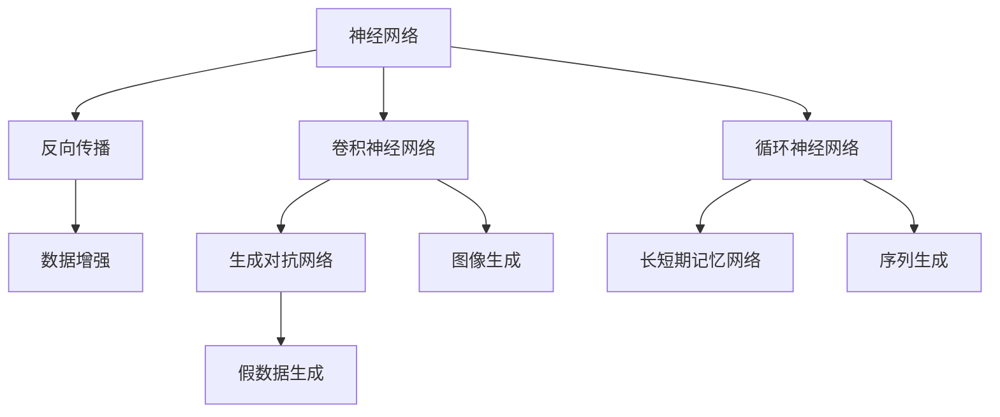

                 

## 1. 背景介绍

神经网络（Neural Networks）作为现代人工智能领域的核心技术之一，从其问世以来，便展现出了强大的学习能力与广泛的应用前景。从图像识别到语音处理，从自然语言处理到智能推荐系统，神经网络在多个领域展示了其在处理复杂任务方面的卓越性能。然而，神经网络这一概念早已不再局限于传统的深度学习模型，它正以多种形式不断拓展其边界，探索未知的领域。

### 1.1 历史回望与里程碑事件

神经网络的起源可以追溯到上世纪40年代末，由麦卡锡（McCulloch）和皮特（Pitts）提出的早期的神经网络模型，开启了这一领域的研究热潮。1980年代，反向传播算法的提出使得训练深度神经网络成为可能，Hinton的卷积神经网络（Convolutional Neural Networks, CNNs）在图像处理领域取得突破，其后，Yann LeCun等人在1998年提出的循环神经网络（Recurrent Neural Networks, RNNs）在处理序列数据上表现出色，带动了语音识别、自然语言处理等领域的发展。

随着2012年AlexNet在图像识别竞赛（ImageNet）中的获胜，深度学习大放异彩，开启了神经网络在实际应用中的快速发展。其后，Google的Inception系列模型、微软的ResNet、NVIDIA的HRNet等模型在图像识别领域持续推进技术边界。与此同时，TensorFlow、PyTorch等深度学习框架的横空出世，使得神经网络模型的训练和部署变得简单高效。

### 1.2 现状与挑战

尽管神经网络技术取得了显著进步，但面对诸多实际问题，如计算资源消耗、模型可解释性、训练效率低下等挑战，神经网络的研究仍需要不断探索和突破。在当前的发展态势下，神经网络正朝着更加高效、稳定、可解释的方向迈进，并进一步拓展到语音、视觉、文本、自然语言处理等多个领域，探索未知的深度学习领域。

## 2. 核心概念与联系

### 2.1 核心概念概述

在深入探讨神经网络之前，我们需要了解一些基本概念：

- **神经网络**：由大量人工神经元连接而成的计算模型，旨在解决各种复杂问题。
- **反向传播**：一种用于训练神经网络的无监督学习算法，通过计算梯度，调整网络权重以最小化损失函数。
- **卷积神经网络（CNNs）**：一种特殊的神经网络，用于处理具有网格结构的数据，如图像和音频，是视觉任务中应用最广泛的神经网络结构之一。
- **循环神经网络（RNNs）**：设计用于处理序列数据（如文本、语音、视频等），通过记忆网络内部的状态信息，捕捉时间序列数据的时序依赖关系。
- **长短期记忆网络（LSTMs）**：一种特殊类型的RNNs，能够有效解决梯度消失问题，长期记忆能力更强，适用于复杂的序列任务。
- **生成对抗网络（GANs）**：由生成器网络与判别器网络组成的对抗模型，能够生成高质量的假数据，用于数据增强、图像生成等领域。

这些核心概念共同构成了神经网络的基本框架，支撑着其在不同领域的应用和发展。

### 2.2 核心概念联系

核心概念之间的联系可通过以下Mermaid流程图进行展示：



这个流程图展示了神经网络的核心组件及其关联：

1. **神经网络**通过反向传播算法训练，学习输入数据的特征表示。
2. **卷积神经网络（CNNs）**针对具有网格结构的数据（如图像），利用卷积和池化操作提取局部特征。
3. **循环神经网络（RNNs）**处理序列数据，通过状态信息捕捉时序依赖关系。
4. **长短期记忆网络（LSTMs）**进一步增强了RNNs的记忆能力，解决梯度消失问题。
5. **生成对抗网络（GANs）**通过生成器和判别器网络的对抗训练，生成逼真的假数据。
6. **数据增强**和**图像生成**等应用都是基于CNNs模型的进一步拓展。
7. **序列生成**则依赖于RNNs和LSTMs网络。
8. **假数据生成**则是GANs模型的核心应用。

这些概念相互联系，共同构建起深度学习的宏伟架构，推动着神经网络技术在更多未知领域的应用。

## 3. 核心算法原理 & 具体操作步骤

### 3.1 算法原理概述

神经网络的核心算法原理主要涉及以下几个方面：

- **前向传播（Forward Propagation）**：输入数据通过网络层层的变换，最终产生输出结果。
- **损失函数（Loss Function）**：衡量模型预测输出与真实标签之间的差距，用于指导模型的训练。
- **反向传播（Backward Propagation）**：通过计算梯度，调整网络权重以最小化损失函数。
- **优化器（Optimizer）**：如Adam、SGD等，用以控制训练过程中的参数更新方式，以加速模型收敛。
- **正则化（Regularization）**：如L2正则、Dropout等，防止模型过拟合。

### 3.2 算法步骤详解

基于上述核心算法原理，神经网络的基本操作步骤如下：

1. **数据准备**：收集和预处理训练数据集和验证数据集。
2. **模型定义**：选择合适的神经网络结构，如CNNs、RNNs、LSTMs等。
3. **损失函数定义**：根据任务类型选择合适的损失函数，如交叉熵损失、均方误差损失等。
4. **优化器选择**：选择合适的优化器及其参数，如Adam、SGD等。
5. **模型训练**：使用训练数据集进行模型训练，使用验证数据集进行模型验证，防止过拟合。
6. **模型评估**：在测试数据集上对模型进行评估，计算模型性能指标。
7. **模型部署**：将训练好的模型部署到实际应用中。

### 3.3 算法优缺点

神经网络在各个应用领域中表现出卓越的性能，但同时其训练过程也面临诸多挑战：

**优点**：
1. **处理复杂数据能力强**：神经网络能够处理包括文本、图像、声音在内的多种类型的数据，通过多层结构提取深层特征，有效解决非线性问题。
2. **自适应学习能力**：神经网络能够自动学习输入数据的特征表示，适合处理大规模、非结构化数据。
3. **应用广泛**：在图像识别、语音识别、自然语言处理、智能推荐等多个领域取得突破，推动了人工智能技术的应用落地。

**缺点**：
1. **计算资源消耗大**：神经网络的训练和推理过程需要大量计算资源，特别是在大型深度神经网络中，计算开销显著增加。
2. **模型可解释性差**：深度神经网络通常被视为“黑盒”模型，难以解释其内部决策逻辑，影响其应用场景的选择。
3. **过拟合风险高**：特别是在训练数据较少时，神经网络容易过拟合，泛化能力降低。
4. **训练效率低下**：深层神经网络训练时间长，需要反复调整超参数，才能达到最优性能。

### 3.4 算法应用领域

神经网络在多个领域展现出强大的应用潜力，主要包括以下几个方面：

- **计算机视觉**：在图像分类、目标检测、图像分割等任务上表现出色，广泛应用于自动驾驶、医疗影像、视频监控等场景。
- **自然语言处理**：在文本分类、情感分析、机器翻译、对话系统等任务上取得突破，推动了智能客服、智能推荐、智能写作等领域的发展。
- **语音处理**：在语音识别、语音合成、语音情感分析等任务上表现优异，广泛应用于智能音箱、语音助手、电话客服等领域。
- **强化学习**：结合深度学习和强化学习，用于游戏策略、机器人控制、推荐系统等，推动了智能游戏、智能制造、智能推荐等方向的发展。

## 4. 数学模型和公式 & 详细讲解 & 举例说明

### 4.1 数学模型构建

神经网络的基本数学模型可以表示为：

$$
\mathcal{F}(x;w,b)=\mathcal{H}(\mathcal{F}_{L-1}(\cdots\mathcal{F}_1(x;w_1,b_1)))
$$

其中，$x$ 为输入数据，$w$ 为网络参数，$b$ 为偏置项，$L$ 为网络层数，$\mathcal{F}_l$ 表示第 $l$ 层的非线性变换，$\mathcal{H}$ 为激活函数。

### 4.2 公式推导过程

以简单的单层神经网络为例，假设输入向量为 $x$，输出向量为 $y$，网络参数为 $w$ 和 $b$，则前向传播过程可以表示为：

$$
y=f(w^Tx+b)=f(\sum_{i=1}^{n}w_ix_i+b)
$$

其中，$f$ 为激活函数，如Sigmoid、ReLU、Tanh等。

反向传播过程中，损失函数对每个参数的梯度可以表示为：

$$
\frac{\partial \mathcal{L}}{\partial w_i}=\frac{\partial \mathcal{L}}{\partial y}\frac{\partial y}{\partial w_i}
$$

利用链式法则，可以得到损失函数对每个参数的梯度更新公式：

$$
w_i \leftarrow w_i-\eta\frac{\partial \mathcal{L}}{\partial w_i}
$$

其中 $\eta$ 为学习率。

### 4.3 案例分析与讲解

假设我们需要训练一个用于手写数字识别的卷积神经网络模型。模型的输入为28x28像素的图像，输出为0到9之间的整数标签。使用交叉熵损失函数，则损失函数可以表示为：

$$
\mathcal{L}=-\frac{1}{N}\sum_{i=1}^N\sum_{j=1}^{10}y_i\log p_j
$$

其中 $y_i$ 为第 $i$ 个样本的真实标签，$p_j$ 为模型预测输出的概率分布。

为了训练模型，我们需要定义卷积层、池化层、全连接层等网络组件，并选择合适的激活函数和损失函数。使用反向传播算法，逐步调整网络参数，最小化损失函数。

## 5. 项目实践：代码实例和详细解释说明

### 5.1 开发环境搭建

进行神经网络项目实践前，首先需要搭建好开发环境。以下是使用Python和PyTorch框架进行神经网络开发的配置步骤：

1. 安装Python和pip：确保系统已经安装Python 3.6及以上版本，并更新pip。

```bash
sudo apt-get update
sudo apt-get install python3 python3-pip python3-dev python3-venv
```

2. 安装虚拟环境：创建并激活虚拟环境，避免与系统包冲突。

```bash
python3 -m venv myenv
source myenv/bin/activate
```

3. 安装PyTorch：使用pip安装最新版本的PyTorch。

```bash
pip install torch torchvision torchaudio
```

4. 安装Tensorboard：用于可视化训练过程。

```bash
pip install tensorboard
```

5. 安装Jupyter Notebook：用于编写和运行Python代码。

```bash
pip install jupyter notebook
```

完成上述步骤后，即可在虚拟环境中开始神经网络项目的开发。

### 5.2 源代码详细实现

接下来，我们将通过实现一个简单的手写数字识别模型来说明神经网络的实现过程。

首先，导入必要的库和数据集：

```python
import torch
import torch.nn as nn
import torch.optim as optim
from torch.utils.data import DataLoader, Dataset

from torchvision import datasets, transforms
```

定义数据预处理函数：

```python
transform = transforms.Compose([
    transforms.ToTensor(),
    transforms.Normalize((0.1307,), (0.3081,))
])
```

加载训练集和验证集：

```python
trainset = datasets.MNIST('data', train=True, download=True, transform=transform)
trainloader = DataLoader(trainset, batch_size=64, shuffle=True)

testset = datasets.MNIST('data', train=False, download=True, transform=transform)
testloader = DataLoader(testset, batch_size=64, shuffle=False)
```

定义神经网络模型：

```python
class Net(nn.Module):
    def __init__(self):
        super(Net, self).__init__()
        self.conv1 = nn.Conv2d(1, 32, 3, 1)
        self.conv2 = nn.Conv2d(32, 64, 3, 1)
        self.dropout1 = nn.Dropout2d(0.25)
        self.dropout2 = nn.Dropout2d(0.5)
        self.fc1 = nn.Linear(9216, 128)
        self.fc2 = nn.Linear(128, 10)

    def forward(self, x):
        x = self.conv1(x)
        x = nn.functional.relu(x)
        x = self.conv2(x)
        x = nn.functional.relu(x)
        x = nn.functional.max_pool2d(x, 2)
        x = self.dropout1(x)
        x = torch.flatten(x, 1)
        x = self.fc1(x)
        x = nn.functional.relu(x)
        x = self.dropout2(x)
        x = self.fc2(x)
        output = nn.functional.log_softmax(x, dim=1)
        return output
```

定义训练和评估函数：

```python
def train(net, device, trainloader, optimizer, epoch):
    net.train()
    for batch_idx, (data, target) in enumerate(trainloader):
        data, target = data.to(device), target.to(device)
        optimizer.zero_grad()
        output = net(data)
        loss = nn.functional.nll_loss(output, target)
        loss.backward()
        optimizer.step()
        if batch_idx % 10 == 0:
            print('Train Epoch: {} [{}/{} ({:.0f}%)]\tLoss: {:.6f}'.format(
                epoch, batch_idx * len(data), len(trainloader.dataset),
                100. * batch_idx / len(trainloader), loss.item()))

def test(net, device, testloader):
    net.eval()
    test_loss = 0
    correct = 0
    with torch.no_grad():
        for data, target in testloader:
            data, target = data.to(device), target.to(device)
            output = net(data)
            test_loss += nn.functional.nll_loss(output, target, reduction='sum').item()
            pred = output.argmax(dim=1, keepdim=True)
            correct += pred.eq(target.view_as(pred)).sum().item()

    test_loss /= len(testloader.dataset)
    print('\nTest set: Average loss: {:.4f}, Accuracy: {}/{} ({:.0f}%)\n'.format(
        test_loss, correct, len(testloader.dataset),
        100. * correct / len(testloader.dataset)))
```

定义训练过程：

```python
net = Net()
device = torch.device("cuda:0" if torch.cuda.is_available() else "cpu")
net.to(device)

criterion = nn.CrossEntropyLoss()
optimizer = optim.SGD(net.parameters(), lr=0.001, momentum=0.9)

for epoch in range(10):
    train(net, device, trainloader, optimizer, epoch)
    test(net, device, testloader)
```

以上就是使用PyTorch实现手写数字识别的完整代码示例。可以看到，通过定义网络结构、损失函数和优化器，结合数据预处理和训练过程，一个简单的神经网络模型就能够实现。

### 5.3 代码解读与分析

**Net类定义**：
- 定义了一个简单的卷积神经网络，包含两个卷积层、两个全连接层以及两个Dropout层，用于防止过拟合。
- 前向传播过程中，首先经过两个卷积层和池化层，再通过两个全连接层和Dropout层，最终输出预测结果。

**训练和评估函数**：
- 训练函数 `train` 中，将模型置为训练模式，并在每个批次上计算损失函数并反向传播更新参数。
- 评估函数 `test` 中，将模型置为评估模式，计算测试集上的平均损失和准确率。
- 使用 `with torch.no_grad()` 可以避免计算梯度，加快模型推理速度。

**训练过程**：
- 在每个epoch中，分别调用训练和评估函数，并输出平均损失和准确率。

通过上述代码实现，我们可以看到神经网络的训练和推理过程。借助深度学习框架如PyTorch，开发者可以高效地实现复杂的神经网络模型，解决各种实际问题。

## 6. 实际应用场景

### 6.1 计算机视觉

计算机视觉领域是神经网络的重要应用方向之一。随着深度学习技术的发展，神经网络在图像分类、目标检测、图像分割等任务上取得了显著突破。

例如，在图像分类任务中，卷积神经网络（CNNs）通过多层次的卷积和池化操作，提取图像中的关键特征，并进行分类。以AlexNet和VGGNet为例，这两个模型在ImageNet数据集上取得了非常优秀的性能，使得图像分类任务在工业界广泛应用。

目标检测任务要求模型不仅能够识别图像中的物体，还能够准确地定位其位置。基于区域提议和卷积神经网络的目标检测算法，如R-CNN、Fast R-CNN、Faster R-CNN等，已经在实际应用中取得了成功。这些算法能够高效地处理大规模图像数据，并实时返回检测结果，广泛应用于安防监控、无人驾驶、医疗影像等领域。

### 6.2 自然语言处理

自然语言处理（NLP）是神经网络的另一个重要应用领域。在NLP中，神经网络通过自然语言处理和理解，实现了文本分类、情感分析、机器翻译、对话系统等任务。

文本分类任务要求模型将输入的文本数据划分为预定义的类别，如新闻分类、情感分析等。使用RNNs、LSTMs等网络结构，可以有效地处理序列数据，捕捉文本中的语义信息，提高分类准确率。以BERT模型为例，其在文本分类任务上取得了SOTA性能，广泛应用于金融舆情监测、广告推荐、情感分析等场景。

机器翻译任务要求模型将源语言文本翻译为目标语言文本。基于序列到序列（Sequence-to-Sequence, Seq2Seq）的框架，结合Attention机制，神经网络能够实现高质量的翻译效果。谷歌的BERT模型、OpenAI的GPT-3模型等都在翻译任务上展现了出色的性能。

对话系统要求模型能够自然地与用户进行交互，生成流畅、合理的对话内容。基于序列到序列模型，如Seq2Seq、Transformer等，对话系统在客服、智能助手等领域得到了广泛应用。OpenAI的GPT-3模型在对话生成上取得了显著进步，能够生成高质量、多样化的对话内容，推动了智能客服、智能助理等方向的发展。

### 6.3 语音处理

语音处理是神经网络的另一个重要应用方向，涵盖了语音识别、语音合成、语音情感分析等多个领域。

语音识别任务要求模型将用户的语音转换成文本。基于卷积神经网络（CNNs）和循环神经网络（RNNs）的混合模型，如CTC（Connectionist Temporal Classification）、Attention机制等，语音识别系统已经广泛应用于智能音箱、语音助手等场景。

语音合成任务要求模型能够将文本转换成逼真的语音。基于序列到序列（Seq2Seq）模型，如WaveNet、Tacotron等，神经网络能够生成高质量的语音输出。Google的WaveNet模型在语音合成领域取得了显著突破，生成的语音逼真度极高。

语音情感分析任务要求模型能够理解用户语音中的情感倾向，如生气、开心等。基于深度神经网络，如LSTMs、RNNs等，情感分析系统已经在金融舆情监测、情感分析等领域得到了应用。

## 7. 工具和资源推荐

### 7.1 学习资源推荐

为了帮助开发者系统掌握神经网络的理论基础和实践技巧，这里推荐一些优质的学习资源：

1. **《深度学习》（Goodfellow等）**：深入浅出地介绍了深度学习的理论基础和实现方法，是深度学习领域的经典教材。

2. **Coursera的深度学习专项课程**：由Andrew Ng教授讲授，涵盖深度学习的基础知识和实际应用，包括卷积神经网络、循环神经网络、生成对抗网络等。

3. **DeepLearning.ai的深度学习专业证书**：提供系统化、模块化的深度学习课程，涵盖深度学习、计算机视觉、自然语言处理等领域。

4. **《TensorFlow官方文档》**：详细介绍了TensorFlow框架的使用方法，包括搭建模型、训练和推理等各个环节。

5. **Kaggle竞赛平台**：提供丰富的数据集和实际问题，供开发者实践和比拼，提升实战能力。

通过对这些学习资源的系统学习，相信你一定能够快速掌握神经网络的核心概念和应用技巧，并应用于解决实际问题。

### 7.2 开发工具推荐

在神经网络开发过程中，选择合适的工具可以大大提高开发效率和模型性能。以下是几款常用的开发工具推荐：

1. **PyTorch**：由Facebook开源的深度学习框架，灵活高效，适合快速迭代研究。

2. **TensorFlow**：由Google主导开发的深度学习框架，生产部署方便，适合大规模工程应用。

3. **MXNet**：由Apache开发的深度学习框架，支持分布式训练和多种硬件平台，适合大规模深度学习模型的开发。

4. **Jupyter Notebook**：提供交互式的编程环境，支持Python、R等多种语言，方便开发者编写和运行代码。

5. **Visual Studio Code**：轻量级的代码编辑器，支持丰富的插件和扩展，适合Python和深度学习开发。

6. **Git版本控制**：使用Git进行代码版本控制，方便团队协作和代码管理。

这些工具能够帮助开发者高效地进行神经网络的开发、调试和优化，提升模型的性能和可维护性。

### 7.3 相关论文推荐

神经网络领域的研究进展迅速，以下是几篇经典的深度学习论文，推荐阅读：

1. **ImageNet Large Scale Visual Recognition Challenge**：AlexNet在2012年ImageNet挑战赛上取得突破，标志着深度学习在图像识别领域的崛起。

2. **Deep Residual Learning for Image Recognition**：ResNet在2015年ImageNet挑战赛中取得优异成绩，推动了深度神经网络的发展。

3. **Attention Is All You Need**：Transformer模型的提出，改变了NLP任务的处理方式，显著提升了机器翻译、文本生成等任务的性能。

4. **Generative Adversarial Nets**：GANs模型的提出，使得神经网络能够生成高质量的假数据，应用于图像生成、视频生成等领域。

5. **BERT: Pre-training of Deep Bidirectional Transformers for Language Understanding**：BERT模型在自然语言处理领域取得了突破，刷新了多项任务的性能指标。

6. **GPT-3: Language Models are Unsupervised Multitask Learners**：GPT-3模型在文本生成、对话生成等任务上展现了强大的语言理解能力，推动了自然语言处理技术的发展。

这些论文代表了神经网络技术的发展脉络，通过阅读这些前沿成果，可以帮助研究者把握学科前进方向，激发更多的创新灵感。

## 8. 总结：未来发展趋势与挑战

### 8.1 总结

本文对神经网络的基本概念和核心算法进行了详细阐述，并通过一个简单的手写数字识别示例，展示了神经网络的实现过程。文章还介绍了神经网络在计算机视觉、自然语言处理、语音处理等多个领域的实际应用，展望了神经网络未来发展的方向。

通过本文的系统梳理，可以看到神经网络在各个领域的应用前景，以及其在处理复杂任务上的卓越能力。同时，我们也提到了神经网络在实际应用中面临的诸多挑战，如计算资源消耗大、模型可解释性差、训练效率低下等。这些挑战需要我们在未来不断探索和突破，才能使神经网络技术更好地服务于社会。

### 8.2 未来发展趋势

展望未来，神经网络技术将继续发展，以下是几个可能的方向：

1. **更高效的模型设计**：随着硬件算力的提升，神经网络模型的规模将进一步扩大，模型结构和参数设计也将更加复杂。未来的神经网络模型可能会引入更多创新设计，如自适应网络、自监督学习等。

2. **更智能的训练算法**：未来的训练算法可能会引入更多的优化策略，如基于自适应学习率、基于强化学习等，提高训练效率和模型性能。

3. **更广泛的应用领域**：神经网络技术将进一步拓展到更多领域，如医疗影像、金融舆情、智能制造等，为各行各业带来变革性影响。

4. **更深入的理论研究**：随着神经网络技术的发展，理论研究将更加深入，特别是在神经网络的优化、泛化、解释性等方面。

5. **更紧密的与其他AI技术的融合**：神经网络将与其他AI技术（如强化学习、知识图谱等）进行更深入的融合，共同推动人工智能技术的发展。

### 8.3 面临的挑战

尽管神经网络技术取得了显著进展，但在迈向更加智能化、普适化应用的过程中，它仍面临诸多挑战：

1. **计算资源消耗大**：神经网络模型的训练和推理过程需要大量计算资源，特别是在大型深度神经网络中，计算开销显著增加。

2. **模型可解释性差**：深度神经网络通常被视为“黑盒”模型，难以解释其内部决策逻辑，影响其应用场景的选择。

3. **训练效率低下**：深层神经网络训练时间长，需要反复调整超参数，才能达到最优性能。

4. **过拟合风险高**：特别是在训练数据较少时，神经网络容易过拟合，泛化能力降低。

5. **数据隐私和安全**：在处理敏感数据时，如何保护用户隐私，避免数据泄露，是神经网络技术面临的重要挑战。

### 8.4 研究展望

未来的神经网络研究需要在以下几个方面寻求新的突破：

1. **研究更加高效的模型结构**：设计更加轻量级、高效的结构，如MobileNet、EfficientNet等，以适应资源受限的场景。

2. **探索更智能的训练方法**：引入自适应学习率、强化学习等算法，提高训练效率和模型性能。

3. **结合更多先验知识**：将符号化的先验知识与神经网络进行融合，增强模型的可解释性和泛化能力。

4. **探索可解释性更好的模型**：设计更易于解释的模型结构，提高模型的可解释性和可信度。

5. **开发更安全的模型**：引入隐私保护技术，设计更安全的模型结构，确保数据隐私和安全。

这些研究方向的探索，必将引领神经网络技术迈向更高的台阶，为构建安全、可靠、可解释、可控的智能系统铺平道路。面向未来，神经网络技术还需要与其他AI技术进行更深入的融合，多路径协同发力，共同推动人工智能技术的发展。只有勇于创新、敢于突破，才能不断拓展神经网络技术的边界，让智能技术更好地造福人类社会。

## 9. 附录：常见问题与解答

**Q1: 神经网络中为何需要使用激活函数？**

A: 激活函数用于增加神经网络的非线性表达能力，使得神经网络能够处理更复杂的数据关系。如果没有激活函数，神经网络将退化成线性模型，无法学习非线性特征。

**Q2: 深度学习中的过拟合现象如何解决？**

A: 深度学习中的过拟合现象可以通过正则化、数据增强、早停法等技术解决。正则化通过添加L1或L2正则项，防止模型参数过大；数据增强通过扩充训练集，增强模型的泛化能力；早停法通过在验证集上监测模型性能，避免模型在训练集上过拟合。

**Q3: 卷积神经网络（CNNs）与循环神经网络（RNNs）的区别是什么？**

A: CNNs主要用于处理具有网格结构的数据，如图像和视频，通过卷积和池化操作提取局部特征；RNNs主要用于处理序列数据，如文本和语音，通过状态信息捕捉时序依赖关系。

**Q4: 生成对抗网络（GANs）的原理是什么？**

A: GANs由生成器网络和判别器网络组成，生成器网络负责生成逼真的假数据，判别器网络负责判断数据真假。通过生成器与判别器的对抗训练，模型能够生成高质量的假数据，广泛应用于图像生成、视频生成等领域。

通过回答这些问题，读者可以更深入地理解神经网络的核心概念和实际应用，为未来的研究实践提供参考。

---

作者：禅与计算机程序设计艺术 / Zen and the Art of Computer Programming

