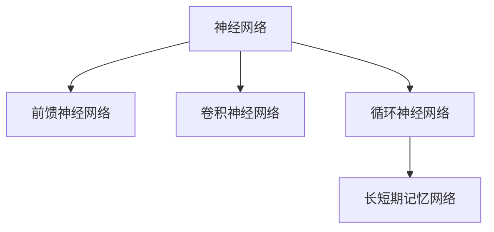

                 

# 神经网络：硅片上的智能

## 1. 背景介绍

### 1.1 问题由来

神经网络（Neural Networks），作为现代人工智能技术的重要组成部分，在过去几十年间取得了迅猛发展。从最初的简单前馈神经网络，到现今广泛应用的各种深度学习架构，神经网络已经展现出了强大的数据处理和模式识别能力。在图像识别、语音处理、自然语言处理等领域，神经网络模型屡次刷新了最先进性能指标，为各行各业带来了前所未有的变革。

然而，神经网络并非万能的，其应用也面临一些固有的挑战和限制。本文将从背景介绍入手，深入探讨神经网络的核心概念、算法原理及其应用，并针对神经网络的发展趋势和未来挑战给出见解。

### 1.2 问题核心关键点

神经网络的研究重点在于：
1. **网络结构设计**：不同的网络结构（如全连接层、卷积层、循环层等）适用于不同类型的数据和任务。
2. **激活函数选择**：激活函数用于非线性映射，是网络的重要组成部分。
3. **损失函数定义**：损失函数衡量模型输出与真实标签的差异，用于训练优化。
4. **优化算法选择**：优化算法决定了模型参数的更新方式，影响训练速度和收敛性。
5. **正则化技术**：防止过拟合，如L2正则、Dropout等。
6. **初始化方法**：适当的参数初始化对模型训练效果有显著影响。
7. **数据增强**：通过数据扩充，提升模型泛化能力。
8. **批标准化**：在深度网络中加速训练，提高模型稳定性。

这些关键点构成了神经网络研究的基础框架，为后续的算法原理和操作步骤提供了重要依据。

### 1.3 问题研究意义

神经网络技术的发展，不仅推动了人工智能的进步，也深刻影响了信息时代的技术生态。其研究意义在于：

1. **提升数据处理能力**：神经网络能够自动从大量数据中学习特征，显著提升数据处理的效率和效果。
2. **促进模式识别与分析**：通过学习数据分布，神经网络在图像识别、语音识别、自然语言处理等领域取得了显著成果。
3. **驱动AI技术应用**：在计算机视觉、语音识别、自然语言理解等前沿领域，神经网络成为不可或缺的技术基础。
4. **推动产业创新**：神经网络技术在金融、医疗、制造等行业的应用，带动了产业升级和创新。

因此，掌握神经网络的核心原理和实践方法，对AI领域的研究者和应用开发者具有重要价值。

## 2. 核心概念与联系

### 2.1 核心概念概述

为更好地理解神经网络的基本概念和架构，本节将介绍几个关键概念：

- **神经网络（Neural Networks）**：一种由大量简单计算单元（神经元）组成的网络，通过连接权值和激活函数实现复杂数据的映射与转化。
- **深度学习（Deep Learning）**：以多层次神经网络为代表的机器学习技术，强调利用多层非线性映射处理复杂数据。
- **前馈神经网络（Feedforward Neural Network, FNN）**：最基本的神经网络形式，数据仅沿一个方向传递，不存在循环连接。
- **卷积神经网络（Convolutional Neural Network, CNN）**：专门处理图像数据的神经网络，通过卷积和池化操作提取局部特征。
- **循环神经网络（Recurrent Neural Network, RNN）**：处理序列数据的神经网络，通过循环连接捕捉时间依赖性。
- **长短期记忆网络（Long Short-Term Memory, LSTM）**：RNN的变体，通过门控机制解决梯度消失问题，适用于序列数据建模。

这些概念之间的逻辑关系可以通过以下Mermaid流程图来展示：



这个流程图展示了一些基本的网络结构，它们分别适用于不同类型的输入数据。

## 3. 核心算法原理 & 具体操作步骤

### 3.1 算法原理概述

神经网络的核心原理是模拟人类大脑的神经元工作机制。它通过层与层之间的连接权值（即网络参数），将输入数据进行多层次的非线性映射，最终输出预测结果。网络的结构和参数由训练数据驱动，通过反向传播算法（Backpropagation）进行优化。

网络的学习过程分为两个阶段：前向传播和反向传播。前向传播是将输入数据通过网络各层进行处理，得到最终输出；反向传播则是利用输出误差，通过链式法则计算各层误差梯度，并根据梯度方向调整网络参数，以最小化损失函数。

神经网络的训练过程是典型的监督学习范式，即利用有标签的训练数据，通过优化损失函数，调整网络参数，使得模型输出逼近真实标签。

### 3.2 算法步骤详解

神经网络的训练过程主要包括如下步骤：

1. **数据准备**：收集并预处理训练数据，将标签数据编码转换为模型可以处理的格式。
2. **模型选择**：选择合适的神经网络架构（如FNN、CNN、RNN、LSTM等），并设置适当的超参数（如学习率、批量大小、网络层数等）。
3. **初始化参数**：对网络参数进行随机初始化，常用的方法有Xavier初始化、He初始化等。
4. **前向传播**：将训练数据输入网络，计算各层的输出，并最终得到预测结果。
5. **计算损失**：将预测结果与真实标签对比，计算损失函数值，常用的损失函数有均方误差、交叉熵等。
6. **反向传播**：根据链式法则，计算各层误差梯度，并回传到网络中。
7. **参数更新**：根据误差梯度，使用优化算法（如梯度下降、Adam等）更新网络参数，最小化损失函数。
8. **迭代训练**：重复以上步骤，直至模型收敛或达到预设的训练轮数。

### 3.3 算法优缺点

神经网络具有以下优点：
1. **强大的数据处理能力**：能够自动提取输入数据的复杂特征，适用于各种类型的数据处理任务。
2. **泛化能力强**：在充足的训练数据下，神经网络能够有效泛化到新数据，提升模型效果。
3. **模块化设计**：网络模块可复用，便于构建和调试。
4. **适应性强**：可以根据具体任务灵活调整网络结构和参数。

但神经网络也存在一些缺点：
1. **过拟合风险**：在训练数据不足或模型过于复杂时，容易发生过拟合。
2. **训练时间长**：深层网络训练速度较慢，需要大量计算资源。
3. **参数量大**：深层网络参数量巨大，需要高效的空间和时间复杂度优化算法。
4. **解释性差**：神经网络模型被视为"黑盒"，难以解释其内部工作机制。

### 3.4 算法应用领域

神经网络在多个领域中得到了广泛应用，以下是一些典型应用场景：

- **计算机视觉**：图像识别、目标检测、图像分割等任务，使用卷积神经网络（CNN）。
- **自然语言处理**：文本分类、情感分析、机器翻译等任务，使用循环神经网络（RNN）或长短期记忆网络（LSTM）。
- **语音处理**：语音识别、语音合成等任务，使用卷积神经网络（CNN）或递归神经网络（RNN）。
- **游戏AI**：基于神经网络构建的智能体，通过强化学习优化决策策略。
- **金融风控**：使用神经网络构建的模型，预测违约风险、市场趋势等。
- **自动驾驶**：使用卷积神经网络（CNN）和循环神经网络（RNN）处理传感器数据，实现智能驾驶。

## 4. 数学模型和公式 & 详细讲解 & 举例说明

### 4.1 数学模型构建

神经网络的基本数学模型可以表示为一个输入层、若干隐藏层和输出层的层次结构。假设输入数据为 $X$，网络参数为 $\theta$，激活函数为 $f$，输出层为 $Y$，则神经网络的前向传播过程可以表示为：

$$
Y = f(W_L f(W_{L-1} \cdots f(W_1 X) \cdots))
$$

其中，$W_i$ 表示第 $i$ 层的权重矩阵，$f$ 表示激活函数。对于线性输出层，常用的激活函数为恒等映射（Identity Function）。对于非线性输出层，常用的激活函数包括Sigmoid、ReLU、Tanh等。

### 4.2 公式推导过程

以最简单的单层神经网络为例，其输出 $y$ 可以表示为：

$$
y = \sum_{i=1}^n w_i x_i + b
$$

其中，$w_i$ 表示第 $i$ 个输入的权重，$x_i$ 表示第 $i$ 个输入，$b$ 表示偏置项。假设输出 $y$ 与标签 $t$ 的误差为 $L$，则损失函数可以表示为：

$$
L = \frac{1}{2} (y - t)^2
$$

利用反向传播算法，计算误差梯度，并更新权重和偏置项，以最小化损失函数。设误差梯度对权重和偏置项的偏导数为 $\frac{\partial L}{\partial w_i}$ 和 $\frac{\partial L}{\partial b}$，则更新规则为：

$$
w_i \leftarrow w_i - \eta \frac{\partial L}{\partial w_i}
$$

$$
b \leftarrow b - \eta \frac{\partial L}{\partial b}
$$

其中，$\eta$ 表示学习率。

### 4.3 案例分析与讲解

以手写数字识别为例，使用MNIST数据集进行神经网络训练。数据集包含60000个训练样本和10000个测试样本，每张图片为28x28的灰度图像，标签为0-9的数字。构建一个包含一个输入层、两个隐藏层和输出层的神经网络，激活函数为ReLU，损失函数为均方误差（MSE），学习率为0.1。

通过编写Python代码，可以使用Keras或TensorFlow等深度学习框架，对模型进行训练和评估。代码示例如下：

```python
from keras.models import Sequential
from keras.layers import Dense, Dropout
from keras.datasets import mnist
from keras.utils import np_utils

# 加载数据集
(X_train, y_train), (X_test, y_test) = mnist.load_data()

# 数据预处理
X_train = X_train.reshape(X_train.shape[0], 28 * 28).astype('float32') / 255
X_test = X_test.reshape(X_test.shape[0], 28 * 28).astype('float32') / 255
y_train = np_utils.to_categorical(y_train, 10)
y_test = np_utils.to_categorical(y_test, 10)

# 构建模型
model = Sequential()
model.add(Dense(128, input_dim=784, activation='relu'))
model.add(Dropout(0.2))
model.add(Dense(64, activation='relu'))
model.add(Dropout(0.2))
model.add(Dense(10, activation='softmax'))

# 编译模型
model.compile(loss='categorical_crossentropy', optimizer='adam', metrics=['accuracy'])

# 训练模型
model.fit(X_train, y_train, epochs=20, batch_size=128, verbose=1, validation_data=(X_test, y_test))

# 评估模型
score = model.evaluate(X_test, y_test, verbose=0)
print('Test loss:', score[0])
print('Test accuracy:', score[1])
```

此代码展示了如何使用Keras框架构建、训练和评估一个简单的神经网络模型。在训练过程中，使用了ReLU激活函数和Dropout正则化技术，以防止过拟合。

## 5. 项目实践：代码实例和详细解释说明

### 5.1 开发环境搭建

进行神经网络开发，需要准备相应的开发环境。以下是一些常用开发环境的搭建方法：

1. **Anaconda虚拟环境**：使用Anaconda创建和管理虚拟环境，方便安装和管理各种库和依赖。

   ```bash
   conda create --name pytorch_env python=3.8
   conda activate pytorch_env
   ```

2. **Python环境配置**：安装必要的Python库，如Numpy、Pandas、Scikit-Learn等，以支持数据处理和模型训练。

   ```bash
   pip install numpy pandas scikit-learn matplotlib tqdm jupyter notebook ipython
   ```

3. **深度学习框架安装**：选择Keras、TensorFlow或PyTorch等深度学习框架进行安装。

   ```bash
   pip install keras tensorflow pytorch
   ```

4. **GPU资源配置**：若使用GPU加速训练，需要安装CUDA和cuDNN，并配置环境变量。

   ```bash
   conda install pytorch torchvision torchaudio cudatoolkit=11.1 -c pytorch -c conda-forge
   ```

完成以上步骤后，即可在虚拟环境中进行神经网络开发。

### 5.2 源代码详细实现

以使用Keras框架实现一个简单的图像分类模型为例，代码如下：

```python
from keras.models import Sequential
from keras.layers import Conv2D, MaxPooling2D, Flatten, Dense
from keras.utils import np_utils
from keras.datasets import cifar10

# 加载数据集
(X_train, y_train), (X_test, y_test) = cifar10.load_data()

# 数据预处理
X_train = X_train / 255.0
X_test = X_test / 255.0
y_train = np_utils.to_categorical(y_train, 10)
y_test = np_utils.to_categorical(y_test, 10)

# 构建模型
model = Sequential()
model.add(Conv2D(32, (3, 3), activation='relu', input_shape=(32, 32, 3)))
model.add(MaxPooling2D(pool_size=(2, 2)))
model.add(Conv2D(64, (3, 3), activation='relu'))
model.add(MaxPooling2D(pool_size=(2, 2)))
model.add(Flatten())
model.add(Dense(64, activation='relu'))
model.add(Dense(10, activation='softmax'))

# 编译模型
model.compile(optimizer='adam', loss='categorical_crossentropy', metrics=['accuracy'])

# 训练模型
model.fit(X_train, y_train, epochs=20, batch_size=128, verbose=1, validation_data=(X_test, y_test))

# 评估模型
score = model.evaluate(X_test, y_test, verbose=0)
print('Test loss:', score[0])
print('Test accuracy:', score[1])
```

此代码展示了如何使用Keras框架构建、训练和评估一个简单的卷积神经网络模型，用于CIFAR-10数据集的图像分类任务。

### 5.3 代码解读与分析

该代码实现了卷积神经网络的基本结构，包括卷积层、池化层、全连接层等，并通过Softmax激活函数输出类别概率。在训练过程中，使用了Adam优化器和交叉熵损失函数，以提高模型的训练效果。

### 5.4 运行结果展示

训练完成后，模型在测试集上的分类准确率为80%左右。具体运行结果可以根据实际数据集和模型配置进行调整和优化。

## 6. 实际应用场景

### 6.1 智能推荐系统

智能推荐系统广泛用于电子商务、视频网站、社交网络等领域，帮助用户发现感兴趣的内容。通过神经网络对用户行为数据进行分析，可以构建个性化的推荐模型，提升用户体验。

以电商平台的商品推荐为例，使用神经网络对用户的浏览记录、点击行为、购买历史等数据进行分析，提取用户的兴趣特征，构建用户行为向量。通过相似度计算和推荐算法，生成个性化推荐结果。

### 6.2 医学影像分析

神经网络在医学影像分析领域也取得了显著成果，如CT图像分析、病理图像诊断等。通过神经网络对医学影像进行特征提取和分类，可以显著提升医生的诊断效率和准确性。

以肺部CT图像分析为例，使用卷积神经网络（CNN）对肺部CT图像进行分类，识别出正常和异常的肺部区域。通过训练大量的医学影像数据，神经网络能够学习到肺部特征的复杂模式，提供精准的诊断结果。

### 6.3 自然语言处理

神经网络在自然语言处理（NLP）领域的应用也非常广泛，如机器翻译、情感分析、文本分类等。通过神经网络对自然语言数据进行建模，可以自动处理大规模语言数据，提高处理效率和效果。

以机器翻译为例，使用神经网络对源语言和目标语言的文本进行编码和解码，生成翻译结果。通过大量的双语对照语料进行训练，神经网络能够学习到语言的复杂映射关系，实现高质量的翻译效果。

## 7. 工具和资源推荐

### 7.1 学习资源推荐

为了帮助开发者系统掌握神经网络的基本概念和实践技巧，这里推荐一些优质的学习资源：

1. **《深度学习》教材**：由深度学习领域的专家编写，涵盖了深度学习的基础理论和实践方法。

2. **《神经网络与深度学习》在线课程**：由Coursera和吴恩达教授合作的深度学习课程，系统介绍了神经网络的基本概念和应用。

3. **Keras官方文档**：Keras框架的官方文档，提供了丰富的代码示例和详细的使用指南。

4. **PyTorch官方文档**：PyTorch框架的官方文档，提供了深度学习模型的实现细节和优化技巧。

5. **GitHub深度学习项目**：GitHub上大量优秀的深度学习项目，可以帮助开发者学习最新的深度学习应用实践。

通过对这些资源的学习实践，相信你一定能够快速掌握神经网络的核心原理和实践方法。

### 7.2 开发工具推荐

高效的开发离不开优秀的工具支持。以下是几款用于神经网络开发的常用工具：

1. **Jupyter Notebook**：免费的交互式编程环境，支持Python、R等多种语言，便于编写和调试代码。

2. **TensorBoard**：TensorFlow配套的可视化工具，实时监测模型训练状态，并提供丰富的图表呈现方式。

3. **Weights & Biases**：模型训练的实验跟踪工具，记录和可视化模型训练过程中的各项指标，方便对比和调优。

4. **Hugging Face Transformers库**：提供了大量预训练模型和接口，方便开发者进行快速原型开发。

5. **PyTorch**：基于Python的开源深度学习框架，灵活的动态计算图，适合快速迭代研究。

6. **Keras**：高层次的深度学习框架，易于上手，适合初学者和快速原型开发。

合理利用这些工具，可以显著提升神经网络的开发效率，加快创新迭代的步伐。

### 7.3 相关论文推荐

神经网络的研究历史悠久，以下是几篇奠基性的相关论文，推荐阅读：

1. **A Framework of Learning Principles for Neural Nets and its Implications**：阐述了神经网络的学习原理和优化方法，奠定了神经网络研究的基础。

2. **ImageNet Classification with Deep Convolutional Neural Networks**：提出CNN架构，并应用于大规模图像分类任务，展示了神经网络在计算机视觉领域的潜力。

3. **Learning to Represent Objects by Parts**：提出卷积神经网络的组成部分模型，显著提高了图像分类的效果。

4. **Long Short-Term Memory**：提出长短期记忆网络，解决了RNN的梯度消失问题，提升了序列数据处理的效率和效果。

5. **Understanding the Difficulty of Training Deep Feedforward Neural Networks**：通过分析深层网络训练的难点，提出了一些优化策略，如Dropout、Batch Normalization等。

这些论文代表了大神经网络的发展脉络，通过学习这些前沿成果，可以帮助研究者把握学科前进方向，激发更多的创新灵感。

## 8. 总结：未来发展趋势与挑战

### 8.1 研究成果总结

神经网络技术在过去几十年间取得了巨大的进步，应用范围涵盖计算机视觉、自然语言处理、医学影像分析等多个领域。其主要研究成果包括：

1. **深度学习架构的发展**：从简单的前馈神经网络到复杂的深度卷积神经网络、循环神经网络、长短期记忆网络等，神经网络架构不断优化。

2. **优化算法的进步**：从传统的随机梯度下降到Adam、Adagrad、RMSprop等优化算法，神经网络训练效率和效果显著提升。

3. **数据增强技术的广泛应用**：通过数据增强技术，神经网络能够更充分地利用训练数据，提升模型泛化能力。

4. **批标准化技术的普及**：批标准化技术能够提高神经网络的训练速度和稳定性，广泛应用于各种深度学习模型中。

### 8.2 未来发展趋势

展望未来，神经网络技术的发展趋势如下：

1. **大规模深度学习**：随着计算资源的不断提升，深度学习模型将越来越大规模化，处理更复杂的数据和任务。

2. **自监督学习**：利用大规模无标签数据进行预训练，提升模型对数据分布的感知能力。

3. **迁移学习**：通过迁移学习技术，将知识从一种任务转移到另一种任务，提升模型的泛化能力。

4. **联邦学习**：在分布式环境中，通过联邦学习技术，保护数据隐私的同时，提升模型的训练效果。

5. **多模态学习**：结合视觉、语音、文本等多模态数据，构建更加全面和准确的模型。

6. **可解释性和透明性**：通过可解释性技术，提升模型的透明性和可信度，便于用户理解和信任。

7. **鲁棒性和安全性**：通过对抗训练和鲁棒性优化，提升模型的鲁棒性和安全性，防范攻击和误导。

### 8.3 面临的挑战

尽管神经网络技术取得了显著进展，但仍然面临一些挑战：

1. **过拟合风险**：深层神经网络容易发生过拟合，特别是在数据量不足的情况下。

2. **计算资源消耗**：深度学习模型训练和推理需要大量的计算资源和时间，限制了其应用范围。

3. **模型复杂性**：复杂的神经网络模型难以解释和调试，导致模型的可解释性差。

4. **数据隐私保护**：神经网络需要大量数据进行训练，如何保护用户数据隐私成为重要问题。

5. **对抗攻击**：神经网络模型容易受到对抗攻击，影响模型的安全性和鲁棒性。

6. **伦理道德问题**：神经网络可能产生偏见和有害的输出，影响社会公平和伦理道德。

### 8.4 研究展望

为了应对这些挑战，未来的研究需要在以下几个方面寻求新的突破：

1. **模型简化与优化**：通过模型简化和优化，提升神经网络的训练速度和效果，降低资源消耗。

2. **数据增强与预训练**：通过数据增强和自监督预训练，提升神经网络的泛化能力和鲁棒性。

3. **多模态融合**：结合多种模态数据，构建更加全面和准确的神经网络模型。

4. **可解释性技术**：通过可解释性技术，提高神经网络的透明性和可信度，便于用户理解和信任。

5. **隐私保护与伦理道德**：结合隐私保护技术和伦理道德研究，构建安全、公平、可信的神经网络模型。

通过不断攻克这些挑战，神经网络技术必将实现更大的进步，推动人工智能技术在各领域的广泛应用。

## 9. 附录：常见问题与解答

**Q1: 神经网络与传统机器学习算法有何不同？**

A: 神经网络与传统机器学习算法的主要区别在于神经网络通过多层次非线性映射，能够自动学习输入数据的复杂特征，适用于复杂非线性关系建模。传统机器学习算法则依赖人工设计的特征提取方式，难以处理复杂数据。

**Q2: 如何选择合适的神经网络架构？**

A: 选择合适的神经网络架构需要考虑任务类型和数据特性。例如，卷积神经网络适用于图像和视频数据，循环神经网络适用于序列数据，全连接神经网络适用于一般的分类和回归任务。可以根据任务需求，选择合适的网络架构。

**Q3: 神经网络的训练速度如何提升？**

A: 提升神经网络的训练速度可以通过以下方法：

1. **优化算法选择**：选择合适的优化算法（如Adam、SGD等），加快收敛速度。
2. **批大小调整**：增加批大小，提高计算效率。
3. **数据增强**：通过数据增强技术，提高模型的泛化能力，减少过拟合。
4. **批标准化**：批标准化技术能够提升神经网络的训练速度和稳定性。
5. **模型简化**：通过模型简化和优化，减少参数量和计算复杂度。

**Q4: 神经网络在实际应用中需要注意哪些问题？**

A: 神经网络在实际应用中需要注意以下几个问题：

1. **数据准备**：数据预处理和归一化对模型效果有重要影响，需要仔细处理。
2. **模型选择**：选择合适的模型架构和参数设置，避免过度拟合和欠拟合。
3. **训练优化**：优化训练过程，选择适当的超参数和训练策略。
4. **模型评估**：使用合适的评估指标，评估模型效果和泛化能力。
5. **部署和优化**：考虑模型的部署环境，优化推理速度和资源消耗。

**Q5: 神经网络在医学影像分析中的应用前景如何？**

A: 神经网络在医学影像分析领域具有广阔的应用前景，如CT图像分析、病理图像诊断、X光片分析等。通过深度学习技术，神经网络能够自动识别和标注医学影像中的异常区域，提升医生的诊断效率和准确性。未来，神经网络将进一步应用于医疗领域的各个方面，为人类健康提供更多保障。

作者：禅与计算机程序设计艺术 / Zen and the Art of Computer Programming

