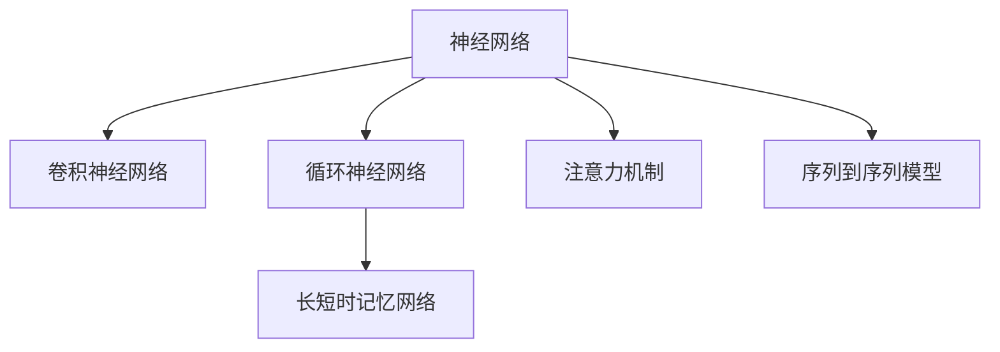

                 

# 神经网络：自然语言处理的新突破

> 关键词：神经网络，自然语言处理, NLP, 深度学习, 人工智能, 文本生成, 序列建模, 语言理解, 机器翻译

## 1. 背景介绍

### 1.1 问题由来
随着互联网的迅猛发展，自然语言处理(Natural Language Processing, NLP)已经成为人工智能(AI)领域中一个快速增长的分支。NLP技术的进步，使得机器能够理解和生成人类语言，从而极大地拓展了人机交互的能力。然而，传统的基于规则和手工特征的NLP方法，在处理大规模、复杂多变的文本数据时，往往显得力不从心。近年来，深度学习(DL)特别是卷积神经网络(CNN)和循环神经网络(RNN)的兴起，为NLP带来了革命性的突破。其中，以卷积神经网络和循环神经网络为代表的神经网络模型，在文本分类、情感分析、机器翻译等任务上取得了显著的性能提升。

### 1.2 问题核心关键点
神经网络在NLP中的应用，核心在于其强大的序列建模能力。通过多层的深度网络结构，神经网络可以自动从数据中学习特征表示，从而构建出更高层次的语言表征。相对于传统的手工特征提取方法，神经网络不仅能够处理大规模数据，而且具备更强的泛化能力和适应性。然而，神经网络模型在NLP中的应用，也存在一些局限性，如训练时间长、计算资源消耗大、模型解释性差等。因此，如何在保持性能的同时，提高模型训练效率和推理速度，增强模型解释性，是一个重要的研究方向。

## 2. 核心概念与联系

### 2.1 核心概念概述

为更好地理解神经网络在NLP中的应用，本节将介绍几个密切相关的核心概念：

- 神经网络(Neural Network, NN)：一种由大量简单神经元构成的计算模型，通过学习调整神经元之间的连接权重，实现对复杂非线性关系的建模。
- 深度学习(Deep Learning, DL)：一种基于多层神经网络的机器学习方法，通过多层抽象层次的特征学习，实现对高维数据的建模和预测。
- 卷积神经网络(Convolutional Neural Network, CNN)：一种特殊的神经网络，通过卷积操作提取局部特征，广泛应用于图像处理、文本分类等任务。
- 循环神经网络(Recurrent Neural Network, RNN)：一种特殊的神经网络，通过循环连接实现对序列数据的建模，广泛应用于文本生成、语言理解等任务。
- 长短时记忆网络(Long Short-Term Memory, LSTM)：一种特殊的RNN，通过引入门控机制，解决了传统RNN在处理长序列数据时的梯度消失问题，广泛应用于机器翻译、语音识别等任务。
- 注意力机制(Attention Mechanism)：一种用于提高序列建模精度的技术，通过动态调整注意力权重，增强模型对关键信息的关注，广泛应用于机器翻译、问答系统等任务。
- 序列到序列模型(Sequence-to-Sequence, Seq2Seq)：一种用于序列到序列转换的神经网络模型，通过编码器-解码器的结构，实现文本生成、语言理解等任务。

这些核心概念之间的逻辑关系可以通过以下Mermaid流程图来展示：



这个流程图展示了大语言模型中不同神经网络模型的关联关系：

1. 神经网络作为基础的计算模型，可以进一步演化为多种形式。
2. CNN在图像处理、文本分类等任务中表现出色。
3. RNN和LSTM通过循环连接，实现了对序列数据的建模，广泛应用于文本生成、语言理解等任务。
4. 注意力机制通过动态调整注意力权重，进一步提高了序列建模的精度。
5. Seq2Seq模型通过编码器-解码器的结构，实现文本生成、语言理解等任务。

## 3. 核心算法原理 & 具体操作步骤
### 3.1 算法原理概述

基于神经网络的自然语言处理，本质上是通过多层神经网络构建的文本表示和预测模型。其核心思想是：将文本序列映射为高维向量，利用多层神经网络对这些向量进行处理，最终输出文本的预测结果。

形式化地，设文本序列为 $\{x_i\}_{i=1}^N$，其中 $x_i \in \mathcal{X}$，$\mathcal{X}$ 为文本的词汇集。设神经网络模型为 $M_{\theta}$，其中 $\theta$ 为模型参数。则文本生成或语言理解的过程可以表示为：

$$
y_i = M_{\theta}(x_i)
$$

其中 $y_i \in \mathcal{Y}$，$\mathcal{Y}$ 为文本生成任务的目标输出集（如词向量、句子向量等）或语言理解任务的目标标签集（如分类标签、实体识别标签等）。

通过反向传播算法，神经网络模型可以自动从数据中学习到最优的参数 $\theta$，使得模型在给定文本序列 $x_i$ 的情况下，能够生成最合理的预测结果 $y_i$。

### 3.2 算法步骤详解

基于神经网络的自然语言处理一般包括以下几个关键步骤：

**Step 1: 准备数据集**
- 收集并标注自然语言处理任务的数据集，如文本分类、机器翻译、文本生成等。
- 将文本序列转换为数字编码，并按固定长度进行填充或截断。

**Step 2: 定义神经网络结构**
- 选择合适的神经网络结构，如卷积神经网络、循环神经网络、长短时记忆网络等。
- 设计神经网络的前向传播和反向传播算法，确保模型能够学习到有效的文本表示。
- 设计损失函数，用于衡量模型预测结果与真实标签之间的差异。

**Step 3: 训练神经网络**
- 使用随机梯度下降等优化算法，最小化损失函数。
- 对神经网络进行迭代训练，不断更新模型参数。
- 在验证集上评估模型性能，根据性能指标决定是否触发 Early Stopping。
- 重复上述步骤直到满足预设的迭代轮数或 Early Stopping 条件。

**Step 4: 评估和部署**
- 在测试集上评估训练后的神经网络，对比训练前后的性能。
- 使用训练好的神经网络对新样本进行推理预测，集成到实际的应用系统中。
- 持续收集新的数据，定期重新训练神经网络，以适应数据分布的变化。

以上是基于神经网络的自然语言处理的一般流程。在实际应用中，还需要针对具体任务的特点，对神经网络结构的各层进行优化设计，如卷积核大小、RNN单元数量、注意力机制等，以进一步提升模型性能。

### 3.3 算法优缺点

基于神经网络的自然语言处理具有以下优点：
1. 强大的序列建模能力：通过多层网络结构，神经网络可以自动从数据中学习到复杂的特征表示，从而实现对高维数据的建模。
2. 高泛化能力：神经网络模型能够处理大规模数据，并具备较强的泛化能力，适应各种NLP任务。
3. 适应性强：神经网络模型可以适应不同领域的文本数据，无需进行大量手工特征工程。

同时，神经网络在NLP中的应用也存在一些局限性：
1. 训练时间长：神经网络模型通常需要大量的标注数据和计算资源，训练时间较长。
2. 计算资源消耗大：神经网络模型在推理时也需要较大的计算资源，特别是在处理长序列数据时。
3. 模型解释性差：神经网络模型通常被认为是“黑盒”系统，难以解释其内部工作机制和决策逻辑。
4. 数据敏感性高：神经网络模型对输入数据的噪声和异常值非常敏感，容易受到数据分布的影响。

尽管存在这些局限性，但就目前而言，基于神经网络的自然语言处理仍是最主流的方法之一。未来相关研究的重点在于如何进一步提高训练效率、降低计算资源消耗，同时增强模型的解释性和鲁棒性。

### 3.4 算法应用领域

基于神经网络的自然语言处理方法，在NLP领域已经得到了广泛的应用，覆盖了几乎所有常见任务，例如：

- 文本分类：如情感分析、主题分类、意图识别等。通过神经网络模型学习文本-标签映射。
- 命名实体识别：识别文本中的人名、地名、机构名等特定实体。通过神经网络模型掌握实体边界和类型。
- 关系抽取：从文本中抽取实体之间的语义关系。通过神经网络模型学习实体-关系三元组。
- 问答系统：对自然语言问题给出答案。将问题-答案对作为神经网络模型的输入，进行匹配回答。
- 机器翻译：将源语言文本翻译成目标语言。通过神经网络模型学习语言-语言映射。
- 文本摘要：将长文本压缩成简短摘要。通过神经网络模型抓取文本要点。
- 对话系统：使机器能够与人自然对话。通过神经网络模型对上下文进行处理，生成回复。

除了上述这些经典任务外，神经网络方法也被创新性地应用到更多场景中，如可控文本生成、常识推理、代码生成、数据增强等，为NLP技术带来了全新的突破。随着神经网络模型的不断进步，相信NLP技术将在更广阔的应用领域大放异彩。

## 4. 数学模型和公式 & 详细讲解
### 4.1 数学模型构建

本节将使用数学语言对基于神经网络的自然语言处理过程进行更加严格的刻画。

设神经网络模型为 $M_{\theta}$，其中 $\theta$ 为模型参数。设输入文本序列为 $\{x_i\}_{i=1}^N$，其中 $x_i \in \mathcal{X}$，$\mathcal{X}$ 为文本的词汇集。设神经网络模型的输出为 $\{y_i\}_{i=1}^N$，其中 $y_i \in \mathcal{Y}$，$\mathcal{Y}$ 为神经网络模型的输出空间。

假设神经网络模型的前向传播函数为 $f(\cdot)$，则文本生成或语言理解的过程可以表示为：

$$
y_i = f(M_{\theta}(x_i))
$$

其中 $f(\cdot)$ 为神经网络模型的非线性映射函数，可以是各种不同的激活函数，如ReLU、Tanh、Softmax等。

神经网络的损失函数 $L(\theta)$ 通常为交叉熵损失函数，用于衡量模型预测结果与真实标签之间的差异：

$$
L(\theta) = -\frac{1}{N} \sum_{i=1}^N \log p(y_i \mid x_i; \theta)
$$

其中 $p(y_i \mid x_i; \theta)$ 为模型在输入 $x_i$ 下生成输出 $y_i$ 的概率分布，由神经网络模型的输出结果确定。

通过反向传播算法，神经网络模型可以自动从数据中学习到最优的参数 $\theta$，使得模型在给定文本序列 $x_i$ 的情况下，能够生成最合理的预测结果 $y_i$。

### 4.2 公式推导过程

以下我们以文本分类任务为例，推导交叉熵损失函数及其梯度的计算公式。

假设神经网络模型 $M_{\theta}$ 在输入 $x_i$ 上的输出为 $\hat{y}_i=M_{\theta}(x_i)$，表示模型对文本进行分类的概率分布。真实标签 $y_i \in \{0,1\}$。则二分类交叉熵损失函数定义为：

$$
L_i = -y_i\log \hat{y}_i + (1-y_i)\log (1-\hat{y}_i)
$$

将其代入经验风险公式，得：

$$
L(\theta) = -\frac{1}{N}\sum_{i=1}^N L_i
$$

通过链式法则，损失函数对参数 $\theta$ 的梯度为：

$$
\frac{\partial L(\theta)}{\partial \theta} = -\frac{1}{N}\sum_{i=1}^N \frac{\partial L_i}{\partial M_{\theta}(x_i)}
$$

其中 $\frac{\partial L_i}{\partial M_{\theta}(x_i)}$ 可以进一步展开，利用自动微分技术完成计算。

在得到损失函数的梯度后，即可带入参数更新公式，完成模型的迭代优化。重复上述过程直至收敛，最终得到适应下游任务的最优模型参数 $\theta^*$。

## 5. 项目实践：代码实例和详细解释说明
### 5.1 开发环境搭建

在进行神经网络模型开发前，我们需要准备好开发环境。以下是使用Python进行Keras开发的环境配置流程：

1. 安装Anaconda：从官网下载并安装Anaconda，用于创建独立的Python环境。

2. 创建并激活虚拟环境：
```bash
conda create -n pytorch-env python=3.8 
conda activate pytorch-env
```

3. 安装TensorFlow：根据CUDA版本，从官网获取对应的安装命令。例如：
```bash
conda install tensorflow tensorflow-gpu -c conda-forge
```

4. 安装Keras：从Keras官网下载并安装最新版本的Keras。

5. 安装各类工具包：
```bash
pip install numpy pandas scikit-learn matplotlib tqdm jupyter notebook ipython
```

完成上述步骤后，即可在`pytorch-env`环境中开始神经网络模型开发。

### 5.2 源代码详细实现

下面我以文本分类任务为例，给出使用Keras实现卷积神经网络模型的代码实现。

首先，定义文本分类的模型：

```python
from keras.models import Sequential
from keras.layers import Conv1D, MaxPooling1D, Flatten, Dense

model = Sequential()
model.add(Conv1D(32, 3, activation='relu', input_shape=(None, len(vocab))))
model.add(MaxPooling1D(pool_size=2))
model.add(Flatten())
model.add(Dense(64, activation='relu'))
model.add(Dense(2, activation='softmax'))

model.compile(loss='categorical_crossentropy', optimizer='adam', metrics=['accuracy'])
```

然后，加载并预处理数据：

```python
from keras.datasets import imdb
from keras.preprocessing import sequence

(X_train, y_train), (X_test, y_test) = imdb.load_data(num_words=10000)
maxlen = 500
X_train = sequence.pad_sequences(X_train, maxlen=maxlen)
X_test = sequence.pad_sequences(X_test, maxlen=maxlen)

model.fit(X_train, y_train, batch_size=64, epochs=10, validation_data=(X_test, y_test))
```

接着，定义测试函数：

```python
def test_model(model, X_test, y_test):
    loss, accuracy = model.evaluate(X_test, y_test, verbose=2)
    print('Test loss:', loss)
    print('Test accuracy:', accuracy)
```

最后，在测试集上评估模型：

```python
test_model(model, X_test, y_test)
```

以上就是使用Keras实现卷积神经网络模型的完整代码实现。可以看到，Keras提供了丰富的预定义模型和工具函数，使得神经网络模型的开发过程变得简洁高效。

### 5.3 代码解读与分析

让我们再详细解读一下关键代码的实现细节：

**Sequential模型**：
- 使用Keras的Sequential模型，以线性堆叠的方式定义神经网络模型结构。
- 第一层为卷积层，使用32个大小为3的卷积核，ReLU激活函数，输入维度为序列长度，词汇表大小。
- 第二层为池化层，使用最大池化操作，池化窗口大小为2。
- 第三层为全连接层，64个神经元，ReLU激活函数。
- 第四层为输出层，2个神经元，Softmax激活函数，对应分类任务的2个类别。

**compile方法**：
- 指定损失函数为交叉熵损失，优化器为Adam，评价指标为准确率。

**fit方法**：
- 在训练数据上训练模型，设置批次大小为64，迭代次数为10，使用测试数据进行验证。

**test_model函数**：
- 在测试数据上评估模型，输出损失和准确率。

可以看到，Keras提供的模型和工具函数大大简化了神经网络模型的开发过程，使得开发者可以更专注于模型设计本身。

## 6. 实际应用场景
### 6.1 智能客服系统

基于神经网络模型的智能客服系统，可以广泛应用于企业客户服务领域。传统的客服系统往往需要配备大量人力，高峰期响应缓慢，且难以保持一致性和专业性。而使用训练好的神经网络模型，可以7x24小时不间断服务，快速响应客户咨询，提供自然流畅的语言响应。

在技术实现上，可以收集企业内部的历史客服对话记录，将问题和最佳答复构建成监督数据，在此基础上对预训练神经网络模型进行微调。微调后的神经网络模型能够自动理解用户意图，匹配最合适的答案模板进行回复。对于客户提出的新问题，还可以接入检索系统实时搜索相关内容，动态组织生成回答。如此构建的智能客服系统，能大幅提升客户咨询体验和问题解决效率。

### 6.2 金融舆情监测

金融机构需要实时监测市场舆论动向，以便及时应对负面信息传播，规避金融风险。传统的人工监测方式成本高、效率低，难以应对网络时代海量信息爆发的挑战。基于神经网络模型的文本分类和情感分析技术，为金融舆情监测提供了新的解决方案。

具体而言，可以收集金融领域相关的新闻、报道、评论等文本数据，并对其进行主题标注和情感标注。在此基础上对神经网络模型进行微调，使其能够自动判断文本属于何种主题，情感倾向是正面、中性还是负面。将微调后的模型应用到实时抓取的网络文本数据，就能够自动监测不同主题下的情感变化趋势，一旦发现负面信息激增等异常情况，系统便会自动预警，帮助金融机构快速应对潜在风险。

### 6.3 个性化推荐系统

当前的推荐系统往往只依赖用户的历史行为数据进行物品推荐，无法深入理解用户的真实兴趣偏好。基于神经网络模型的个性化推荐系统，可以更好地挖掘用户行为背后的语义信息，从而提供更精准、多样的推荐内容。

在实践中，可以收集用户浏览、点击、评论、分享等行为数据，提取和用户交互的物品标题、描述、标签等文本内容。将文本内容作为模型输入，用户的后续行为（如是否点击、购买等）作为监督信号，在此基础上微调神经网络模型。微调后的模型能够从文本内容中准确把握用户的兴趣点。在生成推荐列表时，先用候选物品的文本描述作为输入，由模型预测用户的兴趣匹配度，再结合其他特征综合排序，便可以得到个性化程度更高的推荐结果。

### 6.4 未来应用展望

随着神经网络模型的不断进步，基于神经网络技术的自然语言处理将呈现以下几个发展趋势：

1. 模型规模持续增大。随着算力成本的下降和数据规模的扩张，神经网络模型的参数量还将持续增长。超大规模神经网络模型蕴含的丰富语言知识，有望支撑更加复杂多变的NLP任务。

2. 模型性能持续提升。通过更深层次的网络结构和更复杂的模型优化方法，神经网络模型的性能将不断提升，能够处理更加复杂的语言理解和生成任务。

3. 融合多模态信息。当前的神经网络模型通常只聚焦于文本信息，未来将更多地融合视觉、语音等多模态信息，实现更加全面、准确的信息建模。

4. 引入先验知识。将符号化的先验知识，如知识图谱、逻辑规则等，与神经网络模型进行巧妙融合，引导神经网络模型学习更准确、合理的语言模型。

5. 强化学习与因果推理。通过引入强化学习、因果推理等方法，增强神经网络模型的自主学习和决策能力，实现更加智能、灵活的NLP应用。

以上趋势凸显了神经网络模型在NLP领域的广阔前景。这些方向的探索发展，必将进一步提升NLP系统的性能和应用范围，为人类认知智能的进化带来深远影响。

## 7. 工具和资源推荐
### 7.1 学习资源推荐

为了帮助开发者系统掌握神经网络在NLP中的应用，这里推荐一些优质的学习资源：

1. 《深度学习》系列书籍：Ian Goodfellow等著，全面介绍了深度学习的基本概念和算法，是入门NLP领域的好资源。

2. 《自然语言处理综述》系列论文：EMNLP 2018论文集，涵盖了NLP领域最新的研究进展和技术方法，适合了解最新动态。

3. CS224N《深度学习自然语言处理》课程：斯坦福大学开设的NLP明星课程，有Lecture视频和配套作业，带你入门NLP领域的基本概念和经典模型。

4. Deep Learning with Python：Francois Chollet著，介绍了TensorFlow和Keras的使用方法，适合实战练习。

5. TensorFlow官方文档：TensorFlow的官方文档，提供了丰富的模型和工具函数，适合深入学习。

6. PyTorch官方文档：PyTorch的官方文档，提供了灵活的动态计算图和丰富的工具函数，适合研究和开发。

通过对这些资源的学习实践，相信你一定能够快速掌握神经网络在NLP中的应用，并用于解决实际的NLP问题。
###  7.2 开发工具推荐

高效的开发离不开优秀的工具支持。以下是几款用于神经网络模型开发的常用工具：

1. TensorFlow：由Google主导开发的开源深度学习框架，生产部署方便，适合大规模工程应用。

2. PyTorch：由Facebook主导开发的开源深度学习框架，灵活动态的计算图，适合快速迭代研究。

3. Keras：由Francois Chollet开发的高级神经网络API，提供了丰富的预定义模型和工具函数，适合快速开发。

4. Weights & Biases：模型训练的实验跟踪工具，可以记录和可视化模型训练过程中的各项指标，方便对比和调优。

5. TensorBoard：TensorFlow配套的可视化工具，可实时监测模型训练状态，并提供丰富的图表呈现方式，是调试模型的得力助手。

6. Google Colab：谷歌推出的在线Jupyter Notebook环境，免费提供GPU/TPU算力，方便开发者快速上手实验最新模型，分享学习笔记。

合理利用这些工具，可以显著提升神经网络模型的开发效率，加快创新迭代的步伐。

### 7.3 相关论文推荐

神经网络在NLP中的应用源于学界的持续研究。以下是几篇奠基性的相关论文，推荐阅读：

1. "Deep Learning" by Ian Goodfellow: 深度学习领域的经典教材，介绍了深度学习的基本概念和算法。

2. "Convolutional Neural Networks for Sentence Classification" by Kim: 提出了卷积神经网络在文本分类中的应用。

3. "Long Short-Term Memory" by Hochreiter: 引入了长短时记忆网络，解决了传统RNN在处理长序列数据时的梯度消失问题。

4. "Attention Is All You Need" by Vaswani: 提出了Transformer模型，通过自注意力机制实现了高效的文本序列建模。

5. "Sequence to Sequence Learning with Neural Networks" by Sutskever: 提出了Seq2Seq模型，实现了文本生成、语言理解等任务。

6. "GPT-3: Language Models are Unsupervised Multitask Learners" by Brown et al.: 展示了超大语言模型的强大zero-shot学习能力，引发了对于通用人工智能的新一轮思考。

这些论文代表了大语言模型在NLP领域的发展脉络。通过学习这些前沿成果，可以帮助研究者把握学科前进方向，激发更多的创新灵感。

## 8. 总结：未来发展趋势与挑战
### 8.1 总结

本文对基于神经网络的自然语言处理技术进行了全面系统的介绍。首先阐述了神经网络在NLP中的应用背景和意义，明确了神经网络模型在文本生成、语言理解等任务中的独特价值。其次，从原理到实践，详细讲解了神经网络的数学模型和关键步骤，给出了神经网络模型开发的完整代码实例。同时，本文还广泛探讨了神经网络模型在智能客服、金融舆情、个性化推荐等多个行业领域的应用前景，展示了神经网络模型的广阔应用空间。

通过本文的系统梳理，可以看到，基于神经网络的自然语言处理技术正在成为NLP领域的重要范式，极大地拓展了神经网络模型的应用边界，催生了更多的落地场景。得益于大规模语料的预训练和神经网络的强大序列建模能力，神经网络模型在处理大规模文本数据时，具备了独特的优势。未来，伴随神经网络模型的不断演进，基于神经网络技术的自然语言处理必将在更广阔的应用领域大放异彩，深刻影响人类的生产生活方式。

### 8.2 未来发展趋势

展望未来，神经网络在NLP中的应用将呈现以下几个发展趋势：

1. 模型规模持续增大。随着算力成本的下降和数据规模的扩张，神经网络模型的参数量还将持续增长。超大规模神经网络模型蕴含的丰富语言知识，有望支撑更加复杂多变的NLP任务。

2. 模型性能持续提升。通过更深层次的网络结构和更复杂的模型优化方法，神经网络模型的性能将不断提升，能够处理更加复杂的语言理解和生成任务。

3. 融合多模态信息。当前的神经网络模型通常只聚焦于文本信息，未来将更多地融合视觉、语音等多模态信息，实现更加全面、准确的信息建模。

4. 引入先验知识。将符号化的先验知识，如知识图谱、逻辑规则等，与神经网络模型进行巧妙融合，引导神经网络模型学习更准确、合理的语言模型。

5. 强化学习与因果推理。通过引入强化学习、因果推理等方法，增强神经网络模型的自主学习和决策能力，实现更加智能、灵活的NLP应用。

以上趋势凸显了神经网络模型在NLP领域的广阔前景。这些方向的探索发展，必将进一步提升NLP系统的性能和应用范围，为人类认知智能的进化带来深远影响。

### 8.3 面临的挑战

尽管神经网络在NLP中的应用已经取得了显著的成果，但在迈向更加智能化、普适化应用的过程中，它仍面临着诸多挑战：

1. 训练时间长：神经网络模型通常需要大量的标注数据和计算资源，训练时间较长。

2. 计算资源消耗大：神经网络模型在推理时也需要较大的计算资源，特别是在处理长序列数据时。

3. 模型解释性差：神经网络模型通常被认为是“黑盒”系统，难以解释其内部工作机制和决策逻辑。

4. 数据敏感性高：神经网络模型对输入数据的噪声和异常值非常敏感，容易受到数据分布的影响。

尽管存在这些局限性，但就目前而言，基于神经网络的自然语言处理仍是最主流的方法之一。未来相关研究的重点在于如何进一步提高训练效率、降低计算资源消耗，同时增强模型的解释性和鲁棒性。

### 8.4 研究展望

面向未来，神经网络在NLP领域的研究还需要在以下几个方面寻求新的突破：

1. 探索无监督和半监督神经网络方法。摆脱对大规模标注数据的依赖，利用自监督学习、主动学习等无监督和半监督范式，最大限度利用非结构化数据，实现更加灵活高效的NLP模型。

2. 研究参数高效和计算高效的神经网络范式。开发更加参数高效的神经网络模型，在固定大部分预训练参数的同时，只更新极少量的任务相关参数。同时优化神经网络模型的计算图，减少前向传播和反向传播的资源消耗，实现更加轻量级、实时性的部署。

3. 引入因果分析和博弈论工具。将因果分析方法引入神经网络模型，识别出模型决策的关键特征，增强输出解释的因果性和逻辑性。借助博弈论工具刻画人机交互过程，主动探索并规避模型的脆弱点，提高系统稳定性。

4. 纳入伦理道德约束。在模型训练目标中引入伦理导向的评估指标，过滤和惩罚有偏见、有害的输出倾向。同时加强人工干预和审核，建立模型行为的监管机制，确保输出符合人类价值观和伦理道德。

这些研究方向的探索，必将引领神经网络模型在NLP领域的进一步演进，为构建安全、可靠、可解释、可控的智能系统铺平道路。面向未来，神经网络在NLP领域的研究还需要与其他人工智能技术进行更深入的融合，如知识表示、因果推理、强化学习等，多路径协同发力，共同推动自然语言理解和智能交互系统的进步。只有勇于创新、敢于突破，才能不断拓展神经网络模型的边界，让智能技术更好地造福人类社会。

## 9. 附录：常见问题与解答

**Q1：神经网络在NLP中的应用有哪些局限性？**

A: 神经网络在NLP中的应用，尽管具有强大的序列建模能力，但也存在一些局限性：

1. 训练时间长：神经网络模型通常需要大量的标注数据和计算资源，训练时间较长。
2. 计算资源消耗大：神经网络模型在推理时也需要较大的计算资源，特别是在处理长序列数据时。
3. 模型解释性差：神经网络模型通常被认为是“黑盒”系统，难以解释其内部工作机制和决策逻辑。
4. 数据敏感性高：神经网络模型对输入数据的噪声和异常值非常敏感，容易受到数据分布的影响。

尽管存在这些局限性，但就目前而言，基于神经网络的自然语言处理仍是最主流的方法之一。未来相关研究的重点在于如何进一步提高训练效率、降低计算资源消耗，同时增强模型的解释性和鲁棒性。

**Q2：如何使用神经网络模型进行文本分类？**

A: 使用神经网络模型进行文本分类，通常可以采用以下步骤：

1. 收集并标注文本分类任务的数据集。
2. 将文本序列转换为数字编码，并按固定长度进行填充或截断。
3. 定义神经网络模型结构，如卷积神经网络、循环神经网络等。
4. 使用交叉熵损失函数定义损失函数，优化器如Adam等进行模型训练。
5. 在验证集上评估模型性能，根据性能指标决定是否触发Early Stopping。
6. 重复上述步骤直到满足预设的迭代轮数或Early Stopping条件。

以下是一个使用Keras实现卷积神经网络模型进行文本分类的代码示例：

```python
from keras.models import Sequential
from keras.layers import Conv1D, MaxPooling1D, Flatten, Dense
from keras.datasets import imdb
from keras.preprocessing import sequence

(X_train, y_train), (X_test, y_test) = imdb.load_data(num_words=10000)
maxlen = 500
X_train = sequence.pad_sequences(X_train, maxlen=maxlen)
X_test = sequence.pad_sequences(X_test, maxlen=maxlen)

model = Sequential()
model.add(Conv1D(32, 3, activation='relu', input_shape=(None, len(vocab))))
model.add(MaxPooling1D(pool_size=2))
model.add(Flatten())
model.add(Dense(64, activation='relu'))
model.add(Dense(2, activation='softmax'))

model.compile(loss='categorical_crossentropy', optimizer='adam', metrics=['accuracy'])
model.fit(X_train, y_train, batch_size=64, epochs=10, validation_data=(X_test, y_test))
```

在上述代码中，我们使用Keras的Sequential模型定义了一个卷积神经网络，通过交叉熵损失函数和Adam优化器进行训练，最终在测试集上评估模型性能。

**Q3：如何提高神经网络模型的训练效率？**

A: 提高神经网络模型的训练效率，可以通过以下几种方法：

1. 数据增强：通过回译、近义替换等方式扩充训练集，提高模型的泛化能力。
2. 正则化：使用L2正则、Dropout等技术防止过拟合，提高模型泛化能力。
3. 提前停止(Early Stopping)：在验证集上监控模型性能，提前停止训练以防止过拟合。
4. 批量大小(Batch Size)：增大批量大小可以提高模型训练速度，但需要注意内存消耗。
5. 动态学习率：通过动态调整学习率，防止学习率过大或过小影响训练效果。
6. 模型并行：使用分布式训练等技术，提高模型训练速度。

以下是一个使用Keras实现批量大小调整的代码示例：

```python
batch_size = 128
model.fit(X_train, y_train, batch_size=batch_size, epochs=10, validation_data=(X_test, y_test))
```

在上述代码中，我们通过调整批量大小来提高模型训练速度，同时也需要在训练过程中监控模型性能，避免过拟合。

以上是本文对基于神经网络的自然语言处理技术的全面介绍，希望能为读者提供深入的思考和指导。如果你对神经网络在NLP中的应用有更多的疑问，欢迎继续关注我们的后续文章，我们将继续深入探讨这一领域的最新研究和实践进展。

作者：禅与计算机程序设计艺术 / Zen and the Art of Computer Programming

