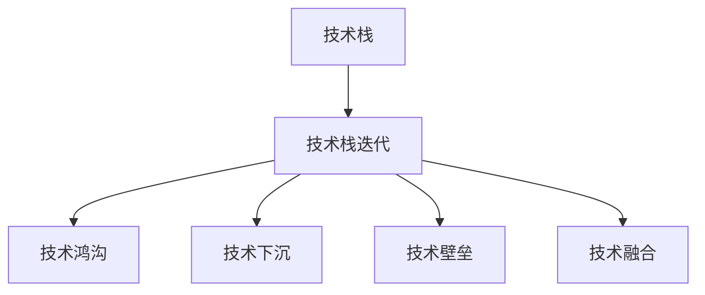
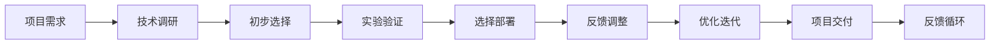

                 

## 1. 背景介绍

在快速发展的IT行业，技术栈的快速迭代已成为常态。新的编程语言、框架、库层出不穷，程序员需要不断学习新知识，以保持技术竞争力。然而，如何在有限的时间里快速掌握新技术，并将其应用到实际项目中，成为了每个程序员面临的重要挑战。本文将从技术栈快速迭代的原因、影响以及应对策略三个方面，全面分析程序员如何在技术变革浪潮中脱颖而出。

## 2. 核心概念与联系

### 2.1 核心概念概述

为更好地理解程序员应对技术栈快速迭代的策略，本节将介绍几个关键概念：

- 技术栈(Technical Stack)：包括编程语言、框架、库等所有构建项目所需的软件组件。
- 技术栈迭代(Stack Rotation)：指新旧技术之间的切换和替换过程。
- 技术鸿沟(Technology Gaps)：新技术与现有技术之间的性能差距、学习曲线等。
- 技术下沉(Technology Downgrading)：为了平滑技术切换，暂时采用旧技术的实践。
- 技术壁垒(Technology Barriers)：新技术难以部署、学习或维护的障碍。
- 技术融合(Technology Integration)：新技术与现有技术的集成与协同应用。

这些概念构成了技术栈迭代的框架，下面通过一个简单的Mermaid流程图来说明它们之间的联系：



### 2.2 核心概念原理和架构的 Mermaid 流程图



该图表示了从项目需求到技术栈选择的迭代过程，包含需求调研、技术选择、实验验证、部署上线、反馈调整等关键步骤。每个步骤都会涉及新旧技术的权衡和融合，最终形成一个持续优化迭代的技术栈。

## 3. 核心算法原理 & 具体操作步骤

### 3.1 算法原理概述

应对技术栈快速迭代的核心算法原理主要包括以下几个方面：

1. **需求分析与优先级排序**：通过明确项目需求，分析新旧技术之间的性能差异、学习难度和集成难度，确定技术迭代的优先级。
2. **实验验证与性能评估**：在实际环境中进行小规模实验，评估新技术的性能指标，如运行速度、内存消耗、扩展性等，判断其是否能满足项目需求。
3. **渐进式切换与平滑过渡**：通过技术下沉，逐步替换部分旧技术组件，以减少对现有系统的影响，平滑过渡到新技术。
4. **持续学习与知识更新**：通过阅读技术博客、参加技术会议、参与开源项目等方式，不断学习新技术，保持技术栈的先进性。
5. **社区协作与资源整合**：利用开源社区的资源和工具，减少技术切换的成本和时间，提升技术融合的效率。

### 3.2 算法步骤详解

基于上述算法原理，以下是具体的步骤详解：

1. **需求分析**：
   - 识别项目需求和业务目标。
   - 调研市场和社区，了解现有技术和未来趋势。
   - 确定技术栈的性能要求和开发成本。
   - 划分技术迭代的优先级，即哪些技术需要优先切换，哪些可以逐步引入。

2. **技术选择**：
   - 根据需求分析结果，筛选出潜在的技术栈选项。
   - 对比这些选项的优缺点，如性能、安全性、易用性、社区支持等。
   - 结合现有系统的兼容性，选择最适合的技术。

3. **实验验证**：
   - 在开发环境中搭建实验环境，评估新技术的性能和稳定性。
   - 进行功能测试和性能测试，确保新技术满足项目需求。
   - 收集实验数据，生成性能对比报告。

4. **渐进式切换**：
   - 确定切换的时机和范围，逐步替换部分旧技术组件。
   - 记录切换过程中的问题和解决方案，生成技术文档。
   - 监控系统表现，确保新技术不会对现有系统造成过大影响。

5. **持续学习**：
   - 定期参加技术培训和研讨会，学习新技术。
   - 阅读技术博客和论文，跟踪最新技术动态。
   - 参与开源项目和社区讨论，积累实践经验。

6. **资源整合**：
   - 利用开源社区的资源和工具，如GitHub、Stack Overflow等。
   - 加入相关的技术社群，获取第一手技术资讯和问题解答。
   - 使用现成的开发工具和框架，减少技术切换的复杂度。

### 3.3 算法优缺点

应对技术栈快速迭代的算法具有以下优点：

1. **灵活性和适应性**：通过需求分析和优先级排序，可以灵活应对变化，选择最适合的技术栈。
2. **渐进性和安全性**：通过渐进式切换和性能验证，降低了技术切换的风险，确保系统稳定。
3. **持续改进**：通过持续学习和资源整合，保持技术栈的先进性，不断提升系统性能。

同时，该算法也存在一些局限性：

1. **学习成本高**：新技术的学习和验证需要一定的时间和资源。
2. **风险不可控**：新技术的不稳定性可能导致系统故障，需要承担一定的风险。
3. **技术融合复杂**：新技术与现有系统之间的融合可能需要较长时间，且需要较高的技术水平。

## 4. 数学模型和公式 & 详细讲解 & 举例说明

### 4.1 数学模型构建

为了量化技术栈迭代的效果，可以构建以下数学模型：

- **切换成本**：$C = c_1 + c_2 + c_3$，其中 $c_1$ 为学习新技术的成本，$c_2$ 为实验验证的成本，$c_3$ 为技术下沉的成本。
- **性能提升**：$P = p_1 + p_2 + p_3$，其中 $p_1$ 为新技术带来的性能提升，$p_2$ 为新技术带来的功能增强，$p_3$ 为新技术带来的稳定性提升。

### 4.2 公式推导过程

根据上述模型，我们可以进行以下推导：

1. **切换成本模型**：
   - $C = c_1 + c_2 + c_3$
   - 学习新技术的成本 $c_1$ 包括阅读文档、编写代码、测试等。
   - 实验验证的成本 $c_2$ 包括搭建实验环境、进行性能测试等。
   - 技术下沉的成本 $c_3$ 包括维护旧技术组件、更新兼容性代码等。

2. **性能提升模型**：
   - $P = p_1 + p_2 + p_3$
   - 新技术带来的性能提升 $p_1$ 通常以性能测试的提升比例表示。
   - 新技术带来的功能增强 $p_2$ 可以以新增功能数量或改进功能数量来衡量。
   - 新技术带来的稳定性提升 $p_3$ 通常以系统故障率的降低来衡量。

### 4.3 案例分析与讲解

假设某个Web应用项目需要进行技术栈迭代，考虑以下技术选项：

1. **旧技术栈**：使用Node.js和Express。
2. **新技术栈**：使用Django和React。

我们可以通过以下步骤进行评估：

1. **需求分析**：项目需要提升性能、增强功能和提高稳定性。
2. **技术选择**：选择Django和React。
3. **实验验证**：在开发环境中部署Django和React，进行性能测试和功能测试。
4. **渐进式切换**：逐步替换部分Express组件为React组件，监控系统表现。
5. **持续学习**：阅读Django和React的相关文档和博客，参与社区讨论。
6. **资源整合**：利用Django和React的社区资源，使用现成的开发工具。

根据上述模型，可以计算出技术迭代的总成本和性能提升：

- **切换成本**：假设 $c_1 = 100$，$c_2 = 200$，$c_3 = 50$，则 $C = 350$。
- **性能提升**：假设 $p_1 = 20\%$，$p_2 = 10$ 个新功能，$p_3 = 50\%$，则 $P = 80$。

因此，技术迭代的收益为 $P - C = 50$，即性能提升20%，新增功能10个，稳定性提升50%。

## 5. 项目实践：代码实例和详细解释说明

### 5.1 开发环境搭建

在进行技术栈迭代时，需要搭建开发环境。以下是使用Docker进行环境配置的步骤：

1. 安装Docker。
2. 创建Dockerfile，定义开发环境的镜像。
3. 编写Docker Compose文件，配置服务启动和依赖关系。
4. 启动Docker容器，进入开发环境。

例如，以下是一个简单的Dockerfile配置：

```Dockerfile
FROM python:3.8
WORKDIR /app
COPY . /app
RUN pip install -r requirements.txt
```

### 5.2 源代码详细实现

以下是一个使用Django和React进行技术栈迭代的代码示例：

1. **旧技术栈**：Node.js和Express。
2. **新技术栈**：Django和React。

**旧技术栈的代码示例**：

```python
from flask import Flask, request, jsonify
app = Flask(__name__)

@app.route('/')
def index():
    return jsonify({'message': 'Hello, world!'})

if __name__ == '__main__':
    app.run(debug=True)
```

**新技术栈的代码示例**：

```javascript
import React from 'react';
import ReactDOM from 'react-dom';
import App from './App';

ReactDOM.render(<App />, document.getElementById('root'));
```

**旧技术栈的代码示例**：

```javascript
const express = require('express');
const app = express();

app.get('/', (req, res) => {
  res.send('Hello, world!');
});

app.listen(3000, () => {
  console.log('Server started on port 3000');
});
```

### 5.3 代码解读与分析

上述代码示例展示了旧技术栈和新技术栈的基本结构。在实际项目中，需要逐步替换旧技术栈，引入新技术栈，并进行性能测试和功能测试。例如，可以使用性能测试工具（如JMeter）对新技术栈进行负载测试，评估其性能表现。

## 6. 实际应用场景

### 6.1 Web应用开发

在Web应用开发中，技术栈迭代是不可避免的。例如，从一个使用Express和Node.js的应用，切换到使用Django和React，可以显著提升Web应用的性能、可维护性和用户体验。

### 6.2 数据科学应用

在数据科学应用中，也需要不断更新技术栈以适应新的数据处理和分析工具。例如，从使用Pandas和NumPy进行数据处理，切换到使用Dask和PySpark进行分布式计算，可以提升数据处理的效率和可扩展性。

### 6.3 移动应用开发

在移动应用开发中，技术栈迭代也是必不可少的。例如，从一个使用原生React Native开发的应用，切换到使用跨平台框架如Flutter或Ionic，可以提升应用的跨平台性能和开发效率。

## 7. 工具和资源推荐

### 7.1 学习资源推荐

为了帮助程序员掌握技术栈迭代的方法和技巧，这里推荐一些优质的学习资源：

1. **《深入理解计算机系统》**：帮助程序员理解底层系统和编程语言。
2. **《Clean Code》**：提供编写高质量代码的指导和建议。
3. **《设计模式》**：介绍常用的设计模式和架构模式，提高系统设计能力。
4. **《GitHub和Git学习指南》**：掌握Git和GitHub的使用，提升协作开发能力。
5. **《持续交付实践指南》**：介绍持续集成、持续部署和持续交付的实践方法。

### 7.2 开发工具推荐

高效的开发离不开优秀的工具支持。以下是几款用于技术栈迭代开发的常用工具：

1. **Docker**：容器化开发环境，方便快速搭建和迁移。
2. **JMeter**：性能测试工具，用于评估Web应用的性能表现。
3. **VSCode**：开发IDE，支持多种编程语言和框架。
4. **Visual Studio**：企业级开发环境，支持大规模团队协作。
5. **GitHub**：版本控制和协作平台，便于代码管理和团队协作。

### 7.3 相关论文推荐

技术栈迭代的研究源于学界的持续探索。以下是几篇重要的相关论文，推荐阅读：

1. **《软件架构演进：基于技术栈迭代的视角》**：提出技术栈迭代的理论框架，探讨架构演进的方法和策略。
2. **《技术栈迭代中的性能优化》**：研究技术栈迭代对系统性能的影响，提出优化策略和方法。
3. **《持续集成与持续部署在技术栈迭代中的应用》**：探讨持续集成和持续部署在技术栈迭代中的应用，提升开发效率和系统稳定性。
4. **《技术栈迭代中的知识共享与社区协作》**：研究技术栈迭代中知识共享和社区协作的方法，提升团队协作和开发效率。

## 8. 总结：未来发展趋势与挑战

### 8.1 总结

本文对技术栈快速迭代的背景、影响以及应对策略进行了全面系统的介绍。通过系统梳理，可以看到技术栈迭代在IT行业中的普遍性和重要性。只有不断学习新技术、灵活应对变化，才能在快速发展的IT行业中保持竞争力和创造力。

### 8.2 未来发展趋势

展望未来，技术栈迭代将继续在IT行业得到广泛应用，带来以下趋势：

1. **新技术的快速涌现**：随着技术创新的加速，新的编程语言、框架和库层出不穷，技术栈迭代的需求将更加频繁。
2. **微服务架构的普及**：微服务架构的普及将促使技术栈迭代更加精细化，提升系统的灵活性和可扩展性。
3. **云原生技术的融合**：云原生技术的融合将使技术栈迭代更加高效和稳定，提升云上应用的开发和运维效率。
4. **数据驱动的决策**：数据驱动的决策将使技术栈迭代更加科学和精准，提升技术栈的选择和优化效果。

### 8.3 面临的挑战

尽管技术栈迭代带来了诸多便利，但在实际操作中也面临一些挑战：

1. **学习成本高**：新技术的学习和验证需要大量的时间和精力。
2. **技术切换风险大**：新技术的不稳定性可能导致系统故障，需要承担一定的风险。
3. **社区支持不足**：一些新技术的社区和生态系统还不够成熟，可能影响其稳定性和扩展性。

### 8.4 研究展望

未来的研究需要在以下几个方面寻求新的突破：

1. **自动化和智能化**：通过自动化工具和智能化算法，降低技术栈迭代的学习成本和切换风险。
2. **跨技术栈协作**：探索跨技术栈协作的方法和工具，提升团队协作效率。
3. **技术栈治理**：提出技术栈治理的框架和方法，确保技术栈的持续优化和稳定。
4. **模型驱动开发**：利用模型驱动开发的方法，提高技术栈迭代的效果和效率。

这些研究方向的探索，将引领技术栈迭代技术迈向更高的台阶，为构建高效、灵活、稳定的IT系统提供新的思路和工具。

## 9. 附录：常见问题与解答

**Q1：技术栈迭代是否适用于所有项目？**

A: 技术栈迭代适用于大多数项目，尤其是那些需要快速响应变化和提升性能的项目。但对于一些对稳定性要求极高的项目，如医疗、金融等，需要进行更加谨慎的技术评估。

**Q2：如何进行技术栈的选择和评估？**

A: 技术栈的选择和评估需要结合项目需求、市场趋势和现有系统，通过需求分析、技术调研和实验验证等方式进行。可以建立技术评估指标，如性能、安全性、易用性、社区支持等，进行综合评估。

**Q3：如何降低技术切换的风险？**

A: 技术切换的风险可以通过技术下沉、渐进式切换和持续学习等方式降低。技术下沉可以在不影响现有系统的情况下逐步引入新技术，渐进式切换可以在小规模测试后逐步替换旧技术，持续学习可以不断更新技术栈，保持先进性。

**Q4：如何提升技术栈迭代的效率？**

A: 技术栈迭代的效率可以通过自动化工具、智能化算法和跨技术栈协作等方式提升。自动化工具可以自动部署和测试新技术，智能化算法可以优化技术栈选择，跨技术栈协作可以提高团队协作效率。

**Q5：技术栈迭代后如何评估效果？**

A: 技术栈迭代后可以通过性能测试、功能测试和用户反馈等方式评估效果。性能测试可以评估新技术的性能提升，功能测试可以评估新增功能和改进效果，用户反馈可以评估用户体验和满意度。

---

作者：禅与计算机程序设计艺术 / Zen and the Art of Computer Programming

