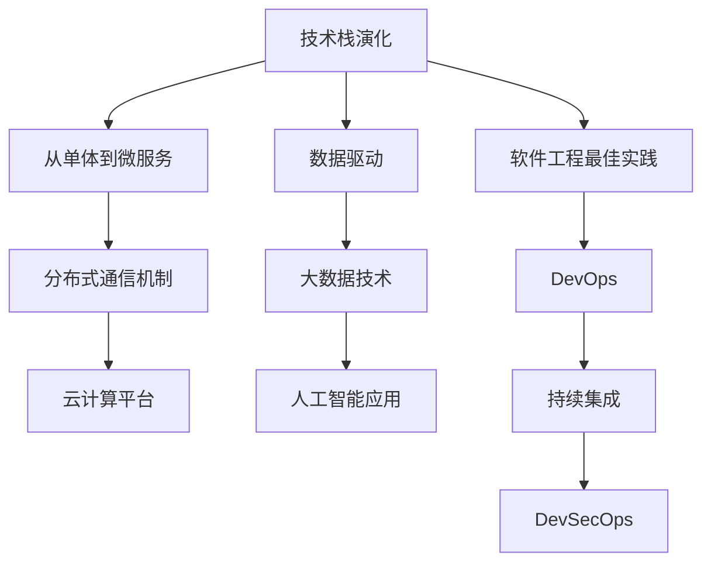

                 

# 程序员如何应对行业变革与转型

在21世纪的数字化浪潮中，技术发展日新月异，行业变革席卷全球。作为一名程序员，面对快速变化的技术环境和不断更迭的行业需求，必须具备前瞻性、适应性和创新精神。本文将探讨程序员如何在行业变革中把握机遇，完成自我转型，并展望未来发展趋势和面临的挑战。

## 1. 背景介绍

### 1.1 行业变革的驱动因素
行业变革由多方面因素驱动，包括但不限于以下几种：

- **技术革新**：如人工智能、大数据、云计算等技术的迅猛发展，深刻影响着各行各业。
- **市场竞争**：企业为了保持竞争力，不断引入新技术和商业模式。
- **政策法规**：如数据隐私保护、网络安全等法规的出台，要求企业合规运营。
- **消费者需求**：消费者对产品和服务的需求日益个性化和多样化。

### 1.2 转型对程序员的影响
行业变革对程序员提出了更高要求：

- **技能更新**：新技术、新框架、新工具层出不穷，程序员需要持续学习，掌握最新技术。
- **职业路径**：传统岗位可能消失，新兴岗位不断涌现，程序员需调整职业规划。
- **工作模式**：远程办公、分布式协作等新工作模式对团队协作提出了新要求。
- **思维方式**：跨学科融合、敏捷开发、持续集成等新思维模式需要适应。

## 2. 核心概念与联系

### 2.1 核心概念概述

本文将围绕以下几个核心概念展开：

- **技术栈演化**：指技术的发展和演变，如从单体应用到微服务、从同步通信到异步消息队列等。
- **云计算与分布式架构**：云计算和分布式架构技术如何改变传统的IT基础设施和开发模式。
- **数据驱动与AI应用**：大数据和人工智能如何革新业务流程和决策支持。
- **软件工程最佳实践**：如DevOps、持续集成、DevSecOps等现代软件工程实践，如何提高效率和质量。

### 2.2 核心概念原理和架构的 Mermaid 流程图



这个流程图展示了核心概念之间的联系。技术栈演化推动了从单体到微服务的演变，分布式通信机制和大数据技术成为数据驱动的重要支撑，人工智能应用在数据分析和决策支持中发挥作用，软件工程最佳实践保障了高质量的交付和安全性。

## 3. 核心算法原理 & 具体操作步骤

### 3.1 算法原理概述

行业变革要求程序员掌握多种技术和工具，以下是一些核心算法和原理：

- **微服务架构**：将大型应用拆分为多个小服务，每个服务独立部署和扩展，提高系统的灵活性和可维护性。
- **容器化与容器编排**：如Docker、Kubernetes等技术，通过容器化实现应用打包和运行，通过容器编排实现动态资源调度。
- **云计算服务**：如AWS、Azure、Google Cloud等，提供弹性计算、存储、网络、安全等服务，支持大规模应用部署。
- **机器学习与深度学习**：通过算法和模型对数据进行学习和预测，实现自动化的数据分析和决策。

### 3.2 算法步骤详解

#### 3.2.1 微服务架构
- **设计服务边界**：根据业务逻辑和数据流，划分服务边界。
- **服务通信协议**：选择REST、gRPC等通信协议，实现服务间数据交换。
- **服务发现与注册**：使用Eureka、Consul等工具，实现服务的发现和注册。
- **服务监控与日志**：集成Prometheus、ELK Stack等工具，实现服务监控和日志管理。

#### 3.2.2 容器化与容器编排
- **应用打包与构建**：使用Dockerfile定义应用镜像，使用Docker build构建镜像。
- **容器部署与运行**：使用Docker run部署容器，使用Kubernetes管理容器集群。
- **自动化部署与扩展**：使用Kubernetes的Deployment和Service实现自动化部署和扩展。

#### 3.2.3 云计算服务
- **计算资源管理**：使用AWS EC2、Azure VM、Google Compute Engine等云实例管理计算资源。
- **存储资源管理**：使用AWS S3、Azure Blob Storage、Google Cloud Storage等云存储管理数据资源。
- **网络与安全管理**：使用AWS VPC、Azure VNet、Google Cloud VPC等管理网络，使用IAM、RBAC等管理安全权限。

#### 3.2.4 机器学习与深度学习
- **数据准备**：清洗、处理和标注数据，准备训练数据集。
- **模型训练与评估**：使用TensorFlow、PyTorch等框架训练模型，使用Kaggle、Scikit-learn等工具评估模型性能。
- **模型部署与优化**：将模型打包成REST API或gRPC服务，使用AWS SageMaker、Azure Machine Learning、Google Cloud AI等平台部署和优化模型。

### 3.3 算法优缺点

- **优点**：
  - **灵活性和可扩展性**：微服务架构和容器化技术提高了系统的灵活性和可扩展性。
  - **高效利用资源**：云计算提供了弹性计算和存储资源，按需使用，提高了资源利用率。
  - **提高自动化程度**：自动化部署和持续集成提高了开发效率和质量。
  - **增强数据驱动能力**：机器学习和深度学习提供了强大的数据分析和预测能力。

- **缺点**：
  - **复杂性增加**：微服务架构和容器编排增加了系统的复杂性，需要更高的技术水平和运维能力。
  - **成本提升**：云计算资源使用需要付费，增加了开发和运维成本。
  - **数据隐私和安全问题**：机器学习和深度学习模型可能涉及敏感数据，数据隐私和安全问题需要重视。

### 3.4 算法应用领域

- **金融科技**：微服务架构和云计算技术广泛应用于高可用、高性能的金融交易系统。
- **互联网应用**：微服务架构和DevOps实践提升了电商、社交、视频等互联网应用的稳定性和用户体验。
- **医疗健康**：云计算和大数据技术支持医疗数据的存储和分析，提高了医疗决策的科学性。
- **智能制造**：机器学习和深度学习技术提升了智能制造的生产效率和产品质量。

## 4. 数学模型和公式 & 详细讲解

### 4.1 数学模型构建

本文将以机器学习和深度学习中的常见模型为例，进行数学模型构建和公式推导。

#### 4.1.1 线性回归模型
线性回归模型用于预测连续型变量，形式如下：

$$
y = \theta_0 + \theta_1x_1 + \theta_2x_2 + \ldots + \theta_nx_n
$$

其中，$y$ 为预测目标，$x_1, x_2, \ldots, x_n$ 为特征变量，$\theta_0, \theta_1, \theta_2, \ldots, \theta_n$ 为模型参数。

#### 4.1.2 逻辑回归模型
逻辑回归模型用于预测二分类结果，形式如下：

$$
P(y=1|x) = \sigma(\theta_0 + \theta_1x_1 + \theta_2x_2 + \ldots + \theta_nx_n)
$$

其中，$P(y=1|x)$ 为$x$属于正类的概率，$\sigma$ 为Sigmoid函数，$\theta_0, \theta_1, \theta_2, \ldots, \theta_n$ 为模型参数。

#### 4.1.3 支持向量机(SVM)
支持向量机用于分类和回归任务，形式如下：

$$
\min_{\theta} \frac{1}{2}\|\theta\|^2 + C\sum_{i=1}^n \text{max}(0, 1-y_i(\theta\cdot x_i + b))
$$

其中，$\theta$ 为模型参数，$b$ 为偏置项，$C$ 为正则化系数，$y_i, x_i$ 为训练集样本的标签和特征向量。

### 4.2 公式推导过程

#### 4.2.1 线性回归模型
- **最小二乘法**：通过最小化预测误差平方和，求解模型参数。
- **梯度下降法**：通过计算梯度下降方向，迭代更新模型参数。

#### 4.2.2 逻辑回归模型
- **极大似然估计**：通过最大化似然函数，求解模型参数。
- **梯度下降法**：通过计算梯度下降方向，迭代更新模型参数。

#### 4.2.3 支持向量机(SVM)
- **拉格朗日乘子法**：通过构造Lagrange函数，求解模型参数。
- **梯度下降法**：通过计算梯度下降方向，迭代更新模型参数。

### 4.3 案例分析与讲解

#### 4.3.1 线性回归案例
假设我们有一组房屋面积和价格数据，目的是预测房价。

- **数据准备**：收集房屋面积和价格数据，进行数据清洗和标准化处理。
- **模型训练**：使用最小二乘法或梯度下降法训练线性回归模型。
- **模型评估**：使用均方误差(MSE)或决定系数(R²)评估模型性能。
- **模型应用**：使用训练好的模型预测新房屋的价格。

#### 4.3.2 逻辑回归案例
假设我们有一组用户行为数据，目的是预测用户是否会购买某产品。

- **数据准备**：收集用户行为数据，进行数据清洗和特征工程。
- **模型训练**：使用极大似然估计或梯度下降法训练逻辑回归模型。
- **模型评估**：使用准确率、召回率、F1分数等评估模型性能。
- **模型应用**：使用训练好的模型预测新用户的购买行为。

#### 4.3.3 支持向量机案例
假设我们有一组客户流失数据，目的是预测哪些客户会流失。

- **数据准备**：收集客户数据，进行数据清洗和特征工程。
- **模型训练**：使用拉格朗日乘子法或梯度下降法训练SVM模型。
- **模型评估**：使用准确率、召回率、F1分数等评估模型性能。
- **模型应用**：使用训练好的模型预测新客户的流失概率。

## 5. 项目实践：代码实例和详细解释说明

### 5.1 开发环境搭建

#### 5.1.1 环境配置

- **操作系统**：Linux Ubuntu 20.04
- **Python**：Python 3.9
- **pip**：pip 21.3
- **JDK**：JDK 8
- **IDE**：IntelliJ IDEA

#### 5.1.2 安装依赖

- **TensorFlow**：`pip install tensorflow==2.6.0`
- **Keras**：`pip install keras==2.6.0`
- **Scikit-learn**：`pip install scikit-learn==0.24.2`

### 5.2 源代码详细实现

#### 5.2.1 线性回归案例

```python
import numpy as np
import pandas as pd
from sklearn.linear_model import LinearRegression
from sklearn.metrics import mean_squared_error, r2_score

# 准备数据
data = pd.read_csv('housing.csv')
X = data[['Gr.liv area', 'Year built', 'Floor area']]
y = data['Price']

# 模型训练
X = np.array(X)
y = np.array(y)
X_train, X_test, y_train, y_test = train_test_split(X, y, test_size=0.2, random_state=42)
model = LinearRegression()
model.fit(X_train, y_train)

# 模型评估
y_pred = model.predict(X_test)
mse = mean_squared_error(y_test, y_pred)
r2 = r2_score(y_test, y_pred)
print(f'Mean Squared Error: {mse:.2f}')
print(f'R²: {r2:.2f}')

# 模型应用
new_data = [[1600, 1990, 120]]
new_data = np.array(new_data)
new_price = model.predict(new_data)
print(f'Predicted Price: {new_price:.2f}')
```

#### 5.2.2 逻辑回归案例

```python
import numpy as np
import pandas as pd
from sklearn.linear_model import LogisticRegression
from sklearn.metrics import accuracy_score, recall_score, f1_score

# 准备数据
data = pd.read_csv('clicks.csv')
X = data[['age', 'income', 'click_count']]
y = data['clicked']

# 模型训练
X = np.array(X)
y = np.array(y)
X_train, X_test, y_train, y_test = train_test_split(X, y, test_size=0.2, random_state=42)
model = LogisticRegression(solver='liblinear')
model.fit(X_train, y_train)

# 模型评估
y_pred = model.predict(X_test)
acc = accuracy_score(y_test, y_pred)
rec = recall_score(y_test, y_pred)
f1 = f1_score(y_test, y_pred)
print(f'Accuracy: {acc:.2f}')
print(f'Recall: {rec:.2f}')
print(f'F1 Score: {f1:.2f}')

# 模型应用
new_data = [[30, 50000, 10]]
new_data = np.array(new_data)
new_clicked = model.predict_proba(new_data)
print(f'Predicted Click: {new_clicked[0][1]:.2f}')
```

#### 5.2.3 支持向量机案例

```python
import numpy as np
import pandas as pd
from sklearn.svm import SVC
from sklearn.metrics import accuracy_score

# 准备数据
data = pd.read_csv('churn.csv')
X = data[['tenure', 'monthly_charges', 'total_charges']]
y = data['churn']

# 模型训练
X = np.array(X)
y = np.array(y)
model = SVC(C=1.0, kernel='linear', degree=3)
model.fit(X_train, y_train)

# 模型评估
y_pred = model.predict(X_test)
acc = accuracy_score(y_test, y_pred)
print(f'Accuracy: {acc:.2f}')

# 模型应用
new_data = [[18, 100, 1200]]
new_data = np.array(new_data)
new_churn = model.predict_proba(new_data)
print(f'Predicted Churn: {new_churn[0][1]:.2f}')
```

### 5.3 代码解读与分析

#### 5.3.1 数据准备

数据准备是模型训练的第一步，需要清洗、处理和标注数据。

- **清洗数据**：去除缺失值、异常值、重复值等。
- **处理数据**：进行归一化、标准化、编码等操作。
- **标注数据**：为每个样本打上标签，准备模型训练数据。

#### 5.3.2 模型训练

模型训练是模型应用的基石，需要选择合适的算法和参数。

- **算法选择**：根据任务需求，选择合适的算法，如线性回归、逻辑回归、SVM等。
- **参数调整**：根据训练集和验证集的表现，调整算法参数，如学习率、正则化系数等。
- **模型评估**：使用交叉验证、均方误差、准确率等指标评估模型性能。

#### 5.3.3 模型应用

模型应用是将模型应用于新数据，生成预测结果。

- **数据预处理**：将新数据转换为模型所需的格式。
- **模型预测**：使用训练好的模型进行预测，生成新数据对应的结果。

## 6. 实际应用场景

### 6.1 金融科技

金融科技领域对数据实时性、安全性和稳定性要求极高。利用机器学习和深度学习技术，可以实现实时风险评估、交易系统优化、客户行为分析等应用。

#### 6.1.1 实时风险评估
利用机器学习模型，对交易数据进行实时分析，识别异常交易行为，及时预警风险。

#### 6.1.2 交易系统优化
利用深度学习模型，优化交易算法，提高交易效率和收益。

#### 6.1.3 客户行为分析
利用大数据和机器学习，分析客户交易行为，发现潜在客户，提升营销效果。

### 6.2 互联网应用

互联网应用需要高可用、高扩展性、高安全性的技术支撑。利用微服务架构、云计算技术和DevOps实践，可以实现高效、稳定的应用部署和运维。

#### 6.2.1 高可用性系统
通过微服务架构，将应用拆分为多个服务，实现服务的弹性扩展和故障隔离，保障系统高可用性。

#### 6.2.2 弹性计算和存储
利用云计算平台，按需使用计算和存储资源，实现应用的高扩展性和资源优化。

#### 6.2.3 DevOps实践
通过持续集成、持续部署(CI/CD)和自动化运维，提升开发效率和系统稳定性，缩短产品交付周期。

### 6.3 医疗健康

医疗健康领域对数据的隐私和安全要求极高。利用大数据和机器学习技术，可以实现疾病预测、患者画像、药物研发等应用。

#### 6.3.1 疾病预测
利用机器学习模型，对患者数据进行预测，提前发现疾病风险，制定预防措施。

#### 6.3.2 患者画像
利用大数据和机器学习，构建患者画像，分析患者的病情和治疗效果，制定个性化治疗方案。

#### 6.3.3 药物研发
利用深度学习模型，分析药物分子结构和生物活性，预测药物效果，加速新药研发。

### 6.4 智能制造

智能制造领域需要高效、灵活、智能的生产系统。利用机器学习和深度学习技术，可以实现生产计划优化、设备预测维护、质量控制等应用。

#### 6.4.1 生产计划优化
利用机器学习模型，分析历史生产数据，优化生产计划，提高生产效率。

#### 6.4.2 设备预测维护
利用深度学习模型，预测设备故障，提前进行维护，减少生产停机时间。

#### 6.4.3 质量控制
利用机器学习模型，分析生产数据，实时监控产品质量，提高产品质量。

## 7. 工具和资源推荐

### 7.1 学习资源推荐

#### 7.1.1 在线课程
- **Coursera**：提供多个计算机科学和数据科学的课程，如《机器学习基础》、《深度学习》等。
- **edX**：提供多个顶尖大学的计算机科学课程，如MIT的《计算机科学与人工智能》等。
- **Udacity**：提供多个计算机科学和数据科学的纳米学位课程，如《深度学习基础》等。

#### 7.1.2 书籍
- **《深入浅出机器学习》**：介绍机器学习基础和常用算法，适合入门学习。
- **《深度学习》**：由深度学习领域的专家撰写，介绍深度学习的理论和实践。
- **《Python深度学习》**：介绍如何使用Python实现深度学习应用，适合编程实践。

#### 7.1.3 在线社区
- **Stack Overflow**：程序员交流问题和分享代码的社区。
- **GitHub**：代码托管和协作开发平台，可访问大量开源项目。
- **Kaggle**：数据科学竞赛平台，提供数据集和算法竞赛，适合实战练习。

### 7.2 开发工具推荐

#### 7.2.1 IDE
- **IntelliJ IDEA**：Java开发的主流IDE，支持多种语言和框架。
- **PyCharm**：Python开发的主流IDE，支持数据科学和机器学习工具。
- **Visual Studio Code**：跨平台的轻量级编辑器，支持多种编程语言和插件。

#### 7.2.2 版本控制
- **Git**：分布式版本控制系统，支持多人协作开发和代码管理。
- **GitHub**：基于Git的代码托管和协作平台，提供代码审查、合并等功能。
- **GitLab**：类似于GitHub的代码托管和协作平台，支持CI/CD和DevOps实践。

#### 7.2.3 数据科学工具
- **Jupyter Notebook**：支持Python和R等语言，用于数据科学和机器学习的交互式编程。
- **RStudio**：R语言的集成开发环境，支持数据科学和统计分析。
- **Tableau**：数据可视化和分析工具，支持多种数据源和可视化方式。

### 7.3 相关论文推荐

#### 7.3.1 机器学习
- **《机器学习》**：由机器学习领域的权威人士撰写，介绍机器学习的基础和应用。
- **《深度学习》**：由深度学习领域的权威人士撰写，介绍深度学习的理论和实践。
- **《Pattern Recognition and Machine Learning》**：由机器学习领域的经典教材，涵盖机器学习的基础和算法。

#### 7.3.2 数据科学
- **《Data Science for Business》**：由数据科学领域的权威人士撰写，介绍数据科学的基础和应用。
- **《Python for Data Analysis》**：介绍如何使用Python进行数据分析和可视化。
- **《Practical Statistics for Data Scientists》**：介绍数据科学中的统计方法和技巧。

## 8. 总结：未来发展趋势与挑战

### 8.1 研究成果总结

本文对程序员如何在行业变革中应对转型进行了系统梳理，主要包括以下内容：

- **技术栈演化**：从单体应用到微服务、从同步通信到异步消息队列。
- **云计算与分布式架构**：云计算平台提供弹性计算和存储资源，微服务架构提高系统的灵活性和可扩展性。
- **数据驱动与AI应用**：机器学习和深度学习提升数据分析和预测能力。
- **软件工程最佳实践**：DevOps、持续集成、DevSecOps等现代软件工程实践提高开发效率和质量。

### 8.2 未来发展趋势

#### 8.2.1 技术演进
- **微服务架构**：更加灵活和可扩展的架构将广泛应用。
- **容器化与容器编排**：容器化技术实现应用的高效部署和扩展。
- **云计算服务**：云计算平台提供更丰富的资源和服务。
- **机器学习与深度学习**：更加高效和可解释的模型将推动应用发展。

#### 8.2.2 应用场景
- **金融科技**：实时风险评估、交易系统优化、客户行为分析等。
- **互联网应用**：高可用性系统、弹性计算和存储、DevOps实践等。
- **医疗健康**：疾病预测、患者画像、药物研发等。
- **智能制造**：生产计划优化、设备预测维护、质量控制等。

#### 8.2.3 生态系统
- **开源社区**：开源工具和框架推动技术发展。
- **数据市场**：数据资源的共享和流通，推动数据驱动决策。
- **云计算生态**：云平台提供丰富的资源和服务，支持大规模应用部署。

### 8.3 面临的挑战

#### 8.3.1 技术挑战
- **复杂性提升**：微服务架构和容器编排增加了系统的复杂性。
- **资源消耗**：云计算资源使用需要付费，增加了开发和运维成本。
- **数据隐私和安全**：机器学习和深度学习模型涉及敏感数据，数据隐私和安全问题需要重视。

#### 8.3.2 人才短缺
- **技术更新快**：新技术和工具不断涌现，需要持续学习和更新知识。
- **跨学科技能**：需要掌握多种技术和工具，提高综合素质。
- **团队协作**：需要良好的沟通和协作能力，提高团队效率。

#### 8.3.3 商业挑战
- **业务需求变化**：行业需求不断变化，需要快速适应和调整。
- **市场需求驱动**：需要根据市场需求，制定技术和业务策略。
- **成本和效益**：需要平衡技术投入和商业回报。

### 8.4 研究展望

#### 8.4.1 技术研发
- **模型优化**：提高模型的准确性和可解释性。
- **算法创新**：探索新的算法和技术，推动技术进步。
- **工具和框架**：开发高效的工具和框架，提高开发效率。

#### 8.4.2 人才培养
- **持续教育**：建立持续教育和培训机制，提升技术水平。
- **跨学科学习**：鼓励跨学科学习，培养综合素质人才。
- **实践经验**：增加实践经验，提高解决问题能力。

#### 8.4.3 行业应用
- **行业融合**：推动技术与行业的深度融合，拓展应用场景。
- **创新应用**：探索新技术在行业中的应用，实现创新突破。
- **商业落地**：将技术转化为商业价值，实现商业化应用。

## 9. 附录：常见问题与解答

### 9.1 常见问题
1. **如何学习新技术？**
   - **学习资源**：参加在线课程、阅读书籍、加入技术社区。
   - **实践项目**：参与开源项目、参加编程竞赛、做小项目练习。

2. **如何选择开发工具？**
   - **需求评估**：根据项目需求和技术栈选择工具。
   - **试用体验**：尝试不同工具，选择最适合的工具。
   - **社区支持**：选择社区活跃、文档齐全的工具。

3. **如何应对技术变革？**
   - **持续学习**：保持好奇心，不断学习新技术。
   - **灵活应对**：适应新技术，调整技术和业务策略。
   - **团队协作**：建立跨学科团队，提高团队协作能力。

### 9.2 解答

通过以上系统分析，相信读者对程序员如何在行业变革中应对转型有了更深刻的理解。无论是在技术栈演进、云计算架构、数据驱动应用还是软件工程实践，我们都需要不断学习、创新和适应，才能在行业变革中抓住机遇，实现自我转型。

本文虽已详细介绍了大语言模型微调，但技术和行业的发展永无止境，程序员需要不断更新知识，拓展视野，才能在未来的技术浪潮中占据一席之地。

---

作者：禅与计算机程序设计艺术 / Zen and the Art of Computer Programming

