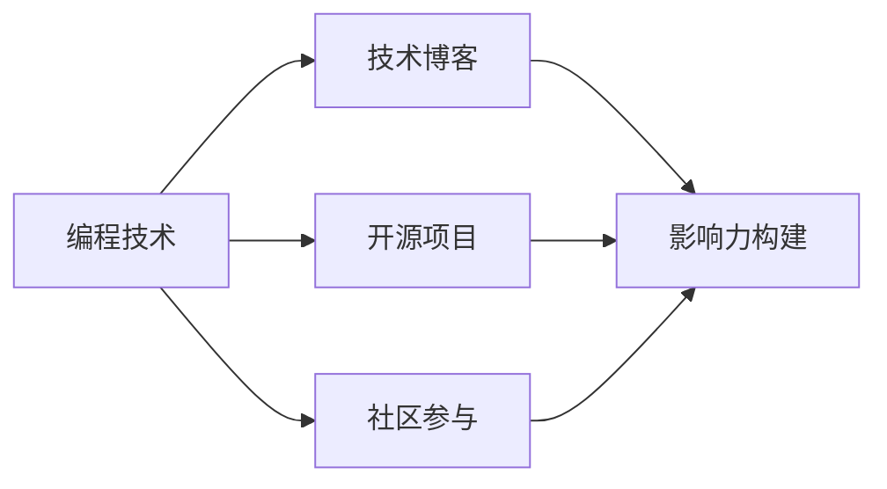

                 

# 程序员如何打造个人品牌IP

> 关键词：个人品牌, 程序员, 软件开发, 技术博客, 开源项目, 社区参与, 影响力构建, 职业发展

## 1. 背景介绍

在当今信息爆炸的时代，个人品牌建设已经成为了程序员职业发展中不可或缺的一部分。无论你是刚刚入行的小白，还是经验丰富的老手，一个强有力的个人品牌都能大大提升你的职场竞争力，获得更多的机会和认可。本文将带你深入了解如何打造并维护一个成功的个人品牌IP，让程序员在职业发展中更上一层楼。

## 2. 核心概念与联系

### 2.1 核心概念概述

在深入探讨个人品牌建设之前，我们首先需要明确几个核心概念：

- **个人品牌（Personal Branding）**：指通过个人行为和表现塑造的，具有独特个性、能力和风格的专业形象。在编程领域，个人品牌通常体现在技术能力、项目经验、创新意识和沟通能力等方面。

- **编程技术**：作为程序员的个人品牌基石，掌握和精通编程技术是基础。包括但不限于编程语言、框架、算法、数据结构等。

- **技术博客**：通过撰写和分享技术文章，展示编程知识和经验，构建技术社区中的影响力。

- **开源项目**：通过参与或贡献开源项目，展示编程能力，建立行业声誉。

- **社区参与**：积极参与编程社区，如GitHub、Stack Overflow等，与同行交流，建立人际网络。

- **影响力构建**：通过以上方式，逐步提升在技术社区中的知名度和影响力，吸引更多的关注和机会。

这些概念之间相互关联，共同构成了程序员个人品牌建设的框架。下面，我们将通过一个Mermaid流程图来展示这些概念之间的联系：



## 3. 核心算法原理 & 具体操作步骤

### 3.1 算法原理概述

个人品牌建设的核心算法原理可以归纳为以下几个方面：

- **曝光率提升**：通过高频次的曝光，让更多人知道并认识你。例如，频繁发布技术博客，参与社区讨论，贡献开源代码等。

- **专业性展现**：通过高质量的技术分享和项目贡献，展示自己的专业能力和独特视角。

- **一致性维护**：保持个人品牌形象的一致性，无论是技术输出还是个人风格，都要始终如一。

- **互动性强化**：通过与他人的互动，建立良好的人际关系，扩展社交网络。

- **信任度建立**：通过持续的高质量贡献，建立他人对你的信任和认可。

这些原理构成了个人品牌建设的算法基础，确保你在技术社区中建立起可靠、专业的形象。

### 3.2 算法步骤详解

#### 步骤1：确定品牌定位

- **自我评估**：分析自己的技术特长、兴趣领域和职业目标，明确个人品牌的定位。

- **目标受众**：确定目标受众，如同行、潜在雇主、技术爱好者等，并根据受众需求调整个人品牌策略。

#### 步骤2：建立技术博客

- **选择平台**：选择适合自己的技术博客平台，如Medium、CSDN、掘金等。

- **内容规划**：规划博客内容，包括技术教程、项目经验、行业观察、个人思考等。

- **持续更新**：定期发布新内容，保持博客活跃度。

#### 步骤3：参与开源项目

- **选择项目**：选择适合自己的开源项目，如GitHub上的热门项目。

- **贡献代码**：从小问题入手，逐步积累贡献。

- **维护项目**：积极参与项目讨论，提出改进建议，提升项目质量和影响力。

#### 步骤4：社区互动

- **加入社群**：加入技术相关的社交平台和社区，如Stack Overflow、Reddit等。

- **积极参与**：回答他人问题，提出有建设性的意见。

- **建立网络**：通过互动建立专业网络，结识同行和潜在的合作伙伴。

#### 步骤5：影响力构建

- **内容推广**：通过社交媒体、邮件列表等渠道推广自己的技术文章和项目贡献。

- **讲座和培训**：参与线上线下的技术讲座和培训，提升知名度。

- **写作和出版**：撰写技术书籍、发表学术文章，进一步巩固技术权威。

### 3.3 算法优缺点

#### 优点：

- **提升职业竞争力**：一个强有力的个人品牌能够显著提升你的职业竞争力，获得更多的机会和认可。

- **拓宽职业发展**：通过个人品牌的建立，你可以接触到更多同行业内的人士，拓宽职业发展的路径。

- **资源聚集**：成功的个人品牌能够吸引更多的资源，如项目机会、合作机会等。

#### 缺点：

- **时间投入大**：个人品牌的建设需要大量的时间投入，尤其是在初期阶段。

- **竞争激烈**：技术社区中拥有大量优秀的技术人才，如何在众多同行中脱颖而出，需要策略和坚持。

- **挑战不断**：个人品牌需要不断地更新和维护，保持与技术发展的同步。

### 3.4 算法应用领域

个人品牌建设不仅仅适用于技术领域，对于任何行业，包括但不限于市场营销、教育、艺术等，都是一个提升个人形象、拓宽职业发展的有效手段。在技术领域，个人品牌尤其重要，因为它直接影响到你的职业发展和行业地位。

## 4. 数学模型和公式 & 详细讲解 & 举例说明

### 4.1 数学模型构建

个人品牌建设可以视为一个动态的优化问题，其中目标函数是个人品牌影响力的最大化，约束条件包括时间、资源和精力等。

- **目标函数**：$$ Maximize\ f(\text{个人品牌}) = \text{曝光率} + \text{专业性} + \text{一致性} + \text{互动性} + \text{信任度} $$
- **约束条件**：$$ \text{时间} \leq \text{可用时间} $$

### 4.2 公式推导过程

为了简化问题，我们引入一个虚拟的“品牌价值”指标 $V$，表示个人品牌的影响力。该指标可以通过以下公式计算：

$$ V = \alpha_1 \times \text{曝光率} + \alpha_2 \times \text{专业性} + \alpha_3 \times \text{一致性} + \alpha_4 \times \text{互动性} + \alpha_5 \times \text{信任度} $$

其中，$\alpha_i$ 为各指标的权重，反映了其在个人品牌建设中的重要性。实际应用中，这些权重需要根据个人情况进行调整。

### 4.3 案例分析与讲解

以张三为例，假设他是一名资深前端开发者。

- **曝光率**：张三在Medium上定期发布技术博客，并分享在GitHub上的开源项目。

- **专业性**：他撰写的博客深入浅出，涵盖了最新前端技术栈，并且经常参与技术会议和讲座。

- **一致性**：无论在博客还是公开场合，张三的沟通风格和表达方式始终如一。

- **互动性**：他积极在社区平台回复他人问题，并参与开源项目的讨论。

- **信任度**：他的开源项目质量和更新频率得到了社区的广泛认可，被认为是一个值得信赖的开发者。

通过计算，张三的品牌价值 $V$ 达到了较高的水平，成为了一名在技术社区中具有较高影响力的人物。

## 5. 项目实践：代码实例和详细解释说明

### 5.1 开发环境搭建

为了高效地构建和维护个人品牌，我们需要搭建一个支持多种平台和工具的开发环境。以下是一个典型开发环境的搭建步骤：

1. **选择博客平台**：根据个人喜好和技术栈选择合适的博客平台，如Medium、CSDN等。

2. **配置开发工具**：安装IDE和版本控制系统，如Visual Studio Code、Git等。

3. **选择开源项目**：选择适合自己技术栈的开源项目，如Node.js、Python等。

4. **社区参与平台**：注册并加入技术社区平台，如Stack Overflow、Reddit等。

### 5.2 源代码详细实现

以下是一个典型的个人品牌建设流程的代码示例，以博客发布和开源项目贡献为例：

```python
class BlogPlatform:
    def __init__(self):
        # 初始化博客平台

    def publish(self, article):
        # 发布博客文章

class GitHubProject:
    def __init__(self, repo_name):
        # 初始化GitHub项目

    def contribute(self, issue_number, fix_code):
        # 提交代码修复

class CommunityPlatform:
    def __init__(self):
        # 初始化社区平台

    def answer_question(self, question_id):
        # 回答社区问题

class Influencer:
    def __init__(self, platform, project, community):
        # 初始化个人品牌构建者

    def update_brand_value(self, exposure, expertise, consistency, interaction, trust):
        # 更新品牌价值

    def build_personal_brand(self):
        # 构建个人品牌
```

### 5.3 代码解读与分析

- **BlogPlatform类**：代表技术博客平台，负责博客文章的发布和管理。

- **GitHubProject类**：代表GitHub上的开源项目，负责项目的贡献和管理。

- **CommunityPlatform类**：代表技术社区平台，负责社区互动和网络拓展。

- **Influencer类**：代表个人品牌构建者，负责综合管理个人品牌建设的过程。

- **update_brand_value方法**：根据各种指标动态更新品牌价值，是个人品牌建设的计算核心。

- **build_personal_brand方法**：综合各类活动和贡献，构建个人品牌。

### 5.4 运行结果展示

通过上述代码实现，个人品牌构建者可以动态跟踪和优化品牌建设过程，实现品牌价值的最大化。运行结果包括品牌价值的数值变化、曝光率、互动次数等指标，用于评估个人品牌的建设效果。

## 6. 实际应用场景

### 6.1 个人品牌在职业发展中的应用

个人品牌建设在职业发展中的应用非常广泛，例如：

- **求职**：通过个人品牌展示自己的技术能力和经验，吸引更多潜在雇主关注。

- **晋升**：在现有职位上，通过个人品牌的建立，获取更多的晋升机会和内部资源。

- **创业**：利用个人品牌吸引投资者和合作伙伴，加速创业进程。

### 6.2 个人品牌在教育培训中的应用

个人品牌在教育培训中的应用同样重要，例如：

- **教师**：通过建立个人品牌，吸引更多的学生和家长，提高教学质量和影响力。

- **讲师**：在技术培训和公开课程中，通过个人品牌提升讲师的专业形象和号召力。

### 6.3 个人品牌在企业内部的应用

个人品牌建设在企业内部同样重要，例如：

- **技术专家**：通过个人品牌展示技术实力，获取更多内部项目和外部合作机会。

- **创新推动者**：利用个人品牌推广新技术和创新想法，推动企业技术创新。

### 6.4 未来应用展望

随着技术的不断进步，个人品牌建设将更加依赖于数据和算法，如机器学习、自然语言处理等。未来，个人品牌建设将变得更加智能和高效，能够自动分析用户行为和反馈，优化个人品牌策略。

## 7. 工具和资源推荐

### 7.1 学习资源推荐

- **《编程技术：深入浅出》系列书籍**：系统介绍编程技术和最佳实践，帮助构建扎实的技术基础。

- **Coursera《编程与软件工程》课程**：学习编程和软件工程的基本知识和技能，提升职业竞争力。

- **《GitHub指南》**：掌握GitHub的使用技巧，管理和贡献开源项目。

- **Medium技术博客**：阅读和分享技术文章，构建技术社区影响力。

- **Stack Overflow**：参与技术讨论，获取编程问题的解决方案。

### 7.2 开发工具推荐

- **Visual Studio Code**：轻量级、高度可定制的IDE，支持多种编程语言和扩展。

- **Git**：版本控制系统，支持代码管理和团队协作。

- **Jekyll**：开源的静态网站生成器，支持博客发布。

- **GitHub Desktop**：GitHub桌面客户端，方便管理和贡献开源项目。

- **Slack**：团队沟通工具，支持频道讨论和文件共享。

### 7.3 相关论文推荐

- **《程序员品牌建设的影响力评估模型》**：分析个人品牌建设的影响因素和评估方法。

- **《技术博客对个人职业发展的影响研究》**：探讨技术博客对职业发展的具体影响。

- **《开源贡献与个人品牌建设的关联性分析》**：研究开源项目对个人品牌建设的影响和作用。

## 8. 总结：未来发展趋势与挑战

### 8.1 研究成果总结

本文系统介绍了程序员如何通过建立个人品牌提升职业竞争力和影响力。通过对编程技术、技术博客、开源项目和社区参与的深入分析，提出了构建个人品牌的核心算法原理和操作步骤。

### 8.2 未来发展趋势

- **技术融合**：未来个人品牌建设将更加依赖于人工智能和大数据分析，实现更智能的策略优化。

- **跨领域应用**：个人品牌建设不仅限于技术领域，将在更多行业和领域得到应用，如教育、医疗等。

- **全球化拓展**：随着互联网的普及，个人品牌建设将跨越地域限制，成为全球化的职业发展手段。

### 8.3 面临的挑战

- **资源限制**：个人品牌建设需要大量的时间和精力，对于时间和精力的限制是一个挑战。

- **竞争激烈**：技术社区中拥有大量优秀的技术人才，如何在众多同行中脱颖而出，需要策略和坚持。

- **信任和声誉**：个人品牌的建立需要长期的维护和积累，任何一次失误都可能影响声誉。

### 8.4 研究展望

未来，个人品牌建设的研究将更加注重数据驱动、算法优化和跨领域应用。通过不断探索和创新，个人品牌建设将为程序员的职业发展带来更多机遇和挑战。

## 9. 附录：常见问题与解答

**Q1：个人品牌建设需要多长时间才能见效？**

A: 个人品牌建设是一个长期的过程，一般需要持续3-6个月甚至更长时间才能见效。关键在于坚持不懈，持续输出高质量的内容和贡献。

**Q2：如何选择合适的开源项目进行贡献？**

A: 选择适合自己的技术栈和兴趣领域，从小的、低风险的项目入手，逐步积累贡献和影响力。

**Q3：如何平衡个人品牌建设和日常工作？**

A: 合理安排时间，利用碎片化时间进行博客更新和社区互动。将个人品牌建设融入日常工作，如撰写技术文章、参与项目讨论等。

**Q4：如何在技术博客中保持高频率更新？**

A: 制定合理的更新计划，保持一定的节奏。利用模板和自动化工具，提高内容输出的效率。

**Q5：如何与其他开发者建立良好的人际关系？**

A: 积极参与社区讨论，主动解答他人问题，提出建设性的意见。在技术会议上主动结识同行，拓展人际网络。

---

作者：禅与计算机程序设计艺术 / Zen and the Art of Computer Programming

