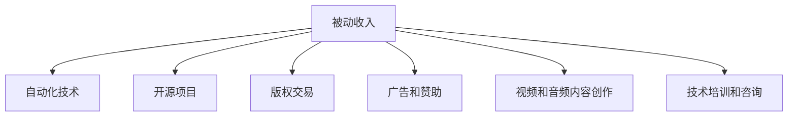

                 

## 1. 背景介绍

在互联网时代，程序员不再局限于传统企业或项目，越来越多地探索多元化收入渠道。构建被动收入系统成为程序员个人财富增长、实现职业自由的重要手段。被动收入，也称为“睡后收入”，是指不需要主动投入时间就能稳定产生的收入。它不仅能带来持续的经济收益，还能提供财务安全感。本文将探讨程序员如何构建多元化的被动收入系统，从原理到实践，帮助读者实现从技术到财务的转型。

## 2. 核心概念与联系

### 2.1 核心概念概述

为更好地理解多元化的被动收入系统，本节将介绍几个关键概念：

- **被动收入**：指不需要主动投入时间就能稳定产生的收入，如投资收益、版权收入、广告收入等。
- **自动化技术**：指通过软件和工具，实现自动化的操作、管理、优化和决策，提高效率和收益。
- **开源项目**：指可以自由获取、使用和修改的开源软件项目，具有高度的协作性和创新性。
- **版权交易**：指将原创技术、内容、软件等版权作品授权他人使用，获取授权费或版税。
- **广告和赞助**：指通过网站、博客、社交媒体等平台，吸引广告主或赞助商，获得流量变现。
- **视频和音频内容创作**：指创作教育、娱乐、信息等视频或音频内容，通过平台变现。
- **技术培训和咨询**：指通过在线课程、个人咨询等方式，提供技术知识和经验，获得收入。

### 2.2 核心概念原理和架构的 Mermaid 流程图



这个流程图展示了几大核心概念之间的逻辑关系：

1. 被动收入通过自动化技术、开源项目、版权交易、广告和赞助、视频和音频内容创作、技术培训和咨询等方式实现。
2. 自动化技术为被动收入的自动化管理、优化和决策提供支持。
3. 开源项目和版权交易通过创造技术和内容，获得持续的收入。
4. 广告和赞助通过平台流量变现，带来被动收入。
5. 视频和音频内容创作和培训咨询通过平台流量变现，带来被动收入。

## 3. 核心算法原理 & 具体操作步骤

### 3.1 算法原理概述

构建被动收入系统，从根本上说，是一个将技术转化为经济收益的过程。核心算法原理可以总结为以下几个步骤：

1. **技术积累**：通过学习和实践，掌握某一技术领域的深度知识和技能。
2. **技术封装**：将技术封装成模块、库或框架，提供复用性。
3. **自动化工具**：使用自动化工具管理和优化技术封装，提高效率和收益。
4. **版权和授权**：通过版权和授权，将技术或内容变现。
5. **流量变现**：通过广告、赞助、内容变现等方式，吸引流量并变现。

### 3.2 算法步骤详解

#### 步骤1：技术积累

1. **选择技术领域**：根据兴趣和市场需求，选择适合的编程语言和技术栈。如Web开发、移动开发、人工智能、数据科学等。
2. **学习与实践**：通过在线课程、书籍、社区和项目实践，系统学习相关技术，并持续实践。

#### 步骤2：技术封装

1. **模块化开发**：将技术实现分解为多个模块，便于复用和管理。
2. **库和框架**：开发和维护公共库或框架，提供给其他开发者使用。
3. **版本控制**：使用Git等版本控制工具，管理和跟踪代码变更。

#### 步骤3：自动化工具

1. **自动化构建**：使用CI/CD工具如Jenkins、GitLab CI等，自动构建和部署代码。
2. **自动化测试**：使用测试框架如JUnit、PyTest等，自动化执行测试用例。
3. **自动化部署**：使用容器化技术如Docker、Kubernetes等，自动化部署和管理应用。

#### 步骤4：版权和授权

1. **开源项目**：将技术封装成开源项目，发布到GitHub、GitLab等平台。
2. **版权声明**：在开源项目中使用开源协议（如MIT、Apache等），明确版权和使用权限。
3. **商业化**：对于商业需求，提供定制化解决方案或授权使用。

#### 步骤5：流量变现

1. **网站和博客**：创建个人网站或博客，发布技术文章、教程和案例。
2. **广告和赞助**：在网站或博客上放置广告，或吸引赞助商合作。
3. **内容变现**：通过平台如B站、抖音、视频付费等，变现视频和音频内容。
4. **技术培训**：通过平台如Udemy、Coursera等，提供在线课程和培训。

### 3.3 算法优缺点

#### 优点：

1. **持续收益**：被动收入系统一旦搭建完成，可以持续产生收益，无需持续投入时间和精力。
2. **灵活性强**：可根据市场需求和技术趋势，灵活调整和优化技术和服务。
3. **门槛较低**：大部分技术和工具已开源和成熟，易于上手和操作。

#### 缺点：

1. **初始投入较大**：搭建系统初期需要投入时间和精力进行技术积累和技术封装。
2. **市场风险**：市场需求和技术趋势变化快，需要持续关注和调整。
3. **维护成本**：需要定期更新和维护代码和系统，避免技术过时或故障。

### 3.4 算法应用领域

基于以上算法原理和操作步骤，被动收入系统可以应用于多个领域：

- **Web开发**：通过构建开源框架和库，提供复用性，获得广告和赞助。
- **移动开发**：开发应用程序，通过应用内购买和广告变现。
- **人工智能**：开发和维护AI模型和工具，提供定制化解决方案和授权。
- **数据科学**：开发和维护数据处理和分析工具，提供商业化和培训服务。
- **开源社区**：参与开源项目，贡献代码和技术，获取社区贡献和赞助。

## 4. 数学模型和公式 & 详细讲解 & 举例说明

### 4.1 数学模型构建

为方便读者理解，本文将通过一个简单的Web开发项目为例，构建数学模型。

假设有一个简单的Web开发项目，用Python语言实现，包含以下部分：

- **前端**：使用HTML和CSS构建页面布局。
- **后端**：使用Flask框架实现RESTful API接口。
- **数据库**：使用SQLite存储用户数据。

### 4.2 公式推导过程

假设项目的访问量为N，广告点击率为p，广告收费为C，则广告收入I可以表示为：

$$
I = p \times N \times C
$$

在代码中，可以通过访问日志统计N，通过广告投放平台统计p，通过广告收费配置确定C。

### 4.3 案例分析与讲解

以一个开源的JavaScript库为例，分析其版权和授权变现过程：

1. **代码实现**：编写一个JavaScript库，封装常用的DOM操作。
2. **开源发布**：将代码上传至GitHub，使用MIT协议声明版权。
3. **社区贡献**：吸引开发者使用和贡献代码，提高项目知名度。
4. **商业化**：提供付费版和商业支持，获取授权费和咨询费。

## 5. 项目实践：代码实例和详细解释说明

### 5.1 开发环境搭建

以下是使用Python和Django框架构建Web开发项目的开发环境搭建步骤：

1. **安装Python**：
   ```
   conda create -n myproject python=3.8
   conda activate myproject
   ```

2. **安装Django**：
   ```
   pip install django
   ```

3. **创建项目**：
   ```
   django-admin startproject myproject
   cd myproject
   ```

4. **创建应用**：
   ```
   python manage.py startapp myapp
   ```

5. **配置数据库**：
   ```
   vi settings.py
   ```
   ```python
   DATABASES = {
       'default': {
           'ENGINE': 'django.db.backends.sqlite3',
           'NAME': BASE_DIR / 'db.sqlite3',
       }
   }
   ```

6. **开发服务器**：
   ```
   python manage.py runserver
   ```

### 5.2 源代码详细实现

以下是一个简单的Web API接口的代码实现：

```python
from django.http import JsonResponse
from django.views.decorators.csrf import csrf_exempt

@csrf_exempt
def hello(request):
    if request.method == 'GET':
        return JsonResponse({'message': 'Hello, world!'})

    if request.method == 'POST':
        name = request.POST.get('name')
        return JsonResponse({'message': f'Hello, {name}!'})
```

### 5.3 代码解读与分析

这个代码实现了一个简单的API接口，支持GET和POST请求。通过`csrf_exempt`装饰器，允许跨站请求。

- **GET请求**：返回一个JSON响应，显示欢迎信息。
- **POST请求**：从请求参数中获取`name`，返回个性化的欢迎信息。

### 5.4 运行结果展示

运行以上代码，访问`http://127.0.0.1:8000/hello`，可以看到如下结果：

```json
{
    "message": "Hello, world!"
}
```

## 6. 实际应用场景

### 6.1 视频和音频内容创作

小张是一名视频创作者，主要制作教育视频。他在YouTube上发布了多个高质量视频，吸引了大量观众。通过视频广告和会员付费，他每月能获得稳定的被动收入。

1. **内容创作**：小张制作了多个教育类视频，如编程基础、数据分析等。
2. **平台发布**：在YouTube、B站、抖音等平台发布视频，获取流量。
3. **广告和付费**：通过平台广告和会员付费，获得被动收入。

### 6.2 开源项目和版权交易

小王是一名软件开发工程师，开发了一个开源项目，用于数据可视化。该项目在GitHub上获得了大量Star和Fork，吸引了社区贡献和商业合作。

1. **项目开发**：小王开发了一个数据可视化库，支持多种数据源和图表类型。
2. **开源发布**：将项目上传到GitHub，使用Apache协议声明版权。
3. **社区贡献**：吸引开发者贡献代码和文档，提高项目知名度。
4. **商业化**：提供商业版和使用许可，获取授权费和支持服务。

### 6.3 广告和赞助

小李是一名博客作者，通过博客吸引大量读者。他通过广告和赞助获得被动收入。

1. **博客创建**：小李创建了一个博客，主要发布技术文章和教程。
2. **广告投放**：在博客上放置Google AdSense广告，获取广告收入。
3. **赞助合作**：与技术公司或工具合作，接受赞助和广告。

## 7. 工具和资源推荐

### 7.1 学习资源推荐

1. **《Python Web开发实战》**：由Django官方文档编写，系统讲解Web开发技术。
2. **《JavaScript高级程序设计》**：详细介绍JavaScript语言和技术。
3. **《深入理解计算机系统》**：帮助理解计算机底层原理，提升编程能力。
4. **《C# 7.0入门经典》**：入门和进阶C#语言和.NET平台开发。
5. **《机器学习实战》**：实用教程，涵盖常用机器学习算法和工具。

### 7.2 开发工具推荐

1. **PyCharm**：集成IDE，支持Python和Django开发。
2. **Visual Studio Code**：轻量级代码编辑器，支持多种编程语言。
3. **GitHub Desktop**：桌面端Git客户端，方便版本控制和协作。
4. **JIRA**：项目管理工具，支持任务跟踪和协同工作。
5. **Docker**：容器化技术，方便部署和管理应用。

### 7.3 相关论文推荐

1. **《代码重构的艺术》**：介绍代码重构的原理和技术，提升代码质量。
2. **《现代软件工程实践》**：系统讲解现代软件工程方法和工具。
3. **《开源项目的成功之道》**：分析开源项目的成功因素和社区建设。

## 8. 总结：未来发展趋势与挑战

### 8.1 研究成果总结

本文介绍了程序员如何构建多元化的被动收入系统，从技术积累、自动化封装到流量变现，展示了构建被动收入系统的方法和步骤。通过具体案例分析，展示了开源项目、广告和内容创作等领域的实际应用。

### 8.2 未来发展趋势

未来，被动收入系统将呈现以下几个趋势：

1. **自动化程度提升**：自动化工具和技术不断进步，提高被动收入系统的效率和收益。
2. **技术多样化**：更多技术领域和应用场景将涌现出被动收入机会。
3. **市场多元化**：不同市场和用户需求将带来新的被动收入机会。
4. **流量变现多样化**：视频、音频、游戏等多种形式的流量变现将成为新趋势。
5. **人工智能应用**：AI技术将在内容推荐、智能客服等领域带来新的机会。

### 8.3 面临的挑战

构建被动收入系统仍面临诸多挑战：

1. **市场竞争激烈**：需要持续创新和优化，以保持竞争力。
2. **技术门槛高**：需要持续学习和实践，掌握新技术和方法。
3. **维护成本高**：需要定期更新和维护系统，避免技术过时或故障。
4. **市场环境变化快**：需要灵活调整和优化策略，适应市场需求。

### 8.4 研究展望

未来，需要在以下几个方面进一步研究：

1. **跨领域融合**：将技术和内容融合，提供综合性的解决方案。
2. **数据驱动**：利用大数据和机器学习技术，优化流量变现策略。
3. **社区建设**：加强社区建设，提升用户黏性和社区贡献。
4. **法律和伦理**：关注版权和隐私问题，遵守相关法律法规和伦理规范。

## 9. 附录：常见问题与解答

**Q1: 如何选择合适的技术领域？**

A: 选择技术领域需要考虑兴趣和市场需求。可以通过以下步骤：

1. **市场需求调研**：通过行业报告、市场调研、用户反馈等，了解市场需求。
2. **兴趣评估**：评估个人兴趣和技能，选择最感兴趣的领域。
3. **前景分析**：分析技术趋势和前景，选择有发展潜力的领域。

**Q2: 如何提高广告收入？**

A: 提高广告收入可以通过以下方法：

1. **提升流量**：通过SEO、内容优化、社交媒体等方式，提升网站或博客的访问量。
2. **优化广告**：通过A/B测试、广告投放策略优化，提高广告点击率和转化率。
3. **多元广告**：尝试多种广告形式，如横幅广告、视频广告、原生广告等，获取更多流量和收益。

**Q3: 如何管理开源项目？**

A: 管理开源项目可以通过以下方法：

1. **版本控制**：使用Git等版本控制工具，管理和跟踪代码变更。
2. **社区维护**：定期更新文档、发布新版本、解决bug，吸引社区贡献。
3. **商业化**：提供商业版和使用许可，获取授权费和支持服务。

**Q4: 如何应对技术过时？**

A: 应对技术过时可以采取以下措施：

1. **持续学习**：通过在线课程、技术社区、书籍等途径，持续学习新知识和技能。
2. **技术升级**：及时更新和升级技术栈和工具，保持竞争力。
3. **多元化发展**：在多个技术领域进行布局，降低单一技术风险。

**Q5: 如何平衡时间和收入？**

A: 平衡时间和收入可以通过以下方法：

1. **自动化管理**：使用自动化工具和系统，减少手动操作和管理。
2. **外包和合作**：将部分任务外包或与其他开发者合作，分担工作量。
3. **时间管理**：合理安排时间，保证工作和娱乐的平衡。

通过以上分析，程序员可以构建多元化的被动收入系统，实现从技术到财务的转型。未来的研究和实践需要更多探索和创新，不断提升被动收入系统的效率和收益。总之，被动收入系统为程序员提供了新的职业发展方向，带来了持续的经济收益和财务安全感。

