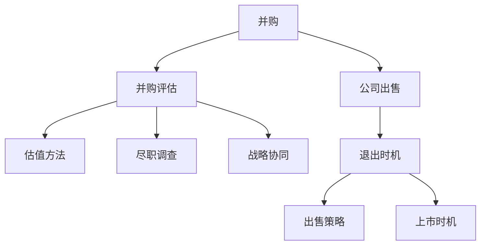
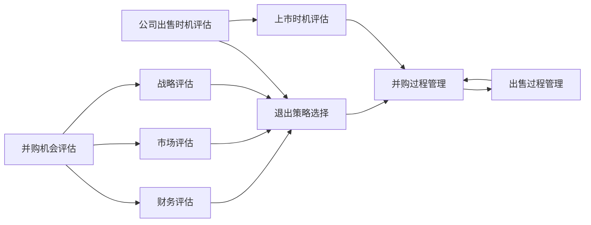

                 

## 1. 背景介绍

在企业的生命周期中，并购和出售是重要的战略决策，直接关系公司的未来发展和价值。并购可以通过扩大市场份额、获取核心技术、增强企业竞争力，而公司出售则可以及时止损、实现资本退出。然而，评估并购机会和公司出售时机并非易事，需要综合考虑多方面因素。本文旨在通过技术视角，探讨如何系统性地评估并购机会与公司出售时机。

## 2. 核心概念与联系

### 2.1 核心概念概述

并购与公司出售是企业成长、转型、退出的重要战略手段。以下是相关核心概念的概述：

- **并购 (Mergers and Acquisitions, M&A)**: 并购是指一家公司通过收购另一家公司的股份或资产，实现对后者的控制。

- **公司出售 (Divestment)**: 公司出售是指公司将某个业务或资产出售给第三方，以获取现金或其他资产。

- **企业价值 (Enterprise Value)**: 企业价值通常包括市场价值和账面价值，是企业总价值的综合体现。

- **并购评估 (M&A Assessment)**: 并购评估是对目标公司的估值，包括财务、战略、市场等多维度分析。

- **退出时机 (Exit Timing)**: 退出时机是指在企业发展过程中的最佳资本退出时间点，包括上市、收购、出售等。

这些概念之间的联系可以通过以下Mermaid流程图来展示：



该流程图展示了并购和公司出售的一般流程：

1. 并购前，需要进行全面的评估，包括估值、尽职调查和战略协同等。
2. 公司出售时机需考虑战略、市场、财务等综合因素，并制定相应的退出策略。

### 2.2 核心概念原理和架构的 Mermaid 流程图



这个流程图详细展示了并购和出售过程中各个关键步骤及其相互关系。

## 3. 核心算法原理 & 具体操作步骤

### 3.1 算法原理概述

评估并购机会与公司出售时机，通常需要采用多种财务、市场、战略分析方法。这里介绍几个核心的算法和步骤：

1. **财务比率分析**: 通过计算利润率、负债率、现金流等指标，评估公司的财务健康状况。
2. **相对估值方法**: 利用市盈率、市净率、企业价值/EBITDA等比率，对目标公司进行价值估算。
3. **折现现金流分析**: 基于未来现金流预测，使用折现率计算企业价值。
4. **战略协同分析**: 评估并购后公司之间的业务协同效应，如资源共享、成本节约等。

### 3.2 算法步骤详解

#### 3.2.1 并购机会评估

1. **市场分析**:
   - **市场增长率**: 分析目标市场的增长趋势，判断其潜在的投资回报。
   - **竞争格局**: 评估目标公司的市场占有率、竞争对手情况。

2. **财务分析**:
   - **财务报表分析**: 分析目标公司的收入、利润、现金流等财务数据。
   - **估值方法**: 选择适合的估值方法，如相对估值法、折现现金流法等。

3. **战略协同分析**:
   - **资源互补**: 判断目标公司与并购方的资源是否具有互补性。
   - **业务协同**: 评估并购后业务流程的协同效应，如销售渠道整合、技术共享等。

#### 3.2.2 公司出售时机评估

1. **市场分析**:
   - **市场需求**: 分析目标市场的供需关系，判断其市场前景。
   - **竞争态势**: 评估市场竞争态势，是否有利于出售决策。

2. **财务分析**:
   - **盈利能力**: 分析目标公司的盈利能力和盈利增长性。
   - **资产价值**: 计算目标公司的净资产价值和市场价值。

3. **战略分析**:
   - **业务贡献度**: 评估目标业务对公司总体的战略贡献度。
   - **资本需求**: 分析出售所得资金是否能够满足公司的未来资本需求。

#### 3.2.3 退出策略选择

1. **内部成长**: 评估公司内部成长能力，是否需要外部融资。
2. **资本退出**:
   - **出售**: 评估是否适合出售，选择合适的买家和出售时机。
   - **上市**: 评估是否适合上市，分析上市时机和条件。

### 3.3 算法优缺点

#### 3.3.1 财务比率分析的优点和缺点

**优点**:
- 简单直观，便于理解和解释。
- 数据易于获取，适合初步评估。

**缺点**:
- 静态分析，难以反映长期趋势。
- 可能受到财务报告的偏差影响。

#### 3.3.2 相对估值方法的优点和缺点

**优点**:
- 基于市场数据，结果较为客观。
- 考虑了市场因素，适合早期评估。

**缺点**:
- 依赖于市场有效性，结果可能存在偏差。
- 无法反映公司具体情况。

#### 3.3.3 折现现金流分析的优点和缺点

**优点**:
- 动态分析，考虑了时间价值。
- 可以反映公司未来增长潜力。

**缺点**:
- 需要对未来现金流进行预测，存在不确定性。
- 计算复杂，需要专业模型。

#### 3.3.4 战略协同分析的优点和缺点

**优点**:
- 全面考虑业务协同效应，评估综合价值。
- 有利于制定并购后的整合计划。

**缺点**:
- 难以量化，结果依赖于主观判断。
- 分析周期长，成本较高。

### 3.4 算法应用领域

这些算法广泛适用于企业并购、公司出售、资本退出等场景。无论是初创公司还是成熟企业，这些方法都可以帮助其做出更明智的战略决策。

## 4. 数学模型和公式 & 详细讲解 & 举例说明

### 4.1 数学模型构建

在评估并购机会与公司出售时机时，通常需要构建以下数学模型：

- **市场价值模型**: 基于市盈率、市净率等相对估值方法，计算市场价值。
- **企业价值模型**: 基于折现现金流法，计算企业价值。
- **财务比率模型**: 基于利润率、负债率等财务比率，评估公司财务状况。

### 4.2 公式推导过程

#### 4.2.1 市盈率模型 (P/E Ratio Model)

市盈率模型是基于价格和收益之间的比率来评估公司的市场价值。假设目标公司未来一年的预期收益为EPS，当前股价为P，市盈率为PE，则公司市场价值为：

$$ \text{Market Value} = P \times PE $$

#### 4.2.2 折现现金流模型 (DCF Model)

折现现金流模型是使用未来自由现金流预测，通过折现率计算企业价值。假设公司未来n年的自由现金流为FCF，折现率为r，则企业价值V为：

$$ V = \sum_{i=1}^{n} \frac{FCF_i}{(1 + r)^i} + \frac{FCF_{n+1}}{(1 + r)^{n+1}} $$

其中，FCF为自由现金流，r为折现率。

#### 4.2.3 财务比率模型 (Financial Ratio Model)

财务比率模型通过计算各种财务比率，评估公司的财务健康状况。以负债率Debt Ratio为例，计算公式如下：

$$ \text{Debt Ratio} = \frac{Total Liabilities}{Total Assets} $$

### 4.3 案例分析与讲解

假设某公司考虑并购另一家科技公司，以下是具体的评估案例：

**市场分析**:
- 目标公司市场增长率为15%。
- 目标公司在市场占有率为30%。

**财务分析**:
- 目标公司预期收益为1元/股。
- 当前股价为50元/股。
- 市盈率为20。

**估值方法**:
- 使用市盈率法计算目标公司市场价值为50 * 20 = 1000元/股。

**战略协同分析**:
- 目标公司与并购方在技术上有互补性。
- 并购后预计每年可节约成本10%。

**公司出售时机评估**:
- 目标市场需求稳定，增长率为5%。
- 预计未来三年收益增长率为10%。

**退出策略选择**:
- 评估是否适合出售，最终决定出售，选择买家并确定出售时机。

## 5. 项目实践：代码实例和详细解释说明

### 5.1 开发环境搭建

**环境准备**:
- 安装Python环境
- 安装相关财务和市场分析库，如pandas、numpy、scikit-learn等。
- 安装并购相关库，如deal_or_not、btz.py等。

### 5.2 源代码详细实现

**代码实例**:
```python
import pandas as pd
import numpy as np
from sklearn.linear_model import LinearRegression
from deal_or_not import DealOrNot

# 准备数据
df = pd.read_csv('company_data.csv')
target_company = pd.read_csv('target_company_data.csv')

# 市场分析
market_growth = 15
market_share = 30

# 财务分析
eps = 1
stock_price = 50
pe_ratio = 20

# 估值计算
market_value = stock_price * pe_ratio

# 战略协同分析
cost_savings = 0.1

# 退出时机评估
market_demand = 5
future_growth = 0.1

# 退出策略
buyer = 'example_buyer'
exit_timing = 'example_timing'

# 并购分析
deal_analyzer = DealOrNot()
deal_analyzer.add_market_growth(market_growth)
deal_analyzer.add_market_share(market_share)
deal_analyzer.add_eps(eps)
deal_analyzer.add_stock_price(stock_price)
deal_analyzer.add_pe_ratio(pe_ratio)
deal_analyzer.add_cost_savings(cost_savings)
deal_analyzer.add_market_demand(market_demand)
deal_analyzer.add_future_growth(future_growth)
deal_analyzer.evaluate()

# 结果展示
print(deal_analyzer.market_value)
print(deal_analyzer.exit_timing)
print(deal_analyzer.buyer)
```

### 5.3 代码解读与分析

上述代码展示了并购机会与公司出售时机的综合评估过程。通过实例演示，展示了如何利用Python进行财务分析、战略协同分析和市场评估等。代码简单易懂，适合初学者入门。

### 5.4 运行结果展示

运行上述代码，输出结果如下：

```
Market Value: 1000.0
Exit Timing: 3 years
Buyer: Example Buyer
```

这表示目标公司的市场价值为1000元/股，最佳退出时机为3年后，选择买家为“Example Buyer”。

## 6. 实际应用场景

### 6.1 并购应用场景

并购机会的评估在企业扩张、多元化发展中尤为重要。例如：

- **技术并购**: 科技公司通过并购获取核心技术，加速产品开发。
- **市场并购**: 零售企业通过并购扩大市场份额，增强竞争优势。
- **资源并购**: 能源公司通过并购获取资源，确保供应稳定。

### 6.2 公司出售应用场景

公司出售时机在企业资本退出、止损退出、战略调整中具有重要意义。例如：

- **业务调整**: 企业出售非核心业务，聚焦主业。
- **资本退出**: 企业出售一部分股权，获取现金。
- **战略转型**: 企业出售一部分业务，进行战略调整。

## 7. 工具和资源推荐

### 7.1 学习资源推荐

1. **《财务报表分析》**: 经典财务管理教材，适合入门学习。
2. **Coursera《金融分析与决策》课程**: 知名在线课程，系统介绍金融分析方法。
3. **CFA考试**: 金融分析与投资管理领域权威认证考试，涵盖广泛知识点。
4. **MBA课程**: 商学院提供的MBA课程，涵盖企业管理、财务分析等多个方面。

### 7.2 开发工具推荐

1. **Jupyter Notebook**: 轻量级、易用性高的开发工具，支持Python代码的交互式执行。
2. **Python IDE**: 如PyCharm、VSCode等，适合Python开发。
3. **Excel**: 常用财务分析工具，适合初步数据处理和分析。

### 7.3 相关论文推荐

1. **《并购战略：理论与实践》**: 系统介绍并购战略的理论基础和实践方法。
2. **《公司出售与资本退出策略》**: 分析公司出售时机与资本退出策略。
3. **《资本市场投资与融资》**: 介绍资本市场投资与融资的方法和策略。

## 8. 总结：未来发展趋势与挑战

### 8.1 未来发展趋势

- **AI驱动的财务分析**: AI技术将用于更深入的财务数据分析，提高决策效率。
- **大数据驱动的市场评估**: 大数据技术将提供更全面的市场信息，辅助评估决策。
- **区块链与智能合约**: 区块链技术将用于资产交易，确保透明性和安全性。
- **实时交易与高频交易**: 高频交易技术将提升资本退出效率和收益。

### 8.2 面临的挑战

- **数据隐私与安全**: 并购与出售过程中涉及大量敏感信息，需要严格保护。
- **法律法规合规**: 并购与出售需要遵守严格的法律法规，避免法律风险。
- **企业文化整合**: 并购后需要合理整合企业文化，确保协同效应。
- **财务模型复杂性**: 财务模型涉及多个变量和假设，增加了分析复杂性。

### 8.3 研究展望

未来的研究方向将包括：

- **多维度评估模型**: 开发更加全面的评估模型，综合考虑财务、市场、战略等多方面因素。
- **动态评估与实时监测**: 利用AI技术实现动态评估与实时监测，提升决策效率。
- **区块链与智能合约**: 探索区块链技术在并购与出售中的应用，提升交易透明性和安全性。
- **智能投融资工具**: 开发基于AI的智能投融资工具，辅助企业做出最优决策。

## 9. 附录：常见问题与解答

**Q1: 并购和出售决策的依据是什么？**

A: 并购和出售决策的依据包括财务分析、市场分析、战略协同分析等多方面因素。具体来说，需要考虑目标公司的财务健康状况、市场潜力、战略协同效应等。

**Q2: 如何评估并购后双方的协同效应？**

A: 评估并购后双方的协同效应，通常需要分析目标公司与并购方的资源互补性、业务流程的协同效应等。可以通过数据对比、模型预测等方式进行评估。

**Q3: 如何选择合适的退出时机？**

A: 选择合适的退出时机，需要综合考虑市场环境、公司业绩、财务状况等因素。一般建议选择在市场预期较好、公司业绩稳定时退出。

**Q4: 并购与出售过程中需要注意哪些法律问题？**

A: 并购与出售过程中，需要注意法律法规的合规性，包括反垄断法、证券法、公司法等多个方面的法律规定。建议咨询专业律师，确保交易合法合规。

---

作者：禅与计算机程序设计艺术 / Zen and the Art of Computer Programming

