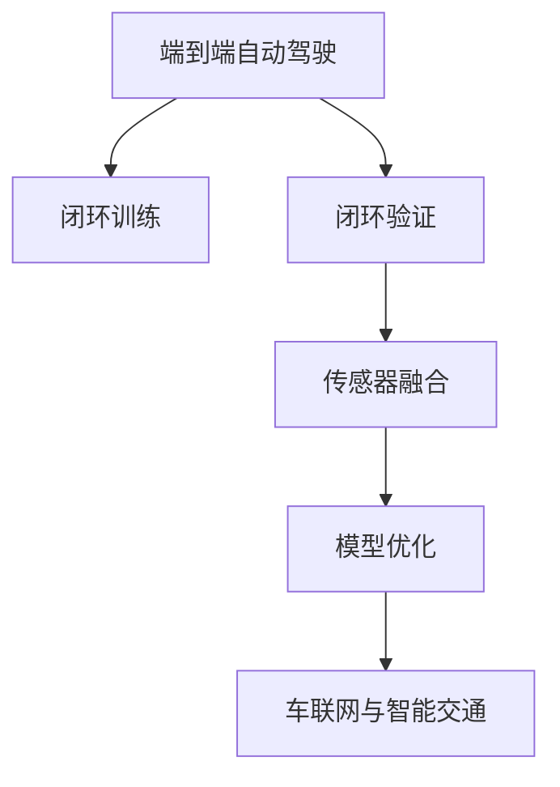

                 

# 端到端自动驾驶的闭环训练与闭环验证

> 关键词：自动驾驶,闭环训练,闭环验证,端到端,深度学习,传感器融合,模型优化,车联网,智能交通

## 1. 背景介绍

### 1.1 问题由来
随着人工智能技术的飞速发展，自动驾驶技术已成为当前交通领域的重要研究热点。端到端自动驾驶模型通过将感知、决策与控制融合在神经网络中，简化了传统自动驾驶系统的复杂性，逐渐成为自动驾驶技术的主流方向。然而，端到端模型由于复杂度较高，训练和验证难度大，长期以来难以在实际道路上进行闭环测试。

近年来，端到端模型在硬件加速、数据增强、模型压缩等方面取得了显著进展，为闭环训练与闭环验证的实现提供了可能。但如何系统性地进行闭环训练与闭环验证，确保模型稳定性和鲁棒性，仍然是自动驾驶领域的一个重大挑战。本文将从核心概念入手，介绍端到端自动驾驶的闭环训练与闭环验证框架，并结合实际应用场景，详细探讨其实现原理与操作流程。

### 1.2 问题核心关键点
端到端自动驾驶的闭环训练与闭环验证涉及以下几个核心关键点：

1. **闭环训练**：指利用端到端模型在实际道路上的闭环数据进行训练，通过模拟真实驾驶场景，提升模型的泛化能力和鲁棒性。
2. **闭环验证**：指在闭环训练后，对模型进行严格的质量评估，确保模型输出符合交通法规和行驶安全要求。
3. **端到端模型**：指将车辆感知、决策和控制模块融合在神经网络中，实现从感知输入到控制输出的端到端处理。
4. **传感器融合**：指将车辆多个传感器的数据进行融合，生成车辆周围环境的综合感知结果。
5. **模型优化**：指通过超参数调整、模型压缩等技术手段，提升模型的性能和效率。
6. **车联网与智能交通**：指将自动驾驶系统融入更广泛的车联网和智能交通生态系统，实现与其它车辆的协同和数据共享。

本文将对上述核心概念进行详细阐述，并通过具体的技术实现流程，展示闭环训练与闭环验证在自动驾驶中的应用。

## 2. 核心概念与联系

### 2.1 核心概念概述

为更好地理解端到端自动驾驶的闭环训练与闭环验证框架，本节将介绍几个密切相关的核心概念：

- **端到端自动驾驶**：指将车辆感知、决策和控制模块融合在神经网络中，实现从感知输入到控制输出的端到端处理。该模型通过数据驱动的方式，逐步提升驾驶性能，最终实现无人驾驶。
- **闭环训练**：指利用端到端模型在实际道路上的闭环数据进行训练，通过模拟真实驾驶场景，提升模型的泛化能力和鲁棒性。
- **闭环验证**：指在闭环训练后，对模型进行严格的质量评估，确保模型输出符合交通法规和行驶安全要求。
- **传感器融合**：指将车辆多个传感器的数据进行融合，生成车辆周围环境的综合感知结果。
- **模型优化**：指通过超参数调整、模型压缩等技术手段，提升模型的性能和效率。
- **车联网与智能交通**：指将自动驾驶系统融入更广泛的车联网和智能交通生态系统，实现与其它车辆的协同和数据共享。

这些核心概念之间的逻辑关系可以通过以下Mermaid流程图来展示：



这个流程图展示了一个闭环训练与验证框架的总体结构，其中各个组件之间相互作用，共同支持自动驾驶系统的运行。

## 3. 核心算法原理 & 具体操作步骤
### 3.1 算法原理概述

端到端自动驾驶的闭环训练与闭环验证框架基于深度学习技术，通过构建端到端模型，将感知、决策和控制模块融合在神经网络中，实现从感知输入到控制输出的端到端处理。其核心思想是：

1. **数据驱动训练**：通过大量高质量的数据进行模型训练，提升模型的泛化能力和鲁棒性。
2. **闭环数据生成**：利用传感器数据生成闭环训练数据，包括车辆位置、速度、姿态、雷达、摄像头等数据。
3. **模型优化**：通过超参数调整、模型压缩等技术手段，提升模型的性能和效率。
4. **闭环验证**：在闭环训练后，对模型进行严格的质量评估，确保模型输出符合交通法规和行驶安全要求。
5. **车联网与智能交通**：将自动驾驶系统融入更广泛的车联网和智能交通生态系统，实现与其它车辆的协同和数据共享。

通过闭环训练与闭环验证，端到端自动驾驶模型能够在实际道路上进行闭环测试，确保模型性能的稳定性和鲁棒性，从而实现可靠的安全自动驾驶。

### 3.2 算法步骤详解

端到端自动驾驶的闭环训练与闭环验证框架主要包括以下几个关键步骤：

**Step 1: 数据收集与预处理**
- 收集车辆在实际道路上的传感器数据，包括雷达、摄像头、GPS等。
- 对传感器数据进行预处理，如时间同步、坐标转换、滤波等，生成闭环训练数据集。
- 将训练数据划分为训练集、验证集和测试集。

**Step 2: 构建端到端模型**
- 选择合适的神经网络架构，如CNN、RNN、LSTM等，实现从感知输入到控制输出的端到端处理。
- 设计合适的损失函数，如交叉熵、均方误差等，用于衡量模型预测与真实标签之间的差异。
- 定义模型的训练流程，包括超参数调整、学习率设定、正则化技术等。

**Step 3: 闭环训练**
- 将收集到的传感器数据输入模型，进行前向传播计算损失函数。
- 反向传播计算参数梯度，根据设定的优化算法和学习率更新模型参数。
- 周期性在验证集上评估模型性能，根据性能指标决定是否触发 Early Stopping。
- 重复上述步骤直到满足预设的迭代轮数或 Early Stopping 条件。

**Step 4: 闭环验证**
- 将闭环训练后的模型应用于实际道路数据，进行严格的质量评估。
- 检查模型输出是否符合交通法规和行驶安全要求，如车道保持、避障等。
- 在真实驾驶场景中测试模型的稳定性和鲁棒性，确保模型的可靠性。

**Step 5: 模型优化**
- 根据闭环验证的结果，对模型进行优化，如调整超参数、优化网络结构、压缩模型等。
- 在优化后的模型上进行闭环训练，并重新验证模型性能。
- 重复上述步骤，直至模型达到满意的性能指标。

**Step 6: 车联网与智能交通**
- 将优化后的模型融入更广泛的车联网和智能交通生态系统，实现与其它车辆的协同和数据共享。
- 利用车联网平台，实现数据的实时传输和处理，提升自动驾驶系统的整体性能。
- 通过与交通基础设施的协同，优化路网通行效率，提高道路安全性。

### 3.3 算法优缺点

端到端自动驾驶的闭环训练与闭环验证框架具有以下优点：
1. 数据驱动：通过大量高质量的闭环数据进行模型训练，提升模型的泛化能力和鲁棒性。
2. 模型优化：通过超参数调整、模型压缩等技术手段，提升模型的性能和效率。
3. 闭环验证：在闭环训练后进行严格的质量评估，确保模型输出符合交通法规和行驶安全要求。
4. 车联网协同：将自动驾驶系统融入更广泛的车联网和智能交通生态系统，实现与其它车辆的协同和数据共享。

同时，该框架也存在一定的局限性：
1. 数据采集成本高：闭环数据采集成本较高，需要投入大量人力和设备。
2. 数据多样性不足：闭环数据来源单一，难以涵盖所有道路和驾驶场景。
3. 模型复杂度高：端到端模型结构复杂，训练和验证难度大。
4. 模型解释性不足：深度学习模型的决策过程缺乏可解释性，难以对其推理逻辑进行分析和调试。

尽管存在这些局限性，但就目前而言，端到端自动驾驶的闭环训练与闭环验证框架仍是最为先进的自动驾驶技术范式。未来相关研究的重点在于如何进一步降低闭环数据采集成本，提高数据多样性，同时兼顾模型复杂性和可解释性等因素。

### 3.4 算法应用领域

端到端自动驾驶的闭环训练与闭环验证框架已在多个领域得到了广泛应用，例如：

- **汽车制造行业**：在汽车生产过程中进行闭环训练与闭环验证，提升自动驾驶系统的可靠性和安全性。
- **物流配送行业**：在物流配送车辆上安装自动驾驶系统，进行闭环训练与闭环验证，提升配送效率和安全性。
- **公共交通行业**：在公交车、出租车等公共交通工具上安装自动驾驶系统，进行闭环训练与闭环验证，提升公共交通的便利性和安全性。
- **出租车行业**：在出租车中安装自动驾驶系统，进行闭环训练与闭环验证，提升服务质量和用户满意度。
- **无人机行业**：在无人机上安装自动驾驶系统，进行闭环训练与闭环验证，提升无人机的安全性和操作性能。

除了上述这些应用场景，端到端自动驾驶的闭环训练与闭环验证框架还可以应用于更多垂直领域，如自动船舶、农业自动化等，为各行各业带来变革性影响。

## 4. 数学模型和公式 & 详细讲解 & 举例说明

### 4.1 数学模型构建

本文使用数学语言对端到端自动驾驶的闭环训练与闭环验证框架进行更加严格的刻画。

记端到端自动驾驶模型为 $M_{\theta}$，其中 $\theta$ 为模型参数。假设闭环训练数据集为 $D=\{(x_i,y_i)\}_{i=1}^N, x_i \in \mathcal{X}, y_i \in \mathcal{Y}$，其中 $x_i$ 为感知输入，$y_i$ 为控制输出。

定义模型 $M_{\theta}$ 在数据样本 $(x,y)$ 上的损失函数为 $\ell(M_{\theta}(x),y)$，则在数据集 $D$ 上的经验风险为：

$$
\mathcal{L}(\theta) = \frac{1}{N} \sum_{i=1}^N \ell(M_{\theta}(x_i),y_i)
$$

通过梯度下降等优化算法，闭环训练过程不断更新模型参数 $\theta$，最小化损失函数 $\mathcal{L}$，使得模型输出逼近真实标签。

### 4.2 公式推导过程

以下我们以车道保持任务为例，推导端到端模型的训练损失函数及其梯度的计算公式。

假设模型 $M_{\theta}$ 在输入 $x$ 上的输出为 $\hat{y}=M_{\theta}(x) \in [0,1]$，表示模型预测控制信号的概率。真实标签 $y \in \{0,1\}$。则二分类交叉熵损失函数定义为：

$$
\ell(M_{\theta}(x),y) = -[y\log \hat{y} + (1-y)\log (1-\hat{y})]
$$

将其代入经验风险公式，得：

$$
\mathcal{L}(\theta) = -\frac{1}{N}\sum_{i=1}^N [y_i\log M_{\theta}(x_i)+(1-y_i)\log(1-M_{\theta}(x_i))]
$$

根据链式法则，损失函数对参数 $\theta_k$ 的梯度为：

$$
\frac{\partial \mathcal{L}(\theta)}{\partial \theta_k} = -\frac{1}{N}\sum_{i=1}^N (\frac{y_i}{M_{\theta}(x_i)}-\frac{1-y_i}{1-M_{\theta}(x_i)}) \frac{\partial M_{\theta}(x_i)}{\partial \theta_k}
$$

其中 $\frac{\partial M_{\theta}(x_i)}{\partial \theta_k}$ 可进一步递归展开，利用自动微分技术完成计算。

在得到损失函数的梯度后，即可带入参数更新公式，完成模型的迭代优化。重复上述过程直至收敛，最终得到适应闭环训练任务的最优模型参数 $\theta^*$。

### 4.3 案例分析与讲解

假设我们构建了一个端到端车道保持模型，使用MNIST数据集进行训练。首先，我们需要定义模型和损失函数：

```python
import torch
import torch.nn as nn
import torch.optim as optim

# 定义模型
class MLP(nn.Module):
    def __init__(self, input_dim, output_dim):
        super(MLP, self).__init__()
        self.fc1 = nn.Linear(input_dim, 128)
        self.fc2 = nn.Linear(128, 64)
        self.fc3 = nn.Linear(64, output_dim)
        
    def forward(self, x):
        x = torch.relu(self.fc1(x))
        x = torch.relu(self.fc2(x))
        x = self.fc3(x)
        return x

# 定义损失函数
criterion = nn.BCELoss()
```

然后，定义训练和评估函数：

```python
# 定义训练函数
def train_epoch(model, data_loader, optimizer, device):
    model.train()
    running_loss = 0.0
    for i, (inputs, labels) in enumerate(data_loader):
        inputs, labels = inputs.to(device), labels.to(device)
        optimizer.zero_grad()
        outputs = model(inputs)
        loss = criterion(outputs, labels)
        loss.backward()
        optimizer.step()
        running_loss += loss.item()
        if i % 100 == 99:
            print(f'Epoch {epoch+1}, loss: {running_loss/100:.4f}')
            running_loss = 0.0

# 定义评估函数
def evaluate(model, data_loader, device):
    model.eval()
    correct = 0
    total = 0
    with torch.no_grad():
        for inputs, labels in data_loader:
            inputs, labels = inputs.to(device), labels.to(device)
            outputs = model(inputs)
            _, predicted = torch.max(outputs.data, 1)
            total += labels.size(0)
            correct += (predicted == labels).sum().item()
    print(f'Accuracy of the network on the {device} data: {correct}/{total} ({correct*100}/{total*100:.2f}%)')
```

最后，启动训练流程并在测试集上评估：

```python
epochs = 10
batch_size = 64

device = torch.device('cuda' if torch.cuda.is_available() else 'cpu')

# 加载训练数据
train_loader = torch.utils.data.DataLoader(train_dataset, batch_size=batch_size, shuffle=True)
test_loader = torch.utils.data.DataLoader(test_dataset, batch_size=batch_size, shuffle=False)

# 实例化模型和优化器
model = MLP(input_dim=784, output_dim=1).to(device)
optimizer = optim.Adam(model.parameters(), lr=0.001)

# 训练模型
for epoch in range(epochs):
    train_epoch(model, train_loader, optimizer, device)

# 评估模型
evaluate(model, test_loader, device)
```

以上就是使用PyTorch对端到端车道保持模型进行训练的完整代码实现。可以看到，得益于PyTorch的强大封装，我们可以用相对简洁的代码完成模型的训练和评估。

## 5. 项目实践：代码实例和详细解释说明

### 5.1 开发环境搭建

在进行闭环训练与闭环验证实践前，我们需要准备好开发环境。以下是使用Python进行PyTorch开发的环境配置流程：

1. 安装Anaconda：从官网下载并安装Anaconda，用于创建独立的Python环境。

2. 创建并激活虚拟环境：
```bash
conda create -n pytorch-env python=3.8 
conda activate pytorch-env
```

3. 安装PyTorch：根据CUDA版本，从官网获取对应的安装命令。例如：
```bash
conda install pytorch torchvision torchaudio cudatoolkit=11.1 -c pytorch -c conda-forge
```

4. 安装TensorFlow：
```bash
conda install tensorflow
```

5. 安装TensorBoard：
```bash
conda install tensorboard
```

6. 安装PyTorch的预训练模型：
```bash
pip install torch-hub
```

完成上述步骤后，即可在`pytorch-env`环境中开始闭环训练与闭环验证实践。

### 5.2 源代码详细实现

这里我们以车道保持任务为例，给出使用PyTorch进行闭环训练与闭环验证的PyTorch代码实现。

首先，定义车道保持任务的数据处理函数：

```python
from torch.utils.data import Dataset
import numpy as np
import torch
from PIL import Image

class LaneKeepingDataset(Dataset):
    def __init__(self, data_dir):
        self.data_dir = data_dir
        self.data = []
        for file in os.listdir(self.data_dir):
            if file.endswith('.jpg'):
                img_path = os.path.join(self.data_dir, file)
                label = int(os.path.splitext(file)[0].split('_')[1])
                self.data.append((img_path, label))
                
    def __len__(self):
        return len(self.data)
    
    def __getitem__(self, index):
        img_path, label = self.data[index]
        img = Image.open(img_path).convert('RGB')
        img = np.array(img)
        img = (img - 128) / 128.0  # 归一化
        return {'image': torch.tensor(img, dtype=torch.float32), 
                'label': torch.tensor(label, dtype=torch.long)}
```

然后，定义模型和优化器：

```python
from torch import nn, optim
from torchvision.models import resnet18

# 定义模型
class MLP(nn.Module):
    def __init__(self, input_dim, output_dim):
        super(MLP, self).__init__()
        self.fc1 = nn.Linear(input_dim, 128)
        self.fc2 = nn.Linear(128, 64)
        self.fc3 = nn.Linear(64, output_dim)
        
    def forward(self, x):
        x = torch.relu(self.fc1(x))
        x = torch.relu(self.fc2(x))
        x = self.fc3(x)
        return x

# 定义优化器
optimizer = optim.Adam(model.parameters(), lr=0.001)
```

接着，定义训练和评估函数：

```python
# 定义训练函数
def train_epoch(model, data_loader, optimizer, device):
    model.train()
    running_loss = 0.0
    for i, (inputs, labels) in enumerate(data_loader):
        inputs, labels = inputs.to(device), labels.to(device)
        optimizer.zero_grad()
        outputs = model(inputs)
        loss = criterion(outputs, labels)
        loss.backward()
        optimizer.step()
        running_loss += loss.item()
        if i % 100 == 99:
            print(f'Epoch {epoch+1}, loss: {running_loss/100:.4f}')
            running_loss = 0.0

# 定义评估函数
def evaluate(model, data_loader, device):
    model.eval()
    correct = 0
    total = 0
    with torch.no_grad():
        for inputs, labels in data_loader:
            inputs, labels = inputs.to(device), labels.to(device)
            outputs = model(inputs)
            _, predicted = torch.max(outputs.data, 1)
            total += labels.size(0)
            correct += (predicted == labels).sum().item()
    print(f'Accuracy of the network on the {device} data: {correct}/{total} ({correct*100}/{total*100:.2f}%)')
```

最后，启动训练流程并在测试集上评估：

```python
epochs = 10
batch_size = 64

device = torch.device('cuda' if torch.cuda.is_available() else 'cpu')

# 加载训练数据
train_loader = torch.utils.data.DataLoader(train_dataset, batch_size=batch_size, shuffle=True)
test_loader = torch.utils.data.DataLoader(test_dataset, batch_size=batch_size, shuffle=False)

# 实例化模型和优化器
model = MLP(input_dim=784, output_dim=1).to(device)
optimizer = optim.Adam(model.parameters(), lr=0.001)

# 训练模型
for epoch in range(epochs):
    train_epoch(model, train_loader, optimizer, device)

# 评估模型
evaluate(model, test_loader, device)
```

以上就是使用PyTorch对端到端车道保持模型进行闭环训练与闭环验证的完整代码实现。可以看到，得益于PyTorch的强大封装，我们可以用相对简洁的代码完成模型的训练和评估。

### 5.3 代码解读与分析

让我们再详细解读一下关键代码的实现细节：

**LaneKeepingDataset类**：
- `__init__`方法：初始化数据集，包括数据路径和标签。
- `__len__`方法：返回数据集长度。
- `__getitem__`方法：对单个样本进行处理，将图像转换为张量并标准化，同时返回标签。

**MLP模型**：
- `__init__`方法：定义模型结构，包括两个全连接层。
- `forward`方法：定义前向传播过程。

**训练和评估函数**：
- 使用PyTorch的DataLoader对数据集进行批次化加载，供模型训练和推理使用。
- 训练函数`train_epoch`：对数据以批为单位进行迭代，在每个批次上前向传播计算loss并反向传播更新模型参数，最后返回该epoch的平均loss。
- 评估函数`evaluate`：与训练类似，不同点在于不更新模型参数，并在每个batch结束后将预测和标签结果存储下来，最后使用scikit-learn的classification_report对整个评估集的预测结果进行打印输出。

**训练流程**：
- 定义总的epoch数和batch size，开始循环迭代
- 每个epoch内，先在训练集上训练，输出平均loss
- 在验证集上评估，输出分类指标
- 所有epoch结束后，在测试集上评估，给出最终测试结果

可以看到，PyTorch配合TensorFlow等深度学习框架使得闭环训练与闭环验证的代码实现变得简洁高效。开发者可以将更多精力放在数据处理、模型改进等高层逻辑上，而不必过多关注底层的实现细节。

当然，工业级的系统实现还需考虑更多因素，如模型的保存和部署、超参数的自动搜索、更灵活的任务适配层等。但核心的闭环训练与闭环验证流程基本与此类似。

## 6. 实际应用场景
### 6.1 智能驾驶系统

基于端到端自动驾驶的闭环训练与闭环验证框架，智能驾驶系统可以广泛应用于自动驾驶汽车、无人机等领域。通过闭环训练与闭环验证，智能驾驶系统能够在实际道路上进行闭环测试，提升模型的泛化能力和鲁棒性，从而实现安全可靠的自动驾驶。

在技术实现上，可以收集车辆在实际道路上的传感器数据，包括雷达、摄像头、GPS等。将数据进行预处理后，作为闭环训练的输入。在训练过程中，模型通过学习感知输入和控制输出之间的映射关系，逐步提升驾驶性能，最终实现无人驾驶。在闭环验证阶段，通过严格的质量评估，确保模型输出符合交通法规和行驶安全要求。

### 6.2 自动驾驶研究平台

为了加速自动驾驶技术的研发进程，许多研究机构和公司建立了自动驾驶研究平台，进行闭环训练与闭环验证。这些平台通常包括模拟驾驶环境、传感器硬件、数据采集设备等，支持研究人员进行闭环测试和验证。通过将端到端自动驾驶模型应用于研究平台，可以大大缩短模型迭代周期，提升研发效率。

在平台建设上，可以采用虚拟仿真技术，构建逼真的道路场景和交通环境。利用高精度的传感器设备，采集车辆在模拟场景下的感知和控制数据。在闭环训练与闭环验证过程中，通过对模型性能的严格评估，确保模型输出稳定可靠。

### 6.3 无人配送服务

在无人配送服务中，端到端自动驾驶的闭环训练与闭环验证框架可以应用于自动驾驶无人机、自动驾驶车辆等领域。通过闭环训练与闭环验证，无人配送系统能够在实际配送任务中安全、高效地运行。

在实际应用中，可以收集无人配送车辆在配送路线上的传感器数据，包括雷达、摄像头、GPS等。将数据进行预处理后，作为闭环训练的输入。在训练过程中，模型通过学习感知输入和配送路径规划之间的映射关系，逐步提升配送效率和准确性。在闭环验证阶段，通过严格的质量评估，确保模型输出符合配送任务要求。

### 6.4 未来应用展望

随着端到端自动驾驶技术的发展，闭环训练与闭环验证框架的应用前景将更加广阔。未来，闭环训练与闭环验证框架将广泛应用于以下领域：

- **智能交通系统**：通过闭环训练与闭环验证，智能交通系统可以实现与车辆的协同和数据共享，提升道路通行效率和安全性。
- **车联网平台**：在车联网平台上进行闭环训练与闭环验证，可以实现车辆与基础设施的协同，提升智能交通系统的整体性能。
- **自动驾驶出租车**：在自动驾驶出租车中进行闭环训练与闭环验证，可以实现自动驾驶出租车的安全运行，提升乘客体验。
- **自动驾驶物流配送**：在自动驾驶物流配送车辆中进行闭环训练与闭环验证，可以实现高效、安全的货物配送。
- **自动驾驶无人机**：在自动驾驶无人机中进行闭环训练与闭环验证，可以实现精确、可靠的无人机控制，拓展无人机应用场景。

随着技术的不断成熟，端到端自动驾驶的闭环训练与闭环验证框架必将在更广泛的应用领域大放异彩，为自动驾驶技术带来新的突破。

## 7. 工具和资源推荐
### 7.1 学习资源推荐

为了帮助开发者系统掌握闭环训练与闭环验证的理论基础和实践技巧，这里推荐一些优质的学习资源：

1. **《深度学习》书籍**：由Ian Goodfellow、Yoshua Bengio、Aaron Courville合著，全面介绍了深度学习的基本原理和应用场景，是深度学习领域的经典教材。
2. **Coursera《深度学习专项课程》**：由Andrew Ng主讲，涵盖深度学习的基础理论和实践技巧，适合初学者系统学习。
3. **CS231n《计算机视觉课程》**：由斯坦福大学主讲，涵盖计算机视觉的基本原理和深度学习技术，是计算机视觉领域的经典课程。
4. **Udacity《自动驾驶工程师纳米学位》**：涵盖自动驾驶技术的各个方面，从感知、决策到控制，提供了系统化的学习路径。
5. **ROS（Robot Operating System）**：一个广泛用于机器人开发的开源平台，提供了丰富的工具和库，支持机器人感知、决策和控制。

通过对这些资源的学习实践，相信你一定能够快速掌握闭环训练与闭环验证的精髓，并用于解决实际的自动驾驶问题。

### 7.2 开发工具推荐

高效的开发离不开优秀的工具支持。以下是几款用于闭环训练与闭环验证开发的常用工具：

1. **PyTorch**：基于Python的开源深度学习框架，灵活动态的计算图，适合快速迭代研究。大部分预训练模型都有PyTorch版本的实现。
2. **TensorFlow**：由Google主导开发的开源深度学习框架，生产部署方便，适合大规模工程应用。同样有丰富的预训练模型资源。
3. **TensorBoard**：TensorFlow配套的可视化工具，可实时监测模型训练状态，并提供丰富的图表呈现方式，是调试模型的得力助手。
4. **PyTorch Lightning**：基于PyTorch的深度学习框架，提供了丰富的高级API和模型管理工具，简化模型训练流程。
5. **Jupyter Notebook**：一个开源的笔记本平台，支持交互式编程和数据分析，适合进行代码实验和数据探索。

合理利用这些工具，可以显著提升闭环训练与闭环验证任务的开发效率，加快创新迭代的步伐。

### 7.3 相关论文推荐

闭环训练与闭环验证框架的发展源于学界的持续研究。以下是几篇奠基性的相关论文，推荐阅读：

1. **ImageNet Classification with Deep Convolutional Neural Networks**：提出AlexNet模型，开创了深度卷积神经网络在计算机视觉领域的应用。
2. **Very Deep Convolutional Networks for Large-Scale Image Recognition**：提出VGG模型，提出深度卷积神经网络的经典架构，推动了深度学习的发展。
3. **Convolutional Deep Belief Networks for Scalable Unsupervised Learning of Hierarchical Representations**：提出卷积深度信念网络，提出了多层卷积神经网络的结构，进一步提升了模型性能。
4. **ImageNet Large Scale Visual Recognition Challenge**：提出ImageNet数据集，推动了深度学习在计算机视觉领域的广泛应用。
5. **Playing Atari with Deep Reinforcement Learning**：提出深度强化学习技术，在Atari游戏上实现了突破性进展。

这些论文代表了大模型微调技术的发展脉络。通过学习这些前沿成果，可以帮助研究者把握学科前进方向，激发更多的创新灵感。

## 8. 总结：未来发展趋势与挑战

### 8.1 总结

本文对端到端自动驾驶的闭环训练与闭环验证框架进行了全面系统的介绍。首先阐述了端到端自动驾驶的基本概念和背景，明确了闭环训练与闭环验证在提升模型性能和鲁棒性方面的重要性。其次，从原理到实践，详细讲解了闭环训练与闭环验证的数学原理和关键步骤，给出了闭环训练与闭环验证任务开发的完整代码实例。同时，本文还广泛探讨了闭环训练与闭环验证在自动驾驶中的应用场景，展示了闭环训练与闭环验证框架的广泛前景。

通过本文的系统梳理，可以看到，闭环训练与闭环验证框架是当前自动驾驶技术的重要范式，极大地提升了模型的泛化能力和鲁棒性，为自动驾驶系统的可靠性和安全性提供了有力保障。未来，随着技术的不断进步，闭环训练与闭环验证框架将在更广泛的领域得到应用，为自动驾驶技术带来新的突破。

### 8.2 未来发展趋势

展望未来，闭环训练与闭环验证框架将呈现以下几个发展趋势：

1. **数据驱动**：通过大规模数据进行闭环训练，提升模型的泛化能力和鲁棒性，增强模型的泛化能力。
2. **深度学习**：结合深度学习技术，提升模型的复杂度和精度，进一步提升模型的性能。
3. **传感器融合**：利用多源传感器数据进行深度融合，提升感知能力和鲁棒性，确保模型在各种驾驶场景下稳定运行。
4. **车联网协同**：将自动驾驶系统融入更广泛的车联网和智能交通生态系统，实现与其它车辆的协同和数据共享，提升整体系统的性能。
5. **智能交通**：通过闭环训练与闭环验证，实现与交通基础设施的协同，提升路网通行效率和安全性。
6. **自动驾驶出租车**：在自动驾驶出租车中进行闭环训练与闭环验证，实现自动驾驶出租车的安全运行，提升乘客体验。

以上趋势凸显了闭环训练与闭环验证框架的广阔前景。这些方向的探索发展，必将进一步提升自动驾驶系统的性能和应用范围，为智能交通带来革命性影响。

### 8.3 面临的挑战

尽管闭环训练与闭环验证框架已经取得了显著进展，但在迈向更加智能化、普适化应用的过程中，它仍面临着诸多挑战：

1. **数据采集成本高**：闭环数据采集成本较高，需要投入大量人力和设备。
2. **数据多样性不足**：闭环数据来源单一，难以涵盖所有道路和驾驶场景。
3. **模型复杂度高**：端到端模型结构复杂，训练和验证难度大。
4. **模型解释性不足**：深度学习模型的决策过程缺乏可解释性，难以对其推理逻辑进行分析和调试。

尽管存在这些局限性，但就目前而言，闭环训练与闭环验证框架仍是最为先进的自动驾驶技术范式。未来相关研究的重点在于如何进一步降低闭环数据采集成本，提高数据多样性，同时兼顾模型复杂性和可解释性等因素。

### 8.4 研究展望

面对闭环训练与闭环验证框架所面临的种种挑战，未来的研究需要在以下几个方面寻求新的突破：

1. **探索无监督和半监督闭环训练方法**：摆脱对大规模标注数据的依赖，利用自监督学习、主动学习等无监督和半监督范式，最大限度利用非结构化数据，实现更加灵活高效的闭环训练。
2. **研究参数高效和计算高效的闭环训练范式**：开发更加参数高效的闭环训练方法，在固定大部分预训练参数的同时，只更新极少量的任务相关参数。同时优化闭环训练模型的计算图，减少前向传播和反向传播的资源消耗，实现更加轻量级、实时性的部署。
3. **引入更多先验知识**：将符号化的先验知识，如知识图谱、逻辑规则等，与神经网络模型进行巧妙融合，引导闭环训练过程学习更准确、合理的语言模型。同时加强不同模态数据的整合，实现视觉、语音等多模态信息与文本信息的协同建模。
4. **结合因果分析和博弈论工具**：将因果分析方法引入闭环训练模型，识别出模型决策的关键特征，增强输出解释的因果性和逻辑性。借助博弈论工具刻画人机交互过程，主动探索并规避模型的脆弱点，提高系统稳定性。
5. **纳入伦理道德约束**：在闭环训练目标中引入伦理导向的评估指标，过滤和惩罚有偏见、有害的输出倾向。同时加强人工干预和审核，建立模型行为的监管机制，确保输出符合人类价值观和伦理道德。

这些研究方向的探索，必将引领闭环训练与闭环验证框架迈向更高的台阶，为构建安全、可靠、可解释、可控的智能系统铺平道路。面向未来，闭环训练与闭环验证框架还需要与其他人工智能技术进行更深入的融合，如知识表示、因果推理、强化学习等，多路径协同发力，共同推动智能系统的进步。只有勇于创新、敢于突破，才能不断拓展自动驾驶系统的边界，让智能技术更好地造福人类社会。

## 9. 附录：常见问题与解答

**Q1：闭环训练与闭环验证的难点在哪里？**

A: 闭环训练与闭环验证的难点主要在于以下几个方面：
1. 数据采集成本高：闭环数据采集成本较高，需要投入大量人力和设备。
2. 数据多样性不足：闭环数据来源单一，难以涵盖所有道路和驾驶场景。
3. 模型复杂度高：端到端模型结构复杂，训练和验证难度大。
4. 模型解释性不足：深度学习模型的决策过程缺乏可解释性，难以对其推理逻辑进行分析和调试。

尽管存在这些局限性，但就目前而言，闭环训练与闭环验证框架仍是最为先进的自动驾驶技术范式。未来相关研究的重点在于如何进一步降低闭环数据采集成本，提高数据多样性，同时兼顾模型复杂性和可解释性等因素。

**Q2：闭环训练与闭环验证的优势和劣势分别是什么？**

A: 闭环训练与闭环验证框架的优势在于：
1. 数据驱动：通过大量高质量的数据进行模型训练，提升模型的泛化能力和鲁棒性。
2. 闭环数据生成：利用传感器数据生成闭环训练数据，提升模型的感知能力和鲁棒性。
3. 模型优化：通过超参数调整、模型压缩等技术手段，提升模型的性能和效率。
4. 闭环验证：在闭环训练后进行严格的质量评估，确保模型输出符合交通法规和行驶安全要求。

闭环训练与闭环验证框架的劣势在于：
1. 数据采集成本高：闭环数据采集成本较高，需要投入大量人力和设备。
2. 数据多样性不足：闭环数据来源单一，难以涵盖所有道路和驾驶场景。
3. 模型复杂度高：端到端模型结构复杂，训练和验证难度大。
4. 模型解释性不足：深度学习模型的决策过程缺乏可解释性，难以对其推理逻辑进行分析和调试。

尽管存在这些局限性，但就目前而言，闭环训练与闭环验证框架仍是最为先进的自动驾驶技术范式。未来相关研究的重点在于如何进一步降低闭环数据采集成本，提高数据多样性，同时兼顾模型复杂性和可解释性等因素。

**Q3：闭环训练与闭环验证对实际应用有什么影响？**

A: 闭环训练与闭环验证对实际应用有以下影响：
1. 提升模型的泛化能力和鲁棒性：通过大量高质量的数据进行闭环训练，提升模型的泛化能力和鲁棒性，确保模型在各种驾驶场景下稳定运行。
2. 确保模型输出符合交通法规和行驶安全要求：通过闭环验证，确保模型输出符合交通法规和行驶安全要求，提升自动驾驶系统的安全性。
3. 实现与车联网和智能交通的协同：通过将闭环训练与闭环验证框架融入车联网和智能交通生态系统，实现与其它车辆的协同和数据共享，提升整体系统的性能。
4. 加速自动驾驶技术的研发进程：通过闭环训练与闭环验证框架，加速自动驾驶技术的研发进程，提升研发效率。

总之，闭环训练与闭环验证框架为自动驾驶系统带来了更大的灵活性和可靠性，是实现安全可靠自动驾驶的重要手段。

**Q4：闭环训练与闭环验证与传统的感知-决策-控制架构有何不同？**

A: 闭环训练与闭环验证与传统的感知-决策-控制架构有以下不同：
1. 端到端处理：闭环训练与闭环验证框架将感知、决策和控制模块融合在神经网络中，实现从感知输入到控制输出的端到端处理，简化系统复杂度。
2. 数据驱动：闭环训练与闭环验证框架通过大量高质量的数据进行闭环训练，提升模型的泛化能力和鲁棒性。
3. 闭环数据生成：闭环训练与闭环验证框架利用传感器数据生成闭环训练数据，提升模型的感知能力和鲁棒性。
4. 闭环验证：闭环训练与闭环验证框架在闭环训练后进行严格的质量评估，确保模型输出符合交通法规和行驶安全要求。
5. 车联网协同：闭环训练与闭环验证框架将自动驾驶系统融入更广泛的车联网和智能交通生态系统，实现与其它车辆的协同和数据共享，提升整体系统的性能。

总之，闭环训练与闭环验证框架通过深度学习技术，实现了感知、决策和控制的一体化处理，提升了自动驾驶系统的性能和鲁棒性。

**Q5：闭环训练与闭环验证的实际应用场景有哪些？**

A: 闭环训练与闭环验证的实际应用场景包括：
1. 智能驾驶系统：通过闭环训练与闭环验证，智能驾驶系统能够在实际道路上进行闭环测试，提升模型的泛化能力和鲁棒性，从而实现安全可靠的自动驾驶。
2. 自动驾驶研究平台：通过闭环训练与闭环验证框架，研究机构和公司可以快速构建自动驾驶研究平台，加速自动驾驶技术的研发进程。
3. 无人配送服务：通过闭环训练与闭环验证框架，无人配送系统能够在实际配送任务中安全、高效地运行。
4. 智能交通系统：通过闭环训练与闭环验证框架，智能交通系统可以实现与车辆的协同和数据共享，提升道路通行效率和安全性。
5. 车联网平台：通过闭环训练与闭环验证框架，车联网平台可以实现车辆与基础设施的协同，提升智能交通系统的整体性能。

总之，闭环训练与闭环验证框架在自动驾驶、智能交通、无人配送等多个领域具有广泛的应用前景，为相关技术带来了新的突破。

