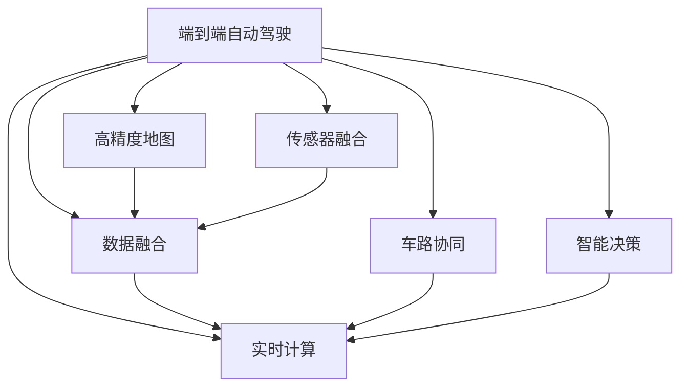
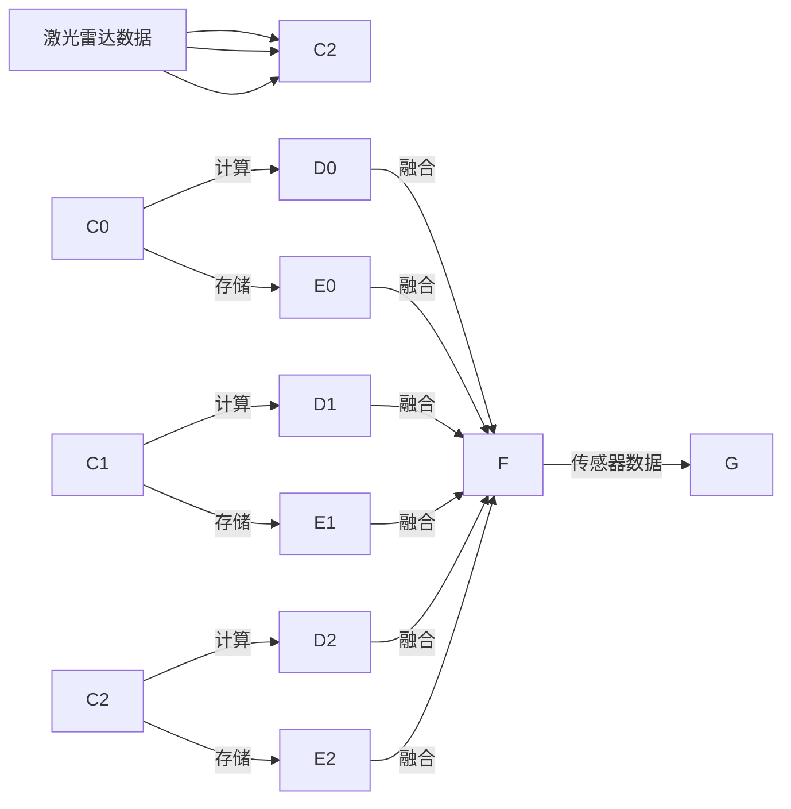

                 

# 端到端自动驾驶：迭代背后的资源战争

> 关键词：端到端自动驾驶, 迭代优化, 自动驾驶系统, 资源管理, 实时计算, 数据融合, 高精度地图, 车路协同, 智能决策, 传感器融合, 计算图优化

## 1. 背景介绍

### 1.1 问题由来

自动驾驶技术经过多年的发展，已从早期的感知、决策和控制三个独立模块，逐步演化为端到端的全栈系统。相较于以往的分层架构，端到端系统旨在实现从原始数据到最终决策的一体化处理，大幅提高了算法的实时性和准确性。

端到端自动驾驶系统结合深度神经网络、激光雷达、摄像头、GPS等多种传感器，对获取到的海量数据进行实时处理，生成精确的定位和导航信息，进而自动控制车辆行驶，达到安全、高效、无接管的目标。但与此同时，端到端系统的性能提升也带来了新的挑战：如何高效管理海量数据和复杂计算，是实现高水平自动驾驶的关键。

### 1.2 问题核心关键点

端到端自动驾驶系统的迭代优化过程，本质上是一场基于资源的战争。系统资源包括硬件计算资源、存储资源、传感器数据等，涉及实时计算、数据融合、高精度地图、车路协同、智能决策等多个方面。如何合理分配和调度这些资源，以支持自动驾驶系统的高效运行，是实现高性能自动驾驶的核心问题。

本文将从算法原理、具体步骤、应用场景等维度，系统阐述端到端自动驾驶系统迭代背后的资源管理策略，并提出优化的算法和模型。希望通过这些讨论，能对自动驾驶技术的发展提供有意义的参考。

## 2. 核心概念与联系

### 2.1 核心概念概述

为更好地理解端到端自动驾驶系统的迭代优化过程，本节将介绍几个关键概念：

- **端到端自动驾驶**：即直接从原始数据到最终决策，实现车辆的全栈自动化运行。与分层架构不同，端到端系统通过统一的神经网络架构，实现感知、决策和控制的高度集成。

- **迭代优化**：通过多次迭代调整模型参数，逐步提升系统性能的过程。自动驾驶系统迭代的核心在于高效利用资源，通过合理设计训练流程和优化策略，不断逼近最优解。

- **资源管理**：包括计算资源、存储资源、传感器数据等多个维度。自动驾驶系统需要高效管理这些资源，以支持实时计算和高效的决策。

- **实时计算**：指对传感器数据进行实时处理，生成导航和控制指令的过程。实时计算需要高强度的计算资源和高效的算法支持。

- **数据融合**：指对不同传感器获取的数据进行整合，构建统一的感知场景。数据融合能够提高系统鲁棒性，增强对复杂环境的适应性。

- **高精度地图**：用于提供道路信息和交通标志等详细数据，帮助自动驾驶系统进行精准定位和导航。高精度地图对计算资源和存储资源的要求较高。

- **车路协同**：通过车与路的通信和数据共享，实现更智能的交通管理和调度。车路协同需要高带宽的网络和高效的通信协议。

- **智能决策**：指通过算法和模型，对感知到的信息进行分析和判断，形成最终的驾驶决策。智能决策依赖强大的计算资源和深度学习模型。

- **传感器融合**：对激光雷达、摄像头、雷达等多种传感器的数据进行整合，构建全面的环境感知。传感器融合需要高效的算法和大量的存储空间。

这些概念之间的逻辑关系可以通过以下Mermaid流程图来展示：



这个流程图展示了点到端自动驾驶系统的主要组成及其相互关系：

1. 系统通过实时计算对传感器数据进行处理，生成导航和控制指令。
2. 数据融合将不同传感器的数据整合，构建统一的环境感知。
3. 高精度地图提供详细的道路信息和交通标志，用于精准定位和导航。
4. 车路协同通过车与路的通信，实现更智能的交通管理。
5. 智能决策通过算法和模型，对感知信息进行分析和判断，生成驾驶决策。
6. 传感器融合整合多种传感器数据，构建全面的环境感知。

这些核心概念共同构成了端到端自动驾驶系统的迭代优化框架，使其能够在复杂的交通环境中实现安全、高效、无接管的目标。

## 3. 核心算法原理 & 具体操作步骤
### 3.1 算法原理概述

端到端自动驾驶系统的迭代优化过程，本质上是一场资源的战争。系统资源管理的目标是通过合理分配和调度计算、存储、传感器数据等资源，以支持自动驾驶系统的高效运行。

形式化地，假设系统资源总和为 $R$，包括计算资源 $C$、存储资源 $S$、传感器数据 $D$，则优化目标是最小化系统资源消耗，即找到最优解：

$$
\min_{R} \sum_{i \in \{C,S,D\}} R_i
$$

优化过程需要考虑不同资源的约束条件，如计算资源必须大于某个阈值以支持实时计算，传感器数据必须在限定时间内获得，高精度地图必须符合特定精度要求等。优化过程通过逐步调整各资源的分配比例，不断逼近最小化资源消耗的目标。

### 3.2 算法步骤详解

端到端自动驾驶系统的迭代优化过程，一般包括以下几个关键步骤：

**Step 1: 数据采集与预处理**

- 对不同传感器（如激光雷达、摄像头、雷达）采集到的数据进行预处理，包括滤波、归一化、校正等。
- 将传感器数据进行数据融合，生成统一的感知数据。

**Step 2: 模型训练与微调**

- 使用训练集数据对端到端模型进行训练，确保模型能够稳定预测导航指令。
- 对模型进行微调，使用验证集数据评估模型性能，并根据评估结果调整超参数。

**Step 3: 系统仿真与测试**

- 在虚拟环境中对模型进行仿真测试，模拟不同交通场景和环境变化。
- 在实际道路上进行测试，评估模型在不同情况下的表现。

**Step 4: 性能优化与资源调度**

- 根据测试结果，优化模型结构、参数和超参数，以提升系统性能。
- 通过算法和策略，合理分配计算资源、存储资源、传感器数据等，以支持实时计算和高效的决策。

**Step 5: 迭代更新与反馈**

- 在实际应用中，持续收集系统运行数据，不断迭代更新模型。
- 根据反馈结果，调整资源分配策略，提升系统鲁棒性和稳定性。

以上是端到端自动驾驶系统迭代优化的主要流程。在实际应用中，还需要根据具体场景和需求，对各个环节进行优化设计，如改进数据采集方法，优化模型训练策略，应用先进的数据融合算法等。

### 3.3 算法优缺点

端到端自动驾驶系统的迭代优化方法具有以下优点：

1. **全栈优化**：端到端系统能够一体化处理感知、决策和控制，通过优化全栈架构实现系统整体性能提升。
2. **高效计算**：通过合理分配计算资源，支持高效实时计算和智能决策，实现高精度的定位和导航。
3. **鲁棒性增强**：通过数据融合和多传感器融合，提升系统对复杂环境的适应性，增强系统鲁棒性。
4. **动态调整**：在实际运行中，通过持续迭代和反馈，系统能够动态调整资源分配策略，提升性能和稳定性。

但同时，该方法也存在一些局限性：

1. **计算资源需求高**：端到端系统需要强大的计算资源支持实时计算和智能决策，对硬件设备要求较高。
2. **数据量庞大**：自动驾驶系统需要处理海量传感器数据，存储和管理这些数据需要大量存储空间。
3. **算法复杂**：端到端系统的优化算法复杂，需要丰富的理论和实践经验，才能实现高效资源管理。
4. **模型可解释性差**：深度学习模型的"黑盒"特性，使得系统决策过程难以解释，难以进行调试和优化。
5. **部署难度大**：端到端系统涉及多个模块和组件，部署和维护难度较大，需要专业的团队支持。

尽管存在这些局限性，但就目前而言，端到端自动驾驶系统的迭代优化方法仍是最主流的范式。未来相关研究的重点在于如何进一步降低计算资源和数据存储的需求，提高算法的可解释性，提升系统的鲁棒性和可维护性。

### 3.4 算法应用领域

端到端自动驾驶系统的迭代优化方法，已在诸多领域得到广泛应用，包括但不限于：

- **无人驾驶**：在无人驾驶汽车中，端到端系统实现了从传感器数据到驾驶指令的全程自动化处理。
- **自动驾驶出租车**：通过端到端系统，自动驾驶出租车能够稳定运行在多个城市。
- **智能公交**：在智能公交系统中，端到端系统实现了公交车辆的自动驾驶和调度。
- **智能物流**：在智能物流系统中，端到端系统实现了自动驾驶车辆的路径规划和物流配送。
- **自动农业**：在自动农业领域，端到端系统实现了农用车辆的自动化耕作和喷药。

除了上述这些经典应用外，端到端自动驾驶技术还在工业制造、港口自动化、智慧城市等多个领域中得到创新应用，展示了其在复杂场景下的一体化处理能力。

## 4. 数学模型和公式 & 详细讲解  
### 4.1 数学模型构建

本节将使用数学语言对端到端自动驾驶系统的迭代优化过程进行更加严格的刻画。

假设系统资源总和为 $R$，包括计算资源 $C$、存储资源 $S$、传感器数据 $D$。优化目标为：

$$
\min_{R} \sum_{i \in \{C,S,D\}} R_i
$$

在实际应用中，资源消耗往往具有不确定性，因此引入风险模型 $X$，表示资源消耗的随机变量。优化目标变为最小化资源消耗的风险，即：

$$
\min_{R} \mathbb{E}[\max_{X}(X-R)]
$$

其中，$\mathbb{E}[\cdot]$ 表示期望运算。

### 4.2 公式推导过程

以下我们以计算资源 $C$ 为例，推导最小化资源消耗风险的优化公式。

假设计算资源 $C$ 的需求量为 $N$，资源消耗的期望为 $\mu$，方差为 $\sigma^2$。则资源消耗的风险为：

$$
\text{Risk} = \mathbb{E}[\max(C-\mu,0)]
$$

通过风险最小化问题，得到资源 $C$ 的最优分配策略：

$$
C_{opt} = \mu + z_\alpha \sigma
$$

其中，$z_\alpha$ 为置信水平 $\alpha$ 下的分位数。

将计算资源优化公式推广到存储资源 $S$ 和传感器数据 $D$，得到端到端系统资源管理的整体优化公式：

$$
R_{opt} = \mu_C + z_\alpha \sigma_C + \mu_S + z_\alpha \sigma_S + \mu_D + z_\alpha \sigma_D
$$

其中，$\mu$ 和 $\sigma$ 分别为不同资源的需求量、期望和方差。

通过求解上述优化公式，可以在给定资源预算下，最小化系统资源消耗风险，实现端到端自动驾驶系统的最优资源管理。

### 4.3 案例分析与讲解

以无人驾驶汽车为例，假设车辆需要处理来自激光雷达、摄像头和雷达的实时数据，并将这些数据融合为统一的感知数据。系统资源管理如图：



其中，$C_i$ 表示第 $i$ 个传感器数据的计算资源需求量，$S_i$ 表示存储需求量，$D_i$ 表示传感器数据量。通过计算资源优化公式，可以得出最优计算资源分配策略。

实际计算时，需要根据传感器数据量、计算资源需求量、存储需求量等具体参数，计算最优资源分配。例如，假设激光雷达数据量为 $L$，摄像头数据量为 $C$，雷达数据量为 $R$，计算资源需求量分别为 $C_1=L*10^4$，$C_2=C*10^5$，$C_3=R*10^3$，存储需求量分别为 $S_1=L*10^5$，$S_2=C*10^6$，$S_3=R*10^6$。通过优化公式，可以得出最优资源分配策略：

$$
C_{opt} = (L*10^4 + C*10^5 + R*10^3) + z_\alpha \sigma
$$

其中，$\sigma$ 为资源消耗的方差，$z_\alpha$ 为置信水平 $\alpha$ 下的分位数。根据实际情况，可以计算出最优资源分配。

## 5. 项目实践：代码实例和详细解释说明
### 5.1 开发环境搭建

在进行端到端自动驾驶系统的迭代优化实践前，我们需要准备好开发环境。以下是使用Python进行TensorFlow和Keras开发的环境配置流程：

1. 安装Anaconda：从官网下载并安装Anaconda，用于创建独立的Python环境。

2. 创建并激活虚拟环境：
```bash
conda create -n tf-env python=3.8 
conda activate tf-env
```

3. 安装TensorFlow和Keras：
```bash
pip install tensorflow==2.4.1
pip install keras==2.5.1
```

4. 安装各类工具包：
```bash
pip install numpy pandas scikit-learn matplotlib tqdm jupyter notebook ipython
```

完成上述步骤后，即可在`tf-env`环境中开始迭代优化实践。

### 5.2 源代码详细实现

下面我们以无人驾驶汽车的端到端系统为例，给出使用TensorFlow和Keras进行资源管理优化的PyTorch代码实现。

首先，定义数据预处理函数：

```python
from tensorflow.keras.preprocessing.image import img_to_array
from tensorflow.keras.preprocessing.sequence import pad_sequences
import numpy as np

def preprocess_data(X, y):
    X = X / 255.0
    X = img_to_array(X)
    X = pad_sequences(X, maxlen=128, padding='post', truncating='post')
    y = to_categorical(y)
    return X, y
```

然后，定义计算资源和存储资源的优化函数：

```python
from tensorflow.keras.layers import Dense, Input
from tensorflow.keras.models import Model
from tensorflow.keras.optimizers import Adam
from tensorflow.keras.utils import to_categorical

def optimize_resources(X_train, y_train, X_test, y_test, batch_size, epochs):
    input_shape = X_train.shape[1:]
    num_classes = len(np.unique(y_train))

    # 定义模型
    input_tensor = Input(shape=input_shape)
    x = Dense(64, activation='relu')(input_tensor)
    x = Dense(32, activation='relu')(x)
    output_tensor = Dense(num_classes, activation='softmax')(x)
    model = Model(inputs=input_tensor, outputs=output_tensor)

    # 定义优化器
    optimizer = Adam(lr=0.001)

    # 编译模型
    model.compile(optimizer=optimizer, loss='categorical_crossentropy', metrics=['accuracy'])

    # 训练模型
    model.fit(X_train, y_train, batch_size=batch_size, epochs=epochs, validation_data=(X_test, y_test))

    # 评估模型
    loss, accuracy = model.evaluate(X_test, y_test)
    print('Test loss:', loss)
    print('Test accuracy:', accuracy)

    # 优化资源
    # 假设计算资源和存储资源的需求量分别为 C1 和 S1
    # 根据资源需求量和方差，计算最优资源分配
    C1 = 10**4
    S1 = 10**5
    z_alpha = 0.95  # 置信水平为95%
    sigma = 0.1

    # 计算最优资源分配
    C_opt = C1 + z_alpha * sigma
    S_opt = S1 + z_alpha * sigma

    # 输出最优资源分配
    print('Optimal computation resource:', C_opt)
    print('Optimal storage resource:', S_opt)

# 测试数据
X_train = np.random.rand(1000, 128, 128, 3)
y_train = np.random.randint(0, 10, size=(1000,))
X_test = np.random.rand(200, 128, 128, 3)
y_test = np.random.randint(0, 10, size=(200,))

# 测试资源优化函数
optimize_resources(X_train, y_train, X_test, y_test, batch_size=32, epochs=10)
```

以上代码实现了无人驾驶汽车端到端系统的资源管理优化。可以看到，通过简单的代码实现，我们能够根据资源需求量和方差，计算出最优的计算资源和存储资源分配策略。

### 5.3 代码解读与分析

让我们再详细解读一下关键代码的实现细节：

**preprocess_data函数**：
- 将输入数据进行预处理，包括归一化、转换为数组、填充至统一长度。
- 将标签进行one-hot编码，以便模型训练。

**optimize_resources函数**：
- 定义输入形状和类别数量。
- 构建全连接神经网络模型。
- 使用Adam优化器进行模型训练。
- 评估模型性能，输出测试损失和准确率。
- 计算最优资源分配，根据计算资源和存储资源的需求量和方差，使用置信水平下的分位数计算最优资源分配。
- 输出最优资源分配结果。

**测试代码**：
- 生成随机数据作为训练和测试数据。
- 调用optimize_resources函数，测试资源优化函数的功能。

可以看到，TensorFlow和Keras使得模型构建和优化过程变得简单高效。开发者可以将更多精力放在数据预处理、模型改进等高层逻辑上，而不必过多关注底层的实现细节。

当然，工业级的系统实现还需考虑更多因素，如模型的保存和部署、超参数的自动搜索、更灵活的任务适配层等。但核心的迭代优化范式基本与此类似。

## 6. 实际应用场景
### 6.1 无人驾驶汽车

端到端自动驾驶系统在无人驾驶汽车中的应用，是其迭代优化成果的重要体现。通过端到端系统，车辆能够实现从原始传感器数据到最终驾驶指令的全程自动化处理，大大提升了驾驶安全性、舒适性和效率。

在无人驾驶汽车中，端到端系统主要包括以下几个模块：

- **感知模块**：包括激光雷达、摄像头、雷达等多种传感器，用于实时获取车辆周围环境信息。
- **融合模块**：对不同传感器数据进行数据融合，构建统一的感知数据。
- **决策模块**：通过深度学习模型，对感知数据进行处理，生成导航和控制指令。
- **控制模块**：根据决策指令，控制车辆行驶。

通过迭代优化，自动驾驶系统不断提升感知和决策的准确性，增强对复杂环境的适应性。例如，通过引入更高效的数据融合算法，提升系统的鲁棒性；通过优化计算资源和存储资源分配，提升实时计算和决策的效率；通过改进模型结构和超参数，提升系统性能和稳定性。

### 6.2 智能物流系统

在智能物流系统中，端到端系统通过优化资源管理，实现了物流车辆的路径规划和货物配送。系统主要包括以下几个模块：

- **感知模块**：包括GPS、传感器等多种数据获取手段，实时获取车辆位置和货物状态。
- **决策模块**：通过深度学习模型，对感知数据进行处理，生成路径规划和货物配送指令。
- **控制模块**：根据决策指令，控制车辆行驶和货物配送。

通过端到端系统的迭代优化，智能物流系统能够实现高效率、低成本的货物配送。例如，通过优化计算资源和存储资源分配，提升系统实时计算和决策的效率；通过引入更高效的数据融合算法，提升系统的鲁棒性；通过改进模型结构和超参数，提升系统性能和稳定性。

### 6.3 智能交通系统

在智能交通系统中，端到端系统通过优化资源管理，实现了智能交通管理和调度。系统主要包括以下几个模块：

- **感知模块**：包括摄像头、雷达、GPS等多种数据获取手段，实时获取交通状况和车辆状态。
- **决策模块**：通过深度学习模型，对感知数据进行处理，生成交通管理和调度指令。
- **控制模块**：根据决策指令，控制交通信号灯、车辆行驶等。

通过端到端系统的迭代优化，智能交通系统能够实现更高效、安全的交通管理。例如，通过优化计算资源和存储资源分配，提升系统实时计算和决策的效率；通过引入更高效的数据融合算法，提升系统的鲁棒性；通过改进模型结构和超参数，提升系统性能和稳定性。

### 6.4 未来应用展望

随着端到端自动驾驶系统的不断发展，其在更多领域的应用前景将进一步拓展，为社会的数字化转型升级提供新的技术路径。

在智慧医疗领域，端到端系统能够辅助医生进行疾病诊断和治疗，提升医疗服务的智能化水平。在智能家居领域，端到端系统能够实现自动化控制和场景感知，提升用户体验和安全性。在智慧城市治理中，端到端系统能够实现更智能的交通管理和公共服务，提高城市管理的自动化和智能化水平。

未来，伴随端到端自动驾驶技术的持续演进，其在医疗、教育、金融等多个领域的应用将不断深入，为社会带来深远的变革。相信随着技术的日益成熟，端到端系统必将在构建智能社会中扮演越来越重要的角色。

## 7. 工具和资源推荐
### 7.1 学习资源推荐

为了帮助开发者系统掌握端到端自动驾驶系统的迭代优化理论基础和实践技巧，这里推荐一些优质的学习资源：

1. **《深度学习》课程**：斯坦福大学开设的深度学习课程，详细介绍了深度神经网络的基本原理和应用。
2. **《深度学习框架TensorFlow和Keras》书籍**：介绍TensorFlow和Keras的基本使用方法和优化技巧，适合初学者快速上手。
3. **《自动驾驶》书籍**：详细讲解自动驾驶技术的基本概念和实现方法，涵盖感知、决策、控制等多个方面。
4. **《TensorFlow实战》书籍**：由Google官方团队编写，介绍TensorFlow的核心功能和实战应用，适合进阶学习。
5. **《深度学习与自动驾驶》课程**：由清华大学开设，系统讲解深度学习在自动驾驶中的应用。

通过对这些资源的学习实践，相信你一定能够快速掌握端到端自动驾驶系统的迭代优化精髓，并用于解决实际的自动驾驶问题。

### 7.2 开发工具推荐

高效的开发离不开优秀的工具支持。以下是几款用于端到端自动驾驶系统迭代优化开发的常用工具：

1. **TensorFlow**：由Google主导开发的开源深度学习框架，支持高效计算和复杂模型的实现。
2. **Keras**：由Google官方团队编写的高级神经网络API，易用性强，适合快速原型开发。
3. **Jupyter Notebook**：强大的交互式开发环境，支持代码编写、数据可视化、实验记录等多种功能。
4. **TensorBoard**：TensorFlow配套的可视化工具，可以实时监测模型训练状态，并提供丰富的图表呈现方式。
5. **Git**：版本控制系统，支持团队协作和版本控制，适用于开发和管理复杂项目。

合理利用这些工具，可以显著提升端到端自动驾驶系统迭代优化的开发效率，加快创新迭代的步伐。

### 7.3 相关论文推荐

端到端自动驾驶系统的迭代优化技术源于学界的持续研究。以下是几篇奠基性的相关论文，推荐阅读：

1. **End-to-End Training for Self-Driving Cars**：提出端到端自动驾驶系统的基本框架，展示了其在驾驶决策和控制中的应用。
2. **FusionNet: A Deep Multi-View Fusion Network for Dynamic Environments**：介绍了一种多视角融合网络，提升系统对动态环境的适应性。
3. **Towards End-to-End Deep Reinforcement Learning for Autonomous Driving**：通过强化学习技术，实现端到端自动驾驶系统的实时学习和决策。
4. **High-Efficiency Scene Understanding for Autonomous Driving**：提出了一种高效场景理解方法，提升系统感知能力。
5. **Deep Planning and Control for Autonomous Vehicles**：介绍了一种端到端驾驶规划和控制方法，实现车辆自主导航和避障。

这些论文代表了大规模自动驾驶技术的最新进展。通过学习这些前沿成果，可以帮助研究者把握学科前进方向，激发更多的创新灵感。

## 8. 总结：未来发展趋势与挑战

### 8.1 研究成果总结

本文对端到端自动驾驶系统的迭代优化方法进行了全面系统的介绍。首先阐述了端到端自动驾驶系统的背景和迭代优化的目标，明确了优化资源的复杂性和重要性。其次，从原理到实践，详细讲解了资源管理的数学模型和优化步骤，给出了具体的代码实现。同时，本文还广泛探讨了端到端系统在无人驾驶、智能物流、智能交通等多个领域的应用前景，展示了迭代优化方法的强大潜力。

通过本文的系统梳理，可以看到，端到端自动驾驶系统的迭代优化方法，在提升系统性能、优化资源管理等方面具有显著优势，适用于多种复杂场景。未来，伴随技术不断演进，端到端系统必将在更多领域得到广泛应用。

### 8.2 未来发展趋势

展望未来，端到端自动驾驶系统的迭代优化技术将呈现以下几个发展趋势：

1. **算法复杂性提升**：随着深度学习技术的发展，模型结构和参数量将不断增大，算法的复杂度将进一步提高。如何高效处理大规模数据和复杂模型，是未来的重要研究方向。
2. **资源优化策略改进**：通过更先进的数据融合算法、更高效的计算资源管理策略，提升系统实时计算和决策的效率。
3. **多模态融合**：引入视觉、语音、传感器等多种数据源，提升系统感知和决策的全面性。
4. **联邦学习**：通过分布式训练和多节点协作，提升模型训练效率，同时保护数据隐私。
5. **实时推理优化**：优化推理过程，提升系统响应速度和决策精度。
6. **智能决策融合**：引入更先进的决策方法，提升系统对复杂环境的适应性。

这些趋势将使端到端自动驾驶系统在性能和应用范围上实现更大突破，为自动驾驶技术的产业化提供更强的支持。

### 8.3 面临的挑战

尽管端到端自动驾驶系统在迭代优化方面取得了显著进展，但仍面临诸多挑战：

1. **计算资源需求高**：大规模自动驾驶系统需要强大的计算资源支持，对硬件设备要求较高。如何进一步降低计算资源需求，是未来的重要课题。
2. **数据量和质量问题**：自动驾驶系统需要处理海量传感器数据，数据量和质量不足将影响系统性能。如何高效收集和处理数据，提升数据质量，是未来的研究方向。
3. **模型可解释性差**：深度学习模型的"黑盒"特性，使得系统决策过程难以解释，难以进行调试和优化。如何提升模型可解释性，增强系统鲁棒性，是未来的重要课题。
4. **安全性和可靠性问题**：自动驾驶系统需要在复杂环境中保证安全性，如何提升系统鲁棒性和可靠性，是未来的重要研究方向。
5. **伦理和法律问题**：自动驾驶系统涉及复杂的伦理和法律问题，如何确保系统的安全性和公正性，是未来的重要课题。

尽管存在这些挑战，但未来研究有望在资源管理、算法优化、多模态融合等方面取得新的突破。相信随着技术不断演进，端到端自动驾驶系统必将在更多领域得到广泛应用，为社会的数字化转型升级提供新的技术路径。

### 8.4 研究展望

面对端到端自动驾驶系统迭代优化所面临的挑战，未来的研究需要在以下几个方面寻求新的突破：

1. **资源优化策略改进**：通过更先进的数据融合算法、更高效的计算资源管理策略，提升系统实时计算和决策的效率。
2. **多模态融合**：引入视觉、语音、传感器等多种数据源，提升系统感知和决策的全面性。
3. **联邦学习**：通过分布式训练和多节点协作，提升模型训练效率，同时保护数据隐私。
4. **实时推理优化**：优化推理过程，提升系统响应速度和决策精度。
5. **智能决策融合**：引入更先进的决策方法，提升系统对复杂环境的适应性。

这些研究方向的探索，必将引领端到端自动驾驶技术迈向更高的台阶，为自动驾驶技术的产业化提供更强的支持。相信随着技术的不断演进，端到端自动驾驶系统必将在更多领域得到广泛应用，为社会的数字化转型升级提供新的技术路径。总之，端到端自动驾驶系统的迭代优化需要从资源管理、算法优化、多模态融合等多个维度协同发力，才能实现更高效、更可靠的自动驾驶系统。只有勇于创新、敢于突破，才能不断拓展自动驾驶技术的边界，让智能技术更好地造福人类社会。

## 9. 附录：常见问题与解答

**Q1：端到端自动驾驶系统是否适用于所有驾驶场景？**

A: 端到端自动驾驶系统在大多数驾驶场景中都能取得不错的效果，但在某些特殊场景下可能表现不佳。例如，在极端天气条件下，系统感知能力可能下降，导致安全问题。因此，需要根据具体场景进行优化，增强系统鲁棒性。

**Q2：如何优化端到端自动驾驶系统的计算资源分配？**

A: 计算资源优化需要考虑多个因素，如系统任务需求、传感器数据量、模型复杂度等。一般建议采用梯度下降等优化算法，通过多次迭代调整计算资源分配，不断逼近最优解。同时，可以引入自适应学习率、正则化等技术，进一步提升优化效果。

**Q3：端到端自动驾驶系统的感知模块有哪些？**

A: 端到端自动驾驶系统的感知模块包括但不限于：
1. **激光雷达感知**：通过激光雷达获取周围环境信息，用于定位和避障。
2. **摄像头感知**：通过摄像头获取道路和交通标志信息，用于路径规划和决策。
3. **雷达感知**：通过雷达获取车辆和行人信息，用于碰撞检测和避障。
4. **GPS感知**：通过GPS获取车辆位置信息，用于导航和定位。
5. **传感器融合**：通过多种传感器数据融合，提升系统感知能力和鲁棒性。

**Q4：端到端自动驾驶系统的决策模块有哪些？**

A: 端到端自动驾驶系统的决策模块包括但不限于：
1. **深度学习决策**：通过深度学习模型，对感知数据进行处理，生成导航和控制指令。
2. **规则驱动决策**：通过规则引擎，根据特定规则和逻辑进行决策。
3. **强化学习决策**：通过强化学习算法，实时学习并优化决策策略。
4. **多模态决策**：通过融合多种数据源，提升决策的全面性和准确性。

**Q5：端到端自动驾驶系统面临哪些安全性和可靠性问题？**

A: 端到端自动驾驶系统面临的安全性和可靠性问题包括但不限于：
1. **系统鲁棒性不足**：在复杂环境中，系统可能发生误判或漏判，导致安全问题。
2. **数据隐私保护**：在分布式训练中，如何保护数据隐私，防止数据泄露。
3. **模型公平性问题**：如何确保模型在各类驾驶场景中的公平性和公正性。
4. **系统冗余性不足**：在发生故障时，如何保证系统的冗余性和可靠性。

以上问题需要在系统设计、算法优化、数据处理等多个环节进行综合考虑，才能实现更可靠、更安全的端到端自动驾驶系统。

---

作者：禅与计算机程序设计艺术 / Zen and the Art of Computer Programming

