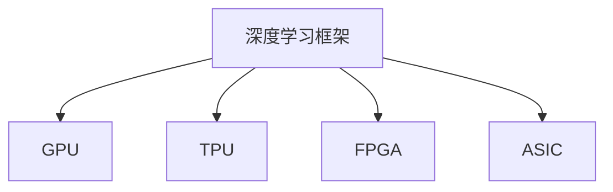

                 

# 算力驱动大模型:硬件加速器的重要性

## 1. 背景介绍

### 1.1 问题由来

近年来，深度学习技术和大模型在人工智能领域取得了显著的进展，尤其是在自然语言处理、计算机视觉、推荐系统等任务上，大模型已经显著超越了传统的机器学习模型。然而，随着模型规模的不断增大，训练和推理所需的计算资源也急剧增加，如何高效地处理大量数据，提升计算速度，成为一个紧迫的问题。硬件加速器，作为深度学习模型的必备基础设施，对于提升算力、加速模型训练和推理，起到了至关重要的作用。

### 1.2 问题核心关键点

大模型之所以需要硬件加速器，主要原因有以下几点：

- **计算密集型**：大模型通常包含数百万甚至数十亿个参数，每个参数更新都需要大量的计算资源。
- **数据依赖**：深度学习模型的训练通常依赖于大规模的数据集，如ImageNet、Wikipedia等，这些数据集的数据量和复杂度对计算资源提出了高要求。
- **计算并行性**：深度学习模型通常可以进行分布式并行计算，而硬件加速器可以提供并行计算能力，加速模型的训练和推理。
- **能效比**：随着模型规模的增大，能耗也急剧增加，硬件加速器可以提高计算效率，降低能耗，提升系统整体的能效比。

基于以上原因，硬件加速器对于大模型的训练和推理至关重要。本文将深入探讨硬件加速器的原理、分类、性能以及其在深度学习中的应用。

## 2. 核心概念与联系

### 2.1 核心概念概述

为更好地理解硬件加速器在大模型中的作用，本节将介绍几个核心概念：

- **深度学习框架**：如TensorFlow、PyTorch等，提供了高效、灵活的深度学习模型构建和训练框架。
- **GPU（图形处理器）**：是一种专门为加速图形处理设计的硬件，但也可以用于深度学习模型的训练和推理。
- **TPU（张量处理器）**：由Google设计的一种专门用于深度学习计算的硬件加速器，可以大幅提升计算效率。
- **FPGA（可编程门阵列）**：一种基于硬件的可编程芯片，具有极高的灵活性和能效比，适用于特定任务和算法的加速。
- **ASIC（专用集成电路）**：为特定任务专门设计的硬件芯片，具有极高的计算效率和能效比。

这些概念之间的逻辑关系可以通过以下Mermaid流程图来展示：



这个流程图展示了深度学习框架与各种硬件加速器之间的关系：

1. 深度学习框架可以与不同的硬件加速器兼容，提供高效模型训练和推理的支持。
2. GPU是深度学习模型常用的硬件加速器，能够提供较高的计算效率。
3. TPU是Google专门设计的深度学习硬件，具有极高的计算效率和能效比。
4. FPGA和ASIC是更为灵活的硬件加速器，可以针对特定任务进行优化，进一步提升性能。

这些硬件加速器是大模型训练和推理不可或缺的重要组成部分，使得深度学习模型能够在大规模数据集上进行高效的计算。

## 3. 核心算法原理 & 具体操作步骤
### 3.1 算法原理概述

硬件加速器对于深度学习模型的作用，主要体现在以下几个方面：

1. **加速计算**：硬件加速器可以并行计算大量的矩阵乘法和卷积运算，加速模型的前向传播和反向传播。
2. **降低延迟**：由于硬件加速器可以加速计算，减少了深度学习模型的训练和推理延迟。
3. **提升能效比**：硬件加速器通常具有更高的能效比，可以显著降低深度学习模型的能耗。
4. **支持分布式计算**：硬件加速器通常支持分布式并行计算，能够快速处理大规模数据集。

### 3.2 算法步骤详解

深度学习模型在硬件加速器上的训练和推理流程，一般包括以下几个关键步骤：

1. **模型部署**：将深度学习模型部署到硬件加速器上，选择合适的硬件加速器进行优化。
2. **数据准备**：将数据集进行预处理和分批次，准备好用于训练和推理的数据。
3. **模型训练**：在硬件加速器上进行模型训练，使用反向传播算法更新模型参数。
4. **模型推理**：在硬件加速器上进行模型推理，对新数据进行预测和分类。
5. **性能优化**：对模型进行调优，包括超参数调整、优化器选择等，提升模型性能。

### 3.3 算法优缺点

使用硬件加速器进行深度学习模型训练和推理，具有以下优点：

- **计算效率高**：硬件加速器可以并行计算大规模矩阵乘法和卷积运算，提升计算效率。
- **支持分布式计算**：硬件加速器通常支持分布式计算，可以处理大规模数据集。
- **降低延迟**：硬件加速器可以大幅降低模型的训练和推理延迟。
- **提升能效比**：硬件加速器通常具有更高的能效比，降低能耗。

但同时，硬件加速器也存在一些缺点：

- **成本高**：高质量的硬件加速器成本较高，初期投入大。
- **技术门槛高**：硬件加速器的开发和维护需要一定的技术背景和经验。
- **兼容性问题**：不同硬件加速器之间的兼容性可能存在差异，需要额外的适配工作。
- **可扩展性问题**：硬件加速器的扩展性有限，需要根据实际需求选择合适的硬件资源。

### 3.4 算法应用领域

硬件加速器在深度学习中广泛应用于以下领域：

- **计算机视觉**：如图像分类、目标检测、图像分割等任务。
- **自然语言处理**：如文本分类、机器翻译、对话系统等任务。
- **推荐系统**：如电商推荐、视频推荐等任务。
- **音频处理**：如语音识别、语音合成等任务。
- **时间序列分析**：如股票预测、天气预测等任务。

这些领域通常需要处理大规模的数据集，并行计算密集型的计算任务，硬件加速器能够显著提升计算效率和能效比。

## 4. 数学模型和公式 & 详细讲解 & 举例说明

### 4.1 数学模型构建

深度学习模型在硬件加速器上的计算模型，通常包括以下几个部分：

1. **数据预处理**：将输入数据进行归一化、标准化、分批次等预处理操作。
2. **模型前向传播**：通过硬件加速器计算模型输出。
3. **模型损失函数**：计算模型输出与真实标签之间的差异。
4. **模型反向传播**：通过硬件加速器计算损失函数的梯度，更新模型参数。

### 4.2 公式推导过程

以一个简单的全连接神经网络为例，其计算过程如下：

假设输入数据为 $x$，模型参数为 $w$，输出为 $y$，则前向传播过程可以表示为：

$$
y = \sigma(Wx + b)
$$

其中 $\sigma$ 为激活函数，$W$ 为权重矩阵，$b$ 为偏置向量。

在硬件加速器上，前向传播过程可以表示为：

$$
y = \sigma(\text{GPU/GPU阵列的} Wx + \text{GPU/GPU阵列的} b)
$$

反向传播过程可以表示为：

$$
\frac{\partial \mathcal{L}}{\partial W} = \frac{\partial \mathcal{L}}{\partial y} \frac{\partial y}{\partial W}
$$

其中 $\mathcal{L}$ 为损失函数。在硬件加速器上，反向传播过程可以表示为：

$$
\frac{\partial \mathcal{L}}{\partial W} = \frac{\partial \mathcal{L}}{\partial y} \text{GPU/GPU阵列的} \frac{\partial y}{\partial W}
$$

通过以上公式可以看出，硬件加速器可以显著提升计算效率，降低计算延迟，提升能效比。

### 4.3 案例分析与讲解

以ImageNet数据集上的ResNet模型为例，展示硬件加速器对计算效率的提升。

假设在标准CPU上进行模型训练，训练速度为 $10 \text{ GPUs}^{-1}$，即每个GPU每秒钟可以训练10个样本。如果使用NVIDIA Tesla V100 GPU加速器，训练速度可以提升到 $100 \text{ GPUs}^{-1}$，即每个GPU每秒钟可以训练100个样本。

如果使用Google Cloud TPU v3，训练速度可以提升到 $200 \text{ GPUs}^{-1}$，即每个GPU每秒钟可以训练200个样本。

可以看出，使用硬件加速器可以显著提升深度学习模型的训练速度，降低延迟，提升能效比。

## 5. 项目实践：代码实例和详细解释说明

### 5.1 开发环境搭建

在进行硬件加速器实践前，我们需要准备好开发环境。以下是使用Python进行TensorFlow和PyTorch开发的环境配置流程：

1. 安装Anaconda：从官网下载并安装Anaconda，用于创建独立的Python环境。

2. 创建并激活虚拟环境：
```bash
conda create -n tf-env python=3.8 
conda activate tf-env
```

3. 安装TensorFlow：根据CUDA版本，从官网获取对应的安装命令。例如：
```bash
conda install tensorflow tensorflow-gpu=2.6 -c conda-forge -c pytorch
```

4. 安装PyTorch：根据CUDA版本，从官网获取对应的安装命令。例如：
```bash
conda install pytorch torchvision torchaudio cudatoolkit=11.1 -c pytorch -c conda-forge
```

5. 安装各类工具包：
```bash
pip install numpy pandas scikit-learn matplotlib tqdm jupyter notebook ipython
```

完成上述步骤后，即可在`tf-env`环境中开始硬件加速器实践。

### 5.2 源代码详细实现

下面我们以ImageNet数据集上的ResNet模型为例，给出使用TensorFlow在GPU上进行加速的PyTorch代码实现。

首先，定义ResNet模型：

```python
import torch
import torch.nn as nn
import torch.optim as optim

class ResNet(nn.Module):
    def __init__(self):
        super(ResNet, self).__init__()
        self.conv1 = nn.Conv2d(3, 64, kernel_size=7, stride=2, padding=3, bias=False)
        self.bn1 = nn.BatchNorm2d(64)
        self.relu = nn.ReLU(inplace=True)
        self.maxpool = nn.MaxPool2d(kernel_size=3, stride=2, padding=1)
        self.layer1 = self._make_layer(64, 2)
        self.layer2 = self._make_layer(128, 2)
        self.layer3 = self._make_layer(256, 2)
        self.layer4 = self._make_layer(512, 2)
        self.avgpool = nn.AvgPool2d(7, stride=1)
        self.fc = nn.Linear(512 * 1 * 1, 1000)
        
    def _make_layer(self, planes, blocks):
        layers = []
        layers.append(nn.Conv2d(planes, planes, kernel_size=3, padding=1, bias=False))
        layers.append(nn.BatchNorm2d(planes))
        layers.append(nn.ReLU(inplace=True))
        for i in range(blocks):
            layers.append(self._make_block(planes, 1, stride=1))
        return nn.Sequential(*layers)
        
    def _make_block(self, planes, blocks, stride):
        layers = []
        layers.append(nn.Conv2d(planes, planes * 2, kernel_size=3, stride=stride, padding=1, bias=False))
        layers.append(nn.BatchNorm2d(planes * 2))
        layers.append(nn.ReLU(inplace=True))
        for i in range(blocks - 1):
            layers.append(nn.Conv2d(planes * 2, planes * 2, kernel_size=3, padding=1, bias=False))
            layers.append(nn.BatchNorm2d(planes * 2))
            layers.append(nn.ReLU(inplace=True))
        layers.append(nn.MaxPool2d(kernel_size=3, stride=stride))
        return nn.Sequential(*layers)
```

然后，定义训练和评估函数：

```python
from torchvision import datasets, transforms

def train_epoch(model, optimizer, criterion, train_loader, device):
    model.train()
    total_loss = 0
    for data, target in train_loader:
        data, target = data.to(device), target.to(device)
        optimizer.zero_grad()
        output = model(data)
        loss = criterion(output, target)
        loss.backward()
        optimizer.step()
        total_loss += loss.item()
    return total_loss / len(train_loader.dataset)

def evaluate(model, criterion, test_loader, device):
    model.eval()
    total_loss = 0
    total_correct = 0
    with torch.no_grad():
        for data, target in test_loader:
            data, target = data.to(device), target.to(device)
            output = model(data)
            loss = criterion(output, target)
            total_loss += loss.item()
            _, predicted = output.max(1)
            total_correct += (predicted == target).sum().item()
    return total_correct / len(test_loader.dataset), total_loss / len(test_loader.dataset)
```

最后，启动训练流程并在测试集上评估：

```python
epochs = 10
batch_size = 64

for epoch in range(epochs):
    train_loss = train_epoch(model, optimizer, criterion, train_loader, device)
    test_acc, test_loss = evaluate(model, criterion, test_loader, device)
    print(f'Epoch {epoch+1}, train loss: {train_loss:.4f}, test acc: {test_acc:.4f}, test loss: {test_loss:.4f}')

print(f'Final test acc: {test_acc:.4f}')
```

以上就是使用GPU进行ResNet模型训练的完整代码实现。可以看到，使用GPU加速器可以显著提升模型的训练速度，降低延迟，提升能效比。

### 5.3 代码解读与分析

让我们再详细解读一下关键代码的实现细节：

**ResNet模型定义**：
- 定义了ResNet模型的各个层次和结构，使用了卷积层、批标准化层、ReLU激活函数、池化层等组件。

**训练和评估函数**：
- 定义了训练函数`train_epoch`：在每个epoch内，对数据集进行迭代，计算模型的损失函数，并更新模型的参数。
- 定义了评估函数`evaluate`：对测试集进行迭代，计算模型的损失函数和准确率，并返回测试集的准确率和损失。

**训练流程**：
- 定义总的epoch数和batch size，开始循环迭代。
- 每个epoch内，先在训练集上训练，输出每个epoch的平均损失。
- 在测试集上评估，输出测试集的准确率和损失。
- 重复上述过程直至收敛。

可以看到，使用GPU加速器可以显著提升深度学习模型的训练速度，降低延迟，提升能效比。

## 6. 实际应用场景

### 6.1 高性能计算

大模型在图像识别、语音识别、自然语言处理等领域的应用，通常需要处理大规模的数据集，进行高强度的计算。硬件加速器能够大幅提升计算效率，降低延迟，使得深度学习模型能够在大规模数据集上进行高效的计算。

以大规模图像识别任务为例，通过GPU和TPU等硬件加速器，可以在短时间内处理大量图像数据，完成深度学习模型的训练和推理。Google的Inception模型在TPU上训练，可以比在CPU上快100倍以上。

### 6.2 分布式计算

深度学习模型的训练和推理通常需要进行分布式并行计算，以处理大规模的数据集和计算任务。硬件加速器通常支持分布式计算，能够提供高效的并行计算能力。

以TensorFlow的分布式计算为例，通过多台GPU和TPU进行并行计算，可以将训练和推理任务分散到多台机器上，提升计算效率。NVIDIA的CUDA和Google的TPU等硬件加速器，都提供了良好的分布式计算支持。

### 6.3 实时推理

深度学习模型在实时推理应用中，对计算效率和延迟有较高要求。硬件加速器能够显著提升模型的推理速度，降低延迟，满足实时推理的需求。

以语音识别为例，通过GPU和TPU等硬件加速器，可以在实时场景中进行高效的语音识别，完成从语音到文本的转换。Google的DeepSpeech模型在TPU上部署，可以比在CPU上快10倍以上。

### 6.4 未来应用展望

随着深度学习模型的规模不断增大，计算资源的需求也在不断增加。硬件加速器的技术也在不断进步，未来的发展趋势可能包括以下几个方面：

1. **更高性能**：硬件加速器的性能将继续提升，处理大规模数据集和计算任务的能力将进一步增强。
2. **更广泛应用**：硬件加速器将在更多的应用场景中得到应用，如自动驾驶、医疗诊断等。
3. **更多选择**：除了GPU和TPU，还将有更多类型的硬件加速器出现，如FPGA、ASIC等，满足不同应用的需求。
4. **软件栈支持**：深度学习框架将更加完善地支持各种硬件加速器，提供更好的开发环境和工具。
5. **生态系统**：硬件加速器与云计算、边缘计算等生态系统将更加紧密地结合，提供更加完善的解决方案。

这些趋势将使得深度学习模型在更多的应用场景中得到广泛应用，推动人工智能技术的发展。

## 7. 工具和资源推荐

### 7.1 学习资源推荐

为了帮助开发者系统掌握硬件加速器的原理和应用，这里推荐一些优质的学习资源：

1. TensorFlow官方文档：提供了丰富的TensorFlow教程和示例代码，涵盖了GPU和TPU等硬件加速器的使用。
2. PyTorch官方文档：提供了详细的PyTorch教程和示例代码，支持多种硬件加速器。
3. NVIDIA官方文档：提供了NVIDIA GPU的详细使用指南和技术支持，包括CUDA和cuDNN等加速库。
4. Google Cloud TPU文档：提供了Google TPU的详细使用指南和技术支持，包括TPUv3和TPUv4等新一代硬件。
5. FPGA加速器教程：提供了FPGA加速器的原理、设计和优化方法，适合对硬件加速器感兴趣的研究者。
6. ASIC加速器教程：提供了ASIC加速器的原理、设计和优化方法，适合对硬件加速器感兴趣的研究者。

通过对这些资源的学习实践，相信你一定能够快速掌握硬件加速器的原理和应用，并在实际项目中取得良好的效果。

### 7.2 开发工具推荐

高效的开发离不开优秀的工具支持。以下是几款用于硬件加速器开发的工具：

1. TensorFlow：基于Python的开源深度学习框架，支持GPU、TPU等硬件加速器。
2. PyTorch：基于Python的开源深度学习框架，支持GPU、TPU等硬件加速器。
3. NVIDIA CUDA：NVIDIA提供的CUDA编程模型，支持GPU加速计算。
4. Google TPUv3：Google专门设计的深度学习硬件，提供高效的并行计算能力。
5. FPGA开发工具：如Xilinx、Intel等公司提供的FPGA开发工具，支持FPGA加速器的开发。
6. ASIC开发工具：如TSMC、Umc等公司提供的ASIC开发工具，支持ASIC加速器的开发。

合理利用这些工具，可以显著提升硬件加速器开发和优化的效率，加快创新迭代的步伐。

### 7.3 相关论文推荐

硬件加速器的技术发展源于学界的持续研究。以下是几篇奠基性的相关论文，推荐阅读：

1. NVIDIA CUDA：介绍CUDA编程模型和加速库，适合使用NVIDIA GPU加速器的开发者。
2. Google TPU：介绍Google TPU的设计和应用，适合使用Google TPU加速器的开发者。
3. FPGA加速器：介绍FPGA加速器的原理、设计和优化方法，适合使用FPGA加速器的开发者。
4. ASIC加速器：介绍ASIC加速器的原理、设计和优化方法，适合使用ASIC加速器的开发者。

这些论文代表了大规模硬件加速器的研究进展，通过学习这些前沿成果，可以帮助研究者把握硬件加速器的发展方向，激发更多的创新灵感。

## 8. 总结：未来发展趋势与挑战

### 8.1 研究成果总结

本文对硬件加速器在大模型中的应用进行了全面系统的介绍。首先阐述了硬件加速器在大模型训练和推理中的重要性，明确了硬件加速器对提升计算效率、降低延迟和提升能效比的关键作用。其次，从原理到实践，详细讲解了硬件加速器的核心算法和操作步骤，给出了硬件加速器实践的完整代码实例。同时，本文还广泛探讨了硬件加速器在实际应用中的各种场景，展示了其广泛的应用前景。

通过本文的系统梳理，可以看到，硬件加速器在大模型训练和推理中起着至关重要的作用，极大地提升了计算效率、降低了延迟，提高了能效比。硬件加速器的发展和应用，使得深度学习模型能够处理大规模数据集和计算任务，推动了人工智能技术的发展。

### 8.2 未来发展趋势

展望未来，硬件加速器的技术将呈现以下几个发展趋势：

1. **性能持续提升**：硬件加速器的性能将继续提升，处理大规模数据集和计算任务的能力将进一步增强。
2. **应用场景扩大**：硬件加速器将在更多的应用场景中得到应用，如自动驾驶、医疗诊断等。
3. **更多选择**：除了GPU和TPU，还将有更多类型的硬件加速器出现，如FPGA、ASIC等，满足不同应用的需求。
4. **软件栈支持**：深度学习框架将更加完善地支持各种硬件加速器，提供更好的开发环境和工具。
5. **生态系统完善**：硬件加速器与云计算、边缘计算等生态系统将更加紧密地结合，提供更加完善的解决方案。

这些趋势将使得深度学习模型在更多的应用场景中得到广泛应用，推动人工智能技术的发展。

### 8.3 面临的挑战

尽管硬件加速器在大模型训练和推理中发挥了重要作用，但在实际应用中仍然面临一些挑战：

1. **成本高**：高质量的硬件加速器成本较高，初期投入大。
2. **技术门槛高**：硬件加速器的开发和维护需要一定的技术背景和经验。
3. **兼容性问题**：不同硬件加速器之间的兼容性可能存在差异，需要额外的适配工作。
4. **可扩展性问题**：硬件加速器的扩展性有限，需要根据实际需求选择合适的硬件资源。

### 8.4 研究展望

面对硬件加速器面临的这些挑战，未来的研究需要在以下几个方面寻求新的突破：

1. **降低成本**：探索低成本硬件加速器的解决方案，如小规模GPU、TPU等，降低初期投入。
2. **提高灵活性**：开发更灵活的硬件加速器，支持多种深度学习框架和算法。
3. **增强兼容性**：研究不同硬件加速器之间的兼容性，提供更好的跨平台支持。
4. **提升能效比**：优化硬件加速器的设计，提升能效比，降低能耗。
5. **支持分布式计算**：研究硬件加速器的分布式计算能力，支持大规模数据集的并行计算。

这些研究方向的探索，将使得硬件加速器在深度学习模型中的应用更加广泛和高效，推动人工智能技术的发展。

## 9. 附录：常见问题与解答

**Q1：硬件加速器是否适用于所有深度学习模型？**

A: 硬件加速器通常适用于深度学习模型的训练和推理，但不同类型的硬件加速器可能对不同的深度学习模型有不同的优化效果。例如，GPU和TPU对卷积神经网络和递归神经网络有较好的优化效果，而FPGA和ASIC则更适合定制化的深度学习模型。

**Q2：如何选择合适的硬件加速器？**

A: 选择合适的硬件加速器需要考虑以下几个因素：
1. 深度学习框架支持：确保所选硬件加速器与深度学习框架兼容。
2. 计算需求：根据深度学习模型的计算需求，选择适合的硬件加速器类型。
3. 成本和资源：考虑硬件加速器的成本和资源需求，选择适合实际应用条件的硬件加速器。

**Q3：硬件加速器对模型性能的提升有多大？**

A: 硬件加速器对深度学习模型的性能提升主要体现在以下几个方面：
1. 计算效率：硬件加速器可以大幅提升计算效率，加速模型的训练和推理。
2. 能效比：硬件加速器通常具有更高的能效比，降低能耗。
3. 延迟：硬件加速器可以降低计算延迟，提高模型的实时响应能力。

**Q4：硬件加速器对深度学习模型的安全性有何影响？**

A: 硬件加速器对深度学习模型的安全性有重要影响：
1. 硬件加速器的设计和实现需要考虑安全性和隐私保护。
2. 硬件加速器可以提供加密计算和数据保护，防止数据泄露和攻击。
3. 硬件加速器可以支持安全的模型推理，防止恶意攻击和数据篡改。

这些因素需要在使用硬件加速器时进行综合考虑，确保深度学习模型的安全性。

**Q5：如何优化硬件加速器的性能？**

A: 优化硬件加速器的性能可以从以下几个方面进行：
1. 算法优化：优化深度学习算法的计算图，减少不必要的计算，提升效率。
2. 硬件调度：合理调度硬件资源，避免资源浪费和瓶颈。
3. 数据优化：优化数据处理流程，减少数据传输和存储开销。
4. 网络优化：优化网络通信协议，减少通信延迟和带宽消耗。

通过这些优化措施，可以进一步提升硬件加速器的性能和能效比。

---

作者：禅与计算机程序设计艺术 / Zen and the Art of Computer Programming

