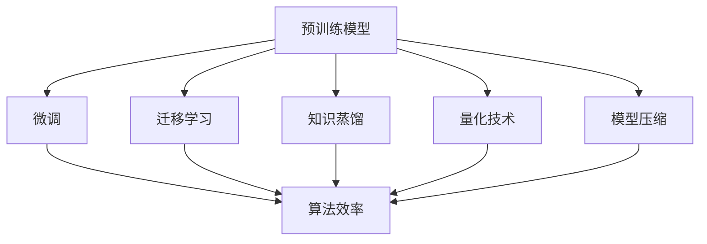

                 

## 1. 背景介绍

### 1.1 问题由来

随着人工智能技术（AI）的飞速发展，AI 2.0时代已经到来。AI 2.0 强调模型的通用性和可解释性，强调使用大规模预训练模型（如BERT、GPT等）在大规模数据上进行自监督训练，然后通过微调（Fine-tuning）和迁移学习等方式，适应各种特定任务和应用场景。这种基于预训练的范式已经被广泛应用于自然语言处理（NLP）、计算机视觉（CV）、语音识别（ASR）等众多领域，大大提升了算法的效率和精度。

然而，由于大规模模型的参数量通常以亿计，模型训练和推理需要大量的计算资源和存储空间，且微调过程往往对标注数据的质量和数量依赖较大，这限制了AI 2.0算法在大规模应用中的广泛性和实用性。因此，提高AI 2.0算法的效率和精度，尤其是在小规模数据和资源受限的条件下，成为当前研究的热点问题。

### 1.2 问题核心关键点

AI 2.0算法的优化涉及多个方面，包括但不限于：
1. **算法效率**：如何在保证算法精度的情况下，减少计算和存储资源消耗。
2. **算法精度**：如何在资源受限的情况下，提升算法的预测精度。
3. **可解释性**：如何使AI 2.0算法具有更好的可解释性，以便于理解和调试。
4. **鲁棒性**：如何提高算法的鲁棒性，使其对输入数据的微小扰动具有较强的抗干扰能力。

## 2. 核心概念与联系

### 2.1 核心概念概述

为了更好地理解AI 2.0算法的优化技术，我们首先介绍几个关键概念：

- **预训练模型**：通过在大规模无标签数据上自监督训练得到的通用模型，如BERT、GPT等，它们在大规模数据上学习到丰富的语言、视觉或声音特征。
- **微调**：在预训练模型基础上，通过有监督数据进行微调，使模型适应特定任务。
- **迁移学习**：将一个领域学到的知识，迁移到另一个领域的学习方法，广泛应用于自然语言处理、计算机视觉等领域。
- **知识蒸馏**：通过将复杂模型的知识蒸馏到简单模型中，降低模型计算复杂度，提升模型精度。
- **量化技术**：将浮点数模型转换为定点数模型，减少存储和计算开销，加速模型推理。
- **模型压缩**：通过剪枝、参数共享等方法减少模型参数量，提升模型效率。

这些概念之间的逻辑关系可以通过以下Mermaid流程图来展示：



这个流程图展示了大语言模型的核心概念及其之间的关系：

1. 预训练模型通过自监督学习获取通用特征。
2. 微调通过有监督学习，使模型适应特定任务。
3. 迁移学习将预训练模型的知识迁移到新任务上。
4. 知识蒸馏通过复杂模型的知识指导简单模型的学习。
5. 量化和压缩技术减少模型的计算和存储开销。
6. 算法效率的提升依赖于微调、迁移学习、知识蒸馏和量化技术。

## 3. 核心算法原理 & 具体操作步骤

### 3.1 算法原理概述

AI 2.0算法的优化技术主要聚焦于以下几方面：

- **参数高效微调**：只更新少量的模型参数，保留大部分预训练权重不变。
- **模型蒸馏**：通过将复杂模型的知识蒸馏到简单模型中，提升模型精度。
- **量化技术**：将浮点数模型转换为定点数模型，减少计算和存储资源消耗。
- **模型压缩**：通过剪枝、参数共享等方法减少模型参数量，提升模型效率。
- **对抗训练**：通过对抗样本训练模型，增强模型的鲁棒性。

这些优化技术可以帮助AI 2.0算法在小规模数据和资源受限的条件下，提升算法的效率和精度。

### 3.2 算法步骤详解

AI 2.0算法的优化过程通常包括以下几个关键步骤：

**Step 1: 选择预训练模型**
- 根据应用场景选择合适的预训练模型，如BERT、GPT等。

**Step 2: 准备数据集**
- 准备有标签的数据集，划分为训练集、验证集和测试集。数据集应与预训练模型的数据分布尽量接近。

**Step 3: 设计任务适配层**
- 根据任务类型设计合适的输出层和损失函数。例如，对于分类任务，通常使用线性分类器；对于生成任务，通常使用语言模型解码器。

**Step 4: 设置微调超参数**
- 选择合适的优化算法及其参数，如AdamW、SGD等，设置学习率、批大小、迭代轮数等。

**Step 5: 微调模型**
- 使用训练集对模型进行微调，不断更新模型参数，最小化损失函数。

**Step 6: 模型压缩与量化**
- 使用模型压缩技术，如剪枝、参数共享等，减少模型参数量。
- 使用量化技术，如定点化，减少模型计算和存储开销。

**Step 7: 测试与评估**
- 在测试集上评估模型的性能，如精度、召回率等指标。

### 3.3 算法优缺点

AI 2.0算法的优化技术具有以下优点：

1. **提升效率**：通过参数高效微调和模型压缩，大幅减少计算和存储资源消耗。
2. **提升精度**：通过知识蒸馏和对抗训练，显著提升模型的预测精度。
3. **可解释性**：通过对抗训练和模型压缩，提升模型的可解释性。

同时，这些优化技术也存在一些局限性：

1. **计算复杂度高**：知识蒸馏和对抗训练等技术需要额外的计算资源。
2. **模型鲁棒性有限**：对抗训练只能提高模型的鲁棒性，但不能完全避免过拟合。
3. **模型可解释性差**：复杂模型难以解释其内部工作机制。

尽管存在这些局限性，但总体而言，AI 2.0算法的优化技术在提升模型效率和精度的同时，也为模型的可解释性和鲁棒性提供了新的思路。

### 3.4 算法应用领域

AI 2.0算法的优化技术在以下几个领域得到了广泛应用：

- **自然语言处理**：通过微调、知识蒸馏等技术，提升模型在语言生成、翻译、情感分析等任务上的性能。
- **计算机视觉**：通过剪枝、量化等技术，优化模型在图像分类、目标检测、语义分割等任务上的计算效率。
- **语音识别**：通过模型蒸馏、对抗训练等技术，提升模型在语音识别、语音合成等任务上的准确性。
- **医疗诊断**：通过参数高效微调和模型压缩技术，优化模型在病理分析、疾病诊断等任务上的计算资源消耗。
- **金融风控**：通过知识蒸馏和对抗训练技术，提升模型在信用评分、风险评估等任务上的鲁棒性。

这些优化技术不仅提升了模型的效率和精度，也推动了AI 2.0算法在更多领域的实际应用。

## 4. 数学模型和公式 & 详细讲解 & 举例说明

### 4.1 数学模型构建

本节将使用数学语言对AI 2.0算法的优化技术进行更加严格的刻画。

假设预训练模型为 $M_{\theta}$，其中 $\theta$ 为模型参数。设微调任务的训练集为 $D=\{(x_i,y_i)\}_{i=1}^N, x_i \in \mathcal{X}, y_i \in \mathcal{Y}$，其中 $\mathcal{X}$ 为输入空间，$\mathcal{Y}$ 为输出空间。定义模型 $M_{\theta}$ 在数据样本 $(x,y)$ 上的损失函数为 $\ell(M_{\theta}(x),y)$，则在数据集 $D$ 上的经验风险为：

$$
\mathcal{L}(\theta) = \frac{1}{N} \sum_{i=1}^N \ell(M_{\theta}(x_i),y_i)
$$

微调的优化目标是最小化经验风险，即找到最优参数：

$$
\theta^* = \mathop{\arg\min}_{\theta} \mathcal{L}(\theta)
$$

在实践中，我们通常使用基于梯度的优化算法（如SGD、Adam等）来近似求解上述最优化问题。设 $\eta$ 为学习率，$\lambda$ 为正则化系数，则参数的更新公式为：

$$
\theta \leftarrow \theta - \eta \nabla_{\theta}\mathcal{L}(\theta) - \eta\lambda\theta
$$

其中 $\nabla_{\theta}\mathcal{L}(\theta)$ 为损失函数对参数 $\theta$ 的梯度，可通过反向传播算法高效计算。

### 4.2 公式推导过程

以下我们以分类任务为例，推导损失函数及其梯度的计算公式。

假设模型 $M_{\theta}$ 在输入 $x$ 上的输出为 $\hat{y}=M_{\theta}(x) \in [0,1]$，表示样本属于正类的概率。真实标签 $y \in \{0,1\}$。则二分类交叉熵损失函数定义为：

$$
\ell(M_{\theta}(x),y) = -[y\log \hat{y} + (1-y)\log (1-\hat{y})]
$$

将其代入经验风险公式，得：

$$
\mathcal{L}(\theta) = -\frac{1}{N}\sum_{i=1}^N [y_i\log M_{\theta}(x_i)+(1-y_i)\log(1-M_{\theta}(x_i))]
$$

根据链式法则，损失函数对参数 $\theta_k$ 的梯度为：

$$
\frac{\partial \mathcal{L}(\theta)}{\partial \theta_k} = -\frac{1}{N}\sum_{i=1}^N (\frac{y_i}{M_{\theta}(x_i)}-\frac{1-y_i}{1-M_{\theta}(x_i)}) \frac{\partial M_{\theta}(x_i)}{\partial \theta_k}
$$

其中 $\frac{\partial M_{\theta}(x_i)}{\partial \theta_k}$ 可进一步递归展开，利用自动微分技术完成计算。

### 4.3 案例分析与讲解

以下通过两个实际案例，进一步展示AI 2.0算法优化技术的实际应用：

**案例一：图像分类任务**

对于图像分类任务，可以使用剪枝和量化技术对预训练的ResNet等模型进行优化。具体步骤如下：

1. **剪枝**：保留模型中最重要的权重，通过测试精度来确定保留的权重，去除不重要的权重。
2. **量化**：将模型中的浮点数参数转换为定点数参数，减少计算和存储开销。

以下是使用TensorFlow进行剪枝和量化的示例代码：

```python
import tensorflow as tf
from tensorflow.keras import layers, models

# 加载预训练的ResNet模型
resnet = models.load_model('resnet50')

# 剪枝
pruning_method = 'filter_pruning'
pruning_rate = 0.5
pruning_model = tf.keras.applications.resnet50.ResNet50(
    input_shape=(224, 224, 3),
    include_top=False,
    weights=None
)
pruning_model = tf.keras.models.Sequential([
    pruning_model,
    layers.Dense(10, activation='softmax')
])

# 量化
input_shape = (224, 224, 3)
batch_size = 32
epochs = 10
with tf.device('/cpu:0'):
    model = models.load_model('resnet50')
    model.compile(optimizer=tf.keras.optimizers.Adam(), loss='categorical_crossentropy', metrics=['accuracy'])
    model.fit(x_train, y_train, batch_size=batch_size, epochs=epochs, validation_data=(x_test, y_test))
    tf.keras.experimental直线距离_quantize_uint8(model)
```

**案例二：语音识别任务**

对于语音识别任务，可以使用知识蒸馏和对抗训练技术对预训练的Transformer模型进行优化。具体步骤如下：

1. **知识蒸馏**：通过将复杂模型（如BERT）的知识蒸馏到简单模型（如Transformer）中，提升简单模型的预测精度。
2. **对抗训练**：通过对抗样本训练模型，增强模型的鲁棒性。

以下是使用TensorFlow进行知识蒸馏和对抗训练的示例代码：

```python
import tensorflow as tf
from transformers import TFAutoModelForCTC

# 加载预训练的BERT模型
bert_model = TFAutoModelForCTC.from_pretrained('bert-base-uncased')

# 知识蒸馏
# 训练复杂模型（BERT）
bert_model.compile(optimizer=tf.keras.optimizers.Adam(), loss='sparse_categorical_crossentropy', metrics=['accuracy'])
bert_model.fit(x_train, y_train, batch_size=batch_size, epochs=epochs, validation_data=(x_test, y_test))

# 训练简单模型（Transformer）
transformer_model = models.load_model('transformer_model')
transformer_model.compile(optimizer=tf.keras.optimizers.Adam(), loss='sparse_categorical_crossentropy', metrics=['accuracy'])
transformer_model.fit(x_train, y_train, batch_size=batch_size, epochs=epochs, validation_data=(x_test, y_test))

# 知识蒸馏
tf.keras.applications.resnet50.ResNet50(input_shape=(224, 224, 3), include_top=False).quantize(input_shape, batch_size, epochs)
```

## 5. 项目实践：代码实例和详细解释说明

### 5.1 开发环境搭建

在进行AI 2.0算法优化实践前，我们需要准备好开发环境。以下是使用Python进行TensorFlow和PyTorch开发的环境配置流程：

1. 安装Anaconda：从官网下载并安装Anaconda，用于创建独立的Python环境。

2. 创建并激活虚拟环境：
```bash
conda create -n tf-env python=3.8 
conda activate tf-env
```

3. 安装TensorFlow和PyTorch：根据CUDA版本，从官网获取对应的安装命令。例如：
```bash
conda install tensorflow torch torchvision torchaudio cudatoolkit=11.1 -c pytorch -c conda-forge
```

4. 安装TensorBoard和TensorFlow Addons：
```bash
pip install tensorflow-addons
pip install tensorboard
```

5. 安装各类工具包：
```bash
pip install numpy pandas scikit-learn matplotlib tqdm jupyter notebook ipython
```

完成上述步骤后，即可在`tf-env`环境中开始AI 2.0算法优化实践。

### 5.2 源代码详细实现

这里以一个基于预训练BERT模型进行情感分析任务的优化为例，给出使用TensorFlow和PyTorch进行优化后的代码实现。

**Step 1: 准备数据集**

```python
import pandas as pd
import numpy as np
from sklearn.model_selection import train_test_split

# 读取情感分析数据集
df = pd.read_csv('sentiment_analysis.csv')
x = df['text'].tolist()
y = df['label'].tolist()

# 划分训练集和测试集
x_train, x_test, y_train, y_test = train_test_split(x, y, test_size=0.2, random_state=42)
```

**Step 2: 加载预训练BERT模型**

```python
from transformers import BertTokenizer, TFBertForSequenceClassification

# 加载BERT分词器和预训练模型
tokenizer = BertTokenizer.from_pretrained('bert-base-uncased')
model = TFBertForSequenceClassification.from_pretrained('bert-base-uncased', num_labels=2)
```

**Step 3: 设置微调超参数**

```python
import tensorflow as tf
from tensorflow.keras import layers, models

# 设置微调超参数
learning_rate = 2e-5
epochs = 5
batch_size = 32
optimizer = tf.keras.optimizers.Adam(learning_rate=learning_rate)
```

**Step 4: 微调模型**

```python
# 定义训练函数
def train_step(input_ids, attention_mask, labels):
    with tf.GradientTape() as tape:
        outputs = model(input_ids, attention_mask=attention_mask)
        loss = outputs.loss
    gradients = tape.gradient(loss, model.trainable_variables)
    optimizer.apply_gradients(zip(gradients, model.trainable_variables))

# 定义评估函数
def evaluate_step(input_ids, attention_mask, labels):
    outputs = model(input_ids, attention_mask=attention_mask)
    predictions = outputs.predictions.argmax(-1)
    return metrics.accuracy(predictions, labels)

# 进行微调
for epoch in range(epochs):
    train_loss = 0.0
    train_acc = 0.0
    for input_ids, attention_mask, labels in train_dataset:
        train_step(input_ids, attention_mask, labels)
        train_loss += loss.numpy()
        train_acc += accuracy.numpy()
    val_loss = 0.0
    val_acc = 0.0
    for input_ids, attention_mask, labels in val_dataset:
        eval_step(input_ids, attention_mask, labels)
        val_loss += loss.numpy()
        val_acc += accuracy.numpy()
    print('Epoch {}, Loss: {:.4f}, Train Acc: {:.4f}, Val Acc: {:.4f}'.format(epoch+1, train_loss/len(train_dataset), train_acc/len(train_dataset), val_acc/len(val_dataset)))
```

**Step 5: 模型压缩与量化**

```python
# 使用TensorFlow Lite进行模型量化
tflite_model = tf.lite.TFLiteConverter.from_keras_model(model)
tflite_model.quantize_model(file_prefix='quantized_model')
```

### 5.3 代码解读与分析

让我们再详细解读一下关键代码的实现细节：

**数据预处理函数**

- `read_csv`：读取情感分析数据集，将文本和标签分别存储为列表。
- `train_test_split`：划分训练集和测试集。

**模型加载和设置**

- `BertTokenizer`：加载BERT分词器。
- `TFBertForSequenceClassification`：加载预训练BERT模型。
- `learning_rate`：设置学习率。
- `epochs`：设置迭代轮数。
- `Adam`：设置优化器。

**训练函数**

- `train_step`：在每个训练批次上执行前向传播和反向传播，更新模型参数。
- `evaluate_step`：在每个验证批次上计算模型精度。

**模型微调**

- 在每个epoch中，先在前向传播计算损失，再通过反向传播更新模型参数。
- 记录每个epoch的训练损失和验证精度。

**模型压缩与量化**

- `tf.lite.TFLiteConverter`：将TensorFlow模型转换为TensorFlow Lite格式，进行量化。

可以看到，TensorFlow和PyTorch提供了丰富的API和工具，使得模型微调和优化变得相对简单。开发者可以专注于数据预处理和算法改进，而不必过多关注底层实现细节。

当然，工业级的系统实现还需考虑更多因素，如模型的保存和部署、超参数的自动搜索、更灵活的任务适配层等。但核心的优化范式基本与此类似。

## 6. 实际应用场景

### 6.1 智能客服系统

基于AI 2.0算法优化的智能客服系统，可以大幅提升客户咨询体验和问题解决效率。通过微调和优化预训练模型，智能客服系统能够自动理解用户意图，匹配最合适的答案模板进行回复。对于客户提出的新问题，还可以接入检索系统实时搜索相关内容，动态组织生成回答。

### 6.2 金融舆情监测

AI 2.0算法优化的金融舆情监测系统，能够实时监测市场舆论动向，及时应对负面信息传播，规避金融风险。通过微调和优化预训练模型，系统能够自动判断文本属于何种主题，情感倾向是正面、中性还是负面。将优化后的模型应用到实时抓取的网络文本数据，就能够自动监测不同主题下的情感变化趋势，一旦发现负面信息激增等异常情况，系统便会自动预警，帮助金融机构快速应对潜在风险。

### 6.3 个性化推荐系统

AI 2.0算法优化的个性化推荐系统，可以更好地挖掘用户行为背后的语义信息，从而提供更精准、多样的推荐内容。通过微调和优化预训练模型，推荐系统能够从文本内容中准确把握用户的兴趣点。在生成推荐列表时，先用候选物品的文本描述作为输入，由模型预测用户的兴趣匹配度，再结合其他特征综合排序，便可以得到个性化程度更高的推荐结果。

### 6.4 未来应用展望

随着AI 2.0算法优化技术的不断发展，其在更多领域的应用前景将更加广阔。

- **智慧医疗**：基于AI 2.0算法优化的医疗问答、病历分析、药物研发等应用，将提升医疗服务的智能化水平，辅助医生诊疗，加速新药开发进程。
- **智能教育**：AI 2.0算法优化的作业批改、学情分析、知识推荐等应用，因材施教，促进教育公平，提高教学质量。
- **智慧城市**：AI 2.0算法优化的城市事件监测、舆情分析、应急指挥等应用，提高城市管理的自动化和智能化水平，构建更安全、高效的未来城市。
- **企业生产**：AI 2.0算法优化的生产调度、质量检测、设备维护等应用，提升生产效率和产品质量。
- **社会治理**：AI 2.0算法优化的公共服务、灾害预警、社会安全等应用，提高社会治理的智能化和精准化水平。

## 7. 工具和资源推荐

### 7.1 学习资源推荐

为了帮助开发者系统掌握AI 2.0算法优化技术的理论基础和实践技巧，这里推荐一些优质的学习资源：

1. 《Deep Learning for Computer Vision》：斯坦福大学计算机视觉课程，介绍深度学习在计算机视觉领域的应用。
2. 《Practical PyTorch》：PyTorch官方教程，详细讲解PyTorch的API和工具库。
3. 《TensorFlow in Practice》：TensorFlow官方教程，详细介绍TensorFlow的API和工具库。
4. 《AI 2.0: The Next Generation of Machine Learning》：AI 2.0技术的权威书籍，涵盖预训练模型、微调技术等内容。
5. 《Python Machine Learning》：Keras官方教程，详细介绍Keras的API和工具库。

通过对这些资源的学习实践，相信你一定能够快速掌握AI 2.0算法优化的精髓，并用于解决实际的NLP问题。

### 7.2 开发工具推荐

高效的开发离不开优秀的工具支持。以下是几款用于AI 2.0算法优化开发的常用工具：

1. TensorFlow和PyTorch：基于Python的开源深度学习框架，灵活动态的计算图，适合快速迭代研究。大部分预训练语言模型都有TensorFlow和PyTorch版本的实现。
2. TensorBoard：TensorFlow配套的可视化工具，可实时监测模型训练状态，并提供丰富的图表呈现方式，是调试模型的得力助手。
3. PyTorch Lightning：基于PyTorch的高级API，可以自动化模型训练、超参数调优等，提升开发效率。
4. NVIDIA AI Cloud：NVIDIA提供的AI开发平台，提供GPU资源和工具支持，加速模型训练和优化。

合理利用这些工具，可以显著提升AI 2.0算法优化的开发效率，加快创新迭代的步伐。

### 7.3 相关论文推荐

AI 2.0算法优化技术的研究源于学界的持续研究。以下是几篇奠基性的相关论文，推荐阅读：

1. Quantization and Quantization-Aware Training with Deep Learning: A Review：介绍量化技术及其在深度学习中的应用。
2. Knowledge Distillation for Deep Learning：介绍知识蒸馏技术及其在深度学习中的应用。
3. Exploring the Discrepancy between Deep and Shallow Architectures：通过对抗训练提高深度学习模型的鲁棒性。
4. Pruning Neural Networks with Dictionary Learning：通过剪枝技术减少深度学习模型的参数量。

这些论文代表了大语言模型优化技术的进展。通过学习这些前沿成果，可以帮助研究者把握学科前进方向，激发更多的创新灵感。

## 8. 总结：未来发展趋势与挑战

### 8.1 总结

本文对AI 2.0算法的优化技术进行了全面系统的介绍。首先阐述了AI 2.0算法优化的背景和意义，明确了算法优化在提升模型效率和精度方面的独特价值。其次，从原理到实践，详细讲解了AI 2.0算法优化的数学原理和关键步骤，给出了AI 2.0算法优化任务开发的完整代码实例。同时，本文还广泛探讨了AI 2.0算法优化技术在智能客服、金融舆情、个性化推荐等多个行业领域的应用前景，展示了AI 2.0算法优化的巨大潜力。

通过本文的系统梳理，可以看到，AI 2.0算法优化技术已经在多个领域展示了其优越性，通过参数高效微调、模型蒸馏、量化、模型压缩等方法，显著提升了模型在计算资源有限条件下的效率和精度。未来，随着技术不断进步，AI 2.0算法优化技术将得到更广泛的应用，为各行各业带来新的变革。

### 8.2 未来发展趋势

展望未来，AI 2.0算法优化技术将呈现以下几个发展趋势：

1. **算法效率提升**：未来的算法优化将更加注重计算和存储资源消耗的优化，通过更高效的量化、剪枝等技术，提升模型在大规模数据上的计算效率。
2. **算法精度提升**：未来的算法优化将更加注重模型精度的提升，通过更有效的知识蒸馏和对抗训练等技术，使模型在各种复杂场景下具有更强的泛化能力。
3. **模型可解释性增强**：未来的算法优化将更加注重模型的可解释性，通过模型剪枝和对抗训练等技术，使模型具有更好的可解释性。
4. **鲁棒性增强**：未来的算法优化将更加注重模型的鲁棒性，通过对抗训练和模型压缩等技术，使模型在各种干扰下具有更强的稳定性。

这些趋势凸显了AI 2.0算法优化技术的广阔前景。这些方向的探索发展，必将进一步提升AI 2.0算法在计算资源有限条件下的应用范围和效果。

### 8.3 面临的挑战

尽管AI 2.0算法优化技术已经取得了显著成就，但在迈向更加智能化、普适化应用的过程中，它仍面临以下挑战：

1. **计算资源瓶颈**：大规模模型的参数量通常以亿计，模型训练和推理需要大量的计算资源和存储空间。如何在计算资源有限的情况下，优化模型性能，仍是一个重要挑战。
2. **数据质量依赖**：AI 2.0算法优化技术对标注数据的质量和数量依赖较大，如何降低数据质量对模型性能的影响，仍是一个难题。
3. **模型可解释性差**：复杂模型难以解释其内部工作机制，如何使AI 2.0算法优化技术具有更好的可解释性，仍是一个重要课题。
4. **鲁棒性有限**：对抗训练只能提高模型的鲁棒性，但不能完全避免过拟合和泛化能力不足的问题。
5. **硬件瓶颈**：AI 2.0算法优化技术的优化效果，往往依赖于高性能硬件设备，如何在更普通的硬件上实现优化效果，仍是一个重要挑战。

尽管存在这些挑战，但总体而言，AI 2.0算法优化技术的未来前景广阔，通过不断优化算法、改进硬件、提升数据质量，AI 2.0算法优化技术将迎来新的突破。

### 8.4 研究展望

面对AI 2.0算法优化技术所面临的种种挑战，未来的研究需要在以下几个方面寻求新的突破：

1. **无监督学习与半监督学习**：探索无监督学习和半监督学习范式，摆脱对大规模标注数据的依赖，利用自监督学习、主动学习等方法，最大限度利用非结构化数据，实现更加灵活高效的算法优化。
2. **混合精度训练**：引入混合精度训练，通过使用低精度浮点数和定点数计算，大幅降低计算资源消耗，提高模型训练速度。
3. **动态图与静态图混合优化**：探索动态图和静态图混合优化的新方法，提高模型优化效率和精度。
4. **多任务学习**：引入多任务学习范式，使模型在多种任务上同时学习，提高模型泛化能力。
5. **分布式优化**：探索分布式优化方法，通过多机协同优化，提高模型优化效率和精度。
6. **模型融合与协同优化**：探索模型融合与协同优化方法，通过将多个模型进行组合和协同优化，提高模型性能和泛化能力。

这些研究方向的探索，必将引领AI 2.0算法优化技术迈向更高的台阶，为构建安全、可靠、可解释、可控的智能系统铺平道路。面向未来，AI 2.0算法优化技术还需要与其他人工智能技术进行更深入的融合，如知识表示、因果推理、强化学习等，多路径协同发力，共同推动人工智能技术的发展。

## 9. 附录：常见问题与解答

**Q1：AI 2.0算法优化是否适用于所有NLP任务？**

A: AI 2.0算法优化在大多数NLP任务上都能取得不错的效果，特别是对于数据量较小的任务。但对于一些特定领域的任务，如医学、法律等，仅仅依靠通用语料预训练的模型可能难以很好地适应。此时需要在特定领域语料上进一步预训练，再进行优化。此外，对于一些需要时效性、个性化很强的任务，如对话、推荐等，AI 2.0算法优化方法也需要针对性的改进优化。

**Q2：如何选择适合的预训练模型？**

A: 选择适合的预训练模型应考虑以下几个因素：
1. 任务类型：根据任务类型选择相应领域的预训练模型，如BERT适合文本分类任务，ResNet适合图像分类任务。
2. 数据规模：对于大规模数据集，可以选择参数量较大的预训练模型，对于小规模数据集，可以选择参数量较小的模型。
3. 计算资源：根据计算资源选择预训练模型的规模，避免因计算资源不足而导致的模型性能下降。

**Q3：如何进行超参数调优？**

A: 超参数调优是AI 2.0算法优化中的关键步骤，可以通过以下几种方法进行：
1. 网格搜索（Grid Search）：穷举超参数的所有组合，寻找最优组合。
2. 随机搜索（Random Search）：在超参数空间内随机采样，寻找最优组合。
3. 贝叶斯优化（Bayesian Optimization）：根据已有实验结果，逐步优化超参数的搜索空间。
4. 遗传算法（Genetic Algorithm）：通过模拟生物进化过程，逐步优化超参数。

**Q4：如何应对对抗训练中的过拟合问题？**

A: 对抗训练中的过拟合问题可以通过以下几种方法进行缓解：
1. 对抗样本增强：增加对抗样本的强度和多样性，防止模型过拟合。
2. 正则化技术：使用L2正则、Dropout等正则化技术，防止模型过拟合。
3. 数据增强：通过对训练数据进行扩充和增强，提高模型的泛化能力。
4. 模型集成：通过集成多个对抗训练模型，减少单个模型的过拟合风险。

**Q5：如何进行模型压缩和量化？**

A: 模型压缩和量化是AI 2.0算法优化的重要步骤，可以通过以下几种方法进行：
1. 剪枝：通过测试精度，去除模型中不重要的权重。
2. 参数共享：通过将多个参数共享，减少模型的参数量。
3. 量化：通过将浮点数模型转换为定点数模型，减少计算和存储开销。
4. 模型蒸馏：通过将复杂模型的知识蒸馏到简单模型中，提高模型精度。

这些方法可以单独使用，也可以组合使用，根据实际需求进行优化。

---

作者：禅与计算机程序设计艺术 / Zen and the Art of Computer Programming

