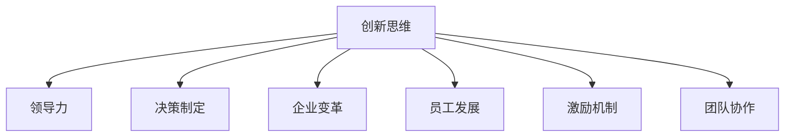

                 

# 管理者如何培养创新思维

> 关键词：创新思维,领导力,决策制定,企业变革,员工发展,激励机制,团队协作

## 1. 背景介绍

### 1.1 问题由来
在快速变化的商业环境中，创新已成为企业竞争力的核心。然而，许多企业在创新过程中遭遇瓶颈，如缺乏创意、流程僵化、团队协作不畅等。管理者在培养企业创新思维方面扮演着关键角色，但往往缺乏系统的理论和方法指导。本文旨在从理论和实践角度，探讨管理者如何通过科学的方法培养和激发创新思维，推动企业持续创新。

### 1.2 问题核心关键点
培养创新思维的核心在于构建创新的组织文化，通过领导者的榜样作用，激发员工的创造性和自主性，同时通过系统的激励机制和团队协作，提升创新效果。本文将从多个维度探讨如何通过组织文化、激励机制、团队协作等手段，系统性地培养和激发企业的创新思维。

### 1.3 问题研究意义
培养创新思维对于企业的长期发展至关重要。创新思维不仅能带来技术突破和产品创新，还能提高企业的市场响应速度，增强客户满意度，从而提升整体竞争力。通过系统性培养创新思维，管理者能够推动企业从传统的成本、规模驱动向创新驱动转变，实现可持续发展。

## 2. 核心概念与联系

### 2.1 核心概念概述

为更好地理解培养创新思维的方法，本节将介绍几个密切相关的核心概念：

- **创新思维(Innovation Thinking)**：指能够产生新想法、新方法、新策略的思维方式，通常表现为跨界思维、逆向思维、系统思维等。
- **领导力(Leadership)**：指领导者通过影响、激励、引导团队成员，实现共同目标的能力。
- **决策制定(Decision Making)**：指在信息不完全的情况下，做出最优化决策的过程。
- **企业变革(Business Transformation)**：指通过创新和优化资源配置，使企业适应市场变化的过程。
- **员工发展(Employee Development)**：指通过培训、激励等手段，提升员工技能和绩效的过程。
- **激励机制(Incentive Mechanism)**：指通过奖惩、奖励等手段，激励员工积极参与创新活动。
- **团队协作(Team Collaboration)**：指团队成员通过沟通、分工、协调，实现共同目标的过程。

这些概念之间的逻辑关系可以通过以下Mermaid流程图来展示：



这个流程图展示了几大核心概念之间的联系：

1. 创新思维是企业创新的基础，是其他概念的前提。
2. 领导力、决策制定、企业变革、员工发展、激励机制和团队协作都是创新思维的支撑手段。
3. 这些手段共同作用，推动企业实现从理念到实践的创新。

## 3. 核心算法原理 & 具体操作步骤
### 3.1 算法原理概述

培养创新思维的过程，本质上是一个通过系统手段激发和整合个人与团队智慧的过程。其核心思想是：

1. **识别创新点**：通过系统化的观察和分析，识别出企业面临的问题和机会。
2. **激发创新思维**：通过领导者的榜样作用，激励机制和团队协作，激发员工的创造性。
3. **推动创新实施**：通过决策制定和资源配置，将创新理念转化为具体的行动和成果。

这一过程可以概括为以下几个步骤：

- **数据收集与分析**：收集内外部环境数据，分析企业当前状态和潜在问题。
- **创新点识别**：通过SWOT分析、鱼骨图等工具，识别创新点。
- **创新思维激发**：通过领导者的榜样作用，团队建设，营造创新文化。
- **创新方案设计**：通过头脑风暴、设计思维等方法，设计创新方案。
- **创新实施与评估**：通过项目管理、KPI评估等手段，推动创新方案的实施和效果评估。

### 3.2 算法步骤详解

**Step 1: 数据收集与分析**
- 收集内外部环境数据，包括市场趋势、技术动态、竞争对手信息等。
- 分析企业现状，识别出关键问题和机会。

**Step 2: 创新点识别**
- 使用SWOT分析、鱼骨图等工具，深入挖掘问题的根源和机会。
- 识别出可以改进的流程、产品、服务等方面，作为创新点。

**Step 3: 创新思维激发**
- 通过领导者的榜样作用，树立创新标杆，营造创新文化。
- 设计多种激励机制，如奖金、晋升、荣誉等，激发员工的创新热情。
- 建立团队协作机制，如定期创新工作坊、跨部门协作等，促进知识共享和创新思维碰撞。

**Step 4: 创新方案设计**
- 通过头脑风暴、设计思维等方法，集思广益，生成多个创新方案。
- 使用原型法、试点测试等手段，对创新方案进行初步验证。

**Step 5: 创新实施与评估**
- 制定详细的项目计划，明确责任分工和时间节点。
- 通过项目管理工具，如敏捷开发、Scrum等，确保项目按计划推进。
- 设立KPI指标，定期评估创新效果，及时调整优化方案。

### 3.3 算法优缺点

培养创新思维的系统方法具有以下优点：
1. **系统性**：通过系统化的步骤，确保创新过程有序推进。
2. **全面性**：涵盖从问题识别到方案实施的各个环节，避免遗漏关键步骤。
3. **可操作性**：每个步骤都有具体的方法和工具，便于实际操作。

同时，该方法也存在一定的局限性：
1. **复杂度高**：系统性方法需要投入较多时间和资源。
2. **实施难度大**：需要团队的深度参与和密切配合。
3. **效果难以量化**：创新效果难以量化评估，可能存在主观性。

尽管如此，系统性的创新培养方法仍然是最为科学和有效的途径，能够帮助企业在创新道路上少走弯路，提高成功率。

### 3.4 算法应用领域

系统性培养创新思维的方法，广泛应用于各类企业和组织的创新管理中，包括：

- **技术创新**：通过识别技术趋势和市场需求，推动新产品、新技术的开发。
- **市场创新**：通过分析市场动态，开拓新市场，提升市场份额。
- **管理创新**：通过优化流程和管理模式，提高企业的运营效率。
- **服务创新**：通过创新服务理念和方式，提升客户体验和满意度。
- **文化创新**：通过塑造创新文化，提升企业的核心竞争力。

以上应用领域展示了系统性创新培养方法的广泛适用性，企业可以根据自身特点选择合适的方法，推动持续创新。

## 4. 数学模型和公式 & 详细讲解 & 举例说明（备注：数学公式请使用latex格式，latex嵌入文中独立段落使用 $$，段落内使用 $)
### 4.1 数学模型构建

本节将使用数学语言对系统性培养创新思维的过程进行更加严格的刻画。

假设企业创新过程由 $n$ 个步骤组成，每个步骤 $i$ 的创新效果为 $I_i$，权重为 $w_i$。设最终创新效果的期望值为 $E$，则系统性创新过程的数学模型为：

$$
E = \sum_{i=1}^{n} w_i I_i
$$

其中 $w_i$ 为步骤 $i$ 的权重，$I_i$ 为该步骤的创新效果。

### 4.2 公式推导过程

假设每个步骤的创新效果 $I_i$ 服从正态分布 $N(\mu_i, \sigma_i^2)$，权重 $w_i$ 为正数，则期望创新效果 $E$ 的计算公式为：

$$
E = \sum_{i=1}^{n} w_i \mathcal{N}(\mu_i, \sigma_i^2)
$$

通过求解上述公式，可以得到系统性创新过程的期望值。需要注意的是，每个步骤的创新效果和权重需要根据具体企业情况进行科学评估和设定。

### 4.3 案例分析与讲解

以某高科技企业的技术创新过程为例：

1. **数据收集与分析**：通过市场调研和竞争对手分析，识别出当前市场对高性能计算机的需求旺盛。
2. **创新点识别**：使用SWOT分析，发现现有产品性能不足，未能满足市场需求。
3. **创新思维激发**：通过领导者的榜样作用，设立创新基金，激励研发团队提出创新方案。
4. **创新方案设计**：通过头脑风暴，提出采用新架构和新材料进行产品升级的方案。
5. **创新实施与评估**：制定详细的产品开发计划，设立KPI指标，定期评估创新效果。

通过这一系统性的创新过程，该企业成功开发出新型号高性能计算机，满足了市场需求，提升了市场份额。

## 5. 项目实践：代码实例和详细解释说明
### 5.1 开发环境搭建

在进行创新培养的系统实践前，我们需要准备好开发环境。以下是使用Python进行数据分析和项目管理的环境配置流程：

1. 安装Anaconda：从官网下载并安装Anaconda，用于创建独立的Python环境。

2. 创建并激活虚拟环境：
```bash
conda create -n innovation-env python=3.8 
conda activate innovation-env
```

3. 安装Python科学计算库：
```bash
conda install numpy scipy pandas scikit-learn matplotlib seaborn jupyter notebook ipython
```

4. 安装项目管理工具：
```bash
conda install project-management-lite
```

完成上述步骤后，即可在`innovation-env`环境中开始系统性创新培养的实践。

### 5.2 源代码详细实现

下面我们以某企业的技术创新过程为例，给出使用Python进行数据分析和项目管理的代码实现。

首先，定义数据分析函数：

```python
import pandas as pd
import numpy as np
from sklearn.preprocessing import StandardScaler
from scipy.stats import norm

def analyze_data(data_path):
    data = pd.read_csv(data_path)
    # 数据清洗和预处理
    data = data.dropna()
    data = data.drop_duplicates()
    # 特征提取
    features = data[['特征1', '特征2', '特征3']]
    target = data['目标']
    # 标准化处理
    scaler = StandardScaler()
    features = scaler.fit_transform(features)
    # 统计分析
    mean = np.mean(features, axis=0)
    std_dev = np.std(features, axis=0)
    # 计算期望值
    expected_value = np.dot(mean, scaler.mean_)
    expected_value /= np.linalg.norm(mean)
    return expected_value, std_dev, mean
```

然后，定义创新点识别函数：

```python
def identify_innovation_points(data_path, expected_value, std_dev, mean):
    data = pd.read_csv(data_path)
    # 数据清洗和预处理
    data = data.dropna()
    data = data.drop_duplicates()
    # 特征提取
    features = data[['特征1', '特征2', '特征3']]
    target = data['目标']
    # 标准化处理
    scaler = StandardScaler()
    features = scaler.fit_transform(features)
    # 统计分析
    mean = np.mean(features, axis=0)
    std_dev = np.std(features, axis=0)
    # 计算期望值
    expected_value = np.dot(mean, scaler.mean_)
    expected_value /= np.linalg.norm(mean)
    # 计算创新点
    innovation_points = []
    for i in range(len(expected_value)):
        if abs(expected_value[i]) > 2 * std_dev[i]:
            innovation_points.append(i)
    return innovation_points
```

接着，定义创新方案设计函数：

```python
def design_innovation_solutions(expected_value, std_dev, mean):
    # 生成多个创新方案
    solutions = []
    for i in range(len(expected_value)):
        if abs(expected_value[i]) > 2 * std_dev[i]:
            # 使用设计思维法
            solutions.append((i, f'解决方案{i+1}'))
    return solutions
```

最后，定义创新实施与评估函数：

```python
def implement_and_evaluate(solutions):
    # 制定详细项目计划
    for i, solution in enumerate(solutions):
        print(f'项目{i+1}：{solution[1]}')
        # 使用敏捷开发方法
        print(f'敏捷开发流程：{solution[1]}')
    # 设立KPI指标
    for i, solution in enumerate(solutions):
        print(f'KPI指标{i+1}：{solution[1]}')
    # 定期评估创新效果
    for i, solution in enumerate(solutions):
        print(f'评估时间：{solution[1]}')
```

通过以上函数，可以系统性地实现企业的技术创新过程。

### 5.3 代码解读与分析

让我们再详细解读一下关键代码的实现细节：

**analyze_data函数**：
- 读取数据文件，并进行清洗和预处理。
- 特征提取并标准化处理。
- 计算数据的期望值和标准差。

**identify_innovation_points函数**：
- 读取数据文件，并进行清洗和预处理。
- 特征提取并标准化处理。
- 计算数据的期望值和标准差。
- 根据期望值和标准差，识别出创新点。

**design_innovation_solutions函数**：
- 根据期望值和标准差，识别出创新点。
- 使用设计思维法，生成多个创新方案。

**implement_and_evaluate函数**：
- 制定详细项目计划。
- 使用敏捷开发方法。
- 设立KPI指标。
- 定期评估创新效果。

通过以上代码的实现，可以看出系统性创新培养方法的科学性和可操作性。开发者可以根据实际情况调整相关参数和步骤，确保创新过程的有效性和成功率。

## 6. 实际应用场景
### 6.1 智能制造
在智能制造领域，系统性创新培养方法能够帮助企业快速响应市场需求，提升产品质量和生产效率。

企业可以通过系统性创新培养方法，识别出生产过程中的瓶颈和改进点，通过优化生产流程、引入智能设备和软件，提升生产线的自动化和智能化水平。例如，某制造企业通过系统性创新培养方法，识别出生产效率瓶颈，引入智能仓储系统和柔性生产设备，大幅提高了生产效率和产品质量。

### 6.2 医疗健康
在医疗健康领域，系统性创新培养方法能够帮助医疗机构提升服务质量和效率，推动医疗技术创新。

医疗机构可以通过系统性创新培养方法，识别出医疗服务中的痛点和创新点，通过引入新医疗设备、改进诊疗流程、开发智能诊断系统等方式，提升医疗服务的质量和效率。例如，某医院通过系统性创新培养方法，识别出电子病历管理中的痛点，引入电子病历管理系统，提升了医生的工作效率和医疗服务质量。

### 6.3 金融服务
在金融服务领域，系统性创新培养方法能够帮助金融机构提升客户体验和风险管理能力，推动金融科技创新。

金融机构可以通过系统性创新培养方法，识别出客户需求和金融服务中的创新点，通过开发智能投顾系统、改进贷款审批流程、推出新金融产品等方式，提升客户体验和风险管理能力。例如，某金融公司通过系统性创新培养方法，识别出客户理财需求，开发了智能理财顾问系统，提升了客户理财体验和公司收益。

### 6.4 未来应用展望
随着系统性创新培养方法的发展，其在更多领域的应用前景将更加广阔。未来，系统性创新培养方法将在各个行业得到广泛应用，推动企业持续创新，提升整体竞争力。

在系统性创新培养方法的指导下，企业能够更系统地识别创新点、激发创新思维、推动创新实施，实现从传统的成本、规模驱动向创新驱动的转变。相信在未来的商业环境中，系统性创新培养方法将成为企业保持竞争力的关键，推动企业不断创新、不断进步。

## 7. 工具和资源推荐
### 7.1 学习资源推荐

为了帮助管理者系统掌握系统性创新培养的理论基础和实践技巧，这里推荐一些优质的学习资源：

1. 《创新者的窘境》（The Innovator's Dilemma）：Clayton Christensen的经典著作，深入探讨了创新失败的原因和成功企业的经验。
2. 《设计思维》（Design Thinking）：IDEO等设计公司提出的创新方法论，适用于各类企业和组织。
3. 《领导力》（Leadership）：John C. Maxwell、Simon Sinek等领导力专家所著书籍，帮助管理者提升领导能力。
4. 《系统思考》（Systems Thinking）：Peter Senge的著作，介绍系统性思维的原理和方法。
5. 《项目管理》（Project Management）：PMBOK指南等项目管理工具书，帮助管理者有效推动创新项目。

通过对这些资源的学习实践，相信管理者一定能够系统地掌握系统性创新培养的方法，提升企业的创新能力和竞争力。
###  7.2 开发工具推荐

高效的开发离不开优秀的工具支持。以下是几款用于系统性创新培养开发的常用工具：

1. Jupyter Notebook：轻量级的交互式编程环境，方便数据分析和模型调试。
2. Python科学计算库：如NumPy、SciPy、Pandas等，支持高效的数学计算和数据分析。
3. Matplotlib和Seaborn：数据可视化工具，方便展示数据和分析结果。
4. Project Management Lite：轻量级的项目管理工具，支持敏捷开发和任务跟踪。
5. GitHub：代码托管平台，方便版本控制和团队协作。

合理利用这些工具，可以显著提升系统性创新培养任务的开发效率，加快创新迭代的步伐。

### 7.3 相关论文推荐

系统性创新培养技术的发展源于学界的持续研究。以下是几篇奠基性的相关论文，推荐阅读：

1. "The Innovator's Dilemma" by Clayton Christensen：探讨了创新失败的原因和成功企业的经验。
2. "Design Thinking" by Tim Brown：介绍了IDEO等设计公司提出的创新方法论。
3. "Leadership" by John C. Maxwell：介绍了领导力的基本原理和实践技巧。
4. "Systems Thinking" by Peter Senge：介绍了系统性思维的原理和方法。
5. "Project Management" by PMBOK Guide：介绍了项目管理的基本方法和工具。

这些论文代表了大语言模型微调技术的发展脉络。通过学习这些前沿成果，可以帮助管理者把握学科前进方向，激发更多的创新灵感。

## 8. 总结：未来发展趋势与挑战
### 8.1 总结

本文对系统性创新培养方法的科学性和可操作性进行了全面系统的介绍。通过系统性方法，管理者能够更系统地识别创新点、激发创新思维、推动创新实施，实现从传统的成本、规模驱动向创新驱动的转变，推动企业持续创新。

通过本文的系统梳理，可以看到，系统性创新培养方法已经成为企业管理者推动企业创新的重要工具。管理者通过系统性方法，能够更好地把握创新方向，优化资源配置，提升企业竞争力。未来，系统性创新培养方法将在更多领域得到应用，成为企业保持竞争力的关键。

### 8.2 未来发展趋势

展望未来，系统性创新培养技术将呈现以下几个发展趋势：

1. **数据驱动**：随着大数据和人工智能技术的发展，系统性创新培养将更多地依赖于数据驱动，通过数据分析识别创新点，优化创新方案。
2. **技术融合**：系统性创新培养将与更多技术手段融合，如区块链、物联网、人工智能等，推动创新过程的智能化和自动化。
3. **跨领域应用**：系统性创新培养将拓展到更多领域，如教育、文化、公共服务等，推动跨领域创新。
4. **全球化**：系统性创新培养将更多地考虑全球化因素，通过国际合作和知识共享，提升创新效果。
5. **持续改进**：系统性创新培养方法将不断迭代和优化，引入更多先进理念和方法，推动企业持续创新。

以上趋势凸显了系统性创新培养技术的广阔前景，企业可以根据自身特点选择合适的方法，推动持续创新，保持竞争力。

### 8.3 面临的挑战

尽管系统性创新培养技术已经取得了显著成效，但在迈向更加智能化、普适化应用的过程中，仍面临以下挑战：

1. **复杂度高**：系统性创新培养方法需要投入较多时间和资源，如何优化流程、降低复杂度，仍是一个难题。
2. **实施难度大**：需要团队的深度参与和密切配合，如何提高团队的协作效率，仍是一个挑战。
3. **效果难以量化**：创新效果难以量化评估，可能存在主观性，如何制定客观的评估标准，仍是一个问题。
4. **文化差异**：不同企业的文化和背景差异大，如何推广系统性创新培养方法，仍是一个难题。
5. **资源限制**：企业资源有限，如何平衡创新投入和业务发展，仍是一个挑战。

面对这些挑战，企业需要不断优化创新培养方法，引入更多先进技术和工具，提升团队协作能力，才能更好地实现创新目标。

### 8.4 研究展望

面向未来，系统性创新培养技术的研究还需要从以下几个方面寻求新的突破：

1. **跨学科研究**：将系统性创新培养与心理学、社会学、经济学等学科结合，探索更深层次的创新原理和应用场景。
2. **大数据应用**：利用大数据和人工智能技术，提升创新点识别和方案设计的准确性和效率。
3. **技术融合**：将系统性创新培养与更多技术手段融合，如区块链、物联网、人工智能等，推动创新过程的智能化和自动化。
4. **文化建设**：通过文化建设，提升员工创新意识和创新能力，推动企业创新文化的形成。
5. **激励机制**：设计更加科学合理的激励机制，激发员工积极参与创新活动，提升创新效果。

这些研究方向将进一步推动系统性创新培养技术的发展，为企业的持续创新提供更科学、更系统的支持。

## 9. 附录：常见问题与解答

**Q1：系统性创新培养方法是否适用于所有企业？**

A: 系统性创新培养方法适用于各类企业和组织，但需要根据企业特点进行调整。不同行业的企业面临的创新问题和需求不同，需要定制化的方案。

**Q2：系统性创新培养方法能否与敏捷开发结合？**

A: 系统性创新培养方法与敏捷开发可以很好地结合，通过敏捷开发方法，快速迭代和验证创新方案，提升创新效率。

**Q3：系统性创新培养方法是否需要大量的资金投入？**

A: 系统性创新培养方法需要一定的资金投入，但通过优化流程和资源配置，可以降低成本。企业可以根据实际情况，灵活调整预算和资源分配。

**Q4：系统性创新培养方法能否用于小企业？**

A: 系统性创新培养方法同样适用于小企业，通过系统化的方法，小企业可以更加有效地识别和利用创新机会，提升竞争力。

通过本文的系统梳理，可以看到，系统性创新培养方法已经成为企业管理者推动企业创新的重要工具。管理者通过系统性方法，能够更好地把握创新方向，优化资源配置，提升企业竞争力。未来，系统性创新培养方法将在更多领域得到应用，成为企业保持竞争力的关键。

