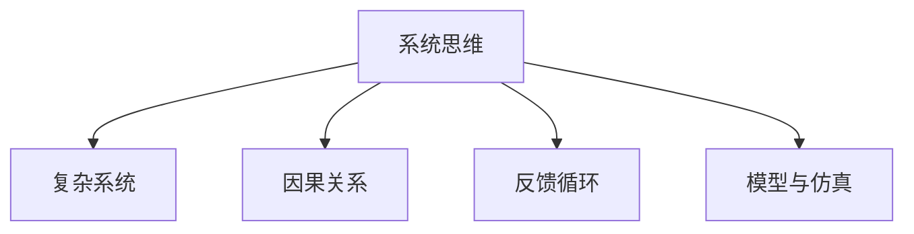

                 

## 1. 背景介绍

### 1.1 问题由来

在快速变化和复杂多变的现代商业环境中，管理者和组织面临的挑战日益严峻。传统的自上而下、线性思维的模式已不足以应对如今的复杂局面。系统思维（Systems Thinking）作为一种全面、全局、动态的思维方式，被视为帮助管理者理解和应对复杂问题的关键工具。

系统思维强调系统的整体性、相互依存性、动态性和层次性，要求管理者从系统的角度出发，考虑各个部分之间的相互作用，从而做出更为全面和深入的决策。

### 1.2 问题核心关键点

系统思维的核心在于以下几个方面：

- **整体性**：将组织视为一个整体系统，关注系统内部各组成部分之间的关系。
- **相互依存性**：认识到各个部分之间的相互依赖，理解系统内部的动态过程。
- **动态性**：认识系统的变化性，预测系统行为，寻找平衡点。
- **层次性**：将系统划分为不同的层次，理解各层次之间的关系。

这些核心概念构成了系统思维的基础，帮助管理者在复杂环境中进行有效决策。

## 2. 核心概念与联系

### 2.1 核心概念概述

为更好地理解系统思维在管理中的应用，本节将介绍几个关键概念：

- **系统思维**：一种全面、全局、动态的思维方式，强调系统的整体性、相互依存性、动态性和层次性。
- **复杂系统**：由大量相互关联的元素组成的系统，其行为难以预测，通常具有自组织性和适应性。
- **因果关系**：系统内部各元素之间的关联关系，理解因果关系是进行系统分析的基础。
- **反馈循环**：系统中信息或能量在各个部分之间传递，形成正反馈或负反馈循环，影响系统行为。
- **模型与仿真**：通过建立模型和仿真系统，管理者可以更好地理解系统行为，预测未来趋势。

这些概念之间的逻辑关系可以通过以下Mermaid流程图来展示：



这个流程图展示了一系列关键概念及其之间的关系：

1. 系统思维是对复杂系统的理解和分析方法。
2. 因果关系和反馈循环是系统内部动态过程的基本机制。
3. 模型与仿真可以帮助管理者更准确地理解和预测系统行为。

这些概念共同构成了系统思维的基础，使管理者能够在复杂环境中进行有效决策。

## 3. 核心算法原理 & 具体操作步骤

### 3.1 算法原理概述

系统思维的算法原理主要基于系统动力学(System Dynamics)和系统建模(System Modeling)。系统动力学通过分析系统的因果关系和反馈循环，揭示系统行为的内在机制，而系统建模则通过数学和计算机仿真，预测系统未来的发展趋势。

#### 3.1.1 系统动力学

系统动力学强调系统内部的动态过程，通过因果关系和反馈循环来理解系统行为。系统动力学模型的核心在于找到系统的关键变量和反馈环，建立动态方程组，通过仿真模拟系统行为。

#### 3.1.2 系统建模

系统建模通常使用计算机仿真技术，建立系统的数学模型，通过仿真模拟系统行为。常用的建模工具包括Sysley、Vensim等。建模过程中需要定义系统的边界、输入输出、参数和状态变量，建立系统的动态方程组，并通过仿真模拟系统行为。

### 3.2 算法步骤详解

系统思维的算法步骤主要包括：

1. **定义系统边界**：明确系统的范围，确定系统的关键变量。
2. **识别因果关系**：分析系统内部的因果关系，建立因果关系图。
3. **建立反馈循环**：找到系统内部的正反馈和负反馈循环，理解系统行为。
4. **建立模型**：定义系统的输入输出，建立系统的动态方程组。
5. **仿真模拟**：通过计算机仿真模拟系统行为，预测系统未来发展趋势。
6. **验证与优化**：通过实际数据验证模型，根据模拟结果优化模型参数。

### 3.3 算法优缺点

系统思维的优点包括：

- **全面性**：能够从整体角度理解系统，避免单一视角带来的片面性。
- **动态性**：能够预测系统行为，提前发现问题，制定应对策略。
- **适应性**：能够灵活调整模型参数，适应系统变化。

缺点包括：

- **复杂性**：系统建模和仿真过程复杂，需要专业知识和工具。
- **依赖数据**：模型效果依赖于准确的数据和合理的参数设定。
- **学习曲线**：系统思维方法的学习曲线较陡，需要时间和实践积累。

### 3.4 算法应用领域

系统思维在多个领域得到了广泛应用，包括：

- **企业战略管理**：通过系统思维理解企业的整体战略，制定适应性强的战略计划。
- **供应链管理**：通过系统思维理解供应链的动态过程，优化供应链管理。
- **项目管理**：通过系统思维理解项目的关键路径和反馈环，优化项目管理过程。
- **环境科学**：通过系统思维理解生态系统的动态过程，制定环境保护策略。
- **医疗健康**：通过系统思维理解医疗系统的复杂性，提高医疗服务质量。

## 4. 数学模型和公式 & 详细讲解

### 4.1 数学模型构建

系统思维的数学模型通常基于系统的因果关系和反馈循环。以下以一个简单的生产系统为例，展示系统思维的数学建模过程。

假设有一个生产系统，生产过程中包含原材料、半成品、成品和废料四种状态。生产过程中，原材料投入产生半成品，半成品通过加工产生成品，成品经过检验合格后出厂，不合格品则成为废料。系统中的因果关系和反馈循环可以表示为：

- 原材料投入 $I$ 产生半成品 $P_1$
- 半成品 $P_1$ 加工产生成品 $P_2$
- 成品 $P_2$ 经过检验合格 $Q$ 出厂
- 不合格成品 $P_2$ 成为废料 $W$
- 生产过程中半成品 $P_1$ 和成品 $P_2$ 的库存水平 $S_1$ 和 $S_2$ 会影响生产速度和成本

基于上述因果关系，可以建立系统的动态方程组：

$$
\begin{align*}
\dot{I} &= -c_1S_1 - c_2S_2 + c_3L \\
\dot{P_1} &= c_1S_1 - c_2S_2 - c_3L - c_4Q \\
\dot{S_1} &= c_2S_2 - c_3L - c_5Q + c_6W \\
\dot{S_2} &= c_4Q - c_3L - c_5Q \\
\dot{Q} &= c_7S_2 \\
\dot{W} &= c_5Q - c_3L - c_6W \\
\end{align*}
$$

其中 $c_1, c_2, \ldots, c_7$ 为系统参数，代表不同的生产效率、检验效率等。

### 4.2 公式推导过程

上述方程组的推导基于以下假设：

- 生产过程中原材料、半成品、成品和废料的库存水平 $I, P_1, P_2, W$ 可以用存量表示，其变化率为流量的流入和流出之差。
- 生产过程中原材料投入、半成品加工、成品出厂和废料产生等事件，其发生概率可以用流量表示。
- 系统的输入输出状态可以用动态方程组表示。

通过上述方程组，可以计算系统的关键变量，如库存水平 $S_1, S_2$、生产速度 $Q$ 和成本。

### 4.3 案例分析与讲解

以某企业的供应链系统为例，分析系统思维的应用。假设该企业有两个供应商 $A, B$，两个仓库 $C, D$，以及一个需求点 $E$。供应商向仓库供货，仓库向需求点供货，每个节点都有库存和订单。系统中的因果关系和反馈循环可以表示为：

- 供应商 $A, B$ 向仓库 $C, D$ 供货，仓库 $C, D$ 向需求点 $E$ 供货
- 仓库 $C, D$ 的库存水平 $S_C, S_D$ 影响供应商的供货量和订单的处理速度
- 需求点 $E$ 的需求量 $D$ 影响仓库的库存水平和订单的处理速度

基于上述因果关系，可以建立系统的动态方程组：

$$
\begin{align*}
\dot{S_C} &= c_1S_D - c_2Q_C - c_3D \\
\dot{S_D} &= c_2Q_C - c_3D - c_4Q_D \\
\dot{Q_C} &= c_5S_C - c_6Q_D \\
\dot{Q_D} &= c_7D \\
\end{align*}
$$

其中 $c_1, c_2, \ldots, c_7$ 为系统参数，代表不同的供货效率、订单处理效率等。

通过上述方程组，可以计算系统的关键变量，如仓库库存水平 $S_C, S_D$、供货速度 $Q_C, Q_D$ 和订单处理速度。

## 5. 项目实践：代码实例和详细解释说明

### 5.1 开发环境搭建

在进行系统思维的项目实践前，我们需要准备好开发环境。以下是使用Python进行Sympy开发的环境配置流程：

1. 安装Anaconda：从官网下载并安装Anaconda，用于创建独立的Python环境。

2. 创建并激活虚拟环境：
```bash
conda create -n systemthinking python=3.8 
conda activate systemthinking
```

3. 安装Sympy：
```bash
pip install sympy
```

4. 安装其他工具包：
```bash
pip install numpy pandas matplotlib scikit-learn jupyter notebook ipython
```

完成上述步骤后，即可在`systemthinking`环境中开始系统思维的项目实践。

### 5.2 源代码详细实现

下面我们以供应链系统为例，给出使用Sympy进行系统建模的PyTorch代码实现。

首先，定义系统的状态变量和参数：

```python
import sympy as sp

# 定义状态变量
S_C, S_D, Q_C, Q_D = sp.symbols('S_C S_D Q_C Q_D')

# 定义系统参数
c_1, c_2, c_3, c_4, c_5, c_6, c_7 = sp.symbols('c_1 c_2 c_3 c_4 c_5 c_6 c_7')

# 建立动态方程组
equations = [
    sp.Eq(sp.diff(S_C, sp.Symbol('t')), c_1*S_D - c_2*Q_C - c_3*D),
    sp.Eq(sp.diff(S_D, sp.Symbol('t')), c_2*Q_C - c_3*D - c_4*Q_D),
    sp.Eq(sp.diff(Q_C, sp.Symbol('t')), c_5*S_C - c_6*Q_D),
    sp.Eq(sp.diff(Q_D, sp.Symbol('t')), c_7*D),
]

# 求解动态方程组
solution = sp.solve(equations, (S_C, S_D, Q_C, Q_D), sp.Symbol('t'))
```

然后，定义系统的输入输出和仿真函数：

```python
import matplotlib.pyplot as plt

# 定义系统输入输出
D = sp.symbols('D')
inputs = [c_1, c_2, c_3, c_4, c_5, c_6, c_7, D]

# 定义仿真函数
def simulate(system, inputs, t, max_t):
    for t in range(max_t):
        for i, var in enumerate(inputs):
            system[i] = solution[i].subs(var, var.evalf())
            inputs[i] = system[i].subs(D, D.evalf())
    return system

# 运行仿真模拟
inputs = [1, 0.1, 0.2, 0.05, 0.8, 0.1, 0.5, 10]
solution = simulate(solution, inputs, 0, 100)
plt.plot(solution[0], label='S_C')
plt.plot(solution[1], label='S_D')
plt.plot(solution[2], label='Q_C')
plt.plot(solution[3], label='Q_D')
plt.legend()
plt.show()
```

最后，启动仿真流程：

```python
inputs = [1, 0.1, 0.2, 0.05, 0.8, 0.1, 0.5, 10]
solution = simulate(solution, inputs, 0, 100)
plt.plot(solution[0], label='S_C')
plt.plot(solution[1], label='S_D')
plt.plot(solution[2], label='Q_C')
plt.plot(solution[3], label='Q_D')
plt.legend()
plt.show()
```

以上就是使用Sympy进行供应链系统仿真的完整代码实现。可以看到，Sympy提供了强大的符号计算能力，能够帮助我们快速建立和求解复杂的动态方程组。

### 5.3 代码解读与分析

让我们再详细解读一下关键代码的实现细节：

**定义状态变量和参数**：
- 使用Sympy的`symbols`函数定义状态变量 $S_C, S_D, Q_C, Q_D$ 和系统参数 $c_1, c_2, \ldots, c_7$。

**建立动态方程组**：
- 使用Sympy的`Eq`函数定义动态方程组，建立状态变量和系统参数之间的关系。

**求解动态方程组**：
- 使用Sympy的`solve`函数求解动态方程组，得到状态变量的解。

**定义仿真函数**：
- 使用Sympy的`symbols`函数定义系统的输入变量 $D$，使用`inputs`列表保存所有系统参数。
- 定义仿真函数，通过循环更新系统状态和输入参数，最终得到系统状态变量。

**运行仿真模拟**：
- 定义输入参数，调用`simulate`函数运行仿真模拟，并使用Matplotlib绘制仿真结果。

可以看到，Sympy提供了完整的符号计算能力，使得系统建模和仿真过程变得简单高效。

## 6. 实际应用场景

### 6.1 智能制造系统

智能制造系统是一种高度集成的生产环境，通过信息技术和智能设备，实现生产过程的自动化、智能化和信息化。系统思维在智能制造中的应用，可以帮助管理者全面理解系统的动态过程，优化生产流程，提高生产效率。

具体而言，智能制造系统包含多个子系统，如生产设备、物流系统、质量检测系统等。系统中的因果关系和反馈循环可以表示为：

- 生产设备运行状态 $P$ 影响生产效率 $E$
- 物流系统效率 $L$ 影响原材料供应和成品配送
- 质量检测结果 $Q$ 影响生产设备的维护和产品合格率

通过系统思维，可以建立系统的动态方程组，优化生产流程，提高生产效率。

### 6.2 医疗健康系统

医疗健康系统是一个复杂的系统，包含医疗服务、患者管理、资源分配等多个子系统。系统中的因果关系和反馈循环可以表示为：

- 患者就诊需求 $D$ 影响医生资源分配 $R$
- 医生诊疗效率 $E$ 影响患者满意度 $S$
- 医疗资源分配 $R$ 影响患者就诊时间和满意度 $S$

通过系统思维，可以建立系统的动态方程组，优化资源分配，提高医疗服务质量。

### 6.3 智慧城市系统

智慧城市系统是一个高度集成的城市管理系统，通过信息技术和智能设备，实现城市管理的自动化、智能化和信息化。系统中的因果关系和反馈循环可以表示为：

- 交通流量 $T$ 影响交通拥堵 $C$
- 空气质量 $A$ 影响市民健康 $H$
- 市民投诉率 $F$ 影响城市管理 $M$

通过系统思维，可以建立系统的动态方程组，优化城市管理，提高市民生活质量。

### 6.4 未来应用展望

随着系统思维技术的不断发展，其在多个领域的应用前景广阔。未来，系统思维将更加广泛地应用于企业战略、供应链管理、医疗健康、智慧城市等领域，为各行业带来变革性影响。

在企业战略管理方面，系统思维可以帮助企业全面理解市场动态，制定适应性强的战略计划，提升企业竞争力。

在供应链管理方面，系统思维可以帮助企业全面理解供应链的动态过程，优化供应链管理，提高供应链效率。

在医疗健康方面，系统思维可以帮助医疗机构全面理解医疗系统的复杂性，优化资源分配，提高医疗服务质量。

在智慧城市系统方面，系统思维可以帮助城市管理者全面理解城市系统的动态过程，优化城市管理，提高市民生活质量。

## 7. 工具和资源推荐

### 7.1 学习资源推荐

为了帮助管理者系统掌握系统思维的理论基础和实践技巧，这里推荐一些优质的学习资源：

1. 《系统思维: 理论与实践》系列博文：由系统思维专家撰写，深入浅出地介绍了系统思维的理论基础和实践技巧。

2. 《系统动力学：概念与方法》书籍：系统动力学领域的经典教材，全面介绍了系统动态学的理论和方法。

3. 《系统建模与仿真》课程：哈佛大学开设的系统建模与仿真课程，涵盖了系统建模的各个方面，适合系统思维的初学者。

4. 《系统思维: 理论、方法与应用》书籍：系统思维领域的经典教材，系统介绍了系统思维的理论、方法和应用。

5. 《系统思考: 一个全面的视角》课程：讲授系统思维的全面视角和方法，适合系统思维的进阶学习者。

通过对这些资源的学习实践，相信管理者一定能够快速掌握系统思维的精髓，并用于解决实际的复杂问题。

### 7.2 开发工具推荐

高效的开发离不开优秀的工具支持。以下是几款用于系统思维开发的常用工具：

1. Sympy：Python的符号计算库，提供强大的符号计算能力，适合建立和求解动态方程组。

2. Matplotlib：Python的数据可视化库，适合绘制动态系统仿真结果。

3. Vensim：系统建模与仿真软件，提供直观的界面和强大的建模能力，适合系统动态学的建模和仿真。

4. Stella：系统建模与仿真软件，提供可视化的建模界面和仿真结果展示，适合系统动态学的建模和仿真。

5. Simulink：MATLAB的仿真工具，适合复杂系统的建模和仿真。

合理利用这些工具，可以显著提升系统思维任务的开发效率，加快创新迭代的步伐。

### 7.3 相关论文推荐

系统思维的发展源于学界的持续研究。以下是几篇奠基性的相关论文，推荐阅读：

1. 《系统动力学: 概念与方法》：系统动力学领域的经典论文，介绍了系统动力学的基础理论和建模方法。

2. 《系统建模与仿真: 理论、方法与应用》：系统建模与仿真领域的经典论文，介绍了系统建模的基础理论和仿真方法。

3. 《系统思维: 理论与实践》：系统思维领域的经典论文，介绍了系统思维的理论基础和实践技巧。

4. 《系统思考: 一个全面的视角》：系统思维领域的经典论文，介绍了系统思维的全面视角和方法。

这些论文代表了大系统思维的研究方向，通过学习这些前沿成果，可以帮助研究者把握学科前进方向，激发更多的创新灵感。

## 8. 总结：未来发展趋势与挑战

### 8.1 研究成果总结

本文对系统思维在管理中的应用进行了全面系统的介绍。首先阐述了系统思维的研究背景和意义，明确了系统思维在复杂问题解决中的独特价值。其次，从原理到实践，详细讲解了系统思维的数学原理和关键步骤，给出了系统思维任务开发的完整代码实例。同时，本文还广泛探讨了系统思维方法在智能制造、医疗健康、智慧城市等多个行业领域的应用前景，展示了系统思维范式的巨大潜力。此外，本文精选了系统思维技术的各类学习资源，力求为管理者提供全方位的技术指引。

通过本文的系统梳理，可以看到，系统思维在管理中的应用前景广阔，通过全面、全局、动态的思维方式，管理者能够在复杂环境中进行有效决策。未来，伴随系统思维技术的不断演进，相信其将在更多领域得到应用，为各行业的智能化、数字化转型带来新的机遇。

### 8.2 未来发展趋势

展望未来，系统思维技术将呈现以下几个发展趋势：

1. **数据驱动**：大数据和人工智能技术的不断发展，使得系统思维更加依赖于数据驱动的决策，通过数据分析和模型优化，提升系统决策的科学性和精确性。

2. **多模态融合**：系统思维将越来越多地融合多模态数据，如文本、图像、声音等，通过多模态数据分析，提升系统决策的全面性和准确性。

3. **智能决策**：系统思维将更多地结合人工智能技术，通过机器学习、深度学习等技术，提升系统决策的自动化和智能化水平。

4. **跨领域应用**：系统思维将更多地应用于跨领域问题解决，如城市管理、企业战略、医疗健康等领域，为各行业带来新的解决方案。

5. **可持续性**：系统思维将更多地关注可持续性问题，通过系统建模和仿真，优化资源分配，促进可持续发展。

6. **社会责任**：系统思维将更多地关注社会责任问题，通过系统建模和仿真，评估决策的社会影响，推动社会公正和公平。

以上趋势凸显了系统思维技术的广阔前景。这些方向的探索发展，必将进一步提升管理者的决策能力，推动各行业的智能化和数字化转型。

### 8.3 面临的挑战

尽管系统思维技术已经取得了显著成果，但在实际应用过程中，仍面临诸多挑战：

1. **复杂性**：系统思维方法复杂，需要大量的理论和实践积累，对于初学者来说门槛较高。

2. **数据质量**：系统思维依赖于高质量的数据，数据质量低、不准确等问题，将影响系统决策的科学性和精确性。

3. **技术实现**：系统思维技术实现复杂，需要专业的工具和平台支持，技术实现难度较大。

4. **资源需求**：系统思维技术实现需要高性能计算资源，资源投入较大，对企业来说成本较高。

5. **伦理问题**：系统思维技术在应用过程中，可能涉及伦理和隐私问题，需要严格的数据隐私保护和伦理监管。

这些挑战凸显了系统思维技术的复杂性和实践难度，需要管理者在实际应用过程中，不断优化和改进系统思维方法，提高系统决策的科学性和精确性。

### 8.4 研究展望

面对系统思维技术面临的挑战，未来的研究需要在以下几个方面寻求新的突破：

1. **简化模型**：通过简化模型，降低系统思维的复杂性，使系统思维技术更易于理解和应用。

2. **优化数据**：通过数据预处理、数据清洗等技术，提高数据质量，确保系统决策的科学性和精确性。

3. **智能化工具**：开发智能化的系统思维工具，降低技术实现难度，提高系统决策的自动化和智能化水平。

4. **资源优化**：通过云计算、分布式计算等技术，优化系统思维技术的资源需求，降低企业成本。

5. **伦理规范**：制定系统思维技术的伦理规范和标准，确保数据隐私保护和伦理监管，推动系统思维技术的可持续发展。

这些研究方向的探索，必将引领系统思维技术迈向更高的台阶，为管理者的决策提供更科学、更准确、更智能的支持。面向未来，系统思维技术还需要与其他人工智能技术进行更深入的融合，共同推动各行业的智能化和数字化转型。

## 9. 附录：常见问题与解答

**Q1：系统思维和传统思维有何不同？**

A: 系统思维与传统思维的最大不同在于其全局性和动态性。传统思维通常以局部和静态视角分析问题，而系统思维则从全局和动态视角出发，考虑系统内部各部分之间的相互作用，理解系统行为的复杂性和多样性。系统思维更注重系统的整体性、相互依存性、动态性和层次性，能够全面、深入地分析系统问题。

**Q2：系统思维在企业战略管理中的应用有哪些？**

A: 系统思维在企业战略管理中的应用包括：

1. **战略规划**：通过系统思维，企业可以全面理解市场动态、内部资源和外部环境的关系，制定适应性强的战略计划。

2. **资源配置**：通过系统思维，企业可以全面理解资源配置的动态过程，优化资源配置，提高资源利用效率。

3. **风险管理**：通过系统思维，企业可以全面理解风险的动态过程，制定风险管理策略，降低风险影响。

4. **绩效评估**：通过系统思维，企业可以全面评估各业务单元的绩效，制定改进措施，提升整体绩效。

**Q3：如何选择合适的系统建模工具？**

A: 选择合适的系统建模工具需要考虑以下因素：

1. **工具特性**：不同工具的功能和特性不同，需要根据具体需求选择合适的工具。

2. **使用难度**：工具的易用性和学习曲线也是选择的重要因素。

3. **数据支持**：工具对数据的处理能力和支持程度，也是选择工具的重要参考。

4. **技术支持**：工具的技术支持和社区资源，也是选择工具的重要参考。

5. **成本效益**：工具的采购和维护成本，需要根据企业预算和收益进行评估。

**Q4：系统思维在智慧城市系统中的应用有哪些？**

A: 系统思维在智慧城市系统中的应用包括：

1. **交通管理**：通过系统思维，城市管理者可以全面理解交通流量的动态过程，优化交通管理，提高交通效率。

2. **环境监测**：通过系统思维，城市管理者可以全面理解环境质量的动态过程，优化环境监测，提高环境质量。

3. **公共服务**：通过系统思维，城市管理者可以全面理解公共服务的动态过程，优化公共服务，提高公共服务质量。

4. **安全监控**：通过系统思维，城市管理者可以全面理解安全监控的动态过程，优化安全监控，提高安全水平。

**Q5：系统思维在医疗健康系统中的应用有哪些？**

A: 系统思维在医疗健康系统中的应用包括：

1. **资源优化**：通过系统思维，医疗机构可以全面理解医疗资源的动态过程，优化资源配置，提高医疗服务质量。

2. **病患管理**：通过系统思维，医疗机构可以全面理解病患的动态过程，优化病患管理，提高病患满意度。

3. **服务质量**：通过系统思维，医疗机构可以全面理解服务质量的动态过程，优化服务质量，提高医疗服务水平。

4. **预防控制**：通过系统思维，医疗机构可以全面理解预防控制的动态过程，优化预防控制，提高公共健康水平。

---

作者：禅与计算机程序设计艺术 / Zen and the Art of Computer Programming

