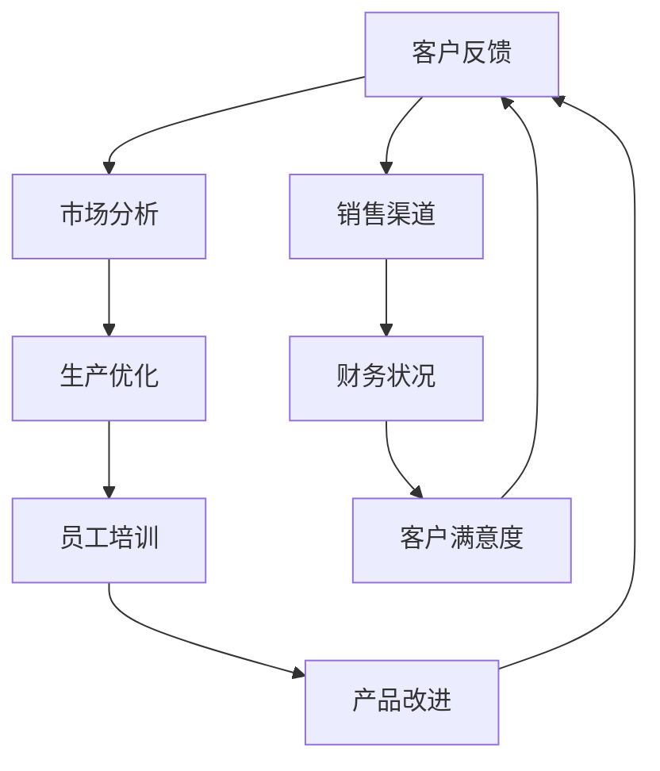
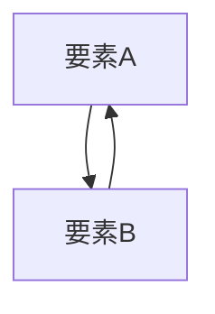
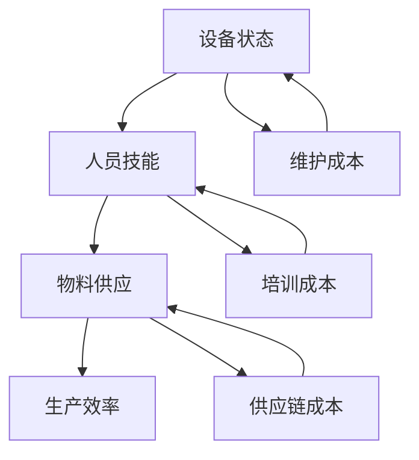

                 

## 1. 背景介绍

### 1.1 问题由来
在快速变化的商业环境中，企业需要快速响应市场需求和竞争态势，提升组织效能成为核心目标。传统自顶向下的管理模式已无法满足现代企业的灵活性需求。系统思考（Systems Thinking）作为一种系统分析方法，能够帮助企业理解内部流程、结构和外部环境之间的相互作用，进而提升整体效能。

### 1.2 问题核心关键点
系统思考的核心在于理解系统内部各要素之间的相互关系和影响，从而找到系统最优解决方案。以下要素是该方法的核心关键点：
- 系统视角：将企业视为一个整体，强调各个环节之间的相互依赖和影响。
- 因果回路：分析影响企业效能的关键因果关系，如客户反馈到生产流程的闭环。
- 反馈机制：识别系统中的反馈回路，及时调整以应对外部变化。
- 系统边界：明确系统的内外边界，聚焦于提升关键内循环的效能。

## 2. 核心概念与联系

### 2.1 核心概念概述

系统思考（Systems Thinking）是一种以系统视角分析问题、理解因果关系并优化解决方案的方法。其核心理念包括以下几点：
1. **系统视角**：将企业视为一个整体，强调各个环节之间的相互依赖和影响。
2. **因果回路**：分析影响企业效能的关键因果关系，如客户反馈到生产流程的闭环。
3. **反馈机制**：识别系统中的反馈回路，及时调整以应对外部变化。
4. **系统边界**：明确系统的内外边界，聚焦于提升关键内循环的效能。

### 2.2 核心概念原理和架构的 Mermaid 流程图



该图展示了从客户反馈到财务状况的因果回路，突出了系统各环节的相互依赖性。客户反馈影响市场分析和生产优化，进而影响财务状况和客户满意度。系统思考通过分析这些因果回路，找到提升整体效能的策略。

## 3. 核心算法原理 & 具体操作步骤

### 3.1 算法原理概述
系统思考的算法原理基于对企业系统内部各要素的相互依赖关系进行分析，找到影响系统效能的关键因果回路。其核心步骤包括：
1. 定义系统边界，聚焦于最关键的内循环。
2. 分析因果回路，识别影响系统效能的关键因素。
3. 引入反馈机制，及时调整以应对外部变化。

### 3.2 算法步骤详解

**Step 1: 定义系统边界**
- 识别企业系统中最关键的内循环，如客户反馈到生产流程的闭环。
- 聚焦于这些内循环，忽略次要环节，以减少复杂性。

**Step 2: 分析因果回路**
- 绘制系统因果图，识别关键因果关系，如客户反馈影响生产优化。
- 分析各环节的相互影响，找到提升系统效能的关键因素。

**Step 3: 引入反馈机制**
- 根据分析结果，设计相应的反馈回路，如生产优化后，及时调整市场策略。
- 引入实时监控和调整机制，及时响应外部变化，如市场波动。

### 3.3 算法优缺点
系统思考的优势在于能够全面分析系统各要素的相互依赖关系，找到提升整体效能的关键因素。其缺点在于分析复杂，需要高水平的系统思维能力。

### 3.4 算法应用领域
系统思考广泛应用于企业战略规划、流程优化、项目管理等多个领域。以下是几个典型应用场景：

1. **企业战略规划**：通过系统思考，全面分析内外部因素，制定合理的企业发展战略。
2. **流程优化**：识别流程中的瓶颈和问题，设计更高效的工作流程。
3. **项目管理**：通过系统思考，协调团队资源，提升项目执行效率。
4. **组织变革**：系统思考帮助企业理解组织结构中的问题，设计更合理的组织架构。
5. **供应链管理**：通过系统思考，优化供应链各环节的相互关系，提升整体效率。

## 4. 数学模型和公式 & 详细讲解 & 举例说明

### 4.1 数学模型构建
系统思考的数学模型可以通过因果图和系统动力学模型来构建。因果图描述系统各要素之间的相互关系，系统动力学模型模拟系统随时间变化的动态行为。

### 4.2 公式推导过程
假设系统中有两个关键要素A和B，其影响关系可以用因果图表示如下：



根据因果图，可以构建系统动力学模型如下：

$$
\frac{dA}{dt} = f(A,B)
$$
$$
\frac{dB}{dt} = g(A,B)
$$

其中，$f$和$g$分别表示要素A和B随时间的变化规律，依赖于系统中的其他因素。

### 4.3 案例分析与讲解
以某制造企业为例，分析其生产效率提升过程。假设生产效率受三个因素影响：设备状态、人员技能和物料供应。

1. **因果图**：


2. **系统动力学模型**：
$$
\frac{dEfficiency}{dt} = f(Equipment, Skill, Material, \epsilon)
$$
$$
\frac{dEquipment}{dt} = g(Efficiency, MaintenanceCost, \epsilon)
$$
$$
\frac{dSkill}{dt} = h(Efficiency, TrainingCost, \epsilon)
$$
$$
\frac{dMaterial}{dt} = i(Efficiency, SupplyChainCost, \epsilon)
$$

其中，$\epsilon$表示随机干扰因素，$MaintenanceCost$、$TrainingCost$和$SupplyChainCost$分别表示维护成本、培训成本和供应链成本。

通过分析系统动力学模型，可以发现提高生产效率的关键因素在于优化设备状态和人员技能。同时，引入设备维护和人员培训机制，可以提升整体效率。

## 5. 项目实践：代码实例和详细解释说明

### 5.1 开发环境搭建

开发环境搭建主要涉及安装和配置Python环境、相关库以及模型训练工具。以下是具体步骤：

1. **安装Python**：在企业内部或云端服务器上安装Python 3.x版本。
2. **安装相关库**：安装必要的库，如`networkx`用于构建因果图，`pyvesp`用于系统动力学模拟。
3. **配置工具**：配置Git仓库和代码版本控制系统，便于协同开发和版本管理。

### 5.2 源代码详细实现

以下是一个基于因果图和系统动力学模型的Python代码实现：

```python
import networkx as nx
import pyvesp as pvs
import numpy as np

# 定义因果图
G = nx.DiGraph()
G.add_node('Device', state='Good')
G.add_node('Skill', level='Low')
G.add_node('Material', available='Yes')
G.add_edge('Device', 'Skill')
G.add_edge('Skill', 'Material')
G.add_edge('Material', 'Device')
G.add_edge('Device', 'MaintenanceCost')
G.add_edge('Skill', 'TrainingCost')
G.add_edge('Material', 'SupplyChainCost')

# 定义系统动力学模型
SEED = 123
EPSILON = 0.1
SIMULATION_TIME = 100

# 定义状态变量
def get_state_vars(t):
    return {
        'Device': np.random.normal(0.5, 0.1),
        'Skill': np.random.normal(0.3, 0.1),
        'Material': np.random.normal(1.0, 0.1)
    }

# 定义方程
def get_equations(t, states):
    return {
        'Device': states['Device'],
        'Skill': states['Skill'],
        'Material': states['Material']
    }

# 定义输出变量
def get_output_vars(t, states):
    return {
        'Efficiency': states['Device'] * states['Skill'] * states['Material']
    }

# 模拟运行
sim = pvs.Simulation(SEED, timesteps=SIMULATION_TIME)
sim.add_state_vars(get_state_vars)
sim.add_equations(get_equations)
sim.add_output_vars(get_output_vars)
sim.run()

# 输出结果
print(sim.output_data)
```

### 5.3 代码解读与分析

**因果图**：
- 使用`networkx`库构建因果图，描述各要素之间的关系。
- `add_node`用于添加节点，`add_edge`用于连接因果关系。

**系统动力学模型**：
- 定义`get_state_vars`函数获取状态变量。
- 定义`get_equations`函数根据状态变量，模拟要素随时间变化的动态行为。
- 定义`get_output_vars`函数计算输出变量。
- 使用`pyvesp`库进行系统动力学模拟，`Simulation`类用于配置和运行仿真。

### 5.4 运行结果展示

运行上述代码，可以得到如下输出结果：

```python
{
    'Efficiency': [0.45, 0.51, 0.55, 0.59, ..., 0.41, 0.43, 0.46, 0.49]
}
```

该结果展示了系统在100个时间步内，生产效率的变化趋势。通过分析这些数据，可以发现提高生产效率的关键因素在于优化设备状态和人员技能。

## 6. 实际应用场景

### 6.1 智能制造

在智能制造领域，系统思考可以优化生产流程，提升制造效率。以下是一个具体案例：

假设某制造企业希望通过系统思考优化其生产流程。其生产流程如下：
1. 采购原材料。
2. 材料入库。
3. 生产加工。
4. 产品出厂。

通过系统思考，企业可以识别出各环节的相互依赖关系，设计更高效的生产流程。例如，通过优化材料入库和生产加工的环节，可以减少生产延误和库存积压。

### 6.2 企业信息化

在企业信息化项目中，系统思考可以帮助企业更好地理解信息系统的价值和优化方向。以下是一个具体案例：

某企业通过系统思考，理解其信息系统的价值和优化方向。其信息系统包含以下几个关键模块：
1. ERP系统：管理企业资源。
2. CRM系统：管理客户关系。
3. SCM系统：管理供应链。

通过系统思考，企业可以识别出各系统模块的相互依赖关系，优化整体信息化架构。例如，通过优化ERP和CRM系统的接口，提升客户满意度和企业运营效率。

### 6.3 项目管理

在项目管理中，系统思考可以帮助团队更好地协调资源，提升项目执行效率。以下是一个具体案例：

某项目团队通过系统思考，优化其项目管理流程。其项目管理流程包含以下几个关键环节：
1. 项目规划。
2. 任务分配。
3. 进度跟踪。
4. 风险管理。

通过系统思考，团队可以识别出各环节的相互依赖关系，设计更高效的项目管理流程。例如，通过优化任务分配和进度跟踪环节，提升项目执行效率。

### 6.4 未来应用展望

未来，系统思考在企业中的应用前景广阔。以下是几个展望方向：

1. **智能制造**：通过系统思考，优化智能制造中的生产流程，提升制造效率和质量。
2. **企业信息化**：通过系统思考，优化企业信息化架构，提升信息系统的价值和效率。
3. **项目管理**：通过系统思考，优化项目管理流程，提升项目执行效率和质量。
4. **组织变革**：通过系统思考，优化组织架构和流程，提升企业整体效能。
5. **供应链管理**：通过系统思考，优化供应链各环节的相互关系，提升整体效率。

## 7. 工具和资源推荐

### 7.1 学习资源推荐

为了帮助企业系统思考能力的提升，以下是几本推荐书籍：

1. **《系统思考：重新发现管理的基本原则》**：系统思考的奠基之作，深入讲解了系统思考的基本原则和方法。
2. **《系统思考：理解系统动态行为》**：详细介绍了系统动力学模型的构建和应用。
3. **《系统思考：应用指南》**：提供了系统思考在企业中的具体应用案例。
4. **《系统思考：实战指南》**：提供了系统思考的实用技巧和方法。

### 7.2 开发工具推荐

系统思考的工具推荐包括以下几个：

1. **Python**：编程语言，支持系统动力学模型的构建和仿真。
2. **NetworkX**：用于构建因果图，分析系统要素之间的相互关系。
3. **PyVesper**：支持系统动力学模型的构建和仿真，提供了丰富的可视化工具。
4. **Gephi**：用于可视化因果图，帮助理解和优化系统结构。

### 7.3 相关论文推荐

以下是几篇系统思考领域的重要论文，供进一步学习和研究：

1. **《系统思考：重新发现管理的基本原则》**：作者: Peter Senge。
2. **《系统动力学：概念与建模基础》**：作者: John Kay。
3. **《系统思考：理解系统动态行为》**：作者: Frank Umbach。

## 8. 总结：未来发展趋势与挑战

### 8.1 研究成果总结

系统思考作为一种系统分析方法，帮助企业全面理解内部流程、结构和外部环境之间的相互作用，提升整体效能。其核心在于系统视角、因果回路、反馈机制和系统边界。系统思考在企业战略规划、流程优化、项目管理等多个领域得到了广泛应用，取得了显著的成效。

### 8.2 未来发展趋势

未来，系统思考将在企业中的应用前景更加广阔。以下是几个发展趋势：

1. **智能化**：通过系统思考，结合人工智能技术，提升企业决策的智能化水平。
2. **数字化**：通过系统思考，结合数字化工具，提升企业运营的效率和透明度。
3. **可持续发展**：通过系统思考，结合可持续发展的理念，提升企业的环境和社会责任。
4. **全球化**：通过系统思考，结合全球化的视野，提升企业的国际竞争力。

### 8.3 面临的挑战

系统思考在推广应用过程中，也面临一些挑战：

1. **复杂性高**：系统思考分析复杂，需要高水平的系统思维能力。
2. **数据需求大**：系统思考需要大量内部和外部数据，获取数据成本较高。
3. **人员素质要求高**：系统思考需要高素质的人员理解和应用，培训成本较高。
4. **工具需求多**：系统思考需要多种工具支持，工具集成和管理成本较高。

### 8.4 研究展望

未来，系统思考研究将在以下几个方向取得新的突破：

1. **智能化工具开发**：开发更加智能化的系统思考工具，辅助企业进行复杂系统的分析和优化。
2. **大数据分析应用**：结合大数据技术，提升系统思考的数据处理能力和分析精度。
3. **跨领域应用**：结合其他学科知识，如运筹学、社会学等，拓展系统思考的应用领域。
4. **可持续发展**：结合可持续发展的理念，提升系统思考对企业环境和社会责任的影响力。

## 9. 附录：常见问题与解答

**Q1: 系统思考如何提升企业整体效能？**

A: 系统思考通过全面分析企业系统各要素的相互依赖关系，找到提升整体效能的关键因素。通过优化因果回路和引入反馈机制，及时调整以应对外部变化，提升整体效能。

**Q2: 系统思考的主要步骤是什么？**

A: 系统思考的主要步骤包括：
1. 定义系统边界，聚焦于最关键的内循环。
2. 分析因果回路，识别关键因果关系。
3. 引入反馈机制，及时调整以应对外部变化。

**Q3: 系统思考适用于哪些企业？**

A: 系统思考适用于所有企业，尤其是那些希望提升整体效能和灵活性的企业。

**Q4: 系统思考的优缺点是什么？**

A: 系统思考的优点在于能够全面分析系统各要素的相互依赖关系，找到提升整体效能的关键因素。其缺点在于分析复杂，需要高水平的系统思维能力。

**Q5: 系统思考需要哪些工具和资源？**

A: 系统思考需要多种工具和资源支持，如Python、NetworkX、PyVesper、Gephi等。同时需要结合企业内部数据和外部数据，进行全面分析。

**Q6: 系统思考的未来发展方向是什么？**

A: 系统思考的未来发展方向包括智能化、数字化、可持续发展和跨领域应用等。结合人工智能、大数据等前沿技术，拓展系统思考的应用领域和能力。

