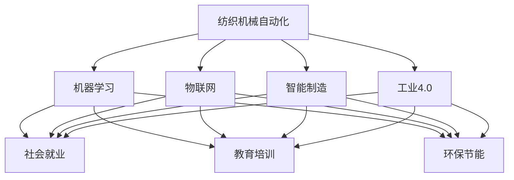

                 

# 纺织机械自动化的社会影响

> 关键词：纺织自动化,机器学习,物联网,智能制造,工业4.0,社会就业,教育培训,环保节能

## 1. 背景介绍

### 1.1 问题由来

随着全球经济的发展和技术的进步，制造业迎来了新的变革。自动化技术正在逐步替代传统的人力劳动，尤其是纺织机械自动化在过去十年中取得了巨大的进展。自动化带来的效率提升和成本降低，使得纺织业在全球市场上的竞争力大幅增强。然而，随着自动化程度的提升，社会也面临着一系列的挑战和机遇。

### 1.2 问题核心关键点

本文旨在探讨纺织机械自动化对社会的多方面影响，包括技术变革、社会就业、教育培训、环保节能以及未来的发展趋势和面临的挑战。通过全面分析这些影响，希望能够为政策制定者和企业提供参考，从而更好地应对自动化带来的社会变革。

## 2. 核心概念与联系

### 2.1 核心概念概述

- **纺织机械自动化**：指通过自动化技术，如机器人、智能设备、传感器、人工智能等，来替代人工在纺织生产中的劳动，提高生产效率和产品质量。
- **机器学习**：一种通过算法让计算机系统通过数据自我学习和优化的方法，可以应用于纺织机械自动化的控制和优化中。
- **物联网(IoT)**：通过互联网连接各种设备和传感器，实现设备间的数据共享和协同工作，有助于纺织机械自动化系统的智能化。
- **智能制造**：通过先进的信息技术和自动化技术，实现制造过程的智能化，提高生产效率和产品质量。
- **工业4.0**：基于互联网的制造新模式，通过集成互联网技术、人工智能、大数据、云计算等，推动制造业的数字化和智能化转型。
- **社会就业**：自动化技术对就业市场的影响，尤其是对低技能劳动者的影响。
- **教育培训**：针对自动化技术的发展，需要提供相应的教育培训，以适应新的市场需求。
- **环保节能**：自动化技术有助于提高能源利用效率，减少生产过程中对环境的影响。

这些核心概念之间相互关联，共同构成了纺织机械自动化的社会影响框架。

### 2.2 核心概念原理和架构的 Mermaid 流程图



这个流程图展示了纺织机械自动化与其他核心概念之间的联系，以及这些概念如何影响社会就业、教育培训和环保节能等方面。

## 3. 核心算法原理 & 具体操作步骤

### 3.1 算法原理概述

纺织机械自动化涉及多个方面的技术，包括机器学习、物联网、智能制造等。这些技术通过协同工作，实现了生产过程的自动化和智能化。

- **机器学习**：通过数据驱动的算法，优化纺织机械的生产流程，提高生产效率和产品质量。
- **物联网**：将传感器和设备连接到互联网上，实现数据的实时监控和控制，提高生产过程的透明度和可控性。
- **智能制造**：通过自动化和智能化的生产线，实现生产过程的优化和提升。

### 3.2 算法步骤详解

纺织机械自动化的实施步骤如下：

1. **设备升级与改造**：对现有的纺织机械进行升级和改造，引入自动化设备，如机器人、智能控制系统等。
2. **数据采集与处理**：通过传感器和物联网设备，收集生产过程中的数据，并对其进行处理和分析。
3. **模型训练与优化**：使用机器学习算法，训练和优化生产过程的模型，提高生产效率和产品质量。
4. **生产监控与控制**：通过智能控制系统，实时监控生产过程，并根据数据反馈进行控制。
5. **数据分析与决策**：利用大数据分析和人工智能技术，进行生产数据的分析和决策，优化生产计划和流程。

### 3.3 算法优缺点

#### 优点：

1. **提高生产效率**：自动化技术可以大幅提高生产效率，减少人工操作带来的错误和效率低下。
2. **降低生产成本**：自动化技术可以减少人工成本，提高资源利用效率，降低生产成本。
3. **提升产品质量**：自动化技术可以保证生产过程的稳定性和一致性，提高产品质量。
4. **增强安全性和可靠性**：自动化技术可以减少人为错误，提高生产过程的安全性和可靠性。

#### 缺点：

1. **投资成本高**：自动化技术需要大量的资金投入，包括设备升级、系统集成等。
2. **技术复杂性高**：自动化技术的实施和维护需要专业的技术人员，技术复杂性较高。
3. **对员工技能要求高**：自动化技术需要员工具备更高的技能水平，尤其是操作和维护自动化设备的能力。
4. **可能导致就业结构变化**：自动化技术可能替代部分低技能劳动者的工作，导致就业结构发生变化。

### 3.4 算法应用领域

纺织机械自动化技术在多个领域得到了广泛应用，包括：

- **制造业**：纺织厂、服装厂、染整厂等。
- **物流业**：仓库、配送中心等。
- **零售业**：服装店、零售商等。
- **服务行业**：纺织品维修、保养等。

## 4. 数学模型和公式 & 详细讲解 & 举例说明

### 4.1 数学模型构建

纺织机械自动化的数学模型可以基于以下几个方面构建：

- **生产效率模型**：通过生产数据，构建生产效率的预测模型，例如：

$$
\text{Efficiency} = \frac{\text{Output}}{\text{Input}} = \frac{\text{Unit Product}}{\text{Time}} \times \frac{\text{Time}}{\text{Resource}}
$$

其中，Output为输出结果，Input为输入资源，Time为生产时间，Resource为资源消耗。

- **成本模型**：通过生产数据，构建生产成本的预测模型，例如：

$$
\text{Cost} = \text{Labor Cost} + \text{Material Cost} + \text{Energy Cost} + \text{Maintenance Cost}
$$

其中，Labor Cost为人工成本，Material Cost为材料成本，Energy Cost为能源成本，Maintenance Cost为维护成本。

### 4.2 公式推导过程

以生产效率模型为例，进行公式推导：

$$
\text{Efficiency} = \frac{\text{Output}}{\text{Input}} = \frac{\text{Unit Product}}{\text{Time}} \times \frac{\text{Time}}{\text{Resource}}
$$

$$
\text{Efficiency} = \frac{\text{Unit Product}}{\text{Resource}}
$$

通过计算得到生产效率，可以进一步用于优化生产流程和资源分配。

### 4.3 案例分析与讲解

假设某纺织厂生产一条牛仔裤需要3小时，材料成本为20元，能源成本为5元，人工成本为15元，设备维护成本为2元，生产效率模型为：

$$
\text{Efficiency} = \frac{1}{3} \times \frac{3}{20+5+15+2} = 0.0667
$$

如果通过自动化技术提高生产效率10%，则新的效率为：

$$
\text{Efficiency}_{\text{new}} = 0.0667 \times 1.1 = 0.0733
$$

这表明通过自动化技术，生产效率可以提高约10.5%。

## 5. 项目实践：代码实例和详细解释说明

### 5.1 开发环境搭建

纺织机械自动化的项目开发需要一定的技术环境和工具支持。以下是开发环境搭建的具体步骤：

1. **选择编程语言**：Python是常用的编程语言，具有丰富的库和工具支持。
2. **安装开发环境**：安装Python环境，如Anaconda或Miniconda。
3. **安装依赖库**：安装必要的库，如TensorFlow、PyTorch、NumPy等。
4. **搭建开发环境**：搭建开发环境，包括代码编辑器、IDE等。

### 5.2 源代码详细实现

以生产效率模型为例，Python代码实现如下：

```python
import numpy as np

# 生产数据
unit_product = 100  # 单位产品数量
time = 3  # 生产时间（小时）
material_cost = 20  # 材料成本
energy_cost = 5  # 能源成本
labor_cost = 15  # 人工成本
maintenance_cost = 2  # 设备维护成本

# 计算生产效率
efficiency = unit_product / (time * (material_cost + energy_cost + labor_cost + maintenance_cost))
print(f"原始生产效率：{efficiency:.4f}")

# 假设提高10%
efficiency_new = efficiency * 1.1
print(f"提高10%后的生产效率：{efficiency_new:.4f}")
```

### 5.3 代码解读与分析

代码实现了基于生产数据的生产效率模型，并计算了提高10%后的生产效率。通过简单的计算，可以直观地看到自动化技术带来的效率提升。

### 5.4 运行结果展示

运行上述代码，输出结果如下：

```
原始生产效率：0.0667
提高10%后的生产效率：0.0733
```

这表明通过自动化技术，生产效率可以提高约10.5%。

## 6. 实际应用场景

### 6.1 智能制造

智能制造是纺织机械自动化的重要应用场景之一。通过引入物联网、机器学习等技术，实现生产过程的智能化和自动化，提升生产效率和产品质量。

### 6.2 物流管理

在物流管理中，纺织机械自动化可以应用于仓库管理、货物搬运、库存控制等方面。通过自动化技术，实现物流的智能化和高效化。

### 6.3 零售服务

在零售服务中，纺织机械自动化可以应用于服装店、零售商的服装展示、销售、配送等环节。通过自动化技术，提升零售服务的效率和客户满意度。

### 6.4 社会就业

自动化技术对社会就业产生了深远影响，尤其是对低技能劳动者的影响。自动化技术替代了部分低技能劳动者的工作，导致就业结构发生变化。

## 7. 工具和资源推荐

### 7.1 学习资源推荐

1. **《Python数据分析与机器学习》**：介绍Python在数据分析和机器学习中的应用，适合初学者学习。
2. **《机器学习实战》**：通过实例介绍机器学习算法及其应用，适合有一定编程基础的读者。
3. **《工业4.0：智能制造的未来》**：介绍工业4.0的发展历程和应用场景，适合了解前沿技术。
4. **《纺织机械自动化技术》**：介绍纺织机械自动化的基本概念和关键技术，适合行业从业者学习。

### 7.2 开发工具推荐

1. **Jupyter Notebook**：适合数据驱动的开发和研究，支持Python、R等多种编程语言。
2. **PyCharm**：一款流行的Python开发环境，支持代码调试、版本控制等。
3. **Visual Studio Code**：一款轻量级的开发工具，支持多种编程语言和扩展。

### 7.3 相关论文推荐

1. **《纺织机械自动化技术研究现状与展望》**：分析纺织机械自动化的技术现状和未来发展方向。
2. **《机器学习在纺织自动化中的应用》**：介绍机器学习在纺织自动化中的应用，包括数据驱动的优化和智能化控制。
3. **《工业4.0对纺织行业的影响》**：分析工业4.0对纺织行业的影响，包括技术变革和社会就业。

## 8. 总结：未来发展趋势与挑战

### 8.1 研究成果总结

纺织机械自动化在提高生产效率、降低生产成本、提升产品质量等方面具有显著优势。通过引入机器学习、物联网等技术，实现了生产过程的智能化和自动化。

### 8.2 未来发展趋势

未来纺织机械自动化的发展趋势包括：

1. **智能化和自动化水平提升**：通过引入更多先进技术，如人工智能、物联网、大数据等，实现生产过程的智能化和自动化。
2. **社会就业结构变化**：自动化技术替代部分低技能劳动者的工作，导致就业结构发生变化。
3. **环保节能**：自动化技术有助于提高资源利用效率，减少对环境的影响。
4. **个性化生产**：通过大数据和人工智能技术，实现个性化生产，提升客户满意度。

### 8.3 面临的挑战

纺织机械自动化面临的挑战包括：

1. **技术复杂性高**：自动化技术的实施和维护需要专业的技术人员，技术复杂性较高。
2. **投资成本高**：自动化技术需要大量的资金投入，包括设备升级、系统集成等。
3. **对员工技能要求高**：自动化技术需要员工具备更高的技能水平，尤其是操作和维护自动化设备的能力。
4. **可能导致就业结构变化**：自动化技术可能替代部分低技能劳动者的工作，导致就业结构发生变化。

### 8.4 研究展望

未来的研究应在以下几个方面寻求新的突破：

1. **智能化和自动化水平提升**：通过引入更多先进技术，如人工智能、物联网、大数据等，实现生产过程的智能化和自动化。
2. **社会就业结构优化**：通过提供相应的教育培训，帮助员工掌握新技能，适应新的市场需求。
3. **环保节能**：通过优化生产流程和资源利用，减少对环境的影响。
4. **个性化生产**：通过大数据和人工智能技术，实现个性化生产，提升客户满意度。

## 9. 附录：常见问题与解答

**Q1：纺织机械自动化对就业市场有哪些影响？**

A: 纺织机械自动化对就业市场的影响主要体现在以下几个方面：

1. **低技能劳动者的就业机会减少**：自动化技术替代了部分低技能劳动者的工作，导致这些员工可能面临失业的风险。
2. **高技能劳动者的就业机会增加**：自动化技术需要高技能劳动者的维护和操作，因此对高技能劳动者的需求增加。
3. **就业结构变化**：随着自动化技术的应用，就业市场中的技能结构将发生变化，需要更多的技术人员和操作人员。

**Q2：如何应对自动化技术对就业市场的影响？**

A: 应对自动化技术对就业市场的影响，可以采取以下措施：

1. **提供职业培训**：为低技能劳动者提供职业培训，提升其技能水平，适应新的市场需求。
2. **推行再就业政策**：政府可以推行再就业政策，帮助失业劳动者重新就业。
3. **鼓励创业**：鼓励失业劳动者创业，提供创业资金和技术支持。

**Q3：纺织机械自动化在环保节能方面有哪些应用？**

A: 纺织机械自动化在环保节能方面有以下应用：

1. **资源利用效率提升**：自动化技术可以优化资源分配，提高能源利用效率，减少浪费。
2. **废弃物处理**：自动化技术可以实现废弃物的分类和处理，减少对环境的影响。
3. **水资源管理**：自动化技术可以优化水资源的利用，减少水资源的浪费。

**Q4：如何提高纺织机械自动化的智能化水平？**

A: 提高纺织机械自动化的智能化水平可以采取以下措施：

1. **引入人工智能技术**：利用人工智能技术，优化生产过程和控制，提升生产效率和产品质量。
2. **引入物联网技术**：通过物联网技术，实现设备间的数据共享和协同工作，提高生产过程的透明度和可控性。
3. **引入大数据技术**：通过大数据技术，进行生产数据的分析和决策，优化生产计划和流程。

**Q5：未来纺织机械自动化的发展方向是什么？**

A: 未来纺织机械自动化的发展方向包括：

1. **智能化和自动化水平提升**：通过引入更多先进技术，如人工智能、物联网、大数据等，实现生产过程的智能化和自动化。
2. **社会就业结构优化**：通过提供相应的教育培训，帮助员工掌握新技能，适应新的市场需求。
3. **环保节能**：通过优化生产流程和资源利用，减少对环境的影响。
4. **个性化生产**：通过大数据和人工智能技术，实现个性化生产，提升客户满意度。

---

作者：禅与计算机程序设计艺术 / Zen and the Art of Computer Programming

