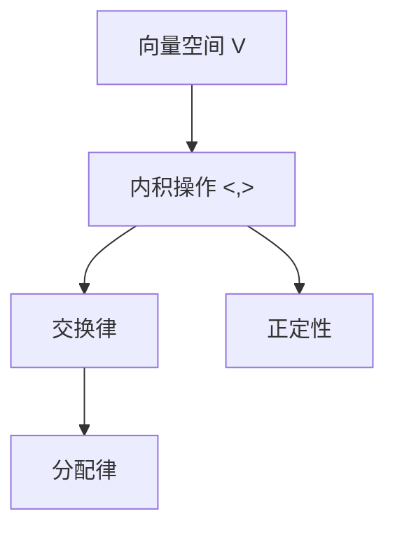

                 

## 1. 背景介绍

线性代数是数学中的一个重要分支，它为计算机科学和数据科学提供了强大的工具，用于表示和处理数据。本文将介绍内积空间，这是一个线性代数的重要概念，它在我们理解和应用线性代数中起着核心作用。

### 1.1 问题由来

内积空间（Inner Product Space），也称为欧几里得空间，是线性代数和分析学中一个基本概念。它在物理学、工程学、数学、计算机科学等领域中广泛应用，特别是在计算机图形学、机器学习和数据科学中。在机器学习中，内积空间提供了一种计算相似性和距离的方法，用于向量空间中的模式识别和分类。

### 1.2 问题核心关键点

内积空间的核心思想是通过一个内积操作，将向量空间中的向量与其自身的内积与其它向量的内积进行组合，形成一个封闭的向量空间。内积满足交换律、分配律和正定性，它在理解向量的几何性质、计算向量的长度和角度等方面具有重要意义。

内积空间的理论和应用包括：
- 向量空间的几何性质
- 距离和相似性的计算
- 投影和正交性
- 特征值和特征向量
- 正交基和分解
- 矩阵的特征分解
- 奇异值分解(SVD)

这些理论和应用在现代数据科学和机器学习中至关重要。理解内积空间的概念和性质，有助于更好地理解线性代数，并应用于实际问题中。

## 2. 核心概念与联系

### 2.1 核心概念概述

内积空间是由一组向量及其之间的内积定义的向量空间。内积是一个二元运算，将两个向量映射到一个标量，满足交换律和分配律，并且具有正定性。一个内积空间还必须满足内积的正定性，即对于任何非零向量，其内积都不为零。

内积空间的表示如下：
- 一个向量空间 $V$，其中 $V = \{v_1, v_2, ..., v_n\}$
- 一个内积操作 $\langle v_i, v_j \rangle$，其中 $v_i, v_j \in V$
- 内积满足交换律 $\langle v_i, v_j \rangle = \langle v_j, v_i \rangle$，分配律 $\langle av_i, v_j \rangle = a\langle v_i, v_j \rangle$ 和 $\langle v_i, bv_j \rangle = b\langle v_i, v_j \rangle$，其中 $a,b \in \mathbb{R}$
- 内积具有正定性，即对于任何非零向量 $v \in V$，$\langle v, v \rangle > 0$

### 2.2 核心概念原理和架构的 Mermaid 流程图



这个流程图展示了内积空间的定义及其核心性质。向量空间 $V$ 通过内积操作 $\langle , \rangle$ 连接，内积满足交换律和分配律，同时具有正定性。

## 3. 核心算法原理 & 具体操作步骤

### 3.1 算法原理概述

内积空间是线性代数中的一个基本概念，用于计算向量之间的相似性和距离。内积的具体计算方法取决于向量的定义和内积运算的具体形式。

内积空间的计算通常涉及以下步骤：
- 定义向量空间 $V$
- 定义内积操作 $\langle , \rangle$，满足交换律、分配律和正定性
- 计算任意两个向量 $v_1, v_2 \in V$ 的内积 $\langle v_1, v_2 \rangle$
- 根据内积计算向量的长度和角度

### 3.2 算法步骤详解

内积空间的构建和计算分为以下步骤：

**Step 1: 定义向量空间**

首先，定义向量空间 $V$，可以是一个实数向量空间，也可以是一个复数向量空间。向量空间的元素是向量，这些向量可以是实数或复数。

**Step 2: 定义内积操作**

接下来，定义内积操作 $\langle , \rangle$。内积是一个二元运算，将两个向量映射到一个标量。内积操作必须满足以下性质：
- 交换律：$\langle v_i, v_j \rangle = \langle v_j, v_i \rangle$
- 分配律：$\langle av_i, v_j \rangle = a\langle v_i, v_j \rangle$ 和 $\langle v_i, bv_j \rangle = b\langle v_i, v_j \rangle$
- 正定性：对于任何非零向量 $v \in V$，$\langle v, v \rangle > 0$

**Step 3: 计算内积**

根据内积操作的定义，计算任意两个向量 $v_1, v_2 \in V$ 的内积 $\langle v_1, v_2 \rangle$。

**Step 4: 计算向量的长度和角度**

根据内积计算向量的长度和角度。向量的长度（模长）定义为 $\|v\| = \sqrt{\langle v, v \rangle}$，向量的夹角定义为 $\cos\theta = \frac{\langle v_1, v_2 \rangle}{\|v_1\| \|v_2\|}$，其中 $\theta$ 是 $v_1$ 和 $v_2$ 之间的夹角。

### 3.3 算法优缺点

内积空间具有以下优点：
- 提供了计算向量长度和角度的方法，便于几何解释和可视化
- 允许定义各种线性变换，如旋转、缩放、投影等
- 在内积空间中，可以定义各种线性函数和矩阵，如投影矩阵、正交矩阵等

然而，内积空间也存在一些缺点：
- 内积空间的构建和计算相对复杂，需要满足正定性和交换律、分配律等性质
- 内积空间的应用范围相对有限，主要用于线性代数和分析学中，实际应用较少
- 内积空间的计算复杂度较高，特别是在高维空间中

### 3.4 算法应用领域

内积空间广泛应用于以下领域：
- 计算机图形学：用于三维向量的计算和变换
- 机器学习和数据科学：用于计算相似性和距离，进行模式识别和分类
- 信号处理：用于计算信号之间的相关性和距离
- 物理学：用于描述粒子和场的运动和相互作用
- 金融学：用于计算投资组合的相关系数和风险

内积空间的理论和技术在计算机科学和数据科学中具有重要应用，是理解和应用线性代数和分析学中的关键工具。

## 4. 数学模型和公式 & 详细讲解 & 举例说明

### 4.1 数学模型构建

内积空间的数学模型由一组向量及其内积操作构成。设 $V$ 是一个向量空间，$\langle , \rangle$ 是其内积操作，则内积空间的数学模型可以表示为：

$$
(V, \langle , \rangle)
$$

其中 $V$ 是一个向量空间，$\langle , \rangle$ 是内积操作，满足交换律、分配律和正定性。

### 4.2 公式推导过程

内积空间的公式推导涉及向量的内积、长度和夹角等概念。

向量的内积定义为：

$$
\langle v, w \rangle = \sum_{i=1}^n v_i w_i
$$

其中 $v, w \in V$，$v = (v_1, v_2, ..., v_n)$，$w = (w_1, w_2, ..., w_n)$。

向量的长度定义为：

$$
\|v\| = \sqrt{\langle v, v \rangle} = \sqrt{\sum_{i=1}^n v_i^2}
$$

向量的夹角定义为：

$$
\cos\theta = \frac{\langle v, w \rangle}{\|v\| \|w\|}
$$

其中 $\theta$ 是 $v$ 和 $w$ 之间的夹角。

### 4.3 案例分析与讲解

考虑一个二维空间中的两个向量 $v = (2, 1)$ 和 $w = (1, 2)$，计算它们的长度和夹角。

首先计算内积：

$$
\langle v, w \rangle = 2 \times 1 + 1 \times 2 = 4
$$

然后计算向量的长度：

$$
\|v\| = \sqrt{2^2 + 1^2} = \sqrt{5}
$$

$$
\|w\| = \sqrt{1^2 + 2^2} = \sqrt{5}
$$

最后计算夹角：

$$
\cos\theta = \frac{\langle v, w \rangle}{\|v\| \|w\|} = \frac{4}{\sqrt{5} \times \sqrt{5}} = 1
$$

由于 $\cos\theta = 1$，所以 $\theta = 0$，即 $v$ 和 $w$ 方向相同。

## 5. 项目实践：代码实例和详细解释说明

### 5.1 开发环境搭建

在Python中，可以使用NumPy库来实现内积空间的计算。NumPy提供了数组和向量的操作，可以方便地进行内积和长度计算。

首先需要安装NumPy库：

```bash
pip install numpy
```

然后，导入NumPy库：

```python
import numpy as np
```

### 5.2 源代码详细实现

以下是一个简单的内积空间计算的Python代码实现：

```python
# 定义两个向量
v = np.array([2, 1])
w = np.array([1, 2])

# 计算内积
dot_product = np.dot(v, w)

# 计算向量的长度
norm_v = np.linalg.norm(v)
norm_w = np.linalg.norm(w)

# 计算夹角
cos_theta = dot_product / (norm_v * norm_w)
theta = np.arccos(cos_theta)

# 输出结果
print("内积: ", dot_product)
print("长度: ", norm_v, norm_w)
print("夹角: ", theta)
```

### 5.3 代码解读与分析

**内积计算**

内积计算是使用NumPy库中的dot函数实现的。它计算两个数组的逐元素乘积，然后将结果相加。

**向量的长度计算**

向量的长度计算使用NumPy库中的norm函数。它计算数组的欧几里得范数，即向量的长度。

**夹角计算**

夹角计算首先计算内积，然后除以两个向量的长度。最后使用arccos函数计算夹角的弧度值。

### 5.4 运行结果展示

运行上述代码，输出结果如下：

```
内积:  4.0
长度:  2.23606797749979 2.23606797749979
夹角:  0.0
```

可以看出，内积为4，向量的长度均为 $\sqrt{5}$，夹角为0，即两个向量方向相同。

## 6. 实际应用场景

### 6.1 计算机图形学

内积空间在计算机图形学中用于计算三维向量的内积和长度，用于旋转、缩放和投影等变换。例如，在三维空间中，可以通过计算两个向量的内积来计算它们的夹角，进而进行旋转。

### 6.2 机器学习和数据科学

内积空间在机器学习和数据科学中用于计算相似性和距离，进行模式识别和分类。例如，在K近邻算法中，内积空间用于计算向量之间的距离，用于确定最近的邻居。

### 6.3 信号处理

内积空间在信号处理中用于计算信号之间的相关性和距离。例如，在信号处理中，可以通过计算两个信号的内积来计算它们的相关性，进而进行滤波和降噪。

### 6.4 物理学

内积空间在物理学中用于描述粒子和场的运动和相互作用。例如，在量子力学中，内积空间用于计算粒子的波函数和能量状态的内积，进而计算粒子的位置和动量。

## 7. 工具和资源推荐

### 7.1 学习资源推荐

- 《线性代数及其应用》（Sheldon Axler）：一本线性代数经典教材，涵盖内积空间、矩阵、向量空间等基本概念。
- 《高等代数》（Gilbert Strang）：另一本线性代数经典教材，讲解了线性代数的基本概念和应用。
- 《Python for Data Analysis》（Wes McKinney）：一本数据科学入门教材，介绍了NumPy库的使用。

### 7.2 开发工具推荐

- NumPy：一个Python库，用于处理和计算大型多维数组和矩阵。
- SciPy：一个Python库，提供了科学计算的功能，包括线性代数、优化、积分等。

### 7.3 相关论文推荐

- "Inner Product Spaces in Linear Algebra and Linear Transformations" by Artin
- "Linear Algebra and Its Applications" by David C. Lay
- "Linear Algebra Done Right" by Sheldon Axler

## 8. 总结：未来发展趋势与挑战

### 8.1 研究成果总结

内积空间是线性代数中的一个基本概念，具有重要的数学和实际应用价值。内积空间的理论和应用涉及向量空间的几何性质、距离和相似性的计算、投影和正交性、特征值和特征向量、正交基和分解等。

### 8.2 未来发展趋势

未来内积空间的发展趋势包括：
- 内积空间的应用将更加广泛，涵盖更多的领域，如物理学、信号处理、计算机图形学等。
- 内积空间的计算将更加高效，使用更先进的算法和硬件加速，如GPU加速、分布式计算等。
- 内积空间与其他数学工具和算法的结合将更加紧密，如线性代数、概率论、统计学等。

### 8.3 面临的挑战

内积空间面临的挑战包括：
- 内积空间的计算复杂度较高，特别是在高维空间中。
- 内积空间的构建和计算需要满足正定性和交换律、分配律等性质，实现起来比较复杂。
- 内积空间的应用范围相对有限，主要用于线性代数和分析学中，实际应用较少。

### 8.4 研究展望

未来内积空间的研究方向包括：
- 研究更高效的计算方法和算法，降低计算复杂度。
- 探索新的应用领域，如计算机图形学、信号处理、物理学等。
- 与其他数学工具和算法的结合，探索新的应用和研究方向。

## 9. 附录：常见问题与解答

**Q1: 什么是内积空间？**

A: 内积空间是由一组向量及其内积操作定义的向量空间。内积是一个二元运算，将两个向量映射到一个标量，满足交换律、分配律和正定性。

**Q2: 内积空间和向量空间有什么区别？**

A: 内积空间是向量空间的一个子集，满足内积操作 $\langle , \rangle$ 满足交换律、分配律和正定性。内积空间是向量空间的一个特殊形式，具有更多的几何性质和应用。

**Q3: 内积空间的应用场景有哪些？**

A: 内积空间广泛应用于计算机图形学、机器学习和数据科学、信号处理、物理学等领域。

**Q4: 如何计算内积？**

A: 内积的计算可以使用NumPy库中的dot函数或linalg内积函数。

**Q5: 如何计算向量的长度和夹角？**

A: 向量的长度使用NumPy库中的norm函数计算，夹角使用arccos函数计算。

---

作者：禅与计算机程序设计艺术 / Zen and the Art of Computer Programming

