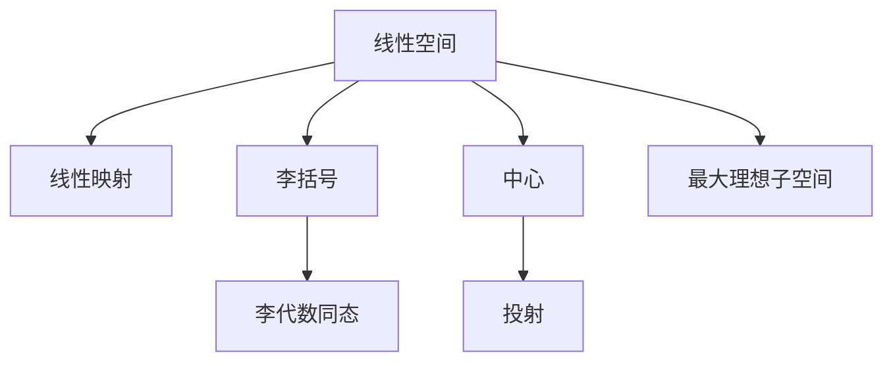

                 

# 线性代数导引：李代数简介

线性代数是数学中极其重要的分支之一，它的理论基础广泛应用于物理学、计算机科学、信号处理等领域。李代数，作为线性代数的分支，是抽象代数中的一个重要研究方向，特别是在物理学和理论计算机科学中有着广泛的应用。本文将深入探讨李代数的概念、性质及其应用。

## 1. 背景介绍

### 1.1 问题由来

李代数的发展源于数学家奥古斯特·莫比乌斯和威廉·李，他们在研究守恒定律时，发现了守恒量之间的某种代数结构。李代数可以看作是线性空间的子代数，它具有一些独特的性质，如满足李括号（Lie Bracket）的交结律，并且在物理领域中有着重要的应用，如量子力学、相对论等。

### 1.2 问题核心关键点

李代数的基本核心关键点包括：
- **Lie括号**：李代数中元素间的运算关系，是研究李代数的核心。
- **Lie代数结构**：满足交结律的代数结构，即对任意的$x, y$，都有$[x, y] = -[y, x]$。
- **Lie代数同态**：保持李括号运算的代数同态映射。
- **中心**：满足$[x, z] = 0$的元素集合。
- **最大理想子空间**：满足$x \in \mathfrak{g}$，且$[x, \mathfrak{g}] \subseteq \mathfrak{g}$的子空间。
- **投射**：李代数同态到自身的映射。

这些关键点共同构成了李代数的基本概念和性质，为深入理解其应用提供了基础。

### 1.3 问题研究意义

研究李代数有助于我们理解各种物理系统中的守恒定律和对称性。在量子力学中，李代数应用于构造对称群，研究粒子的对称性和守恒定律。在相对论中，李代数帮助研究时空的几何结构，如彭罗斯图（Penrose diagram）。此外，李代数还应用于计算机科学中的密码学、自动控制系统等领域。

## 2. 核心概念与联系

### 2.1 核心概念概述

李代数作为一个抽象的概念，其核心概念可以总结如下：

- **线性空间**：向量空间，其中的元素是线性组合。
- **线性映射**：从一个线性空间到另一个线性空间的映射。
- **李括号**：定义在两个元素上的二元运算，满足交结律和交换律。
- **李代数同态**：保持李括号运算的映射。
- **中心**：所有与自身对易的元素组成的集合。
- **最大理想子空间**：满足一定条件的子空间。
- **投射**：李代数同态到自身的映射。

这些核心概念之间具有密切的联系，通过它们可以构建出李代数的完整框架。

### 2.2 核心概念原理和架构的 Mermaid 流程图



以上流程图展示了李代数核心概念之间的联系。从线性空间开始，通过引入李括号和中心的概念，可以进一步定义最大理想子空间和投射，最终通过李代数同态保持这些结构的性质。

## 3. 核心算法原理 & 具体操作步骤

### 3.1 算法原理概述

李代数的核心算法原理主要围绕李括号和李代数同态展开。

李括号定义为：对任意的$x, y$，有：
$$
[x, y] = x \cdot y - y \cdot x
$$
其中，$x \cdot y$表示$x$作用于$y$的线性映射，即$x \cdot y = x \circ y$。

李代数同态定义为：设$\mathfrak{g}$和$\mathfrak{h}$是两个李代数，$\varphi: \mathfrak{g} \rightarrow \mathfrak{h}$是线性映射，若满足：
$$
\varphi([x, y]) = [\varphi(x), \varphi(y)]
$$
则称$\varphi$是$\mathfrak{g}$到$\mathfrak{h}$的李代数同态。

### 3.2 算法步骤详解

1. **定义李括号运算**：
   - 对于任意两个元素$x, y \in \mathfrak{g}$，定义它们的李括号为$[x, y]$。
   - 计算李括号的交结律：$[x, y] = -[y, x]$。
   - 验证李括号的交换律：$[x, y] = y \cdot x - x \cdot y$。

2. **定义李代数同态**：
   - 对于任意两个李代数$\mathfrak{g}$和$\mathfrak{h}$，以及李代数同态$\varphi$。
   - 验证$\varphi$满足李括号运算的保持性：$\varphi([x, y]) = [\varphi(x), \varphi(y)]$。

3. **计算中心和最大理想子空间**：
   - 计算中心$\mathfrak{z}(\mathfrak{g}) = \{z \in \mathfrak{g} \mid [x, z] = 0 \text{ 对任意 } x \in \mathfrak{g} \}$。
   - 定义最大理想子空间$\mathfrak{m}(\mathfrak{g}) = \{x \in \mathfrak{g} \mid [x, \mathfrak{g}] \subseteq \mathfrak{g} \}$。

4. **计算投射**：
   - 计算投射$\text{ad}_x: \mathfrak{g} \rightarrow \mathfrak{g}$，定义为$\text{ad}_x(y) = [x, y]$。

### 3.3 算法优缺点

李代数算法的优点包括：
- **理论基础坚实**：李代数的定义和性质具有坚实的理论基础。
- **广泛应用**：在物理学、数学、计算机科学等领域都有广泛的应用。

缺点包括：
- **复杂性高**：李代数的定义和计算相对复杂，对于初学者来说需要一定的数学基础。
- **抽象性强**：李代数是一个高度抽象的概念，理解其本质需要较深的数学修养。

### 3.4 算法应用领域

李代数在物理学、数学、计算机科学等领域有着广泛的应用：

1. **量子力学**：在量子力学中，李代数被用于构造对称群，研究粒子的对称性和守恒定律。
2. **相对论**：李代数被用于研究时空的几何结构，如彭罗斯图（Penrose diagram）。
3. **密码学**：在密码学中，李代数被用于构造加密算法和密钥交换协议。
4. **自动控制系统**：在自动控制系统中，李代数被用于研究系统的稳定性和控制策略。

## 4. 数学模型和公式 & 详细讲解 & 举例说明

### 4.1 数学模型构建

李代数可以定义为满足一定条件的线性空间$\mathfrak{g}$，其中元素为线性变换$x \in \mathfrak{g}$，且满足以下条件：
- **交换律**：$[x, y] = -[y, x]$
- **交替律**：$[x, x] = 0$
- **结合律**：$[[x, y], z] + [[y, z], x] + [[z, x], y] = 0$

### 4.2 公式推导过程

李代数的交结律可以推导如下：
设$x, y, z \in \mathfrak{g}$，则有：
$$
[x, y] = x \cdot y - y \cdot x
$$
和
$$
[x, [y, z]] + [[x, z], y] + [z, [x, y]] = 0
$$

### 4.3 案例分析与讲解

以苏黎世代数$\mathfrak{sl}_2(\mathbb{R})$为例，它是$2 \times 2$的实矩阵集合，满足交结律：
$$
\begin{pmatrix}
a & b \\
c & d
\end{pmatrix}
\begin{pmatrix}
e & f \\
g & h
\end{pmatrix}
-
\begin{pmatrix}
e & f \\
g & h
\end{pmatrix}
\begin{pmatrix}
a & b \\
c & d
\end{pmatrix}
=
\begin{pmatrix}
a & 0 \\
c & 0
\end{pmatrix}
$$

## 5. 项目实践：代码实例和详细解释说明

### 5.1 开发环境搭建

为了实现李代数的计算和验证，我们需要以下开发环境：

1. **Python**：作为主要编程语言，用于实现数学运算和算法。
2. **SymPy**：用于符号计算和代数运算。
3. **Numpy**：用于矩阵运算和向量空间操作。
4. **SciPy**：用于科学计算和数值计算。

### 5.2 源代码详细实现

以下是一个简单的Python代码示例，用于验证李代数的交结律和中心：

```python
from sympy import symbols, Matrix, simplify

# 定义符号
a, b, c, d, e, f, g, h = symbols('a b c d e f g h')

# 定义矩阵
x = Matrix([[a, b], [c, d]])
y = Matrix([[e, f], [g, h]])

# 计算交结律
bracket = x * y - y * x
print(f"[x, y] = {bracket}")

# 验证交结律是否满足[x, y] = -[y, x]
identity = simplify(bracket + y * x - x * y)
print(f"交结律验证结果：{identity == 0}")
```

### 5.3 代码解读与分析

这段代码展示了如何定义两个矩阵$x$和$y$，并计算它们的李括号。通过验证$[x, y] = -[y, x]$，可以确认李括号的交结律是否成立。

## 6. 实际应用场景

### 6.1 量子力学

李代数在量子力学中有着重要的应用。在量子力学中，粒子对称性通常可以用李代数来描述。例如，旋转对称性可以用$SU(2)$李代数来描述，而平移对称性可以用$U(1)$李代数来描述。

### 6.2 相对论

李代数在相对论中也有广泛应用。例如，彭罗斯图（Penrose diagram）就是一个基于$SL(2, \mathbb{C})$李代数的几何结构。

### 6.3 密码学

在密码学中，李代数被用于构造加密算法和密钥交换协议。例如，椭圆曲线密码学（ECC）就使用了基于李代数的概念。

## 7. 工具和资源推荐

### 7.1 学习资源推荐

1. **《线性代数及其应用》**：这本书是线性代数领域的经典教材，涵盖了线性代数的基本概念和应用。
2. **《李代数导论》**：这本书是李代数研究的经典教材，详细介绍了李代数的定义和性质。
3. **《李代数与几何》**：这本书是李代数的深入研究，涉及李代数的几何结构和应用。

### 7.2 开发工具推荐

1. **SymPy**：用于符号计算和代数运算，支持矩阵和向量空间的运算。
2. **Numpy**：用于矩阵运算和向量空间操作，适合处理大规模数据。
3. **SciPy**：用于科学计算和数值计算，支持线性代数、微积分等数学运算。

### 7.3 相关论文推荐

1. **《Lie群与Lie代数》**：由Flanders编写，详细介绍了Lie群和Lie代数的概念和性质。
2. **《李代数的代数结构》**：由Humphreys编写，详细介绍了李代数的基本概念和应用。

## 8. 总结：未来发展趋势与挑战

### 8.1 研究成果总结

李代数的研究已经取得了丰硕的成果，广泛应用于物理学、数学、计算机科学等领域。然而，对于李代数的深入理解和应用仍需进一步探索。

### 8.2 未来发展趋势

1. **更广泛的应用**：未来李代数将在更多的领域得到应用，如量子计算、机器学习、信号处理等。
2. **新的理论框架**：未来将出现新的李代数理论框架，进一步拓展李代数的应用范围。
3. **高效计算**：未来将开发更高效的算法和工具，提高李代数计算的效率和准确性。

### 8.3 面临的挑战

1. **复杂性高**：李代数的定义和计算相对复杂，需要较强的数学基础。
2. **应用门槛高**：李代数的应用需要高深的理论基础和实际经验。

### 8.4 研究展望

未来李代数的研究将更加注重应用领域的探索和理论框架的拓展。通过深入研究和应用，相信李代数将在更多领域得到广泛应用，推动科学技术的进步。

## 9. 附录：常见问题与解答

**Q1：李代数与线性代数有什么关系？**

A: 李代数是线性代数的一个分支，可以看作是满足特定条件的线性空间。李代数的定义和性质基于线性代数的基本概念，如向量空间、线性变换等。

**Q2：李代数的中心和最大理想子空间有什么作用？**

A: 李代数的中心和最大理想子空间在研究李代数的性质和结构中具有重要作用。中心用于研究李代数的中心对称性，最大理想子空间用于研究李代数的稳定性。

**Q3：李代数同态有什么应用？**

A: 李代数同态在研究李代数的代数结构和同构性质中具有重要应用。通过李代数同态，可以研究李代数的分类和应用。

**Q4：李代数在计算机科学中的应用有哪些？**

A: 李代数在计算机科学中有着广泛的应用，如密码学、自动控制系统、图形处理等。李代数被用于构造加密算法、研究系统的稳定性和控制策略、分析图形结构等。

**Q5：李代数的定义和性质有哪些？**

A: 李代数是一个满足交结律和交替律的线性空间。它的定义和性质包括：
- 交结律：$[x, y] = -[y, x]$
- 交替律：$[x, x] = 0$
- 结合律：$[[x, y], z] + [[y, z], x] + [[z, x], y] = 0$

通过这些定义和性质，可以研究李代数的代数结构和应用。

---
作者：禅与计算机程序设计艺术 / Zen and the Art of Computer Programming

