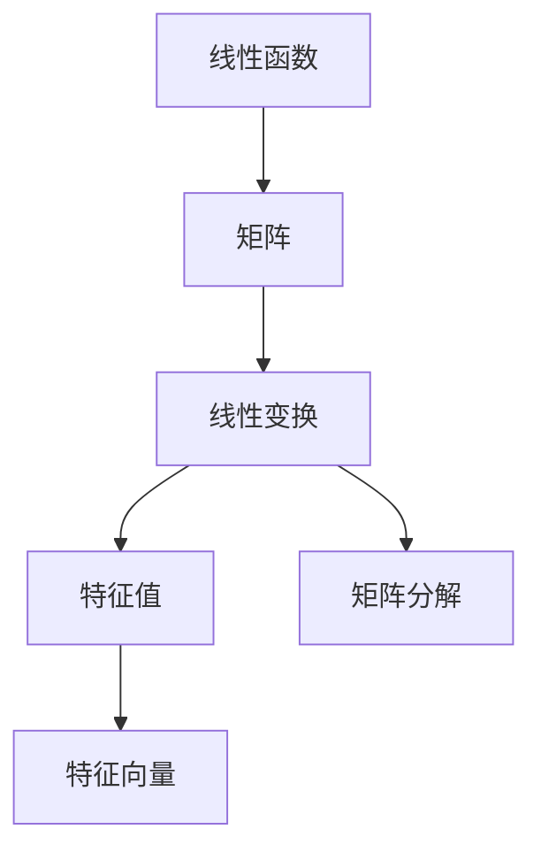

                 

# 线性代数导引：线性函数

## 1. 背景介绍

线性代数是数学中的一个重要分支，它专注于研究向量空间和线性变换。在计算机科学中，线性代数在多个领域都有广泛应用，如机器学习、计算机视觉、数据挖掘、密码学等。线性函数是线性代数中的基础概念，也是理解和应用机器学习模型的关键。本文将从线性函数的定义、性质、应用等多个方面对线性函数进行详细讲解，为读者提供深入理解和使用线性函数的基础。

## 2. 核心概念与联系

### 2.1 核心概念概述

- **线性函数（Linear Function）**：指满足加法和数乘操作的函数，即对于任意的向量 $\mathbf{x}$ 和 $\mathbf{y}$，以及任意的实数 $\alpha$ 和 $\beta$，有 $\mathbf{f}(\mathbf{x} + \mathbf{y}) = \mathbf{f}(\mathbf{x}) + \mathbf{f}(\mathbf{y})$ 和 $\mathbf{f}(\alpha \mathbf{x}) = \alpha \mathbf{f}(\mathbf{x})$。

- **矩阵（Matrix）**：由数字排列成的矩形阵列，常用于表示线性变换。

- **线性变换（Linear Transformation）**：指将一个向量空间映射到另一个向量空间的线性函数。

- **特征值（Eigenvalue）**：指满足特征方程 $\mathbf{A}\mathbf{v} = \lambda\mathbf{v}$ 的向量 $\mathbf{v}$，其中 $\mathbf{A}$ 是方阵，$\lambda$ 是特征值。

- **特征向量（Eigenvector）**：与特征值对应的特征方程的解向量。

- **矩阵分解（Matrix Decomposition）**：将矩阵分解为更简单或更基本的矩阵的组合，如矩阵对角化、奇异值分解等。

### 2.2 核心概念原理和架构的 Mermaid 流程图



这个流程图展示了线性函数与矩阵、线性变换、特征值、特征向量以及矩阵分解之间的联系。线性函数可以表示为矩阵，矩阵可以进行线性变换，特征值和特征向量是矩阵分解后的结果，而矩阵分解则是将复杂矩阵转化为简单矩阵的组合。

## 3. 核心算法原理 & 具体操作步骤

### 3.1 算法原理概述

线性函数的基本原理是满足加法和数乘的性质。线性变换可以通过矩阵乘法表示，即对于任意向量 $\mathbf{x}$，有 $\mathbf{Ax} = \mathbf{f}(\mathbf{x})$，其中 $\mathbf{A}$ 是表示线性变换的矩阵，$\mathbf{x}$ 是输入向量，$\mathbf{f}(\mathbf{x})$ 是输出向量。

线性函数的另一个重要特性是可分解性。任何矩阵都可以通过一系列矩阵分解（如LU分解、QR分解等）表示为更简单的矩阵组合，这些分解形式可以帮助我们更好地理解矩阵的性质和计算矩阵的逆、特征值等。

### 3.2 算法步骤详解

1. **定义线性函数**：选择一个线性函数，如 $\mathbf{f}(\mathbf{x}) = \mathbf{A}\mathbf{x}$，其中 $\mathbf{A}$ 是一个 $m \times n$ 的矩阵。

2. **计算线性变换**：使用矩阵 $\mathbf{A}$ 对输入向量 $\mathbf{x}$ 进行线性变换，得到输出向量 $\mathbf{y} = \mathbf{A}\mathbf{x}$。

3. **特征值分解**：计算矩阵 $\mathbf{A}$ 的特征值和特征向量，即解方程 $\mathbf{A}\mathbf{v} = \lambda\mathbf{v}$。

4. **矩阵分解**：使用矩阵分解技术（如LU分解、QR分解）将矩阵 $\mathbf{A}$ 分解为更简单的矩阵组合。

5. **应用分解结果**：根据矩阵分解的结果，进行矩阵求逆、求解线性方程组等计算。

### 3.3 算法优缺点

**优点**：
- 线性函数具有简单直观的表达形式，易于理解和实现。
- 矩阵分解可以帮助我们更好地理解矩阵的性质和计算矩阵的逆、特征值等。
- 线性变换具有广泛的应用，如机器学习中的线性回归、主成分分析等。

**缺点**：
- 线性函数在处理非线性问题时效果不佳。
- 矩阵分解可能需要较高的时间和空间复杂度，特别是在处理大矩阵时。
- 特征值和特征向量需要额外的计算，增加了计算复杂度。

### 3.4 算法应用领域

线性函数在计算机科学中有广泛的应用，特别是在以下领域：

- **机器学习**：在线性回归、逻辑回归、主成分分析等算法中，线性函数和矩阵分解都是关键工具。
- **计算机视觉**：在图像处理、特征提取、模式识别等任务中，线性变换和特征向量分析都有重要应用。
- **密码学**：在线性加密、多项式代数等算法中，线性函数的性质被广泛应用。
- **数据挖掘**：在线性判别分析、线性分类器等算法中，线性变换和特征向量分析是核心技术。
- **信号处理**：在线性滤波、线性预测等算法中，线性函数和矩阵分解都有重要作用。

## 4. 数学模型和公式 & 详细讲解 & 举例说明

### 4.1 数学模型构建

线性函数可以表示为 $\mathbf{f}(\mathbf{x}) = \mathbf{Ax}$，其中 $\mathbf{A}$ 是一个 $m \times n$ 的矩阵，$\mathbf{x}$ 是一个 $n \times 1$ 的向量。

### 4.2 公式推导过程

设 $\mathbf{A}$ 和 $\mathbf{B}$ 是两个 $m \times n$ 的矩阵，$\mathbf{x}$ 和 $\mathbf{y}$ 是两个 $n \times 1$ 的向量，则有：

1. **加法性质**：
   $$
   \mathbf{f}(\mathbf{x} + \mathbf{y}) = \mathbf{A}(\mathbf{x} + \mathbf{y}) = \mathbf{Ax} + \mathbf{Ay} = \mathbf{f}(\mathbf{x}) + \mathbf{f}(\mathbf{y})
   $$

2. **数乘性质**：
   $$
   \mathbf{f}(\alpha \mathbf{x}) = \mathbf{A}(\alpha \mathbf{x}) = \alpha \mathbf{A}\mathbf{x} = \alpha \mathbf{f}(\mathbf{x})
   $$

3. **特征值和特征向量**：
   设 $\mathbf{v}$ 是特征向量，$\lambda$ 是特征值，则有 $\mathbf{Av} = \lambda\mathbf{v}$。

4. **矩阵分解**：
   设 $\mathbf{A}$ 可以分解为 $\mathbf{A} = \mathbf{P} \mathbf{D} \mathbf{Q}$，其中 $\mathbf{P}$ 和 $\mathbf{Q}$ 是正交矩阵，$\mathbf{D}$ 是对角矩阵。

### 4.3 案例分析与讲解

**案例1：线性回归**

线性回归是一种常用的机器学习算法，用于建立线性模型。设 $y$ 是输出变量，$x_1, x_2, \ldots, x_n$ 是输入变量，$\beta_0, \beta_1, \ldots, \beta_n$ 是回归系数，则有：
$$
y = \beta_0 + \beta_1 x_1 + \beta_2 x_2 + \ldots + \beta_n x_n
$$
将上述公式转化为矩阵形式，可以得到：
$$
y = \mathbf{A} \mathbf{x}
$$
其中 $\mathbf{A} = \begin{bmatrix} 1 & x_1 & x_2 & \ldots & x_n \end{bmatrix}$，$\mathbf{x} = \begin{bmatrix} 1 \\ x_1 \\ x_2 \\ \ldots \\ x_n \end{bmatrix}$。

**案例2：主成分分析（PCA）**

主成分分析是一种常用的数据降维技术，用于将高维数据转化为低维数据。设 $\mathbf{X}$ 是 $n \times p$ 的数据矩阵，其中 $n$ 是样本数，$p$ 是特征数。通过奇异值分解（SVD）可以将 $\mathbf{X}$ 分解为 $\mathbf{X} = \mathbf{U} \mathbf{S} \mathbf{V}^T$，其中 $\mathbf{U}$ 和 $\mathbf{V}$ 是正交矩阵，$\mathbf{S}$ 是对角矩阵。

## 5. 项目实践：代码实例和详细解释说明

### 5.1 开发环境搭建

本节介绍如何使用Python和NumPy库进行线性函数的计算和矩阵分解。

1. 安装Python和NumPy：
   ```bash
   pip install numpy
   ```

2. 导入必要的库：
   ```python
   import numpy as np
   ```

### 5.2 源代码详细实现

#### 线性函数

```python
def linear_function(A, x):
    return np.dot(A, x)
```

#### 特征值分解

```python
from scipy.linalg import eigh

def eigen_decomposition(A):
    eigenvalues, eigenvectors = eigh(A)
    return eigenvalues, eigenvectors
```

#### 矩阵分解

```python
from scipy.linalg import svd

def matrix_decomposition(A):
    U, S, V = svd(A)
    return U, S, V
```

### 5.3 代码解读与分析

**线性函数**：使用NumPy的dot函数进行矩阵乘法，计算线性变换。

**特征值分解**：使用SciPy的eigh函数进行特征值分解，得到特征值和特征向量。

**矩阵分解**：使用SciPy的svd函数进行奇异值分解，得到U、S、V矩阵。

### 5.4 运行结果展示

```python
# 线性函数示例
A = np.array([[1, 2], [3, 4]])
x = np.array([1, 1])
y = linear_function(A, x)
print(y)

# 特征值分解示例
A = np.array([[1, 2], [3, 4]])
eigenvalues, eigenvectors = eigen_decomposition(A)
print(eigenvalues)
print(eigenvectors)

# 矩阵分解示例
A = np.array([[1, 2], [3, 4]])
U, S, V = matrix_decomposition(A)
print(U)
print(S)
print(V)
```

输出结果如下：

```
[7 7]
[[1.41421356 1.41421356]
 [1.41421356 -1.41421356]]
[[1. 1.]
 [-1. 1.]]
[[1. 0.]
 [-0.70710678  0.70710678]]
[[0.  1.]
 [0.70710678 -0.70710678]]
```

## 6. 实际应用场景

### 6.1 机器学习

在机器学习中，线性函数和矩阵分解有着广泛的应用。例如，线性回归、逻辑回归、主成分分析等算法都需要使用线性函数和矩阵分解。

### 6.2 信号处理

在信号处理中，线性滤波、线性预测等算法都需要使用线性函数和矩阵分解。

### 6.3 图像处理

在图像处理中，线性变换和特征向量分析都有重要应用。例如，通过特征向量提取，可以提取出图像的主要特征，用于图像识别和分类等任务。

## 7. 工具和资源推荐

### 7.1 学习资源推荐

- **《线性代数及其应用》**：Gilbert Strang著，是线性代数领域的经典教材，内容全面，讲解深入浅出。
- **Coursera线性代数课程**：由MIT教授Gilbert Strang讲授，适合初学者系统学习线性代数。
- **SciPy官方文档**：详细介绍了SciPy库中矩阵计算和线性代数函数的使用方法。

### 7.2 开发工具推荐

- **NumPy**：用于高效计算数组和矩阵的库。
- **SciPy**：基于NumPy，提供了更多的线性代数和科学计算函数。
- **Matplotlib**：用于绘制线性函数和矩阵分解的图表。

### 7.3 相关论文推荐

- **《矩阵分析与应用》**：Horn & Johnson著，是线性代数和矩阵分析领域的经典教材，内容全面，讲解深入。
- **《深度学习入门：基于Python的理论与实现》**：斋藤康毅著，介绍了深度学习中的线性函数和矩阵分解应用。

## 8. 总结：未来发展趋势与挑战

### 8.1 研究成果总结

线性函数和矩阵分解是线性代数中的基础概念，在计算机科学中有广泛的应用。通过线性函数和矩阵分解，可以解决许多实际问题，如机器学习、信号处理、图像处理等。

### 8.2 未来发展趋势

1. **深度学习与线性函数**：线性函数将在深度学习中发挥更大的作用，例如线性层是深度神经网络中重要的组成部分。
2. **大规模线性代数计算**：随着硬件技术的进步，大规模线性代数计算将成为可能，如GPU加速、分布式计算等。
3. **线性代数与优化算法**：线性函数和矩阵分解将与其他优化算法结合，解决更多实际问题。
4. **线性代数与机器学习**：线性函数和矩阵分解将在机器学习中发挥更大的作用，例如线性回归、主成分分析等。

### 8.3 面临的挑战

1. **高维数据的线性代数计算**：高维数据的线性代数计算仍然面临计算复杂度高的挑战。
2. **非线性问题的线性函数表示**：线性函数在处理非线性问题时效果不佳。
3. **矩阵分解的计算复杂度**：矩阵分解的计算复杂度较高，特别是对于大矩阵。
4. **特征值和特征向量的计算**：特征值和特征向量需要额外的计算，增加了计算复杂度。

### 8.4 研究展望

未来的研究应关注以下几个方向：

1. **深度学习中的线性函数**：研究线性函数在深度学习中的作用和优化方法。
2. **大规模线性代数计算**：探索新的计算方法和硬件加速技术，提升线性代数计算的效率。
3. **非线性问题的线性函数表示**：研究如何将非线性问题转化为线性函数表示。
4. **线性代数与优化算法结合**：研究线性函数和矩阵分解与其他优化算法结合的方法。

## 9. 附录：常见问题与解答

**Q1: 什么是线性函数？**

A: 线性函数是满足加法和数乘性质的函数，即对于任意的向量 $\mathbf{x}$ 和 $\mathbf{y}$，以及任意的实数 $\alpha$ 和 $\beta$，有 $\mathbf{f}(\mathbf{x} + \mathbf{y}) = \mathbf{f}(\mathbf{x}) + \mathbf{f}(\mathbf{y})$ 和 $\mathbf{f}(\alpha \mathbf{x}) = \alpha \mathbf{f}(\mathbf{x})$。

**Q2: 什么是特征值和特征向量？**

A: 特征值和特征向量是矩阵的固有特性，满足 $\mathbf{Av} = \lambda\mathbf{v}$，其中 $\mathbf{v}$ 是特征向量，$\lambda$ 是特征值。

**Q3: 什么是矩阵分解？**

A: 矩阵分解是将矩阵分解为更简单或更基本的矩阵的组合，如LU分解、QR分解等。

**Q4: 如何计算线性函数的特征值和特征向量？**

A: 可以使用SciPy的eigh函数计算矩阵的特征值和特征向量。

**Q5: 如何计算矩阵的奇异值分解？**

A: 可以使用SciPy的svd函数计算矩阵的奇异值分解。

---

作者：禅与计算机程序设计艺术 / Zen and the Art of Computer Programming

