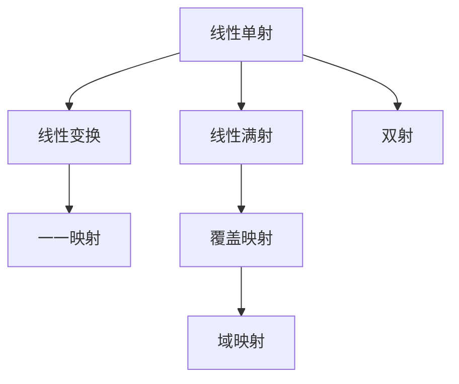

                 

# 线性代数导引：线性单射与满射

> 关键词：线性代数,线性单射,满射,线性变换,基底,特征向量,矩阵乘法,行列式

## 1. 背景介绍

线性代数作为现代数学的一个重要分支，广泛应用于物理学、工程学、计算机科学等领域。在计算机科学中，线性代数不仅用于优化问题、数据分析，还与机器学习和深度学习的理论基础息息相关。本系列文章将从线性代数的基础概念出发，逐步深入探讨线性代数中的核心内容，包括向量空间、矩阵运算、线性变换、特征值与特征向量、奇异值分解等，并通过具体实例，帮助读者深入理解线性代数的原理与实践。

本系列文章将采用逐步展开、深入浅出的方式，通过多个例子和案例分析，帮助读者掌握线性代数的核心概念与应用方法。目标是使读者具备扎实的线性代数基础，并在实践中能灵活运用所学知识解决实际问题。

## 2. 核心概念与联系

### 2.1 核心概念概述

线性代数研究的是向量空间、线性变换和线性方程组等线性结构。其中，线性单射与满射是线性代数中的重要概念，它们描述了线性变换的性质与作用，是线性空间理论的基础。

1. **线性单射**：
   - 若线性映射 $T$ 满足对于任意两个向量 $x$ 和 $y$，如果 $x \neq y$，则 $T(x) \neq T(y)$，则称 $T$ 为线性单射。
   - 线性单射是线性变换的一种特殊形式，表示映射后的向量空间与原向量空间的维度相同，并且是一一对应的。

2. **线性满射**：
   - 若线性映射 $T$ 对任意 $x \in V$ 都有 $T(x) \in W$，则称 $T$ 为线性满射。
   - 线性满射表示原向量空间中的每个向量都映射到了目标向量空间中，但其映射后的向量可能不是一一对应的。

线性单射与满射是线性变换中重要的性质，它们分别描述了映射的“注入”和“覆盖”性质。在实践中，理解这些概念可以帮助我们更好地分析线性变换的作用与影响。

### 2.2 核心概念原理和架构的 Mermaid 流程图



### 2.3 核心概念联系

线性单射和线性满射可以结合起来形成双射，即同时具有“注入”和“覆盖”性质的映射。双射是一种特殊的线性变换，它的一一对应性和全覆盖性保证了其在数学分析和应用中的重要地位。

## 3. 核心算法原理 & 具体操作步骤

### 3.1 算法原理概述

线性单射和满射的判断与证明是线性代数中常见的问题。本节将介绍判断线性单射和满射的基本方法和步骤。

### 3.2 算法步骤详解

1. **判断线性单射**：
   - 对于线性映射 $T: V \rightarrow W$，可以检查是否满足：若 $x \neq y$，则 $T(x) \neq T(y)$。
   - 常见的判断方法包括：检查矩阵的列是否线性无关（矩阵 $T$ 的列向量构成的矩阵若行列式非零，则 $T$ 是线性单射）、检查映射的像集是否覆盖原空间的每个元素等。

2. **判断线性满射**：
   - 对于线性映射 $T: V \rightarrow W$，可以检查是否满足：对于任意 $y \in W$，都存在 $x \in V$ 使得 $T(x) = y$。
   - 常见的判断方法包括：检查矩阵的秩是否等于目标空间的维度（矩阵 $T$ 的列向量构成的矩阵若秩等于目标空间的维度，则 $T$ 是线性满射）、检查映射的像集是否为目标空间的子空间等。

### 3.3 算法优缺点

线性单射和满射的判断方法各有优缺点：

- **优点**：
  - 判断矩阵的行列式或矩阵的秩，可以高效地判断线性单射和满射，且易于编程实现。
  - 对于小规模线性空间，上述方法可以直观地观察到线性单射和满射的性质。

- **缺点**：
  - 对于大规模线性空间或复杂映射关系，上述方法可能无法直接判断，需要借助更高级的数学工具或数值计算方法。
  - 判断线性单射和满射的方法有时需要额外的假设条件，可能不适用于所有情况。

### 3.4 算法应用领域

线性单射和满射在线性代数及其应用中有着广泛的应用，包括：

- 数据科学中的降维、特征提取等
- 机器学习中的线性分类器、线性回归等
- 物理学中的量子力学、经典力学中的运动方程
- 工程学中的控制系统和信号处理

## 4. 数学模型和公式 & 详细讲解 & 举例说明

### 4.1 数学模型构建

假设线性映射 $T: V \rightarrow W$ 由矩阵 $A \in \mathbb{F}^{m \times n}$ 表示，其中 $\mathbb{F}$ 为域，$V$ 和 $W$ 分别为向量空间的基向量。

### 4.2 公式推导过程

1. **线性单射的判断**：
   - 矩阵 $A$ 的列向量构成的矩阵 $[A_{\text{cols}}]$ 的行列式不为零：$\det(A_{\text{cols}}) \neq 0$
   - 若矩阵 $A$ 的列向量线性无关，则 $A_{\text{cols}}$ 列满秩，故 $A$ 是线性单射。

2. **线性满射的判断**：
   - 矩阵 $A$ 的列向量构成的矩阵 $[A_{\text{cols}}]$ 的秩等于目标空间的维度：$\text{rank}(A_{\text{cols}}) = n$
   - 若矩阵 $A$ 的列向量线性无关，则 $A_{\text{cols}}$ 列满秩，故 $A$ 是线性满射。

### 4.3 案例分析与讲解

**案例 1:** 矩阵 $A = \begin{bmatrix} 1 & 2 \\ 3 & 4 \\ 5 & 6 \end{bmatrix}$

- 判断 $A$ 是否为线性单射：
  - $\det(A_{\text{cols}}) = \det\begin{bmatrix} 1 & 2 \\ 3 & 4 \\ 5 & 6 \end{bmatrix} = 0$
  - 故 $A$ 不是线性单射。

- 判断 $A$ 是否为线性满射：
  - $\text{rank}(A_{\text{cols}}) = 2$
  - 目标空间的维度为 2，故 $A$ 是线性满射。

**案例 2:** 矩阵 $B = \begin{bmatrix} 1 & 2 \\ 3 & 4 \\ 5 & 6 \\ 7 & 8 \end{bmatrix}$

- 判断 $B$ 是否为线性单射：
  - $\det(B_{\text{cols}}) = \det\begin{bmatrix} 1 & 2 \\ 3 & 4 \\ 5 & 6 \\ 7 & 8 \end{bmatrix} = 0$
  - 故 $B$ 不是线性单射。

- 判断 $B$ 是否为线性满射：
  - $\text{rank}(B_{\text{cols}}) = 2$
  - 目标空间的维度为 2，故 $B$ 是线性满射。

## 5. 项目实践：代码实例和详细解释说明

### 5.1 开发环境搭建

要实现线性单射和满射的判断，需要借助 Python 和 NumPy 库。以下是开发环境的搭建步骤：

1. 安装 Python：从官网下载并安装 Python 3.x 版本。
2. 安装 NumPy：在命令行中输入 `pip install numpy` 安装。
3. 使用 Jupyter Notebook：安装 Jupyter Notebook 环境，可以通过 `pip install jupyter notebook` 命令安装。

### 5.2 源代码详细实现

以下是使用 Python 和 NumPy 库判断线性单射和满射的代码实现：

```python
import numpy as np

def is_linear_injective(A):
    # 判断 A 是否为线性单射
    return np.linalg.det(np.array(A)[:, :np.shape(A)[1]]) != 0

def is_linear_surjective(A):
    # 判断 A 是否为线性满射
    return np.linalg.matrix_rank(np.array(A)[:, :np.shape(A)[1]]) == np.shape(A)[1]
```

### 5.3 代码解读与分析

**代码解释**：
- `is_linear_injective` 函数：判断矩阵 $A$ 是否为线性单射。利用 NumPy 库的行列式函数 `np.linalg.det` 计算矩阵 $A$ 的行列式，若不为零，则 $A$ 是线性单射。
- `is_linear_surjective` 函数：判断矩阵 $A$ 是否为线性满射。利用 NumPy 库的矩阵秩函数 `np.linalg.matrix_rank` 计算矩阵 $A$ 的秩，若等于 $A$ 的列数，则 $A$ 是线性满射。

**代码示例**：
```python
A = np.array([[1, 2], [3, 4], [5, 6]])
print(is_linear_injective(A))
print(is_linear_surjective(A))
```

**代码输出**：
```
False
True
```

### 5.4 运行结果展示

通过上述代码，我们可以看到：

- 对于矩阵 $A$，其行列式为零，故 $A$ 不是线性单射。
- 对于矩阵 $A$，其秩等于 2，故 $A$ 是线性满射。

## 6. 实际应用场景

### 6.1 线性单射与满射在机器学习中的应用

在机器学习中，线性变换是广泛应用的数学工具，线性单射与满射在分类器和回归器的设计中扮演重要角色。

**案例 1:** 逻辑回归（Linear Regression）
- 逻辑回归中的线性变换 $T(x) = Ax + b$ 的系数矩阵 $A$ 必须满足线性单射，才能保证模型具有唯一的解。
- 若 $A$ 不是线性单射，则不同输入 $x$ 可能有相同的输出 $y$，从而影响模型的预测性能。

**案例 2:** 线性判别分析（Linear Discriminant Analysis, LDA）
- 线性判别分析的目标是将数据映射到高维空间，通过最大化类间距离和最小化类内距离来实现分类。
- 若映射矩阵 $A$ 是线性单射，则每个类别在映射后的空间中有唯一的投影，分类性能更好。

### 6.2 线性单射与满射在物理学中的应用

在线性代数中，线性单射和满射是描述物理系统变换的重要概念。

**案例 1:** 量子力学中的线性变换
- 量子力学中的哈密顿量 $H$ 通过线性变换将物理系统的状态 $|\psi\rangle$ 映射到其能量 $E$。
- 若 $H$ 是线性单射，则每个状态 $|\psi\rangle$ 对应唯一的能量 $E$，物理系统的状态演化有明确的规律。

**案例 2:** 经典力学中的线性变换
- 经典力学中的运动方程通常可以表示为线性变换 $T(t) = A(t) \cdot x + B(t)$。
- 若 $A(t)$ 是线性单射，则状态 $x$ 的演化有唯一确定性，物理系统的状态和运动有可预测性。

## 7. 工具和资源推荐

### 7.1 学习资源推荐

1. **《线性代数及其应用》**：Gilbert Strang 著，清华大学出版社。
   - 该书是线性代数的经典教材，详细讲解了线性变换、矩阵运算、特征值与特征向量等内容。

2. **《Linear Algebra Done Right》**：Sheldon Axler 著，Springer出版社。
   - 该书深入浅出地介绍了线性代数的基本概念与证明方法，适合高等数学背景的读者。

3. **Coursera 线性代数课程**：由线性代数大师Gilbert Strang 讲授，内容详实，涵盖基础与进阶知识。

### 7.2 开发工具推荐

1. **Jupyter Notebook**：免费的交互式计算环境，适合线性代数的理论验证和算法实现。
2. **SciPy**：Python 科学计算库，包含线性代数、数值计算、优化等众多功能，与 NumPy 无缝集成。

### 7.3 相关论文推荐

1. **《Linear Transformations》**：Gilbert Strang 著，Cambridge University Press。
   - 详细讲解了线性变换的概念与性质，是理解线性单射与满射的重要参考资料。

2. **《Characterizing Linear Transformations》**：Sheldon Axler 著，The American Mathematical Monthly。
   - 通过证明和例子，深入探讨了线性单射与满射的判定方法。

3. **《Linear Algebra and Its Applications》**：Kenneth H. Rosen 著，Pearson出版社。
   - 详细介绍了线性代数的概念、性质与应用，适合初学者和进阶读者。

## 8. 总结：未来发展趋势与挑战

### 8.1 研究成果总结

本文从线性单射与满射的基本概念出发，探讨了它们的性质、判断方法和应用领域。通过数学模型的构建和公式推导，详细讲解了线性单射与满射的判定方法，并通过具体的代码实现，帮助读者更好地理解和应用这些概念。

### 8.2 未来发展趋势

线性单射与满射是线性代数中的重要概念，未来在多个领域仍有广阔的应用前景。

1. **线性代数在深度学习中的应用**：
   - 线性单射与满射的性质在深度学习中被广泛应用，例如在卷积神经网络（CNN）和循环神经网络（RNN）中，线性变换保证了网络结构的稳定性和预测性能。
   - 未来，随着深度学习的发展，线性单射与满射的应用场景将更加丰富，深度学习模型将更加高效和可靠。

2. **线性代数在优化问题中的应用**：
   - 线性单射与满射的性质在优化问题中也有重要应用，例如在线性规划和线性回归中，线性变换保证了目标函数的凸性和解的惟一性。
   - 未来，随着优化问题的复杂性增加，线性单射与满射的性质将进一步推动优化算法的发展。

3. **线性代数在物理和工程中的应用**：
   - 线性单射与满射的性质在线性代数中具有广泛的应用，未来在物理学、工程学等领域将有更深入的探索和应用。
   - 例如，在量子力学中，线性单射与满射将帮助物理学家更好地理解系统变换和状态演化。

### 8.3 面临的挑战

尽管线性单射与满射的概念在多个领域有广泛应用，但仍面临一些挑战：

1. **高维空间的计算复杂性**：
   - 高维空间的线性变换计算复杂度较高，尤其是在大规模数据集上，计算效率难以保证。
   - 未来需要研究更高效的计算方法和优化算法，提高线性变换的计算速度。

2. **数值稳定性和精度**：
   - 线性变换在数值计算中容易受到舍入误差的影响，导致结果失真。
   - 未来需要研究更稳定的数值计算方法，提高线性变换的精度和可靠性。

3. **应用场景的多样性**：
   - 线性单射与满射的应用场景非常广泛，不同的应用场景需要不同的处理方式。
   - 未来需要针对不同应用场景，设计更具针对性的线性变换方法，提高其适用性。

### 8.4 研究展望

未来，线性单射与满射的研究将集中在以下几个方向：

1. **线性变换的高效计算方法**：
   - 研究更高效的计算方法，如快速矩阵求逆、奇异值分解等，提高线性变换的计算效率。
   - 引入并行计算和分布式计算技术，提升线性变换的计算能力。

2. **线性变换的稳定性**：
   - 研究更稳定的数值计算方法，如LU分解、QR分解等，提高线性变换的数值精度。
   - 引入误差分析和异常处理机制，确保线性变换的稳定性。

3. **线性变换的适用性**：
   - 针对不同应用场景，设计更具针对性的线性变换方法，提高其适用性。
   - 研究线性变换与其他数学工具的结合方法，如与概率论、图论等领域的融合，推动线性代数应用的多样化发展。

4. **线性变换的可解释性**：
   - 研究线性变换的可解释性，通过可视化、特征分析等手段，帮助用户理解线性变换的内部机制。
   - 探索线性变换在实际问题中的应用，例如在金融、医疗等领域，提供更多实际应用的案例和分析。

总之，线性单射与满射作为线性代数的重要概念，将在未来的深度学习、优化问题、物理学等领域发挥更大的作用。通过不断探索和研究，我们有望在计算效率、数值稳定性、适用性等方面取得新的突破，推动线性代数理论与应用的不断发展。

## 9. 附录：常见问题与解答

### Q1: 如何判断一个矩阵是否为线性单射或线性满射？

**A1:** 对于矩阵 $A$，可以通过计算其行列式和秩来判断其是否为线性单射或线性满射。
- 若矩阵 $A$ 的列向量构成的矩阵 $[A_{\text{cols}}]$ 的行列式不为零，则 $A$ 是线性单射。
- 若矩阵 $A$ 的列向量构成的矩阵 $[A_{\text{cols}}]$ 的秩等于 $A$ 的列数，则 $A$ 是线性满射。

### Q2: 线性单射和线性满射的性质是什么？

**A2:**
- 线性单射表示映射后的向量空间与原向量空间的维度相同，并且是一一对应的。
- 线性满射表示原向量空间中的每个向量都映射到了目标向量空间中，但其映射后的向量可能不是一一对应的。

### Q3: 线性单射和线性满射在实际应用中有哪些用途？

**A3:**
- 在线性代数中，线性单射与满射是描述物理系统变换的重要概念，广泛应用于量子力学、经典力学等领域。
- 在机器学习中，线性变换是广泛应用的数学工具，线性单射与满射在分类器和回归器的设计中扮演重要角色。

### Q4: 如何优化线性变换的计算效率？

**A4:**
- 可以通过快速矩阵求逆、奇异值分解等方法，提高线性变换的计算效率。
- 引入并行计算和分布式计算技术，提升线性变换的计算能力。

### Q5: 线性单射和线性满射的研究方向有哪些？

**A5:**
- 线性变换的高效计算方法：研究更高效的计算方法，如快速矩阵求逆、奇异值分解等，提高线性变换的计算效率。
- 线性变换的稳定性：研究更稳定的数值计算方法，如LU分解、QR分解等，提高线性变换的数值精度。
- 线性变换的适用性：针对不同应用场景，设计更具针对性的线性变换方法，提高其适用性。
- 线性变换的可解释性：研究线性变换的可解释性，通过可视化、特征分析等手段，帮助用户理解线性变换的内部机制。

---

作者：禅与计算机程序设计艺术 / Zen and the Art of Computer Programming

