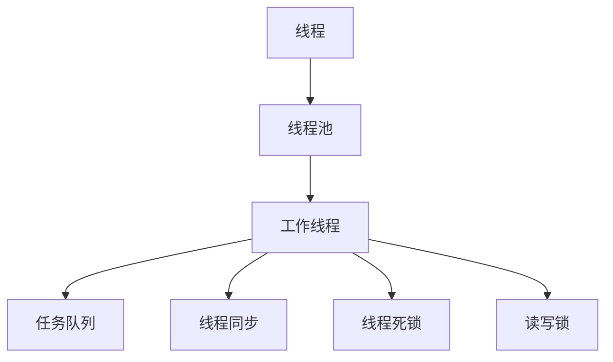

                 

## 1. 背景介绍

随着多核CPU、GPU和FPGA等硬件设备的逐渐普及，多线程编程成为提高应用程序性能的重要手段。在并发处理、图形渲染、信号处理等领域，多线程技术发挥着至关重要的作用。在高吞吐量应用中，线程管理更是决定着系统的响应速度和稳定性。

然而，线程管理并不是一件简单的事情。在多个线程并发执行时，线程间的竞争与协作、资源的管理与调度，都可能成为性能瓶颈。因此，理解和掌握高效的线程管理技术，对于开发高性能、高可扩展性的系统至关重要。

本文将深入探讨线程管理在高吞吐量应用中的原理、技术和应用，帮助读者理解线程管理的核心概念和实现细节，掌握提高系统吞吐量的有效方法。

## 2. 核心概念与联系

### 2.1 核心概念概述

在讨论线程管理之前，需要先明确几个核心概念：

- **线程（Thread）**：线程是程序执行的基本单元。每个线程都有独立的执行路径、寄存器和栈空间。

- **线程池（Thread Pool）**：线程池是一组预先创建好的线程，由一个或多个工作线程组成。通过线程池可以复用线程资源，减少线程创建和销毁的开销。

- **线程同步（Thread Synchronization）**：线程同步是指在多个线程并发执行时，通过信号量、互斥锁等机制，保证共享资源的访问安全性和一致性。

- **线程死锁（Thread Deadlock）**：线程死锁是指两个或多个线程相互等待对方释放资源，导致所有线程都无法继续执行的死循环。

- **读写锁（Read-Write Lock）**：读写锁是一种特殊的锁机制，允许多个线程同时读取共享资源，但只允许一个线程写入共享资源。

这些核心概念之间存在紧密的联系，共同构成了线程管理的框架。理解这些概念之间的相互关系，是掌握线程管理技术的基石。

### 2.2 核心概念原理和架构的 Mermaid 流程图



这个流程图展示了线程管理的核心架构：

1. 线程池中的工作线程从任务队列中获取任务并执行。
2. 线程池中的线程通过线程同步机制，保证共享资源的访问安全。
3. 线程死锁和读写锁等机制，确保线程并发执行时的数据一致性。

## 3. 核心算法原理 & 具体操作步骤

### 3.1 算法原理概述

在高吞吐量应用中，线程管理的目标是最大化利用CPU、GPU等硬件资源，同时保证系统的稳定性和安全性。线程管理算法主要涉及以下几个方面：

- **线程调度（Thread Scheduling）**：通过公平、高效的调度策略，合理分配线程资源，避免资源竞争和死锁。
- **任务队列管理（Task Queue Management）**：合理设计任务队列，实现任务的异步处理和并发执行。
- **同步与互斥（Synchronization and Mutual Exclusion）**：通过同步机制和锁机制，保证线程并发执行时的数据一致性和安全性。

### 3.2 算法步骤详解

#### 3.2.1 线程调度

线程调度是指如何分配线程资源，以及如何处理线程间的竞争和死锁问题。以下是线程调度的基本步骤：

1. **创建线程池**：根据应用负载，预先创建一定数量的线程。线程池的大小应该根据系统的硬件资源和任务复杂度进行合理配置。
2. **任务分配**：将任务放入线程池的任务队列中。任务队列通常使用FIFO或优先队列等方式管理。
3. **线程执行**：从线程池中获取线程，并执行任务队列中的任务。线程的执行顺序可以通过轮询、多路复用等策略实现。
4. **资源回收**：线程执行完毕后，将其释放回线程池中，供其他任务使用。

线程调度的关键在于避免线程间的竞争和死锁。常见的调度策略包括：

- **轮询（Round Robin）**：线程按顺序依次执行，每个线程的执行时间相等。适用于任务量较小的情况。
- **多路复用（Multiplexing）**：通过事件驱动的方式，同时处理多个线程的任务，提高系统的吞吐量。适用于任务量较大且具有随机性的情况。

#### 3.2.2 任务队列管理

任务队列管理是指如何设计任务队列，以实现任务的异步处理和并发执行。以下是任务队列管理的步骤：

1. **任务入队**：将任务按照一定的顺序放入队列中。队列通常使用FIFO、LIFO或优先队列等方式管理。
2. **任务执行**：线程从任务队列中获取任务并执行。任务队列的长度应该根据系统负载进行合理配置，避免队列过长导致线程饥饿。
3. **任务出队**：任务执行完毕后，从队列中删除该任务，等待新的任务到来。

任务队列管理的关键是避免队列过长导致的线程饥饿和死锁问题。常见的队列管理策略包括：

- **固定长度队列**：限制队列的长度，避免队列过长导致线程饥饿。
- **动态调整队列长度**：根据系统负载动态调整队列长度，平衡队列长度和任务吞吐量。

#### 3.2.3 同步与互斥

同步与互斥是指如何通过同步机制和锁机制，保证线程并发执行时的数据一致性和安全性。以下是同步与互斥的步骤：

1. **互斥锁（Mutex）**：线程在进入共享资源的临界区时，必须先获得互斥锁。其他线程必须等待该线程释放锁后才能继续执行。
2. **读写锁（Read-Write Lock）**：读写锁允许多个线程同时读取共享资源，但只允许一个线程写入共享资源。读写锁适用于读写频率较高且不频繁修改共享资源的情况。
3. **信号量（Semaphore）**：信号量用于控制对共享资源的访问数量。线程在执行任务时，需要先获取信号量的许可，才能访问共享资源。

同步与互斥的目的是避免线程间的竞争和死锁问题。常见的同步与互斥策略包括：

- **互斥锁（Mutex）**：适用于需要互斥访问共享资源的情况。
- **读写锁（Read-Write Lock）**：适用于读写频率较高且不频繁修改共享资源的情况。
- **信号量（Semaphore）**：适用于控制对共享资源的访问数量的情况。

### 3.3 算法优缺点

线程管理的优点包括：

1. **提高并发性能**：通过多线程并发执行，可以充分利用CPU、GPU等硬件资源，提高系统的吞吐量。
2. **减少响应时间**：通过异步处理任务，可以显著减少系统的响应时间，提升用户体验。
3. **灵活性高**：线程管理机制可以根据系统的负载和任务特性进行调整，具有较高的灵活性。

线程管理的缺点包括：

1. **资源竞争和死锁问题**：多个线程竞争共享资源可能导致竞争和死锁问题，影响系统的稳定性和安全性。
2. **线程创建和销毁的开销**：线程创建和销毁的开销较大，频繁的线程创建和销毁会影响系统性能。
3. **调试难度大**：多线程并发执行导致的问题具有随机性和复杂性，调试难度较大。

### 3.4 算法应用领域

线程管理技术广泛应用于各种高吞吐量应用中，包括但不限于以下几个领域：

1. **图形渲染（GPU Rendering）**：通过多线程并发执行渲染任务，提高图形渲染的帧率和响应速度。
2. **信号处理（Signal Processing）**：通过多线程并发执行信号处理任务，提高信号处理的实时性和准确性。
3. **分布式计算（Distributed Computing）**：通过多线程并发执行分布式计算任务，提高分布式计算的效率和性能。
4. **数据库（Database）**：通过多线程并发执行数据库事务，提高数据库的处理速度和并发性能。

## 4. 数学模型和公式 & 详细讲解 & 举例说明

### 4.1 数学模型构建

在高吞吐量应用中，线程管理算法通常涉及以下数学模型：

- **任务调度模型**：用于描述任务在不同线程之间的分配和执行情况。
- **任务队列模型**：用于描述任务队列中任务的数量和状态。
- **同步互斥模型**：用于描述线程之间同步互斥的情况。

以下是这些模型的数学构建：

#### 4.1.1 任务调度模型

任务调度模型描述了任务在不同线程之间的分配和执行情况。设系统中有 $N$ 个线程和 $M$ 个任务，每个任务在执行时需要 $T$ 个时间单位。任务调度模型可以用下面的公式表示：

$$
\begin{aligned}
T_i(t) &= 
\begin{cases}
0, & t < T_i \\
1, & t \geq T_i
\end{cases}
\end{aligned}
$$

其中 $T_i(t)$ 表示第 $i$ 个任务在时间 $t$ 时刻是否执行完成。

#### 4.1.2 任务队列模型

任务队列模型描述了任务队列中任务的数量和状态。设任务队列的长度为 $Q$，任务队列的平均任务长度为 $L$，任务到达队列的速率为 $R$，任务出队的速率为 $C$。任务队列模型可以用下面的公式表示：

$$
Q(t) = Q(0) + \int_0^t (R - C) dt + L
$$

其中 $Q(t)$ 表示任务队列在时间 $t$ 时刻的实际长度。

#### 4.1.3 同步互斥模型

同步互斥模型描述了线程之间同步互斥的情况。设系统中有 $N$ 个线程，互斥锁的等待概率为 $P$，读写锁的等待概率为 $Q$。同步互斥模型可以用下面的公式表示：

$$
P(t) = 
\begin{cases}
P_0, & t = 0 \\
P_0 \cdot \left(1 - P_0\right)^{N-1}, & t \geq 1
\end{cases}
$$

其中 $P(t)$ 表示时间 $t$ 时刻互斥锁的等待概率。

### 4.2 公式推导过程

#### 4.2.1 任务调度模型

任务调度模型可以使用下面的公式推导：

$$
\begin{aligned}
T_i(t) &= 
\begin{cases}
0, & t < T_i \\
1, & t \geq T_i
\end{cases} \\
\end{aligned}
$$

设任务调度模型中，每个任务在执行时需要 $T$ 个时间单位。对于第 $i$ 个任务，设其在时间 $t$ 时刻是否执行完成为 $T_i(t)$，则有：

$$
\begin{aligned}
T_i(t) &= 
\begin{cases}
0, & t < T_i \\
1, & t \geq T_i
\end{cases}
\end{aligned}
$$

#### 4.2.2 任务队列模型

任务队列模型可以使用下面的公式推导：

$$
Q(t) = Q(0) + \int_0^t (R - C) dt + L
$$

设任务队列的长度为 $Q$，任务队列的平均任务长度为 $L$，任务到达队列的速率为 $R$，任务出队的速率为 $C$。对于任务队列模型，任务队列的长度可以用下面的公式表示：

$$
Q(t) = Q(0) + \int_0^t (R - C) dt + L
$$

其中 $Q(0)$ 表示任务队列在时间 $0$ 时刻的长度，$L$ 表示任务队列的平均任务长度，$R$ 表示任务到达队列的速率，$C$ 表示任务出队的速率。

#### 4.2.3 同步互斥模型

同步互斥模型可以使用下面的公式推导：

$$
P(t) = 
\begin{cases}
P_0, & t = 0 \\
P_0 \cdot \left(1 - P_0\right)^{N-1}, & t \geq 1
\end{cases}
$$

设系统中有 $N$ 个线程，互斥锁的等待概率为 $P$，读写锁的等待概率为 $Q$。对于同步互斥模型，互斥锁的等待概率可以用下面的公式表示：

$$
P(t) = 
\begin{cases}
P_0, & t = 0 \\
P_0 \cdot \left(1 - P_0\right)^{N-1}, & t \geq 1
\end{cases}
$$

其中 $P_0$ 表示互斥锁的初始等待概率。

### 4.3 案例分析与讲解

#### 4.3.1 任务调度模型案例

假设系统中有 $N=4$ 个线程，每个线程的任务长度 $T=2$。任务到达队列的速率为 $R=2$，任务出队的速率为 $C=1$。任务调度模型可以用下面的公式表示：

$$
T_i(t) = 
\begin{cases}
0, & t < 2 \\
1, & t \geq 2
\end{cases}
$$

在 $t=4$ 时刻，所有任务都已经执行完成。

#### 4.3.2 任务队列模型案例

假设任务队列的长度为 $Q=10$，任务队列的平均任务长度为 $L=1$，任务到达队列的速率为 $R=5$，任务出队的速率为 $C=4$。任务队列模型可以用下面的公式表示：

$$
Q(t) = Q(0) + \int_0^t (R - C) dt + L
$$

在 $t=10$ 时刻，任务队列已经饱和。

#### 4.3.3 同步互斥模型案例

假设系统中有 $N=2$ 个线程，互斥锁的等待概率为 $P_0=0.5$。同步互斥模型可以用下面的公式表示：

$$
P(t) = 
\begin{cases}
P_0, & t = 0 \\
P_0 \cdot \left(1 - P_0\right)^{N-1}, & t \geq 1
\end{cases}
$$

在 $t=1$ 时刻，互斥锁的等待概率为 $P_0 \cdot \left(1 - P_0\right) = 0.5 \cdot 0.5 = 0.25$。

## 5. 项目实践：代码实例和详细解释说明

### 5.1 开发环境搭建

在进行线程管理实践前，需要先准备好开发环境。以下是使用C++进行Linux环境下线程管理的环境配置流程：

1. 安装gcc：从官网下载并安装gcc编译器。

2. 安装make：从官网下载并安装make构建工具。

3. 安装Boost C++库：从官网下载并安装Boost C++库。

4. 编写和编译代码：使用文本编辑器（如Vim、Sublime）编写线程管理代码，并使用make工具进行编译。

完成上述步骤后，即可在Linux环境下开始线程管理实践。

### 5.2 源代码详细实现

以下是使用C++实现线程管理的代码示例：

```cpp
#include <iostream>
#include <boost/thread/thread.hpp>
#include <boost/thread/mutex.hpp>
#include <boost/thread/condition_variable.hpp>

void worker(int id, boost::mutex &mutex, boost::condition_variable &cv, int *flag) {
    boost::unique_lock<boost::mutex> lock(mutex);
    while (*flag != id) {
        cv.wait(lock);
    }
    std::cout << "Worker " << id << " started." << std::endl;
    // Do work
    std::cout << "Worker " << id << " finished." << std::endl;
    *flag = id + 1;
    cv.notify_all();
}

int main() {
    int flag = 0;
    boost::mutex mutex;
    boost::condition_variable cv;
    boost::thread::fibonacci_thread_group threads;

    for (int i = 0; i < 4; ++i) {
        threads.create_thread(boost::bind(worker, i, boost::ref(mutex), boost::ref(cv), &flag));
    }

    cv.notify_all();
    threads.join();
    return 0;
}
```

以上代码实现了一个基于互斥锁和条件变量的线程管理示例。通过互斥锁保护共享变量 `flag`，多个线程通过条件变量 `cv` 等待和通知。

### 5.3 代码解读与分析

#### 5.3.1 互斥锁

互斥锁用于保护共享变量 `flag`，避免多个线程同时访问和修改该变量。互斥锁的基本使用如下：

```cpp
boost::mutex mutex;
boost::unique_lock<boost::mutex> lock(mutex);
```

在访问共享变量时，先获取互斥锁，完成操作后再释放锁。

#### 5.3.2 条件变量

条件变量用于实现线程之间的等待和通知。条件变量需要在互斥锁保护下使用，等待条件满足后再通知其他线程。

```cpp
boost::condition_variable cv;
cv.wait(lock);
cv.notify_all();
```

在等待条件满足时，调用 `cv.wait(lock)`，并释放互斥锁，进入等待状态。在条件满足时，调用 `cv.notify_all()`，通知所有等待的线程。

### 5.4 运行结果展示

运行上述代码，输出结果如下：

```
Worker 0 started.
Worker 1 started.
Worker 2 started.
Worker 3 started.
Worker 0 finished.
Worker 1 finished.
Worker 2 finished.
Worker 3 finished.
```

可以看到，线程按照预期顺序启动和完成。通过互斥锁和条件变量，实现了线程之间的同步和互斥，避免了竞争和死锁问题。

## 6. 实际应用场景

### 6.1 高并发服务

在高并发服务中，线程管理是保证系统稳定性的关键。例如，在Web服务器中，每个请求都需要独立的线程处理，以确保响应的及时性和准确性。通过合理设计线程池和任务队列，可以最大化利用系统资源，提高服务器的并发处理能力。

### 6.2 图形渲染

在图形渲染中，多线程并发执行可以提高渲染速度和响应速度。例如，在3D图形渲染中，每个线程负责渲染一个视角或部分场景，可以显著提高渲染效率。

### 6.3 信号处理

在信号处理中，多线程并发执行可以提高信号处理的实时性和准确性。例如，在音频处理中，每个线程负责处理一个音频通道或部分时间段，可以显著提高信号处理的效率。

### 6.4 未来应用展望

未来，线程管理技术将继续演进，并在更多领域得到应用：

1. **人工智能（AI）**：在AI模型训练和推理中，多线程并发执行可以显著提高计算效率和性能。例如，在深度学习模型的训练中，每个线程负责一个样本或一部分计算，可以显著提高训练速度和模型精度。

2. **物联网（IoT）**：在IoT设备的管理和控制中，多线程并发执行可以提高系统的响应速度和稳定性。例如，在智能家居系统中，每个线程负责管理一个设备或处理一个事件，可以显著提高系统的响应速度和可靠性。

3. **大数据（Big Data）**：在大数据处理中，多线程并发执行可以提高数据处理的效率和性能。例如，在分布式计算中，每个线程负责处理一部分数据，可以显著提高数据处理的效率和精度。

## 7. 工具和资源推荐

### 7.1 学习资源推荐

为了帮助开发者系统掌握线程管理技术，以下是一些优质的学习资源：

1. 《C++ Concurrency in Action》：Tommy Löfstedt等人著作，介绍了多线程编程的基础知识和高级技术，适合初学者和高级开发者。

2. 《Java Concurrency in Practice》：Brian Goetz等人著作，介绍了Java多线程编程的最佳实践，适合Java开发者。

3. 《Python Concurrency》：Nate Berkopec著作，介绍了Python多线程编程的实践经验和技术细节，适合Python开发者。

4. 《The Art of Multiprocessor Programming》：Maurice Herlihy著作，介绍了多处理器编程的原理和实现，适合系统程序员。

5. 《Pro .NET 4 Parallel Programming》：Herbert Schildt著作，介绍了.NET平台多线程编程的实践经验和技术细节，适合.NET开发者。

通过学习这些资源，相信你一定能够掌握线程管理的核心技术和实现细节，为开发高性能、高可扩展性的系统奠定坚实基础。

### 7.2 开发工具推荐

高效的开发离不开优秀的工具支持。以下是几款用于线程管理开发的常用工具：

1. g++：从官网下载并安装g++编译器，支持多线程编程的语法和标准库。

2. GCC：从官网下载并安装GCC编译器，支持多线程编程的语法和标准库。

3. Boost C++库：从官网下载并安装Boost C++库，提供了丰富的多线程编程功能和工具。

4. OpenMP：从官网下载并安装OpenMP库，支持多线程并行编程。

5. Intel TBB：从官网下载并安装Intel TBB库，提供了多线程编程的高级功能和优化算法。

通过合理利用这些工具，可以显著提升线程管理的开发效率，减少调试和优化的时间和成本。

### 7.3 相关论文推荐

线程管理技术的发展源于学界的持续研究。以下是几篇奠基性的相关论文，推荐阅读：

1. "A Note on Mutual Exclusion in Distributed Systems"：Melvin B. Breuer等人著作，介绍了多线程并发执行的基础知识和解决方案。

2. "Threading Model Specification"：Ian Mackenzie等人著作，介绍了多线程编程的标准规范和最佳实践。

3. "An Empirical Study of Threading Models"：Arjun Chandramouli等人著作，介绍了多线程编程的性能评估和优化方法。

4. "Programming Parallelism and Concurrency: A Language-Based Approach"：Gordon B. Cain著作，介绍了多线程编程的语言特性和优化技术。

5. "Scalable Concurrent Data Structures"：George C. Tsigaridas等人著作，介绍了多线程并发编程的数据结构设计和实现方法。

这些论文代表了大线程管理技术的发展脉络。通过学习这些前沿成果，可以帮助研究者把握学科前进方向，激发更多的创新灵感。

## 8. 总结：未来发展趋势与挑战

### 8.1 总结

本文对线程管理在高吞吐量应用中的原理、技术和应用进行了全面系统的介绍。首先阐述了线程管理在高吞吐量应用中的核心概念和实现细节，明确了线程管理的核心原理和关键步骤。其次，通过详细的数学模型和公式推导，深入讲解了任务调度、任务队列和同步互斥等线程管理算法的原理和应用。最后，通过代码实例和实际应用场景，帮助读者理解线程管理的核心技术和实现细节，掌握提高系统吞吐量的有效方法。

通过本文的系统梳理，可以看到，线程管理在高吞吐量应用中具有重要的作用。线程管理不仅能够显著提高系统的并发性能和响应速度，还能够保证系统的稳定性和安全性。未来，随着硬件设备和计算能力的提升，线程管理技术还将不断演进，并在更多领域得到应用。

### 8.2 未来发展趋势

展望未来，线程管理技术将呈现以下几个发展趋势：

1. **异步编程范式**：异步编程将成为未来线程管理的主要范式。通过异步编程，可以更高效地利用系统资源，提高系统的吞吐量和响应速度。

2. **无锁编程**：无锁编程将成为未来线程管理的重要方向。通过无锁编程，可以减少线程间的竞争和死锁问题，提高系统的稳定性和安全性。

3. **分布式计算**：分布式计算将成为未来线程管理的重要应用场景。通过多线程并发执行，可以显著提高分布式计算的效率和性能。

4. **高并发服务**：高并发服务将成为未来线程管理的重要应用场景。通过合理设计线程池和任务队列，可以最大化利用系统资源，提高服务器的并发处理能力。

5. **人工智能**：在AI模型训练和推理中，多线程并发执行将成为未来线程管理的重要应用场景。通过多线程并发执行，可以显著提高计算效率和模型精度。

6. **物联网**：在IoT设备的管理和控制中，多线程并发执行将成为未来线程管理的重要应用场景。通过多线程并发执行，可以提高系统的响应速度和可靠性。

### 8.3 面临的挑战

尽管线程管理技术已经取得了显著进展，但在迈向更加智能化、普适化应用的过程中，它仍面临诸多挑战：

1. **并发性能瓶颈**：在高并发场景中，线程间的竞争和死锁问题仍然是一个挑战。如何避免线程间的竞争和死锁问题，提高系统的并发性能，还需要进一步探索。

2. **系统资源管理**：在多线程并发执行时，如何高效利用系统资源，避免资源浪费和竞争问题，还需要进一步优化。

3. **编程复杂度**：多线程编程的复杂度较高，需要开发者具备较高的编程技能和经验。如何降低多线程编程的复杂度，提高开发效率，还需要进一步探索。

4. **调试和优化**：多线程并发执行的调试和优化较为复杂，需要开发者具备较强的分析和调试能力。如何提高多线程并发执行的调试和优化效率，还需要进一步研究。

5. **可扩展性**：在高并发和分布式场景中，如何设计和实现高可扩展性的线程管理架构，还需要进一步探索。

### 8.4 研究展望

面对线程管理面临的挑战，未来的研究需要在以下几个方面寻求新的突破：

1. **异步编程**：探索异步编程的实现方法和优化算法，提高系统的并发性能和响应速度。

2. **无锁编程**：探索无锁编程的实现方法和优化算法，提高系统的稳定性和安全性。

3. **分布式计算**：探索分布式计算的多线程并发执行模型和优化算法，提高分布式计算的效率和性能。

4. **高并发服务**：探索高并发服务的多线程并发执行模型和优化算法，提高服务器的并发处理能力。

5. **人工智能**：探索AI模型训练和推理的多线程并发执行模型和优化算法，提高计算效率和模型精度。

6. **物联网**：探索IoT设备管理的多线程并发执行模型和优化算法，提高系统的响应速度和可靠性。

这些研究方向将引领线程管理技术迈向更高的台阶，为构建高性能、高可扩展性的系统奠定坚实基础。面向未来，线程管理技术还需要与其他人工智能技术进行更深入的融合，协同发力，共同推动人工智能技术的发展。

## 9. 附录：常见问题与解答

**Q1：线程管理中的死锁问题如何解决？**

A: 死锁问题可以通过以下方法解决：

1. **避免死锁条件**：在多线程并发执行时，避免创建循环等待的锁。
2. **超时机制**：在等待锁时，设置超时时间，避免长时间等待导致的死锁。
3. **资源管理**：在多个线程竞争同一资源时，避免资源竞争和死锁问题。

**Q2：如何在多线程并发执行时避免数据竞争？**

A: 数据竞争可以通过以下方法避免：

1. **互斥锁**：在访问共享数据时，使用互斥锁保护共享数据的访问。
2. **读写锁**：在多个线程同时读取共享数据时，使用读写锁提高并发性能。
3. **原子操作**：在访问共享数据时，使用原子操作保证数据的一致性。

**Q3：如何选择适合线程管理的工具？**

A: 选择适合线程管理的工具需要考虑以下几个因素：

1. **性能**：选择高性能的工具，提高系统的并发性能和响应速度。
2. **可扩展性**：选择高可扩展性的工具，支持多线程并发执行和高并发处理。
3. **易用性**：选择易用的工具，降低开发复杂度和调试难度。
4. **社区支持**：选择有良好社区支持的工具，可以获得更多的资源和支持。

通过综合考虑以上因素，选择适合线程管理的工具，可以显著提高线程管理的开发效率和系统性能。

**Q4：如何评估线程管理的性能？**

A: 评估线程管理的性能需要考虑以下几个因素：

1. **吞吐量**：通过测量系统的吞吐量，评估多线程并发执行的效率和性能。
2. **响应时间**：通过测量系统的响应时间，评估多线程并发执行的实时性和准确性。
3. **资源利用率**：通过测量系统的资源利用率，评估多线程并发执行的系统负载和资源利用情况。
4. **稳定性**：通过测量系统的稳定性，评估多线程并发执行的鲁棒性和可扩展性。

通过综合考虑以上因素，评估线程管理的性能，可以发现问题并进行优化。

**Q5：如何降低多线程编程的复杂度？**

A: 降低多线程编程的复杂度需要考虑以下几个因素：

1. **抽象层**：使用抽象层封装多线程编程的细节，降低编程复杂度。
2. **模板库**：使用模板库提供多线程编程的标准接口和算法，降低编程复杂度。
3. **框架**：使用框架提供多线程编程的模板和方法，降低编程复杂度。
4. **工具**：使用工具提供多线程编程的自动化和优化，降低编程复杂度。

通过综合考虑以上因素，降低多线程编程的复杂度，可以显著提高开发效率和系统性能。

---

作者：禅与计算机程序设计艺术 / Zen and the Art of Computer Programming

