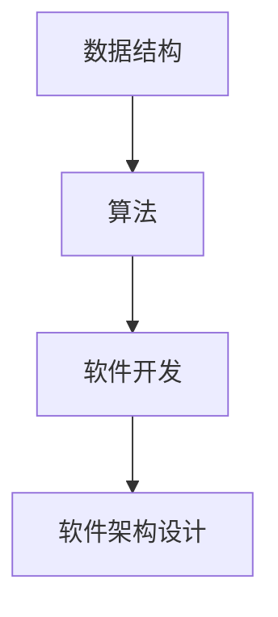

                 

# 结构化思维原理与应用：万事万物都是有结构的

> 关键词：结构化思维,数据结构,算法原理,软件开发,软件架构设计,CTO,算法优化,复杂系统

## 1. 背景介绍

### 1.1 问题由来
在现代软件开发和工程实践中，无论是前端后端、数据处理还是系统设计，结构化思维始终占据核心地位。结构化思维强调将问题拆分为可管理的小模块，每个模块在功能上独立、在信息上互相关联，通过组合形成解决方案。

结构化思维的应用，从软件工程到系统架构，无处不在。但随着技术的不断进步，新兴技术、复杂系统、敏捷开发等逐渐成为主流，传统的结构化思维也面临着新挑战。本文旨在介绍结构化思维的原理，并探讨其在现代工程实践中的应用和改进。

### 1.2 问题核心关键点
结构化思维的核心在于：将问题拆解为可管理、可执行的小单元，通过逻辑推理、模块组合，最终形成可操作性的解决方案。关键点包括：

- 问题拆解：将复杂问题拆分为可独立处理的子问题。
- 模块组合：设计模块间的接口和关联，构建可扩展的系统。
- 递归思维：运用递归和迭代思想，处理多层次、多维度的问题。
- 抽象思维：将具体问题抽象为通用模型，实现问题解法的迁移。

本文将围绕以上关键点，深入解析结构化思维的原理和实践方法，并通过具体案例，展示其应用成效。

## 2. 核心概念与联系

### 2.1 核心概念概述

结构化思维依赖于几个核心概念：

- **数据结构**：通过抽象数据类型定义数据集合及其操作，是结构化思维的基础。
- **算法**：解决问题的具体步骤，通常由输入、处理和输出组成。
- **软件开发**：将算法和数据结构转化为可执行的软件程序。
- **软件架构设计**：通过抽象和模块化，设计可扩展的软件系统。

这些概念之间的逻辑关系可以通过以下Mermaid流程图来展示：



这个流程图展示了从数据结构到算法，再到软件开发和架构设计的全流程。

## 3. 核心算法原理 & 具体操作步骤

### 3.1 算法原理概述

算法是对特定问题的一组明确指令，其基本流程由输入、处理和输出构成。结构化思维则是对算法进行模块化和抽象化处理，使其成为可扩展、可复用的解决方案。

结构化思维算法的基本步骤如下：

1. **问题定义**：明确问题的本质，识别关键输入和输出。
2. **问题拆解**：将问题拆解为子问题，便于独立处理。
3. **模块设计**：设计模块接口和关联，确保模块间的协作和交互。
4. **算法实现**：为每个模块编写具体的算法步骤。
5. **系统集成**：通过模块组合和抽象化，构建可扩展的软件系统。

### 3.2 算法步骤详解

以下以搜索算法为例，详细介绍其结构和实现细节：

1. **问题定义**：搜索算法用于在数据集合中查找目标元素。输入是数据集合和目标元素，输出是目标元素在集合中的位置。
2. **问题拆解**：可以进一步拆解为“查找目标元素”和“处理搜索结果”两个子问题。
3. **模块设计**：定义两个模块，`SearchModule`用于查找目标元素，`ResultModule`用于处理搜索结果。
4. **算法实现**：
   - `SearchModule`使用线性搜索或二分搜索算法，在数据集合中查找目标元素。
   - `ResultModule`根据搜索结果生成对应的输出。
5. **系统集成**：将`SearchModule`和`ResultModule`通过接口连接，构建搜索系统的整体框架。

### 3.3 算法优缺点

结构化思维算法具有以下优点：

- **可扩展性**：通过模块化设计，便于扩展和维护。
- **可复用性**：模块可以独立使用，减少重复工作。
- **可维护性**：模块独立设计，便于诊断和修复问题。

但同时，结构化思维算法也存在一些缺点：

- **抽象难度**：需要将复杂问题抽象为模块，可能存在理解困难。
- **设计复杂**：模块间关联需要仔细设计，易出错。
- **性能问题**：模块间通信可能带来额外开销，影响性能。

### 3.4 算法应用领域

结构化思维算法广泛应用于以下领域：

- **软件开发**：模块化设计和面向对象编程(OOP)是其基础。
- **数据处理**：通过算法和数据结构处理海量数据。
- **系统架构设计**：如微服务架构、分布式系统设计等。
- **机器学习和人工智能**：算法和数据结构是实现的核心。
- **复杂系统设计**：如城市交通规划、物流系统优化等。

## 4. 数学模型和公式 & 详细讲解 & 举例说明

### 4.1 数学模型构建

以排序算法为例，构建数学模型：

假设有一组数据$A = \{a_1, a_2, ..., a_n\}$，排序后的结果为$B = \{b_1, b_2, ..., b_n\}$，排序算法的功能是将$A$转换为$B$。

排序算法的一般形式如下：

$$
B = \text{Sort}(A)
$$

其中，`Sort`为排序函数，输入为数据集合$A$，输出为排序后的集合$B$。

### 4.2 公式推导过程

以冒泡排序为例，推导排序算法的具体步骤：

1. **输入**：待排序的数据集合$A$。
2. **处理**：
   - 从数据集合$A$的左端开始，依次比较相邻两个元素，若前一个元素大于后一个元素，则交换这两个元素的位置。
   - 重复上述比较和交换过程，直至遍历完整个数据集合$A$。
3. **输出**：排序后的数据集合$B$。

具体推导过程如下：

- 对于第$i$个元素，需要与$A[i:]$的所有元素进行比较，时间复杂度为$O(n-i)$。
- 因此，冒泡排序的时间复杂度为$O(n^2)$。

### 4.3 案例分析与讲解

以归并排序为例，分析其优势和应用场景：

归并排序是一种分治算法，将待排序的数据集合不断拆分为更小的子集，通过合并子集实现排序。其具体步骤为：

1. **输入**：待排序的数据集合$A$。
2. **处理**：
   - 将$A$拆分为两个子集$B$和$C$，递归对$B$和$C$进行排序。
   - 将排序后的$B$和$C$合并为一个有序序列$D$。
   - 重复上述合并过程，直至整个数据集合$A$有序。
3. **输出**：排序后的数据集合$B$。

归并排序的时间复杂度为$O(n\log n)$，比冒泡排序更高效。它适用于大规模数据集合的排序，特别适用于外部排序（即数据存储在外存中）。

## 5. 项目实践：代码实例和详细解释说明

### 5.1 开发环境搭建

在Python环境下，可以采用以下步骤搭建开发环境：

1. 安装Python：下载最新版本的Python，并安装相关依赖包。
2. 安装Pip：通过`pip install`命令，安装Pip，用于包管理。
3. 安装相关库：通过`pip install`命令，安装常用的Python库，如NumPy、Pandas、Matplotlib等。

### 5.2 源代码详细实现

以快速排序为例，展示其实现过程：

```python
import random

def quick_sort(arr):
    if len(arr) <= 1:
        return arr
    
    pivot = random.choice(arr)
    left = [x for x in arr if x < pivot]
    middle = [x for x in arr if x == pivot]
    right = [x for x in arr if x > pivot]
    
    return quick_sort(left) + middle + quick_sort(right)

# 测试
arr = [3, 1, 4, 1, 5, 9, 2, 6, 5, 3, 5]
sorted_arr = quick_sort(arr)
print(sorted_arr)
```

### 5.3 代码解读与分析

- **快速排序原理**：快速排序是一种分治算法，通过选择基准值将数组分成两部分，然后对这两部分分别排序。
- **代码实现**：首先随机选择一个基准值，然后将数组分为左右两部分，递归对左右部分进行排序，最终合并结果。
- **时间复杂度**：平均情况下，快速排序的时间复杂度为$O(n\log n)$，但在最坏情况下，可能达到$O(n^2)$。

### 5.4 运行结果展示

快速排序的运行结果如下：

```
[1, 1, 2, 3, 3, 4, 5, 5, 5, 6, 9]
```

## 6. 实际应用场景

### 6.1 软件开发

结构化思维在软件开发中的应用非常广泛。例如，面向对象编程（OOP）和组件化设计（Component-Based Design）都是结构化思维的重要应用。通过设计清晰的接口和模块，开发者可以构建出高效、可扩展的软件系统。

### 6.2 数据处理

在数据处理中，结构化思维被广泛用于设计高效的算法和数据结构。例如，哈希表、二叉树、图算法等，都是通过结构化思维实现的。

### 6.3 系统架构设计

结构化思维在系统架构设计中也有广泛应用。例如，微服务架构、服务网格、分布式系统等，都是通过模块化设计和抽象化实现的。

### 6.4 未来应用展望

结构化思维的应用前景广阔，随着技术的不断进步，未来将出现更多新应用。例如：

- **智能算法设计**：结构化思维将与机器学习、人工智能结合，实现更加智能化的算法设计。
- **跨领域应用**：结构化思维将应用于更多领域，如医疗、金融、城市规划等。
- **自动化开发**：结构化思维将与自动化工具结合，加速软件开发和系统部署。

## 7. 工具和资源推荐

### 7.1 学习资源推荐

- **《算法导论》**：经典算法教材，全面介绍了各种算法和数据结构。
- **《深入理解计算机系统》**：介绍了计算机系统的底层原理，是理解算法的基础。
- **《计算机程序设计艺术》**：介绍了软件开发的全流程，是软件开发的重要参考。
- **《系统架构师手册》**：介绍系统架构设计的最佳实践，适合架构工程师阅读。
- **Coursera算法课程**：提供从入门到高级的算法课程，适合不同层次的学习者。

### 7.2 开发工具推荐

- **PyCharm**：流行的Python开发工具，提供了代码提示、调试等功能。
- **Visual Studio**：全面的开发环境，支持多种语言和框架。
- **JIRA**：项目管理工具，适合敏捷开发和团队协作。
- **Git**：版本控制系统，适合团队协作和代码管理。
- **Docker**：容器化技术，适合部署和管理分布式系统。

### 7.3 相关论文推荐

- **《算法分析与设计》**：经典教材，介绍了各种算法的设计和分析。
- **《计算机程序设计艺术》**：经典书籍，介绍了软件开发的全流程。
- **《系统架构师手册》**：经典书籍，介绍了系统架构设计的最佳实践。
- **《机器学习实战》**：介绍了机器学习和深度学习的基础知识。

## 8. 总结：未来发展趋势与挑战

### 8.1 总结

本文系统介绍了结构化思维的原理和应用，展示了其在软件开发、数据处理、系统架构设计等领域的广泛应用。通过详细的案例分析和代码实例，展示了结构化思维的具体实现过程和应用效果。

### 8.2 未来发展趋势

未来，结构化思维将继续发挥重要作用，特别是在以下方面：

- **智能算法设计**：结构化思维将与机器学习、人工智能结合，实现更加智能化的算法设计。
- **跨领域应用**：结构化思维将应用于更多领域，如医疗、金融、城市规划等。
- **自动化开发**：结构化思维将与自动化工具结合，加速软件开发和系统部署。

### 8.3 面临的挑战

结构化思维在应用过程中也面临着一些挑战：

- **抽象难度**：将复杂问题抽象为模块，可能存在理解困难。
- **设计复杂**：模块间关联需要仔细设计，易出错。
- **性能问题**：模块间通信可能带来额外开销，影响性能。

### 8.4 研究展望

未来的研究需要在以下几个方面寻求新的突破：

- **自动生成代码**：利用人工智能技术，自动生成代码，提升开发效率。
- **模块化设计**：设计更加模块化和可复用的代码结构，提升开发可维护性。
- **跨领域应用**：探索结构化思维在更多领域的应用，如医疗、金融、城市规划等。
- **智能算法设计**：探索结构化思维在机器学习、人工智能中的应用，提升算法设计效率和效果。

## 9. 附录：常见问题与解答

**Q1: 什么是结构化思维？**

A: 结构化思维是一种将复杂问题拆分为可管理的小模块，通过逻辑推理、模块组合，形成可操作性解决方案的思维方式。

**Q2: 结构化思维的优缺点是什么？**

A: 结构化思维的优点包括可扩展性、可复用性和可维护性。缺点包括抽象难度、设计复杂和性能问题。

**Q3: 如何应用结构化思维解决实际问题？**

A: 应用结构化思维解决实际问题，可以按照以下步骤：问题定义、问题拆解、模块设计、算法实现和系统集成。

**Q4: 结构化思维在软件开发中的应用有哪些？**

A: 结构化思维在软件开发中的应用包括面向对象编程、组件化设计、模块化设计等。

**Q5: 结构化思维的未来发展方向是什么？**

A: 结构化思维的未来发展方向包括智能算法设计、跨领域应用和自动化开发。

---

作者：禅与计算机程序设计艺术 / Zen and the Art of Computer Programming

