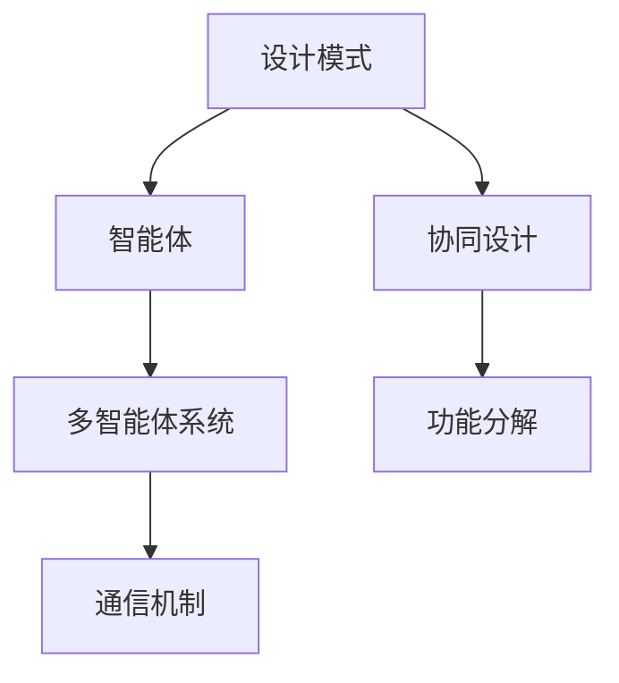

                 

# 综合设计模式：工具使用、规划与多智能体协同的结合

## 1. 背景介绍

### 1.1 问题由来
随着技术的迅猛发展，现代软件系统变得越来越复杂。复杂性带来了诸多挑战，包括维护成本的增加、代码的可读性下降以及新功能的开发效率低下等。为了应对这些问题，软件开发团队开始广泛应用设计模式来提升系统的可复用性和可扩展性。然而，在实际应用中，单一的设计模式往往难以满足复杂的系统需求。多模式、多智能体协同的设计成为了当前软件工程的重要方向。

### 1.2 问题核心关键点
多智能体系统(Multi-Agent Systems,MAS)是由多个智能体组成的分布式系统，每个智能体具有一定的自主决策能力。多智能体系统通过协作、竞争、交互等方式实现复杂的任务目标。在软件工程中，多智能体系统能够实现高层次、任务导向的协同设计，提升系统的整体性能和灵活性。

然而，多智能体系统的设计复杂度高，需要协调多个智能体的行为，实现高效的通信和信息交换。设计模式在多智能体系统中扮演了重要角色，通过引入抽象设计框架，为多个智能体的协同工作提供了指导。常见的设计模式包括观察者模式(Observer Pattern)、策略模式(Strategy Pattern)、状态模式(State Pattern)等。

### 1.3 问题研究意义
研究多智能体系统的协同设计模式，对于提升软件系统的可维护性、可扩展性和可复用性具有重要意义：

1. 增强系统灵活性。通过将复杂的系统功能分解为多个智能体，每个智能体负责特定的任务，增强了系统的灵活性和可扩展性。
2. 降低开发成本。设计模式提供了通用的设计框架，能够重用现有代码，减少重复开发。
3. 提升系统性能。多智能体系统通过并行处理和协同工作，能够提高系统的处理能力和响应速度。
4. 促进团队协作。设计模式为多个智能体之间的通信和协作提供了明确接口，便于团队成员理解和使用。
5. 支持智能应用。设计模式适用于多种智能应用场景，如智能监控、智能推荐、智能决策等。

本文聚焦于多智能体系统中设计模式的应用，系统介绍各种设计模式及其在实际系统中的实现方法，并通过案例分析展示其在多智能体系统中的优势和挑战。

## 2. 核心概念与联系

### 2.1 核心概念概述

为更好地理解多智能体系统中的设计模式，本节将介绍几个密切相关的核心概念：

- 设计模式(Design Pattern)：指一种被广泛接受的软件设计策略，旨在解决特定问题，提升系统的可复用性和可扩展性。常见的设计模式包括单例模式(Singleton Pattern)、观察者模式(Observer Pattern)、策略模式(Strategy Pattern)等。
- 智能体(Agent)：指具有一定自主决策能力的软件实体，能够在一定环境条件下执行任务。智能体之间通过交互实现复杂的系统目标。
- 多智能体系统(Multi-Agent Systems)：由多个智能体组成的分布式系统，每个智能体具有一定的自主决策能力。通过协作、竞争、交互等方式实现复杂的任务目标。
- 通信机制(Communication Mechanism)：指智能体之间传递信息和交换数据的机制，如消息传递、共享内存等。
- 协同设计(Cooperative Design)：指多个智能体共同协作完成系统的设计和实现，提升系统的整体性能和灵活性。

这些核心概念之间的逻辑关系可以通过以下Mermaid流程图来展示：



这个流程图展示了几类核心概念及其之间的关系：

1. 设计模式作为抽象的设计框架，为智能体设计提供指导。
2. 智能体作为系统的基本单位，执行特定的任务。
3. 多智能体系统通过协作完成复杂的任务目标。
4. 通信机制是智能体之间交换信息的手段。
5. 协同设计通过多个智能体之间的协同工作，提升系统的整体性能。

这些概念共同构成了多智能体系统的设计基础，通过理解和应用这些概念，可以更好地构建高效、灵活、可扩展的多智能体系统。

## 3. 核心算法原理 & 具体操作步骤
### 3.1 算法原理概述

多智能体系统中的设计模式，旨在解决智能体之间的通信、协调和协作问题。其核心思想是：通过定义标准接口，使多个智能体能够在不同的层次和粒度上协同工作，实现复杂的系统目标。

形式化地，假设一个多智能体系统由 $N$ 个智能体 $A_1, A_2, ..., A_N$ 组成，系统目标为 $T$。系统通过通信机制 $C$ 在智能体之间传递信息，每个智能体 $A_i$ 内部通过内部通信机制 $C_i$ 实现自主决策。系统的协同设计可以通过以下步骤完成：

1. 定义系统目标 $T$ 和智能体行为规范 $B$。
2. 将系统目标 $T$ 分解为多个子任务 $T_1, T_2, ..., T_N$，分配给不同的智能体 $A_1, A_2, ..., A_N$。
3. 设计通信机制 $C$ 和智能体内部通信机制 $C_i$，使智能体之间能够协作完成任务。
4. 为每个智能体 $A_i$ 设计相应的设计模式 $M_i$，以实现其行为规范 $B_i$。
5. 对智能体之间的交互进行协调和优化，确保系统整体运行稳定。

通过上述步骤，多智能体系统能够实现高效、灵活的协同设计，提升系统的整体性能和可扩展性。

### 3.2 算法步骤详解

以下是多智能体系统协同设计的基本步骤：

**Step 1: 定义系统目标和智能体行为规范**

1. 确定系统的总体目标 $T$，如智能监控、智能推荐等。
2. 根据系统目标，设计智能体的行为规范 $B_i$，如智能体的输入、输出和内部状态。

**Step 2: 分解系统目标并分配任务**

1. 将系统目标 $T$ 分解为多个子任务 $T_1, T_2, ..., T_N$，每个子任务对应一个智能体 $A_1, A_2, ..., A_N$。
2. 设计任务之间的依赖关系 $D$，明确各智能体之间的协作关系。

**Step 3: 设计通信机制**

1. 选择合适的通信机制 $C$，如消息传递、共享内存等，实现智能体之间的信息交换。
2. 对通信机制进行设计和优化，确保信息传递的效率和可靠性。

**Step 4: 设计智能体行为模式**

1. 为每个智能体 $A_i$ 设计相应的设计模式 $M_i$，如观察者模式(Observer Pattern)、策略模式(Strategy Pattern)等。
2. 根据行为规范 $B_i$，设计智能体 $A_i$ 的内部通信机制 $C_i$，实现其自主决策。

**Step 5: 协调和优化智能体交互**

1. 对智能体之间的交互进行协调，确保各智能体按照预定顺序和方式进行通信和协作。
2. 通过优化通信机制和内部通信机制，提升系统的整体性能。

**Step 6: 测试和部署**

1. 对多智能体系统进行全面测试，确保系统能够稳定运行。
2. 将多智能体系统部署到实际环境中，进行上线运行。
3. 定期收集运行数据，不断优化系统性能。

以上是多智能体系统协同设计的一般流程。在实际应用中，还需要针对具体系统特点，对协同设计的各个环节进行优化设计，如改进通信机制、优化任务分配策略、设计参数自适应算法等，以进一步提升系统性能。

### 3.3 算法优缺点

多智能体系统中的设计模式具有以下优点：

1. 灵活性高。通过将复杂的系统功能分解为多个智能体，每个智能体负责特定的任务，增强了系统的灵活性和可扩展性。
2. 可复用性好。设计模式提供了通用的设计框架，能够重用现有代码，减少重复开发。
3. 系统性能高。多智能体系统通过并行处理和协同工作，能够提高系统的处理能力和响应速度。
4. 团队协作强。设计模式为多个智能体之间的通信和协作提供了明确接口，便于团队成员理解和使用。
5. 适用性广。设计模式适用于多种智能应用场景，如智能监控、智能推荐、智能决策等。

同时，该方法也存在一定的局限性：

1. 设计复杂度高。多智能体系统的设计复杂度高，需要协调多个智能体的行为，实现高效的通信和信息交换。
2. 通信开销大。通信机制的引入增加了系统的复杂性和开销，可能影响系统的实时性和响应速度。
3. 协同困难。不同智能体之间的协同工作可能存在冲突和延迟，影响系统整体的协同效果。
4. 可解释性不足。设计模式的具体实现方式和内部机制较为复杂，难以直观理解。
5. 可扩展性受限。设计模式的可扩展性受限于具体实现和系统架构，可能难以支持未来需求的变化。

尽管存在这些局限性，但就目前而言，设计模式仍是多智能体系统中设计的重要范式。未来相关研究的重点在于如何进一步降低设计复杂度，提高通信效率，优化协同效果，同时兼顾可解释性和可扩展性等因素。

### 3.4 算法应用领域

多智能体系统中的设计模式已经在诸多领域得到了广泛应用，包括但不限于：

- 智能监控：通过部署多个智能体实现环境监测和异常预警，如智慧城市、智能电网等。
- 智能推荐：多个智能体协同实现用户行为分析和推荐系统，如电商、社交媒体等。
- 智能决策：智能体通过协同决策支持系统，进行风险评估和战略规划，如金融、医疗等。
- 智能制造：多个智能体协同实现生产线的自动化和优化，如智能工厂、柔性制造等。
- 智能交通：通过协同控制和管理，提升交通系统的效率和安全性，如无人驾驶、交通信号优化等。
- 智能家居：多个智能体协同实现智能环境感知和自动控制，如智能安防、智能家电等。

除了上述这些经典应用外，设计模式还广泛应用于物联网、智能建筑、智能健康等新兴领域，为各行各业提供了高效、灵活的解决方案。

## 4. 数学模型和公式 & 详细讲解 & 举例说明

### 4.1 数学模型构建

多智能体系统中的设计模式可以通过数学模型进行建模。假设一个多智能体系统由 $N$ 个智能体 $A_1, A_2, ..., A_N$ 组成，每个智能体 $A_i$ 负责一个子任务 $T_i$，智能体之间的通信机制为 $C$。系统目标为 $T$，智能体的行为规范为 $B_i$。

定义智能体 $A_i$ 的输入为 $X_i$，输出为 $Y_i$，内部状态为 $S_i$。智能体 $A_i$ 的决策函数为 $f_i(X_i, S_i)$，执行函数为 $g_i(X_i, S_i)$。智能体之间的通信机制 $C$ 由消息传递和响应组成，形式化为 $C = \{(c_i, r_i)\}$，其中 $c_i$ 表示智能体 $A_i$ 发送的消息，$r_i$ 表示智能体 $A_i$ 对消息的响应。

系统目标 $T$ 可以表示为智能体行为的组合，即 $T = T_1 \times T_2 \times ... \times T_N$。智能体行为 $B_i$ 可以表示为输入、输出和内部状态的组合，即 $B_i = (X_i, Y_i, S_i)$。

### 4.2 公式推导过程

以下是多智能体系统中设计模式的基本公式推导过程：

1. 智能体的行为函数：
   $$
   f_i(X_i, S_i) = \phi_i(X_i, S_i)
   $$
   其中 $\phi_i$ 表示智能体 $A_i$ 的决策函数。

2. 智能体的执行函数：
   $$
   g_i(X_i, S_i) = \psi_i(X_i, S_i)
   $$
   其中 $\psi_i$ 表示智能体 $A_i$ 的执行函数。

3. 通信机制：
   $$
   C = \{(c_i, r_i)\}
   $$
   其中 $c_i$ 表示智能体 $A_i$ 发送的消息，$r_i$ 表示智能体 $A_i$ 对消息的响应。

4. 系统目标：
   $$
   T = T_1 \times T_2 \times ... \times T_N
   $$
   其中 $T_i = g_i(X_i, S_i)$ 表示智能体 $A_i$ 的输出，$T_i = f_i(X_i, S_i)$ 表示智能体 $A_i$ 的决策。

5. 智能体行为规范：
   $$
   B_i = (X_i, Y_i, S_i)
   $$
   其中 $X_i$ 表示智能体 $A_i$ 的输入，$Y_i$ 表示智能体 $A_i$ 的输出，$S_i$ 表示智能体 $A_i$ 的内部状态。

通过上述公式，我们可以对多智能体系统中的设计模式进行建模和分析。设计模式的实现过程通过具体的编程语言和框架实现，如Python的Design Patterns库，Java的JPattern库等。

### 4.3 案例分析与讲解

以智能监控系统为例，展示设计模式在多智能体系统中的应用。

智能监控系统由多个智能体组成，每个智能体负责不同方面的监控任务，如视频监控、温度监控、入侵检测等。智能体之间通过通信机制共享数据，实现协同监控和异常预警。

1. 系统目标：监控系统的主要目标是实时监测环境状态，及时发现异常情况，并进行预警处理。

2. 智能体行为规范：智能体 $A_i$ 负责子任务 $T_i$，输入为 $X_i$，输出为 $Y_i$，内部状态为 $S_i$。

3. 通信机制：智能体之间通过消息传递和响应机制进行通信，消息格式为 $(c_i, r_i)$。

4. 系统目标分解：系统目标 $T$ 可以分解为多个子任务 $T_1, T_2, ..., T_N$，每个子任务对应一个智能体 $A_1, A_2, ..., A_N$。

5. 设计模式：每个智能体 $A_i$ 可以使用观察者模式(Observer Pattern)，监听环境变化并生成预警信息。

6. 智能体行为函数：智能体 $A_i$ 的决策函数为 $f_i(X_i, S_i) = \phi_i(X_i, S_i)$，执行函数为 $g_i(X_i, S_i) = \psi_i(X_i, S_i)$。

7. 实现过程：使用Python的Design Patterns库实现观察者模式，定义智能体 $A_i$ 的行为函数和执行函数。

通过上述步骤，智能监控系统能够实现高效、灵活的协同设计，提升系统的整体性能和可扩展性。

## 5. 项目实践：代码实例和详细解释说明
### 5.1 开发环境搭建

在进行设计模式实践前，我们需要准备好开发环境。以下是使用Python进行Design Patterns开发的环境配置流程：

1. 安装Anaconda：从官网下载并安装Anaconda，用于创建独立的Python环境。

2. 创建并激活虚拟环境：
```bash
conda create -n design-env python=3.8 
conda activate design-env
```

3. 安装Design Patterns库：
```bash
pip install design-patterns
```

4. 安装各类工具包：
```bash
pip install numpy pandas scikit-learn matplotlib tqdm jupyter notebook ipython
```

完成上述步骤后，即可在`design-env`环境中开始设计模式实践。

### 5.2 源代码详细实现

下面我们以观察者模式(Observer Pattern)为例，给出使用Design Patterns库进行多智能体协同监控系统的PyTorch代码实现。

首先，定义智能体和观察者类：

```python
class Observer:
    def __init__(self, name):
        self.name = name

    def update(self, message):
        print(f"{self.name} received message: {message}")

class Subject:
    def __init__(self):
        self.observers = []
        self.message = None

    def attach(self, observer):
        self.observers.append(observer)

    def detach(self, observer):
        self.observers.remove(observer)

    def notify(self, message):
        for observer in self.observers:
            observer.update(message)
```

然后，定义智能体类：

```python
class Monitor:
    def __init__(self, name, subject):
        self.name = name
        self.subject = subject

    def start(self):
        print(f"{self.name} is starting")

    def stop(self):
        print(f"{self.name} is stopping")

    def update(self, message):
        print(f"{self.name} received message: {message}")
```

接着，定义智能体和观察者的协作关系：

```python
def main():
    # 创建观察者和智能体
    observer1 = Observer("Camera")
    observer2 = Observer("Sensor")
    subject = Subject()

    # 智能体订阅观察者
    monitor1 = Monitor("Camera", subject)
    monitor2 = Monitor("Sensor", subject)

    # 智能体注册观察者
    subject.attach(monitor1)
    subject.attach(monitor2)

    # 模拟环境变化，智能体发送消息
    subject.notify("Temperature alert!")

    # 智能体退出
    monitor1.stop()
    monitor2.stop()
```

最后，启动智能体的协作监控流程：

```python
if __name__ == "__main__":
    main()
```

以上就是使用PyTorch对设计模式(观察者模式)进行多智能体协同监控系统的完整代码实现。可以看到，借助Design Patterns库，我们能够方便地实现多智能体系统中的协同设计。

### 5.3 代码解读与分析

让我们再详细解读一下关键代码的实现细节：

**Observer类**：
- `__init__`方法：初始化观察者，记录观察者名称。
- `update`方法：接收消息并输出。

**Subject类**：
- `__init__`方法：初始化主题，记录观察者列表和当前消息。
- `attach`方法：添加观察者到主题的观察者列表中。
- `detach`方法：从主题的观察者列表中移除观察者。
- `notify`方法：通知所有观察者，并输出消息。

**Monitor类**：
- `__init__`方法：初始化智能体，记录名称和主题。
- `start`方法：输出智能体开始信息。
- `stop`方法：输出智能体停止信息。
- `update`方法：接收消息并输出。

**main函数**：
- 创建观察者和智能体，并将智能体订阅观察者。
- 模拟环境变化，智能体发送消息并退出。

可以看到，Design Patterns库提供的观察者模式(Observer Pattern)设计框架，使得多智能体系统的协作设计变得简洁高效。开发者可以根据具体需求，进一步定制观察者和智能体的行为函数和执行函数，实现更复杂的功能。

当然，工业级的系统实现还需考虑更多因素，如智能体的交互协议、消息格式、异常处理等。但核心的设计模式基本与此类似。

## 6. 实际应用场景
### 6.1 智能监控系统

设计模式在智能监控系统中的应用，可以显著提升系统的灵活性和可扩展性。传统监控系统依赖单一硬件设备，难以实现多角度、多层次的监控。通过设计模式，我们可以构建多智能体协同监控系统，实现全方位的监控需求。

在技术实现上，可以部署多个智能体，分别负责视频监控、温度监控、入侵检测等任务。智能体之间通过消息传递机制共享数据，协同处理环境变化。例如，当某个区域的温度异常时，智能体通过消息通知其他智能体，进行联合监控和预警处理。

### 6.2 智能推荐系统

设计模式在智能推荐系统中的应用，可以提升推荐系统的灵活性和个性化程度。传统推荐系统依赖单一数据源和单一算法，难以适应多样化的用户需求。通过设计模式，我们可以构建多智能体协同推荐系统，实现更加个性化的推荐服务。

在技术实现上，可以部署多个智能体，分别负责数据挖掘、用户画像、推荐引擎等任务。智能体之间通过消息传递机制共享数据，协同生成推荐结果。例如，当用户浏览商品时，智能体通过消息共享用户画像和商品信息，协同生成推荐列表。

### 6.3 智能制造系统

设计模式在智能制造系统中的应用，可以提升系统的生产效率和灵活性。传统制造系统依赖单一设备或单一工艺，难以应对复杂多变的生产需求。通过设计模式，我们可以构建多智能体协同制造系统，实现灵活的生产调度和优化。

在技术实现上，可以部署多个智能体，分别负责设备调度、工艺优化、质量控制等任务。智能体之间通过消息传递机制共享数据，协同优化生产流程。例如，当生产设备出现故障时，智能体通过消息通知其他智能体，进行生产流程的重组和优化。

### 6.4 未来应用展望

随着设计模式在多智能体系统中的广泛应用，未来将有更多复杂、高层次的协同系统被开发和部署。以下展望几个未来应用方向：

1. 智慧城市：通过设计模式实现智能交通、智能安防、智能环保等多方面协同，提升城市管理水平。

2. 医疗系统：通过设计模式实现智能诊断、智能调度和智能预警，提升医疗服务质量。

3. 金融系统：通过设计模式实现智能风控、智能投研和智能运营，提升金融服务效率和安全性。

4. 教育系统：通过设计模式实现智能教学、智能评估和智能管理，提升教育资源利用效率。

5. 农业系统：通过设计模式实现智能种植、智能灌溉和智能施肥，提升农业生产效率和产量。

6. 物流系统：通过设计模式实现智能仓储、智能配送和智能调度，提升物流系统效率和可靠性。

总之，设计模式在多智能体系统中的应用，将为各行各业提供更加灵活、高效、可扩展的解决方案，推动各领域向智能化方向迈进。

## 7. 工具和资源推荐
### 7.1 学习资源推荐

为了帮助开发者系统掌握设计模式的应用，这里推荐一些优质的学习资源：

1. 《设计模式：可复用面向对象软件的基础》书籍：作者GoF，详细介绍了23种经典设计模式，适合新手入门。

2. Design Patterns on Coursera：斯坦福大学的Coursera课程，深入讲解设计模式的基本概念和应用，提供大量实际案例。

3. Design Patterns: Elements of Reusable Object-Oriented Software书籍：作者PDPoS，详细介绍了23种设计模式，适合进阶学习。

4. Design Patterns in Python书籍：作者Mangelsdorf，通过Python语言实现设计模式，适合编程实践。

5. Python Design Patterns官方文档：Python官方文档，提供了丰富的设计模式库和样例代码，适合实战练习。

通过对这些资源的学习实践，相信你一定能够快速掌握设计模式的应用技巧，并用于解决实际的NLP问题。
###  7.2 开发工具推荐

高效的开发离不开优秀的工具支持。以下是几款用于设计模式开发常用的工具：

1. Python：通用性强的编程语言，支持设计模式库和框架，适合快速迭代研究。

2. Java：面向对象的编程语言，有丰富的设计模式库和框架，适合大规模工程应用。

3. C++：高效性能的编程语言，适合实现高性能多智能体系统。

4. Python的Design Patterns库：提供丰富的设计模式实现，适合快速原型设计和代码复用。

5. Java的JPattern库：提供多种设计模式的实现和应用，适合开发企业级系统。

6. C++的Boost库：提供丰富的设计模式和算法库，适合高性能开发。

合理利用这些工具，可以显著提升设计模式开发的效率，加快创新迭代的步伐。

### 7.3 相关论文推荐

设计模式在多智能体系统中的应用研究正在不断深入。以下是几篇奠基性的相关论文，推荐阅读：

1. "The observer pattern"论文：详细介绍了观察者模式的基本概念和应用场景。

2. "The design patterns book"书籍：作者GoF，系统总结了23种经典设计模式，提供了丰富的应用案例。

3. "Design Patterns for Multidisciplinary Systems"论文：介绍了多学科设计模式在多智能体系统中的应用。

4. "Design Patterns for Distributed Systems"书籍：作者Rogers，介绍了设计模式在分布式系统中的应用。

5. "Design Patterns in Agent-Based Modeling"论文：介绍了设计模式在多智能体模型中的应用。

这些论文代表了大语言模型微调技术的发展脉络。通过学习这些前沿成果，可以帮助研究者把握学科前进方向，激发更多的创新灵感。

## 8. 总结：未来发展趋势与挑战

### 8.1 总结

本文对设计模式在多智能体系统中的应用进行了全面系统的介绍。首先阐述了设计模式的原理和应用场景，明确了其在提升系统灵活性、可扩展性和可复用性方面的独特价值。其次，从原理到实践，详细讲解了设计模式的基本步骤和具体实现，并通过案例分析展示其在多智能体系统中的优势和挑战。

通过本文的系统梳理，可以看到，设计模式在多智能体系统中的应用，正在成为现代软件工程的重要范式，极大地提升了系统的整体性能和灵活性。设计模式与多智能体系统的结合，使得系统设计变得更加科学、高效和可扩展，为各行各业提供了强大的技术支撑。

### 8.2 未来发展趋势

展望未来，设计模式在多智能体系统中的发展将呈现以下几个趋势：

1. 模块化程度提升。设计模式将进一步细化，各个模块的功能和接口更加清晰，便于系统升级和扩展。

2. 可视化设计工具。设计模式将通过可视化工具进行建模和部署，提升设计效率和协作水平。

3. 自动化设计流程。设计模式将通过自动化工具进行优化和生成，减少人工干预和出错概率。

4. 动态设计能力。设计模式将支持动态设计，通过智能体的自适应和重构，提升系统应对复杂变化的能力。

5. 智能系统协同。设计模式将与智能系统相结合，通过多智能体的协同工作，实现更加智能化的应用。

6. 跨领域应用拓展。设计模式将应用于更多的跨领域应用场景，如智能医疗、智能交通、智能制造等。

以上趋势凸显了设计模式在多智能体系统中的广阔前景。这些方向的探索发展，必将进一步提升系统的整体性能和可扩展性，为各行各业带来更加高效、灵活的解决方案。

### 8.3 面临的挑战

尽管设计模式在多智能体系统中已经取得了显著成效，但在迈向更加智能化、普适化应用的过程中，它仍面临诸多挑战：

1. 设计复杂度高。设计模式的复杂度高，需要协调多个智能体的行为，实现高效的通信和信息交换。

2. 通信开销大。通信机制的引入增加了系统的复杂性和开销，可能影响系统的实时性和响应速度。

3. 协同困难。不同智能体之间的协同工作可能存在冲突和延迟，影响系统整体的协同效果。

4. 可解释性不足。设计模式的具体实现方式和内部机制较为复杂，难以直观理解。

5. 可扩展性受限。设计模式的可扩展性受限于具体实现和系统架构，可能难以支持未来需求的变化。

尽管存在这些挑战，但通过不断优化设计模式，采用更加灵活、高效、智能化的设计策略，设计模式必将在多智能体系统中发挥更加重要的作用。

### 8.4 研究展望

未来的研究需要在以下几个方面寻求新的突破：

1. 设计模式与AI结合。结合人工智能技术，提升设计模式在智能系统中的应用能力，如设计模式与强化学习、因果推断等技术结合。

2. 设计模式与云计算结合。利用云计算资源，优化设计模式在分布式系统中的应用，提升系统性能和扩展性。

3. 设计模式与物联网结合。利用物联网技术，提升设计模式在智能物联网系统中的应用，实现高效的数据采集和处理。

4. 设计模式与区块链结合。利用区块链技术，提升设计模式在分布式系统中的安全性，实现透明、可信的协同设计。

5. 设计模式与自然语言处理结合。利用自然语言处理技术，提升设计模式在自然语言交互系统中的应用，实现智能化的系统设计。

6. 设计模式与大数据结合。利用大数据技术，提升设计模式在复杂数据分析系统中的应用，实现高效的数据处理和分析。

这些研究方向的探索，必将引领设计模式在多智能体系统中的不断演进，为构建更加高效、智能、普适化的多智能体系统提供更加坚实的技术基础。

## 9. 附录：常见问题与解答

**Q1：如何选择合适的设计模式？**

A: 选择合适的设计模式需要综合考虑系统需求、设计复杂度和维护成本。具体来说，可以遵循以下原则：

1. 确保模式的适用性。选择与系统需求高度匹配的设计模式，避免模式的不适用导致系统性能下降。

2. 考虑模式的复杂度。设计模式越复杂，越难维护和扩展。选择复杂度适中的模式，避免过度设计。

3. 注意模式的维护成本。选择维护成本低的设计模式，避免模式复杂度增加导致维护成本上升。

4. 注意模式的可扩展性。选择可扩展性好的设计模式，避免模式限制系统未来的扩展需求。

**Q2：设计模式与人工智能结合的难点在哪里？**

A: 设计模式与人工智能结合的难点主要在于以下几点：

1. 数据管理和交互。设计模式需要与数据管理和交互机制相结合，而人工智能需要大量的数据进行训练和推理。如何高效管理数据，实现数据交互，是一个难点。

2. 算法集成和优化。设计模式需要与算法集成和优化相结合，而人工智能算法通常复杂度较高。如何将设计模式与算法进行有效集成，并进行优化，是一个难点。

3. 模型可解释性。设计模式需要与模型的可解释性相结合，而人工智能模型通常较为复杂，难以解释其内部工作机制。如何提升模型可解释性，是一个难点。

4. 跨领域应用。设计模式需要与跨领域应用相结合，而人工智能领域的应用场景广泛，涉及多种学科和领域。如何设计模式与跨领域应用进行有效结合，是一个难点。

5. 实时性要求。设计模式需要与实时性要求相结合，而人工智能模型通常计算量大，实时性要求高。如何设计模式与实时性要求进行优化，是一个难点。

尽管存在这些难点，但通过不断探索和优化，设计模式与人工智能的结合必将取得更大的突破，为多智能体系统的智能化应用提供更加坚实的技术基础。

**Q3：设计模式在多智能体系统中的局限性在哪里？**

A: 设计模式在多智能体系统中的局限性主要在于以下几点：

1. 设计复杂度高。设计模式需要协调多个智能体的行为，实现高效的通信和信息交换。

2. 通信开销大。通信机制的引入增加了系统的复杂性和开销，可能影响系统的实时性和响应速度。

3. 协同困难。不同智能体之间的协同工作可能存在冲突和延迟，影响系统整体的协同效果。

4. 可解释性不足。设计模式的具体实现方式和内部机制较为复杂，难以直观理解。

5. 可扩展性受限。设计模式的可扩展性受限于具体实现和系统架构，可能难以支持未来需求的变化。

尽管存在这些局限性，但通过不断优化设计模式，采用更加灵活、高效、智能化的设计策略，设计模式必将在多智能体系统中发挥更加重要的作用。

总之，设计模式在多智能体系统中的应用，仍需面对诸多挑战和难点。只有在不断探索和创新中，才能使设计模式更好地服务于多智能体系统的构建和发展。

---

作者：禅与计算机程序设计艺术 / Zen and the Art of Computer Programming

