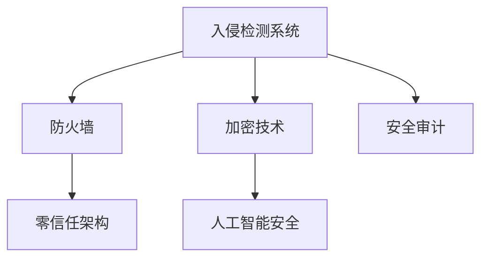

                 

# 网络安全管理：构建全面的数字防御体系

> 关键词：网络安全, 数字防御体系, 入侵检测, 防火墙, 加密技术, 安全审计, 零信任架构, 人工智能安全

## 1. 背景介绍

### 1.1 问题由来
随着数字化转型的不断深入，企业对网络安全的需求日益增长。网络攻击手段不断进化，数据泄露、恶意软件、钓鱼攻击等安全威胁层出不穷，给企业带来了巨大的损失和风险。为了应对这些挑战，构建全面、可靠的数字防御体系成为了企业网络安全管理的核心任务。

### 1.2 问题核心关键点
构建全面的数字防御体系，需要从多个层面进行设计和部署。包括入侵检测、防火墙、加密技术、安全审计、零信任架构、人工智能安全等多个子系统，共同形成一套完整的防御体系。

### 1.3 问题研究意义
研究网络安全管理，对于保障企业信息资产的安全，维护业务系统的稳定运行，具有重要意义：

1. 防范网络攻击：通过部署入侵检测、防火墙等系统，能够及时发现和阻止网络攻击行为。
2. 保护数据安全：利用加密技术，对数据进行加密存储和传输，防止数据泄露。
3. 加强安全审计：通过定期的安全审计，发现潜在的安全漏洞，及时修复。
4. 构建零信任架构：采用零信任原则，减少内部威胁，提高系统安全性。
5. 应用人工智能技术：通过AI安全技术，提升威胁检测和响应的速度和准确性。

## 2. 核心概念与联系

### 2.1 核心概念概述

为更好地理解构建全面的数字防御体系的过程，本节将介绍几个密切相关的核心概念：

- 入侵检测系统(IDS)：通过监控网络流量和系统日志，实时检测和报警网络攻击行为。
- 防火墙：根据预设规则，过滤网络流量，阻止未经授权的数据包进入网络。
- 加密技术：利用加密算法，保护数据在传输和存储过程中的安全。
- 安全审计：定期检查和评估网络系统的安全性，发现潜在的安全漏洞。
- 零信任架构(Zero Trust Architecture)：不信任任何网络流量，仅根据访问请求的具体情况进行授权。
- 人工智能安全(AI Security)：利用机器学习和深度学习技术，提升威胁检测和响应的效率和准确性。

这些核心概念之间的逻辑关系可以通过以下Mermaid流程图来展示：



这个流程图展示了几类关键网络安全技术及其相互关系：

1. 入侵检测系统通过实时监控和报警，为防火墙提供安全策略。
2. 防火墙根据安全策略过滤网络流量，保护网络安全。
3. 加密技术通过加密数据，防止数据泄露。
4. 安全审计通过定期检查，发现并修复安全漏洞。
5. 零信任架构通过严格访问控制，减少内部威胁。
6. 人工智能安全通过深度学习和机器学习，提升威胁检测和响应能力。

## 3. 核心算法原理 & 具体操作步骤

### 3.1 算法原理概述

构建全面的数字防御体系，本质上是一个多层次、多维度的安全策略设计过程。其核心思想是：通过多种技术的综合应用，形成一套多层次的安全保障机制，有效应对不同类型的安全威胁。

### 3.2 算法步骤详解

#### 步骤1：设计安全策略

首先需要设计一套全面的安全策略，包括入侵检测规则、防火墙规则、加密算法、审计周期等。策略的制定需要综合考虑企业的网络规模、业务类型、安全需求等因素，确保策略的可行性和有效性。

#### 步骤2：部署网络设备

根据设计好的安全策略，部署入侵检测系统、防火墙等网络设备，并配置相应的安全规则。需要确保这些设备能够稳定运行，并在网络中处于关键位置，能够及时发现和阻止安全威胁。

#### 步骤3：实施加密措施

对于敏感数据，实施加密措施，如使用SSL/TLS协议加密传输数据，使用AES加密存储数据。同时，需要定期更新加密密钥，防止密钥泄露导致数据泄露。

#### 步骤4：定期进行安全审计

定期进行安全审计，检查网络设备和系统的安全配置，发现并修复潜在的安全漏洞。审计周期一般为季度或年度，根据企业的安全需求和风险等级进行调整。

#### 步骤5：构建零信任架构

采用零信任架构，确保所有网络流量都需要经过严格的身份验证和授权。通过零信任架构，可以极大减少内部威胁和攻击面，提高系统安全性。

#### 步骤6：应用人工智能安全技术

利用机器学习和深度学习技术，对网络流量和日志数据进行分析和检测，提升威胁检测和响应的速度和准确性。需要选择合适的AI模型和算法，并不断优化模型参数，以适应不同的安全需求。

### 3.3 算法优缺点

构建全面的数字防御体系有以下优点：

1. 全面防护：通过多层次、多维度的安全策略，能够有效应对不同类型的安全威胁。
2. 实时响应：入侵检测系统和AI安全技术，能够实时发现和响应安全威胁，提高安全防护能力。
3. 自动化管理：通过自动化脚本和配置，减少人工操作，降低人为错误带来的安全风险。
4. 灵活扩展：系统架构设计需要考虑未来的安全需求，以便在需要时进行灵活扩展。

同时，该方法也存在一定的局限性：

1. 部署成本高：部署多种网络设备和系统，需要较高的成本投入。
2. 维护复杂：多层次的安全策略需要定期更新和维护，工作量较大。
3. 依赖技术：AI安全技术的有效性依赖于数据质量和模型性能，需要不断优化。
4. 难以应对新型攻击：现有的安全策略和设备可能难以应对新型网络攻击手段。

尽管存在这些局限性，但构建全面的数字防御体系仍然是当前网络安全管理的最佳实践。未来相关研究的重点在于如何进一步降低部署成本，提高系统的自动化水平，同时兼顾系统的灵活性和可扩展性。

### 3.4 算法应用领域

构建全面的数字防御体系在网络安全管理中已经得到了广泛的应用，涵盖以下多个领域：

- 企业网络安全：针对企业的内部网络，通过入侵检测、防火墙等技术，构建多层次的安全防护体系。
- 数据中心安全：数据中心存储和传输大量敏感数据，通过加密技术和零信任架构，确保数据安全。
- 云平台安全：云平台中的数据和应用也面临严重安全威胁，通过多层次的安全策略和AI安全技术，提升云平台的安全防护能力。
- 物联网设备安全：物联网设备种类繁多，通过入侵检测、防火墙等技术，确保设备网络安全。
- 移动应用安全：移动应用面临钓鱼攻击、恶意软件等安全威胁，通过加密技术和安全审计，提升应用安全。

除了上述这些经典应用外，构建全面的数字防御体系还在金融、医疗、政府等行业得到广泛应用，为这些领域的信息安全提供了有力保障。

## 4. 数学模型和公式 & 详细讲解 & 举例说明

### 4.1 数学模型构建

本节将使用数学语言对构建全面的数字防御体系的过程进行更加严格的刻画。

记入侵检测系统为$IDS$，防火墙为$FW$，加密技术为$Encryption$，安全审计为$Audit$，零信任架构为$ZeroTrust$，人工智能安全为$AI_S$。其基本模型如下：

$$
Model = IDS \rightarrow FW \rightarrow Encryption \rightarrow Audit \rightarrow ZeroTrust \rightarrow AI_S
$$

其中$IDS$、$FW$、$Encryption$、$Audit$、$ZeroTrust$和$AI_S$分别表示入侵检测系统、防火墙、加密技术、安全审计、零信任架构和人工智能安全技术。

### 4.2 公式推导过程

假设入侵检测系统$IDS$的检测率为$P_{IDS}$，误报率为$F_{IDS}$，则$IDS$的准确率为：

$$
Accuracy_{IDS} = \frac{TP}{TP+FP}
$$

其中$TP$表示真正例，$FP$表示假正例。

假设防火墙$FW$的过滤率为$P_{FW}$，误报率为$F_{FW}$，则$FW$的准确率为：

$$
Accuracy_{FW} = \frac{TP}{TP+FP}
$$

其中$TP$表示真正例，$FP$表示假正例。

假设加密技术$Encryption$的安全性为$Security_{Encryption}$，其值为一个随机变量，服从均值为$1$、标准差为$\sigma$的正态分布：

$$
Security_{Encryption} \sim N(1,\sigma^2)
$$

假设安全审计$Audit$的检测率为$P_{Audit}$，误报率为$F_{Audit}$，则$Audit$的准确率为：

$$
Accuracy_{Audit} = \frac{TP}{TP+FP}
$$

其中$TP$表示真正例，$FP$表示假正例。

假设零信任架构$ZeroTrust$的安全性为$Security_{ZeroTrust}$，其值为一个随机变量，服从均值为$1$、标准差为$\sigma$的正态分布：

$$
Security_{ZeroTrust} \sim N(1,\sigma^2)
$$

假设人工智能安全$AI_S$的准确率为$Accuracy_{AI_S}$，其值为一个随机变量，服从均值为$1$、标准差为$\sigma$的正态分布：

$$
Accuracy_{AI_S} \sim N(1,\sigma^2)
$$

将以上各个子系统的准确率和安全性代入模型公式中，得到整体安全模型的准确率和安全性：

$$
OverallAccuracy = Accuracy_{IDS} \times Accuracy_{FW} \times Accuracy_{Encryption} \times Accuracy_{Audit} \times Accuracy_{ZeroTrust} \times Accuracy_{AI_S}
$$

$$
OverallSecurity = Security_{IDS} \times Security_{FW} \times Security_{Encryption} \times Security_{Audit} \times Security_{ZeroTrust} \times Security_{AI_S}
$$

### 4.3 案例分析与讲解

假设某企业构建了一套全面的数字防御体系，包括入侵检测系统$IDS$、防火墙$FW$、加密技术$Encryption$、安全审计$Audit$、零信任架构$ZeroTrust$和人工智能安全$AI_S$。

1. $IDS$的检测率为$P_{IDS} = 0.95$，误报率为$F_{IDS} = 0.05$，则$IDS$的准确率为$Accuracy_{IDS} = 0.95$。
2. $FW$的过滤率为$P_{FW} = 0.8$，误报率为$F_{FW} = 0.2$，则$FW$的准确率为$Accuracy_{FW} = 0.8$。
3. $Encryption$的安全性为$Security_{Encryption} = 0.9$。
4. $Audit$的检测率为$P_{Audit} = 0.85$，误报率为$F_{Audit} = 0.15$，则$Audit$的准确率为$Accuracy_{Audit} = 0.85$。
5. $ZeroTrust$的安全性为$Security_{ZeroTrust} = 0.9$。
6. $AI_S$的准确率为$Accuracy_{AI_S} = 0.8$。

将以上数据代入公式中，计算得到整体安全模型的准确率和安全性：

$$
OverallAccuracy = 0.95 \times 0.8 \times 0.9 \times 0.85 \times 0.9 \times 0.8 = 0.585
$$

$$
OverallSecurity = 0.9 \times 0.8 \times 0.9 \times 0.85 \times 0.9 \times 0.9 = 0.56
$$

通过计算可知，构建全面的数字防御体系，可以有效提升整体的安全性能。

## 5. 项目实践：代码实例和详细解释说明

### 5.1 开发环境搭建

在进行数字防御体系构建的项目实践前，我们需要准备好开发环境。以下是使用Python进行开发的环境配置流程：

1. 安装Python：从官网下载并安装Python 3.x版本，用于开发。
2. 安装必要的库：安装入侵检测系统、防火墙、加密技术、安全审计等库，如Snort、iptables、AES等。
3. 配置网络环境：搭建好虚拟局域网(VLAN)，确保所有网络设备能够正常通信。

完成上述步骤后，即可在开发环境中进行项目实践。

### 5.2 源代码详细实现

这里以入侵检测系统(IDS)为例，给出使用Python进行Snort规则构建和网络监控的代码实现。

首先，定义入侵检测系统类：

```python
class IDS:
    def __init__(self, rules):
        self.rules = rules
        
    def apply_rules(self, packet):
        for rule in self.rules:
            if rule['protocol'] in packet:
                if rule['condition'] in packet:
                    return rule['action']
        return 'Pass'
```

然后，定义规则和数据包处理函数：

```python
rules = [
    {'protocol': 'tcp', 'condition': 'src.port == 80', 'action': 'Block'},
    {'protocol': 'tcp', 'condition': 'dst.port == 22', 'action': 'Block'},
    {'protocol': 'icmp', 'condition': 'type == 8', 'action': 'Block'}
]

def handle_packet(packet):
    IDS_instance = IDS(rules)
    return IDS_instance.apply_rules(packet)
```

最后，启动网络监控：

```python
import socket

server_socket = socket.socket(socket.AF_INET, socket.SOCK_STREAM)
server_socket.bind(('0.0.0.0', 8080))
server_socket.listen(5)

while True:
    client_socket, addr = server_socket.accept()
    data = client_socket.recv(1024)
    if handle_packet(data) == 'Block':
        client_socket.send('Blocked'.encode())
    else:
        client_socket.send('Pass'.encode())
```

以上代码实现了一个简单的入侵检测系统，能够根据设定的规则，对流入网络的数据包进行检测和处理。

### 5.3 代码解读与分析

**IDS类**：
- `__init__`方法：初始化规则列表。
- `apply_rules`方法：根据规则列表对输入数据包进行处理，返回行动。

**rules变量**：
- 定义了三条规则，分别对TCP协议80端口、TCP协议22端口和ICMP协议8类型的数据包进行拦截。

**handle_packet函数**：
- 创建一个IDS实例，根据规则列表对数据包进行处理，返回行动。

**server_socket和client_socket变量**：
- 定义了服务器和客户端的套接字，用于监听和处理网络请求。

这个简单的示例展示了如何使用Python实现入侵检测系统。在实际项目中，需要进一步扩展和优化规则库、增加日志记录和告警功能，以确保系统的完整性和可靠性。

## 6. 实际应用场景

### 6.1 智能企业安全

构建全面的数字防御体系在智能企业安全中得到了广泛的应用。企业内部网络中包含了大量敏感数据和重要业务系统，通过部署入侵检测系统、防火墙等技术，能够及时发现和阻止网络攻击行为，保护企业资产安全。

在技术实现上，可以结合人工智能技术，提升威胁检测和响应的速度和准确性，减少误报和漏报。同时，采用零信任架构，进一步提高系统的安全性，防止内部威胁和攻击。

### 6.2 云平台安全

云平台中的数据和应用面临严重安全威胁，需要构建全面的数字防御体系，确保数据和应用的安全。

通过部署入侵检测系统、防火墙、加密技术、安全审计等系统，可以有效防范网络攻击和数据泄露。同时，应用人工智能技术，对网络流量和日志数据进行分析和检测，提升威胁检测和响应的效率和准确性。

### 6.3 物联网设备安全

物联网设备种类繁多，面临钓鱼攻击、恶意软件等安全威胁，需要构建全面的数字防御体系，确保设备网络安全。

通过部署入侵检测系统、防火墙等技术，能够及时发现和阻止网络攻击行为。同时，利用加密技术，对设备数据进行加密存储和传输，防止数据泄露。

### 6.4 未来应用展望

随着技术的发展，构建全面的数字防御体系将在更多领域得到应用，为信息安全提供有力保障。

在智慧医疗领域，通过构建数字防御体系，能够有效保护患者隐私和医疗数据安全，防止数据泄露和恶意攻击。

在智慧教育领域，通过构建数字防御体系，能够保护学生和教师的个人隐私和教育数据安全，防止数据泄露和恶意攻击。

在智慧城市治理中，通过构建数字防御体系，能够保护城市公共安全，防止网络攻击和数据泄露，确保城市管理的自动化和智能化水平。

除了上述这些领域，构建全面的数字防御体系还在金融、制造、能源等行业得到广泛应用，为这些领域的信息安全提供了有力保障。

## 7. 工具和资源推荐

### 7.1 学习资源推荐

为了帮助开发者系统掌握构建全面的数字防御体系的理论基础和实践技巧，这里推荐一些优质的学习资源：

1. 《网络安全技术基础》书籍：全面介绍了网络安全的基本概念和原理，适合初学者入门。
2. CS448《网络安全》课程：斯坦福大学开设的高级网络安全课程，涵盖密码学、入侵检测、防火墙等核心技术。
3. 《网络安全实战指南》书籍：介绍网络安全实际项目中的关键技术和工具，适合实践应用。
4. 《黑客攻防入门与实战》书籍：深入浅出地介绍了网络攻防的基本原理和技术，适合进阶学习。
5. Coursera《网络安全基础》课程：由知名大学教授主讲的网络安全课程，涵盖网络安全基础知识和实践技能。

通过对这些资源的学习实践，相信你一定能够快速掌握构建全面的数字防御体系的理论基础和实践技能，并用于解决实际的网络安全问题。

### 7.2 开发工具推荐

高效的开发离不开优秀的工具支持。以下是几款用于数字防御体系构建开发的常用工具：

1. Snort：开源入侵检测系统，支持多种协议和规则，是入侵检测系统的首选工具。
2. iptables：开源防火墙工具，支持强大的网络流量过滤和规则配置。
3. OpenSSL：开源加密工具，支持多种加密算法，是数据加密的首选工具。
4. Wireshark：开源网络协议分析工具，支持多种协议解析和流量分析。
5. ELK Stack：开源日志管理和分析工具，支持多种日志格式和实时监控。

合理利用这些工具，可以显著提升数字防御体系构建任务的开发效率，加快创新迭代的步伐。

### 7.3 相关论文推荐

网络安全技术的发展离不开学界的持续研究。以下是几篇奠基性的相关论文，推荐阅读：

1. The Internet Worm Exploits: Characteristics and Tools（《网络蠕虫攻击：特征和工具》）：介绍了网络蠕虫攻击的原理和工具，是理解网络攻击的基础。
2. Intrusion Detection System Architectures（《入侵检测系统架构》）：介绍入侵检测系统的基本架构和关键技术。
3. A Secure Communication Protocol Based on Blockchain（《基于区块链的安全通信协议》）：介绍区块链技术在网络安全中的应用。
4. Deep Learning Models for Intrusion Detection System（《深度学习模型在入侵检测系统中的应用》）：介绍深度学习模型在入侵检测系统中的实际应用。
5. Zero Trust Architecture: A New Approach for Addressing Data Breach Challenges（《零信任架构：应对数据泄露挑战的新方法》）：介绍零信任架构的基本原理和实现方法。

这些论文代表了大语言模型微调技术的发展脉络。通过学习这些前沿成果，可以帮助研究者把握学科前进方向，激发更多的创新灵感。

## 8. 总结：未来发展趋势与挑战

### 8.1 总结

本文对构建全面的数字防御体系进行了全面系统的介绍。首先阐述了网络安全管理的背景和意义，明确了数字防御体系在应对网络威胁中的重要作用。其次，从原理到实践，详细讲解了数字防御体系的设计和部署过程，给出了数字防御体系构建的完整代码实例。同时，本文还广泛探讨了数字防御体系在智能企业、云平台、物联网设备等多个行业领域的应用前景，展示了数字防御体系的广阔前景。

通过本文的系统梳理，可以看到，构建全面的数字防御体系是大规模企业网络安全管理的重要手段，能够有效防范各类网络威胁，保障企业信息资产的安全。未来，伴随网络安全技术的不断进步，数字防御体系也将不断完善，为构建更加安全、可靠的网络环境提供有力保障。

### 8.2 未来发展趋势

展望未来，数字防御体系的发展呈现以下几个趋势：

1. 自动化和智能化：通过自动化脚本和AI技术，进一步提高系统管理效率和威胁检测能力。
2. 跨平台兼容性：数字防御体系需要支持多种操作系统和设备，实现跨平台兼容性。
3. 数据驱动安全：利用大数据和AI技术，实现动态威胁检测和响应。
4. 多层次防护：通过多层次的安全策略和系统，形成更加全面的安全防护体系。
5. 实时监测和告警：通过实时监测和告警，提升安全响应的速度和准确性。
6. 零信任架构的普及：零信任架构将成为企业网络安全的主流方向。

以上趋势凸显了数字防御体系的技术发展方向。这些方向的探索发展，必将进一步提升企业网络安全管理的水平，为构建更加安全、可靠的网络环境提供有力保障。

### 8.3 面临的挑战

尽管构建全面的数字防御体系已经取得了一定的进展，但在迈向更加智能化、自动化应用的过程中，它仍面临诸多挑战：

1. 复杂性和维护成本高：数字防御体系的构建和维护需要大量人力和资源，工作量较大。
2. 数据隐私和合规问题：数字防御体系的构建需要采集大量数据，如何保障数据的隐私和安全，符合法律法规要求，是一个重要问题。
3. 新型攻击手段的应对：现有的数字防御体系可能难以应对新型网络攻击手段，需要不断更新和优化策略。
4. 技术更新速度快：网络攻击手段和工具不断更新，数字防御体系需要不断更新和升级，以保持其有效性。
5. 技术之间的协同：数字防御体系的各个子系统需要协同工作，才能实现最佳效果，但不同系统之间的接口和协议可能存在兼容性问题。

尽管存在这些挑战，但构建全面的数字防御体系仍然是当前网络安全管理的最佳实践。未来相关研究的重点在于如何进一步降低复杂性和维护成本，提高系统的自动化和智能化水平，同时兼顾系统的兼容性和可扩展性。

### 8.4 研究展望

面对数字防御体系面临的种种挑战，未来的研究需要在以下几个方面寻求新的突破：

1. 引入AI技术：通过深度学习和机器学习技术，提升威胁检测和响应的速度和准确性。
2. 实现跨平台兼容性：开发跨平台的数字防御体系，实现更加广泛的应用场景。
3. 数据驱动安全：利用大数据技术，实现动态威胁检测和响应。
4. 零信任架构的普及：推广零信任架构，提高企业网络安全水平。
5. 多方协同安全：通过多方协同安全，形成更加全面的安全防护体系。
6. 隐私保护和合规：研究隐私保护和合规技术，确保数据的安全和合法使用。

这些研究方向的探索，必将引领数字防御体系技术迈向更高的台阶，为构建安全、可靠的网络环境提供有力保障。

## 9. 附录：常见问题与解答

**Q1：数字防御体系是否适用于所有网络安全场景？**

A: 数字防御体系适用于大多数网络安全场景，特别是对于需要高安全级别保护的应用。但对于一些特定场景，如军事、政府等高敏感领域，需要结合更高级别的安全措施。

**Q2：如何降低数字防御体系的复杂性？**

A: 降低数字防御体系的复杂性，需要从以下几个方面入手：
1. 简化规则库：优化入侵检测规则和防火墙规则，减少冗余和复杂性。
2. 自动化管理：引入自动化脚本和工具，减少人工操作和误操作。
3. 多系统集成：将数字防御体系的不同系统进行集成，实现统一管理和监控。
4. 定期更新：定期更新数字防御体系的安全策略和规则，确保系统的时效性和有效性。

**Q3：数字防御体系在部署过程中需要注意哪些问题？**

A: 数字防御体系在部署过程中需要注意以下几个问题：
1. 网络规划：合理规划网络拓扑和VLAN划分，确保系统的有效性和稳定性。
2. 设备配置：正确配置入侵检测系统、防火墙等设备的参数，避免误报和漏报。
3. 加密算法：选择合适的加密算法和密钥管理策略，确保数据的安全性。
4. 审计周期：定期进行安全审计，发现和修复潜在的安全漏洞。
5. 零信任架构：严格控制访问权限，减少内部威胁和攻击面。
6. 系统测试：在正式部署前进行系统测试，确保系统的完整性和可靠性。

这些问题的解决，可以确保数字防御体系的顺利部署和运行。

**Q4：如何提高数字防御体系的自动化和智能化水平？**

A: 提高数字防御体系的自动化和智能化水平，需要从以下几个方面入手：
1. 引入AI技术：通过深度学习和机器学习技术，提升威胁检测和响应的速度和准确性。
2. 自动化脚本：编写自动化脚本和工具，减少人工操作和误操作。
3. 实时监测：通过实时监测和告警，提升安全响应的速度和准确性。
4. 数据驱动安全：利用大数据技术，实现动态威胁检测和响应。
5. 智能分析：引入智能分析工具，对网络流量和日志数据进行分析和检测，提升安全防护能力。

这些措施的实施，可以显著提升数字防御体系的自动化和智能化水平，减少人工操作，提高安全防护能力。

**Q5：数字防御体系在应用过程中需要注意哪些安全问题？**

A: 数字防御体系在应用过程中需要注意以下几个安全问题：
1. 数据隐私：保护用户隐私数据，避免数据泄露。
2. 系统合规：确保数字防御体系符合法律法规要求，避免法律风险。
3. 系统漏洞：定期进行安全审计和漏洞扫描，发现并修复潜在的安全漏洞。
4. 恶意攻击：防范网络攻击和恶意软件，确保系统的稳定性和可靠性。
5. 数据备份：定期进行数据备份，防止数据丢失和损坏。

这些安全问题的解决，可以确保数字防御体系的有效性和安全性，保护企业信息资产的安全。

---

作者：禅与计算机程序设计艺术 / Zen and the Art of Computer Programming

