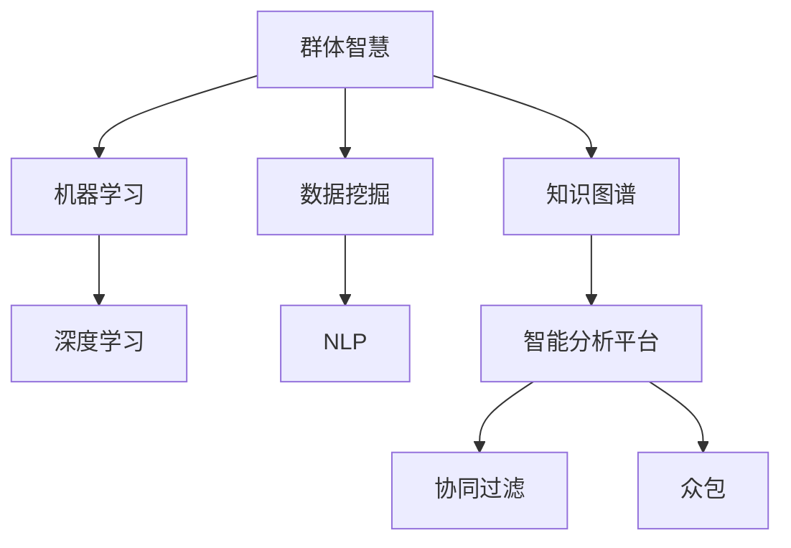

                 

# 群体智慧：决策的新引擎

## 1. 背景介绍

### 1.1 问题由来
随着互联网和信息技术的发展，数据的获取和处理变得越来越容易。然而，面对海量的数据和复杂的决策问题，单纯依靠人工智能已经不足以应对所有挑战。群体智慧（Collective Intelligence），作为一种新型的决策模式，近年来逐渐成为决策科学的研究热点。

群体智慧是指通过汇集来自多个个体、群体或组织的信息，利用计算技术和智能算法，实现高效、精准、透明的决策过程。它涵盖了数据获取、数据处理、知识挖掘、智能分析、决策制定等多个环节，能够更好地适应复杂多变的现实环境。

### 1.2 问题核心关键点
群体智慧的核心在于如何构建高效的智能决策系统，以应对不同的决策场景。它不仅需要充分利用大数据和计算技术，还需要结合人类智慧的深度参与。以下是几个关键点：

- 数据驱动决策：依赖高质量的数据，通过数据清洗、特征工程等技术，构建智能模型进行决策支持。
- 知识图谱：通过建立领域知识图谱，提供领域内专家知识的查询和推理，辅助智能决策。
- 智能分析算法：采用机器学习、深度学习等技术，从数据中提取模式、进行预测和分类，优化决策结果。
- 用户参与：结合人类专家的经验和直觉，引入群体协作、众包等机制，提升决策质量和效果。
- 透明可解释：构建透明的决策过程，使得每个决策步骤都能被解释和理解，增强决策的可信度。

## 2. 核心概念与联系

### 2.1 核心概念概述

为更好地理解群体智慧的决策过程，本节将介绍几个关键概念：

- 群体智慧（Collective Intelligence）：一种通过汇集多源信息、利用计算技术和智能算法，实现高效、精准、透明决策的决策模式。

- 数据挖掘（Data Mining）：从大量数据中提取有价值信息、发现模式和趋势的过程。

- 机器学习（Machine Learning）：通过数据训练模型，实现对未知数据的预测、分类、聚类等任务。

- 深度学习（Deep Learning）：一种基于神经网络的机器学习技术，具有强大的模式识别和自适应能力。

- 自然语言处理（Natural Language Processing，NLP）：使计算机理解、处理和生成人类语言的技术，在智能分析中起到关键作用。

- 知识图谱（Knowledge Graph）：一种描述实体和它们之间关系的图结构，用于表示领域知识，辅助智能决策。

- 智能分析平台（Intelligent Analysis Platform）：集成了数据管理、知识图谱、智能算法等组件的决策支持系统，用于自动化智能决策过程。

- 协同过滤（Collaborative Filtering）：一种基于用户或物品间相似性的推荐算法，广泛应用于个性化推荐系统。

- 众包（Crowdsourcing）：通过汇聚众人的智慧和能力，完成特定的任务或项目，提升决策的丰富性和多样性。

这些概念之间的逻辑关系可以通过以下Mermaid流程图来展示：



这个流程图展示了大数据时代下，智能决策过程中各个关键概念之间的关系：

1. 群体智慧依赖于数据挖掘，从海量数据中提取有价值的信息。
2. 机器学习和深度学习在数据挖掘的基础上，构建智能模型，提供预测和分类等决策支持。
3. NLP技术辅助理解文本数据，促进知识图谱的构建。
4. 知识图谱表示领域知识，辅助智能分析。
5. 智能分析平台集成了多种技术，提供自动化决策支持。
6. 协同过滤和众包机制引入用户参与，提升决策的丰富性和多样性。

## 3. 核心算法原理 & 具体操作步骤
### 3.1 算法原理概述

群体智慧决策的核心是构建高效的智能决策系统，该系统依赖于数据挖掘、智能分析和用户参与等多个环节。

在数据挖掘阶段，通过清洗和特征工程等技术，从大规模数据中提取有价值的信息，构建特征向量。在智能分析阶段，利用机器学习和深度学习等算法，对特征向量进行训练，构建智能模型。在用户参与阶段，结合人类专家的经验和直觉，引入协同过滤和众包等机制，提升决策质量和效果。

在具体的决策过程中，智能模型首先对输入的数据进行预处理和特征提取，然后通过模型计算得到初步的决策结果。接着，结合人类专家的反馈和经验，对初步结果进行修正和优化，最终输出最终的决策建议。

### 3.2 算法步骤详解

基于群体智慧的智能决策系统通常包括以下几个关键步骤：

**Step 1: 数据收集和预处理**
- 收集各类数据源，包括结构化数据（如数据库）、非结构化数据（如文本、图片）等。
- 进行数据清洗和预处理，如去除噪音、填补缺失值、数据归一化等。
- 进行特征工程，如提取特征、降维、编码等，构建特征向量。

**Step 2: 构建智能模型**
- 选择合适的机器学习或深度学习算法，如随机森林、神经网络等。
- 利用训练数据集对模型进行训练，优化模型参数。
- 在测试数据集上进行验证，评估模型性能。

**Step 3: 数据可视化与分析**
- 通过可视化技术，将数据和模型的输出结果直观展示，如使用热力图、散点图等。
- 结合专家知识，对数据进行深入分析，发现潜在的模式和规律。

**Step 4: 决策制定**
- 结合智能模型输出和专家知识，制定初步决策方案。
- 引入协同过滤和众包机制，进一步优化决策方案。
- 综合考虑各个维度的因素，制定最终的决策建议。

**Step 5: 结果反馈与迭代**
- 将决策结果反馈给执行者，并收集反馈信息。
- 根据反馈信息，对模型和算法进行迭代优化，提升决策效果。
- 定期评估决策效果，进行调整和优化，确保决策持续改进。

### 3.3 算法优缺点

基于群体智慧的智能决策系统具有以下优点：

- 融合多源数据：能够整合来自不同数据源的信息，提升决策的全面性和多样性。
- 利用人工智能：通过机器学习和深度学习等技术，自动提取特征和模式，提升决策的准确性和效率。
- 结合人类智慧：引入人类专家的经验和直觉，提升决策的可信度和适应性。
- 透明可解释：构建透明的决策过程，使得每个决策步骤都能被解释和理解。

同时，该方法也存在一定的局限性：

- 数据质量和隐私：决策质量依赖于数据的质量和隐私保护，不完整或不准确的数据会影响决策结果。
- 计算资源需求：大型的智能分析模型需要大量的计算资源，对硬件设施提出较高要求。
- 用户参与难度：协同过滤和众包等机制需要用户积极参与，而用户的不足参与或低质量输入会影响决策效果。
- 复杂决策过程：对于复杂的决策问题，需要综合多方面的信息，决策过程复杂且耗时。

尽管存在这些局限性，但就目前而言，基于群体智慧的智能决策系统仍是大数据时代下最有效的决策模式之一。未来相关研究的重点在于如何进一步提高数据质量和用户参与度，降低计算资源需求，简化决策过程。

### 3.4 算法应用领域

基于群体智慧的智能决策系统已经在多个领域得到了应用，例如：

- 金融风险管理：通过汇集金融市场数据、专家知识，构建智能分析模型，辅助风险评估和管理。
- 医疗诊断：利用医疗数据、医学知识图谱，辅助医生进行疾病诊断和治疗方案制定。
- 供应链管理：整合供应链各环节数据，结合专家经验，优化供应链决策和运营。
- 智能客服：通过分析用户反馈、历史交互数据，提供个性化的客服方案，提升客户满意度。
- 市场营销：分析消费者行为数据、市场趋势，优化广告投放策略和市场推广方案。
- 舆情监测：利用社交媒体数据、舆情分析算法，实时监测和分析舆论动态，辅助政策制定。

除了上述这些领域，群体智慧技术还在工业控制、物流管理、能源优化等多个领域展现出了巨大的应用潜力。

## 4. 数学模型和公式 & 详细讲解 & 举例说明

### 4.1 数学模型构建

在大数据时代下，群体智慧决策模型通常依赖于机器学习和深度学习技术，利用数据驱动和智能分析。

定义智能决策模型的输入特征向量为 $\mathbf{x}$，决策目标函数为 $f(\mathbf{x})$。决策模型的输出结果为 $\hat{y}$，与真实结果 $y$ 之间的误差为 $\epsilon$。

智能决策模型的目标是构建一个最小化误差 $\epsilon$ 的模型，即：

$$
\min_{f(\mathbf{x})} \epsilon(y, \hat{y})
$$

其中 $\epsilon(y, \hat{y})$ 为决策误差，常用的误差函数包括均方误差（MSE）、交叉熵（Cross-Entropy）等。

### 4.2 公式推导过程

以线性回归模型为例，推导其训练过程和误差函数。

假设决策目标为 $y$，模型输出为 $\hat{y}=\mathbf{w}^T\mathbf{x}+b$，其中 $\mathbf{w}$ 为权重向量，$b$ 为偏置。

均方误差（MSE）定义为：

$$
\epsilon(y, \hat{y}) = \frac{1}{n} \sum_{i=1}^n (y_i - \hat{y}_i)^2
$$

其中 $n$ 为样本数量。

为了最小化均方误差，对模型参数 $\mathbf{w}$ 和 $b$ 进行梯度下降优化：

$$
\mathbf{w} \leftarrow \mathbf{w} - \eta \nabla_{\mathbf{w}}\epsilon(y, \hat{y})
$$

$$
b \leftarrow b - \eta \nabla_{b}\epsilon(y, \hat{y})
$$

其中 $\eta$ 为学习率，$\nabla_{\mathbf{w}}\epsilon(y, \hat{y})$ 和 $\nabla_{b}\epsilon(y, \hat{y})$ 分别为误差函数对权重向量和偏置的梯度。

### 4.3 案例分析与讲解

以金融风险管理为例，分析其群体智慧决策流程。

假设某银行需要评估一笔贷款的风险，可以收集以下数据：

- 贷款金额、期限、利率等基本信息
- 借款人的历史信用记录
- 市场利率、宏观经济指标等外部环境数据
- 专家对类似贷款的风险评估结果

通过数据预处理和特征工程，将以上数据转换为特征向量 $\mathbf{x}$。利用随机森林或神经网络等模型，构建智能决策模型 $f(\mathbf{x})$。

在模型训练阶段，利用历史贷款数据集进行训练，优化模型参数。在模型测试阶段，将新的贷款申请数据代入模型，得到风险评估结果 $\hat{y}$。结合专家对市场环境和贷款用途的评估，对初步结果进行修正和优化，最终输出贷款是否批准的决策建议。

通过这种方式，银行能够在快速、准确、透明地评估贷款风险，提升决策质量和效率。

## 5. 项目实践：代码实例和详细解释说明

### 5.1 开发环境搭建

在进行群体智慧决策系统开发前，我们需要准备好开发环境。以下是使用Python进行TensorFlow开发的环境配置流程：

1. 安装Anaconda：从官网下载并安装Anaconda，用于创建独立的Python环境。

2. 创建并激活虚拟环境：
```bash
conda create -n tf-env python=3.8 
conda activate tf-env
```

3. 安装TensorFlow：根据CUDA版本，从官网获取对应的安装命令。例如：
```bash
conda install tensorflow
```

4. 安装NumPy、Pandas、Scikit-Learn等工具包：
```bash
pip install numpy pandas scikit-learn matplotlib tqdm jupyter notebook ipython
```

完成上述步骤后，即可在`tf-env`环境中开始决策系统开发。

### 5.2 源代码详细实现

下面我们以金融风险管理为例，给出使用TensorFlow进行智能决策模型的PyTorch代码实现。

首先，定义决策模型的输入特征和输出目标：

```python
import tensorflow as tf
from tensorflow.keras import layers

# 定义输入特征和输出目标
x = tf.keras.Input(shape=(8,))
y = tf.keras.Input(shape=())

# 定义决策模型
model = tf.keras.Sequential([
    layers.Dense(32, activation='relu'),
    layers.Dense(16, activation='relu'),
    layers.Dense(1, activation='sigmoid')
])

# 定义决策目标函数
def loss(y_true, y_pred):
    return tf.keras.losses.binary_crossentropy(y_true, y_pred)

# 定义优化器
optimizer = tf.keras.optimizers.Adam(learning_rate=0.001)

# 编译模型
model.compile(optimizer=optimizer, loss=loss, metrics=['accuracy'])
```

然后，定义训练和评估函数：

```python
# 定义训练函数
def train(model, train_dataset, epochs=100, batch_size=32):
    for epoch in range(epochs):
        for batch in train_dataset:
            x_batch, y_batch = batch
            with tf.GradientTape() as tape:
                y_pred = model(x_batch)
                loss_value = loss(y_batch, y_pred)
            gradients = tape.gradient(loss_value, model.trainable_variables)
            optimizer.apply_gradients(zip(gradients, model.trainable_variables))

# 定义评估函数
def evaluate(model, test_dataset, batch_size=32):
    test_loss, test_acc = model.evaluate(test_dataset)
    print('Test accuracy:', test_acc)
```

最后，启动训练流程并在测试集上评估：

```python
# 准备数据集
train_dataset = ...
test_dataset = ...

# 训练模型
train_model(model, train_dataset, epochs=100, batch_size=32)

# 评估模型
evaluate_model(model, test_dataset, batch_size=32)
```

以上就是使用TensorFlow对金融风险管理决策模型进行微调的完整代码实现。可以看到，得益于TensorFlow的强大封装，我们可以用相对简洁的代码完成决策模型的训练和评估。

### 5.3 代码解读与分析

让我们再详细解读一下关键代码的实现细节：

**决策模型定义**：
- `tf.keras.Input`定义输入特征和输出目标的维度。
- `tf.keras.Sequential`定义决策模型的结构，包括多个全连接层。
- `layers.Dense`定义各层的神经元个数和激活函数。
- `layers.Dense(1, activation='sigmoid')`定义输出层的神经元个数和激活函数。

**损失函数和优化器**：
- `tf.keras.losses.binary_crossentropy`定义二元分类任务的损失函数。
- `tf.keras.optimizers.Adam`定义Adam优化器，并设置学习率。

**训练函数**：
- `tf.GradientTape`定义梯度计算的上下文。
- `tape.gradient`计算模型输出的梯度。
- `optimizer.apply_gradients`更新模型参数。

**评估函数**：
- `model.evaluate`评估模型在测试集上的性能，并返回损失和准确率。

**训练流程**：
- 定义训练轮数和批次大小。
- 在训练函数中，利用数据集迭代训练，并计算每个批次上的损失和梯度。
- 在优化器中，应用梯度更新模型参数。
- 在评估函数中，评估模型在测试集上的性能。

可以看到，TensorFlow提供了方便的API接口，使得决策模型的实现变得简洁高效。开发者可以将更多精力放在模型设计和数据处理等高层逻辑上，而不必过多关注底层的实现细节。

当然，工业级的系统实现还需考虑更多因素，如模型的保存和部署、超参数的自动搜索、更灵活的任务适配层等。但核心的决策流程基本与此类似。

## 6. 实际应用场景

### 6.1 智能客服系统

基于群体智慧的智能客服系统，能够自动理解客户问题并提供精准回答。系统通过汇集客户历史咨询记录、专家知识库等数据，构建智能模型，辅助客服中心高效处理客户咨询。

在具体实现中，可以将客户问题作为输入，利用自然语言处理（NLP）技术提取语义信息，结合知识图谱查询专家知识，生成回答。同时，通过引入协同过滤和众包机制，让多名客服共同协作，优化回答质量。最终，系统根据客户反馈进行迭代优化，提升回答的准确性和满意度。

### 6.2 医疗诊断

在医疗领域，基于群体智慧的智能诊断系统能够辅助医生进行疾病诊断和治疗方案制定。系统通过整合医疗数据、医学知识图谱等资源，构建智能模型，进行疾病预测和诊断。

具体而言，医生将患者病情信息作为输入，系统自动提取特征，结合知识图谱中的专家知识，进行疾病预测和诊断。同时，引入专家评审机制，结合专家经验对诊断结果进行修正和优化，提升诊断的准确性和可靠性。

### 6.3 供应链管理

在供应链管理中，基于群体智慧的智能决策系统能够优化供应链的各个环节。系统通过整合供应链各环节的数据，构建智能模型，辅助供应链决策和运营。

具体而言，系统收集供应链各环节的数据，如生产量、库存、运输等，构建智能模型。通过优化模型，生成供应链优化方案，提升供应链的效率和效益。同时，引入专家评审机制，结合专家经验对优化方案进行修正和优化，确保供应链决策的科学性和合理性。

### 6.4 未来应用展望

随着群体智慧决策技术的发展，其在各个领域的深度应用将不断涌现，为社会和经济的发展带来新的动力。

在智慧城市治理中，智能决策系统能够辅助城市管理部门进行智能决策，提升城市管理水平和服务质量。如智能交通管理、智能能源管理等，将使城市更加智慧和高效。

在智慧医疗领域，智能诊断系统能够辅助医生进行疾病诊断和治疗方案制定，提升医疗服务的智能化和精准化水平。如智能影像诊断、智能药物推荐等，将使医疗服务更加高效和可靠。

在智慧教育领域，智能教学系统能够辅助教师进行教学设计和学生管理，提升教育质量和学习效果。如智能作业批改、智能学习路径推荐等，将使教育更加个性化和智能化。

此外，在金融、能源、制造等多个领域，基于群体智慧的智能决策系统也将展现出巨大的应用潜力。相信随着技术的不断进步，智能决策系统将在更多场景下发挥其独特价值，推动各行各业的数字化转型升级。

## 7. 工具和资源推荐

### 7.1 学习资源推荐

为了帮助开发者系统掌握群体智慧决策的理论基础和实践技巧，这里推荐一些优质的学习资源：

1. 《机器学习》（周志华）：经典机器学习教材，系统讲解了各类机器学习算法及其应用。

2. 《深度学习》（Ian Goodfellow）：深度学习领域的权威教材，涵盖了深度学习的基本原理和实践技巧。

3. 《自然语言处理综论》（Daniel Jurafsky & James H. Martin）：自然语言处理领域的经典教材，讲解了NLP的基本概念和技术。

4. TensorFlow官方文档：TensorFlow的官方文档，详细介绍了TensorFlow的使用方法和API接口。

5. Scikit-Learn官方文档：Scikit-Learn的官方文档，详细介绍了Scikit-Learn的使用方法和API接口。

6. Coursera机器学习课程：由斯坦福大学开设的机器学习课程，系统讲解了机器学习的理论和实践。

7. Udacity深度学习课程：Udacity深度学习课程，涵盖深度学习的基本原理和实践技巧。

通过对这些资源的学习实践，相信你一定能够快速掌握群体智慧决策的理论基础和实践技巧，并用于解决实际的决策问题。

### 7.2 开发工具推荐

高效的开发离不开优秀的工具支持。以下是几款用于群体智慧决策系统开发的常用工具：

1. TensorFlow：由Google主导开发的开源深度学习框架，生产部署方便，适合大规模工程应用。

2. Scikit-Learn：基于Python的机器学习库，提供了丰富的算法和工具，适用于数据预处理和特征工程。

3. PyTorch：由Facebook开发的深度学习框架，灵活动态的计算图，适合快速迭代研究。

4. Weights & Biases：模型训练的实验跟踪工具，可以记录和可视化模型训练过程中的各项指标，方便对比和调优。

5. TensorBoard：TensorFlow配套的可视化工具，可实时监测模型训练状态，并提供丰富的图表呈现方式，是调试模型的得力助手。

6. Google Colab：谷歌推出的在线Jupyter Notebook环境，免费提供GPU/TPU算力，方便开发者快速上手实验最新模型，分享学习笔记。

合理利用这些工具，可以显著提升群体智慧决策系统的开发效率，加快创新迭代的步伐。

### 7.3 相关论文推荐

群体智慧决策技术的发展源于学界的持续研究。以下是几篇奠基性的相关论文，推荐阅读：

1. "Collaborative Filtering for Recommender Systems"（H.Lee et al.）：提出协同过滤算法，用于推荐系统的数据挖掘任务。

2. "A Survey on Crowdsourcing and Human Computation"（K.B. Andersen et al.）：综述了众包和人类计算技术在各个领域的应用和效果。

3. "Knowledge Graphs for Healthcare"（E.L. Ochoa et al.）：讨论了知识图谱在医疗领域的应用，用于支持智能诊断和治疗方案制定。

4. "Collective Intelligence"（J. Weibel et al.）：介绍了群体智慧的概念、技术和管理机制，阐述了其应用前景和挑战。

5. "Deep Learning in NLP"（K. Li et al.）：讨论了深度学习在自然语言处理中的应用，包括语言建模、文本分类等任务。

6. "A Survey on Neural Architecture Search"（G. Zoph et al.）：综述了神经网络结构搜索技术，用于自动化设计高效、优化的神经网络模型。

这些论文代表了大数据时代下智能决策技术的发展脉络。通过学习这些前沿成果，可以帮助研究者把握学科前进方向，激发更多的创新灵感。

## 8. 总结：未来发展趋势与挑战

### 8.1 总结

本文对群体智慧决策技术进行了全面系统的介绍。首先阐述了群体智慧决策问题的由来和核心关键点，明确了数据驱动决策、智能分析和用户参与等关键环节。其次，从原理到实践，详细讲解了群体智慧决策模型的构建和优化过程，给出了决策系统开发的完整代码实例。同时，本文还广泛探讨了群体智慧技术在多个领域的应用前景，展示了其巨大的潜力。

通过本文的系统梳理，可以看到，群体智慧决策技术在大数据时代下展现出广阔的应用前景，在金融、医疗、供应链等多个领域展示了其独特价值。未来，随着技术的不断进步和应用的不断深化，群体智慧决策技术必将成为各个行业智能化转型升级的重要驱动力。

### 8.2 未来发展趋势

展望未来，群体智慧决策技术将呈现以下几个发展趋势：

1. 数据质量提升：随着数据获取和处理技术的不断进步，数据质量将不断提高。高品质的数据将为决策系统提供更可靠的基础，提升决策的准确性和可靠性。

2. 智能分析深化：机器学习和深度学习技术的不断发展，智能分析模型将更加高效和精准。复杂的决策问题将逐步得到解决，决策系统的智能化水平将显著提升。

3. 知识图谱扩展：知识图谱的应用将更加广泛，涵盖更多的领域和关系，辅助决策系统进行更加全面和深入的推理和分析。

4. 用户参与机制优化：通过引入更多的用户参与机制，如协同过滤、众包等，提升决策的丰富性和多样性，增强决策的可信度和适应性。

5. 透明可解释增强：构建透明的决策过程，使得每个决策步骤都能被解释和理解，增强决策的可信度和可控性。

6. 多模态数据融合：融合视觉、语音、文本等多种数据源，构建更全面、丰富的决策模型，提升决策的全面性和智能性。

这些趋势凸显了群体智慧决策技术的广阔前景，为智能决策系统提供了更多的创新方向和应用场景。

### 8.3 面临的挑战

尽管群体智慧决策技术已经取得了瞩目成就，但在迈向更加智能化、普适化应用的过程中，它仍面临诸多挑战：

1. 数据质量和隐私：决策质量依赖于数据的质量和隐私保护，不完整或不准确的数据会影响决策结果。如何在数据获取和处理中保障数据质量和隐私安全，是重要的研究方向。

2. 计算资源需求：大型的智能分析模型需要大量的计算资源，对硬件设施提出较高要求。如何在降低计算成本的同时提升决策质量，是一个重要的问题。

3. 用户参与难度：协同过滤和众包等机制需要用户积极参与，而用户的不足参与或低质量输入会影响决策效果。如何激励用户参与，提升用户参与度，是一个需要解决的问题。

4. 复杂决策过程：对于复杂的决策问题，需要综合多方面的信息，决策过程复杂且耗时。如何简化决策过程，提高决策效率，是一个重要的研究方向。

5. 透明可解释不足：当前的决策系统往往缺乏透明性和可解释性，难以解释其内部工作机制和决策逻辑。如何赋予决策系统更强的透明性和可解释性，是重要的研究方向。

6. 安全性有待保障：智能决策系统可能面临攻击和滥用，如何保障系统的安全性和鲁棒性，是一个需要解决的问题。

正视群体智慧决策技术面临的这些挑战，积极应对并寻求突破，将是大数据时代下智能决策技术迈向成熟的必由之路。

### 8.4 研究展望

面对群体智慧决策技术面临的种种挑战，未来的研究需要在以下几个方面寻求新的突破：

1. 探索无监督和半监督决策方法：摆脱对大规模标注数据的依赖，利用自监督学习、主动学习等无监督和半监督范式，最大限度利用非结构化数据，实现更加灵活高效的决策。

2. 研究参数高效和计算高效的决策范式：开发更加参数高效的决策方法，在固定大部分决策参数的同时，只更新极少量的任务相关参数。同时优化决策模型的计算图，减少前向传播和反向传播的资源消耗，实现更加轻量级、实时性的部署。

3. 引入因果分析和博弈论工具：将因果分析方法引入决策系统，识别出决策的关键特征，增强决策的因果性和逻辑性。借助博弈论工具刻画人机交互过程，主动探索并规避决策系统的脆弱点，提高系统稳定性。

4. 纳入伦理道德约束：在决策目标中引入伦理导向的评估指标，过滤和惩罚有偏见、有害的输出倾向。加强人工干预和审核，建立决策系统的监管机制，确保决策的公正性和安全性。

这些研究方向的探索，必将引领群体智慧决策技术迈向更高的台阶，为构建安全、可靠、可解释、可控的智能系统铺平道路。面向未来，群体智慧决策技术还需要与其他人工智能技术进行更深入的融合，如知识表示、因果推理、强化学习等，多路径协同发力，共同推动智能决策系统的进步。只有勇于创新、敢于突破，才能不断拓展决策系统的边界，让智能技术更好地造福人类社会。

## 9. 附录：常见问题与解答

**Q1：群体智慧决策系统是否适用于所有决策场景？**

A: 群体智慧决策系统在大多数决策场景中都能取得不错的效果，特别是对于数据量较大的决策问题。但对于一些需要高度保密、涉及国家安全等敏感决策场景，可能面临数据隐私和安全问题，需要谨慎应用。

**Q2：如何在决策过程中保障数据质量和隐私？**

A: 保障数据质量和隐私是群体智慧决策系统的重要问题。常见的保障措施包括：

1. 数据清洗和预处理：去除噪音、填补缺失值、数据归一化等，提升数据质量。

2. 数据脱敏：对敏感数据进行脱敏处理，保护用户隐私。

3. 数据加密：采用加密技术，保护数据在传输和存储过程中的安全性。

4. 访问控制：限制数据的访问权限，确保只有授权用户能够访问和使用数据。

5. 数据共享协议：制定数据共享协议，明确各方在数据共享中的责任和权利，保障数据安全和隐私。

**Q3：如何优化用户参与机制？**

A: 优化用户参与机制是提高群体智慧决策效果的关键。常见的优化措施包括：

1. 激励机制：设计合理的激励机制，鼓励用户积极参与。

2. 众包平台：建立众包平台，提供简单易用的工具，方便用户参与。

3. 多轮迭代：通过多轮迭代，逐步优化决策结果。

4. 反馈机制：建立反馈机制，及时收集用户意见，优化决策系统。

5. 用户画像：构建用户画像，了解用户背景和需求，提升用户参与度和决策效果。

**Q4：如何简化复杂决策过程？**

A: 简化复杂决策过程是提高决策效率的重要手段。常见的简化措施包括：

1. 决策树和规则引擎：构建决策树和规则引擎，简化决策流程。

2. 专家系统：引入专家系统，利用专家知识进行决策支持。

3. 自动化决策工具：开发自动化决策工具，提升决策效率和效果。

4. 模型压缩和优化：采用模型压缩和优化技术，减小模型尺寸，提升推理速度。

**Q5：如何增强决策系统的透明可解释性？**

A: 增强决策系统的透明可解释性是提升决策可信度的重要手段。常见的增强措施包括：

1. 可解释性模型：选择可解释性较强的模型，如决策树、规则引擎等。

2. 特征可视化：对特征进行可视化，帮助理解决策过程。

3. 决策规则解释：提取决策规则，解释决策过程。

4. 模型解释工具：使用模型解释工具，帮助理解模型输出和决策过程。

5. 用户反馈机制：建立用户反馈机制，收集用户意见，改进决策系统。

这些措施有助于提升决策系统的透明性和可解释性，增强决策的可信度和可控性。

---

作者：禅与计算机程序设计艺术 / Zen and the Art of Computer Programming

