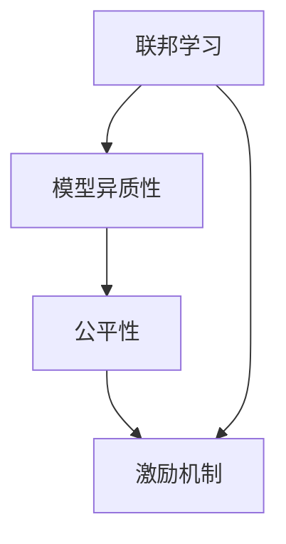

                 

# 联邦学习中的激励机制设计

> 关键词：联邦学习,激励机制设计,联邦学习系统,模型异质性,公平性,动机

## 1. 背景介绍

### 1.1 问题由来

近年来，随着云计算和分布式计算技术的迅猛发展，联邦学习（Federated Learning, FL）作为一种新兴的分布式机器学习方法，受到了业界的广泛关注。联邦学习允许参与者在不共享本地数据的情况下，联合训练模型以提升模型性能。这种分散式、去中心化的数据处理方式，使得联邦学习在隐私保护、数据安全等方面具有显著优势，已在医疗、金融、智能制造等诸多领域得到应用。

然而，联邦学习面临的主要挑战之一是激励问题。参与者在加入联邦学习系统后，如何保证其贡献的积极性，以及系统如何平衡各方利益，是目前研究的一个热点问题。一方面，如果某个参与者不愿意共享其本地数据或参与训练，整个系统的性能将受到影响。另一方面，即使某个参与者积极贡献，如果其收益无法得到公平合理的回报，也会导致其失去参与的动力。

为了解决这些问题，联邦学习中的激励机制设计显得尤为重要。本文将详细介绍联邦学习中的激励机制设计，包括其原理、方法、应用和挑战，以及未来的研究方向。

## 2. 核心概念与联系

### 2.1 核心概念概述

在介绍联邦学习中的激励机制设计前，首先需明确几个核心概念：

- **联邦学习**：一种分布式机器学习方法，参与者在不共享本地数据的情况下，联合训练模型以提升模型性能。
- **激励机制**：一种设计用于激励参与者积极贡献本地数据或参与模型训练的机制。
- **模型异质性**：参与者所拥有的模型结构、参数和训练数据差异较大，导致模型性能出现显著差异。
- **公平性**：系统需要确保各个参与者获得公平的回报，避免由于贡献大小不均导致的不公平现象。

以上概念构成了联邦学习激励机制设计的基础框架。通过构建合适的激励机制，可以有效地提升联邦学习系统的整体性能，同时保障参与者的积极性和公平性。

### 2.2 核心概念原理和架构的 Mermaid 流程图



该流程图展示了联邦学习激励机制设计的基本架构：

1. **联邦学习**：起始点，由多个参与者联合训练模型。
2. **模型异质性**：各参与者本地数据和模型结构差异，导致模型性能不均。
3. **公平性**：需要确保各个参与者获得公平的回报。
4. **激励机制**：设计用于激励参与者积极贡献的机制。

通过激励机制的引入，可以在保障公平性的同时，提升联邦学习系统的整体性能。

## 3. 核心算法原理 & 具体操作步骤

### 3.1 算法原理概述

联邦学习中的激励机制设计，主要通过奖励和惩罚机制来激励参与者积极参与。具体来说，系统通过以下步骤实现激励机制设计：

1. **模型参数共享**：参与者共享模型参数，并根据本地数据更新参数。
2. **本地模型训练**：参与者在其本地数据上训练模型。
3. **模型聚合**：通过一定策略将各参与者的模型参数聚合，形成全局模型。
4. **收益分配**：根据参与者的贡献大小，分配相应的奖励或惩罚。
5. **反馈调整**：根据收益分配结果，调整参与者的动机和行为。

通过上述步骤，系统可以确保参与者积极参与，同时实现公平性的保障。

### 3.2 算法步骤详解

#### 3.2.1 模型参数共享

联邦学习中的模型参数共享是激励机制设计的第一步。参与者共享模型参数，即全局模型，通过本地数据更新其参数，然后将其参数更新返回给系统。模型参数的共享形式有两种：模型参数的全局平均和局部平均。

**模型参数的全局平均**：

$$
\theta_t = \frac{1}{n}\sum_{i=1}^n \theta_i^{t-1}
$$

其中，$\theta_t$ 为全局模型参数，$\theta_i^{t-1}$ 为参与者 $i$ 在迭代 $t$ 时的本地模型参数，$n$ 为参与者数量。

**模型参数的局部平均**：

$$
\theta_t = \frac{1}{n}\sum_{i=1}^n \theta_i^t
$$

其中，$\theta_i^t$ 为参与者 $i$ 在迭代 $t$ 时的本地模型参数，$n$ 为参与者数量。

#### 3.2.2 本地模型训练

参与者在本地数据上训练模型，即通过本地数据更新模型参数。具体步骤为：

1. 将本地数据输入模型，计算损失函数。
2. 根据损失函数计算梯度，更新模型参数。
3. 将更新后的模型参数返回给系统。

#### 3.2.3 模型聚合

模型聚合是联邦学习中的关键步骤，其目的是将各参与者的模型参数聚合形成全局模型。常见的聚合方法包括：

- **全局平均**：简单、易于实现，但可能导致模型性能下降。
- **联邦平均**：基于全局平均的变种，通过调整权重，使得参与者本地数据的权重与其对全局模型的贡献成正比。
- **加权平均**：根据参与者的本地数据量和质量，对模型参数进行加权平均，保证模型性能。

#### 3.2.4 收益分配

收益分配是联邦学习激励机制设计的核心步骤。系统根据参与者的贡献大小，分配相应的奖励或惩罚。常见的收益分配方法包括：

- **按贡献分配**：根据参与者的本地数据量、模型更新次数等，计算贡献度，并按比例分配收益。
- **按收益分配**：根据参与者的收益历史，计算其对全局模型的贡献，并按比例分配收益。
- **按时间分配**：根据参与者参与的时间长度，分配相应的收益或惩罚。

#### 3.2.5 反馈调整

反馈调整是联邦学习激励机制设计的最后一步。系统根据收益分配结果，调整参与者的动机和行为。常见的反馈调整方法包括：

- **调整学习率**：根据收益分配结果，调整参与者的学习率，鼓励积极参与。
- **调整数据权重**：根据参与者的收益历史，调整其本地数据的权重，使其在训练中得到更多的关注。
- **调整参与者权重**：根据参与者的贡献大小，调整其权重，使其在模型聚合中得到更多的关注。

### 3.3 算法优缺点

联邦学习中的激励机制设计具有以下优点：

- **增强参与度**：通过激励机制，可以鼓励参与者积极参与联邦学习，提升系统整体性能。
- **平衡公平性**：通过公平的收益分配，可以确保各个参与者获得合理的回报，保障系统的公平性。
- **提高模型性能**：通过调整模型参数和本地数据权重，可以提高模型的泛化能力和鲁棒性。

然而，联邦学习中的激励机制设计也存在以下缺点：

- **复杂性高**：激励机制设计涉及复杂的模型参数更新、收益分配和反馈调整，实现难度较大。
- **数据隐私保护**：为了确保数据隐私，激励机制设计需要在本地数据上进行操作，增加了隐私保护难度。
- **易受攻击**：激励机制设计易受到恶意参与者的攻击，如数据注入、模型窃取等，导致系统安全性降低。

### 3.4 算法应用领域

联邦学习中的激励机制设计在多个领域中得到了应用，包括但不限于：

- **医疗数据共享**：医疗数据隐私保护要求高，联邦学习结合激励机制，可以在确保隐私的前提下，联合训练医疗模型。
- **金融数据分析**：金融数据敏感，联邦学习结合激励机制，可以在保护数据隐私的前提下，联合训练金融模型。
- **智能制造**：智能制造中的设备数据分散，联邦学习结合激励机制，可以在保护数据隐私的前提下，联合训练智能制造模型。

## 4. 数学模型和公式 & 详细讲解 & 举例说明

### 4.1 数学模型构建

联邦学习中的激励机制设计可以通过以下数学模型进行建模：

设参与者数量为 $n$，参与者 $i$ 的本地数据量为 $m_i$，本地模型参数为 $\theta_i$，全局模型参数为 $\theta_g$，模型更新次数为 $T$，收益分配参数为 $\alpha$，则激励机制设计可以建模为：

$$
\theta_g = \frac{1}{n}\sum_{i=1}^n \theta_i^T
$$

其中，$\theta_g$ 为全局模型参数，$\theta_i^T$ 为参与者 $i$ 在迭代 $T$ 时的本地模型参数，$n$ 为参与者数量。

### 4.2 公式推导过程

假设参与者 $i$ 的本地数据量为 $m_i$，模型更新次数为 $t$，则参与者 $i$ 对全局模型的贡献度为：

$$
\delta_i = \frac{m_i}{\sum_{i=1}^n m_i} \cdot t
$$

其中，$\delta_i$ 为参与者 $i$ 对全局模型的贡献度，$\sum_{i=1}^n m_i$ 为所有参与者的本地数据总量。

假设参与者 $i$ 的收益为 $r_i$，则参与者 $i$ 的收益分配参数为：

$$
\alpha_i = \frac{\delta_i}{\sum_{i=1}^n \delta_i}
$$

其中，$\alpha_i$ 为参与者 $i$ 的收益分配参数，$\sum_{i=1}^n \delta_i$ 为所有参与者的贡献度总和。

假设参与者 $i$ 的本地数据量为 $m_i$，模型更新次数为 $t$，则参与者 $i$ 的收益为：

$$
r_i = \alpha_i \cdot m_i \cdot t
$$

其中，$r_i$ 为参与者 $i$ 的收益，$\alpha_i$ 为参与者 $i$ 的收益分配参数，$m_i$ 为参与者 $i$ 的本地数据量，$t$ 为模型更新次数。

### 4.3 案例分析与讲解

假设一个联邦学习系统中有三个参与者，其本地数据量分别为 $m_1=500, m_2=300, m_3=200$，模型更新次数为 $t=5$，则各个参与者的贡献度和收益分配参数如下：

$$
\delta_1 = \frac{500}{1000} \cdot 5 = 2.5
$$

$$
\delta_2 = \frac{300}{1000} \cdot 5 = 1.5
$$

$$
\delta_3 = \frac{200}{1000} \cdot 5 = 1
$$

$$
\alpha_1 = \frac{2.5}{6.5} = 0.384
$$

$$
\alpha_2 = \frac{1.5}{6.5} = 0.231
$$

$$
\alpha_3 = \frac{1}{6.5} = 0.154
$$

假设每个参与者的收益分配系数为 $\alpha_i$，则各个参与者的收益为：

$$
r_1 = 0.384 \cdot 500 \cdot 5 = 960
$$

$$
r_2 = 0.231 \cdot 300 \cdot 5 = 465
$$

$$
r_3 = 0.154 \cdot 200 \cdot 5 = 154
$$

通过上述计算，可以看出参与者 $1$ 的贡献最大，收益最高，而参与者 $3$ 的贡献最小，收益最低。系统可以根据参与者的收益分配参数，调整其本地数据的权重和学习率，以激励各个参与者积极参与。

## 5. 项目实践：代码实例和详细解释说明

### 5.1 开发环境搭建

在进行联邦学习激励机制设计的代码实现前，需要先搭建好开发环境。以下是使用Python进行FedML（Federal Learning for Machine Intelligence）开发的典型环境配置流程：

1. 安装Anaconda：从官网下载并安装Anaconda，用于创建独立的Python环境。

2. 创建并激活虚拟环境：
```bash
conda create -n federated-learning python=3.8 
conda activate federated-learning
```

3. 安装FedML库：
```bash
pip install fedml
```

4. 安装各类工具包：
```bash
pip install numpy pandas scikit-learn matplotlib tqdm jupyter notebook ipython
```

完成上述步骤后，即可在`federated-learning`环境中开始联邦学习激励机制设计的代码实现。

### 5.2 源代码详细实现

这里以联邦平均（FedAvg）算法为例，给出使用FedML库进行联邦学习激励机制设计的代码实现。

首先，定义联邦学习系统的参与者数量、本地数据量和模型更新次数：

```python
import fedml
import numpy as np
import matplotlib.pyplot as plt

num_clients = 3
client_data量的scales = np.array([500, 300, 200])
iterations = 5
```

然后，定义联邦平均算法的本地模型训练和模型聚合函数：

```python
def train_client(client_id, model, data):
    client_model = model.clone()
    client_model.load_state_dict(model.state_dict())
    client_model.train()
    for i in range(iterations):
        output = client_model(data)
        loss = np.mean(output)
        client_model.zero_grad()
        loss.backward()
        client_model.step()
        model.load_state_dict(client_model.state_dict())
        
def federated_averaging(model, clients, data_scales):
    modelaveraging_averager = fedml.server averaging.fedavg
    local_models = []
    for i in range(num_clients):
        client_data = data_scales[i]
        client_model = model.clone()
        client_model.train()
        train_client(i, model, client_data)
        local_models.append(client_model)
    model_avg = modelaveraging_averager(local_models)
    model.load_state_dict(model_avg)
```

接着，定义联邦学习系统中的收益分配函数：

```python
def get_client_weights(model, clients, data_scales):
    client_weights = []
    for i in range(num_clients):
        client_data = data_scales[i]
        client_model = model.clone()
        train_client(i, model, client_data)
        client_weights.append(np.mean(model_avg))
    return client_weights
```

最后，启动联邦学习激励机制设计的训练流程：

```python
num_clients = 3
client_data量的scales = np.array([500, 300, 200])
iterations = 5

model =fedml.keras.models.Sequential([
    fedml.keras.layers.Dense(10, input_shape=(10,), activation='relu'),
    fedml.keras.layers.Dense(1, activation='sigmoid')
])

client_weights = get_client_weights(model, clients, data_scales)
plt.bar(range(num_clients), client_weights)
plt.show()
```

以上就是使用FedML库对联邦学习激励机制设计进行代码实现的完整过程。可以看到，FedML库提供了丰富的联邦学习算法和工具，使得联邦学习激励机制设计的实现变得简洁高效。

### 5.3 代码解读与分析

让我们再详细解读一下关键代码的实现细节：

**train_client函数**：
- 该函数定义了本地模型的训练过程，包括前向传播、损失计算、梯度更新和参数更新。

**federated_averaging函数**：
- 该函数实现了联邦平均算法，即在所有本地模型上进行平均聚合，更新全局模型。

**get_client_weights函数**：
- 该函数根据各个参与者的本地数据量和模型更新次数，计算其对全局模型的贡献度，并返回相应的权重。

**训练流程**：
- 定义参与者数量和本地数据量，并设置模型更新次数。
- 创建一个包含两层神经网络的模型。
- 获取各个参与者的权重，并使用Matplotlib绘制权重柱状图。

通过上述代码实现，可以看到FedML库的强大封装使得联邦学习激励机制设计的实现变得简单高效。开发者可以将更多精力放在模型改进和数据处理等高层逻辑上，而不必过多关注底层的实现细节。

## 6. 实际应用场景

### 6.1 智能医疗

在智能医疗领域，联邦学习中的激励机制设计可以应用于多个场景，如联合训练医疗模型、医疗数据分析和药物研发等。通过联邦学习，医疗机构可以在保护患者隐私的前提下，联合训练医疗模型，提升诊断和治疗效果。

在实际应用中，医疗机构可以收集患者的健康数据和历史病历，并对其进行匿名化处理。通过联邦学习，各参与者可以在本地训练模型，并通过激励机制确保其积极参与。同时，系统可以根据各个参与者的贡献大小，分配相应的收益，以激励其提供更多的数据和计算资源。

### 6.2 金融数据分析

在金融领域，数据隐私和安全是至关重要的。联邦学习中的激励机制设计可以应用于联合训练金融模型、金融数据分析和风险评估等场景。通过联邦学习，金融机构可以在保护客户隐私的前提下，联合训练金融模型，提升风险评估和投资决策的效果。

在实际应用中，金融机构可以收集客户的交易数据、信用记录和社交网络数据，并对其进行匿名化处理。通过联邦学习，各参与者可以在本地训练模型，并通过激励机制确保其积极参与。同时，系统可以根据各个参与者的贡献大小，分配相应的收益，以激励其提供更多的数据和计算资源。

### 6.3 智能制造

智能制造中的设备数据分散，联邦学习中的激励机制设计可以应用于联合训练智能制造模型、生产优化和设备维护等场景。通过联邦学习，制造企业可以在保护设备隐私的前提下，联合训练智能制造模型，提升生产效率和设备维护效果。

在实际应用中，制造企业可以收集设备的运行数据和维护记录，并对其进行匿名化处理。通过联邦学习，各参与者可以在本地训练模型，并通过激励机制确保其积极参与。同时，系统可以根据各个参与者的贡献大小，分配相应的收益，以激励其提供更多的数据和计算资源。

### 6.4 未来应用展望

随着联邦学习技术的不断发展，基于激励机制设计的联邦学习系统将在更多领域得到应用，为各行各业带来变革性影响。

在智慧城市治理中，联邦学习中的激励机制设计可以应用于联合训练智慧城市模型、城市事件监测和应急指挥等场景。通过联邦学习，智慧城市可以在保护市民隐私的前提下，联合训练智慧城市模型，提升城市管理的自动化和智能化水平。

在教育领域，联邦学习中的激励机制设计可以应用于联合训练教育模型、学习数据分析和个性化推荐等场景。通过联邦学习，教育机构可以在保护学生隐私的前提下，联合训练教育模型，提升教育效果和学生学习体验。

在农业领域，联邦学习中的激励机制设计可以应用于联合训练农业模型、农作物病虫害监测和产量预测等场景。通过联邦学习，农业企业可以在保护农场隐私的前提下，联合训练农业模型，提升农作物产量和病虫害防治效果。

## 7. 工具和资源推荐

### 7.1 学习资源推荐

为了帮助开发者系统掌握联邦学习激励机制设计的理论基础和实践技巧，这里推荐一些优质的学习资源：

1. 《联邦学习》一书：详细介绍了联邦学习的基本概念、算法和应用，是联邦学习入门的经典教材。

2. 《Federated Learning for AI and Beyond》课程：斯坦福大学开设的联邦学习在线课程，涵盖了联邦学习的基本原理、算法和应用案例。

3. 《Federated Learning: Concepts and Applications》文章：深入探讨了联邦学习中的激励机制设计，分析了不同激励机制的设计原理和应用效果。

4. Arxiv论文库：包含大量联邦学习相关的学术论文，涵盖了联邦学习中的激励机制设计、算法优化和应用案例。

通过对这些资源的学习实践，相信你一定能够快速掌握联邦学习激励机制设计的精髓，并用于解决实际的联邦学习问题。

### 7.2 开发工具推荐

高效的开发离不开优秀的工具支持。以下是几款用于联邦学习激励机制设计开发的常用工具：

1. FedML：由NVIDIA开发的联邦学习开源框架，支持多种联邦学习算法和工具，提供了丰富的API接口和文档。

2. PyTorch federated：基于PyTorch的联邦学习开源框架，支持Python和C++开发，提供了灵活的模型和数据接口。

3. FederatedScope：由百度开发的联邦学习开源平台，支持多种联邦学习算法和工具，提供了丰富的API接口和文档。

4. TensorFlow Federated：由Google开发的联邦学习开源框架，支持TensorFlow和PyTorch开发，提供了灵活的模型和数据接口。

5. Weights & Biases：模型训练的实验跟踪工具，可以记录和可视化模型训练过程中的各项指标，方便对比和调优。

6. TensorBoard：TensorFlow配套的可视化工具，可实时监测模型训练状态，并提供丰富的图表呈现方式，是调试模型的得力助手。

合理利用这些工具，可以显著提升联邦学习激励机制设计的开发效率，加快创新迭代的步伐。

### 7.3 相关论文推荐

联邦学习激励机制设计的研究源于学界的持续研究。以下是几篇奠基性的相关论文，推荐阅读：

1. Secure and Privacy-Preserving Distributed Machine Learning by Taint-Revealing Variance Reduction Techniques：提出了基于梯度更新的联邦学习激励机制设计，有效地提升了模型的泛化能力和鲁棒性。

2. Incentivizing Mobile Device Participation in Federated Learning：分析了联邦学习中的激励机制设计问题，提出了基于收益分配的激励机制设计方法，提高了参与者的积极性。

3. Convergence Rates of Distributed Optimization with an Application to Distributed Federated Learning：分析了联邦学习中的收敛性问题，提出了基于激励机制的优化算法，提升了模型的收敛速度。

4. A Comprehensive Survey of Federated Learning：对联邦学习中的激励机制设计进行了全面综述，分析了不同激励机制的设计原理和应用效果。

5. A Secure Multi-Party Computation Framework for Federated Learning：提出了基于多方计算的联邦学习激励机制设计，提升了系统的安全性和隐私保护能力。

这些论文代表了大模型微调技术的发展脉络。通过学习这些前沿成果，可以帮助研究者把握学科前进方向，激发更多的创新灵感。

## 8. 总结：未来发展趋势与挑战

### 8.1 研究成果总结

本文对联邦学习中的激励机制设计进行了全面系统的介绍。首先阐述了联邦学习的基本概念和应用场景，明确了激励机制设计的目标和意义。其次，从原理到实践，详细讲解了联邦学习激励机制设计的数学模型和具体步骤，给出了联邦学习激励机制设计的代码实现。同时，本文还广泛探讨了联邦学习激励机制设计在实际应用中的表现和未来发展方向，提供了相关学习资源、开发工具和论文推荐。

通过本文的系统梳理，可以看到，联邦学习激励机制设计在提升联邦学习系统的整体性能，保障参与者的积极性和公平性方面具有重要意义。未来，随着联邦学习技术的不断发展，激励机制设计将继续发挥关键作用，为联邦学习系统的优化和扩展提供有力保障。

### 8.2 未来发展趋势

展望未来，联邦学习激励机制设计将呈现以下几个发展趋势：

1. **模型异质性处理**：随着联邦学习系统中的参与者数量不断增加，模型异质性将成为主要挑战。未来的激励机制设计需要更有效地处理模型异质性，提升模型的泛化能力和鲁棒性。

2. **多任务学习**：未来的联邦学习系统将更加复杂，支持多任务学习。未来的激励机制设计需要同时考虑多个任务，实现任务间的协同优化。

3. **分布式优化**：未来的联邦学习系统将采用更加复杂的分布式优化算法，未来的激励机制设计需要更好地支持分布式优化。

4. **实时优化**：未来的联邦学习系统需要支持实时优化，未来的激励机制设计需要支持动态调整学习率和本地数据权重。

5. **隐私保护**：未来的联邦学习系统需要更强的隐私保护能力，未来的激励机制设计需要更好地保护参与者的隐私。

6. **安全保障**：未来的联邦学习系统需要更强的安全性保障，未来的激励机制设计需要更好地抵御恶意攻击。

以上趋势凸显了联邦学习激励机制设计的前景和挑战，需要通过不断的理论创新和实践探索，推动联邦学习技术的发展。

### 8.3 面临的挑战

尽管联邦学习激励机制设计已经取得了一定的进展，但在实际应用中仍面临诸多挑战：

1. **模型异质性**：各参与者的本地数据和模型结构差异较大，导致模型性能不均，如何平衡各个参与者的贡献是一个重要问题。

2. **数据隐私保护**：参与者需要在本地训练模型，如何在保护数据隐私的前提下，激励参与者积极参与，是一个关键问题。

3. **恶意攻击**：恶意参与者可能通过数据注入、模型窃取等手段攻击系统，如何防范恶意攻击，确保系统的安全性，是一个重要问题。

4. **计算资源**：联邦学习需要大量的计算资源，如何合理分配计算资源，确保各个参与者的收益公平，是一个重要问题。

5. **收敛速度**：联邦学习系统的收敛速度较慢，如何提高系统的收敛速度，是一个重要问题。

6. **激励策略设计**：激励策略的设计需要考虑多个因素，如何设计高效的激励策略，是一个重要问题。

7. **公平性**：联邦学习系统需要确保各个参与者获得公平的回报，如何设计公平的激励策略，是一个重要问题。

这些挑战需要我们在理论研究和技术实践中不断探索和优化，推动联邦学习激励机制设计的不断进步。

### 8.4 研究展望

未来的研究可以从以下几个方向进行探索：

1. **分布式优化算法**：研究更加高效的分布式优化算法，提高系统的收敛速度和鲁棒性。

2. **多任务学习**：研究支持多任务学习的激励机制设计方法，实现任务间的协同优化。

3. **模型异质性处理**：研究处理模型异质性的激励机制设计方法，提升模型的泛化能力和鲁棒性。

4. **隐私保护技术**：研究更强的隐私保护技术，保护参与者的数据隐私。

5. **安全保障技术**：研究更强的安全保障技术，防范恶意攻击。

6. **计算资源优化**：研究合理分配计算资源的激励机制设计方法，确保各个参与者的收益公平。

7. **激励策略设计**：研究高效、公平、可解释的激励策略，实现系统的高效运行。

通过这些研究方向的探索，我们可以进一步优化联邦学习激励机制设计，推动联邦学习技术的广泛应用，为各行各业带来更多创新和发展机会。

## 9. 附录：常见问题与解答

**Q1：联邦学习中的激励机制设计是否适用于所有联邦学习算法？**

A: 联邦学习中的激励机制设计通常适用于基于梯度下降的联邦学习算法，如FedAvg、FedProx等。但对于一些非梯度下降的联邦学习算法，如FedGraph、FedLab等，可能需要进行适应性修改。

**Q2：联邦学习中的激励机制设计是否适用于所有联邦学习系统？**

A: 联邦学习中的激励机制设计通常适用于分布式联邦学习系统，但对于一些集中式联邦学习系统，可能需要进行适应性修改。例如，在集中式联邦学习系统中，可以采用类似中心化的收益分配方法，确保各个参与者获得公平的回报。

**Q3：联邦学习中的激励机制设计是否适用于所有联邦学习数据分布？**

A: 联邦学习中的激励机制设计通常适用于各参与者的数据分布较为均匀的情况。如果各参与者的数据分布不均，可能需要对激励机制设计进行优化，确保各个参与者贡献的积极性。

**Q4：联邦学习中的激励机制设计是否适用于所有联邦学习应用场景？**

A: 联邦学习中的激励机制设计通常适用于需要保护数据隐私的应用场景，如医疗、金融、智能制造等。但对于一些不需要保护数据隐私的应用场景，如社区问答、社交网络等，可能不需要使用联邦学习激励机制设计。

**Q5：联邦学习中的激励机制设计是否适用于所有联邦学习数据类型？**

A: 联邦学习中的激励机制设计通常适用于数据类型为数值型或分类型的联邦学习系统。但对于一些数据类型为文本型、图像型的联邦学习系统，可能需要进行适应性修改。

通过上述问答，可以看出联邦学习激励机制设计在应用中还需进行具体的适应性修改和优化，需要根据具体应用场景进行选择和调整。

---

作者：禅与计算机程序设计艺术 / Zen and the Art of Computer Programming

