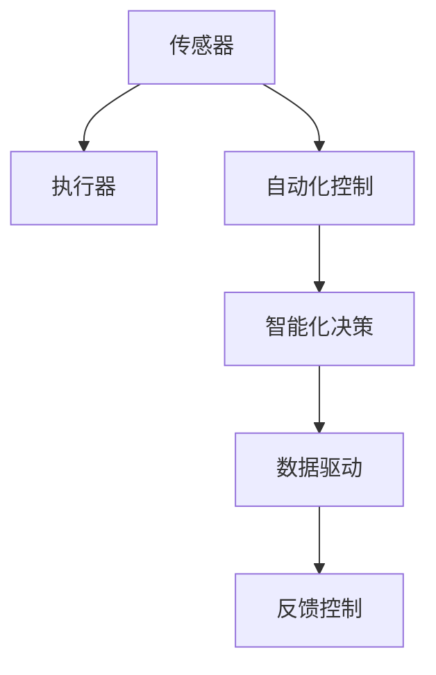

                 

# 自动化的最新发展与应用

## 1. 背景介绍

自动化技术是人类历史上最重要的技术创新之一，它不仅极大地提升了生产效率，还推动了社会进步和经济发展。如今，随着人工智能（AI）技术的兴起，自动化正在迎来新一轮的变革。从机器人到智能系统，从自动驾驶到自动化决策，AI正逐渐渗透到各行各业，改变着人们的工作和生活方式。本文将探讨自动化的最新发展及其在不同领域的应用。

### 1.1 自动化技术的历史演进

自动化的概念最早可以追溯到工业革命时期。机械自动化、电气自动化、计算机自动化，直到如今的人工智能自动化，每一次技术的进步都极大地推动了生产力的提升和社会的发展。

- **机械自动化**：早期的自动化主要依赖于机械装置，如织布机、蒸汽机等。这些机械装置通过预设的程序自动完成重复性工作。
- **电气自动化**：20世纪初，电气自动化技术的引入使得自动化生产更加灵活和高效。电气控制系统可以实时调整生产过程，提高生产线的适应性。
- **计算机自动化**：随着计算机技术的成熟，自动化的范围进一步扩大，从工厂自动化到办公室自动化，计算机系统成为自动化过程中不可或缺的一部分。
- **人工智能自动化**：近年来，人工智能技术的发展使得自动化进入了一个全新的阶段。AI系统不仅可以执行复杂的任务，还能进行自我学习和优化。

### 1.2 自动化技术的现状与趋势

当前，自动化技术已经在多个领域取得了显著进展，未来还将在更广泛的领域得到应用。

- **制造业自动化**：工业机器人、自动化生产线等技术已经广泛应用于制造业，极大地提升了生产效率和产品质量。
- **物流自动化**：无人机、自动化仓储系统等技术正在改变传统物流行业的面貌，提高物流效率和准确性。
- **医疗自动化**：智能诊断系统、机器人手术等技术在医疗领域的应用，正在改变传统的医疗模式，提升医疗服务质量。
- **金融自动化**：智能投顾、自动化风险控制等技术正在改变金融行业的运作方式，提高金融服务效率和安全性。
- **客服自动化**：基于AI的聊天机器人、语音助手等技术正在改变传统的客服模式，提供更高效、更个性化的客户服务。

## 2. 核心概念与联系

### 2.1 核心概念概述

自动化技术的核心概念包括自动化控制、智能化决策、数据驱动等。这些概念之间相互联系，共同构成了自动化技术的生态体系。

- **自动化控制**：自动化控制技术通过传感器、执行器等硬件设备，对生产过程进行实时监控和调整，实现自动化的控制。
- **智能化决策**：智能化决策技术通过机器学习、深度学习等算法，对大量数据进行分析，生成最优的决策方案。
- **数据驱动**：数据驱动技术通过收集和分析数据，为自动化控制和智能化决策提供支持，提高系统的可靠性和精度。

### 2.2 核心概念原理和架构的 Mermaid 流程图



### 2.3 核心概念之间的关系

以上流程图展示了自动化技术中各概念之间的相互关系。传感器采集数据，执行器根据控制指令执行操作，自动化控制技术实现实时监控和调整，智能化决策技术通过数据分析生成最优方案，数据驱动技术为整个系统提供支持，反馈控制确保系统的稳定性和精度。

## 3. 核心算法原理 & 具体操作步骤

### 3.1 算法原理概述

自动化的核心算法原理主要包括自动化控制算法、智能化决策算法、数据驱动算法等。这些算法共同作用，实现自动化的目标。

- **自动化控制算法**：包括PID控制、模糊控制、自适应控制等，通过不断调整控制参数，实现系统的稳定运行。
- **智能化决策算法**：包括强化学习、深度学习、进化算法等，通过学习历史数据和实时数据，生成最优的决策方案。
- **数据驱动算法**：包括数据采集、数据预处理、特征工程、模型训练等，为自动化控制和智能化决策提供数据支持。

### 3.2 算法步骤详解

自动化技术的实现过程可以分为以下几个步骤：

1. **需求分析**：明确自动化的目标和需求，确定自动化系统的功能和性能要求。
2. **系统设计**：根据需求分析结果，设计系统的总体架构和组件结构。
3. **硬件部署**：安装和配置所需的传感器、执行器、控制器等硬件设备。
4. **软件开发**：开发自动化控制、智能化决策、数据驱动等软件模块，实现系统的自动化功能。
5. **系统测试**：对系统进行全面测试，确保各组件能够协同工作，满足性能要求。
6. **系统优化**：根据测试结果，优化系统参数和算法，提高系统的稳定性和效率。
7. **系统部署**：将系统部署到实际环境中，进行长时间运行，验证系统的可靠性和实用性。

### 3.3 算法优缺点

自动化技术的优点包括：

- **提高效率**：自动化系统能够自动完成重复性、高强度的工作，显著提高生产效率。
- **降低成本**：自动化系统减少了人力成本和错误率，降低了生产成本。
- **提升质量**：自动化系统能够实现更精确的测量和控制，提高产品质量和一致性。

自动化技术的缺点包括：

- **初始投资高**：自动化系统的初始投资成本较高，包括硬件设备和软件开发的费用。
- **灵活性不足**：自动化系统的设计和实现需要较长时间，难以快速应对变化的需求。
- **依赖技术**：自动化系统的性能和可靠性依赖于技术成熟度和维护水平。

### 3.4 算法应用领域

自动化技术广泛应用于多个领域，以下是几个典型的应用场景：

- **制造业**：自动化生产线、机器人臂、质量检测系统等，提高生产效率和产品质量。
- **物流**：自动化仓储系统、无人机配送、智能调度系统等，提升物流效率和准确性。
- **医疗**：智能诊断系统、机器人手术、药物自动分配系统等，提高医疗服务质量和效率。
- **金融**：智能投顾、自动化风险控制、金融市场预测等，提高金融服务效率和安全性。
- **客服**：基于AI的聊天机器人、语音助手等，提供更高效、个性化的客户服务。

## 4. 数学模型和公式 & 详细讲解 & 举例说明

### 4.1 数学模型构建

自动化技术中的数学模型主要包括控制模型、决策模型、数据模型等。这些模型通过数学公式描述系统的行为和决策过程。

- **控制模型**：描述控制系统输入、输出之间的关系，常用的控制模型包括PID控制、自适应控制等。
- **决策模型**：描述决策系统的输入、输出和决策过程，常用的决策模型包括强化学习、决策树等。
- **数据模型**：描述数据采集、存储、分析和应用的过程，常用的数据模型包括回归模型、分类模型等。

### 4.2 公式推导过程

以PID控制算法为例，推导其控制过程的数学公式。

PID控制算法是一种常用的自动控制算法，通过比例控制（P）、积分控制（I）和微分控制（D）来实现系统的稳定控制。

设系统的状态变量为$x(t)$，控制量为$u(t)$，目标输出为$y_d(t)$，PID控制器的控制规则为：

$$
u(t) = K_p(x(t) - x_d(t)) + K_i\int_{0}^{t}(x(t) - x_d(t))dt + K_d\frac{dx(t)}{dt}
$$

其中：
- $K_p$：比例控制系数
- $K_i$：积分控制系数
- $K_d$：微分控制系数
- $x_d(t)$：目标输出
- $\int_{0}^{t}(x(t) - x_d(t))dt$：积分项
- $\frac{dx(t)}{dt}$：微分项

### 4.3 案例分析与讲解

以下是一个PID控制算法在自动化系统中的应用案例。

假设一个自动化生产线，需要控制生产过程中的温度和压力，以确保产品质量。通过传感器实时采集温度和压力数据，PID控制器根据设定值和实际值计算控制量，控制加热器和压力调节器，实现系统的稳定控制。

**设计流程**：
1. 确定目标温度和压力
2. 设计PID控制器，确定控制系数
3. 安装传感器和执行器，进行系统的硬件部署
4. 开发PID控制算法，进行系统的软件开发
5. 测试和优化PID控制算法，确保系统稳定运行

**系统运行**：
1. 传感器实时采集温度和压力数据
2. PID控制器根据目标值和实际值计算控制量
3. 执行器根据控制量调节加热器和压力调节器
4. 系统保持温度和压力的稳定，确保产品质量

## 5. 项目实践：代码实例和详细解释说明

### 5.1 开发环境搭建

在开始项目实践之前，需要搭建好开发环境。以下是具体的步骤：

1. **安装Python**：Python是自动化系统开发中最常用的编程语言，可以从官网下载并安装最新版本。
2. **安装相关库**：安装所需的库和工具，如NumPy、Pandas、SciPy、Matplotlib等。
3. **配置开发环境**：配置开发环境，包括IDE、调试工具、版本控制系统等。

### 5.2 源代码详细实现

以下是一个简单的PID控制器代码实现，用于控制自动化系统中的温度。

```python
import numpy as np

def pid_controller(target, timesteps, dt, Kp, Ki, Kd):
    prev_error = 0
    integral = 0
    control_signal = np.zeros(timesteps)
    
    for t in range(timesteps):
        error = target - process(t)
        process_signal = Kp * error + Ki * integral + Kd * error_diff
        integral += error * dt
        error_diff = error - prev_error
        prev_error = error
        control_signal[t] = process_signal
    
    return control_signal

def process(t, process_signal):
    # 假设系统的控制规则为 PID 控制
    return process_signal

# 参数设置
target = 100
timesteps = 1000
dt = 0.01
Kp = 1
Ki = 0.1
Kd = 0.01

# 计算控制信号
control_signal = pid_controller(target, timesteps, dt, Kp, Ki, Kd)

# 显示控制信号
print(control_signal)
```

### 5.3 代码解读与分析

以上代码实现了一个简单的PID控制器，用于控制自动化系统中的温度。以下是代码的详细解读和分析：

- **PID控制器函数**：该函数实现PID控制算法，接收目标值、时间步长、采样时间、比例系数、积分系数和微分系数作为参数，返回控制信号。
- **过程函数**：该函数模拟系统的控制过程，接收时间步长和控制信号作为参数，返回系统的状态。
- **参数设置**：设置目标温度、时间步长、采样时间、比例系数、积分系数和微分系数。
- **计算控制信号**：调用PID控制器函数，计算控制信号。
- **显示控制信号**：输出控制信号。

### 5.4 运行结果展示

运行上述代码，输出控制信号的数组，展示PID控制器的工作过程。

## 6. 实际应用场景

### 6.1 智能制造

智能制造是自动化技术的重要应用领域，通过自动化设备和系统，实现生产的数字化、智能化和柔性化。

智能制造包括以下几个方面：

- **自动化生产线**：通过机器人臂、自动化输送线、智能检测设备等，实现生产线的自动化和智能化。
- **工业物联网**：通过传感器、控制器、执行器等设备，实现设备的互联互通和数据共享。
- **智能质量管理**：通过数据分析和机器学习，实现产品的质量检测和异常预警。

### 6.2 智能物流

智能物流通过自动化设备和系统，提高物流效率和准确性，降低运营成本。

智能物流包括以下几个方面：

- **自动化仓储系统**：通过自动化存储、拣选、分拣设备，实现仓储的自动化管理。
- **无人机配送**：通过无人机自动飞行和智能导航，实现货物的快速配送。
- **智能调度系统**：通过数据驱动和智能化决策，实现运输车辆的优化调度和路径规划。

### 6.3 智能医疗

智能医疗通过自动化设备和系统，提高医疗服务的质量和效率，降低医疗成本。

智能医疗包括以下几个方面：

- **智能诊断系统**：通过图像识别和深度学习，实现疾病的智能诊断和分析。
- **机器人手术**：通过机器人臂和控制系统，实现手术的自动化和精准控制。
- **药物自动分配系统**：通过智能分配器，实现药品的自动分配和管理。

### 6.4 智能金融

智能金融通过自动化设备和系统，提高金融服务的效率和安全性，降低风险和成本。

智能金融包括以下几个方面：

- **智能投顾**：通过智能算法和数据分析，实现投资决策的自动化和优化。
- **自动化风险控制**：通过实时监控和数据分析，实现风险的自动预警和控制。
- **金融市场预测**：通过机器学习和深度学习，实现市场趋势的预测和分析。

## 7. 工具和资源推荐

### 7.1 学习资源推荐

自动化技术的快速发展和广泛应用，需要不断学习和更新知识。以下是一些优质的学习资源，推荐阅读：

- **《机器人学导论》**：全面介绍了机器人的基本概念、原理和应用，适合初学者和进阶者。
- **《人工智能：一种现代的方法》**：涵盖了AI技术的各个方面，从基础知识到前沿技术，适合广大学生和从业者。
- **Coursera《自动驾驶》课程**：由斯坦福大学教授主讲，介绍了自动驾驶技术的原理和应用，适合对自动驾驶感兴趣的人士。
- **Kaggle竞赛**：Kaggle是一个数据科学竞赛平台，通过参与竞赛，可以获得实践经验和最新技术。

### 7.2 开发工具推荐

自动化技术的开发需要借助各种工具和平台，以下是一些常用的工具和平台：

- **Python**：Python是最常用的编程语言之一，支持自动化系统的开发和应用。
- **NumPy**：NumPy是一个科学计算库，提供了高效的数学计算和数据分析功能。
- **Pandas**：Pandas是一个数据处理库，支持数据的导入、清洗、分析和可视化。
- **Matplotlib**：Matplotlib是一个绘图库，支持数据的可视化展示。
- **Jupyter Notebook**：Jupyter Notebook是一个交互式编程环境，支持Python代码的开发和调试。
- **TensorFlow**：TensorFlow是一个深度学习框架，支持神经网络模型的开发和训练。

### 7.3 相关论文推荐

自动化技术的不断发展，离不开学术界和工业界的研究和探索。以下是一些重要的研究论文，推荐阅读：

- **《基于PID控制的机器人系统设计》**：介绍了PID控制算法在机器人系统中的应用，适合初学者和从业者。
- **《强化学习在自动驾驶中的应用》**：介绍了强化学习在自动驾驶中的实现和应用，适合对自动驾驶感兴趣的人士。
- **《智能制造系统的设计和管理》**：介绍了智能制造系统的设计和管理方法，适合制造业从业人员和管理人员。
- **《人工智能在医疗中的应用》**：介绍了人工智能在医疗中的应用，适合医疗从业人员和研究人员。

## 8. 总结：未来发展趋势与挑战

### 8.1 研究成果总结

自动化技术在过去几十年中取得了巨大的进步，广泛应用于各个领域。未来，随着AI技术的进一步发展，自动化技术将迎来新的变革。

### 8.2 未来发展趋势

自动化技术的未来发展趋势包括以下几个方面：

- **更广泛的应用**：自动化技术将广泛应用于更多的领域，如农业、环保、能源等。
- **更高的智能化水平**：AI技术将进一步融入自动化系统，实现更高级的智能化控制和决策。
- **更灵活的适应性**：自动化系统将具备更强的适应性，能够快速应对变化的需求和环境。
- **更高的安全性和可靠性**：自动化系统将具备更高的安全性和可靠性，减少故障和事故的发生。

### 8.3 面临的挑战

尽管自动化技术在许多领域取得了成功，但在实际应用中也面临一些挑战：

- **初始成本高**：自动化系统的初始投资成本较高，需要较长时间才能收回成本。
- **技术复杂**：自动化系统的设计和实现需要较高的技术水平，对从业人员的要求较高。
- **维护和升级**：自动化系统的维护和升级需要投入大量时间和资源，需要专门的维护人员和技术支持。

### 8.4 研究展望

未来的研究需要从以下几个方面进行探索：

- **智能优化**：研究更高效的智能优化算法，提高自动化系统的控制和决策能力。
- **多模态融合**：研究多模态数据融合技术，实现更全面和精确的系统感知。
- **实时监控**：研究实时监控和反馈控制技术，提高自动化系统的稳定性和可靠性。
- **人机协作**：研究人机协作系统，实现人与机器的协同工作，提高自动化系统的灵活性和适应性。

## 9. 附录：常见问题与解答

### Q1：自动化技术在各个行业的应用有哪些？

**A**：自动化技术在制造业、物流、医疗、金融、客服等多个行业得到了广泛应用。例如，在制造业中，自动化生产线、工业物联网、智能质量管理等技术被广泛应用；在物流中，自动化仓储系统、无人机配送、智能调度系统等技术被广泛应用；在医疗中，智能诊断系统、机器人手术、药物自动分配系统等技术被广泛应用；在金融中，智能投顾、自动化风险控制、金融市场预测等技术被广泛应用；在客服中，基于AI的聊天机器人、语音助手等技术被广泛应用。

### Q2：自动化技术的优缺点有哪些？

**A**：自动化技术的优点包括提高效率、降低成本、提升质量等。然而，自动化技术也存在一些缺点，如初始投资高、灵活性不足、依赖技术等。

### Q3：如何应对自动化技术的挑战？

**A**：应对自动化技术的挑战需要从多个方面进行探索。例如，在成本方面，可以通过大规模生产、优化设计和优化算法来降低初始投资成本；在灵活性方面，可以通过模块化设计和灵活配置来实现系统的快速适应；在技术方面，可以通过持续学习和技术创新来提升自动化系统的性能和可靠性。

### Q4：自动化技术的未来发展方向是什么？

**A**：自动化技术的未来发展方向包括更广泛的应用、更高的智能化水平、更灵活的适应性、更高的安全性和可靠性等。例如，未来自动化技术将广泛应用于更多的领域，如农业、环保、能源等；AI技术将进一步融入自动化系统，实现更高级的智能化控制和决策；自动化系统将具备更强的适应性，能够快速应对变化的需求和环境；自动化系统将具备更高的安全性和可靠性，减少故障和事故的发生。

---

作者：禅与计算机程序设计艺术 / Zen and the Art of Computer Programming

