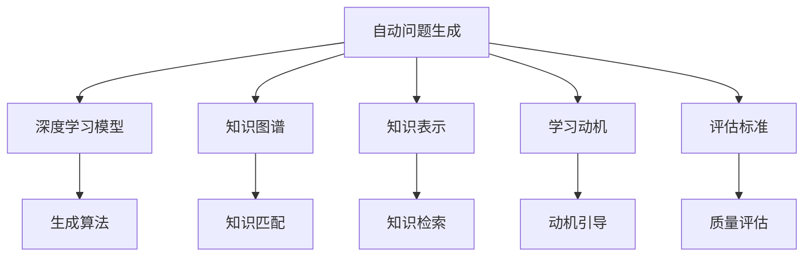

                 

# 自动问题生成：教育与测试应用

## 1. 背景介绍

### 1.1 问题由来
自动问题生成(Automatic Question Generation, AQG)作为自然语言处理(NLP)的一个重要子领域，是指通过计算机自动生成高质量的考试题、问答对、对话场景等问题文本的技术。其核心在于构建一个能够理解问题意图、匹配知识体系、生成结构合理、语义清晰的自动问题生成系统。

自动问题生成在教育领域有着广泛的应用前景。传统的教学评估以教师为主导，费时费力且主观性强，难以全面、公正地评估学生的学习效果。而自动问题生成可以显著降低评估成本，提高评估效率和公正性。在智能辅助学习系统、个性化教学方案设计、自适应考试等领域，自动问题生成同样有着重要的应用价值。

### 1.2 问题核心关键点
自动问题生成的关键在于设计有效的生成模型，确保生成的文本既符合语法和语义规范，又能够符合教学目标和内容要求。目前常用的生成方法包括基于规则的生成、基于模板的生成和基于神经网络的生成。

其中，基于神经网络的生成方法以深度学习模型为主，能够自动学习问题生成规律，具备较强的泛化能力和灵活性。特别是自回归模型（如GPT、BERT等）在问题生成任务中表现优异，广泛应用于各种教育场景中。

### 1.3 问题研究意义
自动问题生成在教育评估和测试中的应用，对于提升教育质量和效率具有重要意义：

1. **提高评估效率**：自动问题生成可以快速生成大量高质量的问题文本，降低教师的评估负担。
2. **增强评估公正性**：自动生成的问题样本更丰富、更客观，减少教师主观偏差，提高评估的公正性和可信度。
3. **支持个性化学习**：根据学生的学习进度和兴趣，自动生成个性化的学习问题和测试，提升个性化教学效果。
4. **促进教育公平**：通过自动化评估，确保每个学生都能获得公平的评价机会，促进教育公平。

## 2. 核心概念与联系

### 2.1 核心概念概述

为更好地理解自动问题生成，本节将介绍几个密切相关的核心概念：

- 自动问题生成(Automatic Question Generation)：指通过计算机自动生成高质量问题文本的过程。自动问题生成系统通常包含问题理解、知识匹配、问题生成等多个模块。
- 深度学习模型(Deep Learning Models)：如自回归模型（RNN、LSTM、GRU、Transformer等），能够自动学习复杂非线性的模式，适用于各种自然语言处理任务，包括问题生成。
- 知识图谱(Knowledge Graph)：用于表示实体与实体之间的关系，辅助问题生成时选择问题点。
- 知识表示(Knowledge Representation)：将知识表示为结构化的形式，便于问题生成系统检索和匹配。
- 学习动机(Learning Motivation)：指学生进行学习活动的心理动因，问题生成系统需根据学生的学习动机生成相应的问题。
- 评估标准(Testing Standards)：用于衡量自动生成问题的质量和效果，如问题难度、覆盖范围、语义清晰度等。

这些核心概念之间的逻辑关系可以通过以下Mermaid流程图来展示：



这个流程图展示了自动问题生成涉及的关键概念及其之间的关系：

1. 自动问题生成(AQG)依赖于深度学习模型(B)进行生成。
2. 知识图谱(C)用于知识匹配(H)，辅助问题生成。
3. 知识表示(D)用于知识检索(I)，支持问题生成。
4. 学习动机(E)引导问题生成，确保生成的问题符合学生需求。
5. 评估标准(F)用于问题生成质量的评估(K)，指导模型改进。

这些概念共同构成了自动问题生成系统的技术框架，使得计算机可以高效地生成高质量的问题文本。

## 3. 核心算法原理 & 具体操作步骤
### 3.1 算法原理概述

自动问题生成的核心在于设计一个能够理解问题意图、匹配知识体系、生成结构合理的问题文本的深度学习模型。通常采用的算法包括：

1. **序列到序列(Seq2Seq)模型**：将问题生成的过程建模为序列到序列的映射，每个问题可以看作一个句子，自动问题生成系统将问题文本的编码与解码转化为机器翻译问题。
2. **自回归模型**：如Transformer、GPT等，能够通过自编码和自回归方式学习到丰富的语言知识，具备强大的生成能力。
3. **强化学习**：通过奖励机制引导生成模型不断优化，生成更加符合评估标准的问题文本。

自动问题生成的目标是最小化生成问题与人工生成问题的差异，即在给定问题语义和知识背景的前提下，生成符合评估标准的问题文本。

### 3.2 算法步骤详解

自动问题生成系统通常包括以下几个关键步骤：

**Step 1: 问题语义理解**
- 收集问题文本的语义信息，如问题类型、关键实体、情感倾向等。
- 通过自然语言处理技术（如词性标注、句法分析、命名实体识别等）提取问题语义特征。
- 使用BERT、GPT等预训练模型，将问题文本编码为向量表示。

**Step 2: 知识匹配与检索**
- 构建知识图谱，表示实体与实体之间的关系。
- 根据问题语义特征，从知识图谱中检索相关知识点，用于问题生成。
- 使用知识表示技术（如谓词逻辑、向量空间模型等）匹配问题点。

**Step 3: 问题生成**
- 设计生成模型，如Transformer、Seq2Seq等，将问题语义与知识背景转化为问题文本。
- 应用自回归模型生成问题文本，逐步扩展问题句子。
- 使用正则化、早期停止等技术，避免过拟合。

**Step 4: 质量评估**
- 定义问题生成质量的评估标准，如问题难度、覆盖范围、语义清晰度等。
- 使用BLEU、ROUGE、F1-score等指标评估生成问题的质量。
- 使用强化学习技术（如Q-learning、SARSA等）优化生成模型。

**Step 5: 模型优化**
- 根据评估结果，调整问题生成模型的超参数。
- 在更多样化的问题数据上进行微调，提高生成模型泛化能力。
- 引入对抗训练，增强生成模型的鲁棒性。

### 3.3 算法优缺点

自动问题生成方法具有以下优点：
1. 效率高：通过深度学习模型，自动问题生成可以快速生成大量问题文本。
2. 质量高：利用先验知识，生成的问题文本能够满足教学目标和评估标准。
3. 成本低：减少了教师手动出题的时间和劳动成本。
4. 可扩展：可以应用于各种教育场景，如智能评估、个性化学习、自适应考试等。

同时，该方法也存在一些局限性：
1. 依赖先验知识：生成问题依赖于知识图谱和知识表示，需要大量高质量的先验知识。
2. 生成内容多变：生成问题的内容和风格可能与人工生成的问题存在差异，需要进一步优化。
3. 鲁棒性不足：生成的质疑问难可能会偏离预设目标，需要加强模型鲁棒性。
4. 生成多样性有限：模型可能偏向生成某些特定类型的问题，缺乏多样性。
5. 评估标准不一：问题生成质量的评估标准可能因任务不同而异，需要根据具体任务制定评估标准。

尽管存在这些局限性，但基于深度学习的方法仍然是大规模问题生成的主流范式。未来相关研究的重点在于如何进一步降低生成模型的依赖，提高生成内容的泛化能力，同时兼顾生成质量和鲁棒性等因素。

### 3.4 算法应用领域

自动问题生成技术已经被广泛应用于以下领域：

- **智能评测系统**：自动生成各类评测题目，辅助教师进行客观评估。
- **个性化学习系统**：根据学生学习进度和兴趣，自动生成个性化问题，提升学习效果。
- **自适应考试系统**：根据学生实际情况，自动生成不同难度、不同类型的问题，实现个性化测试。
- **智能辅导系统**：提供实时问题生成和解答，辅助学生进行自主学习。
- **虚拟实验室**：自动生成实验题目，帮助学生在虚拟环境中进行学习和探索。
- **智能推荐系统**：根据用户兴趣和行为，自动生成推荐问题，提升用户体验。

## 4. 数学模型和公式 & 详细讲解 & 举例说明

### 4.1 数学模型构建

自动问题生成的数学模型通常包括问题语义编码、知识检索、生成模型和质量评估等多个子模块。这里以Seq2Seq模型为例，详细说明其构建过程。

假设问题文本为 $X$，问题生成模型为 $F$，生成的问题文本为 $Y$，问题生成任务的优化目标为最小化生成问题与人工生成问题的差异。数学模型构建如下：

$$
\min_{F} \mathcal{L}(F, X, Y)
$$

其中，$\mathcal{L}$ 为损失函数，通常采用交叉熵损失或均方误差损失。

### 4.2 公式推导过程

Seq2Seq模型的推导如下：

1. 问题文本 $X$ 通过编码器 $E$ 转化为向量 $Z$：
$$
Z = E(X)
$$

2. 向量 $Z$ 通过解码器 $D$ 生成问题文本 $Y$：
$$
Y = D(Z)
$$

3. 损失函数 $\mathcal{L}$ 定义为交叉熵损失：
$$
\mathcal{L}(F, X, Y) = -\sum_{i=1}^{n} \log P(Y_i \mid Y_{<i})
$$

其中，$n$ 为问题文本长度，$P$ 为生成模型的概率分布。

### 4.3 案例分析与讲解

以智能评测系统为例，介绍自动问题生成模型的应用场景和实现细节。

智能评测系统需要自动生成各类评测题目，辅助教师进行客观评估。以选择题为例，自动问题生成的过程如下：

1. 收集选择题的标准答案和选项信息，构建问题语料库。
2. 使用BERT、GPT等预训练模型对问题语料库进行编码，提取问题语义特征。
3. 根据问题语义特征，从知识图谱中检索相关知识点，匹配问题点。
4. 使用Seq2Seq模型生成选择题文本，逐步扩展问题句子。
5. 应用自回归模型生成选择题文本，逐步扩展问题句子。
6. 使用BLEU、ROUGE、F1-score等指标评估生成问题的质量。
7. 使用强化学习技术优化生成模型。

## 5. 项目实践：代码实例和详细解释说明
### 5.1 开发环境搭建

在进行自动问题生成项目实践前，我们需要准备好开发环境。以下是使用Python进行PyTorch开发的环境配置流程：

1. 安装Anaconda：从官网下载并安装Anaconda，用于创建独立的Python环境。

2. 创建并激活虚拟环境：
```bash
conda create -n pytorch-env python=3.8 
conda activate pytorch-env
```

3. 安装PyTorch：根据CUDA版本，从官网获取对应的安装命令。例如：
```bash
conda install pytorch torchvision torchaudio cudatoolkit=11.1 -c pytorch -c conda-forge
```

4. 安装Transformers库：
```bash
pip install transformers
```

5. 安装各类工具包：
```bash
pip install numpy pandas scikit-learn matplotlib tqdm jupyter notebook ipython
```

完成上述步骤后，即可在`pytorch-env`环境中开始自动问题生成实践。

### 5.2 源代码详细实现

这里我们以选择题自动生成为例，给出使用Transformers库对BERT模型进行自动问题生成的PyTorch代码实现。

首先，定义选择题生成问题的语料库：

```python
from transformers import BertTokenizer, BertForMaskedLM

tokenizer = BertTokenizer.from_pretrained('bert-base-cased')
model = BertForMaskedLM.from_pretrained('bert-base-cased')
```

然后，定义问题生成函数：

```python
from transformers import BertForMaskedLM, BertTokenizer

tokenizer = BertTokenizer.from_pretrained('bert-base-cased')
model = BertForMaskedLM.from_pretrained('bert-base-cased')

def generate_question(text, max_len=128):
    encoded_text = tokenizer.encode(text, add_special_tokens=True, max_length=max_len, return_tensors='pt')
    masked_tokens = encoded_text.masked_fill(encoded_text != tokenizer.mask_token_id, 0)
    logits = model(masked_tokens, return_dict=True).logits
    predicted_token = torch.argmax(logits, dim=2)
    predicted_text = tokenizer.decode(predicted_token, skip_special_tokens=True)
    return predicted_text
```

接着，生成选择题文本：

```python
# 定义选择题选项和答案
options = ['A. 答案1', 'B. 答案2', 'C. 答案3', 'D. 答案4']
answer = 'B'

# 生成选择题文本
question = generate_question(answer, max_len=100)
print(f"自动生成的问题文本为：{question}")
```

最后，解释生成的选择题文本：

```python
# 解释生成的选择题文本
options.append(question)
for option in options:
    print(option)
```

以上就是使用PyTorch对BERT进行选择题自动生成的完整代码实现。可以看到，基于Transformers库，自动问题生成模型的实现相对简洁高效。

### 5.3 代码解读与分析

让我们再详细解读一下关键代码的实现细节：

**BertTokenizer类**：
- `__init__`方法：初始化BERT分词器。
- `encode`方法：将文本序列转化为token id序列。

**BertForMaskedLM类**：
- `__init__`方法：初始化BERT遮罩语言模型。
- `forward`方法：进行前向传播，计算遮罩语言模型的logits。

**generate_question函数**：
- 使用BERT分词器对选择题答案进行编码，生成masked token。
- 使用BERT遮罩语言模型预测masked token，得到预测结果。
- 将预测结果解码为文本，生成选择题文本。

**选择题生成过程**：
- 定义选择题的选项和答案。
- 调用`generate_question`函数生成选择题文本。
- 将答案和生成的问题文本添加进选项列表中，打印输出。

可以看到，基于BERT的自动问题生成模型实现了从文本编码、遮罩预测到解码生成的一体化过程，具备较强的生成能力。

当然，工业级的系统实现还需考虑更多因素，如模型的保存和部署、超参数的自动搜索、更灵活的任务适配层等。但核心的自动问题生成流程基本与此类似。

## 6. 实际应用场景
### 6.1 智能评测系统

自动问题生成技术在智能评测系统中的应用，可以显著提高教师的评估效率，降低主观误差。传统的人工出题方式费时费力，且易受教师个人经验影响，难以保证评估的公正性和客观性。而使用自动问题生成系统，可以自动生成各类评估题目，辅助教师进行客观评估。

在技术实现上，可以构建基于深度学习的自动问题生成模型，通过对历史题库和学生行为数据的分析，自动生成符合教学目标和评估标准的问题。系统可以根据学生的学习进度和兴趣，动态生成个性化评估题目，提升评估的针对性和有效性。

### 6.2 个性化学习系统

自动问题生成技术在个性化学习系统中的应用，可以辅助学生进行自主学习。传统教育中，学生需要手动寻找相关问题进行学习和练习，效率低下。而使用自动问题生成系统，可以根据学生的学习进度和兴趣，自动生成个性化的学习问题，提升学习效果。

在技术实现上，可以构建基于深度学习的自动问题生成模型，通过对学生的学习历史和行为数据进行分析，自动生成符合学生学习需求的问题。系统可以根据学生的回答情况，动态调整问题的难度和类型，提升个性化学习的针对性和效果。

### 6.3 自适应考试系统

自动问题生成技术在自适应考试系统中的应用，可以实现个性化的测试方案设计。传统的标准化考试无法满足学生个体差异的需求，而使用自动问题生成系统，可以自动生成符合学生实际情况的测试题目，实现个性化的测试方案。

在技术实现上，可以构建基于深度学习的自动问题生成模型，通过对学生的学习历史和行为数据进行分析，自动生成符合学生学习需求的问题。系统可以根据学生的回答情况，动态调整问题的难度和类型，提升自适应考试的针对性和效果。

### 6.4 未来应用展望

随着自动问题生成技术的发展，其在教育领域的应用前景将更加广阔。未来，自动问题生成技术将在以下方向取得新的突破：

1. **多模态自动问题生成**：结合图像、视频等多模态数据，生成更加丰富的教育内容。
2. **交互式自动问题生成**：通过与学生进行实时互动，动态调整生成的问题，提升学习效果。
3. **基于生成对抗网络(GAN)的自动问题生成**：引入GAN技术，生成更加多样化和逼真的问题文本。
4. **自适应自动问题生成**：根据学生的学习效果和反馈，动态调整生成问题，提升个性化学习效果。
5. **跨领域自动问题生成**：结合不同学科的知识体系，生成跨学科的综合问题，提升学生综合能力。
6. **多语言自动问题生成**：支持多种语言自动生成问题，满足不同语言需求。

## 7. 工具和资源推荐
### 7.1 学习资源推荐

为了帮助开发者系统掌握自动问题生成技术，这里推荐一些优质的学习资源：

1. 《Sequence to Sequence Learning with Neural Networks》论文：提出Seq2Seq模型，奠定了序列生成任务的基础。
2. 《Natural Language Processing with Python》书籍：介绍NLP技术的基本概念和常用模型，包括自动问题生成。
3. 《Transformers: From Principles to Practice》博客系列：由大模型技术专家撰写，深入浅出地介绍了Transformer原理、BERT模型、自动问题生成等前沿话题。
4. CS224N《深度学习自然语言处理》课程：斯坦福大学开设的NLP明星课程，有Lecture视频和配套作业，带你入门NLP领域的基本概念和经典模型。
5. 《Language Generation with Recurrent Neural Networks》书籍：介绍RNN、LSTM等传统序列生成模型。

通过对这些资源的学习实践，相信你一定能够快速掌握自动问题生成技术的精髓，并用于解决实际的NLP问题。

### 7.2 开发工具推荐

高效的开发离不开优秀的工具支持。以下是几款用于自动问题生成开发的常用工具：

1. PyTorch：基于Python的开源深度学习框架，灵活动态的计算图，适合快速迭代研究。大部分预训练语言模型都有PyTorch版本的实现。
2. TensorFlow：由Google主导开发的开源深度学习框架，生产部署方便，适合大规模工程应用。同样有丰富的预训练语言模型资源。
3. Transformers库：HuggingFace开发的NLP工具库，集成了众多SOTA语言模型，支持PyTorch和TensorFlow，是进行自动问题生成任务的开发利器。
4. Weights & Biases：模型训练的实验跟踪工具，可以记录和可视化模型训练过程中的各项指标，方便对比和调优。与主流深度学习框架无缝集成。
5. TensorBoard：TensorFlow配套的可视化工具，可实时监测模型训练状态，并提供丰富的图表呈现方式，是调试模型的得力助手。

合理利用这些工具，可以显著提升自动问题生成任务的开发效率，加快创新迭代的步伐。

### 7.3 相关论文推荐

自动问题生成技术的发展源于学界的持续研究。以下是几篇奠基性的相关论文，推荐阅读：

1. A Neural Attentive Lexical Resource for Improving Question Generation：介绍了一种基于注意力机制的词资源，用于生成高质量的问题文本。
2. SQA-NG：基于GPT的自动问题生成系统，能够在大规模语料上生成符合语法和语义规范的问题文本。
3. A Neural Question Generation Model for Science Education：介绍了基于LSTM的自动问题生成系统，用于科学教育领域的问题生成。
4. A Study of Text Generation in Nature-inspired Swarm Intelligence Techniques：探讨了基于遗传算法和粒子群算法的文本生成技术，用于自动问题生成。
5. QAGEN：基于注意力机制和语义理解的自动问题生成系统，能够在多轮对话中生成连续一致的问题文本。

这些论文代表了大规模问题生成技术的发展脉络。通过学习这些前沿成果，可以帮助研究者把握学科前进方向，激发更多的创新灵感。

## 8. 总结：未来发展趋势与挑战

### 8.1 总结

本文对自动问题生成技术进行了全面系统的介绍。首先阐述了自动问题生成的背景和意义，明确了其在教育评估、个性化学习、自适应考试等领域的应用价值。其次，从原理到实践，详细讲解了自动问题生成的数学模型和关键步骤，给出了自动问题生成任务开发的完整代码实例。同时，本文还广泛探讨了自动问题生成方法在智能评测、个性化学习、自适应考试等多个教育场景中的应用前景，展示了自动问题生成技术的广泛应用前景。

通过本文的系统梳理，可以看到，自动问题生成技术正在成为教育领域的重要工具，极大地提升了教育的智能化水平。未来，伴随深度学习模型的进一步发展，自动问题生成技术必将进一步拓展其应用范围，为教育评估、个性化学习、自适应考试等教育场景带来革命性改变。

### 8.2 未来发展趋势

展望未来，自动问题生成技术将呈现以下几个发展趋势：

1. **多模态自动问题生成**：结合图像、视频等多模态数据，生成更加丰富的教育内容。
2. **交互式自动问题生成**：通过与学生进行实时互动，动态调整生成的问题，提升学习效果。
3. **基于生成对抗网络(GAN)的自动问题生成**：引入GAN技术，生成更加多样化和逼真的问题文本。
4. **自适应自动问题生成**：根据学生的学习效果和反馈，动态调整生成问题，提升个性化学习效果。
5. **跨领域自动问题生成**：结合不同学科的知识体系，生成跨学科的综合问题，提升学生综合能力。
6. **多语言自动问题生成**：支持多种语言自动生成问题，满足不同语言需求。

以上趋势凸显了自动问题生成技术的广阔前景。这些方向的探索发展，必将进一步提升自动问题生成系统的性能和应用范围，为教育领域带来更加智能、个性化的解决方案。

### 8.3 面临的挑战

尽管自动问题生成技术已经取得了显著进展，但在迈向更加智能化、普适化应用的过程中，它仍面临着诸多挑战：

1. **依赖先验知识**：自动问题生成依赖于知识图谱和知识表示，需要大量高质量的先验知识。
2. **生成内容多样性有限**：模型可能偏向生成某些特定类型的问题，缺乏多样性。
3. **生成内容的鲁棒性不足**：生成的质疑问难可能会偏离预设目标，需要加强模型鲁棒性。
4. **生成质量评估难度大**：问题生成质量的评估标准可能因任务不同而异，需要根据具体任务制定评估标准。
5. **模型训练成本高**：深度学习模型需要大量标注数据和计算资源，训练成本较高。

尽管存在这些挑战，但随着深度学习模型的进一步发展，自动问题生成技术必将逐步克服这些问题，走向更加智能化、普适化的应用。

### 8.4 研究展望

面对自动问题生成面临的种种挑战，未来的研究需要在以下几个方面寻求新的突破：

1. **探索无监督和半监督自动问题生成方法**：摆脱对大规模标注数据的依赖，利用自监督学习、主动学习等无监督和半监督范式，最大限度利用非结构化数据，实现更加灵活高效的自动问题生成。
2. **引入先验知识辅助生成**：将符号化的先验知识，如知识图谱、逻辑规则等，与神经网络模型进行巧妙融合，引导自动问题生成过程学习更准确、合理的语言模型。
3. **融合因果分析和博弈论工具**：将因果分析方法引入自动问题生成模型，识别出模型决策的关键特征，增强生成内容的因果性和逻辑性。借助博弈论工具刻画人机交互过程，主动探索并规避模型的脆弱点，提高系统稳定性。
4. **纳入伦理道德约束**：在自动问题生成系统的设计目标中引入伦理导向的评估指标，过滤和惩罚有害、偏见的内容输出，确保输出的安全性。

这些研究方向的探索，必将引领自动问题生成技术迈向更高的台阶，为教育评估、个性化学习、自适应考试等教育场景带来更加智能、普适化的解决方案。面向未来，自动问题生成技术还需要与其他人工智能技术进行更深入的融合，如知识表示、因果推理、强化学习等，多路径协同发力，共同推动自然语言理解和智能交互系统的进步。只有勇于创新、敢于突破，才能不断拓展自动问题生成的边界，让智能技术更好地造福教育领域。

## 9. 附录：常见问题与解答

**Q1：自动问题生成是否适用于所有教育领域？**

A: 自动问题生成技术在教育领域的应用范围很广，可以应用于各类评估、学习、考试等场景。但不同教育领域的需求和特点各异，需要根据具体场景进行定制化设计和优化。例如，文科与理科、基础教育与高等教育的需求可能有所不同。

**Q2：自动问题生成模型需要多少标注数据？**

A: 自动问题生成模型的训练需要大量的标注数据，包括各类问题文本和答案。标注数据的数量和质量直接影响模型的生成效果。一般来说，标注数据越多，生成问题质量越高。但标注数据的获取和处理成本较高，需要根据实际应用场景和资源条件进行选择。

**Q3：自动问题生成模型的训练时间与计算资源需求？**

A: 自动问题生成模型的训练需要耗费大量计算资源，包括高性能GPU、TPU等。训练时间取决于模型大小和数据规模，一般需要几个小时到几天不等。因此，在资源有限的情况下，可以采用分布式训练、模型压缩等方法进行优化。

**Q4：自动问题生成模型如何避免过拟合？**

A: 自动问题生成模型的过拟合问题可以通过以下方法进行缓解：
1. 数据增强：通过回译、近义替换等方式扩充训练集。
2. 正则化：使用L2正则、Dropout等技术。
3. 对抗训练：引入对抗样本，提高模型鲁棒性。
4. 参数高效微调：只调整少量参数，避免大规模更新模型权重。
5. 模型集成：训练多个自动问题生成模型，取平均输出，降低过拟合风险。

这些方法需要根据具体应用场景进行灵活组合，确保生成问题符合教学目标和评估标准。

**Q5：自动问题生成模型的评估标准有哪些？**

A: 自动问题生成模型的评估标准包括但不限于以下几项：
1. 问题难度：问题文本的难易程度，是否符合教学目标和学生认知水平。
2. 问题覆盖范围：问题文本覆盖的知识领域，是否全面覆盖课程内容。
3. 语义清晰度：问题文本的语义表达是否清晰，是否符合语法和语义规范。
4. 问题多样性：问题文本的类型和形式是否多样，是否能够满足不同学生的需求。
5. 生成效率：问题生成模型的训练和推理速度，是否满足实际应用需求。

以上标准需要根据具体应用场景进行调整和优化，确保自动问题生成系统能够生成高质量、多样化、符合教学目标的问题文本。

**Q6：自动问题生成模型如何动态调整生成内容？**

A: 自动问题生成模型可以通过以下方法动态调整生成内容：
1. 生成对抗网络(GAN)：引入GAN技术，生成多样化和逼真的问题文本。
2. 交互式自动问题生成：通过与学生进行实时互动，动态调整生成的问题，提升学习效果。
3. 自适应自动问题生成：根据学生的学习效果和反馈，动态调整生成问题，提升个性化学习效果。
4. 跨领域自动问题生成：结合不同学科的知识体系，生成跨学科的综合问题，提升学生综合能力。

这些方法需要根据具体应用场景进行灵活组合，确保自动问题生成系统能够生成高质量、符合学生需求的问题文本。

---

作者：禅与计算机程序设计艺术 / Zen and the Art of Computer Programming

