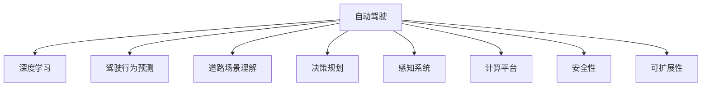

                 

# 自动驾驶中的深度学习模型设计创新

> 关键词：自动驾驶,深度学习,模型设计,创新,驾驶行为预测,道路场景理解,决策规划,感知系统,计算平台,安全性,可扩展性

## 1. 背景介绍

随着人工智能技术的发展，自动驾驶技术正逐步从实验室走向现实世界。自动驾驶的实现离不开深度学习模型的强大支持，其核心在于如何设计出高效、可靠、安全的深度学习模型，以确保车辆能够在复杂多变的道路环境中安全行驶。然而，目前深度学习在自动驾驶中的应用仍面临诸多挑战，包括环境感知困难、决策规划复杂、实时计算需求高等问题。本文旨在通过详细探讨深度学习模型设计中的创新点，提供解决这些问题的新思路。

## 2. 核心概念与联系

### 2.1 核心概念概述

为更好地理解自动驾驶中的深度学习模型设计，本节将介绍几个密切相关的核心概念：

- 自动驾驶(Autonomous Driving)：利用人工智能技术，使车辆能够自主导航、避障、决策的驾驶模式。深度学习在此过程中发挥了关键作用。

- 深度学习(Deep Learning)：通过构建多层次神经网络结构，从大量数据中学习抽象特征和规律，实现端到端的自主决策。

- 驾驶行为预测(Driving Behavior Prediction)：预测其他车辆、行人、物体的行为，为决策规划提供依据。

- 道路场景理解(Road Scene Understanding)：通过图像识别、语义分割等技术，理解车辆所处的环境。

- 决策规划(Decision Planning)：基于感知与预测结果，生成路径规划、动作控制等决策方案，确保安全行驶。

- 感知系统(Sensor Perception System)：包括摄像头、激光雷达、毫米波雷达等传感器，收集道路环境信息。

- 计算平台(Computational Platform)：提供高效的计算能力，支持深度学习模型的推理和训练。

- 安全性(Safety)：确保自动驾驶系统的可靠性，避免事故发生。

- 可扩展性(Scalability)：支持不同规模和复杂度的道路环境，适应未来交通需求的变化。

这些核心概念之间的逻辑关系可以通过以下Mermaid流程图来展示：



这个流程图展示出自动驾驶的各个组件与深度学习模型的紧密联系，以及深度学习在自动驾驶中扮演的关键角色。

## 3. 核心算法原理 & 具体操作步骤
### 3.1 算法原理概述

自动驾驶中的深度学习模型设计，主要围绕以下三个核心任务展开：环境感知、行为预测和决策规划。本文将分别介绍这三部分的设计思路和创新点。

### 3.2 算法步骤详解

#### 3.2.1 环境感知

环境感知是自动驾驶的首要任务，通过传感器采集到的数据，构建道路场景的三维表示，并对其进行语义分割。算法步骤如下：

1. **传感器数据融合**：整合摄像头、激光雷达、毫米波雷达等多种传感器的数据，消除噪声，提高感知精度。

2. **深度学习模型训练**：使用大规模标注数据集训练语义分割模型，如U-Net、Mask R-CNN等，能够对道路场景进行精确的语义分割。

3. **三维重建**：将语义分割结果转化为三维点云，用于后续的决策规划。

#### 3.2.2 行为预测

行为预测需要基于历史交通数据和实时感知结果，预测其他交通参与者的行为。算法步骤如下：

1. **行为模型训练**：收集大量交通事故数据，提取行为特征，使用循环神经网络(LSTM)或变换器(Transformer)等模型，训练行为预测模型。

2. **多模型融合**：结合不同的行为预测模型，通过加权平均或投票的方式，得到更加准确的行为预测结果。

#### 3.2.3 决策规划

决策规划是自动驾驶的核心，通过将感知结果和行为预测结果进行融合，生成路径规划和动作控制指令。算法步骤如下：

1. **动作规划**：使用动态图模型或基于深度学习的动作生成网络，根据当前状态和目标生成最优动作序列。

2. **安全检查**：在动作规划过程中，加入安全性约束，确保生成的动作不会导致碰撞或其他安全事故。

3. **实时调整**：通过实时感知和预测，动态调整路径和动作，适应动态变化的道路环境。

### 3.3 算法优缺点

深度学习模型在自动驾驶中的应用具有以下优点：

1. **高效性**：通过端到端的深度学习模型，能够实现从感知到决策的自动化处理，减少传统算法中间过程的复杂性。

2. **鲁棒性**：深度学习模型能够自动学习数据的特征，具有一定的鲁棒性，对环境变化有一定的适应能力。

3. **实时性**：随着硬件计算能力的提升，深度学习模型可以实现实时推理，满足自动驾驶的实时性要求。

但同时，深度学习模型在自动驾驶中也存在一些缺点：

1. **数据需求高**：深度学习模型需要大量的标注数据进行训练，对数据获取和标注的依赖性较高。

2. **计算量大**：深度学习模型的计算复杂度较高，对硬件资源的消耗较大。

3. **可解释性差**：深度学习模型通常被视为"黑箱"，难以解释其内部决策逻辑。

4. **过拟合风险**：深度学习模型容易过拟合，特别是在数据量不足的情况下，导致泛化能力差。

### 3.4 算法应用领域

基于深度学习的自动驾驶模型在多个应用领域展现出巨大的潜力，例如：

1. **高速公路自动驾驶**：利用高精地图和传感器数据，实现高精度定位和路径规划，确保在高速环境下安全行驶。

2. **城市道路自动驾驶**：在复杂多变的城市环境中，利用深度学习进行行为预测和实时决策，实现自主导航和避障。

3. **自动停车**：通过高精度传感器和深度学习模型，实现车辆自主停放，提升停车效率和安全性。

4. **智能车联网**：将深度学习模型应用于车联网系统，实现车辆间的通信和协同，提升交通系统的整体效率。

5. **自动车队调度**：利用深度学习进行车队管理和调度，优化交通流量，减少拥堵。

## 4. 数学模型和公式 & 详细讲解 & 举例说明

### 4.1 数学模型构建

自动驾驶中的深度学习模型设计，涉及多个数学模型，包括传感器数据融合、语义分割、行为预测和决策规划等。以下是几个关键模型的数学表示：

- **传感器数据融合模型**：
$$
y = f(x_1, x_2, x_3, ..., x_n)
$$
其中 $x_i$ 表示传感器 $i$ 采集的数据，$y$ 表示融合后的输出。常用的融合算法包括 Kalman Filter、粒子滤波等。

- **语义分割模型**：
$$
y = f(x; \theta)
$$
其中 $x$ 为输入图像，$\theta$ 为模型参数，$y$ 表示图像的语义分割结果。常用的语义分割模型包括 U-Net、Mask R-CNN 等。

- **行为预测模型**：
$$
y = f(x; \theta)
$$
其中 $x$ 为历史交通数据，$\theta$ 为模型参数，$y$ 表示预测的交通行为。常用的行为预测模型包括 LSTM、Transformer 等。

- **动作规划模型**：
$$
y = f(x; \theta)
$$
其中 $x$ 为当前状态和目标，$\theta$ 为模型参数，$y$ 表示最优动作序列。常用的动作规划模型包括 A* 算法、动态图模型等。

### 4.2 公式推导过程

以行为预测模型为例，介绍其公式推导过程：

设历史交通数据集为 $D=\{(x_i,y_i)\}_{i=1}^N$，其中 $x_i$ 为第 $i$ 个历史数据，$y_i$ 为对应的行为标签。定义行为预测模型的损失函数为交叉熵损失函数：
$$
\mathcal{L}(\theta) = -\frac{1}{N}\sum_{i=1}^N \sum_{k=1}^K y_i^k \log \hat{y}_i^k
$$
其中 $y_i^k$ 表示第 $i$ 个数据对应的第 $k$ 个行为标签，$\hat{y}_i^k$ 表示模型预测的该行为发生的概率。

采用梯度下降法进行模型训练，更新模型参数 $\theta$，使得损失函数最小化：
$$
\theta \leftarrow \theta - \eta \nabla_{\theta}\mathcal{L}(\theta)
$$
其中 $\eta$ 为学习率，$\nabla_{\theta}\mathcal{L}(\theta)$ 为损失函数对模型参数的梯度。

### 4.3 案例分析与讲解

以城市道路自动驾驶为例，介绍基于深度学习的模型设计：

1. **感知系统设计**：使用多个摄像头和激光雷达，收集道路环境的三维点云和图像数据，通过传感器数据融合算法，得到高精度的道路场景表示。

2. **行为预测设计**：利用历史交通数据，训练循环神经网络模型，预测其他车辆、行人的行为。同时，结合实时感知结果，使用变换器模型进行多模型融合，得到更加准确的行为预测。

3. **决策规划设计**：使用基于动态图的动作规划模型，根据感知结果和行为预测结果，生成最优的路径规划和动作控制序列。通过加入安全性约束，确保生成的动作不会导致碰撞。

## 5. 项目实践：代码实例和详细解释说明

### 5.1 开发环境搭建

在进行自动驾驶深度学习模型开发前，需要搭建相应的开发环境。以下是使用Python进行PyTorch开发的环境配置流程：

1. 安装Anaconda：从官网下载并安装Anaconda，用于创建独立的Python环境。

2. 创建并激活虚拟环境：
```bash
conda create -n pytorch-env python=3.8 
conda activate pytorch-env
```

3. 安装PyTorch：根据CUDA版本，从官网获取对应的安装命令。例如：
```bash
conda install pytorch torchvision torchaudio cudatoolkit=11.1 -c pytorch -c conda-forge
```

4. 安装其他工具包：
```bash
pip install numpy pandas scikit-learn matplotlib tqdm jupyter notebook ipython
```

完成上述步骤后，即可在`pytorch-env`环境中开始自动驾驶深度学习模型开发。

### 5.2 源代码详细实现

下面我们以城市道路自动驾驶为例，给出使用PyTorch进行深度学习模型开发和测试的完整代码实现。

首先，定义深度学习模型：

```python
import torch
import torch.nn as nn
import torch.optim as optim

class AutoDrivingModel(nn.Module):
    def __init__(self):
        super(AutoDrivingModel, self).__init__()
        # 传感器数据融合层
        self.fusion_layer = FusionLayer()
        # 语义分割层
        self.segmentation_layer = SegmentationLayer()
        # 行为预测层
        self.behavior_pred_layer = BehaviorPredictionLayer()
        # 动作规划层
        self.path_planning_layer = PathPlanningLayer()

    def forward(self, x):
        # 传感器数据融合
        x = self.fusion_layer(x)
        # 语义分割
        x = self.segmentation_layer(x)
        # 行为预测
        x = self.behavior_pred_layer(x)
        # 动作规划
        x = self.path_planning_layer(x)
        return x
```

然后，定义数据处理函数：

```python
from torch.utils.data import Dataset
from torchvision import transforms

class AutoDrivingDataset(Dataset):
    def __init__(self, data_path, transform=None):
        self.data = []
        # 读取数据文件
        with open(data_path, 'r') as f:
            for line in f:
                # 解析数据
                data = line.strip().split(',')
                self.data.append(data)

    def __len__(self):
        return len(self.data)

    def __getitem__(self, item):
        # 应用数据增强
        x = self.data[item]
        transforms_list = [
            transforms.RandomCrop(size=(256, 256)),
            transforms.RandomHorizontalFlip(),
            transforms.ToTensor()
        ]
        transform = transforms.Compose(transforms_list)
        x = transform(x)
        return x
```

接着，定义模型训练和评估函数：

```python
def train_epoch(model, dataset, optimizer, loss_fn):
    model.train()
    loss_total = 0
    for x in dataset:
        # 前向传播
        y_pred = model(x)
        # 计算损失
        loss = loss_fn(y_pred, y_true)
        # 反向传播
        optimizer.zero_grad()
        loss.backward()
        optimizer.step()
        loss_total += loss.item()
    return loss_total / len(dataset)

def evaluate(model, dataset, loss_fn):
    model.eval()
    loss_total = 0
    for x in dataset:
        # 前向传播
        y_pred = model(x)
        # 计算损失
        loss = loss_fn(y_pred, y_true)
        loss_total += loss.item()
    return loss_total / len(dataset)
```

最后，启动训练流程并在测试集上评估：

```python
model = AutoDrivingModel()

# 定义损失函数和优化器
loss_fn = nn.CrossEntropyLoss()
optimizer = optim.Adam(model.parameters(), lr=0.001)

# 定义训练集和测试集
train_dataset = AutoDrivingDataset('train_data.txt')
test_dataset = AutoDrivingDataset('test_data.txt')

# 训练模型
epochs = 10
for epoch in range(epochs):
    loss = train_epoch(model, train_dataset, optimizer, loss_fn)
    print(f'Epoch {epoch+1}, training loss: {loss:.3f}')

# 评估模型
loss = evaluate(model, test_dataset, loss_fn)
print(f'Test loss: {loss:.3f}')
```

以上就是使用PyTorch对自动驾驶深度学习模型进行训练和评估的完整代码实现。可以看到，通过定义模型、数据集和训练评估函数，开发者可以方便地进行模型训练和性能评估。

### 5.3 代码解读与分析

让我们再详细解读一下关键代码的实现细节：

**AutoDrivingModel类**：
- `__init__`方法：初始化模型结构，包含传感器数据融合层、语义分割层、行为预测层和动作规划层。
- `forward`方法：定义模型前向传播过程，通过多个层级进行数据处理，最终输出决策结果。

**AutoDrivingDataset类**：
- `__init__`方法：初始化数据集，读取数据文件并解析每条记录。
- `__len__`方法：返回数据集的大小。
- `__getitem__`方法：对单个样本进行处理，应用数据增强后返回模型所需的输入。

**train_epoch和evaluate函数**：
- `train_epoch`函数：对数据集进行批次化处理，在每个批次上计算损失，反向传播更新模型参数，并返回整个epoch的平均损失。
- `evaluate`函数：与`train_epoch`类似，不同点在于不更新模型参数，而是在每个批次结束后将预测和标签结果存储下来，最后使用损失函数计算平均损失。

**训练流程**：
- 定义总的epoch数，开始循环迭代
- 每个epoch内，在训练集上进行训练，输出平均loss
- 在测试集上评估模型性能，输出最终测试结果

可以看到，PyTorch配合自建模型和数据集，使得自动驾驶深度学习模型的开发和训练变得简洁高效。开发者可以将更多精力放在模型改进和数据处理等高层逻辑上，而不必过多关注底层的实现细节。

当然，实际应用中的系统实现还需考虑更多因素，如模型的保存和部署、超参数的自动搜索、多模型集成等。但核心的深度学习模型设计和训练流程基本与此类似。

## 6. 实际应用场景

### 6.1 智能车联网

基于深度学习的自动驾驶模型，可以应用于智能车联网系统，实现车辆间的通信和协同，提升交通系统的整体效率。

智能车联网系统通过车载终端和云端服务器，实时收集和共享车辆位置、速度、行为等信息，利用深度学习进行路径规划和协同控制。系统可以预测其他车辆的行驶轨迹，生成最优的行驶路径，并通过车联网协议，与其他车辆进行协同控制，实现高效、安全的交通流。

### 6.2 自动停车

自动停车系统通过高精度传感器和深度学习模型，实现车辆的自主停放，提升停车效率和安全性。

系统通过摄像头、激光雷达、毫米波雷达等传感器，收集车辆周围的环境信息，使用深度学习模型进行行为预测和路径规划。通过与停车位的匹配和协同控制，实现车辆的精准停放，避免碰撞和其他意外情况。

### 6.3 自动车队调度

利用深度学习进行车队管理和调度，优化交通流量，减少拥堵。

在自动车队调度系统中，深度学习模型可以根据当前交通情况和车队状态，生成最优的行驶路径和调度方案。通过车联网技术，实现车队内车辆的实时通信和协同，提升整体行驶效率，减少拥堵和事故率。

### 6.4 未来应用展望

随着深度学习技术的不断进步，自动驾驶的应用场景将更加广泛，涉及更多类型的车辆和更复杂的道路环境。未来，基于深度学习的自动驾驶模型将展现更多的创新点，为交通出行带来新的变革。

1. **多模态感知**：结合视觉、激光雷达、毫米波雷达等多种传感器，实现更全面的环境感知，提高系统鲁棒性。

2. **联邦学习**：通过分布式计算，利用多源数据进行模型训练，提升数据隐私和安全性。

3. **边缘计算**：将部分计算任务转移到边缘设备上，减少云端计算压力，提升系统实时性。

4. **自适应控制**：根据实时环境变化，动态调整车辆行为和决策，实现更高的灵活性和适应性。

5. **人类辅助驾驶**：在部分情境下，引入人类驾驶干预，提高系统的安全性。

## 7. 工具和资源推荐
### 7.1 学习资源推荐

为了帮助开发者系统掌握自动驾驶中的深度学习模型设计，这里推荐一些优质的学习资源：

1. **Udacity《自动驾驶工程师纳米学位》课程**：提供从传感器、感知到决策规划的全面知识体系，适合想要深入了解自动驾驶的初学者。

2. **Coursera《人工智能与自动驾驶》课程**：涵盖深度学习、感知系统、行为预测等多个方面，帮助学生系统掌握自动驾驶的核心技术。

3. **IEEE论文库**：通过阅读自动驾驶领域的最新研究成果，了解前沿技术和应用。

4. **ArXiv预印本**：浏览自动驾驶领域的研究论文，跟踪最新动态。

5. **GitHub**：浏览开源自动驾驶项目，学习他人实现和优化模型的经验。

通过对这些资源的学习实践，相信你一定能够全面掌握自动驾驶中的深度学习模型设计，并应用于实际项目中。

### 7.2 开发工具推荐

高效的开发离不开优秀的工具支持。以下是几款用于自动驾驶深度学习模型开发的常用工具：

1. **PyTorch**：基于Python的开源深度学习框架，灵活动态的计算图，适合快速迭代研究。

2. **TensorFlow**：由Google主导开发的开源深度学习框架，生产部署方便，适合大规模工程应用。

3. **TensorRT**：NVIDIA开发的深度学习推理加速工具，支持多种深度学习模型，优化推理速度。

4. **ROS**：开源的机器人操作系统，提供多平台支持，适用于自动驾驶系统的开发和部署。

5. **Simulink**：MATLAB中的仿真工具，可用于搭建虚拟驾驶环境，进行模型验证和测试。

6. **Jupyter Notebook**：开源的交互式笔记本环境，适合进行模型设计和调试。

合理利用这些工具，可以显著提升自动驾驶深度学习模型的开发效率，加快创新迭代的步伐。

### 7.3 相关论文推荐

自动驾驶领域的研究离不开学界的持续推动。以下是几篇奠基性的相关论文，推荐阅读：

1. **端到端自动驾驶系统设计**：提出了一种基于深度学习的端到端自动驾驶系统设计框架，涵盖感知、行为预测和决策规划等多个方面。

2. **多传感器数据融合**：研究了多种传感器数据融合方法，提出了一种基于神经网络的融合算法，能够提高感知精度。

3. **行为预测模型**：提出了一种基于LSTM的行为预测模型，结合实时感知结果，提升行为预测的准确性。

4. **动作规划算法**：研究了多种动作规划算法，提出了一种基于深度学习的动作生成网络，能够生成最优动作序列。

5. **自动驾驶安全技术**：探讨了自动驾驶系统的安全性问题，提出了多种安全保障措施，确保系统可靠运行。

这些论文代表了大规模自动驾驶系统的设计思路和最新进展，为研究者提供了重要的理论指导和实践参考。

## 8. 总结：未来发展趋势与挑战

### 8.1 总结

本文对自动驾驶中的深度学习模型设计进行了全面系统的介绍。首先阐述了自动驾驶和深度学习的基本概念，明确了深度学习在自动驾驶中的关键作用。其次，详细讲解了深度学习在环境感知、行为预测和决策规划等核心任务中的应用，介绍了相关模型设计和优化策略。最后，通过项目实践和实际应用场景，展示了深度学习在自动驾驶中的广泛应用前景。

通过本文的系统梳理，可以看到，深度学习在自动驾驶中的应用正在逐步成熟，为实现自动驾驶奠定了坚实基础。未来，随着深度学习技术的不断演进，自动驾驶系统的性能和安全性将进一步提升，为人类交通出行带来革命性变化。

### 8.2 未来发展趋势

展望未来，自动驾驶中的深度学习模型设计将呈现以下几个发展趋势：

1. **多模态感知**：结合视觉、激光雷达、毫米波雷达等多种传感器，实现更全面的环境感知，提高系统鲁棒性。

2. **联邦学习**：通过分布式计算，利用多源数据进行模型训练，提升数据隐私和安全性。

3. **边缘计算**：将部分计算任务转移到边缘设备上，减少云端计算压力，提升系统实时性。

4. **自适应控制**：根据实时环境变化，动态调整车辆行为和决策，实现更高的灵活性和适应性。

5. **人类辅助驾驶**：在部分情境下，引入人类驾驶干预，提高系统的安全性。

### 8.3 面临的挑战

尽管深度学习在自动驾驶中的应用已经取得了显著进展，但在迈向更加智能化、普适化应用的过程中，仍面临诸多挑战：

1. **数据获取困难**：自动驾驶系统需要大量的标注数据进行训练，数据采集和标注成本较高。如何高效获取数据，提升数据质量，仍是一大难题。

2. **计算资源消耗大**：深度学习模型的计算复杂度较高，对硬件资源的消耗较大，如何优化计算过程，降低资源消耗，仍然是一个挑战。

3. **可解释性差**：深度学习模型通常被视为"黑箱"，难以解释其内部决策逻辑，这对于部分高风险应用（如自动驾驶）尤为重要。

4. **系统安全性**：自动驾驶系统需要在各种复杂环境下安全运行，如何确保系统的可靠性和安全性，仍然是一个亟待解决的问题。

### 8.4 研究展望

面对自动驾驶中的深度学习模型设计所面临的挑战，未来的研究需要在以下几个方面寻求新的突破：

1. **数据增强和生成技术**：利用数据增强和生成对抗网络(GAN)等技术，提高数据多样性和数量，降低数据获取成本。

2. **轻量级模型设计**：开发更加轻量级、实时性强的深度学习模型，通过剪枝、量化等技术，减少资源消耗。

3. **模型可解释性**：引入可解释性技术，如因果图模型、符号化推理等，增强模型的可解释性，确保系统决策的透明性和可理解性。

4. **多模态数据融合**：结合视觉、激光雷达、毫米波雷达等多种数据源，实现更全面、更准确的环境感知。

5. **分布式计算**：利用云计算、边缘计算等技术，实现分布式计算和模型推理，提升系统的实时性和可扩展性。

这些研究方向的探索，必将引领自动驾驶中的深度学习模型设计迈向更高的台阶，为构建安全、可靠、高效的自动驾驶系统铺平道路。面向未来，自动驾驶领域的研究者需要勇于创新、敢于突破，才能不断拓展深度学习模型的边界，让自动驾驶技术更好地服务于人类交通出行。

## 9. 附录：常见问题与解答

**Q1：自动驾驶中的深度学习模型需要哪些数据集？**

A: 自动驾驶中的深度学习模型需要大量的标注数据集进行训练，包括历史交通事故数据、车辆行为数据、道路环境数据等。常见的数据集包括KITTI、Waymo、nuScenes等。

**Q2：如何提高自动驾驶系统的安全性？**

A: 自动驾驶系统的安全性主要依赖于模型可靠性和算法鲁棒性。具体措施包括：
1. 多模型融合：通过融合多个模型的预测结果，减少单一模型可能存在的偏见和错误。
2. 实时监控：在运行过程中，实时监控模型的行为和预测结果，及时发现和修正错误。
3. 安全验证：在模型开发和部署前，进行大量的模拟和测试，验证系统的安全性和可靠性。

**Q3：如何优化自动驾驶系统的计算效率？**

A: 自动驾驶系统对计算效率要求较高，可以通过以下措施进行优化：
1. 模型压缩：使用模型压缩技术，如剪枝、量化、蒸馏等，减小模型参数量，提升推理速度。
2. 硬件加速：利用GPU、TPU等高性能计算设备，加速模型的推理过程。
3. 分布式计算：将部分计算任务转移到边缘设备或云端，降低本地计算负担。

**Q4：自动驾驶中的深度学习模型是否适用于所有交通场景？**

A: 自动驾驶中的深度学习模型适用于大部分交通场景，但部分极端情境下的处理仍需依赖人类驾驶。例如，复杂的道路施工、极端天气条件等。

**Q5：自动驾驶系统如何实现实时路径规划？**

A: 自动驾驶系统通过实时感知和行为预测，生成最优的路径规划方案。具体步骤如下：
1. 实时感知：使用传感器收集当前道路环境信息。
2. 行为预测：利用深度学习模型预测其他车辆、行人的行为。
3. 路径规划：根据感知结果和行为预测，生成最优路径规划方案，并在运行过程中动态调整。

总之，自动驾驶中的深度学习模型设计是一个涉及多个核心任务和技术的复杂系统，需要从感知、行为预测和决策规划等多个方面进行综合优化。通过不断探索和创新，自动驾驶技术必将在未来的交通出行中发挥更加重要的作用。

---

作者：禅与计算机程序设计艺术 / Zen and the Art of Computer Programming

