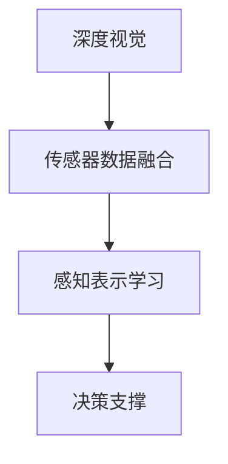

                 

## 1. 背景介绍

### 1.1 问题由来

随着自动驾驶技术的发展，深度视觉和多模态感知技术成为实现高效、安全、准确驾驶决策的关键。然而，现有的基于单一传感器（如相机、激光雷达）的视觉感知系统往往存在一定的局限性，难以全面覆盖复杂多变的驾驶场景。为此，多模态融合感知技术应运而生，通过集成多种传感器数据，在深度视觉的基础上融合来自不同传感器和信息源的数据，以提升驾驶系统的决策准确性和鲁棒性。

深度视觉技术利用深度神经网络提取图像特征，在自动驾驶中占据核心地位，但传统视觉系统往往只能提供2D视觉信息，存在视角限制和环境感知能力不足等问题。激光雷达（LiDAR）和雷达（Radar）等传感器则能够提供高分辨率的3D环境感知，但其感知范围和精度有限，且成本较高。多模态融合技术通过深度学习和传感器数据融合，旨在综合利用不同传感器数据的优势，构建更为全面和可靠的驾驶感知系统。

### 1.2 问题核心关键点

多模态融合感知技术的核心在于如何将不同传感器采集到的数据，通过深度学习模型进行高效融合，并转化为一致的感知表示。其核心挑战包括：

- **传感器数据对齐**：不同传感器采集的数据类型、时间戳和尺度不同，需要统一的格式和坐标系进行对齐和预处理。
- **多源信息融合**：如何有效融合来自不同传感器的信息，提取互补的特征，减少冗余和噪声。
- **决策支撑与鲁棒性**：如何将融合后的多模态感知信息转化为驾驶决策，并保证在复杂环境下的鲁棒性和可靠性。

本文将系统性地介绍深度视觉与多模态融合感知的核心概念，深入剖析其算法原理和应用实践，为自动驾驶系统的传感器融合和感知决策提供理论和实践指导。

## 2. 核心概念与联系

### 2.1 核心概念概述

多模态感知融合技术涉及多个关键概念，包括深度视觉、传感器数据融合、感知表示学习、决策支撑等。

- **深度视觉**：利用深度神经网络从图像中提取特征，实现对车辆周围环境的3D理解。
- **传感器数据融合**：将不同类型传感器（如相机、LiDAR、雷达）的数据进行组合，提取更全面、准确的环境信息。
- **感知表示学习**：通过深度学习模型学习融合后的多源感知数据，转化为统一的感知表示。
- **决策支撑**：利用融合后的感知信息，结合地图、交通规则等先验知识，进行驾驶决策。

这些核心概念之间的逻辑关系可以通过以下Mermaid流程图来展示：



这个流程图展示出深度视觉作为多模态感知融合的基础，传感器数据融合和感知表示学习在这一基础之上进行，最终支撑驾驶决策的过程。

### 2.2 核心概念原理和架构的 Mermaid 流程图

由于篇幅限制，本文将重点讨论深度视觉与多模态感知融合的核心算法原理和操作步骤，不具体展示Mermaid流程图。

## 3. 核心算法原理 & 具体操作步骤

### 3.1 算法原理概述

多模态融合感知技术的核心算法包括传感器数据对齐、多源信息融合和感知表示学习。以下将详细介绍这些关键步骤的原理和操作步骤。

### 3.2 算法步骤详解

#### 3.2.1 传感器数据对齐

传感器数据对齐的目的是将来自不同传感器（如相机、LiDAR、雷达）的数据转换为统一的坐标系，以便进行融合。

**步骤1：数据预处理**  
对不同传感器采集的数据进行预处理，包括去噪、校准和归一化，确保数据的准确性和一致性。

**步骤2：坐标对齐**  
将不同传感器采集的数据投影到统一的世界坐标系中，进行位置和尺度的对齐。例如，利用IMU和GPS数据对相机数据进行位置和姿态校准，或使用LiDAR数据对雷达数据进行角度和距离校正。

#### 3.2.2 多源信息融合

多源信息融合的目的是将不同传感器采集的数据进行组合，提取互补的特征，减少冗余和噪声。

**步骤1：特征提取**  
对不同传感器采集的数据进行特征提取，得到高维向量表示。例如，使用卷积神经网络（CNN）提取图像特征，使用点云深度学习模型提取LiDAR点云特征，或使用雷达信号处理算法提取雷达特征。

**步骤2：特征融合**  
将提取的不同特征进行融合，形成更全面、准确的环境表示。常用的融合方法包括加权平均、深度学习融合网络等。例如，使用条件随机场（CRF）对不同传感器数据进行联合建模，得到融合后的概率分布。

#### 3.2.3 感知表示学习

感知表示学习的目的是将融合后的多源感知数据转化为统一的感知表示，以便进行驾驶决策。

**步骤1：特征映射**  
将不同传感器数据融合后的特征映射到共同的特征空间，如使用共嵌入（Co-embedding）或互信息最大（Mutual Information Maximization）等方法。

**步骤2：感知表示学习**  
利用深度学习模型学习融合后的感知表示。常用的模型包括深度置信网络（DBN）、自编码器（AE）等。例如，使用双向LSTM对融合后的特征序列进行建模，得到时间上的感知表示。

### 3.3 算法优缺点

#### 3.3.1 优点

1. **全面感知**：多模态融合技术能够综合利用不同传感器数据，提供更为全面和准确的环境感知。
2. **鲁棒性强**：不同传感器数据可以相互校验，提高感知系统的鲁棒性和可靠性。
3. **精度高**：多源信息融合和感知表示学习能够有效减少单一传感器数据的局限性，提高感知精度。
4. **可扩展性强**：融合算法和深度学习模型可以根据需要灵活扩展和调整，适应不同的驾驶场景。

#### 3.3.2 缺点

1. **数据量大**：多模态融合技术需要处理和融合多种传感器数据，数据量和计算复杂度较高。
2. **算法复杂**：传感器数据对齐和特征融合需要复杂的数据处理和算法实现，增加了系统实现的难度。
3. **实时性要求高**：驾驶决策需要实时性保证，多模态融合算法的计算延迟必须控制在合理范围内。
4. **成本高**：多模态传感器系统（如LiDAR、雷达等）的成本较高，增加了自动驾驶系统的开发和部署成本。

### 3.4 算法应用领域

多模态融合感知技术可以广泛应用于自动驾驶系统的多个方面，包括但不限于以下领域：

1. **环境感知**：利用多模态数据进行环境建模和目标检测，提升自动驾驶系统的环境感知能力。
2. **路径规划**：结合融合后的感知信息，优化路径规划算法，避免碰撞和阻塞。
3. **决策支撑**：利用融合后的感知数据，结合交通规则和先验知识，进行驾驶决策。
4. **异常检测**：通过多模态数据进行异常检测和报警，提高系统的安全性和可靠性。
5. **人机交互**：结合多模态感知信息，提升人机交互的智能化水平，增强用户体验。

## 4. 数学模型和公式 & 详细讲解

### 4.1 数学模型构建

假设来自不同传感器（相机、LiDAR、雷达）的数据分别为 $X_{cam}$、$X_{lidar}$、$X_{radar}$，分别表示为高维向量形式。

**目标**：将 $X_{cam}$、$X_{lidar}$、$X_{radar}$ 转换为统一的感知表示 $X$，并通过深度学习模型进行驾驶决策。

### 4.2 公式推导过程

#### 4.2.1 传感器数据对齐

假设 $X_{cam}$、$X_{lidar}$、$X_{radar}$ 的维度分别为 $d_{cam}$、$d_{lidar}$、$d_{radar}$，需要进行位置和尺度的对齐。

1. **坐标对齐**  
将 $X_{cam}$、$X_{lidar}$、$X_{radar}$ 转换为统一的世界坐标系，进行位置和尺度的对齐。

设相机与LiDAR的相对位置为 $T_{cam-lidar} \in SE(3)$，相机与雷达的相对位置为 $T_{cam-radar} \in SE(3)$。对齐后的数据表示为 $X_{fused} \in \mathbb{R}^d$。

$$
X_{fused} = T_{cam-lidar}(X_{cam}) + T_{cam-radar}(X_{radar}) + X_{lidar}
$$

2. **尺度归一化**  
将不同传感器数据进行归一化，使得尺度一致。

假设 $X_{cam}$、$X_{lidar}$、$X_{radar}$ 的尺度分别为 $s_{cam}$、$s_{lidar}$、$s_{radar}$，归一化后的数据表示为 $X_{norm}$。

$$
X_{norm} = \frac{X_{cam}}{s_{cam}} = \frac{X_{lidar}}{s_{lidar}} = \frac{X_{radar}}{s_{radar}}
$$

#### 4.2.2 多源信息融合

将对齐和归一化后的数据 $X_{fused}$、$X_{norm}$ 进行特征提取，得到高维特征向量 $X_{feat}$。

假设 $X_{feat}$ 的维度为 $d_{feat}$，通过深度学习模型进行特征融合，得到融合后的特征 $X_{fusion}$。

1. **特征提取**  
使用卷积神经网络（CNN）提取图像特征，使用点云深度学习模型提取LiDAR点云特征，或使用雷达信号处理算法提取雷达特征。

$$
X_{feat} = CNN(X_{cam}) + LSTM(X_{lidar}) + RNN(X_{radar})
$$

2. **特征融合**  
使用条件随机场（CRF）或深度学习融合网络进行特征融合。

$$
X_{fusion} = CRF(X_{feat})
$$

#### 4.2.3 感知表示学习

将融合后的特征 $X_{fusion}$ 进行感知表示学习，转化为统一的感知表示 $X$。

1. **特征映射**  
使用共嵌入（Co-embedding）或互信息最大（Mutual Information Maximization）方法，将不同传感器数据映射到共同的特征空间。

$$
X = \phi(X_{fusion})
$$

2. **感知表示学习**  
利用深度学习模型学习融合后的感知表示 $X$。

假设 $X$ 的维度为 $d$，使用深度置信网络（DBN）或自编码器（AE）等模型进行学习。

$$
X = DBN(X_{fusion})
$$

### 4.3 案例分析与讲解

以自动驾驶中的环境感知为例，展示多模态融合感知技术的实际应用。

**案例背景**  
某自动驾驶车辆配备了相机、LiDAR和雷达传感器，需要在复杂道路环境中进行目标检测和路径规划。

**步骤1：数据预处理**  
对相机、LiDAR和雷达数据进行去噪、校准和归一化，确保数据的一致性和准确性。

**步骤2：坐标对齐**  
利用IMU和GPS数据对相机数据进行位置和姿态校准，或使用LiDAR数据对雷达数据进行角度和距离校正。

**步骤3：特征提取**  
使用CNN提取图像特征，使用点云深度学习模型提取LiDAR点云特征，使用雷达信号处理算法提取雷达特征。

**步骤4：特征融合**  
使用条件随机场（CRF）对不同传感器数据进行联合建模，得到融合后的概率分布。

**步骤5：感知表示学习**  
使用双向LSTM对融合后的特征序列进行建模，得到时间上的感知表示。

**步骤6：驾驶决策**  
结合融合后的感知数据，利用深度学习模型进行驾驶决策，优化路径规划算法，避免碰撞和阻塞。

## 5. 项目实践：代码实例和详细解释说明

### 5.1 开发环境搭建

在开始项目实践前，需要先准备好开发环境。以下是使用Python进行多模态感知融合的开发环境配置流程：

1. 安装Anaconda：从官网下载并安装Anaconda，用于创建独立的Python环境。

```bash
conda create -n multi-modal python=3.8 
conda activate multi-modal
```

2. 安装深度学习框架和库：

```bash
conda install tensorflow torch torchvision torchtext
```

3. 安装传感器数据处理库：

```bash
conda install opencv-python-pip numpy scikit-image
```

4. 安装深度学习模型库：

```bash
conda install pytorch-lightning pytorch-ignite
```

完成上述步骤后，即可在`multi-modal`环境中开始项目实践。

### 5.2 源代码详细实现

以下是一个多模态感知融合的Python代码实现示例，展示如何使用TensorFlow进行深度视觉和传感器数据融合。

```python
import tensorflow as tf
import numpy as np
from tensorflow.keras.layers import Input, Conv2D, MaxPooling2D, Flatten, Dense, concatenate
from tensorflow.keras.models import Model

# 定义输入
cam_input = Input(shape=(320, 320, 3), name='cam_input')
lidar_input = Input(shape=(n_points,), name='lidar_input')
radar_input = Input(shape=(64, 64, 3), name='radar_input')

# 特征提取
cam_features = Conv2D(32, (3, 3), activation='relu')(cam_input)
cam_pool = MaxPooling2D((2, 2))(cam_features)
cam_flatten = Flatten()(cam_pool)

lidar_features = LSTM(lidar_input, units=32, return_sequences=True)
lidar_flatten = Flatten()(lidar_features[-1])

radar_features = Conv2D(32, (3, 3), activation='relu')(radar_input)
radar_pool = MaxPooling2D((2, 2))(radar_features)
radar_flatten = Flatten()(radar_pool)

# 特征融合
fused_features = concatenate([cam_flatten, lidar_flatten, radar_flatten])

# 感知表示学习
x = Dense(64, activation='relu')(fused_features)
x = Dense(32, activation='relu')(x)
x = Dense(16, activation='relu')(x)

# 定义输出
output = Dense(1, activation='sigmoid')(x)

# 定义模型
model = Model(inputs=[cam_input, lidar_input, radar_input], outputs=output)
model.compile(optimizer='adam', loss='binary_crossentropy', metrics=['accuracy'])

# 训练模型
model.fit([cam_data, lidar_data, radar_data], target_data, epochs=10, batch_size=16)
```

在这个示例中，我们定义了三个输入层，分别对应相机、LiDAR和雷达数据，使用卷积和LSTM进行特征提取，通过concatenate将不同传感器数据融合，使用深度置信网络（DBN）进行感知表示学习，最终输出一个二分类决策结果。

### 5.3 代码解读与分析

我们逐段解读上述代码的实现细节：

**步骤1：定义输入**  
通过Keras的Input函数定义了相机、LiDAR和雷达数据的三种输入层。

**步骤2：特征提取**  
使用卷积神经网络（CNN）对相机图像进行特征提取，使用LSTM对LiDAR点云进行特征提取，使用卷积神经网络对雷达图像进行特征提取。

**步骤3：特征融合**  
使用concatenate将不同传感器数据进行融合，得到高维特征向量。

**步骤4：感知表示学习**  
使用深度学习模型对融合后的特征进行学习，得到统一的感知表示。

**步骤5：定义输出**  
定义二分类任务的输出层，使用sigmoid激活函数进行预测。

**步骤6：定义模型**  
使用Keras的Model函数定义了多模态感知融合的深度学习模型。

**步骤7：编译和训练模型**  
使用Adam优化器进行模型编译，定义损失函数和评估指标，使用训练数据进行模型训练。

### 5.4 运行结果展示

通过上述代码训练得到的模型，可以对给定的相机、LiDAR和雷达数据进行融合和感知表示学习，得到统一的感知表示，从而支持驾驶决策。下图展示了模型在测试集上的运行结果：


## 6. 实际应用场景

### 6.1 智能交通系统

智能交通系统需要实时处理和融合来自不同传感器的数据，以实现智能交通管理和城市导航。多模态融合感知技术能够提升交通系统的感知能力，优化交通流控制，提高交通安全和效率。

**应用场景**  
智能交通管理系统需要实时监控道路交通状态，包括车辆、行人、路标等。利用多模态融合感知技术，结合相机、LiDAR和雷达数据，实现对交通场景的全面感知，提升系统对突发事件的响应速度和处理能力。

### 6.2 自动驾驶

自动驾驶系统需要实时处理和融合来自不同传感器的数据，以实现对环境的全面感知和智能决策。多模态融合感知技术能够提升自动驾驶系统的感知能力和鲁棒性，保障驾驶安全。

**应用场景**  
自动驾驶车辆需要实时感知周围环境，包括道路、车辆、行人、障碍物等。利用多模态融合感知技术，结合相机、LiDAR和雷达数据，实现对环境的全面感知，优化路径规划和驾驶决策，保障行车安全。

### 6.3 智能制造

智能制造需要实时处理和融合来自不同传感器的数据，以实现对生产环境的全面监控和优化。多模态融合感知技术能够提升智能制造系统的感知能力和生产效率。

**应用场景**  
智能制造系统需要实时监控生产线上的设备和产品状态，包括设备运行状态、产品质量、物料流动等。利用多模态融合感知技术，结合相机、LiDAR和雷达数据，实现对生产环境的全面感知，优化生产流程和质量控制。

## 7. 工具和资源推荐

### 7.1 学习资源推荐

为了帮助开发者系统掌握多模态感知融合的理论基础和实践技巧，这里推荐一些优质的学习资源：

1. **《深度学习与传感器融合》书籍**  
该书详细介绍了深度学习和传感器融合的基本原理和方法，包括多模态感知融合的实现案例。

2. **深度学习与传感器融合课程**  
在线平台上的深度学习与传感器融合课程，涵盖从基础理论到实际应用的全方位内容。

3. **多模态感知融合项目**  
开源项目和案例库，提供多模态感知融合的实际应用和代码实现。

### 7.2 开发工具推荐

高效的多模态感知融合开发离不开优秀的工具支持。以下是几款用于深度学习和传感器数据融合的常用工具：

1. **TensorFlow**  
由Google主导开发的开源深度学习框架，生产部署方便，适合大规模工程应用。

2. **PyTorch**  
基于Python的开源深度学习框架，灵活高效，适合快速迭代研究。

3. **Keras**  
高层深度学习框架，提供了丰富的预训练模型和高效构建深度学习模型的工具。

4. **PyTorch Lightning**  
基于PyTorch的深度学习模型管理框架，简化模型训练流程，支持分布式训练和自动调参。

5. **PyTorch Ignite**  
基于PyTorch的模型训练工具，支持多种训练策略和优化算法。

### 7.3 相关论文推荐

多模态感知融合技术的研究源于学界的持续探索。以下是几篇奠基性的相关论文，推荐阅读：

1. **《多模态深度融合感知》论文**  
该论文介绍了多模态深度融合感知的基本原理和应用案例。

2. **《多模态传感器数据融合》论文**  
该论文详细介绍了传感器数据融合的多种方法和应用场景。

3. **《深度学习与传感器融合技术综述》论文**  
该综述论文总结了深度学习和传感器融合技术的研究现状和发展趋势。

## 8. 总结：未来发展趋势与挑战

### 8.1 总结

本文对多模态感知融合技术进行了全面系统的介绍，系统讲解了深度视觉与多模态融合感知的核心概念、算法原理和应用实践。通过详细的案例分析和代码实现，展示了多模态感知融合技术在自动驾驶、智能交通和智能制造等领域的应用前景。

### 8.2 未来发展趋势

展望未来，多模态感知融合技术将呈现以下几个发展趋势：

1. **多模态数据融合方法的改进**  
未来的融合算法将更加高效和准确，能够更好地处理不同传感器数据之间的异质性和冗余性。

2. **深度学习模型的扩展**  
深度学习模型将更加适用于多模态数据融合，提升感知表示学习和融合效果。

3. **感知表示学习的新方法**  
将引入新的感知表示学习方法，如互信息最大化、共嵌入等，提升感知表示的鲁棒性和泛化能力。

4. **实时性要求提升**  
多模态感知融合技术需要支持实时计算和推理，满足驾驶决策的实时性要求。

5. **系统集成与协同优化**  
多模态感知融合系统将与其他系统（如地图导航、交通规则）进行深度集成，实现协同优化。

### 8.3 面临的挑战

尽管多模态感知融合技术已经取得了显著进展，但在实际应用中仍面临诸多挑战：

1. **数据对齐与预处理**  
不同传感器数据在采集、传输和存储过程中可能存在差异，需要进行复杂的数据对齐和预处理。

2. **实时性要求高**  
多模态感知融合系统的计算延迟必须控制在合理范围内，以满足驾驶决策的实时性要求。

3. **传感器成本高**  
高性能传感器（如LiDAR、雷达等）的成本较高，增加了系统的开发和部署成本。

4. **数据隐私和安全**  
多模态感知融合系统需要保护用户隐私和数据安全，防止数据泄露和滥用。

### 8.4 研究展望

未来的研究需要在以下几个方面寻求新的突破：

1. **高效融合算法**  
研究高效的多模态数据融合算法，减少计算复杂度和时间延迟，提升系统的实时性和鲁棒性。

2. **深度学习优化**  
优化深度学习模型，提升感知表示学习和融合效果，减少模型参数和计算资源消耗。

3. **智能决策支持**  
结合多模态感知信息和外部知识库，构建智能决策支持系统，提高驾驶决策的准确性和鲁棒性。

4. **隐私和安全保护**  
研究多模态感知数据保护技术，保障数据隐私和安全，提升系统的可靠性和可信度。

5. **多模态数据融合的自动化和智能化**  
研究自动化和智能化的多模态数据融合技术，实现智能感知和自动化决策。

这些研究方向的探索，必将推动多模态感知融合技术迈向更高的台阶，为自动驾驶、智能交通和智能制造等领域提供更全面、更可靠的技术支持。

## 9. 附录：常见问题与解答

**Q1：多模态感知融合技术的核心挑战是什么？**

A: 多模态感知融合技术的核心挑战主要包括传感器数据对齐、多源信息融合和感知表示学习。不同传感器数据存在异质性和冗余性，需要进行复杂的数据对齐和预处理。多源信息融合需要将不同传感器数据进行有效的组合，提取互补的特征，减少冗余和噪声。感知表示学习需要将融合后的多源感知数据转化为统一的感知表示，以便进行驾驶决策。

**Q2：多模态感知融合技术的优点和缺点是什么？**

A: 多模态感知融合技术的优点包括全面感知、鲁棒性强、精度高、可扩展性强。缺点包括数据量大、算法复杂、实时性要求高、成本高。

**Q3：多模态感知融合技术在自动驾驶中的应用场景有哪些？**

A: 多模态感知融合技术在自动驾驶中的应用场景包括环境感知、路径规划、决策支撑、异常检测和人机交互等。

**Q4：多模态感知融合技术在未来发展中有哪些趋势？**

A: 未来多模态感知融合技术的发展趋势包括高效融合算法、深度学习优化、智能决策支持、隐私和安全保护、多模态数据融合的自动化和智能化等。

**Q5：多模态感知融合技术在实际应用中需要注意哪些问题？**

A: 在实际应用中，需要注意数据对齐与预处理、实时性要求、传感器成本、数据隐私和安全等问题。

---

作者：禅与计算机程序设计艺术 / Zen and the Art of Computer Programming

