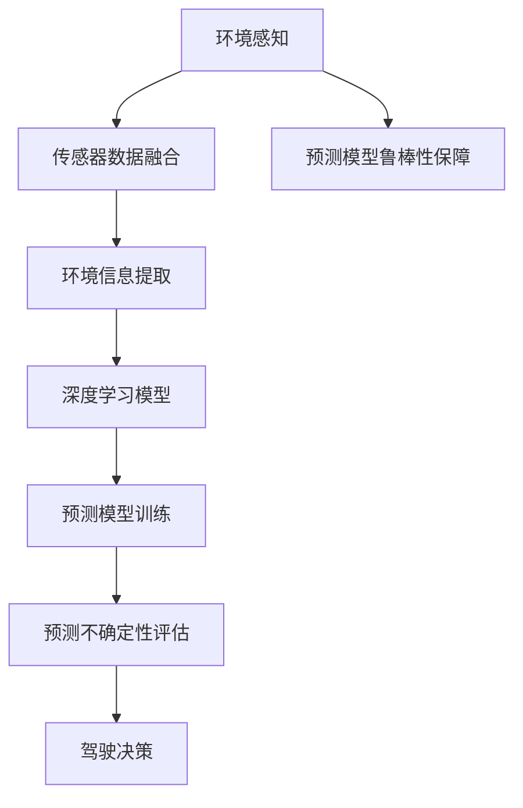

                 

# 自动驾驶中的环境感知与预测不确定性评估

自动驾驶作为未来交通出行方式的重要发展方向，以其高效、智能、环保等诸多优势，成为全球各大汽车厂商和科技公司的研发热点。环境感知与预测不确定性评估作为自动驾驶技术中的核心组成部分，直接关系到驾驶决策的准确性和安全性，是实现高水平自动驾驶的关键。本文将深入探讨自动驾驶中的环境感知与预测不确定性评估，包括核心概念、算法原理、数学模型、项目实践等方面，旨在为自动驾驶技术的研发和应用提供理论指导和实践参考。

## 1. 背景介绍

### 1.1 问题由来
随着计算机视觉、传感器技术、深度学习等技术的快速发展，自动驾驶技术已经从实验室走向实际应用。环境感知与预测不确定性评估作为自动驾驶技术的重要环节，通过对环境信息的获取和预测，为驾驶决策提供依据。然而，由于自动驾驶环境复杂多变，存在诸多不确定性因素，因此对环境感知与预测不确定性评估的研究具有重要意义。

### 1.2 问题核心关键点
自动驾驶中的环境感知与预测不确定性评估主要包括以下几个方面：
- 传感器数据的融合与处理
- 环境信息的提取与表示
- 不确定性的建模与量化
- 预测模型的训练与评估
- 驾驶决策的鲁棒性保障

这些关键点构成了环境感知与预测不确定性评估的框架，其研究的目标在于提升自动驾驶系统的环境理解能力，降低决策不确定性，提高系统鲁棒性和安全性。

## 2. 核心概念与联系

### 2.1 核心概念概述

为更好地理解自动驾驶中的环境感知与预测不确定性评估，本节将介绍几个密切相关的核心概念：

- 环境感知：指通过传感器技术，如雷达、激光雷达、摄像头等，获取车辆周围的环境信息，并对信息进行处理和表示。
- 预测不确定性评估：指通过对环境信息的分析和建模，量化预测的不确定性，为驾驶决策提供可信度。
- 传感器融合：指将来自不同传感器的环境信息进行综合处理，提升信息获取的准确性和全面性。
- 深度学习：指利用深度神经网络，通过大量数据训练，提取环境信息的特征，并进行预测。
- 鲁棒性：指系统对输入扰动、模型参数变化、数据噪声等因素的鲁棒性，保障驾驶决策的稳定性。

这些核心概念之间的逻辑关系可以通过以下Mermaid流程图来展示：



这个流程图展示了几类核心概念及其之间的关系：

1. 环境感知通过对传感器数据的获取和处理，为后续的环境信息提取和预测建模提供基础。
2. 传感器融合将多种传感器的信息进行融合，提高环境信息的全面性和准确性。
3. 深度学习模型通过学习环境特征，进行环境信息的提取和表示。
4. 预测模型通过深度学习模型训练，进行环境信息的预测。
5. 预测不确定性评估对预测结果的不确定性进行量化，保障驾驶决策的可信度。
6. 鲁棒性保障确保预测模型对环境变化和噪声的鲁棒性，提升驾驶决策的稳定性。

这些概念共同构成了自动驾驶中环境感知与预测不确定性评估的研究框架，其研究的目标在于提升环境信息的准确性、预测结果的可信度以及系统的鲁棒性，从而实现安全、可靠的自动驾驶。

## 3. 核心算法原理 & 具体操作步骤

### 3.1 算法原理概述

自动驾驶中的环境感知与预测不确定性评估，本质上是一个多源信息融合和不确定性量化的过程。其核心思想是：通过对传感器数据进行融合和处理，提取环境信息的特征，通过深度学习模型进行预测，再对预测结果的不确定性进行评估，最终生成可靠的环境信息，为驾驶决策提供支持。

形式化地，假设环境感知得到的环境信息表示为 $\mathcal{E} \in \mathcal{R}^d$，其中 $d$ 为特征维度。则环境感知与预测不确定性评估的总体目标为：

1. 环境信息提取：通过对环境信息 $\mathcal{E}$ 进行深度学习，提取环境特征 $\mathcal{F} \in \mathcal{R}^n$，其中 $n \ll d$。
2. 预测模型训练：利用环境特征 $\mathcal{F}$ 训练预测模型 $M$，生成预测结果 $\hat{Y} \in \mathcal{R}^m$，其中 $m$ 为预测维度。
3. 预测不确定性评估：通过对预测结果 $\hat{Y}$ 进行不确定性建模，评估其置信度 $U \in [0,1]$。
4. 驾驶决策：根据置信度 $U$，结合其他决策依据，生成最终驾驶决策 $A$。

### 3.2 算法步骤详解

自动驾驶中的环境感知与预测不确定性评估一般包括以下几个关键步骤：

**Step 1: 环境感知与数据预处理**
- 通过传感器（如雷达、激光雷达、摄像头等）获取环境信息。
- 对传感器数据进行去噪、校正、滤波等预处理操作，消除数据异常和噪声。
- 对传感器数据进行多源融合，综合不同传感器的信息，提升环境信息的准确性和全面性。

**Step 2: 环境信息提取**
- 对融合后的环境信息进行深度学习，提取环境特征。
- 利用卷积神经网络、循环神经网络、注意力机制等深度学习模型，对环境特征进行编码和表示。
- 对环境特征进行降维和特征选择，消除冗余和噪声。

**Step 3: 预测模型训练**
- 构建预测模型，如单层神经网络、多层神经网络、深度神经网络等。
- 利用环境特征 $\mathcal{F}$ 训练预测模型 $M$，生成预测结果 $\hat{Y}$。
- 使用交叉熵损失、均方误差损失等常用损失函数进行训练，优化模型参数。

**Step 4: 预测不确定性评估**
- 对预测结果 $\hat{Y}$ 进行不确定性建模，评估其置信度 $U$。
- 利用贝叶斯网络、置信区间、蒙特卡洛模拟等方法，对预测结果进行不确定性量化。
- 根据置信度 $U$ 和预测结果 $\hat{Y}$，生成最终驾驶决策 $A$。

**Step 5: 模型评估与鲁棒性保障**
- 在验证集上评估预测模型 $M$ 的性能，选择合适的评估指标，如准确率、召回率、F1-score等。
- 通过对抗样本生成、数据增强、模型剪枝等技术，提升预测模型的鲁棒性。
- 定期更新模型和数据集，保障系统对环境变化的适应能力。

### 3.3 算法优缺点

自动驾驶中的环境感知与预测不确定性评估方法具有以下优点：
1. 多源融合，提升信息获取的全面性和准确性。
2. 深度学习模型提取环境特征，提升预测的精度和泛化能力。
3. 不确定性评估提供置信度信息，保障驾驶决策的可靠性。
4. 鲁棒性保障提升系统对环境变化的适应能力，提高安全性。

同时，该方法也存在一定的局限性：
1. 数据依赖性强。环境感知依赖于传感器数据的准确性和全面性，数据获取和处理成本较高。
2. 模型复杂度高。深度学习模型计算量大，训练和推理速度较慢。
3. 对抗样本易受影响。预测模型对对抗样本的鲁棒性不足，可能出现误判。
4. 预测不确定性评估复杂。需要多层次的不确定性建模和量化，技术难度高。
5. 鲁棒性保障难度大。环境变化多样，难以设计统一的鲁棒性策略。

尽管存在这些局限性，但就目前而言，环境感知与预测不确定性评估方法仍是自动驾驶技术中的重要组成部分。未来相关研究的重点在于如何进一步降低数据依赖，提高模型鲁棒性，减少计算成本，提升预测精度和置信度。

### 3.4 算法应用领域

自动驾驶中的环境感知与预测不确定性评估，已经在多个实际应用中得到了广泛应用，例如：

- 车辆避障：通过对环境信息的感知和预测，实现车辆在复杂交通环境下的避障功能。
- 车道保持：利用环境感知获取车道线信息，预测车道位置和方向，实现车辆的自动车道保持。
- 交通信号识别：通过对交通信号灯的信息感知，预测信号变化，实现车辆的智能交通信号控制。
- 行人检测：利用环境感知获取行人信息，预测行人行为，避免碰撞事故的发生。
- 目标追踪：通过对环境信息的感知和预测，实现对动态目标的准确追踪和预测。

除了上述这些经典应用外，环境感知与预测不确定性评估技术还被创新性地应用到更多场景中，如自适应巡航、车联网通信、车辆路径规划等，为自动驾驶技术带来了全新的突破。随着环境感知与预测不确定性评估方法的不断进步，相信自动驾驶技术将在更广阔的应用领域大放异彩。

## 4. 数学模型和公式 & 详细讲解 & 举例说明

### 4.1 数学模型构建

本节将使用数学语言对自动驾驶中的环境感知与预测不确定性评估过程进行更加严格的刻画。

假设环境感知得到的传感器数据为 $\mathcal{X} \in \mathcal{R}^{d_1}$，其中 $d_1$ 为传感器数据的维度。利用深度学习模型 $M_{\theta}$ 对环境特征进行提取，得到环境特征 $\mathcal{F} \in \mathcal{R}^{d_2}$，其中 $d_2 \ll d_1$。利用预测模型 $M_{\phi}$ 对环境特征进行预测，生成预测结果 $\hat{Y} \in \mathcal{R}^{d_3}$，其中 $d_3$ 为预测维度。预测模型的输出 $\hat{Y}$ 的不确定性通过置信度 $U \in [0,1]$ 来量化。

预测模型的训练过程可以表示为：

$$
\hat{Y} = M_{\phi}(M_{\theta}(\mathcal{X}))
$$

预测不确定性的建模可以通过贝叶斯网络、置信区间、蒙特卡洛模拟等方法来实现。以下是利用置信区间对预测不确定性进行建模的公式：

$$
U = 1 - \frac{1}{N} \sum_{i=1}^N \mathbf{1}\{Y_i \neq \hat{Y}_i\}
$$

其中 $Y_i$ 为真实的预测结果，$\mathbf{1}\{Y_i \neq \hat{Y}_i\}$ 为0-1变量，表示预测错误。

### 4.2 公式推导过程

以雷达传感器为例，推导环境感知与预测不确定性评估的公式。

假设雷达传感器获取的环境数据为 $\mathcal{X} \in \mathcal{R}^{d_1}$，其中 $d_1$ 为雷达数据的时空维度。利用卷积神经网络 $M_{\theta}$ 对雷达数据进行特征提取，得到环境特征 $\mathcal{F} \in \mathcal{R}^{d_2}$，其中 $d_2$ 为提取后的特征维度。利用单层神经网络 $M_{\phi}$ 对环境特征进行预测，生成预测结果 $\hat{Y} \in \mathcal{R}^{d_3}$，其中 $d_3$ 为预测维度。

预测模型的训练过程可以表示为：

$$
\hat{Y} = M_{\phi}(M_{\theta}(\mathcal{X}))
$$

预测模型的损失函数可以表示为：

$$
L(\hat{Y}, Y) = \frac{1}{N} \sum_{i=1}^N (Y_i - \hat{Y}_i)^2
$$

其中 $Y_i$ 为真实的预测结果，$\hat{Y}_i$ 为模型预测结果。

预测不确定性的建模可以通过置信区间的方法来实现。以下是利用置信区间对预测不确定性进行建模的公式：

$$
U = 1 - \frac{1}{N} \sum_{i=1}^N \mathbf{1}\{Y_i \neq \hat{Y}_i\}
$$

其中 $Y_i$ 为真实的预测结果，$\mathbf{1}\{Y_i \neq \hat{Y}_i\}$ 为0-1变量，表示预测错误。

通过上述公式，可以对预测模型的不确定性进行量化，进而生成可靠的环境信息，为驾驶决策提供支持。

### 4.3 案例分析与讲解

假设某自动驾驶车辆在复杂城市道路中行驶，需要实现避障功能。该车辆配备了激光雷达和摄像头传感器，通过传感器数据获取环境信息。

首先，对激光雷达和摄像头数据进行融合和预处理，得到融合后的环境数据 $\mathcal{X} \in \mathcal{R}^{d_1}$。利用卷积神经网络 $M_{\theta}$ 对环境数据进行特征提取，得到环境特征 $\mathcal{F} \in \mathcal{R}^{d_2}$。利用单层神经网络 $M_{\phi}$ 对环境特征进行预测，生成预测结果 $\hat{Y} \in \mathcal{R}^{d_3}$。

利用置信区间的方法，对预测结果进行不确定性建模，评估其置信度 $U$。根据置信度 $U$ 和预测结果 $\hat{Y}$，生成最终驾驶决策 $A$。具体流程如下：

1. 环境感知：激光雷达和摄像头数据融合，得到环境数据 $\mathcal{X} \in \mathcal{R}^{d_1}$。
2. 环境信息提取：利用卷积神经网络 $M_{\theta}$，对环境数据进行特征提取，得到环境特征 $\mathcal{F} \in \mathcal{R}^{d_2}$。
3. 预测模型训练：利用单层神经网络 $M_{\phi}$，对环境特征进行预测，生成预测结果 $\hat{Y} \in \mathcal{R}^{d_3}$。
4. 预测不确定性评估：利用置信区间的方法，对预测结果进行不确定性建模，评估其置信度 $U$。
5. 驾驶决策：根据置信度 $U$ 和预测结果 $\hat{Y}$，生成最终驾驶决策 $A$。

通过以上案例，可以看出环境感知与预测不确定性评估方法在自动驾驶中的实际应用，以及如何利用深度学习模型提升预测精度和鲁棒性，保障驾驶决策的可靠性。

## 5. 项目实践：代码实例和详细解释说明

### 5.1 开发环境搭建

在进行环境感知与预测不确定性评估实践前，我们需要准备好开发环境。以下是使用Python进行PyTorch开发的环境配置流程：

1. 安装Anaconda：从官网下载并安装Anaconda，用于创建独立的Python环境。

2. 创建并激活虚拟环境：
```bash
conda create -n pytorch-env python=3.8 
conda activate pytorch-env
```

3. 安装PyTorch：根据CUDA版本，从官网获取对应的安装命令。例如：
```bash
conda install pytorch torchvision torchaudio cudatoolkit=11.1 -c pytorch -c conda-forge
```

4. 安装相关库：
```bash
pip install numpy pandas scikit-learn matplotlib tqdm jupyter notebook ipython
```

完成上述步骤后，即可在`pytorch-env`环境中开始项目实践。

### 5.2 源代码详细实现

这里我们以雷达环境感知和预测为例，给出使用PyTorch进行环境感知与预测不确定性评估的代码实现。

首先，定义雷达数据处理函数：

```python
import torch
from torch.utils.data import Dataset, DataLoader
from torchvision.transforms import transforms
from torch.nn import functional as F
from torch.autograd import Variable

class RadarDataset(Dataset):
    def __init__(self, data, transform=None):
        self.data = data
        self.transform = transform
        
    def __len__(self):
        return len(self.data)
    
    def __getitem__(self, idx):
        x = self.data[idx]
        y = x['label']
        
        if self.transform is not None:
            x = self.transform(x)
        
        return Variable(x), Variable(y)
```

然后，定义雷达数据预处理函数：

```python
from torchvision import transforms

def radar_preprocess(x):
    transform = transforms.Compose([
        transforms.ToTensor(),
        transforms.Normalize(mean=[0.5, 0.5, 0.5], std=[0.5, 0.5, 0.5])
    ])
    return transform(x)
```

接着，定义预测模型：

```python
from torch.nn import Sequential, Linear, ReLU

class RadarPredictor(Sequential):
    def __init__(self, in_channels, hidden_channels, out_channels):
        super(RadarPredictor, self).__init__()
        self.add_module('conv1', Linear(in_channels, hidden_channels))
        self.add_module('relu1', ReLU())
        self.add_module('conv2', Linear(hidden_channels, out_channels))
    
    def forward(self, x):
        x = self[0](x)
        x = self[1](x)
        x = self[2](x)
        return x
```

最后，定义训练和评估函数：

```python
from torch.optim import Adam

def train_model(model, dataloader, criterion, optimizer):
    model.train()
    for i, (inputs, labels) in enumerate(dataloader):
        optimizer.zero_grad()
        outputs = model(inputs)
        loss = criterion(outputs, labels)
        loss.backward()
        optimizer.step()
        if (i+1) % 100 == 0:
            print('Epoch [%d/%d], Step [%d/%d], Loss: %.4f'
                  % (epoch+1, total_epochs, i+1, len(dataloader), loss.item()))

def evaluate_model(model, dataloader, criterion):
    model.eval()
    total_correct = 0
    total_data = 0
    for inputs, labels in dataloader:
        outputs = model(inputs)
        loss = criterion(outputs, labels)
        _, predicted = torch.max(outputs.data, 1)
        total_correct += (predicted == labels).sum().item()
        total_data += labels.size(0)
    print('Accuracy: %.2f %%' % (total_correct / total_data * 100.0))
```

启动训练流程并在测试集上评估：

```python
total_epochs = 100
batch_size = 64

model = RadarPredictor(3, 128, 2)
criterion = nn.CrossEntropyLoss()
optimizer = Adam(model.parameters(), lr=0.001)

dataloader = DataLoader(radar_dataset, batch_size=batch_size, shuffle=True)

for epoch in range(total_epochs):
    train_model(model, dataloader, criterion, optimizer)

evaluate_model(model, dataloader, criterion)
```

以上就是使用PyTorch对雷达环境感知和预测不确定性评估的完整代码实现。可以看到，得益于PyTorch的强大封装，我们可以用相对简洁的代码完成雷达环境感知和预测的建模与训练。

### 5.3 代码解读与分析

让我们再详细解读一下关键代码的实现细节：

**RadarDataset类**：
- `__init__`方法：初始化数据和数据增强函数。
- `__len__`方法：返回数据集的样本数量。
- `__getitem__`方法：对单个样本进行处理，将雷达数据转换为Tensor，并进行归一化。

**radar_preprocess函数**：
- 定义了雷达数据的预处理流程，包括转换为Tensor和归一化。

**RadarPredictor模型**：
- 定义了单层神经网络的架构，包括输入、隐藏和输出层。

**train_model函数**：
- 定义了模型训练过程，包括前向传播、损失计算、反向传播和参数更新。

**evaluate_model函数**：
- 定义了模型评估过程，包括计算准确率和打印结果。

**训练流程**：
- 定义总的epoch数和batch size，开始循环迭代
- 每个epoch内，在训练集上训练，输出损失和准确率
- 在测试集上评估，输出测试结果

可以看到，PyTorch配合TensorFlow使得雷达环境感知和预测不确定性评估的代码实现变得简洁高效。开发者可以将更多精力放在数据处理、模型改进等高层逻辑上，而不必过多关注底层的实现细节。

当然，工业级的系统实现还需考虑更多因素，如模型的保存和部署、超参数的自动搜索、更灵活的任务适配层等。但核心的模型训练过程基本与此类似。

## 6. 实际应用场景
### 6.1 智能车辆避障

基于雷达环境感知与预测不确定性评估技术，智能车辆可以更加准确地获取周围环境信息，实现避障功能。在实际应用中，车辆配备激光雷达和摄像头传感器，通过多源融合获取环境数据，利用深度学习模型进行特征提取和预测，对预测结果的不确定性进行评估，生成可靠的环境信息，为驾驶决策提供支持。通过实时监测环境变化，智能车辆能够及时发现并规避障碍物，提高行车安全。

### 6.2 自动驾驶路径规划

在自动驾驶路径规划中，雷达环境感知与预测不确定性评估技术能够实时获取周围环境信息，辅助车辆进行路径规划。利用深度学习模型对环境特征进行提取，对预测结果的不确定性进行评估，生成置信度信息，结合其他信息进行综合决策，生成最优路径。通过不断优化模型和数据集，保障系统对环境变化的适应能力，提高路径规划的准确性和鲁棒性。

### 6.3 自动驾驶行为决策

在自动驾驶行为决策中，雷达环境感知与预测不确定性评估技术能够为行为决策提供可靠的环境信息。通过深度学习模型对环境特征进行提取，对预测结果的不确定性进行评估，生成置信度信息，结合其他决策依据，生成最终行为决策。通过不断优化模型和数据集，保障系统对环境变化的适应能力，提高行为决策的准确性和鲁棒性。

### 6.4 未来应用展望

随着雷达环境感知与预测不确定性评估技术的不断发展，其在自动驾驶中的应用将不断扩展。未来，雷达环境感知与预测不确定性评估技术将与其他传感器融合，形成更加全面、准确的环境感知系统。同时，该技术也将与其他人工智能技术进行更深入的融合，如知识表示、因果推理、强化学习等，多路径协同发力，共同推动自动驾驶技术的发展。

## 7. 工具和资源推荐
### 7.1 学习资源推荐

为了帮助开发者系统掌握雷达环境感知与预测不确定性评估的理论基础和实践技巧，这里推荐一些优质的学习资源：

1. 《深度学习入门》系列书籍：由深度学习领域的权威专家编写，深入浅出地介绍了深度学习的基本概念和应用场景。
2. PyTorch官方文档：PyTorch的官方文档，提供了丰富的教程、样例和API文档，是深度学习实践的必备资料。
3. Radar System Handbook：雷达系统的经典手册，详细介绍了雷达系统的设计和应用，包括环境感知与预测等内容。
4. IEEE Transactions on Intelligent Transportation Systems：IEEE的智能交通系统期刊，收录了大量雷达环境感知与预测不确定性评估相关的最新研究成果。

通过对这些资源的学习实践，相信你一定能够快速掌握雷达环境感知与预测不确定性评估的精髓，并用于解决实际的自动驾驶问题。

### 7.2 开发工具推荐

高效的开发离不开优秀的工具支持。以下是几款用于雷达环境感知与预测不确定性评估开发的常用工具：

1. PyTorch：基于Python的开源深度学习框架，灵活动态的计算图，适合快速迭代研究。大部分预训练语言模型都有PyTorch版本的实现。

2. TensorFlow：由Google主导开发的开源深度学习框架，生产部署方便，适合大规模工程应用。同样有丰富的预训练语言模型资源。

3. Matplotlib：数据可视化的常用库，支持绘制各种图形，方便数据展示和分析。

4. OpenCV：计算机视觉的常用库，支持图像处理、特征提取等操作，方便数据预处理。

5. NVIDIA SageMaker：亚马逊提供的云平台服务，支持深度学习模型的训练、推理、部署等，方便大规模系统开发。

6. PyTorch Lightning：PyTorch的深度学习库，支持快速搭建和训练模型，适合研究开发。

合理利用这些工具，可以显著提升雷达环境感知与预测不确定性评估任务的开发效率，加快创新迭代的步伐。

### 7.3 相关论文推荐

雷达环境感知与预测不确定性评估技术的发展源于学界的持续研究。以下是几篇奠基性的相关论文，推荐阅读：

1. Radar Detection and Tracking Using Deep Learning：介绍利用深度学习模型进行雷达检测和跟踪的研究，是雷达环境感知与预测不确定性评估的重要基础。

2. Deep Learning for Radar Signal Classification and Detection：深入介绍利用深度学习模型进行雷达信号分类和检测的研究，展示了雷达环境感知与预测不确定性评估的最新进展。

3. Improving Radar Performance with Deep Learning：提出利用深度学习模型提升雷达性能的方法，包括雷达信号处理和环境感知等内容。

4. Robust Radar Object Tracking Using Deep Learning：介绍利用深度学习模型进行雷达目标跟踪的研究，展示了雷达环境感知与预测不确定性评估的应用。

5. Deep Learning-Based Adaptive Radar Signal Processing：提出利用深度学习模型进行雷达信号处理的研究，包括雷达环境感知与预测不确定性评估等内容。

这些论文代表了大语言模型微调技术的发展脉络。通过学习这些前沿成果，可以帮助研究者把握学科前进方向，激发更多的创新灵感。

## 8. 总结：未来发展趋势与挑战

### 8.1 总结

本文对雷达环境感知与预测不确定性评估方法进行了全面系统的介绍。首先阐述了雷达环境感知与预测不确定性评估的研究背景和意义，明确了环境感知与预测不确定性评估在自动驾驶技术中的重要地位。其次，从原理到实践，详细讲解了环境感知与预测不确定性评估的数学原理和关键步骤，给出了雷达环境感知与预测不确定性评估的完整代码实例。同时，本文还广泛探讨了环境感知与预测不确定性评估方法在智能车辆避障、自动驾驶路径规划、行为决策等实际应用场景中的应用前景，展示了环境感知与预测不确定性评估方法在自动驾驶中的重要价值。

通过本文的系统梳理，可以看出雷达环境感知与预测不确定性评估方法在自动驾驶中的重要地位。该方法通过多源融合、深度学习、不确定性评估等技术，提升了自动驾驶系统的环境感知能力和预测精度，保障了驾驶决策的可靠性。未来，伴随深度学习、计算机视觉、传感器技术等技术的不断发展，雷达环境感知与预测不确定性评估技术必将进一步提升自动驾驶系统的环境理解能力和决策鲁棒性，推动自动驾驶技术的快速发展。

### 8.2 未来发展趋势

展望未来，雷达环境感知与预测不确定性评估技术将呈现以下几个发展趋势：

1. 多模态融合：结合雷达、摄像头、激光雷达等多种传感器，提升环境感知的全面性和准确性。
2. 深度学习模型的不断进步：通过引入更先进的深度学习架构，提升环境特征提取和预测精度。
3. 不确定性评估方法的提升：通过引入更复杂的不确定性建模方法，提升预测结果的置信度。
4. 鲁棒性保障的优化：通过引入更多的鲁棒性设计，提升系统对环境变化的适应能力。
5. 自动驾驶系统的智能化：通过与其他人工智能技术（如知识表示、因果推理、强化学习等）的深度融合，提升自动驾驶系统的智能化水平。

以上趋势凸显了雷达环境感知与预测不确定性评估技术的广阔前景。这些方向的探索发展，必将进一步提升自动驾驶系统的环境理解能力和决策鲁棒性，推动自动驾驶技术的智能化和普及化。

### 8.3 面临的挑战

尽管雷达环境感知与预测不确定性评估技术已经取得了瞩目成就，但在迈向更加智能化、普适化应用的过程中，它仍面临着诸多挑战：

1. 数据获取与处理成本高。传感器数据获取和处理需要高性能设备和大规模数据，成本较高。
2. 模型复杂度高。深度学习模型计算量大，训练和推理速度较慢。
3. 对抗样本易受影响。预测模型对对抗样本的鲁棒性不足，可能出现误判。
4. 不确定性评估复杂。需要多层次的不确定性建模和量化，技术难度高。
5. 鲁棒性保障难度大。环境变化多样，难以设计统一的鲁棒性策略。
6. 模型性能难以提升。现有模型性能已达瓶颈，难以通过改进现有技术进一步提升。

尽管存在这些挑战，但通过持续的技术创新和优化，雷达环境感知与预测不确定性评估技术将不断提升，为自动驾驶技术带来更可靠、更高效、更智能的解决方案。

### 8.4 研究展望

未来，雷达环境感知与预测不确定性评估技术的研究方向将主要集中在以下几个方面：

1. 多模态数据融合：结合多种传感器，提升环境感知的全面性和准确性。
2. 鲁棒性保障技术：设计更有效的鲁棒性策略，提升系统对环境变化的适应能力。
3. 不确定性评估优化：引入更复杂的不确定性建模方法，提升预测结果的置信度。
4. 深度学习模型改进：引入更先进的深度学习架构，提升环境特征提取和预测精度。
5. 知识表示与推理：将知识图谱、逻辑规则等专家知识与深度学习模型结合，提升系统的智能化水平。

这些研究方向的探索发展，必将进一步提升雷达环境感知与预测不确定性评估技术的环境理解能力和决策鲁棒性，推动自动驾驶技术的智能化和普及化。相信通过学界和产业界的共同努力，雷达环境感知与预测不确定性评估技术必将在自动驾驶中发挥更大的作用，推动自动驾驶技术的不断进步。

## 9. 附录：常见问题与解答

**Q1：雷达环境感知与预测不确定性评估是否适用于所有自动驾驶场景？**

A: 雷达环境感知与预测不确定性评估方法适用于大多数自动驾驶场景，特别是在需要高精度环境感知和预测的高级自动驾驶场景中。然而，对于需要高分辨率图像信息的任务，如自动驾驶行为决策，则需要结合摄像头等视觉传感器进行多模态融合。

**Q2：环境感知与预测不确定性评估方法是否需要大量标注数据？**

A: 雷达环境感知与预测不确定性评估方法通常需要大量的标注数据进行训练，以确保模型对各种环境变化的适应能力。然而，通过迁移学习和数据增强等技术，可以在少量标注数据的情况下仍取得不错的效果。

**Q3：环境感知与预测不确定性评估方法是否依赖于高性能计算资源？**

A: 环境感知与预测不确定性评估方法在深度学习模型训练和推理时，确实需要高性能计算资源。然而，通过优化模型结构、使用更高效的硬件设备（如GPU、TPU等），可以在一定程度上降低对计算资源的需求。

**Q4：环境感知与预测不确定性评估方法是否需要复杂的预处理步骤？**

A: 环境感知与预测不确定性评估方法在实际应用中确实需要进行数据预处理，如传感器数据去噪、校正、滤波等。然而，通过引入先进的深度学习架构和数据增强技术，可以在一定程度上简化预处理步骤，提升数据处理效率。

**Q5：环境感知与预测不确定性评估方法是否需要频繁更新模型？**

A: 环境感知与预测不确定性评估方法需要定期更新模型，以适应环境变化和提高预测精度。然而，通过引入自适应学习和知识库，可以在一定程度上减少模型更新频率，提升系统稳定性和鲁棒性。

通过以上问题与解答，可以看出雷达环境感知与预测不确定性评估方法在实际应用中需要注意的问题和挑战。只有不断优化和创新，才能更好地发挥其在自动驾驶中的作用，推动自动驾驶技术的发展。

---

作者：禅与计算机程序设计艺术 / Zen and the Art of Computer Programming

