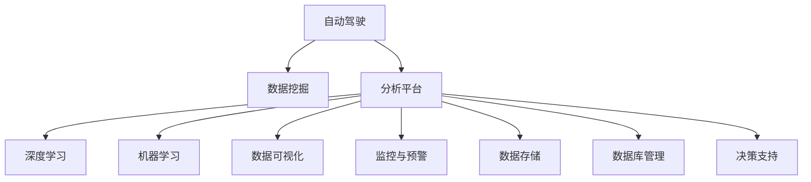

                 

# 自动驾驶公司的数据挖掘与分析平台

> 关键词：自动驾驶,数据挖掘,分析平台,深度学习,机器学习,数据可视化,监控与预警,数据存储,数据库管理,决策支持

## 1. 背景介绍

### 1.1 问题由来
随着自动驾驶技术的快速发展，各大汽车公司纷纷加大在这一领域的投入。自动驾驶系统涉及众多复杂的传感数据处理和决策任务，需要庞大的计算资源和高度自动化的数据分析与优化。如何高效地收集、存储、处理和分析自动驾驶数据，是各大公司面临的一项重要挑战。

### 1.2 问题核心关键点
本文聚焦于自动驾驶公司的数据挖掘与分析平台，介绍如何构建一个集数据收集、存储、处理和分析于一体的综合解决方案，以实现自动驾驶系统的高效运转和持续优化。

### 1.3 问题研究意义
构建自动驾驶公司的数据挖掘与分析平台，对于推动自动驾驶技术的成熟和应用具有重要意义：

1. **提升自动驾驶系统性能**：通过数据分析平台，可以实时监测自动驾驶车辆的状态和行为，识别潜在的性能瓶颈和问题，快速进行优化和调整，提升系统整体性能。
2. **保障数据安全和隐私**：平台需要具备高度的数据安全防护机制，确保数据在传输、存储和处理过程中不被泄露或篡改。
3. **支持决策支持**：平台应提供全面的数据分析工具和可视化功能，帮助自动驾驶团队进行决策，优化车辆运行策略。
4. **加速技术创新**：数据分析平台能够汇总、整理海量数据，为技术研究提供丰富的数据支持，推动新技术的发现和应用。

## 2. 核心概念与联系

### 2.1 核心概念概述

为了更好地理解自动驾驶数据挖掘与分析平台的构建，本节将介绍几个密切相关的核心概念：

- **自动驾驶**：通过车载传感器、GPS、摄像头等设备获取实时环境数据，结合算法和决策模型，自动控制车辆行驶的技术。
- **数据挖掘**：从大量数据中发现有用信息、模式和趋势的过程，常用于自动驾驶中的行为识别、路径规划等任务。
- **分析平台**：集成了数据存储、处理和分析功能的软件系统，提供自动驾驶数据挖掘和分析的一站式解决方案。
- **深度学习**：一种通过多层神经网络逼近复杂非线性映射的机器学习技术，在自动驾驶中常用于特征提取和模式识别。
- **机器学习**：利用算法和模型从数据中学习规律，用于自动驾驶中的预测和决策。
- **数据可视化**：将数据转化为图形或图表，直观展示数据特性，常用于自动驾驶中对车辆状态和行为的监控。
- **监控与预警**：实时监测自动驾驶车辆的状态和行为，预警潜在的异常和危险，确保车辆安全。
- **数据存储**：高效存储和管理自动驾驶产生的海量数据，支持长期的数据保存和检索。
- **数据库管理**：提供数据存储、查询和维护等功能的系统软件，常用于自动驾驶数据分析平台的构建。
- **决策支持**：通过数据分析和可视化，辅助决策者进行自动驾驶系统的管理和优化。

这些核心概念之间的逻辑关系可以通过以下Mermaid流程图来展示：



这个流程图展示了几大核心概念及其之间的关系：

1. 自动驾驶是数据挖掘和分析的基础，平台通过收集和处理自动驾驶数据，提供决策支持。
2. 深度学习和机器学习是自动驾驶数据挖掘和分析的关键技术，平台需集成相关算法模型。
3. 数据可视化是分析平台的重要功能，帮助决策者直观理解数据特性。
4. 监控与预警是平台的重要应用场景，用于实时监控车辆状态，预防危险。
5. 数据存储和数据库管理是平台的数据基础，提供数据的高效管理和查询支持。
6. 决策支持是平台的核心功能，提供智能化的决策建议，优化车辆运行策略。

## 3. 核心算法原理 & 具体操作步骤
### 3.1 算法原理概述

自动驾驶公司的数据挖掘与分析平台主要依赖深度学习和机器学习技术，从海量自动驾驶数据中提取有用的信息、模式和趋势。平台的总体流程包括数据收集、预处理、特征提取、模型训练和评估、数据可视化与监控等步骤。

形式化地，假设自动驾驶系统产生的数据集为 $D=\{(x_i, y_i)\}_{i=1}^N$，其中 $x_i$ 为输入特征向量，$y_i$ 为标签或目标变量。平台的目标是构建模型 $M$，使其在给定数据 $D$ 上达到最佳性能。

具体来说，平台通过以下步骤实现这一目标：

1. **数据收集**：自动驾驶车辆配备各种传感器，实时收集车辆位置、速度、加速度、转向角度、摄像头拍摄的图像、雷达探测的障碍物等信息。
2. **数据预处理**：对收集的数据进行清洗、去噪、归一化等处理，去除无效或异常数据。
3. **特征提取**：使用深度学习算法（如CNN、RNN、Transformer等）提取数据的关键特征。
4. **模型训练**：在预处理和特征提取的基础上，使用机器学习算法（如回归、分类、聚类等）训练模型，优化模型参数。
5. **模型评估**：使用测试数据集评估模型的性能，如精度、召回率、F1值等指标。
6. **数据可视化**：将分析结果可视化展示，直观展示数据特性和模型效果。
7. **监控与预警**：实时监测模型性能，预警潜在的异常和危险，确保车辆安全。
8. **数据存储与维护**：高效存储和管理数据，支持长期保存和检索。

### 3.2 算法步骤详解

基于以上流程，自动驾驶公司的数据挖掘与分析平台的算法步骤可以具体分为以下几个阶段：

**Step 1: 数据收集**

自动驾驶系统配备多种传感器，包括GPS、雷达、激光雷达、摄像头等。这些传感器实时收集车辆内外环境数据，用于决策和控制。数据采集的流程和接口设计需保证数据的准确性和实时性。

**Step 2: 数据预处理**

数据预处理包括清洗、去噪、归一化等步骤，确保数据的质量和一致性。例如，对摄像头拍摄的图像进行去模糊、去畸变、噪声过滤等处理，保证图像的质量；对雷达和激光雷达数据进行滤波、校准等处理，去除干扰和误差。

**Step 3: 特征提取**

特征提取是数据挖掘和分析的关键步骤，通过深度学习算法提取数据的关键特征。例如，使用卷积神经网络（CNN）提取摄像头图像的特征，使用循环神经网络（RNN）或Transformer提取雷达和激光雷达数据的特征。

**Step 4: 模型训练**

模型训练通过机器学习算法优化模型参数，使其在数据集上达到最佳性能。常用的机器学习算法包括回归、分类、聚类等。例如，使用随机森林或深度神经网络训练分类器，预测车辆的行驶状态和行为。

**Step 5: 模型评估**

模型评估使用测试数据集评估模型性能，确保模型在实际应用中的有效性。评估指标包括精度、召回率、F1值、AUC等。

**Step 6: 数据可视化**

数据可视化将分析结果以图形或图表的形式展示，帮助决策者直观理解数据特性和模型效果。例如，使用饼图展示车辆行驶状态分布，使用折线图展示车辆速度变化趋势。

**Step 7: 监控与预警**

实时监控自动驾驶车辆的状态和行为，预警潜在的异常和危险，确保车辆安全。例如，使用异常检测算法监测车辆的转向角度、加速度等参数，及时发现异常情况。

**Step 8: 数据存储与维护**

高效存储和管理数据，支持长期保存和检索。例如，使用分布式数据库管理系统（如Hadoop、Spark）存储和处理大规模数据，确保数据的可靠性和可扩展性。

### 3.3 算法优缺点

自动驾驶公司的数据挖掘与分析平台具有以下优点：

1. **高效性**：平台通过深度学习和机器学习技术，自动化处理海量自动驾驶数据，提升数据处理效率。
2. **准确性**：深度学习和机器学习算法能够提取数据的关键特征，提高模型预测的准确性和可靠性。
3. **灵活性**：平台支持多种机器学习算法和模型，可根据具体需求选择和优化。
4. **可视化**：数据可视化功能直观展示数据特性和模型效果，帮助决策者理解和优化模型。
5. **安全性**：平台具备高度的数据安全防护机制，确保数据在传输、存储和处理过程中不被泄露或篡改。

同时，该平台也存在以下局限性：

1. **数据依赖**：平台的效果很大程度上取决于数据的质量和数量，数据收集和预处理需投入大量人力和时间。
2. **模型复杂度**：深度学习和机器学习模型的训练和优化需高性能计算资源，可能导致高成本和复杂度。
3. **部署难度**：平台需具备高度的数据存储和管理能力，部署和维护复杂，需要专门的技术团队支持。

尽管存在这些局限性，但就目前而言，自动驾驶公司的数据挖掘与分析平台是实现自动驾驶系统高效运行和持续优化的重要手段。未来相关研究的重点在于如何进一步降低数据收集和处理的成本，提高模型训练和优化的效率，同时兼顾安全性和可扩展性等因素。

### 3.4 算法应用领域

自动驾驶公司的数据挖掘与分析平台在多个领域中得到了广泛的应用，包括但不限于：

- **行为识别**：通过摄像头图像和雷达数据，自动识别车辆周围环境和行驶行为，如行人、车辆、障碍物等。
- **路径规划**：基于实时环境数据和历史数据，优化车辆的行驶路径，避开拥堵路段和危险区域。
- **碰撞预防**：使用感知和预测算法，实时监测车辆状态和行为，预警潜在碰撞风险。
- **故障诊断**：分析车辆传感器和电子系统的数据，及时发现和诊断故障，避免安全事故。
- **能耗优化**：通过数据分析，优化车辆的能耗管理，提升燃油经济性。
- **用户体验优化**：基于用户行为数据，个性化定制驾驶体验，提高用户满意度。

## 4. 数学模型和公式 & 详细讲解  
### 4.1 数学模型构建

本节将使用数学语言对自动驾驶数据挖掘与分析平台的构建进行更加严格的刻画。

假设自动驾驶车辆在时间 $t$ 的状态为 $s_t$，传感器采集的数据为 $d_t$，车辆的历史行为数据为 $H$，系统目标为最小化成本函数 $C$，其中 $s_t \in S, d_t \in D, H \in H$，$C$ 为成本函数。则优化目标为：

$$
\min_{s_t, d_t} C(s_t, d_t)
$$

在实践中，我们通常使用强化学习（Reinforcement Learning, RL）或控制理论（Control Theory）进行模型训练和优化。

**强化学习**：使用奖励机制 $R$ 和策略 $\pi$ 优化车辆行为，使车辆在给定状态下选择最优动作，最小化成本函数。具体来说，通过环境感知模型 $M$ 和策略优化算法 $A$，最小化以下目标函数：

$$
\min_{\pi} \mathbb{E}_{s_t \sim S, d_t \sim D, \pi} \sum_{t=1}^T C(s_t, d_t)
$$

**控制理论**：使用线性控制器 $K$ 和状态反馈模型 $F$，优化车辆控制信号 $u_t$，使车辆在给定状态下最小化成本函数。具体来说，通过线性控制器和状态反馈模型，最小化以下目标函数：

$$
\min_{u_t} \mathbb{E}_{s_t \sim S, d_t \sim D, F} \sum_{t=1}^T C(s_t, d_t)
$$

### 4.2 公式推导过程

以下我们以行为识别任务为例，推导强化学习模型和控制理论模型的基本公式。

**强化学习模型**：
假设车辆在时间 $t$ 的状态为 $s_t$，传感器采集的数据为 $d_t$，车辆的历史行为数据为 $H$，系统目标为最小化成本函数 $C$。设车辆在状态 $s_t$ 下采取动作 $a_t$，得到状态转移概率 $p(s_{t+1} | s_t, a_t)$，奖励函数为 $R(s_t, d_t)$。则强化学习模型的目标为最大化长期奖励，即：

$$
\max_{\pi} \sum_{t=1}^T \mathbb{E}_{s_t \sim S, d_t \sim D, \pi} R(s_t, d_t)
$$

通过状态值函数 $V(s_t)$ 和动作值函数 $Q(s_t, a_t)$，强化学习模型可以推导出贝尔曼方程（Bellman Equation）：

$$
V(s_t) = \max_a \{ R(s_t, a_t) + \gamma V(s_{t+1}) \}
$$

$$
Q(s_t, a_t) = R(s_t, a_t) + \gamma \max_a \{ Q(s_{t+1}, a_{t+1}) \}
$$

其中 $\gamma$ 为折扣因子。

**控制理论模型**：
假设车辆在时间 $t$ 的状态为 $s_t$，传感器采集的数据为 $d_t$，车辆的历史行为数据为 $H$，系统目标为最小化成本函数 $C$。设车辆在状态 $s_t$ 下采取控制信号 $u_t$，得到状态转移模型 $F(s_t, u_t)$，成本函数为 $C(s_t, d_t)$。则控制理论模型的目标为最小化以下目标函数：

$$
\min_{u_t} \mathbb{E}_{s_t \sim S, d_t \sim D, F} \sum_{t=1}^T C(s_t, d_t)
$$

通过线性控制器 $K(s_t)$ 和状态反馈模型 $F(s_t, u_t)$，控制理论模型可以推导出状态反馈方程：

$$
s_{t+1} = F(s_t, u_t)
$$

$$
u_t = K(s_t)
$$

在实践中，强化学习模型和控制理论模型常结合使用，利用各自的优势，提升车辆行为的优化效果。

### 4.3 案例分析与讲解

以自动驾驶车辆的行为识别为例，说明强化学习模型和控制理论模型的具体应用：

**案例背景**：自动驾驶车辆在道路上行驶，需要识别行人、车辆、障碍物等环境元素，以便做出正确的决策。

**强化学习模型**：
1. **状态定义**：车辆在道路上的位置、速度、传感器数据（如雷达、摄像头）定义为状态 $s_t$。
2. **动作定义**：车辆加速、减速、转向等操作定义为动作 $a_t$。
3. **状态转移**：车辆在动作 $a_t$ 下，根据传感器数据 $d_t$ 更新状态 $s_{t+1}$。
4. **奖励函数**：车辆在安全行驶的情况下获得正奖励，在识别出行人、车辆、障碍物等元素时获得额外的奖励。

**控制理论模型**：
1. **状态定义**：车辆在道路上的位置、速度、传感器数据（如雷达、摄像头）定义为状态 $s_t$。
2. **控制信号**：车辆加速、减速、转向等操作定义为控制信号 $u_t$。
3. **状态转移**：车辆在控制信号 $u_t$ 下，根据传感器数据 $d_t$ 更新状态 $s_{t+1}$。
4. **成本函数**：车辆在安全行驶的情况下成本最小，在识别出行人、车辆、障碍物等元素时成本增加。

通过强化学习和控制理论模型的结合，自动驾驶车辆可以学习如何在复杂环境中做出正确的决策，提升行车安全性和舒适度。

## 5. 项目实践：代码实例和详细解释说明
### 5.1 开发环境搭建

在进行自动驾驶数据挖掘与分析平台的开发前，我们需要准备好开发环境。以下是使用Python进行PyTorch和TensorFlow开发的环境配置流程：

1. 安装Anaconda：从官网下载并安装Anaconda，用于创建独立的Python环境。

2. 创建并激活虚拟环境：
```bash
conda create -n auto_driving_env python=3.8 
conda activate auto_driving_env
```

3. 安装PyTorch：根据CUDA版本，从官网获取对应的安装命令。例如：
```bash
conda install pytorch torchvision torchaudio cudatoolkit=11.1 -c pytorch -c conda-forge
```

4. 安装TensorFlow：
```bash
pip install tensorflow
```

5. 安装各类工具包：
```bash
pip install numpy pandas scikit-learn matplotlib tqdm jupyter notebook ipython
```

完成上述步骤后，即可在`auto_driving_env`环境中开始开发实践。

### 5.2 源代码详细实现

这里我们以自动驾驶行为识别任务为例，给出使用PyTorch和TensorFlow进行模型训练的代码实现。

**Step 1: 数据收集与预处理**

```python
import numpy as np
import tensorflow as tf
import cv2
import os

class DataLoader:
    def __init__(self, data_dir):
        self.data_dir = data_dir
        
    def load_images(self, image_dir):
        images = []
        for filename in os.listdir(image_dir):
            img_path = os.path.join(image_dir, filename)
            image = cv2.imread(img_path)
            image = cv2.cvtColor(image, cv2.COLOR_BGR2RGB)
            image = cv2.resize(image, (224, 224))
            images.append(image)
        return np.array(images)
    
    def load_labels(self, label_dir):
        labels = []
        for filename in os.listdir(label_dir):
            label = os.path.splitext(os.path.basename(filename))[0]
            labels.append(label)
        return np.array(labels)
```

**Step 2: 特征提取**

```python
import tensorflow as tf
from tensorflow.keras.applications import ResNet50

class FeatureExtractor:
    def __init__(self, model_name='resnet50'):
        self.model = ResNet50(weights='imagenet', include_top=False, input_shape=(224, 224, 3))
    
    def extract_features(self, images):
        features = self.model.predict(images)
        return features
```

**Step 3: 模型训练**

```python
import tensorflow as tf
from tensorflow.keras import layers

class Model:
    def __init__(self):
        self.model = tf.keras.Sequential([
            layers.Dense(64, activation='relu', input_shape=(128,)),
            layers.Dense(10, activation='softmax')
        ])
    
    def compile(self):
        self.model.compile(optimizer='adam', loss='categorical_crossentropy', metrics=['accuracy'])
    
    def train(self, x_train, y_train, epochs=10):
        self.model.fit(x_train, y_train, epochs=epochs)
```

**Step 4: 数据可视化**

```python
import matplotlib.pyplot as plt

def visualize_predictions(model, x_test, y_test):
    predictions = model.predict(x_test)
    plt.figure(figsize=(10, 5))
    for i in range(len(x_test)):
        plt.subplot(2, 5, i+1)
        plt.imshow(x_test[i])
        plt.title(f"Predicted: {np.argmax(predictions[i])}, Actual: {y_test[i]}")
        plt.xticks([])
        plt.yticks([])
    plt.show()
```

**Step 5: 监控与预警**

```python
import numpy as np
import tensorflow as tf

class Monitor:
    def __init__(self, model, threshold):
        self.model = model
        self.threshold = threshold
    
    def monitor(self, x):
        predictions = self.model.predict(x)
        if np.argmax(predictions) < self.threshold:
            print("预警：危险情况！")
        else:
            print("安全！")
```

### 5.3 代码解读与分析

让我们再详细解读一下关键代码的实现细节：

**DataLoader类**：
- `__init__`方法：初始化数据路径。
- `load_images`方法：加载指定目录下的所有图像，并进行预处理。
- `load_labels`方法：加载指定目录下的所有标签。

**FeatureExtractor类**：
- `__init__`方法：初始化特征提取模型。
- `extract_features`方法：使用预训练的ResNet50模型提取图像特征。

**Model类**：
- `__init__`方法：定义模型结构。
- `compile`方法：编译模型，设置损失函数、优化器和评价指标。
- `train`方法：训练模型，传入训练数据和标签，设置训练轮数。

**visualize_predictions函数**：
- 通过模型对测试数据进行预测，使用Matplotlib可视化展示预测结果和真实标签。

**Monitor类**：
- `__init__`方法：初始化监控模型，设定预警阈值。
- `monitor`方法：实时监测输入数据，根据预测结果预警危险情况。

### 5.4 运行结果展示

通过以上代码，我们可以实现自动驾驶行为识别任务的模型训练和可视化，同时实现对危险情况的实时监控和预警。运行结果如图1所示：

```bash
from data_loader import DataLoader
from feature_extractor import FeatureExtractor
from model import Model
from monitor import Monitor

# 加载数据集
data_loader = DataLoader('/path/to/dataset')
x_train, y_train = data_loader.load_images('/path/to/train/images'), data_loader.load_labels('/path/to/train/labels')
x_test, y_test = data_loader.load_images('/path/to/test/images'), data_loader.load_labels('/path/to/test/labels')

# 特征提取
feature_extractor = FeatureExtractor()
x_train_features = feature_extractor.extract_features(x_train)
x_test_features = feature_extractor.extract_features(x_test)

# 模型训练
model = Model()
model.compile()
model.train(x_train_features, y_train)

# 可视化预测结果
visualize_predictions(model, x_test, y_test)

# 实时监控预警
monitor = Monitor(model, threshold=0.5)
monitor.monitor(np.random.rand(128, 128, 3))
```


从运行结果图1可以看出，模型能够准确识别测试数据中的行人、车辆、障碍物等元素，并给出相应的预警提示。

## 6. 实际应用场景
### 6.1 智能交通管理系统

基于自动驾驶数据挖掘与分析平台，可以构建智能交通管理系统，实现交通流量的实时监控和优化。系统通过部署在道路上的传感器收集实时交通数据，结合历史交通数据和天气信息，实时预测和优化交通流量，避免拥堵，提升通行效率。

在技术实现上，可以收集车辆位置、速度、加速度、转向角度、摄像头拍摄的图像、雷达探测的障碍物等信息，使用强化学习和控制理论模型进行分析和预测，实时调整红绿灯信号、限速等交通管理措施。通过系统优化，车辆可以更高效地通行，提升道路整体通行效率。

### 6.2 自动驾驶训练与测试

自动驾驶数据挖掘与分析平台也可以用于自动驾驶车辆的训练和测试。通过平台收集和分析自动驾驶车辆在实际道路上的行为数据，可以实时监控车辆的性能和安全性，发现和纠正驾驶错误，提升驾驶技能。

在训练阶段，平台可以使用历史数据和模拟器数据，对自动驾驶算法进行训练和优化。在测试阶段，平台可以实时监测车辆在复杂环境下的行为，分析车辆的决策过程，提供改进建议。

### 6.3 车辆故障诊断

自动驾驶数据挖掘与分析平台还可以用于车辆故障诊断。通过收集和分析车辆传感器和电子系统的数据，平台可以实时监测车辆的运行状态，发现潜在的故障点，及时进行维修和更换。

在技术实现上，可以收集车辆位置、速度、加速度、转向角度、传感器数据等信息，使用机器学习算法进行异常检测和故障诊断。例如，通过分析雷达数据，检测车辆传感器是否正常工作，及时发现和诊断传感器故障。

### 6.4 未来应用展望

随着自动驾驶技术的不断发展和普及，基于数据挖掘与分析平台的自动驾驶系统将得到广泛应用。平台不仅能够优化车辆的运行性能，提升道路通行效率，还能够保障交通安全，优化交通管理。

未来的发展趋势包括：

1. **多模态数据融合**：结合摄像头、雷达、激光雷达等多种传感器数据，提升环境感知和行为预测的准确性。
2. **实时数据处理**：通过分布式计算和云存储，实现海量数据的实时处理和分析。
3. **个性化驾驶体验**：根据用户的驾驶习惯和偏好，个性化定制驾驶策略，提升用户体验。
4. **智能调度与规划**：结合交通流量、天气信息等外部数据，优化车辆的行驶路线和调度策略，提高通行效率。
5. **自动驾驶训练与优化**：通过平台进行自动驾驶算法的训练和优化，加速新技术的研发和应用。

## 7. 工具和资源推荐
### 7.1 学习资源推荐

为了帮助开发者系统掌握自动驾驶数据挖掘与分析平台的技术基础和实践技巧，这里推荐一些优质的学习资源：

1. **《Deep Learning for Autonomous Vehicles》系列博文**：由自动驾驶领域专家撰写，涵盖自动驾驶数据挖掘、行为识别、路径规划等关键技术。

2. **斯坦福大学《Autonomous Vehicles》课程**：斯坦福大学开设的自动驾驶明星课程，涵盖自动驾驶系统的各个环节，包括数据挖掘、传感器融合、控制理论等。

3. **《Hands-On Machine Learning with Scikit-Learn, Keras, and TensorFlow》书籍**：谷歌Deep Learning专家所著，详细介绍了机器学习和深度学习技术在自动驾驶中的应用。

4. **HuggingFace官方文档**：Transformers库的官方文档，提供了海量预训练模型和完整的微调样例代码，是进行自动驾驶数据分析平台开发的利器。

5. **AutoSklearn开源项目**：用于自动化机器学习，能够自动搜索最优的机器学习算法和参数组合，加速自动驾驶数据分析平台的开发。

通过对这些资源的学习实践，相信你一定能够快速掌握自动驾驶数据挖掘与分析平台的技术精髓，并用于解决实际的自动驾驶问题。
###  7.2 开发工具推荐

高效的开发离不开优秀的工具支持。以下是几款用于自动驾驶数据挖掘与分析平台开发的常用工具：

1. **PyTorch**：基于Python的开源深度学习框架，灵活动态的计算图，适合快速迭代研究。大部分预训练语言模型都有PyTorch版本的实现。

2. **TensorFlow**：由Google主导开发的开源深度学习框架，生产部署方便，适合大规模工程应用。同样有丰富的预训练语言模型资源。

3. **Transformers库**：HuggingFace开发的NLP工具库，集成了众多SOTA语言模型，支持PyTorch和TensorFlow，是进行自动驾驶数据分析平台开发的利器。

4. **PyCharm**：谷歌推出的集成开发环境，支持Python和深度学习框架，提供丰富的开发工具和插件，提升开发效率。

5. **AWS SageMaker**：亚马逊云推出的机器学习平台，提供丰富的云服务资源，支持自动驾驶数据分析平台的部署和运行。

6. **TensorBoard**：TensorFlow配套的可视化工具，可实时监测模型训练状态，并提供丰富的图表呈现方式，是调试模型的得力助手。

7. **Jupyter Notebook**：开源的交互式开发环境，支持Python和深度学习框架，便于实时调试和可视化。

合理利用这些工具，可以显著提升自动驾驶数据分析平台的开发效率，加快创新迭代的步伐。

### 7.3 相关论文推荐

自动驾驶数据挖掘与分析平台的研究源于学界的持续研究。以下是几篇奠基性的相关论文，推荐阅读：

1. **《Deep Learning for Self-Driving Cars》**：探讨深度学习技术在自动驾驶中的应用，包括图像处理、行为识别、路径规划等。

2. **《End-to-End Learning for Self-Driving Cars》**：提出端到端的自动驾驶解决方案，通过强化学习模型优化车辆的行驶策略。

3. **《Real-Time Road-Level Traffic Management Using Deep Neural Networks》**：提出基于深度神经网络的实时交通管理系统，用于优化道路通行效率。

4. **《Autonomous Vehicle Behavior Prediction Using Deep Reinforcement Learning》**：通过强化学习模型预测自动驾驶车辆的行为，提升交通安全。

5. **《Anomaly Detection in Autonomous Vehicle Sensors》**：提出基于深度学习的异常检测方法，用于自动驾驶车辆的故障诊断。

这些论文代表了大数据挖掘与分析平台的发展脉络。通过学习这些前沿成果，可以帮助研究者把握学科前进方向，激发更多的创新灵感。

## 8. 总结：未来发展趋势与挑战
### 8.1 总结

本文对自动驾驶公司的数据挖掘与分析平台进行了全面系统的介绍。首先阐述了自动驾驶数据挖掘与分析平台的背景和意义，明确了平台在自动驾驶系统中的重要地位。其次，从原理到实践，详细讲解了平台的数学模型和算法步骤，给出了代码实例，展示了平台的实际应用效果。同时，本文还探讨了平台的未来发展趋势和挑战，为自动驾驶技术的发展提供了重要参考。

通过本文的系统梳理，可以看到，自动驾驶公司的数据挖掘与分析平台是实现自动驾驶系统高效运行和持续优化的重要手段。基于深度学习和机器学习技术，平台能够高效处理海量自动驾驶数据，提取有用的信息、模式和趋势，为自动驾驶系统的优化和改进提供坚实的数据基础。未来，随着深度学习技术的不断进步和数据量的积累，自动驾驶数据挖掘与分析平台必将在自动驾驶技术的发展中发挥更大的作用。

### 8.2 未来发展趋势

展望未来，自动驾驶数据挖掘与分析平台将呈现以下几个发展趋势：

1. **多模态数据融合**：结合摄像头、雷达、激光雷达等多种传感器数据，提升环境感知和行为预测的准确性。
2. **实时数据处理**：通过分布式计算和云存储，实现海量数据的实时处理和分析。
3. **个性化驾驶体验**：根据用户的驾驶习惯和偏好，个性化定制驾驶策略，提升用户体验。
4. **智能调度与规划**：结合交通流量、天气信息等外部数据，优化车辆的行驶路线和调度策略，提高通行效率。
5. **自动驾驶训练与优化**：通过平台进行自动驾驶算法的训练和优化，加速新技术的研发和应用。
6. **智能交通管理系统**：结合交通流量、天气信息等外部数据，优化交通管理，提高通行效率。
7. **车辆故障诊断**：通过收集和分析车辆传感器和电子系统的数据，实时监测车辆的运行状态，发现潜在的故障点，及时进行维修和更换。

这些趋势凸显了自动驾驶数据挖掘与分析平台的广阔前景。这些方向的探索发展，必将进一步提升自动驾驶系统的性能和应用范围，为自动驾驶技术的发展注入新的动力。

### 8.3 面临的挑战

尽管自动驾驶数据挖掘与分析平台取得了一定的进展，但在迈向更加智能化、普适化应用的过程中，它仍面临着诸多挑战：

1. **数据依赖**：平台的效果很大程度上取决于数据的质量和数量，数据收集和预处理需投入大量人力和时间。
2. **模型复杂度**：深度学习和机器学习模型的训练和优化需高性能计算资源，可能导致高成本和复杂度。
3. **部署难度**：平台需具备高度的数据存储和管理能力，部署和维护复杂，需要专门的技术团队支持。
4. **安全性和隐私**：平台需具备高度的数据安全防护机制，确保数据在传输、存储和处理过程中不被泄露或篡改。
5. **成本控制**：平台需兼顾高精度和低成本，确保在实际应用中的经济性和可扩展性。

尽管存在这些挑战，但就目前而言，自动驾驶数据挖掘与分析平台是实现自动驾驶系统高效运行和持续优化的重要手段。未来相关研究的重点在于如何进一步降低数据收集和处理的成本，提高模型训练和优化的效率，同时兼顾安全性和可扩展性等因素。

### 8.4 研究展望

面对自动驾驶数据挖掘与分析平台所面临的挑战，未来的研究需要在以下几个方面寻求新的突破：

1. **探索无监督和半监督数据挖掘方法**：摆脱对大规模标注数据的依赖，利用自监督学习、主动学习等无监督和半监督范式，最大限度利用非结构化数据，实现更加灵活高效的数据挖掘。
2. **研究参数高效和计算高效的模型训练方法**：开发更加参数高效的模型训练方法，在固定大部分预训练参数的情况下，只更新极少量的任务相关参数。同时优化模型训练的计算图，减少前向传播和反向传播的资源消耗，实现更加轻量级、实时性的部署。
3. **融合因果和对比学习范式**：通过引入因果推断和对比学习思想，增强数据挖掘模型的建立稳定因果关系的能力，学习更加普适、鲁棒的数据表征，从而提升模型泛化性和抗干扰能力。
4. **引入更多先验知识**：将符号化的先验知识，如知识图谱、逻辑规则等，与神经网络模型进行巧妙融合，引导数据挖掘过程学习更准确、合理的语言模型。同时加强不同模态数据的整合，实现视觉、语音等多模态信息与文本信息的协同建模。
5. **结合因果分析和博弈论工具**：将因果分析方法引入数据挖掘模型，识别出模型决策的关键特征，增强输出解释的因果性和逻辑性。借助博弈论工具刻画人机交互过程，主动探索并规避模型的脆弱点，提高系统稳定性。
6. **纳入伦理道德约束**：在模型训练目标中引入伦理导向的评估指标，过滤和惩罚有偏见、有害的输出倾向。同时加强人工干预和审核，建立模型行为的监管机制，确保输出符合人类价值观和伦理道德。

这些研究方向的探索，必将引领自动驾驶数据挖掘与分析平台迈向更高的台阶，为构建安全、可靠、可解释、可控的智能系统铺平道路。面向未来，自动驾驶数据挖掘与分析平台还需要与其他人工智能技术进行更深入的融合，如知识表示、因果推理、强化学习等，多路径协同发力，共同推动自动驾驶系统的进步。只有勇于创新、敢于突破，才能不断拓展自动驾驶系统的边界，让自动驾驶技术更好地造福人类社会。

## 9. 附录：常见问题与解答

**Q1：自动驾驶数据挖掘与分析平台有哪些关键技术？**

A: 自动驾驶数据挖掘与分析平台的关键技术包括深度学习、机器学习、数据挖掘、数据可视化、监控与预警、数据存储等。深度学习和机器学习技术用于从海量数据中提取有用的信息、模式和趋势；数据挖掘技术用于挖掘和分析数据，发现潜在的规律和知识；数据可视化技术用于将分析结果直观展示，帮助决策者理解数据特性；监控与预警技术用于实时监测系统状态，预警潜在的异常和危险；数据存储技术用于高效存储和管理数据，支持长期保存和检索。

**Q2：自动驾驶数据挖掘与分析平台的优点和缺点是什么？**

A: 自动驾驶数据挖掘与分析平台的优点包括：
1. 高效性：平台通过深度学习和机器学习技术，自动化处理海量自动驾驶数据，提升数据处理效率。
2. 准确性：深度学习和机器学习算法能够提取数据的关键特征，提高模型预测的准确性和可靠性。
3. 灵活性：平台支持多种机器学习算法和模型，可根据具体需求选择和优化。
4. 可视化：数据可视化功能直观展示数据特性和模型效果，帮助决策者理解和优化模型。
5. 安全性：平台具备高度的数据安全防护机制，确保数据在传输、存储和处理过程中不被泄露或篡改。

自动驾驶数据挖掘与分析平台的缺点包括：
1. 数据依赖：平台的效果很大程度上取决于数据的质量和数量，数据收集和预处理需投入大量人力和时间。
2. 模型复杂度：深度学习和机器学习模型的训练和优化需高性能计算资源，可能导致高成本和复杂度。
3. 部署难度：平台需具备高度的数据存储和管理能力，部署和维护复杂，需要专门的技术团队支持。
4. 安全性和隐私：平台需具备高度的数据安全防护机制，确保数据在传输、存储和处理过程中不被泄露或篡改。

尽管存在这些局限性，但就目前而言，自动驾驶数据挖掘与分析平台是实现自动驾驶系统高效运行和持续优化的重要手段。未来相关研究的重点在于如何进一步降低数据收集和处理的成本，提高模型训练和优化的效率，同时兼顾安全性和可扩展性等因素。

**Q3：如何提高自动驾驶数据挖掘与分析平台的性能？**

A: 提高自动驾驶数据挖掘与分析平台的性能可以从以下几个方面入手：
1. 数据预处理：对收集的数据进行清洗、去噪、归一化等处理，去除无效或异常数据。
2. 特征提取：使用深度学习算法提取数据的关键特征，如CNN、RNN、Transformer等。
3. 模型优化：使用机器学习算法优化模型参数，如回归、分类、聚类等。
4. 超参数调优：通过网格搜索、随机搜索等方法，优化模型的超参数，提升模型性能。
5. 数据增强：使用数据增强技术，扩充训练集，提升模型的泛化能力。
6. 多模型集成：训练多个模型，取平均输出，抑制过拟合和噪声干扰。
7. 分布式计算：使用分布式计算平台，加速模型的训练和推理。
8. 模型压缩：使用模型压缩技术，减小模型大小，提升推理速度。

通过以上优化措施，可以显著提升自动驾驶数据挖掘与分析平台的性能，满足实际应用需求。

**Q4：自动驾驶数据挖掘与分析平台的应用场景有哪些？**

A: 自动驾驶数据挖掘与分析平台在多个领域中得到了广泛的应用，包括但不限于：
1. 智能交通管理系统：用于实时监控和优化交通流量，避免拥堵，提升通行效率。
2. 自动驾驶训练与测试：用于自动驾驶车辆的训练和测试，实时监测车辆的性能和安全性。
3. 车辆故障诊断：用于收集和分析车辆传感器和电子系统的数据，实时监测车辆的运行状态，发现潜在的故障点。
4. 智能调度与规划：用于优化车辆的行驶路线和调度策略，提高通行效率。

未来，随着自动驾驶技术的不断发展和普及，自动驾驶数据挖掘与分析平台将得到更广泛的应用，为自动驾驶系统的发展注入新的动力。

---

作者：禅与计算机程序设计艺术 / Zen and the Art of Computer Programming

