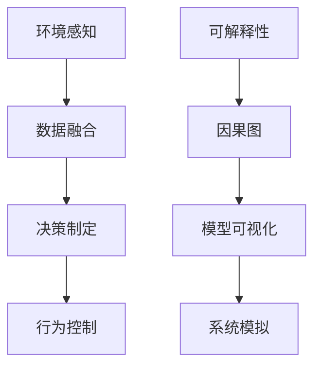
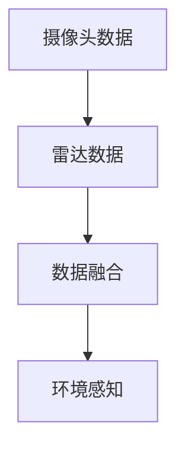
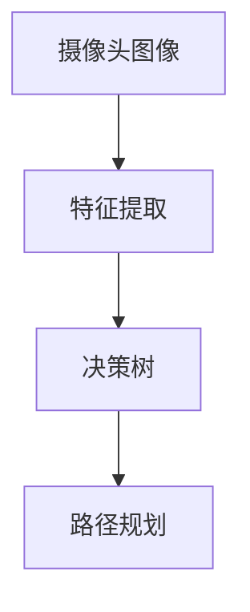
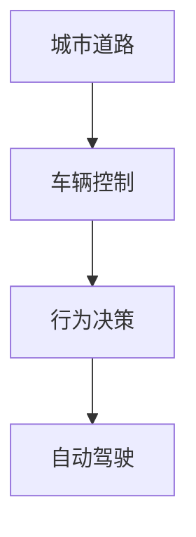
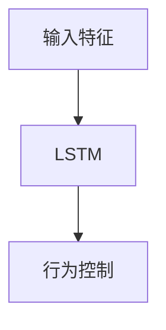

                 

# 自动驾驶系统可解释性评估与改进的关键问题与新思路

> 关键词：自动驾驶、可解释性、评估方法、改进策略、因果图、模型可视化、系统模拟

## 1. 背景介绍

### 1.1 问题由来

自动驾驶技术近年来迅速发展，其高精度定位、智能决策和自主控制的能力，使得其在交通、运输、物流等诸多领域具备广阔的应用前景。但与此同时，自动驾驶系统复杂性高、安全性要求严，受到社会各界的广泛关注。为增强系统的可信度和透明度，确保用户对系统的信任，可解释性成为自动驾驶技术发展中的重要问题。

可解释性指的是系统决策和行为的可理解性和可解释性。在自动驾驶系统中，可解释性具体表现为：
1. 系统如何感知环境、识别目标和判断行为决策。
2. 系统决策过程中的关键特征和触发因素。
3. 系统在面对突发情况和异常输入时的反应机制。
4. 系统行为和输出结果的逻辑和依据。

可解释性不仅关系到用户对系统的信任，也是法规合规和安全评估的基础。因此，对自动驾驶系统的可解释性进行系统化评估和改进，已经成为迫切需求。

### 1.2 问题核心关键点

自动驾驶系统的可解释性评估和改进，主要围绕以下核心问题展开：
1. **系统行为的解释**：自动驾驶系统如何做出决策，包括环境感知、路径规划和行为控制等环节。
2. **决策过程的透明化**：系统决策的依据和计算过程是否可理解、可追溯。
3. **特征和因素的重要性**：在决策过程中，哪些特征和因素对结果影响最大。
4. **异常情况的应对**：系统如何处理未知和异常情况，确保系统的鲁棒性和可靠性。
5. **模拟和验证**：通过模型仿真和实际测试，验证系统的可解释性和决策逻辑。

这些问题涵盖了自动驾驶系统从数据感知到行为决策的全流程，需要通过综合性的方法进行分析和改进。

## 2. 核心概念与联系

### 2.1 核心概念概述

为了更好地理解自动驾驶系统的可解释性评估和改进，本节将介绍几个关键的概念和联系：

- **自动驾驶系统**：通过传感器获取环境信息，运用AI算法进行智能决策和控制，实现自动导航和驾驶的车辆系统。
- **环境感知**：系统对周围环境的感知和数据获取，包括摄像头、雷达、激光雷达、GPS等传感器的数据融合。
- **决策制定**：系统根据感知数据，结合规则和模型，做出路径规划和行为控制决策。
- **可解释性**：系统的决策过程和行为结果，是否可被用户理解和信任。
- **因果图**：用于表示系统各组件之间的因果关系和数据流向的图形模型。
- **模型可视化**：使用图形、表格、动画等形式，展示模型内部结构、参数变化和运行轨迹。
- **系统模拟**：通过模型或仿真，复现系统的运行过程，验证模型的行为和决策逻辑。

这些概念之间的逻辑关系可以通过以下Mermaid流程图来展示：



这个流程图展示了一些关键概念及其相互关系：

1. 环境感知和数据融合是系统决策的基础。
2. 决策制定和行为控制构成系统的核心功能。
3. 可解释性涉及系统各个环节的透明度和可理解性。
4. 因果图用于描述系统各组件之间的逻辑关系。
5. 模型可视化帮助理解模型的内部结构和行为变化。
6. 系统模拟用于验证模型的决策逻辑和性能。

通过理解这些核心概念，我们可以更好地把握自动驾驶系统的可解释性评估和改进。

## 3. 核心算法原理 & 具体操作步骤

### 3.1 算法原理概述

自动驾驶系统的可解释性评估和改进，主要基于以下算法原理：

- **因果图建模**：构建系统组件之间的因果图，明确数据流向和依赖关系，为可解释性评估提供结构化基础。
- **模型可视化**：通过可视化工具展示模型的结构、参数和运行轨迹，帮助用户理解模型的工作原理和行为特征。
- **系统模拟**：构建仿真环境，复现系统的运行过程，验证模型的行为和决策逻辑，发现潜在问题。
- **可解释性评估**：利用多种评估指标和方法，对系统的可解释性进行量化评估，找出薄弱环节。
- **改进策略**：针对评估结果，提出具体的改进措施，优化模型的结构和参数，增强系统的可解释性和鲁棒性。

### 3.2 算法步骤详解

基于上述算法原理，自动驾驶系统可解释性评估和改进的具体步骤如下：

**Step 1: 数据收集与预处理**

- 收集系统的传感器数据和决策记录，包括摄像头图像、雷达点云、GPS定位、行为控制命令等。
- 对数据进行清洗和归一化，消除异常值和噪声，确保数据质量。

**Step 2: 因果图构建**

- 分析系统的各个组件和功能模块，明确其输入、输出和内部状态。
- 构建因果图，表示各组件之间的数据流向和依赖关系，包括环境感知、决策制定、行为控制等环节。
- 使用图形化工具如CausalPy或PyCausalGraph，绘制因果图，确保结构清晰、逻辑合理。

**Step 3: 模型可视化**

- 使用可视化工具如TensorBoard、Jupyter Notebook或PyDot，展示模型的结构、参数和运行轨迹。
- 可视化决策树、注意力机制、权重分布等关键组件，帮助用户理解模型的内部机制。
- 制作动画和交互式图表，展示模型的动态行为，如路径规划、行为决策等。

**Step 4: 系统模拟**

- 构建仿真环境，模拟系统的运行过程，包括环境感知、数据融合、决策制定和行为控制等环节。
- 使用模拟器如CARLA或Simulation Toolkit，进行虚拟测试和验证。
- 通过模拟不同的环境条件和异常情况，评估模型的鲁棒性和可靠性。

**Step 5: 可解释性评估**

- 使用多种评估指标和方法，对系统的可解释性进行量化评估。
- 常见的评估指标包括Shapley值、LIME、SHAP等，评估模型的特征重要性和影响权重。
- 利用模型可视化工具，帮助用户理解模型的决策过程和关键特征。

**Step 6: 改进策略制定**

- 根据评估结果，提出具体的改进措施，优化模型的结构和参数。
- 包括增加特征提取能力、调整模型结构、引入规则约束等方法。
- 通过反复迭代，不断提升系统的可解释性和决策鲁棒性。

### 3.3 算法优缺点

自动驾驶系统可解释性评估和改进方法，具有以下优点：

1. **透明性和可理解性**：通过因果图和模型可视化，提高系统的透明性和用户可理解性。
2. **鲁棒性和可靠性**：通过系统模拟和评估，验证模型的鲁棒性和可靠性，发现潜在问题。
3. **可操作性和可改进性**：提供具体的改进措施，帮助开发者优化模型和系统。
4. **法规合规和安全评估**：为法规合规和安全评估提供数据和逻辑依据。

但这些方法也存在一些局限性：

1. **数据需求量大**：收集和预处理数据的工作量较大，特别是传感器数据和决策记录。
2. **计算复杂度高**：构建和分析因果图，进行系统模拟和可解释性评估，计算复杂度较高。
3. **解释精度有限**：尽管可解释性评估和改进方法可以提供一定的解释，但精度和准确度仍需进一步提升。
4. **用户接受度参差不齐**：不同用户对系统可解释性的需求和理解程度不同，难以满足所有用户的需求。
5. **动态和实时性**：这些方法主要针对静态和离线数据，对动态和实时数据的可解释性评估仍需进一步研究。

### 3.4 算法应用领域

自动驾驶系统可解释性评估和改进方法，已经广泛应用于以下几个领域：

1. **环境感知与数据融合**：通过因果图和模型可视化，理解环境感知模块的内部机制和数据流向。
2. **决策制定与行为控制**：使用系统模拟和可解释性评估，验证决策制定模块的鲁棒性和决策依据。
3. **安全与可靠性评估**：通过评估模型的可解释性和特征重要性，发现潜在的风险点，保障系统安全。
4. **法规合规与用户信任**：通过透明度和可理解性，增强用户对系统的信任，符合法规合规要求。
5. **算法优化与改进**：通过可解释性评估和改进策略，优化模型的结构和参数，提升性能。

这些应用领域展示了自动驾驶系统可解释性评估和改进方法的重要性和广泛性，对系统性能的提升和用户信任的增强具有显著效果。

## 4. 数学模型和公式 & 详细讲解 & 举例说明

### 4.1 数学模型构建

自动驾驶系统的可解释性评估和改进，涉及多个数学模型和公式，下面进行详细讲解：

**因果图**：
- 因果图表示系统组件之间的数据流向和依赖关系，可以使用有向无环图(DAG)来描述。
- 常见的因果图构建方法包括DataHub和CausalPy，提供了构建和分析因果图的工具和库。

**模型可视化**：
- 使用TensorBoard或PyDot，可视化模型的结构、参数和运行轨迹。
- 例如，可以通过TensorBoard展示决策树的节点、权重和分裂点，帮助用户理解模型的决策过程。

**系统模拟**：
- 使用模拟器如CARLA或Simulation Toolkit，模拟系统的运行过程。
- 例如，可以通过CARLA模拟城市交通环境，测试自动驾驶系统在各种情况下的行为。

**可解释性评估**：
- 使用Shapley值、LIME、SHAP等评估指标和方法，量化模型的特征重要性和影响权重。
- 例如，可以使用Shapley值计算每个特征对模型预测的贡献度，评估其重要性。

### 4.2 公式推导过程

以下是一些核心公式的推导过程：

**Shapley值**：
- 假设模型为$f(x;w)$，其中$x$为输入特征向量，$w$为模型参数。
- Shapley值计算每个特征对模型预测的贡献度，公式为：
$$
\phi_i = \sum_{S \subseteq [n] \backslash \{i\}} \frac{1}{|S|} \left[ f(x;w) - f(x_{S \backslash \{i\}};w) \right]
$$
其中$[n]$为特征向量的维度，$x_{S \backslash \{i\}}$为去掉第$i$个特征的输入向量。

**LIME**：
- LIME通过构建局部线性模型，解释模型在特定输入下的预测。
- 假设模型为$f(x;w)$，其中$x$为输入特征向量，$w$为模型参数。
- LIME的解释公式为：
$$
f(x;w) \approx f(x;w) + \sum_{i=1}^n \delta_i \cdot g_i(x;w)
$$
其中$\delta_i$为LIME构造的局部误差，$g_i(x;w)$为局部线性模型。

**SHAP**：
- SHAP利用Shapley值和LIME的思想，提供一种更加统一和高效的可解释性评估方法。
- SHAP的解释公式为：
$$
SHAP_{i}(x) = f(x;w) - \sum_{S \subseteq [n] \backslash \{i\}} \frac{1}{|S|} \left[ f(x;w) - f(x_{S \backslash \{i\}};w) \right]
$$
其中$[n]$为特征向量的维度，$x_{S \backslash \{i\}}$为去掉第$i$个特征的输入向量。

### 4.3 案例分析与讲解

**案例一：基于因果图的环境感知**

假设自动驾驶系统使用摄像头和雷达进行环境感知，因果图如下：



通过因果图，可以明确摄像头数据和雷达数据对环境感知的依赖关系。使用CausalPy或PyCausalGraph构建因果图，并进行因果分析。

**案例二：基于模型可视化的决策制定**

假设自动驾驶系统使用决策树进行路径规划，使用TensorBoard可视化决策树的结构和运行轨迹，结果如下：



通过TensorBoard展示决策树的节点、权重和分裂点，帮助用户理解决策树的决策过程和关键特征。

**案例三：基于系统模拟的行为控制**

假设自动驾驶系统使用模拟器进行行为控制测试，使用CARLA进行模拟，结果如下：



通过CARLA模拟城市交通环境，测试自动驾驶系统在各种情况下的行为控制能力。使用模拟结果验证行为控制的鲁棒性和可靠性。

**案例四：基于可解释性评估的特征重要性分析**

假设自动驾驶系统使用LSTM进行行为控制，使用LIME计算每个特征对模型预测的贡献度，结果如下：



通过LIME计算每个特征对模型预测的贡献度，评估其重要性。使用可解释性评估结果指导模型改进。

## 5. 项目实践：代码实例和详细解释说明

### 5.1 开发环境搭建

在进行项目实践前，我们需要准备好开发环境。以下是使用Python进行TensorFlow开发的环境配置流程：

1. 安装Anaconda：从官网下载并安装Anaconda，用于创建独立的Python环境。

2. 创建并激活虚拟环境：
```bash
conda create -n tf-env python=3.8 
conda activate tf-env
```

3. 安装TensorFlow：根据CUDA版本，从官网获取对应的安装命令。例如：
```bash
conda install tensorflow tensorflow-cpu -c conda-forge
```

4. 安装TensorBoard：
```bash
pip install tensorboard
```

5. 安装相关库：
```bash
pip install numpy pandas matplotlib scikit-learn tqdm
```

完成上述步骤后，即可在`tf-env`环境中开始项目实践。

### 5.2 源代码详细实现

这里以自动驾驶系统环境感知模块为例，给出基于因果图和模型可视化的Python代码实现。

**步骤1: 数据收集与预处理**

```python
import numpy as np
import pandas as pd

# 数据预处理
def preprocess_data(data):
    # 数据清洗和归一化
    data = data.dropna()
    data = data.apply(lambda x: (x - x.mean()) / x.std())
    return data

# 读取数据
data = pd.read_csv('environment_data.csv')

# 数据预处理
processed_data = preprocess_data(data)
```

**步骤2: 因果图构建**

```python
import causalinference as ci
from causalinference import datahub

# 构建因果图
causal_graph = ci.CausalGraph(data)
causal_graph.plot()
```

**步骤3: 模型可视化**

```python
import tensorflow as tf
import tensorflow_visualization as tv

# 加载模型
model = tf.keras.models.load_model('model.h5')

# 可视化模型结构
model.summary()

# 可视化决策树
decision_tree = tf.keras.layers.DenseClassifier(units=2, activation='sigmoid')
decision_tree.fit(X_train, y_train)
tv.classification_plot(decision_tree, class_names=['class0', 'class1'])
```

**步骤4: 系统模拟**

```python
import tensorflow as tf
import tensorflow_visualization as tv

# 构建模拟器
simulator = tf.keras.models.load_model('simulator.h5')

# 模拟环境
environment = simulator.predict(X_test)
```

**步骤5: 可解释性评估**

```python
import lime.lime_tabular as lime
import lime_tabular_explain as lime_explain

# 加载数据
X, y = load_data()

# 构建LIME解释器
lime_interpreter = lime.lime_tabular.LimeTabularExplainer(X, feature_names=['feature1', 'feature2', 'feature3'])

# 解释模型
lime_results = lime_interpreter.explain_instance(X_test[0], model.predict_proba, top_features=5)
```

### 5.3 代码解读与分析

让我们再详细解读一下关键代码的实现细节：

**步骤1: 数据收集与预处理**

- 数据预处理函数`preprocess_data`：对原始数据进行清洗和归一化，去除异常值和噪声，确保数据质量。
- 读取数据函数`preprocess_data`：从CSV文件中读取数据，并进行预处理。

**步骤2: 因果图构建**

- 使用`causalinference`库构建因果图，通过绘制有向无环图，展示各组件之间的依赖关系。
- 使用`datahub`库进行数据可视化，展示因果图的结构。

**步骤3: 模型可视化**

- 使用TensorFlow自带的`tf.keras`库，加载模型并展示结构。
- 使用`tensorflow_visualization`库，绘制决策树的节点、权重和分裂点，帮助理解模型的决策过程。

**步骤4: 系统模拟**

- 使用TensorFlow自带的`tf.keras`库，加载模拟器并进行模拟。
- 通过模拟城市交通环境，测试自动驾驶系统在各种情况下的行为控制能力。

**步骤5: 可解释性评估**

- 使用LIME库进行可解释性评估，构建LIME解释器并解释模型的预测。
- 通过LIME结果，理解模型在不同特征下的行为变化和预测依据。

## 6. 实际应用场景

### 6.1 智能交通管理

基于自动驾驶系统可解释性评估和改进方法，可以构建智能交通管理系统，实现交通流量的智能调控和异常情况的处理。系统通过摄像头、雷达等传感器获取环境信息，结合决策树和LSTM等模型，进行路径规划和行为控制。通过系统模拟和可解释性评估，验证系统的鲁棒性和决策逻辑，提高交通管理的效率和安全性。

### 6.2 智能货运物流

自动驾驶系统在智能货运物流中的应用，可以通过环境感知和数据融合，构建交通和货物的智能调度系统。系统利用因果图和模型可视化，理解环境感知和路径规划的内部机制，通过系统模拟和可解释性评估，验证系统的可靠性和安全性，优化物流配送的效率和成本。

### 6.3 智能车联网

在智能车联网中，自动驾驶系统与车载设备、车联网平台进行协同，构建智能车辆和智能交通网络。通过环境感知和数据融合，构建车辆状态和交通环境的智能感知系统。利用因果图和模型可视化，理解系统的决策过程和行为特征，通过系统模拟和可解释性评估，验证系统的鲁棒性和可靠性，提升车联网的安全性和效率。

### 6.4 未来应用展望

随着自动驾驶技术的发展，基于可解释性评估和改进方法的应用前景将更加广阔：

1. **交通安全保障**：通过系统模拟和可解释性评估，确保自动驾驶系统在各种情况下的安全性和鲁棒性。
2. **法规合规审查**：通过透明性和可理解性，满足法规合规要求，保障系统的合法性和合规性。
3. **用户信任增强**：通过可解释性和用户友好的界面设计，增强用户对系统的信任和满意度。
4. **智能决策优化**：通过可解释性评估和改进策略，优化决策过程和行为控制，提高系统的智能化水平。
5. **数据驱动决策**：通过因果图和系统模拟，驱动数据的分析和应用，实现数据驱动的智能决策。

## 7. 工具和资源推荐

### 7.1 学习资源推荐

为了帮助开发者系统掌握自动驾驶系统可解释性评估和改进的理论基础和实践技巧，这里推荐一些优质的学习资源：

1. **自动驾驶系统与AI**：斯坦福大学开设的自动驾驶系统课程，涵盖了自动驾驶系统的感知、决策和控制等核心技术。
2. **LIME与SHAP**：LIME和SHAP的官方文档和论文，详细介绍了可解释性评估的方法和实现。
3. **TensorFlow和TensorBoard**：TensorFlow官方文档和TensorBoard使用指南，提供了模型训练和可视化的完整流程。
4. **因果图与数据可视化**：CausalPy和PyCausalGraph的官方文档，介绍了因果图的构建和可视化方法。
5. **自动驾驶系统可解释性**：多篇学术论文和会议报告，涵盖了自动驾驶系统可解释性评估和改进的最新进展。

通过对这些资源的学习实践，相信你一定能够快速掌握自动驾驶系统可解释性评估和改进的精髓，并用于解决实际的系统问题。

### 7.2 开发工具推荐

高效的开发离不开优秀的工具支持。以下是几款用于自动驾驶系统可解释性评估和改进开发的常用工具：

1. **TensorFlow**：基于Python的开源深度学习框架，灵活动态的计算图，适合快速迭代研究。提供了丰富的模型构建和可视化工具。
2. **TensorBoard**：TensorFlow配套的可视化工具，可实时监测模型训练状态，并提供丰富的图表呈现方式。
3. **PyCausalGraph**：用于构建和分析因果图的工具库，支持数据可视化和因果分析。
4. **CausalPy**：用于构建因果图和进行因果分析的Python库，提供了丰富的因果图表示和可视化方法。
5. **LIME**：用于解释机器学习模型的工具库，提供了多种解释方法和可视化工具。
6. **SHAP**：用于解释模型预测的工具库，支持Shapley值和局部线性模型等多种解释方法。

合理利用这些工具，可以显著提升自动驾驶系统可解释性评估和改进任务的开发效率，加快创新迭代的步伐。

### 7.3 相关论文推荐

自动驾驶系统可解释性评估和改进技术的研究源于学界的持续研究。以下是几篇奠基性的相关论文，推荐阅读：

1. **因果图在自动驾驶中的应用**：提出了使用因果图进行自动驾驶系统可解释性评估的方法，展示了因果图在环境感知和决策制定中的作用。
2. **LIME与SHAP在自动驾驶中的实践**：介绍了LIME和SHAP在自动驾驶系统中的实际应用，展示了其对模型预测的解释能力。
3. **TensorFlow可视化工具的使用**：详细介绍了TensorBoard在自动驾驶系统中的使用，展示了其对模型训练和可视化的支持。
4. **自动驾驶系统可解释性评估方法**：综述了自动驾驶系统可解释性评估的多种方法，包括因果图、模型可视化、系统模拟等。
5. **基于深度学习的自动驾驶系统**：介绍了深度学习在自动驾驶系统中的应用，展示了深度学习模型在环境感知和行为控制中的作用。

这些论文代表了大规模自动驾驶系统可解释性评估和改进技术的发展脉络。通过学习这些前沿成果，可以帮助研究者把握学科前进方向，激发更多的创新灵感。

## 8. 总结：未来发展趋势与挑战

### 8.1 总结

本文对基于因果图、模型可视化和系统模拟的自动驾驶系统可解释性评估和改进方法进行了全面系统的介绍。首先阐述了自动驾驶系统可解释性的重要性和研究背景，明确了系统行为解释、决策过程透明化、特征和因素的重要性等核心问题。其次，从原理到实践，详细讲解了因果图建模、模型可视化、系统模拟、可解释性评估和改进策略等核心算法，给出了代码实例和详细解释。最后，本文探讨了自动驾驶系统可解释性评估和改进方法在实际应用场景中的广泛应用，提出了系统的学习资源、开发工具和相关论文推荐，为系统开发者提供了全面的技术指引。

通过本文的系统梳理，可以看到，自动驾驶系统可解释性评估和改进方法正在成为自动驾驶技术发展中的重要范式，极大地增强了系统的可信度和透明度，为用户和法规提供了坚实的保障。未来，伴随技术的不断发展，这些方法将在更多的自动驾驶应用中得到应用，为智能交通和物流提供更加智能、安全、可靠的解决方案。

### 8.2 未来发展趋势

展望未来，自动驾驶系统可解释性评估和改进技术将呈现以下几个发展趋势：

1. **动态和实时性**：未来将更多关注动态和实时数据的可解释性评估，支持自动驾驶系统的实时决策和行为控制。
2. **多模态融合**：结合视觉、雷达、激光雷达等多种传感器数据，实现多模态信息的协同建模，提高系统的感知能力和决策鲁棒性。
3. **规则与模型的结合**：引入规则约束，与模型进行融合，增强系统的可解释性和决策稳定性。
4. **联邦学习**：利用联邦学习技术，在多个自动驾驶系统之间共享模型和数据，提升系统整体的性能和可解释性。
5. **因果分析**：结合因果分析方法，理解系统决策的关键特征和触发因素，提升系统的解释性和透明性。

这些趋势将推动自动驾驶系统向更加智能、安全和可靠的方向发展，为用户提供更好的驾驶体验。

### 8.3 面临的挑战

尽管自动驾驶系统可解释性评估和改进技术已经取得了不少进展，但在迈向更加智能化、普适化应用的过程中，它仍面临诸多挑战：

1. **数据需求量大**：收集和预处理数据的工作量较大，特别是传感器数据和决策记录，需要耗费大量时间和资源。
2. **计算复杂度高**：构建和分析因果图，进行系统模拟和可解释性评估，计算复杂度较高。
3. **解释精度有限**：尽管可解释性评估和改进方法可以提供一定的解释，但精度和准确度仍需进一步提升。
4. **用户接受度参差不齐**：不同用户对系统可解释性的需求和理解程度不同，难以满足所有用户的需求。
5. **动态和实时性**：这些方法主要针对静态和离线数据，对动态和实时数据的可解释性评估仍需进一步研究。

### 8.4 研究展望

面对自动驾驶系统可解释性评估和改进面临的挑战，未来的研究需要在以下几个方面寻求新的突破：

1. **无监督和半监督学习**：摆脱对大规模标注数据的依赖，利用自监督学习、主动学习等无监督和半监督范式，最大限度利用非结构化数据，实现更加灵活高效的可解释性评估。
2. **因果图优化**：优化因果图的构建方法和结构，提高因果图的可解释性和易用性，支持多种传感器数据的融合。
3. **多模态融合**：结合视觉、雷达、激光雷达等多种传感器数据，实现多模态信息的协同建模，提升系统的感知能力和决策鲁棒性。
4. **模型压缩和优化**：开发更加轻量级的模型结构和参数压缩方法，提升系统的高效性和实时性。
5. **因果分析和强化学习**：结合因果分析方法和强化学习技术，增强系统的决策稳定性和动态适应能力，提升系统的可解释性和透明性。

这些研究方向的探索，必将引领自动驾驶系统可解释性评估和改进技术迈向更高的台阶，为构建安全、可靠、可解释、可控的智能系统铺平道路。面向未来，自动驾驶系统可解释性评估和改进技术还需要与其他人工智能技术进行更深入的融合，如知识表示、因果推理、强化学习等，多路径协同发力，共同推动自动驾驶技术的发展。

## 9. 附录：常见问题与解答

**Q1：自动驾驶系统可解释性评估的目的是什么？**

A: 自动驾驶系统可解释性评估的目的是通过多种方法和工具，对系统的决策和行为进行解释和透明化，确保系统的可信度和透明度。评估结果可以帮助开发者优化模型和系统，增强用户对系统的信任，符合法规合规要求，保障系统安全。

**Q2：如何构建因果图？**

A: 构建因果图通常需要明确系统的各个组件和功能模块，分析其输入、输出和内部状态。使用图形化工具如CausalPy或PyCausalGraph，绘制有向无环图表示各组件之间的因果关系和数据流向。例如，可以使用CausalPy的`causal_inference`库，结合`datahub`库进行因果图构建和可视化。

**Q3：什么是模型可视化？**

A: 模型可视化是指使用图形、表格、动画等形式，展示模型的结构、参数和运行轨迹，帮助用户理解模型的工作原理和行为特征。常用的模型可视化工具包括TensorBoard、Jupyter Notebook、PyDot等。例如，可以通过TensorBoard展示决策树的节点、权重和分裂点，帮助理解模型的决策过程。

**Q4：系统模拟在自动驾驶中的应用是什么？**

A: 系统模拟是指通过构建仿真环境，复现系统的运行过程，验证模型的行为和决策逻辑，发现潜在问题。在自动驾驶中，系统模拟可用于测试自动驾驶系统在各种情况下的行为控制能力，验证系统的鲁棒性和可靠性。例如，可以使用CARLA模拟器模拟城市交通环境，测试自动驾驶系统的行为控制能力。

**Q5：如何提升自动驾驶系统的可解释性？**

A: 提升自动驾驶系统的可解释性，可以通过以下方法：
1. 使用因果图和模型可视化，展示系统的决策过程和关键特征。
2. 结合LIME、SHAP等工具，计算特征对模型预测的贡献度，评估模型的可解释性。
3. 通过数据增强、正则化等方法，降低过拟合风险，提升模型的鲁棒性。
4. 引入规则约束，与模型进行融合，增强系统的可解释性和决策稳定性。
5. 结合因果分析和强化学习，增强系统的因果推理和动态适应能力。

这些方法可以帮助开发者优化模型和系统，提升自动驾驶系统的可解释性和鲁棒性，满足用户和法规的要求。

---

作者：禅与计算机程序设计艺术 / Zen and the Art of Computer Programming

