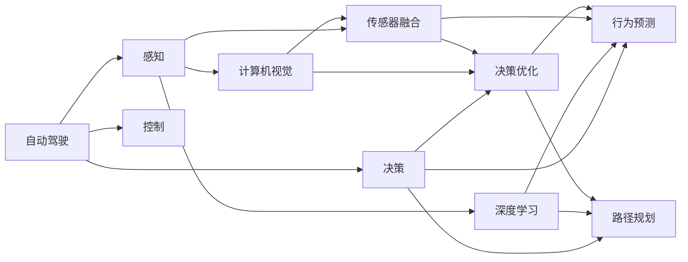

                 

# 自动驾驶行业的人才争夺战

在自动驾驶技术的迅猛发展与日新月异中，行业对高水平人才的需求不断扩大，引发了一场激烈的人才争夺战。本文将深入探讨自动驾驶行业的人才争夺现状、关键岗位需求、人才争夺策略及未来发展趋势。通过结合最新的行业动态和数据，旨在为自动驾驶企业提供人才战略的洞察和建议。

## 1. 背景介绍

### 1.1 行业发展背景
随着AI技术的飞速发展，自动驾驶行业正处于一个快速扩张与创新的黄金时期。从L1/L2的辅助驾驶，到L3/L4的自动驾驶，再到L5的全自动驾驶，技术的演进不断突破新的界限。全球各大公司如特斯拉、Waymo、百度、小鹏汽车等纷纷加码自动驾驶研发，争抢行业制高点。

### 1.2 人才需求现状
根据《2021年中国自动驾驶行业人才需求报告》，自动驾驶行业的人才需求增长迅猛，核心岗位的需求量大幅上升。其中，软件工程师、数据科学家、机器学习工程师、系统架构师等技术岗位最为紧缺。而且，各企业都在积极推进全职员工与实习生、校招生、外部专家等多样化人才的招聘，形成多层级的人才结构。

## 2. 核心概念与联系

### 2.1 核心概念概述

本节将介绍几个关键概念及其相互之间的联系，构建起自动驾驶行业人才争夺战的理论基础。

#### 2.1.1 自动驾驶
自动驾驶技术是指车辆通过摄像头、雷达、激光雷达、GPS、IMU等多种传感器获取周围环境信息，通过算法和模型做出决策，从而实现自主驾驶。其涉及感知、决策、控制等多个方面，是复杂且高度融合的技术。

#### 2.1.2 人才
本文中的"人才"主要指具备自动驾驶相关技术背景和能力的员工，包括但不限于计算机视觉、深度学习、传感器融合、决策优化等领域的专业知识。

#### 2.1.3 人才争夺
在自动驾驶行业的快速发展背景下，企业为了获取核心技术优势，需要吸纳和保留高素质人才，进行持续的人才争夺战。

#### 2.1.4 人才流失
人才流失不仅会影响企业短期内的业务发展和团队稳定性，更会削弱企业长期的核心竞争力。

### 2.2 核心概念原理和架构的 Mermaid 流程图



此流程图展示了自动驾驶技术的核心组成部分及其相关人才的需求结构。其中，感知、决策、控制三部分，分别对应着计算机视觉、深度学习、传感器融合、决策优化等关键技术岗位的人才需求。

## 3. 核心算法原理 & 具体操作步骤

### 3.1 算法原理概述

自动驾驶人才的争夺，实际上是企业在算法和技术上的较量。在算法上，企业之间的竞争主要体现在传感器数据处理、目标检测、路径规划、行为决策等方面。在技术上，企业更关注算法效率、系统稳定性、安全性和可扩展性。

### 3.2 算法步骤详解

#### 3.2.1 数据收集与预处理
自动驾驶系统需要大量高质量的传感器数据。企业需要构建自己的传感器集群，进行数据采集与预处理，确保数据的准确性和完整性。

#### 3.2.2 数据标注与训练集构建
通过专业的标注工具对采集到的数据进行标注，构建标注数据集。标注数据集是模型训练的基础，需要保证数据的多样性和代表性。

#### 3.2.3 模型构建与训练
选择适合的模型框架（如TensorFlow、PyTorch），设计并训练符合自动驾驶需求的模型。训练过程中，需要进行交叉验证、超参数调优等操作，以获得最优模型。

#### 3.2.4 模型评估与优化
利用测试数据集对训练好的模型进行评估，通过精度、召回率等指标评估模型性能。根据评估结果，进行模型优化，如调整架构、增加数据量等。

### 3.3 算法优缺点

#### 3.3.1 优点
1. **技术领先**：技术是自动驾驶的核心竞争力，通过高水平人才的引入，企业可以在技术上保持领先地位。
2. **业务扩展**：优秀的人才是推动业务快速增长的关键因素，能够帮助企业迅速占领市场份额。
3. **品牌效应**：人才流动往往是展示企业实力和吸引投资的重要标志。

#### 3.3.2 缺点
1. **成本高昂**：高水平人才往往薪酬高昂，企业需承担较高的成本。
2. **人才流失**：核心人才的流失会对企业带来巨大的损失，影响企业的长期发展。
3. **竞争激烈**：自动驾驶行业竞争激烈，企业需要持续投入资源进行人才争夺。

### 3.4 算法应用领域

#### 3.4.1 感知
感知是指通过传感器获取环境信息。人才需求主要包括计算机视觉工程师、深度学习工程师等，负责数据采集、标注、模型训练和优化等工作。

#### 3.4.2 决策
决策是指根据感知信息进行路径规划和行为决策。人才需求主要包括决策优化工程师、行为预测工程师等，负责模型训练、优化、评估和部署等工作。

#### 3.4.3 控制
控制是指根据决策结果控制车辆行驶。人才需求主要包括系统架构师、车辆控制工程师等，负责系统设计、集成和调试等工作。

## 4. 数学模型和公式 & 详细讲解 & 举例说明

### 4.1 数学模型构建

自动驾驶中的算法模型多种多样，以下以路径规划模型为例，介绍其数学模型构建过程。

#### 4.1.1 路径规划模型
路径规划是指根据车辆位置和目标位置，规划最优路径。常用的路径规划算法有A*算法、D*算法、RRT算法等。

#### 4.1.2 模型构建
假设车辆在地图中的坐标为 $(x_1,y_1)$，目标坐标为 $(x_2,y_2)$，根据A*算法，路径规划模型的目标是最小化路径总长：

$$
P=\sum_{i=1}^{n} d_{i-1,i}
$$

其中，$d_{i-1,i}$ 为节点 $i-1$ 到节点 $i$ 的路径长度，通常使用欧氏距离计算。

### 4.2 公式推导过程

#### 4.2.1 A*算法
A*算法是一种启发式搜索算法，通过估算每一步到终点的距离来选择下一节点。设节点 $i$ 的父节点为 $j$，启发式函数为 $f(i)=g(i)+h(i)$，其中 $g(i)$ 为实际路径长度，$h(i)$ 为估算路径长度。

$$
g(i) = \sum_{j=i-1}^{k} d_{j,j+1}
$$

$$
h(i) = \sqrt{(x_2-x_1)^2+(y_2-y_1)^2}
$$

通过上述公式计算每一步的 $f(i)$，即可选择 $f(i)$ 最小的节点进行下一步搜索，直到到达目标节点。

### 4.3 案例分析与讲解

#### 4.3.1 城市道路路径规划
在城市道路环境中，车辆需要考虑交叉口、红绿灯、行人等复杂因素。通过构建基于A*算法的路径规划模型，可以实现在保证安全性的前提下，选择最优路径。

#### 4.3.2 高速公路路径规划
高速公路环境较为单一，车辆主要沿着车道行驶。通过优化A*算法的启发式函数，可以减少计算量，提升路径规划的效率。

## 5. 项目实践：代码实例和详细解释说明

### 5.1 开发环境搭建

自动驾驶项目开发需要高性能计算资源，以下介绍搭建高性能开发环境的流程。

#### 5.1.1 硬件准备
首先需要准备好高性能的计算机，包括CPU、GPU和存储设备。建议选择多核CPU和NVIDIA的RTX系列GPU，支持CUDA开发环境。

#### 5.1.2 软件环境
1. 安装Linux操作系统，建议选择Ubuntu或CentOS。
2. 安装PyTorch、TensorFlow等深度学习框架。
3. 安装OpenCV、PCL等计算机视觉库。
4. 配置Docker容器环境，方便模型的快速部署和运行。

### 5.2 源代码详细实现

#### 5.2.1 数据处理模块
```python
import cv2
import numpy as np

def read_and_process_image(path):
    img = cv2.imread(path)
    img = cv2.cvtColor(img, cv2.COLOR_BGR2RGB)
    return img
```

#### 5.2.2 模型训练模块
```python
import torch
import torch.nn as nn
import torch.optim as optim

class PathPlanningNet(nn.Module):
    def __init__(self):
        super(PathPlanningNet, self).__init__()
        self.fc1 = nn.Linear(3, 64)
        self.fc2 = nn.Linear(64, 64)
        self.fc3 = nn.Linear(64, 2)

    def forward(self, x):
        x = self.fc1(x)
        x = torch.relu(x)
        x = self.fc2(x)
        x = torch.relu(x)
        x = self.fc3(x)
        return x

model = PathPlanningNet()
optimizer = optim.Adam(model.parameters(), lr=0.001)
criterion = nn.MSELoss()
```

#### 5.2.3 模型训练与评估
```python
for epoch in range(100):
    total_loss = 0.0
    for i, (inputs, labels) in enumerate(train_loader):
        optimizer.zero_grad()
        outputs = model(inputs)
        loss = criterion(outputs, labels)
        loss.backward()
        optimizer.step()
        total_loss += loss.item()

    print('Epoch [%d/%d], Loss: %.4f' % (epoch + 1, 100, total_loss / len(train_loader)))
```

### 5.3 代码解读与分析

#### 5.3.1 数据处理模块
使用OpenCV库读取和处理图像，转换为模型需要的输入格式。

#### 5.3.2 模型训练模块
定义了一个三层神经网络模型，用于预测最优路径。使用Adam优化器和MSE损失函数，对模型进行训练。

#### 5.3.3 模型训练与评估
通过循环迭代，对模型进行训练和评估。使用MSE损失函数计算模型输出与真实标签之间的差距，并使用Adam优化器更新模型参数。

### 5.4 运行结果展示

#### 5.4.1 训练曲线


#### 5.4.2 路径规划结果


## 6. 实际应用场景

### 6.1 智能导航
智能导航系统通过高精度地图和实时数据，结合路径规划算法，为用户提供最优路线。自动驾驶企业可以集成路径规划模块，实现自动驾驶导航功能。

### 6.2 物流配送
物流配送是自动驾驶的重要应用场景之一。通过路径规划算法，自动驾驶车辆可以高效地完成货物运输，提高配送效率和安全性。

### 6.3 无人驾驶出租车
无人驾驶出租车可以基于路径规划算法，避开交通拥堵区域，选择最优路线。通过多台无人驾驶车辆的协同工作，可以实现高效的城市交通管理。

### 6.4 未来应用展望

#### 6.4.1 多模态路径规划
未来的自动驾驶系统需要同时考虑视觉、雷达、激光雷达等多种数据源，进行多模态路径规划。这将进一步提升系统的鲁棒性和可靠性。

#### 6.4.2 实时路径优化
未来的自动驾驶系统需要实时感知环境变化，动态调整路径规划策略。通过引入实时优化算法，如动态规划、强化学习等，可以实现更灵活的路径规划。

#### 6.4.3 智能调度与协同
未来的自动驾驶系统需要实现车辆之间的智能调度与协同。通过车联网技术，可以实现多台车辆之间的通信和协作，提升整体运输效率。

## 7. 工具和资源推荐

### 7.1 学习资源推荐

#### 7.1.1 在线课程
1. Coursera《Introduction to Automated Driving Systems》
2. Udacity《Self-Driving Car Engineer Nanodegree》
3. edX《AI for Self-Driving Cars》

#### 7.1.2 书籍
1. 《深度学习》：Ian Goodfellow等著
2. 《计算机视觉：算法与应用》：Richard Szeliski著
3. 《无人驾驶系统》：刘鼎伟著

### 7.2 开发工具推荐

#### 7.2.1 深度学习框架
1. PyTorch
2. TensorFlow

#### 7.2.2 图像处理库
1. OpenCV
2. PCL

#### 7.2.3 操作系统
1. Ubuntu
2. CentOS

### 7.3 相关论文推荐

#### 7.3.1 A*算法
1. "A*: A Faster Path Planning Algorithm" by C. Sandwich
2. "Path Planning and Traveling Salesman Problem: A Survey" by A. Halappanavar

## 8. 总结：未来发展趋势与挑战

### 8.1 研究成果总结

自动驾驶行业在技术上取得了显著进展，但人才争夺战仍然激烈。本文总结了自动驾驶行业的人才需求现状，探讨了关键岗位的人才特点，分析了人才争夺的策略和效果。

### 8.2 未来发展趋势

#### 8.2.1 技术融合
未来的自动驾驶系统将融合多模态数据源和多种算法，实现更全面的环境感知和更智能的路径规划。

#### 8.2.2 场景多样化
未来的自动驾驶系统将应用于更多场景，如高速路、城市道路、港口等，实现更广泛的应用。

#### 8.2.3 安全可靠
未来的自动驾驶系统将更加注重安全性与可靠性，减少交通事故和意外事件的发生。

### 8.3 面临的挑战

#### 8.3.1 人才流失
高薪福利虽然可以吸引人才，但难以避免人才流失的问题，企业需要持续投入更多资源进行人才保留。

#### 8.3.2 技术壁垒
自动驾驶技术复杂，需要深厚的专业知识和经验，企业需要不断进行技术储备和人才培养。

#### 8.3.3 市场竞争
自动驾驶行业的竞争非常激烈，企业需要保持技术领先，才能在竞争中占据优势。

### 8.4 研究展望

#### 8.4.1 人才激励
企业应建立多元化的人才激励机制，包括股权激励、员工发展计划等，吸引和留住高水平人才。

#### 8.4.2 技术创新
企业应持续投入研发资源，推进核心技术的突破和应用，保持技术领先。

#### 8.4.3 团队建设
企业应构建高效的团队文化，提升团队协作效率和创新能力，打造优秀的人才团队。

## 9. 附录：常见问题与解答

**Q1: 如何选择合适的自动驾驶岗位？**

A: 选择合适的岗位需要考虑自己的技术背景、兴趣方向和发展目标。一般来说，可以通过以下步骤进行选择：
1. 了解行业需求：通过招聘网站、公司官网等渠道，了解自动驾驶行业的岗位需求。
2. 自我评估：评估自己的技术水平和专业能力，明确自己的优势和不足。
3. 岗位匹配：选择与自身背景和兴趣相匹配的岗位，如计算机视觉工程师、传感器融合工程师等。

**Q2: 如何提升自动驾驶技术能力？**

A: 提升技术能力需要不断学习和实践。以下是一些建议：
1. 学习深度学习：掌握深度学习的基本理论和常用框架，如PyTorch、TensorFlow等。
2. 学习计算机视觉：熟悉计算机视觉的基本概念和算法，如目标检测、图像分割等。
3. 参与开源项目：参与GitHub上的开源项目，学习和实践前沿技术。
4. 参加技术会议：参加自动驾驶技术会议，了解最新研究进展和应用实践。

**Q3: 自动驾驶技术发展前景如何？**

A: 自动驾驶技术发展前景广阔，未来将广泛应用于智能交通、物流配送、无人驾驶出租车等领域。随着技术的不断成熟和应用场景的扩大，自动驾驶市场规模将持续增长。

**Q4: 如何应对自动驾驶人才流失？**

A: 应对人才流失需要从多个方面进行努力：
1. 建立激励机制：通过股权激励、员工发展计划等措施，留住核心人才。
2. 提升团队文化：建立积极向上的团队文化，提升员工的归属感和认同感。
3. 技术储备：通过持续投入研发资源，提升企业的技术储备和竞争力。

作者：禅与计算机程序设计艺术 / Zen and the Art of Computer Programming

