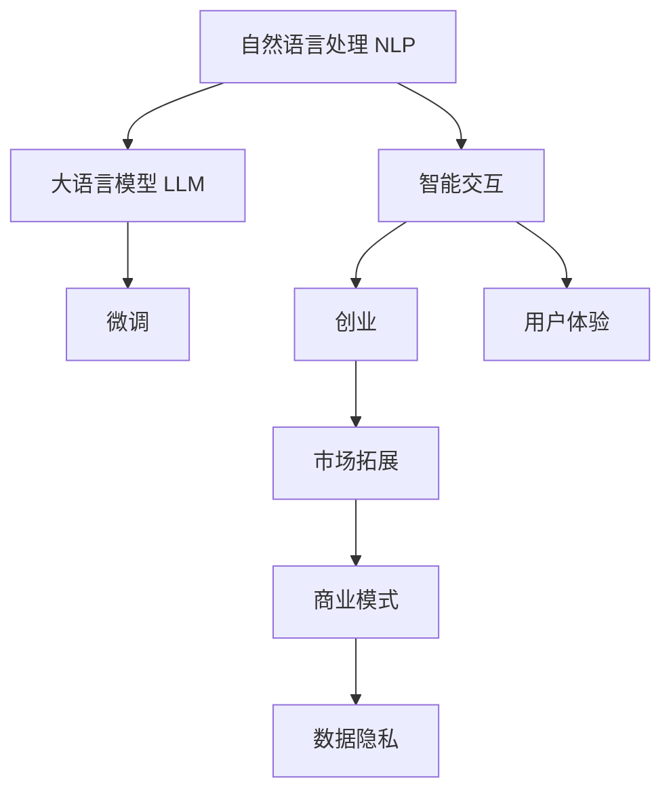

                 

# 自然语言处理创业：智能交互的未来

> 关键词：
> - 自然语言处理
> - 智能交互
> - 创业
> - 技术创新
> - 用户需求
> - 市场潜力
> - 商业价值

## 1. 背景介绍

### 1.1 问题由来

随着人工智能技术的飞速发展，自然语言处理（Natural Language Processing, NLP）领域迎来了新的发展契机。大语言模型的涌现，使得NLP技术进入了一个崭新的阶段。大模型凭借其强大的语言理解与生成能力，广泛应用于对话系统、文本生成、翻译、问答等多个方向，为解决复杂任务提供了新的思路。然而，尽管大模型在学术界取得了诸多突破，但要在实际应用中落地并产生显著的经济价值，仍需进一步创新与突破。

因此，我们亟需探索将NLP技术进一步商业化、产业化的路径。大语言模型的应用方向丰富多样，从智能客服、个性化推荐到金融舆情分析、医疗诊断，NLP技术正在悄然改变各行各业。借助创业精神，激发出更多智能交互的创新点，或许可以开辟NLP技术应用的新天地。

### 1.2 问题核心关键点

当前，NLP领域的创业机会主要集中在以下几个关键点：

1. **产品创新**：开发新颖、功能丰富的智能交互产品，如智能客服、智能助理、智能广告推荐等。
2. **市场拓展**：针对特定行业，如医疗、金融、教育等，开发垂直领域的智能解决方案。
3. **用户体验**：注重交互界面设计，提升用户使用体验，确保系统的友好性和易用性。
4. **商业化模式**：探索多样化的商业模式，如SaaS、B2B、订阅服务等，满足不同类型客户的需要。
5. **数据隐私**：重视数据安全与隐私保护，建立合规透明的数据治理体系。

这些问题构成了NLP创业的核心挑战，也是未来NLP技术发展的关键方向。本文将围绕这些问题，系统性地探讨NLP创业的各项关键环节，提供切实可行的技术解决方案和商业策略。

## 2. 核心概念与联系

### 2.1 核心概念概述

1. **自然语言处理（NLP）**：利用计算机技术对自然语言文本进行处理和分析，包括语音识别、文本分类、信息抽取、问答系统等。
2. **智能交互**：基于NLP技术的自然语言理解与生成，构建人机交互系统，实现自然对话、智能推荐等功能。
3. **创业**：结合市场、技术和商业模式，通过创新与合作，创造新的商业价值和社会影响力。
4. **大语言模型（LLMs）**：如GPT-3、BERT等，利用自监督学习技术在大规模语料上进行预训练，具备强大的语言理解和生成能力。

### 2.2 核心概念联系

NLP技术与智能交互的结合，是大模型创业的重要基础。NLP创业不仅仅依赖于先进的NLP技术，还需要考虑市场、用户需求、商业模式等多方面因素。

大模型技术的创新为智能交互打开了新的可能，但如何实现从技术到市场的跨越，并创造出实际的商业价值，还需要进行深入的探讨。

### 2.3 核心概念原理和架构的 Mermaid 流程图(Mermaid 流程节点中不要有括号、逗号等特殊字符)


大语言模型在NLP领域的应用，通过微调等技术实现功能增强。智能交互系统的构建，需要考虑用户体验和市场需求，并在商业模式和数据隐私方面进行合理规划。

## 3. 核心算法原理 & 具体操作步骤

### 3.1 算法原理概述

智能交互系统的核心在于语言理解和生成。基于大语言模型的微调技术，可以通过优化模型参数，提升其在特定任务上的表现。微调的具体步骤包括数据准备、模型选择、超参数设置、模型训练、评估与部署等。

### 3.2 算法步骤详解

1. **数据准备**：
   - 收集相关数据，如对话记录、文本、图片、视频等。
   - 对数据进行清洗、标注，准备训练和验证数据集。
   - 划分训练集、验证集、测试集，确保模型在不同数据集上都能表现稳定。

2. **模型选择**：
   - 选择适合的预训练模型，如GPT、BERT、RoBERTa等。
   - 评估不同模型的性能和资源消耗，选择合适的模型进行微调。

3. **超参数设置**：
   - 设置优化算法（如Adam、SGD等）和学习率。
   - 选择适当的正则化技术（如L2正则、Dropout等），避免过拟合。
   - 确定模型结构，选择保留哪些层进行微调。

4. **模型训练**：
   - 使用微调后的模型进行推理，计算损失函数。
   - 反向传播更新模型参数，最小化损失函数。
   - 周期性在验证集上评估模型性能，避免过拟合。

5. **评估与部署**：
   - 在测试集上评估微调后模型的性能，对比前后效果。
   - 部署模型，集成到实际应用系统中，优化用户体验。
   - 持续收集新数据，定期重新微调模型，确保系统适应性。

### 3.3 算法优缺点

**优点**：
- **高效性**：大模型微调相较于从头训练，能够快速提升模型性能，缩短开发周期。
- **鲁棒性**：大模型通过大规模预训练，具备较强的泛化能力，对小规模标注数据依赖较小。
- **多样性**：微调后的模型可以应用于多种NLP任务，如问答、对话、摘要、翻译等。

**缺点**：
- **依赖数据**：微调效果依赖于标注数据的质量和数量，获取高质量标注数据的成本较高。
- **模型复杂**：大模型参数量庞大，需要较强的计算资源进行训练和推理。
- **可解释性**：微调模型作为"黑盒"，难以解释其内部决策逻辑，可能导致用户不信任。

### 3.4 算法应用领域

大语言模型的微调技术，在智能交互领域有着广泛的应用前景，具体包括：

- **智能客服**：通过微调对话模型，构建智能客服系统，提升客户咨询体验。
- **个性化推荐**：利用微调模型，实现个性化推荐系统，提升推荐效果。
- **智能广告**：开发基于微调的智能广告推荐系统，提高广告转化率。
- **虚拟助手**：通过微调自然语言处理模型，构建虚拟助手，提供个性化服务。
- **医疗诊断**：利用微调后的问答系统，辅助医疗诊断，减轻医生工作负担。

## 4. 数学模型和公式 & 详细讲解 & 举例说明

### 4.1 数学模型构建

假设大语言模型为 $M_{\theta}$，其输入为文本 $x$，输出为 $y$。在微调任务中，我们通过标注数据集 $D=\{(x_i,y_i)\}_{i=1}^N$ 进行训练，最小化损失函数 $\mathcal{L}$。

**定义**：
- 损失函数：$\mathcal{L}(\theta) = \frac{1}{N} \sum_{i=1}^N \ell(M_{\theta}(x_i),y_i)$
- 输出为概率分布：$y_i \sim \text{Categorical}(M_{\theta}(x_i))$
- 交叉熵损失：$\ell(M_{\theta}(x_i),y_i) = -y_i \log M_{\theta}(x_i)$

### 4.2 公式推导过程

根据交叉熵损失的定义，我们可以推导出损失函数的具体形式：

$$
\mathcal{L}(\theta) = -\frac{1}{N} \sum_{i=1}^N y_i \log M_{\theta}(x_i)
$$

其中 $M_{\theta}(x_i)$ 表示模型在输入 $x_i$ 上的输出概率分布，$y_i$ 表示真实标签。

### 4.3 案例分析与讲解

以智能客服为例，假设用户输入的文本为 "我需要订一张机票"，模型需要判断并生成回复。模型首先对用户输入进行编码，然后输出每个可能的回复的概率分布。通过最大化输出概率最高的回复，我们可以构建智能客服系统，实现自然对话。

## 5. 项目实践：代码实例和详细解释说明

### 5.1 开发环境搭建

1. **环境安装**：
   - 安装Python 3.7及以上版本
   - 安装TensorFlow和PyTorch等深度学习库
   - 安装相关NLP库，如NLTK、spaCy等

2. **环境配置**：
   - 安装虚拟环境管理工具，如virtualenv或conda
   - 配置GPU加速，确保模型训练高效

3. **开发工具**：
   - 使用Jupyter Notebook进行交互式开发
   - 使用Git版本控制系统进行代码管理
   - 使用TensorBoard和Weights & Biases等工具进行模型训练监控

### 5.2 源代码详细实现

以下是一个简单的智能客服系统示例代码，包括数据预处理、模型训练与推理。

```python
import tensorflow as tf
from transformers import TFAutoModel, BertTokenizer
import numpy as np

# 初始化模型和分词器
model = TFAutoModel.from_pretrained('bert-base-cased')
tokenizer = BertTokenizer.from_pretrained('bert-base-cased')

# 定义模型推理函数
def predict_text(text):
    input_ids = tokenizer.encode(text, max_length=128, return_tensors='tf')
    with tf.device('CPU:0'):
        output = model(input_ids)
    return output.logits.argmax(axis=1)

# 测试代码
text = '我需要订一张机票'
output = predict_text(text)
print('推荐回答：', tokenizer.decode(output[0], skip_special_tokens=True))
```

### 5.3 代码解读与分析

- **数据预处理**：使用BERT分词器对用户输入进行编码，确保模型接受的数据格式一致。
- **模型选择**：选择BERT模型作为初始化参数，利用其强大的语言理解能力。
- **模型推理**：将用户输入编码后，输入模型进行推理，得到概率分布最高的回答。
- **结果展示**：输出推荐回答，供智能客服系统展示。

## 6. 实际应用场景

### 6.1 智能客服系统

智能客服系统通过微调对话模型，实现自然对话，提升用户体验。系统可以自动理解用户意图，生成应答，解决常见问题，减轻客服人员负担。例如，在银行客服场景中，客户只需输入简单问题，系统即可提供快速解答，提高服务效率。

### 6.2 个性化推荐系统

个性化推荐系统利用微调模型，分析用户行为数据，生成个性化推荐内容。系统能够根据用户历史行为和实时兴趣，动态调整推荐策略，提高推荐效果。例如，在电商平台上，用户浏览商品后，系统可以推荐相关商品，提升用户购买率。

### 6.3 虚拟助手

虚拟助手通过微调自然语言处理模型，实现任务执行和信息获取。用户可以与虚拟助手进行自然对话，完成日程安排、信息查询等操作。例如，在智能家居场景中，用户可以通过语音指令控制家中的设备。

### 6.4 医疗诊断辅助系统

医疗诊断辅助系统通过微调问答模型，帮助医生诊断疾病。系统能够理解患者描述的症状和历史记录，提供初步诊断建议，减轻医生的工作负担。例如，在皮肤科应用中，系统可以识别皮肤病症状，提供诊断和治疗建议。

## 7. 工具和资源推荐

### 7.1 学习资源推荐

1. **深度学习课程**：如吴恩达的《深度学习专项课程》、Andrew Ng的《CS231n: 卷积神经网络》等，系统学习深度学习和NLP基础知识。
2. **NLP书籍**：如《自然语言处理综论》、《Python 自然语言处理》等，深入了解NLP技术实现和应用案例。
3. **在线教程**：如Udacity、Coursera等平台的NLP课程，实践动手，巩固学习效果。
4. **开源项目**：如Google的BERT、Hugging Face的Transformers等，了解前沿技术实现细节。

### 7.2 开发工具推荐

1. **编程语言**：Python 3.x，强大的科学计算和NLP库支持。
2. **深度学习框架**：TensorFlow、PyTorch，开源社区活跃，生态完善。
3. **自然语言处理库**：NLTK、spaCy、Hugging Face Transformers，丰富的NLP功能支持。
4. **代码管理工具**：Git、GitHub、Jupyter Notebook，便于版本控制和代码分享。

### 7.3 相关论文推荐

1. **BERT论文**：《BERT: Pre-training of Deep Bidirectional Transformers for Language Understanding》，展示大语言模型的强大性能。
2. **GPT-3论文**：《Language Models are Unsupervised Multitask Learners》，提出预训练-微调方法，推动NLP技术进步。
3. **智能客服论文**：《Conversational systems: an overview》，总结智能客服系统的发展现状和未来趋势。

## 8. 总结：未来发展趋势与挑战

### 8.1 研究成果总结

NLP创业已经取得显著成果，但仍然面临诸多挑战。如何进一步提升大语言模型的性能，拓展其应用范围，成为未来研究的关键。技术创新、用户体验和商业模式的探索，将推动NLP创业迈向新的高度。

### 8.2 未来发展趋势

1. **技术创新**：深度学习、迁移学习、多模态融合等新技术将进一步推动NLP技术的发展。
2. **用户体验**：设计更自然、友好的交互界面，提升用户使用体验，增强用户粘性。
3. **商业化模式**：探索多样化的商业模式，如SaaS、B2B、订阅服务等，满足不同客户需求。
4. **数据隐私**：重视数据安全与隐私保护，建立合规透明的数据治理体系。
5. **市场拓展**：针对特定行业，如医疗、金融、教育等，开发垂直领域的智能解决方案。

### 8.3 面临的挑战

1. **数据获取成本高**：高质量标注数据的获取成本较高，限制了微调模型性能的提升。
2. **模型复杂度高**：大语言模型参数量庞大，训练和推理资源消耗较大。
3. **算法透明性不足**：微调模型的决策过程难以解释，影响用户信任。
4. **技术迭代快**：NLP技术更新迅速，需要不断跟踪最新的研究进展，进行技术更新和优化。
5. **应用场景复杂**：不同行业的用户需求和场景差异较大，需要定制化解决方案。

### 8.4 研究展望

未来的NLP创业将在以下几个方向进行深入研究：

1. **无监督学习**：探索无监督学习和半监督学习，利用更多非结构化数据进行模型训练，降低对标注数据的依赖。
2. **多模态融合**：引入视觉、语音等多模态信息，增强模型对现实世界的理解能力。
3. **跨领域迁移**：开发跨领域迁移模型，提高模型在不同领域中的适应性和泛化能力。
4. **可解释性**：研究模型可解释性，提升用户对智能交互系统的信任度。
5. **数据隐私保护**：探索数据隐私保护技术，确保用户数据安全和合规。

## 9. 附录：常见问题与解答

**Q1: NLP创业的难点有哪些？**

A: 数据获取成本高、模型复杂度高、技术迭代快、应用场景复杂是NLP创业的主要难点。

**Q2: 如何选择适合的预训练模型进行微调？**

A: 应考虑任务类型、数据规模、计算资源等因素。例如，文本分类任务可以选择BERT，对话系统可以选择GPT等。

**Q3: 如何处理小规模标注数据？**

A: 数据增强、迁移学习、主动学习等技术可有效缓解小样本问题。例如，通过数据增强生成更多训练样本，或利用迁移学习从已有大模型中获取知识。

**Q4: 如何优化智能交互系统的性能？**

A: 持续优化模型架构和超参数，改进算法和数据处理流程，关注用户体验和系统性能。

**Q5: NLP创业需要哪些关键资源？**

A: 技术团队、数据资源、计算资源、用户数据和市场推广是NLP创业的关键资源。

---

作者：禅与计算机程序设计艺术 / Zen and the Art of Computer Programming

