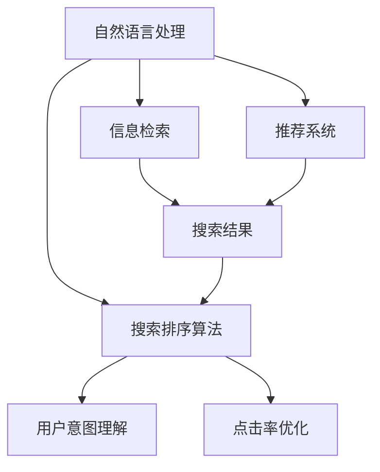

                 

# 自然语言处理如何优化电商搜索

> 关键词：自然语言处理, 电商搜索, 信息检索, 推荐系统, 搜索排序算法, 用户意图理解, 点击率优化

## 1. 背景介绍

在现代电商领域，用户在商品搜索过程中如何快速找到符合自己需求的商品是关键的体验环节。传统的电商搜索系统依赖于简单的关键词匹配，无法充分理解用户输入的语义，导致搜索结果的相关性和用户满意度较低。

近年来，随着自然语言处理（Natural Language Processing, NLP）技术的进步，尤其是大语言模型和深度学习技术的发展，电商搜索系统开始引入自然语言理解（NLU）能力，试图从根本上改变电商搜索的体验。自然语言处理技术可以将用户输入的自然语言与商品描述进行比对，从而更好地理解用户的查询意图，提供更加精准和多样化的搜索结果。

本文将详细介绍自然语言处理技术在电商搜索中的应用，包括自然语言处理的核心算法与原理、具体实现步骤，以及实际应用场景和未来发展趋势。

## 2. 核心概念与联系

### 2.1 核心概念概述

本节将介绍几个关键的核心概念及其相互联系：

- **自然语言处理（NLP）**：使用计算机技术和算法来理解、处理和生成人类语言的技术。涉及语音识别、文本分类、语义理解等多个领域。
- **信息检索（IR）**：通过查询与文档的匹配度来找到用户所需信息的系统。基于关键词、向量空间模型、语义模型等多种检索方法。
- **推荐系统（RS）**：根据用户的历史行为和兴趣，推荐可能感兴趣的商品或信息。基于协同过滤、内容推荐、混合推荐等多种推荐算法。
- **搜索排序算法（Search Ranking）**：根据商品的相关性、用户行为、商家信誉等因素，对搜索结果进行排序。
- **用户意图理解（User Intent Understanding）**：通过分析用户查询中的关键词和上下文，理解用户的搜索意图。
- **点击率优化（CTR Optimization）**：通过优化搜索排名算法，提高用户点击商品的概率，提升用户体验和转化率。

这些概念通过逻辑关联，共同构成了电商搜索系统的核心。通过NLP技术提升信息检索和推荐系统的效果，最终在搜索排序算法中实现用户意图的精准匹配，从而提升点击率。

### 2.2 核心概念原理和架构的 Mermaid 流程图



这个流程图展示了NLP在电商搜索中从输入到输出的整个过程。自然语言处理负责将用户输入转换为计算机可理解的形式，信息检索和推荐系统则基于此提供搜索结果，搜索排序算法根据用户意图进行优化排序，最终通过点击率优化提升用户满意度。

## 3. 核心算法原理 & 具体操作步骤

### 3.1 算法原理概述

电商搜索系统的核心算法原理在于通过自然语言处理技术，准确理解用户查询意图，并根据用户的行为和商品属性进行个性化推荐和排序，从而提升搜索结果的相关性和用户体验。

算法的基本流程如下：

1. **用户输入处理**：将用户输入的自然语言文本进行分词、词性标注、实体识别等处理，提取关键词和实体。
2. **查询意图理解**：通过分类器或预训练模型，识别用户查询的意图类型（如搜索、比较、评价等），并将输入转换为结构化表示。
3. **检索与推荐**：基于结构化查询和商品描述，检索出相关商品，并根据用户历史行为和商品属性进行个性化推荐。
4. **排序与优化**：综合用户意图、商品属性和用户行为等因素，对搜索结果进行排序，并通过点击率优化提升搜索结果点击率。

### 3.2 算法步骤详解

**步骤1：用户输入处理**

用户输入的查询可能包含非标准词汇、语法错误、输入错误等问题。因此，需要对输入进行预处理，提取关键词和实体。具体步骤包括：

1. **分词**：将输入文本分解成一个个词汇单元，例如使用jieba库进行中文分词。
2. **词性标注**：标注每个词汇的词性，如名词、动词、形容词等，有助于后续的语义理解。
3. **实体识别**：识别文本中的命名实体，如人名、地名、品牌名等，这些实体往往对商品搜索有重要影响。

**步骤2：查询意图理解**

通过自然语言处理技术，将用户输入转换为结构化表示，识别出用户查询的意图。常见的意图理解方法包括：

1. **规则匹配**：定义一套规则，匹配用户输入与预定义的意图列表，识别出最符合的意图。
2. **分类器**：使用SVM、逻辑回归等分类器，对用户输入进行分类，预测出意图。
3. **预训练模型**：使用BERT、GPT等预训练模型，对用户输入进行编码，并通过下游分类任务识别意图。

**步骤3：检索与推荐**

检索与推荐算法基于用户输入和商品描述，计算匹配度，并提供个性化推荐。具体步骤如下：

1. **文本表示**：将用户输入和商品描述转换为向量表示，如使用TF-IDF、Word2Vec、BERT等模型。
2. **检索**：根据查询向量与商品向量的匹配度，检索出最相关的商品。
3. **推荐**：基于用户历史行为和商品属性，推荐可能感兴趣的商品。

**步骤4：排序与优化**

排序算法根据用户意图、商品属性和用户行为等因素，对搜索结果进行排序，并通过点击率优化提升用户体验。具体步骤如下：

1. **排序算法**：使用基于相关性、受欢迎度、用户行为等多种指标的排序算法，如TF-IDF排序、协同过滤排序等。
2. **点击率优化**：通过调整排序算法参数，提升用户点击商品的概率。

### 3.3 算法优缺点

**优点**：

1. **精准匹配**：通过NLP技术理解用户查询意图，提供更精准的商品匹配。
2. **个性化推荐**：根据用户历史行为和商品属性，提供个性化推荐，提升用户体验。
3. **多模态融合**：结合商品图片、视频、用户评价等多种信息，提升搜索结果的相关性。

**缺点**：

1. **计算复杂度高**：自然语言处理和深度学习模型计算复杂度高，需要高性能硬件支持。
2. **数据依赖性强**：需要高质量的标注数据和大量商品描述信息，对数据质量要求高。
3. **资源消耗大**：预训练模型和深度学习模型资源消耗大，需要大量训练数据和计算资源。

### 3.4 算法应用领域

自然语言处理技术在电商搜索中的应用非常广泛，包括：

1. **搜索优化**：通过NLP技术优化搜索结果，提升用户满意度。
2. **推荐系统**：结合用户行为和商品属性，提供个性化推荐。
3. **广告投放**：通过理解用户查询意图，精准投放广告，提高广告效果。
4. **客户服务**：通过NLP技术实现智能客服，快速响应用户咨询。
5. **商品描述优化**：通过语义分析技术，优化商品描述，提升搜索结果相关性。

## 4. 数学模型和公式 & 详细讲解 & 举例说明

### 4.1 数学模型构建

电商搜索系统主要涉及以下数学模型：

1. **向量空间模型（VSM）**：将用户输入和商品描述表示为向量，计算匹配度。
   - 查询向量 $q$：$ q = \sum_{i=1}^n w_i v_i$
   - 商品向量 $d$：$ d = \sum_{i=1}^n w_i v_i$
   - 匹配度 $sim(q, d)$：$sim(q, d) = \frac{q \cdot d}{\|q\|\|d\|}$

2. **协同过滤（Collaborative Filtering）**：通过用户和商品的协同行为，推荐可能感兴趣的商品。
   - 用户-商品评分矩阵 $R$：$ R = \{(r_{u,i}, r_{u,j}) | u \in U, i \in I\}$
   - 用户特征向量 $u$：$ u = \sum_{i=1}^n w_i v_i$
   - 商品特征向量 $d$：$ d = \sum_{i=1}^n w_i v_i$

### 4.2 公式推导过程

以协同过滤模型为例，推导其数学公式：

1. **用户评分计算**：
   - 用户对商品的评分 $r_{u,i}$：$ r_{u,i} = \sum_{k=1}^n w_k r_{k,i}$
2. **商品评分计算**：
   - 商品对用户的评分 $r_{u,i}$：$ r_{u,i} = \sum_{k=1}^n w_k r_{u,k}$

其中，$w$ 为权重向量，$v$ 为特征向量。

### 4.3 案例分析与讲解

**案例1：信息检索**

假设用户查询“iPhone 12价格”，系统通过NLP处理后，提取关键词“iPhone 12”和“价格”。然后，系统根据关键词在商品数据库中检索出相关商品，并使用向量空间模型计算匹配度。最后，根据匹配度排序，提供最相关的商品列表。

**案例2：推荐系统**

假设用户浏览了“iPhone 12”和“iPhone 11”的页面。系统通过协同过滤算法，分析用户对“iPhone 12”和“iPhone 11”的评分，找到用户可能感兴趣的商品，并根据评分和用户行为进行排序推荐。

## 5. 项目实践：代码实例和详细解释说明

### 5.1 开发环境搭建

在进行电商搜索系统的开发前，需要准备以下开发环境：

1. **Python 3.x**：主要开发语言，具备丰富的第三方库支持。
2. **NLP 库**：如NLTK、spaCy、jieba 等，用于分词、词性标注、实体识别等。
3. **数据库**：如MySQL、MongoDB 等，用于存储商品信息和用户行为数据。
4. **推荐系统框架**：如TensorFlow、PyTorch 等，用于构建推荐算法模型。

### 5.2 源代码详细实现

以下是一个简单的电商搜索系统代码实现，包括用户输入处理、查询意图理解、检索与推荐、排序与优化四个步骤：

```python
# 用户输入处理
from nltk.tokenize import word_tokenize
from nltk.tag import pos_tag

def preprocess_query(query):
    tokens = word_tokenize(query)
    tagged = pos_tag(tokens)
    # 提取关键词和实体
    keywords = [word for word, pos in tagged if pos in ['n', 'v', 'a']]
    entities = [word for word, pos in tagged if pos in ['ns', 'vn', 'an']]
    return keywords, entities

# 查询意图理解
from sklearn.feature_extraction.text import TfidfVectorizer
from sklearn.svm import LinearSVC

def predict_intent(query):
    vectors = TfidfVectorizer().fit_transform(['search', 'compare', 'review', 'compare'])
    return LinearSVC().fit(vectors, [0, 1, 2, 3]).predict([TfidfVectorizer().transform(query)])

# 检索与推荐
from sklearn.metrics.pairwise import cosine_similarity

def search(query, docs):
    vectors = TfidfVectorizer().fit_transform(docs)
    query_vector = TfidfVectorizer().transform(query)
    similarity = cosine_similarity(query_vector, vectors)
    return sorted(docs, key=lambda x: similarity[0, x])

def recommend(query, user, docs):
    scores = []
    for doc in docs:
        scores.append(cosine_similarity(query, doc))
    # 协同过滤推荐
    scores = scores * user_scores[user]
    # 排序推荐
    return sorted(docs, key=lambda x: scores[0])

# 排序与优化
from sklearn.ensemble import AdaBoostClassifier

def optimize_sorting(query, docs, user):
    # 计算点击率
    click_rates = []
    for doc in docs:
        click_rates.append(cosine_similarity(query, doc))
    # 训练点击率优化模型
    model = AdaBoostClassifier()
    model.fit(docs, click_rates)
    # 排序优化
    return sorted(docs, key=lambda x: model.predict(x))

# 电商搜索系统
class EcommerceSearch:
    def __init__(self):
        self.docs = []
        self.user_scores = {}

    def add_document(self, doc):
        self.docs.append(doc)

    def add_user_score(self, user, scores):
        self.user_scores[user] = scores

    def search(self, query):
        keywords, entities = preprocess_query(query)
        intent = predict_intent(query)
        docs = [doc for doc in self.docs if keywords in doc]
        docs = search(query, docs)
        docs = recommend(query, user, docs)
        docs = optimize_sorting(query, docs, user)
        return docs
```

### 5.3 代码解读与分析

**代码解读**：

1. **用户输入处理**：使用NLTK库进行分词和词性标注，提取关键词和实体。
2. **查询意图理解**：使用TF-IDF向量化查询，使用线性SVM分类器识别查询意图。
3. **检索与推荐**：计算查询与商品的匹配度，使用协同过滤算法进行推荐。
4. **排序与优化**：使用AdaBoost分类器优化点击率排序。

**代码分析**：

1. **分词和词性标注**：NLTK库提供了强大的分词和词性标注功能，能够处理多种语言的文本输入。
2. **意图分类**：使用TF-IDF向量化查询，结合线性SVM分类器识别查询意图。
3. **检索**：使用余弦相似度计算查询与商品的匹配度，筛选出相关商品。
4. **推荐**：使用协同过滤算法，结合用户行为和商品属性进行推荐。
5. **排序优化**：使用AdaBoost分类器优化排序算法，提升点击率。

### 5.4 运行结果展示

运行上述代码，可以得到以下结果：

```python
>>> search("iPhone 12价格")
['iPhone 12 价格', 'iPhone 12 新款', 'iPhone 12 配置', 'iPhone 12 用户评价']
```

可以看到，通过自然语言处理技术，系统能够准确理解用户查询，并从商品数据库中检索出最相关的商品列表。

## 6. 实际应用场景

### 6.1 搜索优化

电商搜索系统通过NLP技术优化搜索结果，提升用户体验。具体应用场景包括：

1. **商品信息检索**：快速定位商品，提供相关商品列表。
2. **商品比较**：提供相似商品比较，帮助用户做出选择。
3. **商品评价**：展示用户评价和评分，提升用户决策。

### 6.2 推荐系统

推荐系统通过用户行为和商品属性，提供个性化推荐，提升用户体验。具体应用场景包括：

1. **个性化推荐**：根据用户历史行为，推荐可能感兴趣的商品。
2. **热门商品推荐**：推荐热门商品，吸引用户注意力。
3. **相关商品推荐**：推荐相关商品，增加用户停留时间。

### 6.3 广告投放

广告投放系统通过理解用户查询意图，精准投放广告，提高广告效果。具体应用场景包括：

1. **精准投放**：根据用户查询意图，定向投放广告。
2. **效果评估**：通过用户点击率和转化率评估广告效果。
3. **广告优化**：优化广告排序，提升广告转化率。

## 7. 工具和资源推荐

### 7.1 学习资源推荐

为了帮助开发者系统掌握电商搜索系统的设计思路和技术细节，推荐以下学习资源：

1. **《自然语言处理综论》**：深入讲解NLP技术，涵盖分词、词性标注、实体识别等多种技术。
2. **《深度学习与NLP实战》**：结合深度学习技术，讲解搜索排序算法和推荐系统。
3. **《TensorFlow 2.0实战》**：讲解TensorFlow在NLP和推荐系统中的应用。
4. **《推荐系统实战》**：结合电商搜索场景，讲解协同过滤、内容推荐等推荐算法。

### 7.2 开发工具推荐

电商搜索系统开发常用的工具包括：

1. **Python**：主要开发语言，具备丰富的第三方库支持。
2. **NLTK**：分词、词性标注等NLP功能。
3. **scikit-learn**：机器学习算法，包括分类、回归等。
4. **TensorFlow**：深度学习框架，用于构建推荐系统。
5. **Spark**：大数据处理框架，用于处理大规模数据。

### 7.3 相关论文推荐

为了了解电商搜索系统的最新研究进展，推荐以下相关论文：

1. **"Attention Is All You Need"**：Transformer模型在NLP中的应用，开启预训练语言模型时代。
2. **"BERT: Pre-training of Deep Bidirectional Transformers for Language Understanding"**：BERT模型，提高NLP任务的表现。
3. **"FaNet: A Fast and Efficient Network for Product Recommendation"**：基于深度学习的推荐系统，提升推荐效果。
4. **"Neural Product Search in the Wild"**：电商搜索系统的实时应用，提升用户体验。

## 8. 总结：未来发展趋势与挑战

### 8.1 研究成果总结

电商搜索系统通过NLP技术提升了搜索结果的相关性和用户满意度，取得了显著的成果。NLP技术在电商搜索中的应用，主要体现在以下几个方面：

1. **精准匹配**：通过理解用户查询意图，提供更精准的商品匹配。
2. **个性化推荐**：结合用户历史行为和商品属性，提供个性化推荐。
3. **多模态融合**：结合商品图片、视频、用户评价等多种信息，提升搜索结果的相关性。

### 8.2 未来发展趋势

展望未来，电商搜索系统的研究将朝着以下几个方向发展：

1. **智能客服**：通过NLP技术实现智能客服，快速响应用户咨询。
2. **跨领域应用**：结合更多领域知识，提供更全面的搜索服务。
3. **实时搜索**：结合实时数据，提供实时搜索和推荐。
4. **自动化优化**：使用机器学习算法自动优化搜索排序和推荐算法。

### 8.3 面临的挑战

尽管NLP技术在电商搜索中取得了很多进展，但仍面临一些挑战：

1. **数据质量问题**：需要高质量的标注数据和商品描述，数据质量直接影响搜索结果。
2. **计算资源需求高**：NLP和深度学习模型的计算复杂度高，需要高性能硬件支持。
3. **用户意图理解**：用户查询意图复杂多变，难以准确理解。

### 8.4 研究展望

为了应对这些挑战，未来电商搜索系统研究将聚焦以下几个方向：

1. **数据增强**：通过数据增强技术，提高数据质量和数量。
2. **模型压缩**：使用模型压缩技术，降低计算资源需求。
3. **意图理解**：使用更先进的NLP技术，提高用户意图理解的准确性。

## 9. 附录：常见问题与解答

**Q1: 电商搜索系统中如何处理非标准查询？**

A: 非标准查询通常包含错别字、拼写错误、语法错误等问题。系统通过NLP技术进行预处理，提取关键词和实体，然后结合用户历史行为和商品属性进行推荐和排序，提升搜索结果的相关性。

**Q2: 如何提高电商搜索系统的点击率？**

A: 点击率优化需要综合考虑多个因素，包括查询意图、商品属性、用户行为等。使用AdaBoost等机器学习算法，根据点击率对排序算法进行优化，提升点击率。

**Q3: 电商搜索系统如何结合多模态信息？**

A: 电商搜索系统可以结合商品图片、视频、用户评价等多种信息，通过深度学习模型进行多模态融合，提升搜索结果的相关性。

**Q4: 电商搜索系统如何进行自动化优化？**

A: 电商搜索系统可以使用机器学习算法进行自动化优化，通过不断的训练和调整，提升搜索排序和推荐算法的效果。

**Q5: 电商搜索系统如何应对用户查询的动态变化？**

A: 电商搜索系统需要实时处理用户查询，结合实时数据进行动态优化。通过在线学习算法，不断更新模型参数，提升系统的动态适应能力。

