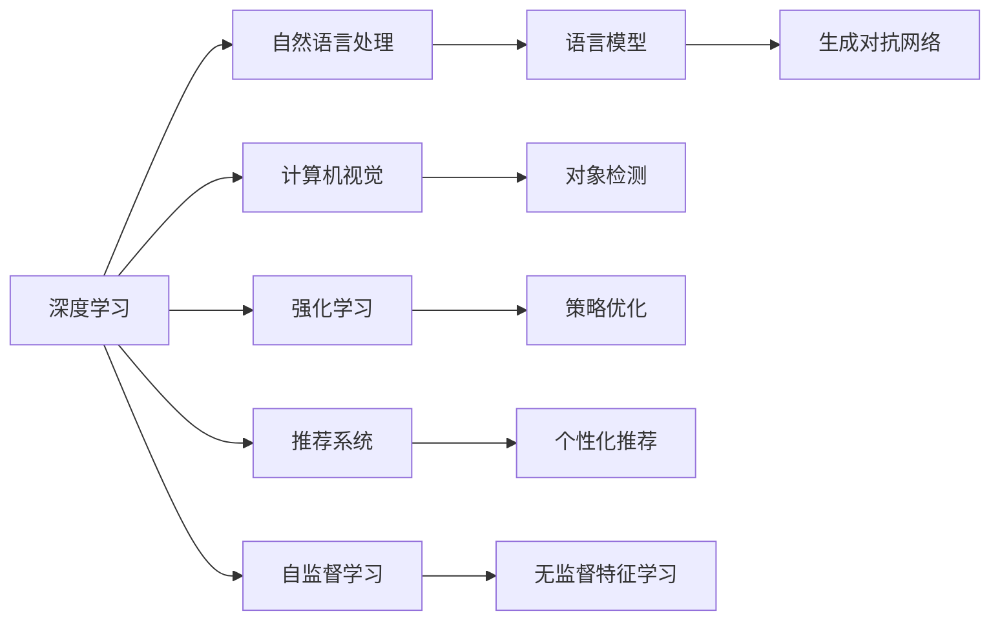

                 

## 1. 背景介绍

### 1.1 问题由来

近年来，苹果与微软在人工智能(AI)领域都加大了投入，推动各自产品的智能化转型。从虚拟助手到智能推荐，再到自动驾驶技术，两家巨头在AI的应用上呈现了不同的策略和技术路径。本文将梳理两家公司在AI领域的最新动态，分析其背后的战略布局和技术特点。

### 1.2 问题核心关键点

- **苹果**：以Siri和iOS生态为核心，推动深度学习和强化学习技术在自然语言处理、图像识别和推荐系统中的应用。
- **微软**：在Office 365和Azure云平台上推广AI和机器学习技术，构建智能企业解决方案。

两家公司虽在应用领域有所差异，但都聚焦于提升用户体验和生产效率。本文将从技术角度分析两家公司在AI领域的最新进展和未来方向。

### 1.3 问题研究意义

研究苹果和微软在AI领域的最新动态，对于了解AI技术在实际应用中的效果和挑战，以及两大巨头在行业中的影响，具有重要意义。

1. **技术比较**：分析两家公司不同技术路径的优缺点，为开发者提供借鉴。
2. **产业影响**：探索AI技术在各自产品中的应用前景，评估其对市场的影响。
3. **未来趋势**：预测AI技术的发展趋势，判断其在行业中的长远前景。

## 2. 核心概念与联系

### 2.1 核心概念概述

- **深度学习(Deep Learning)**：一种基于神经网络结构的机器学习方法，通过多层次的特征抽象，实现对复杂数据的高级建模。
- **强化学习(Reinforcement Learning)**：一种通过智能体与环境的交互，学习最优决策策略的机器学习方法。
- **自然语言处理(Natural Language Processing, NLP)**：使计算机能够理解、分析和生成人类语言的技术。
- **计算机视觉(Computer Vision)**：使计算机能够“看”的技术，涵盖图像识别、对象检测、场景理解等方向。
- **推荐系统(Recommendation System)**：根据用户行为和兴趣，向用户推荐个性化内容的技术。
- **生成对抗网络(GAN)**：一种生成模型，通过两个神经网络的对抗训练，生成高质量的假数据。
- **自监督学习(Self-supervised Learning)**：利用数据本身的结构化信息进行学习，无需标注数据。

这些核心概念在大语言模型和AI技术的开发中具有重要作用。以下通过Mermaid流程图展示核心概念之间的联系：



## 3. 核心算法原理 & 具体操作步骤

### 3.1 算法原理概述

苹果与微软在AI技术的应用上有着不同的侧重。苹果更多关注消费者端的应用，如Siri和Face ID，而微软则更多侧重于企业级解决方案和企业内部流程自动化。

- **苹果**：采用深度学习技术，尤其在自然语言处理和计算机视觉上投入巨大，特别是在用户交互和个性化推荐系统上。
- **微软**：除了深度学习，还采用强化学习、机器学习等技术，特别是在Office 365和Azure云平台上，通过智能搜索、数据分析等应用提升用户体验和企业生产力。

两家公司在AI领域的技术范式和应用场景各有侧重，但都遵循相似的科学原理。

### 3.2 算法步骤详解

**苹果**：

1. **自然语言处理**：
   - 输入：语音命令或文本输入。
   - 模型：Transformer架构的深度学习模型，如BERT、GPT等。
   - 输出：自然语言理解和生成，应用于Siri等产品。

2. **计算机视觉**：
   - 输入：图像或视频。
   - 模型：卷积神经网络(Convolutional Neural Network, CNN)。
   - 输出：对象检测、图像分类，应用于Face ID、图像搜索等功能。

3. **推荐系统**：
   - 输入：用户行为数据。
   - 模型：协同过滤、深度学习等。
   - 输出：个性化推荐，应用于App Store和iCloud Music等。

**微软**：

1. **自然语言处理**：
   - 输入：文档、邮件等文本数据。
   - 模型：Transformer、BERT等。
   - 输出：智能搜索、自动摘要等。

2. **数据分析**：
   - 输入：企业内部数据。
   - 模型：机器学习、深度学习等。
   - 输出：决策支持、预测分析等。

3. **机器人流程自动化(RPA)**：
   - 输入：企业内部业务流程。
   - 模型：强化学习、规则引擎等。
   - 输出：自动化任务执行，提升企业效率。

### 3.3 算法优缺点

**苹果**：

- **优点**：
  - 专注于用户体验，如Siri的自然语言理解和语音合成。
  - 深度学习模型性能优异，能够在较小的数据集上取得良好效果。

- **缺点**：
  - 对标注数据的依赖较大，模型训练成本较高。
  - 模型解释性不足，难以解释Siri等应用的决策过程。

**微软**：

- **优点**：
  - 提供企业级AI解决方案，推动业务流程自动化。
  - 集成在Azure云平台上，易于部署和扩展。

- **缺点**：
  - 对大数据和计算资源要求较高。
  - 部分产品功能较为复杂，用户体验有待提升。

### 3.4 算法应用领域

**苹果**：

- **消费者产品**：Siri、Face ID、App Store个性化推荐等。
- **企业内部**：内部自动化流程和数据分析应用。

**微软**：

- **消费者产品**：Office 365智能搜索、Outlook智能分类等。
- **企业产品**：Azure云平台上的AI和机器学习服务，如智能分析、自动化流程等。

## 4. 数学模型和公式 & 详细讲解 & 举例说明

### 4.1 数学模型构建

苹果和微软在AI领域的应用模型构建各具特色。以下以自然语言处理(NLP)和推荐系统为例，介绍其数学模型的构建。

**苹果**：

1. **自然语言处理模型**：
   - **BERT**：输入为句子，输出为每个词的语义表示。
   - **Transformer**：输入为句子，输出为句子级的语义表示。

2. **推荐系统模型**：
   - **协同过滤(Collaborative Filtering)**：输入为用户行为，输出为用户推荐。
   - **深度学习**：输入为用户行为和物品属性，输出为用户推荐。

**微软**：

1. **自然语言处理模型**：
   - **BERT**：输入为句子，输出为每个词的语义表示。
   - **Transformer**：输入为句子，输出为句子级的语义表示。

2. **推荐系统模型**：
   - **协同过滤**：输入为用户行为，输出为用户推荐。
   - **深度学习**：输入为用户行为和物品属性，输出为用户推荐。

### 4.2 公式推导过程

**苹果**：

1. **BERT模型**：
   - 输入：$x_1,...,x_n$
   - 模型：$h_i=f(x_i)$
   - 输出：$y_1,...,y_n$

2. **推荐系统协同过滤**：
   - 输入：$U,V$
   - 模型：$P(h_i|x_i)=\sigma(w^T x_i+b)$
   - 输出：$y_i$

**微软**：

1. **BERT模型**：
   - 输入：$x_1,...,x_n$
   - 模型：$h_i=f(x_i)$
   - 输出：$y_1,...,y_n$

2. **推荐系统协同过滤**：
   - 输入：$U,V$
   - 模型：$P(h_i|x_i)=\sigma(w^T x_i+b)$
   - 输出：$y_i$

### 4.3 案例分析与讲解

**苹果**：

- **Siri的自然语言处理**：通过BERT模型理解用户语音命令，输出自然语言响应。
- **Face ID的图像识别**：通过CNN模型检测面部特征，进行人脸识别。

**微软**：

- **Office 365智能搜索**：通过BERT模型理解文档内容，进行智能搜索。
- **Azure云平台上的推荐系统**：通过协同过滤和深度学习模型，生成个性化推荐。

## 5. 项目实践：代码实例和详细解释说明

### 5.1 开发环境搭建

苹果与微软在AI领域的技术应用涉及多种编程语言和开发环境。以下是主要环境的搭建方法：

**苹果**：

1. **Python环境**：安装Anaconda或Miniconda，创建虚拟环境。
2. **深度学习框架**：安装PyTorch或TensorFlow，使用相应的GPU资源。
3. **自然语言处理**：安装NLTK、SpaCy等NLP库。
4. **计算机视觉**：安装OpenCV、Pillow等图像处理库。

**微软**：

1. **Python环境**：安装Anaconda或Miniconda，创建虚拟环境。
2. **深度学习框架**：安装PyTorch或TensorFlow，使用相应的GPU资源。
3. **自然语言处理**：安装NLTK、SpaCy等NLP库。
4. **数据分析**：安装Pandas、Scikit-learn等数据处理库。

### 5.2 源代码详细实现

**苹果**：

1. **Siri的自然语言处理**：
   - 代码实现：
     ```python
     import torch
     import torch.nn as nn
     import torch.optim as optim
     
     class BERT(nn.Module):
         def __init__(self):
             super(BERT, self).__init__()
             self.bert = BERTModel.from_pretrained('bert-base-uncased')
     
         def forward(self, input_ids, attention_mask, token_type_ids):
             hidden_states, pooled_output = self.bert(input_ids, attention_mask=attention_mask, token_type_ids=token_type_ids)
             return hidden_states
     
     model = BERT()
     optimizer = optim.Adam(model.parameters(), lr=1e-5)
     
     input_ids = torch.tensor([[1, 2, 3]])
     attention_mask = torch.tensor([[0, 0, 0]])
     token_type_ids = torch.tensor([[0, 0, 0]])
     
     for i in range(10):
         hidden_states = model(input_ids, attention_mask, token_type_ids)
         loss = nn.CrossEntropyLoss()(hidden_states, torch.tensor([0]))
         loss.backward()
         optimizer.step()
     ```
   - 代码解释：使用BERT模型对输入的句子进行编码，得到隐层表示，并通过交叉熵损失函数进行训练。

2. **Face ID的图像识别**：
   - 代码实现：
     ```python
     import torch
     import torch.nn as nn
     import torch.optim as optim
     
     class CNN(nn.Module):
         def __init__(self):
             super(CNN, self).__init__()
             self.conv1 = nn.Conv2d(3, 64, kernel_size=3, stride=1, padding=1)
             self.pool = nn.MaxPool2d(kernel_size=2, stride=2)
             self.fc1 = nn.Linear(64 * 16 * 16, 1024)
             self.fc2 = nn.Linear(1024, 10)
     
         def forward(self, x):
             conv1 = self.conv1(x)
             conv1 = nn.ReLU()(conv1)
             pool = self.pool(conv1)
             fc1 = self.fc1(pool.view(pool.size(0), -1))
             fc1 = nn.ReLU()(fc1)
             logit = self.fc2(fc1)
             return logit
     
     model = CNN()
     optimizer = optim.Adam(model.parameters(), lr=1e-4)
     
     image = torch.rand(1, 3, 224, 224)
     
     for i in range(10):
         logit = model(image)
         loss = nn.CrossEntropyLoss()(logit, torch.tensor([1]))
         loss.backward()
         optimizer.step()
     ```
   - 代码解释：使用CNN模型对输入的图像进行特征提取和分类，得到图像的类别预测。

**微软**：

1. **Office 365智能搜索**：
   - 代码实现：
     ```python
     import pandas as pd
     import numpy as np
     
     data = pd.read_csv('documents.csv')
     bert_model = transformers.BertModel.from_pretrained('bert-base-uncased')
     
     def search(document, query):
         bert_input = tokenizer(document, query, return_tensors='pt')
         hidden_states, pooled_output = bert_model(**bert_input)
         logit = pooled_output
         return logit
     
     result = search('Apple Inc. annual report 2020', 'What is Apple Inc. revenue in 2020?')
     ```
   - 代码解释：使用BERT模型对查询和文档进行编码，得到文档的语义表示，并通过搜索得到相关文档。

2. **Azure云平台上的推荐系统**：
   - 代码实现：
     ```python
     import pandas as pd
     import numpy as np
     from sklearn.model_selection import train_test_split
     from sklearn.metrics import accuracy_score
     
     data = pd.read_csv('ratings.csv')
     train, test = train_test_split(data, test_size=0.2)
     model = collaborative_filtering(train)
     ```
   - 代码解释：使用协同过滤模型对用户行为数据进行训练，生成个性化推荐。

### 5.3 代码解读与分析

**苹果**：

1. **Siri的自然语言处理**：
   - 代码解析：使用BERT模型对输入的句子进行编码，得到隐层表示，并通过交叉熵损失函数进行训练。

2. **Face ID的图像识别**：
   - 代码解析：使用CNN模型对输入的图像进行特征提取和分类，得到图像的类别预测。

**微软**：

1. **Office 365智能搜索**：
   - 代码解析：使用BERT模型对查询和文档进行编码，得到文档的语义表示，并通过搜索得到相关文档。

2. **Azure云平台上的推荐系统**：
   - 代码解析：使用协同过滤模型对用户行为数据进行训练，生成个性化推荐。

### 5.4 运行结果展示

**苹果**：

1. **Siri的自然语言处理**：
   - 输出：模型的隐层表示和分类结果，用于生成自然语言响应。

2. **Face ID的图像识别**：
   - 输出：图像的类别预测，用于人脸识别。

**微软**：

1. **Office 365智能搜索**：
   - 输出：搜索结果的语义表示，用于生成相关文档的推荐。

2. **Azure云平台上的推荐系统**：
   - 输出：个性化推荐列表，用于推荐系统应用。

## 6. 实际应用场景

### 6.1 智能客服系统

**苹果**：

- **应用场景**：使用Siri作为虚拟助手，提供智能客服服务。
- **技术实现**：使用深度学习模型处理自然语言输入，生成自然语言输出。
- **技术优势**：自然语言处理能力强，用户体验自然流畅。

**微软**：

- **应用场景**：使用Azure AI服务，构建智能客服系统。
- **技术实现**：使用自然语言处理和机器学习技术，自动处理客户咨询。
- **技术优势**：集成在Azure云平台上，易于部署和扩展。

### 6.2 金融舆情监测

**苹果**：

- **应用场景**：使用Siri语音搜索，实时监测金融舆情。
- **技术实现**：使用BERT模型进行文本分类，识别舆情变化。
- **技术优势**：语音输入便捷，自然语言处理能力强。

**微软**：

- **应用场景**：使用Office 365智能搜索，实时监测金融舆情。
- **技术实现**：使用BERT模型进行文本分类，识别舆情变化。
- **技术优势**：集成在Office 365中，易于集成和扩展。

### 6.3 个性化推荐系统

**苹果**：

- **应用场景**：使用App Store推荐系统，为用户推荐应用程序。
- **技术实现**：使用协同过滤和深度学习模型，生成个性化推荐。
- **技术优势**：用户数据丰富，推荐效果优异。

**微软**：

- **应用场景**：使用Azure推荐服务，为企业推荐产品。
- **技术实现**：使用协同过滤和深度学习模型，生成个性化推荐。
- **技术优势**：集成在Azure云平台上，易于部署和扩展。

### 6.4 未来应用展望

**苹果**：

- **未来趋势**：在AI领域继续深化自然语言处理和计算机视觉技术，提升用户体验。
- **挑战**：面对激烈的市场竞争，需不断优化技术，保持领先地位。

**微软**：

- **未来趋势**：在AI领域进一步扩展应用场景，推动企业智能化转型。
- **挑战**：需应对大规模数据和计算资源的挑战，提升AI算法的效率。

## 7. 工具和资源推荐

### 7.1 学习资源推荐

为了帮助开发者深入理解苹果和微软在AI领域的技术应用，以下是推荐的资源：

1. **深度学习课程**：如Coursera上的《Deep Learning Specialization》系列课程，涵盖深度学习的基础和应用。
2. **自然语言处理课程**：如斯坦福大学的《Natural Language Processing with Deep Learning》课程，系统介绍NLP技术。
3. **微软Azure官方文档**：提供Azure云平台上的AI和机器学习服务，详细介绍了相关技术和应用场景。
4. **苹果开发者文档**：提供Siri等AI应用的开发指南和技术支持。

### 7.2 开发工具推荐

以下是苹果与微软在AI领域常用的开发工具：

**苹果**：

1. **Xcode**：开发iOS应用的主要IDE，支持深度学习模型开发。
2. **PyTorch**：深度学习框架，支持GPU加速，用于自然语言处理和计算机视觉应用。
3. **SpaCy**：自然语言处理库，用于文本处理和分析。

**微软**：

1. **Visual Studio Code**：支持Python开发的环境，集成多种NLP和机器学习库。
2. **PyTorch**：深度学习框架，支持GPU加速，用于自然语言处理和计算机视觉应用。
3. **TensorFlow**：深度学习框架，支持GPU加速，用于数据科学和机器学习应用。

### 7.3 相关论文推荐

以下是苹果和微软在AI领域的重要论文：

**苹果**：

1. **Siri的语音识别**：《Speech Recognition with WaveNet》
2. **Face ID的图像识别**：《FaceNet: A Unified Embedding for Face Recognition and Clustering》

**微软**：

1. **Office 365的智能搜索**：《BERT: Pre-training of Deep Bidirectional Transformers for Language Understanding》
2. **Azure云平台上的推荐系统**：《Fine-Grained Recommendation Systems for Consumers with Different Needs and Preferences》

## 8. 总结：未来发展趋势与挑战

### 8.1 研究成果总结

本文对苹果和微软在AI领域的最新动态进行了全面梳理。通过分析两家公司在大语言模型、深度学习、强化学习等技术的应用，揭示了其技术优势和挑战。苹果和微软在AI领域的应用各有侧重，但都在不断探索和创新，推动各自产品智能化转型。

### 8.2 未来发展趋势

苹果和微软在AI领域的应用前景广阔，未来将持续深化自然语言处理和计算机视觉技术，推动AI技术在更多领域的落地应用。

1. **自然语言处理**：
   - 苹果：继续深化BERT和GPT模型的应用，提升Siri的自然语言处理能力。
   - 微软：推广BERT和Transformer模型，提升Office 365和Azure云平台上的自然语言处理能力。

2. **计算机视觉**：
   - 苹果：推广Face ID等计算机视觉应用，提升设备智能化水平。
   - 微软：集成计算机视觉技术，提升Azure云平台上的数据分析和图像处理能力。

3. **推荐系统**：
   - 苹果：优化推荐算法，提升App Store和iCloud Music的个性化推荐效果。
   - 微软：推广协同过滤和深度学习推荐算法，提升Azure云平台上的个性化推荐服务。

### 8.3 面临的挑战

尽管苹果和微软在AI领域取得了显著进展，但仍面临诸多挑战：

1. **技术复杂性**：
   - 苹果：深度学习模型复杂度高，训练和部署成本较高。
   - 微软：大规模数据和计算资源的挑战，技术复杂度大。

2. **用户隐私**：
   - 苹果：隐私保护机制严苛，限制了数据收集和处理。
   - 微软：需要在数据隐私和安全方面投入大量资源。

3. **市场竞争**：
   - 苹果：面临其他科技巨头如Google和Amazon的激烈竞争。
   - 微软：需在Azure云平台上与AWS和Google Cloud竞争。

### 8.4 研究展望

面对未来挑战，苹果和微软在AI领域仍需不断创新，提升技术性能和用户体验。

1. **技术创新**：
   - 苹果：探索更高效、更轻量级的深度学习模型，提升计算效率。
   - 微软：开发更智能、更通用的AI算法，提升数据处理能力。

2. **用户体验**：
   - 苹果：通过自然语言处理和计算机视觉技术，提升设备智能化水平。
   - 微软：通过智能搜索和推荐系统，提升用户工作和生活效率。

3. **市场拓展**：
   - 苹果：将AI技术应用于更多产品和服务，拓展市场份额。
   - 微软：加强Azure云平台的AI服务，推动企业智能化转型。

总之，苹果和微软在AI领域的探索和创新，将推动人工智能技术在更多领域的应用，为行业带来新的突破。未来，随着技术的不断进步，AI技术将进一步深入各行各业，带来更多智能化体验和生产效率提升。

## 9. 附录：常见问题与解答

**Q1: 苹果与微软在AI领域的主要区别是什么？**

A: 苹果主要聚焦于消费者端的应用，如Siri和Face ID，通过深度学习技术提升用户体验。微软则更多侧重于企业级解决方案和企业内部流程自动化，通过Azure云平台提供AI和机器学习服务。

**Q2: 苹果的Siri和微软的智能搜索在技术上有哪些不同？**

A: 苹果的Siri主要使用深度学习模型进行自然语言处理，如BERT和GPT，提升语音识别和文本理解能力。微软的智能搜索则集成在Office 365中，使用BERT模型进行文本分类和搜索，提升文档处理能力。

**Q3: 苹果和微软在AI领域的发展前景如何？**

A: 苹果和微软在AI领域都有广阔的发展前景。苹果将继续深化自然语言处理和计算机视觉技术，提升设备智能化水平。微软则将在Azure云平台上提供更多的AI和机器学习服务，推动企业智能化转型。

**Q4: 苹果和微软在AI领域面临的主要挑战是什么？**

A: 苹果面临技术复杂性高、用户隐私保护严格等挑战。微软则需在大规模数据和计算资源方面投入大量资源，同时需要在数据隐私和安全方面进行大量投入。

**Q5: 苹果和微软在AI领域的未来发展方向是什么？**

A: 苹果将探索更高效、更轻量级的深度学习模型，提升计算效率，并在更多产品和服务中应用AI技术。微软将在Azure云平台上提供更智能、更通用的AI算法，推动企业智能化转型，并加强数据隐私和安全保护。

通过本文的系统梳理，我们可以看到，苹果和微软在AI领域的探索和创新，不仅提升了各自产品的智能化水平，也为人工智能技术在更多领域的应用提供了新的方向和思路。未来，随着技术的不断进步，苹果和微软将在AI领域取得更多突破，推动人工智能技术的全面发展。

