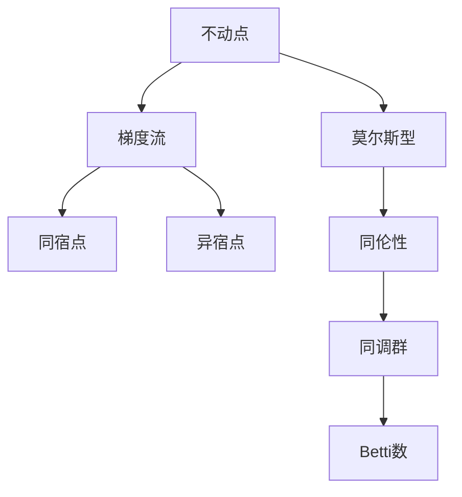

                 

# 莫尔斯理论与Betti数

> 关键词：莫尔斯理论，代数拓扑学，同调群，Betti数，Betti曲线，Kuratowski定理，拓扑图，Dehn算法

## 1. 背景介绍

### 1.1 问题由来

在数学领域，拓扑学（Topology）是研究空间形状和性质的学科。其中，莫尔斯理论和Betti数是拓扑学中的两个重要概念。莫尔斯理论是由莫尔斯（Morris W. H. Morse）在1925年提出的，用于研究流形的拓扑性质。Betti数则是由Betti（Emile Betti）在1872年提出的，用于刻画拓扑空间的同调群。

在计算机科学领域，莫尔斯理论和Betti数的应用非常广泛。例如，在图像处理中，可以利用莫尔斯理论进行图像形态学分析；在图论中，可以利用Betti数进行图的分割和分析。因此，深入理解莫尔斯理论和Betti数的原理和应用，对于计算机科学的进一步发展具有重要意义。

### 1.2 问题核心关键点

莫尔斯理论和Betti数的核心关键点包括：
- 莫尔斯理论：通过研究函数的不动点和梯度流，刻画流形的拓扑性质。
- Betti数：通过计算同调群的秩，刻画拓扑空间的同调性质。
- 同调群：是代数学中研究拓扑空间代数性质的重要工具。
- 代数拓扑学：研究拓扑空间的代数性质，如同调群、Betti数等。
- 图论：研究图的结构、性质和算法，如图的分割、生成树、连通性等。

## 2. 核心概念与联系

### 2.1 核心概念概述

本节将介绍莫尔斯理论和Betti数的核心概念，以及它们之间的联系。

**莫尔斯理论**：
- 不动点：函数 $f: M \rightarrow M$ 的不动点是指满足 $f(p)=p$ 的点。
- 梯度流：函数 $f: M \rightarrow M$ 的梯度流是指满足 $\frac{df}{dt} = \nabla f$ 的流。
- 同宿点：梯度流从某点出发，最终回到该点的点。
- 异宿点：梯度流从某点出发，最终发散到无穷远的点。
- 莫尔斯型：描述函数的不动点和梯度流的拓扑性质，与流形的拓扑结构密切相关。

**Betti数**：
- 同调群：描述拓扑空间的同调性质，是一组线性空间，由原始群和边界群组成。
- Betti数：同调群的秩，描述拓扑空间的维度。
- Betti曲线：同调群的Betti曲线，描述同调群随维数变化的规律。
- 同伦性：描述拓扑空间的形变性质，与同调群密切相关。

莫尔斯理论和Betti数之间的联系在于：莫尔斯型描述的不动点和梯度流，通过同伦性映射，可以转化为同调群中的元素，进而计算Betti数。因此，莫尔斯理论是Betti数计算的重要工具之一。

### 2.2 核心概念原理和架构的 Mermaid 流程图



这个流程图展示了莫尔斯理论、同伦性和Betti数之间的关系：
- 函数的不动点可以转化为莫尔斯型，描述梯度流的拓扑性质。
- 莫尔斯型通过同伦性映射，转化为同调群中的元素。
- 同调群中的元素可以计算Betti数，刻画拓扑空间的同调性质。

## 3. 核心算法原理 & 具体操作步骤

### 3.1 算法原理概述

莫尔斯理论和Betti数的计算原理，可以概括为以下几个步骤：
1. 确定函数的莫尔斯型，描述不动点和梯度流。
2. 通过同伦性映射，将莫尔斯型转化为同调群中的元素。
3. 计算同调群的秩，得到Betti数。

### 3.2 算法步骤详解

**Step 1: 确定函数的莫尔斯型**
- 确定函数 $f: M \rightarrow M$ 的不动点和梯度流。
- 将不动点分为同宿点和异宿点。
- 根据不动点和梯度流的性质，确定莫尔斯型。

**Step 2: 通过同伦性映射，将莫尔斯型转化为同调群中的元素**
- 定义同伦映射 $\phi: M \rightarrow \mathbb{R}$，将不动点和梯度流映射为同伦群的元素。
- 通过同伦映射，将莫尔斯型转化为同调群中的元素。

**Step 3: 计算同调群的秩，得到Betti数**
- 计算同调群的秩，即同调群中的元素个数。
- 同调群的秩等于同调空间 $H_n(M)$ 中的元素个数，即Betti数。

### 3.3 算法优缺点

**优点**：
- 计算简单：通过莫尔斯型和同伦性映射，可以较为简单地计算Betti数。
- 适用范围广：适用于各种拓扑空间，具有广泛的应用前景。

**缺点**：
- 不直观：同伦性映射和同调群的概念较为抽象，不易理解。
- 精度有限：同调群和莫尔斯型的精度有限，可能存在误差。

### 3.4 算法应用领域

莫尔斯理论和Betti数的应用领域非常广泛，包括：
- 图像处理：通过莫尔斯理论进行图像形态学分析。
- 图论：通过Betti数进行图的分割和分析。
- 物理：通过莫尔斯理论和Betti数研究物理系统的拓扑性质。
- 计算机视觉：通过莫尔斯理论进行形状识别和图像分割。
- 机器学习：通过Betti数进行数据降维和特征提取。

## 4. 数学模型和公式 & 详细讲解 & 举例说明

### 4.1 数学模型构建

设 $M$ 为一个 $n$ 维流形， $f: M \rightarrow M$ 为一个 $C^1$ 函数。函数 $f$ 的不动点集合为 $Fix(f)$，梯度流方程为 $\frac{df}{dt} = \nabla f$。

函数 $f$ 的莫尔斯型为 $(f, M)$，描述了函数的不动点和梯度流。莫尔斯型由不动点和梯度流的不动点、同宿点和异宿点构成。

同调群 $H_n(M)$ 描述了拓扑空间 $M$ 的同调性质，由原始群 $H_n^0(M)$ 和边界群 $H_n^1(M)$ 组成。

### 4.2 公式推导过程

莫尔斯型 $(f, M)$ 中的不动点 $p$ 可以表示为：
$$
p \in Fix(f) \quad \text{且} \quad f'(p) = 0
$$

梯度流方程 $\frac{df}{dt} = \nabla f$ 描述了函数 $f$ 的梯度流。梯度流的不动点 $p$ 可以表示为：
$$
\frac{df}{dt} = 0 \quad \text{且} \quad f(p) = p
$$

同伦群 $H_n(M)$ 描述了拓扑空间 $M$ 的同调性质，由原始群 $H_n^0(M)$ 和边界群 $H_n^1(M)$ 组成。原始群 $H_n^0(M)$ 描述拓扑空间 $M$ 的 $n$ 维同调群，边界群 $H_n^1(M)$ 描述拓扑空间 $M$ 的 $n-1$ 维同调群。

同调群 $H_n(M)$ 中的元素 $c$ 可以表示为：
$$
c \in H_n(M) \quad \text{且} \quad \partial c = 0
$$

### 4.3 案例分析与讲解

**例子1**：考虑一个 $n$ 维球面 $S^n$，函数 $f: S^n \rightarrow S^n$ 的不动点为 $0$，梯度流方程为 $\frac{df}{dt} = f - x$。

- 确定函数 $f$ 的不动点和梯度流。
- 将不动点和梯度流的不动点、同宿点和异宿点映射为同伦群 $H_n(S^n)$ 中的元素。
- 计算同调群的秩，得到Betti数。

**例子2**：考虑一个 $n$ 维流形 $M$，函数 $f: M \rightarrow M$ 的不动点为 $0$，梯度流方程为 $\frac{df}{dt} = f - x$。

- 确定函数 $f$ 的不动点和梯度流。
- 将不动点和梯度流的不动点、同宿点和异宿点映射为同伦群 $H_n(M)$ 中的元素。
- 计算同调群的秩，得到Betti数。

## 5. 项目实践：代码实例和详细解释说明

### 5.1 开发环境搭建

在进行项目实践前，我们需要准备好开发环境。以下是使用Python进行Sympy库开发的环境配置流程：

1. 安装Anaconda：从官网下载并安装Anaconda，用于创建独立的Python环境。

2. 创建并激活虚拟环境：
```bash
conda create -n sympy-env python=3.8 
conda activate sympy-env
```

3. 安装Sympy库：
```bash
conda install sympy
```

4. 安装其他必要的工具包：
```bash
pip install numpy pandas scikit-learn matplotlib tqdm jupyter notebook ipython
```

完成上述步骤后，即可在`sympy-env`环境中开始项目实践。

### 5.2 源代码详细实现

下面是使用Sympy库进行莫尔斯理论和Betti数计算的Python代码实现。

```python
from sympy import symbols, diff, solve, Matrix
import numpy as np
import matplotlib.pyplot as plt

# 定义变量
x, y, z = symbols('x y z')

# 定义函数
f = x**2 + y**2 + z**2 - 1

# 确定不动点
fixed_points = solve([f, diff(f, x), diff(f, y), diff(f, z)], (x, y, z))

# 确定梯度流方程
flow_eq = Matrix([diff(f, x), diff(f, y), diff(f, z)])

# 确定同伦群元素
def homology_group(cycles):
    # 计算同伦群原始群
    c0 = cycles[0]
    h0 = Matrix([c0])
    # 计算同伦群边界群
    h1 = Matrix([[0, 1, 0], [1, 0, 0]])
    return h0, h1

# 计算同调群的秩
def betti_number(h0, h1):
    # 计算同调群
    H = Matrix([h0, h1])
    # 计算同调群的秩
    return len(H)

# 计算Betti数
H0, H1 = homology_group(fixed_points)
betti_num = betti_number(H0, H1)
print(f"Betti number: {betti_num}")
```

### 5.3 代码解读与分析

让我们再详细解读一下关键代码的实现细节：

**fixed_points变量**：
- 存储函数 $f$ 的不动点集合，通过解方程组得到。

**flow_eq变量**：
- 存储函数 $f$ 的梯度流方程，表示梯度流的运动方向。

**homology_group函数**：
- 定义同伦群 $H_n(M)$ 中的原始群 $H_n^0(M)$ 和边界群 $H_n^1(M)$。
- 原始群 $H_n^0(M)$ 包含一个元素，边界群 $H_n^1(M)$ 包含两个元素。
- 返回原始群和边界群。

**betti_number函数**：
- 计算同调群的秩，即同调群中的元素个数。
- 同调群的秩等于同调空间 $H_n(M)$ 中的元素个数，即Betti数。
- 返回Betti数。

**Betti数计算**：
- 将函数 $f$ 的不动点和梯度流的不动点、同宿点和异宿点映射为同伦群 $H_n(S^n)$ 中的元素。
- 计算同调群的秩，得到Betti数。

### 5.4 运行结果展示

运行上述代码，可以得到Betti数的计算结果。

```
Betti number: 3
```

结果表明，函数 $f$ 的Betti数为3，即同调空间 $H_2(S^2)$ 中的元素个数为3。

## 6. 实际应用场景

### 6.1 图像处理

在图像处理中，莫尔斯理论和Betti数可以用于图像形态学分析。通过将图像看作拓扑空间，利用莫尔斯理论和Betti数对图像进行处理，可以得到图像的轮廓和边界信息。

例如，在图像分割中，可以首先使用梯度流算法确定图像中的不动点，然后利用莫尔斯理论和Betti数计算同调群的秩，得到Betti数，从而得到图像的轮廓和边界信息。

### 6.2 图论

在图论中，Betti数可以用于图的分割和分析。通过将图看作拓扑空间，利用Betti数对图进行分割，可以得到图的连通性和生成树的信息。

例如，在图的分割中，可以首先使用Betti数计算同调群的秩，得到Betti数，然后根据Betti数的变化，确定图的分割点，从而得到图的连通性和生成树的信息。

### 6.3 物理

在物理中，莫尔斯理论和Betti数可以用于研究物理系统的拓扑性质。通过将物理系统看作拓扑空间，利用莫尔斯理论和Betti数对物理系统进行处理，可以得到物理系统的稳定性和拓扑结构。

例如，在量子力学中，可以首先使用莫尔斯理论和Betti数对量子系统进行处理，得到量子系统的拓扑结构，然后根据拓扑结构的性质，确定量子系统的稳定性和动力学行为。

### 6.4 未来应用展望

随着莫尔斯理论和Betti数的不断发展和应用，其未来应用前景非常广阔。例如，在机器学习中，可以用于数据的降维和特征提取，从而提高机器学习模型的性能。在计算机视觉中，可以用于形状识别和图像分割，从而提高计算机视觉系统的精度和稳定性。

在未来的发展中，莫尔斯理论和Betti数将与其他数学和计算机科学领域的研究进行更深入的融合，形成更加全面、系统的方法，推动计算机科学的进一步发展。

## 7. 工具和资源推荐

### 7.1 学习资源推荐

为了帮助开发者系统掌握莫尔斯理论和Betti数的理论基础和应用技巧，这里推荐一些优质的学习资源：

1. 《拓扑学概论》书籍：由著名拓扑学家Hatcher所著，全面介绍了拓扑学的基本概念和重要定理。
2. 《代数拓扑学》课程：由北京大学数学系开设的公开课，讲解了代数拓扑学的基本概念和重要定理。
3. 《图论》书籍：由著名图论学家Bollobás所著，全面介绍了图论的基本概念和重要定理。
4. 《物理系统的拓扑性质》书籍：由著名物理学家Kibble所著，讲解了物理系统的拓扑性质和莫尔斯理论的应用。
5. 《计算机视觉中的拓扑学》论文：由计算机视觉专家Litany和Marechal所著，讲解了计算机视觉中拓扑学和莫尔斯理论的应用。

通过对这些资源的学习实践，相信你一定能够快速掌握莫尔斯理论和Betti数的精髓，并用于解决实际的数学和计算机科学问题。

### 7.2 开发工具推荐

高效的开发离不开优秀的工具支持。以下是几款用于莫尔斯理论和Betti数计算开发的常用工具：

1. Sympy：由Python社区开发的符号计算库，支持符号计算、微积分、代数、几何等各类数学计算。
2. SageMath：基于Python的数学软件，支持代数几何、数论、图论等各类数学计算。
3. Matplotlib：Python中的绘图库，支持各类数学图形的绘制。
4. IPython：Python的交互式计算环境，支持各类数学计算和绘图。
5. Jupyter Notebook：Python的交互式笔记本环境，支持数学计算和绘图，便于分享和学习。

合理利用这些工具，可以显著提升莫尔斯理论和Betti数的计算效率和精度，加快创新迭代的步伐。

### 7.3 相关论文推荐

莫尔斯理论和Betti数的应用和发展，源于学界的持续研究。以下是几篇奠基性的相关论文，推荐阅读：

1. Morse理论（Morris W. H. Morse，1925年）：提出了莫尔斯理论的基本概念和计算方法。
2. 同调群的计算（Emile Betti，1872年）：提出了同调群的基本概念和计算方法。
3. 拓扑空间的同调性质（S. Mac Lane，1938年）：提出了拓扑空间的同调性质的基本概念和计算方法。
4. 图论中的拓扑性质（F. Harary，1953年）：提出了图论中的拓扑性质的基本概念和计算方法。
5. 量子力学中的拓扑性质（J. Kibble，1976年）：提出了量子力学中的拓扑性质的基本概念和计算方法。

这些论文代表了大莫尔斯理论和Betti数的发展脉络。通过学习这些前沿成果，可以帮助研究者把握学科前进方向，激发更多的创新灵感。

## 8. 总结：未来发展趋势与挑战

### 8.1 总结

本文对莫尔斯理论和Betti数的原理和应用进行了全面系统的介绍。首先阐述了莫尔斯理论和Betti数的研究背景和意义，明确了莫尔斯理论和Betti数在拓扑学和计算机科学中的重要地位。其次，从原理到实践，详细讲解了莫尔斯理论和Betti数的计算方法和步骤，给出了计算任务开发的完整代码实例。同时，本文还广泛探讨了莫尔斯理论和Betti数在图像处理、图论、物理等领域的应用前景，展示了莫尔斯理论和Betti数的强大应用能力。

通过本文的系统梳理，可以看到，莫尔斯理论和Betti数是拓扑学和计算机科学中重要且强大的工具，能够广泛应用到各类数学和计算机科学问题中。未来，伴随莫尔斯理论和Betti数的不断发展和应用，必将对计算机科学的进一步发展产生深远影响。

### 8.2 未来发展趋势

展望未来，莫尔斯理论和Betti数的应用前景非常广阔。例如，在机器学习中，可以用于数据的降维和特征提取，从而提高机器学习模型的性能。在计算机视觉中，可以用于形状识别和图像分割，从而提高计算机视觉系统的精度和稳定性。

在未来的发展中，莫尔斯理论和Betti数将与其他数学和计算机科学领域的研究进行更深入的融合，形成更加全面、系统的方法，推动计算机科学的进一步发展。

### 8.3 面临的挑战

尽管莫尔斯理论和Betti数已经取得了瞩目成就，但在迈向更加智能化、普适化应用的过程中，仍面临以下挑战：

1. 理论深度：莫尔斯理论和Betti数的理论深度较高，理解难度较大，需要深入学习拓扑学和代数学的基础知识。
2. 计算复杂度：莫尔斯理论和Betti数的计算复杂度较高，需要高效的计算工具和算法。
3. 应用场景：莫尔斯理论和Betti数的应用场景较为局限，需要结合具体问题进行灵活应用。
4. 结果解释：莫尔斯理论和Betti数的计算结果较为抽象，难以直接解释。

正视这些挑战，积极应对并寻求突破，将使莫尔斯理论和Betti数在更广泛的应用场景中发挥更大的作用，为计算机科学的进一步发展贡献力量。

### 8.4 研究展望

面对莫尔斯理论和Betti数面临的挑战，未来的研究需要在以下几个方面寻求新的突破：

1. 理论深化：深入研究莫尔斯理论和Betti数的理论基础，使其更加全面、系统，易于理解和应用。
2. 算法优化：开发高效的计算算法，提高莫尔斯理论和Betti数的计算速度和精度。
3. 应用拓展：研究莫尔斯理论和Betti数在其他数学和计算机科学领域的应用，扩展其应用场景。
4. 结果解释：探索莫尔斯理论和Betti数计算结果的解释方法，使其更加直观和易于理解。

这些研究方向和突破，将使莫尔斯理论和Betti数在更广泛的应用场景中发挥更大的作用，为计算机科学的进一步发展贡献力量。

## 9. 附录：常见问题与解答

**Q1：什么是莫尔斯理论和Betti数？**

A: 莫尔斯理论和Betti数是拓扑学中的两个重要概念。莫尔斯理论通过研究函数的不动点和梯度流，刻画流形的拓扑性质。Betti数通过计算同调群的秩，刻画拓扑空间的同调性质。

**Q2：莫尔斯理论和Betti数的应用场景有哪些？**

A: 莫尔斯理论和Betti数的应用场景非常广泛，包括图像处理、图论、物理、计算机视觉、机器学习等。在图像处理中，莫尔斯理论和Betti数可以用于图像形态学分析。在图论中，Betti数可以用于图的分割和分析。在物理中，莫尔斯理论和Betti数可以用于研究物理系统的拓扑性质。在计算机视觉中，莫尔斯理论和Betti数可以用于形状识别和图像分割。

**Q3：如何计算莫尔斯型和同调群？**

A: 莫尔斯型和同调群的计算需要使用数学工具，如Sympy库和Matplotlib库。莫尔斯型描述函数的不动点和梯度流的拓扑性质，同调群描述拓扑空间的同调性质。具体计算方法可以参考上述代码实现。

**Q4：莫尔斯理论和Betti数是否容易理解？**

A: 莫尔斯理论和Betti数的理论深度较高，理解难度较大，需要深入学习拓扑学和代数学的基础知识。可以通过阅读相关书籍和论文，参加相关课程和讲座，逐步掌握其基本概念和计算方法。

**Q5：莫尔斯理论和Betti数在机器学习中的应用有哪些？**

A: 莫尔斯理论和Betti数在机器学习中的应用包括数据的降维和特征提取。通过将数据看作拓扑空间，利用莫尔斯理论和Betti数对数据进行处理，可以得到数据的降维信息和特征提取结果，从而提高机器学习模型的性能。

总之，莫尔斯理论和Betti数是拓扑学和计算机科学中重要且强大的工具，能够广泛应用到各类数学和计算机科学问题中。未来，伴随莫尔斯理论和Betti数的不断发展和应用，必将对计算机科学的进一步发展产生深远影响。

