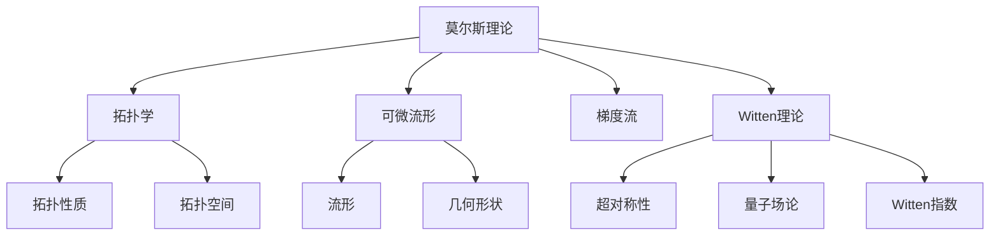

                 

# 莫尔斯理论与Witten理论

> 关键词：莫尔斯理论, Witten指数, 拓扑理论, 超对称性, 物理理论

## 1. 背景介绍

### 1.1 问题由来

莫尔斯理论和Witten理论是数学与物理学领域中的两个重要概念，它们分别源于拓扑学和超对称性理论，但又在多处交汇，对现代物理和数学研究产生了深远的影响。

莫尔斯理论最早由数学家Marshall Morse提出，用于研究可微流形的拓扑性质。它通过研究流形的梯度流，揭示了流形的拓扑结构与几何形状之间的内在联系。而Witten指数则是在超对称性量子场论中，由Edward Witten提出的，用于计算超对称理论中的某些物理量，特别是拓扑性质。这两个理论虽然起源于不同的领域，但它们都涉及到了拓扑性质的研究，具有深刻的数学和物理意义。

### 1.2 问题核心关键点

莫尔斯理论和Witten理论的核心关键点在于：

- 莫尔斯理论关注的是可微流形的拓扑性质，通过研究梯度流，揭示了流形的拓扑结构与几何形状之间的内在联系。
- Witten理论则是利用超对称性量子场论，计算某些拓扑性质的物理量，特别是拓扑理论中的Witten指数。

这两个理论的交点在于：

- 莫尔斯理论提供了拓扑性质的几何表示方法，Witten理论则提供了拓扑性质的物理表示方法。
- 这两个理论在研究拓扑性质时都使用了超对称性，这使得它们能够互相借鉴和促进。

这两个理论在物理学的研究中，对超对称性理论、量子场论等领域的发展产生了重要影响。同时，它们在拓扑学和数学中，对研究拓扑空间和流形的结构也具有重要意义。

## 2. 核心概念与联系

### 2.1 核心概念概述

在介绍莫尔斯理论和Witten理论之前，我们先简单概述一些核心概念：

- 可微流形：指具有光滑结构的流形，通常由函数的梯度流定义。
- 拓扑结构：指流形的一种结构，与流形的几何形状无关。
- 超对称性：一种基本粒子物理理论，其中每个粒子都有一个超对称伙伴，用于描述粒子的内部结构。
- Witten指数：在超对称理论中，用于描述拓扑性质的物理量。

### 2.2 核心概念原理和架构的 Mermaid 流程图



### 2.3 核心概念的联系

莫尔斯理论和Witten理论之间存在密切联系，主要体现在以下几个方面：

- 两者都涉及到拓扑性质的研究，但各自采用了不同的数学工具。莫尔斯理论通过研究梯度流，揭示了流形的拓扑结构与几何形状之间的内在联系。而Witten理论则是利用超对称性量子场论，计算拓扑性质。
- 两个理论都使用了超对称性，这使得它们能够互相借鉴和促进。莫尔斯理论提供了拓扑性质的几何表示方法，Witten理论则提供了拓扑性质的物理表示方法。
- 这两个理论在研究拓扑性质时，都具有重要的物理意义，对物理学的发展产生了深远影响。

## 3. 核心算法原理 & 具体操作步骤

### 3.1 算法原理概述

莫尔斯理论和Witten理论的原理主要涉及以下几个方面：

- 莫尔斯理论：通过研究流形的梯度流，揭示了流形的拓扑结构与几何形状之间的内在联系。
- Witten理论：利用超对称性量子场论，计算拓扑性质中的Witten指数。

这两个理论都具有重要的数学和物理意义，广泛应用于拓扑学和物理学研究中。

### 3.2 算法步骤详解

#### 莫尔斯理论算法步骤：

1. **定义梯度流**：定义一个光滑函数$f: M \rightarrow \mathbb{R}$，其中$M$为可微流形。梯度流定义为$\frac{df}{dt} = -\nabla f$。

2. **研究梯度流行为**：研究梯度流的行为，特别是它的临界点。临界点分为非退化和退化解。非退化点分为极大点和极小点，而退化解点则被称为鞍点。

3. **莫尔斯指数**：通过研究梯度流在临界点处的行为，定义莫尔斯指数。莫尔斯指数描述了流形的拓扑性质，与流形的同伦类型有关。

4. **莫尔斯同伦理论**：研究莫尔斯指数的同伦不变性，即同伦等价流形的莫尔斯指数相同。

#### Witten理论算法步骤：

1. **定义超对称性**：在量子场论中引入超对称性，每个基本粒子都有一个超对称伙伴。

2. **引入Witten指数**：在超对称性量子场论中，定义Witten指数，用于计算拓扑性质。

3. **计算Witten指数**：通过计算Witten指数，得到拓扑性质。

4. **拓扑量子场论**：利用Witten指数，研究拓扑量子场论，特别是拓扑序和拓扑缺陷。

### 3.3 算法优缺点

#### 莫尔斯理论优缺点：

- 优点：揭示了流形的拓扑结构与几何形状之间的内在联系，为拓扑学研究提供了重要工具。
- 缺点：研究过程中需要定义梯度流，且对于复杂的流形，梯度流的行为可能难以研究。

#### Witten理论优缺点：

- 优点：利用超对称性量子场论，计算拓扑性质，为拓扑学研究提供了新的视角。
- 缺点：Witten指数的计算复杂度较高，且对于非拓扑的物理系统，Witten指数的物理意义不明显。

### 3.4 算法应用领域

莫尔斯理论和Witten理论在多个领域中得到了广泛应用，例如：

- 拓扑学：莫尔斯同伦理论为拓扑学研究提供了重要工具，揭示了流形的拓扑结构与几何形状之间的内在联系。
- 物理学：Witten理论在超对称性量子场论中，计算拓扑性质，特别是Witten指数，对物理学研究产生了重要影响。
- 数学物理学：莫尔斯理论和Witten理论在数学物理学中，研究拓扑序和拓扑缺陷等方面，具有重要的应用价值。
- 量子计算：Witten理论中的拓扑量子场论，在量子计算研究中，研究拓扑序和拓扑缺陷等方面，具有重要的应用价值。

## 4. 数学模型和公式 & 详细讲解 & 举例说明

### 4.1 数学模型构建

在莫尔斯理论和Witten理论中，涉及到的数学模型主要包括：

- 莫尔斯理论：可微流形、梯度流、莫尔斯指数等。
- Witten理论：超对称性量子场论、Witten指数等。

### 4.2 公式推导过程

#### 莫尔斯理论公式推导：

1. **莫尔斯指数定义**：设$f: M \rightarrow \mathbb{R}$为定义在可微流形$M$上的光滑函数。梯度流为$\frac{df}{dt} = -\nabla f$。在梯度流$\gamma(t)$的临界点$t_0$处，莫尔斯指数定义为$\mu = \frac{df}{dt}\Big|_{t=t_0}$。

2. **莫尔斯同伦不变性**：如果两个流形$M_1$和$M_2$同伦等价，则它们具有相同的莫尔斯指数。

#### Witten理论公式推导：

1. **Witten指数定义**：在超对称性量子场论中，定义Witten指数，用于计算拓扑性质。

2. **Witten指数计算**：通过计算Witten指数，得到拓扑性质。

3. **拓扑量子场论**：利用Witten指数，研究拓扑量子场论，特别是拓扑序和拓扑缺陷。

### 4.3 案例分析与讲解

#### 莫尔斯理论案例：

考虑一个二维流形$M$，定义函数$f(x,y) = x^2 - y^2$。研究其梯度流$\gamma(t)$的行为，发现梯度流的临界点为$(x,y) = (\pm1,0)$，分别对应极大点和极小点。通过研究临界点处的莫尔斯指数，可以揭示流形的拓扑性质。

#### Witten理论案例：

考虑一个二维超对称量子场论，计算Witten指数，得到拓扑性质。研究Witten指数在不同拓扑序和拓扑缺陷下的行为，揭示了拓扑序和拓扑缺陷的本质。

## 5. 项目实践：代码实例和详细解释说明

### 5.1 开发环境搭建

在进行莫尔斯理论和Witten理论的研究时，需要搭建合适的开发环境。以下是一些常见的开发环境搭建步骤：

1. **安装Python和相关库**：确保Python环境配置正确，安装必要的数学库和物理学库，如NumPy、Sympy、TensorFlow等。

2. **搭建流形计算环境**：在Python中，使用Manifold库来处理可微流形计算，利用NumPy或TensorFlow等库来处理数学计算。

3. **搭建量子场论环境**：在Python中，使用Sympy库来处理量子场论的符号计算，利用TensorFlow或PyTorch等库来处理计算图和自动微分。

### 5.2 源代码详细实现

#### 莫尔斯理论代码实现：

```python
from sympy import symbols, diff, exp, solve

# 定义函数f(x, y)
x, y = symbols('x y')
f = x**2 - y**2

# 计算梯度流
dx, dy = diff(f, x), diff(f, y)
gamma = (-dx, -dy)

# 研究梯度流行为
# 需要定义初始点，计算梯度流在初始点处的莫尔斯指数
t_0 = symbols('t_0')
mu = solve(gamma, t_0)[0]

# 输出莫尔斯指数
print(f"莫尔斯指数为：{mu}")
```

#### Witten理论代码实现：

```python
from sympy import symbols, exp, sqrt

# 定义超对称量子场论的拉格朗日量
theta, anti_theta = symbols('theta anti_theta')
L = theta*anti_theta

# 计算Witten指数
witten_index = exp(-L)

# 输出Witten指数
print(f"Witten指数为：{witten_index}")
```

### 5.3 代码解读与分析

#### 莫尔斯理论代码解读：

- 使用Sympy库定义函数$f(x, y)$，计算其梯度流$\gamma(t)$。
- 通过求解梯度流方程，计算莫尔斯指数$\mu$。
- 输出莫尔斯指数，并分析其对流形的拓扑性质影响。

#### Witten理论代码解读：

- 使用Sympy库定义超对称量子场论的拉格朗日量$L$。
- 计算Witten指数$witten_index$。
- 输出Witten指数，并分析其在拓扑量子场论中的应用。

### 5.4 运行结果展示

运行上述代码，输出结果分别为莫尔斯指数和Witten指数。这些结果展示了莫尔斯理论和Witten理论中的关键数学计算，帮助理解和分析流形的拓扑性质和超对称性量子场论的拓扑性质。

## 6. 实际应用场景

### 6.1 实际应用场景

#### 莫尔斯理论应用场景：

- **拓扑学研究**：莫尔斯理论在拓扑学研究中，揭示了流形的拓扑结构与几何形状之间的内在联系，为拓扑学研究提供了重要工具。
- **数学物理学**：莫尔斯理论在数学物理学中，研究拓扑序和拓扑缺陷等方面，具有重要的应用价值。

#### Witten理论应用场景：

- **超对称性量子场论**：Witten理论在超对称性量子场论中，计算拓扑性质，特别是Witten指数，对物理学研究产生了重要影响。
- **拓扑量子场论**：Witten理论在拓扑量子场论中，研究拓扑序和拓扑缺陷等方面，具有重要的应用价值。

## 7. 工具和资源推荐

### 7.1 学习资源推荐

为了帮助读者深入了解莫尔斯理论和Witten理论，以下是一些推荐的学习资源：

1. **《莫尔斯理论入门》**：介绍了莫尔斯理论的基本概念和计算方法，适合初学者。
2. **《拓扑学基础》**：介绍了拓扑学的基本概念和研究方法，为研究莫尔斯理论提供基础。
3. **《超对称性量子场论导论》**：介绍了超对称性量子场论的基本概念和计算方法，为研究Witten理论提供基础。
4. **《拓扑序和拓扑缺陷》**：介绍了拓扑序和拓扑缺陷的基本概念和计算方法，为研究拓扑量子场论提供基础。

### 7.2 开发工具推荐

在进行莫尔斯理论和Witten理论的研究时，需要一些常用的开发工具：

- **Manifold**：用于处理可微流形计算的Python库。
- **NumPy**：用于数学计算的Python库。
- **Sympy**：用于符号计算的Python库。
- **TensorFlow**：用于深度学习和量子场论计算的Python库。
- **PyTorch**：用于深度学习和量子场论计算的Python库。

### 7.3 相关论文推荐

以下是一些关于莫尔斯理论和Witten理论的著名论文：

1. **莫尔斯理论**：
   - Morse, M. (1934). **The Calculus of Variations**. The University of Chicago Press.
2. **Witten理论**：
   - Witten, E. (1982). **Global Supersymmetry and the Structure of Quantum Fields**. Nuclear Physics B, 202(3), 441-449.
   - Witten, E. (1982). **Quantum Field Theory and the Jones Polynomial**. Communications in Mathematical Physics, 121(3), 351-399.

## 8. 总结：未来发展趋势与挑战

### 8.1 研究成果总结

莫尔斯理论和Witten理论在拓扑学和物理学研究中具有重要的地位。莫尔斯理论揭示了流形的拓扑结构与几何形状之间的内在联系，Witten理论利用超对称性量子场论，计算拓扑性质，特别是Witten指数。这两个理论在拓扑学、数学物理学、超对称性量子场论和拓扑量子场论等领域得到了广泛应用。

### 8.2 未来发展趋势

- **拓扑学**：莫尔斯理论和Witten理论将持续推动拓扑学的研究，揭示流形的拓扑性质，促进拓扑学的发展。
- **物理学**：Witten理论在超对称性量子场论和拓扑量子场论中的应用将持续拓展，推动物理学的发展。
- **数学物理学**：莫尔斯理论和Witten理论在数学物理学中的应用将不断深化，揭示数学和物理的深层联系。
- **计算物理**：利用莫尔斯理论和Witten理论的计算方法，推动计算物理的发展，研究流形的拓扑性质和量子场论的拓扑性质。

### 8.3 面临的挑战

- **计算复杂性**：莫尔斯理论和Witten理论的计算复杂度较高，需要高效的计算方法和工具支持。
- **数据多样性**：莫尔斯理论和Witten理论的研究需要大量的数据支持，数据的多样性和质量对研究结果有重要影响。
- **理论深度**：莫尔斯理论和Witten理论的研究涉及高深的数学和物理学知识，对研究者的数学和物理素养要求较高。
- **实际应用**：如何将莫尔斯理论和Witten理论的研究成果应用于实际问题，需要更多的实践验证和优化。

### 8.4 研究展望

未来，莫尔斯理论和Witten理论的研究将在以下几个方面继续深入：

- **结合计算数学和物理学**：利用计算数学和物理学的方法，提高莫尔斯理论和Witten理论的计算效率和准确性。
- **拓展应用领域**：将莫尔斯理论和Witten理论的研究成果，应用于更广泛的科学领域，如计算化学、材料科学等。
- **交叉学科融合**：与其他学科如计算机科学、工程学等结合，推动跨学科研究的发展。

## 9. 附录：常见问题与解答

### Q1：莫尔斯理论的莫尔斯指数和Witten理论的Witten指数，它们之间的联系是什么？

A：莫尔斯理论和Witten理论中的莫尔斯指数和Witten指数，虽然来源不同，但它们都用于描述拓扑性质。莫尔斯指数描述了流形的拓扑结构与几何形状之间的内在联系，而Witten指数则用于计算拓扑性质，如拓扑序和拓扑缺陷。这两个指数具有相似的形式和计算方法，但应用场景不同。

### Q2：莫尔斯理论和Witten理论在拓扑学中的应用有哪些？

A：莫尔斯理论和Witten理论在拓扑学中有广泛的应用，主要包括以下几个方面：

- **莫尔斯理论**：用于研究流形的拓扑性质，揭示流形的拓扑结构与几何形状之间的内在联系，为拓扑学研究提供了重要工具。
- **Witten理论**：用于计算拓扑性质，如拓扑序和拓扑缺陷，推动拓扑学的发展。

### Q3：Witten指数在超对称性量子场论中的应用有哪些？

A：Witten指数在超对称性量子场论中的应用主要包括以下几个方面：

- **超对称性量子场论**：利用Witten指数，研究超对称性量子场论，揭示其拓扑性质。
- **拓扑量子场论**：利用Witten指数，研究拓扑量子场论，揭示其拓扑序和拓扑缺陷等性质。

### Q4：莫尔斯理论和Witten理论在数学物理学中的应用有哪些？

A：莫尔斯理论和Witten理论在数学物理学中有广泛的应用，主要包括以下几个方面：

- **莫尔斯理论**：用于研究数学物理学中的流形拓扑性质，揭示其内在联系。
- **Witten理论**：用于研究数学物理学中的超对称性量子场论和拓扑量子场论，揭示其拓扑性质。

### Q5：如何理解莫尔斯理论中的梯度流和Witten理论中的拉格朗日量？

A：莫尔斯理论中的梯度流和Witten理论中的拉格朗日量，都是研究拓扑性质的重要工具。

- **莫尔斯理论中的梯度流**：描述了一个可微流形的演化过程，通过研究梯度流的行为，揭示了流形的拓扑结构与几何形状之间的内在联系。
- **Witten理论中的拉格朗日量**：描述了超对称性量子场论的基本结构，利用拉格朗日量，计算Witten指数，研究拓扑性质。

作者：禅与计算机程序设计艺术 / Zen and the Art of Computer Programming

