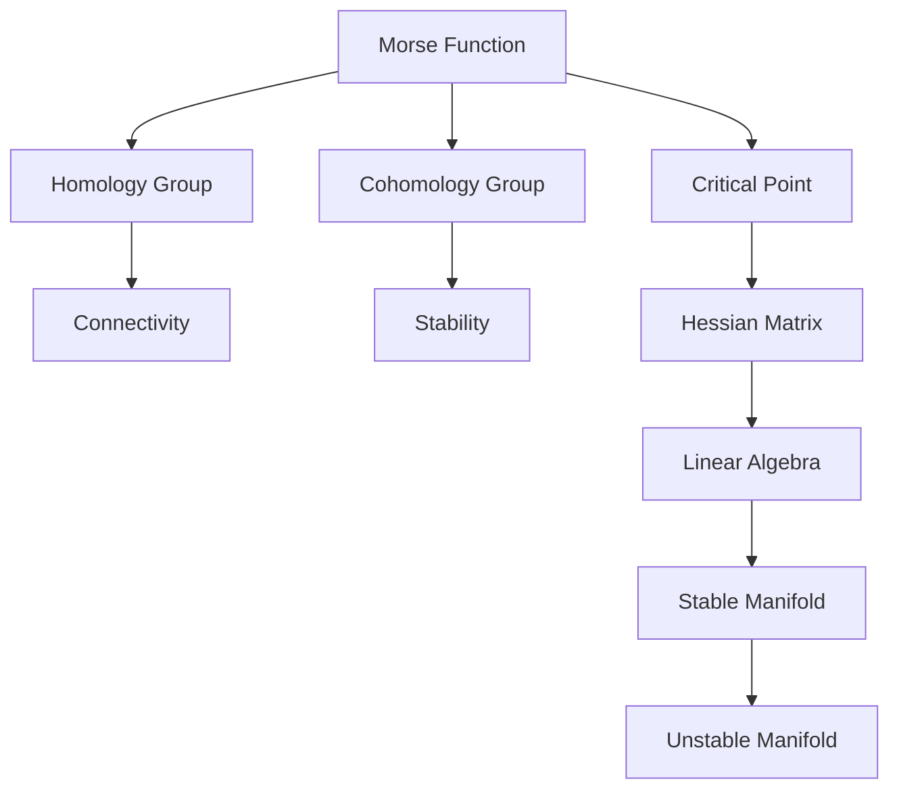

                 

# 莫尔斯理论在几何中的应用

## 1. 背景介绍

### 1.1 问题由来

莫尔斯理论是微分拓扑和代数拓扑中的一个经典理论，最初由数学家马科斯·莫尔斯（Morris Waddell Thomsen）于1932年提出。该理论主要研究了流形上的拓扑性质与其微分结构之间的关联。它为流形的拓扑分类提供了有效的手段，也为研究流形的同调群和上同调群提供了新的视角。莫尔斯理论在数学研究中具有重要意义，并在实际应用中得到了广泛的应用。

### 1.2 问题核心关键点

莫尔斯理论的核心在于：
1. 通过定义莫尔斯函数，研究其在流形上的临界点和稳定点。
2. 利用临界点的性质，推导出流形的同调群和上同调群。
3. 研究莫尔斯同调群在拓扑分类和同伦等价中的作用。

这些关键点共同构成了莫尔斯理论的框架，使得该理论能够对流形的性质进行深入的探究。

### 1.3 问题研究意义

莫尔斯理论不仅对数学研究具有重要意义，也在实际应用中展现了巨大的潜力。例如：
- 在数学研究中，莫尔斯理论为流形的拓扑分类和同伦等价提供了一种新的方法，对代数拓扑的研究起到了推动作用。
- 在物理学的研究中，莫尔斯理论被用来研究物理系统的运动性质和稳定性，如动态系统中的不稳定平衡点和准周期性等。
- 在计算机科学中，莫尔斯理论被应用于算法设计、图形学、信号处理等领域。

总之，莫尔斯理论不仅在理论研究中具有重要的地位，还在实际应用中发挥了重要作用。

## 2. 核心概念与联系

### 2.1 核心概念概述

为更好地理解莫尔斯理论，本节将介绍几个密切相关的核心概念：

- 莫尔斯函数(Morse Function)：一种在流形上定义的光滑函数，具有光滑且严格递增的特性，在临界点附近的行为类似于二次函数。
- 临界点(Critical Point)：莫尔斯函数中的极小值点和极大值点，是研究莫尔斯同调群和上同调群的关键点。
- 同调群(Homology Group)：一种代数结构，描述流形的拓扑性质，用于研究流形的连通性和孔洞等特性。
- 上同调群(Cohomology Group)：同调群的一种推广形式，用于研究流形的稳定性和更高层次的拓扑性质。
- 同伦等价(Homotopy Equivalence)：指两个拓扑空间在某个连续映射下是相等的，用于描述拓扑空间的相似性。

这些概念之间的逻辑关系可以通过以下Mermaid流程图来展示：



这个流程图展示了一部分莫尔斯理论中的概念及其之间的关系：

1. 莫尔斯函数中的临界点与Hessian矩阵和线性代数的相关性质有关。
2. 同调群和上同调群描述了流形的连通性和稳定性等拓扑特性。
3. 同伦等价用于比较拓扑空间的相似性。

## 3. 核心算法原理 & 具体操作步骤
### 3.1 算法原理概述

莫尔斯理论的核心在于通过定义莫尔斯函数，研究其在流形上的临界点和稳定点，并利用临界点的性质，推导出流形的同调群和上同调群。

形式化地，假设 $M$ 为一个 $n$ 维流形，定义一个光滑函数 $f: M \rightarrow \mathbb{R}$，称为莫尔斯函数。如果函数 $f$ 具有以下性质：
- 在临界点处，$\nabla f = 0$。
- 在临界点附近，$|\nabla f| > 0$。

则称 $f$ 为莫尔斯函数。莫尔斯函数的一个重要特性是其临界点分为两类：极大值点和极小值点，这些点在拓扑学中有特殊的意义。

莫尔斯理论的研究目标在于：
1. 研究莫尔斯函数在临界点的性质，以及这些性质如何影响流形的拓扑结构。
2. 利用临界点的性质，推导出流形的同调群和上同调群。
3. 研究同调群和上同调群之间的关系，以及它们如何反映流形的拓扑特性。

### 3.2 算法步骤详解

莫尔斯理论的实现主要分为以下几个步骤：

**Step 1: 定义莫尔斯函数和临界点**

- 定义流形 $M$ 上的光滑函数 $f: M \rightarrow \mathbb{R}$，并求出其临界点 $c_i$。

**Step 2: 研究临界点的性质**

- 对每个临界点 $c_i$，计算其稳定流形（即 $f$ 的子流形，其中所有点的梯度方向指向内）和不稳定流形（即 $f$ 的子流形，其中所有点的梯度方向指向外）。
- 根据临界点的稳定性和不稳定流形，推导出莫尔斯同调群 $H_i(M)$ 和上同调群 $H^i(M)$。

**Step 3: 研究同调群和上同调群**

- 利用莫尔斯同调群和上同调群，研究流形的拓扑性质，如连通性和稳定性等。
- 研究同调群和上同调群之间的关系，以及它们如何反映流形的拓扑特性。

**Step 4: 同伦等价性分析**

- 利用同伦等价性，比较不同拓扑空间的相似性。

### 3.3 算法优缺点

莫尔斯理论在研究流形的拓扑性质方面具有以下优点：
1. 通过莫尔斯函数，将流形的光滑结构与拓扑结构联系起来，提供了研究拓扑学的新视角。
2. 利用临界点的性质，推导出同调群和上同调群，对流形的拓扑分类和同伦等价提供了有效的工具。
3. 同调群和上同调群提供了对流形的精细描述，有助于研究流形的连通性、稳定性等特性。

然而，莫尔斯理论也存在一些局限性：
1. 对于高维流形，莫尔斯函数的定义和分析变得复杂，实现起来存在困难。
2. 同调群和上同调群的计算和研究需要较高的数学背景，对普通数学工作者来说有一定的门槛。
3. 莫尔斯同调群和上同调群有时并不能完全描述流形的拓扑特性，需要结合其他拓扑工具进行研究。

尽管存在这些局限性，但莫尔斯理论仍是对拓扑学研究的重要工具，具有重要的学术价值和应用前景。

### 3.4 算法应用领域

莫尔斯理论在数学和物理等领域中得到了广泛应用，具体包括：

- 代数拓扑：利用莫尔斯同调群和上同调群，研究流形的拓扑结构。
- 动力系统：研究动态系统的稳定性和同伦等价性。
- 图形学：应用于计算机图形学中的流形建模和渲染。
- 信号处理：应用于信号的特征提取和模式识别。
- 物理学：应用于物理系统的运动性质和稳定性研究。

## 4. 数学模型和公式 & 详细讲解 & 举例说明
### 4.1 数学模型构建

本节将使用数学语言对莫尔斯函数的定义和性质进行更加严格的刻画。

设 $M$ 为一个 $n$ 维流形，定义一个光滑函数 $f: M \rightarrow \mathbb{R}$。如果 $f$ 满足以下性质：
1. 在临界点 $c_i$ 处，$\nabla f = 0$。
2. 在临界点 $c_i$ 附近，$|\nabla f| > 0$。

则称 $f$ 为莫尔斯函数。莫尔斯函数的临界点分为两类：极大值点和极小值点。

定义临界点 $c_i$ 处的莫尔斯指数 $\mu(c_i)$，表示临界点 $c_i$ 的不稳定性程度。对于极大值点，$\mu(c_i) = 1$；对于极小值点，$\mu(c_i) = -1$。

定义莫尔斯同调群 $H_i(M)$，其中 $i$ 表示同调群的上标。同调群 $H_i(M)$ 描述流形 $M$ 的 $i$ 维空洞的个数，即 $i$ 维子流形的个数。莫尔斯同调群可以通过莫尔斯函数的临界点性质推导得出。

### 4.2 公式推导过程

以下我们以二维流形为例，推导莫尔斯函数的同调群公式。

设 $f: M \rightarrow \mathbb{R}$ 为二维流形 $M$ 上的莫尔斯函数，其中 $f$ 的临界点为 $c_i$。根据莫尔斯函数的定义，莫尔斯函数 $f$ 的临界点 $c_i$ 处，梯度为零，即 $\nabla f(c_i) = 0$。

对莫尔斯函数 $f$ 在临界点 $c_i$ 附近进行泰勒展开，得到：

$$
f(x) = f(c_i) + \frac{1}{2} \sum_{a,b} f_{ab} (x-c_i)^a (x-c_i)^b + o(|x-c_i|^n)
$$

其中 $f_{ab}$ 表示 $f$ 在 $c_i$ 处的二次项系数。

将 $f$ 在 $c_i$ 处的临界点性质代入泰勒展开式，得到：

$$
f(x) = f(c_i) + \frac{1}{2} f_{ii} (x-c_i)^2 + o(|x-c_i|^n)
$$

其中 $f_{ii} > 0$，表示 $c_i$ 为极大值点；$f_{ii} < 0$，表示 $c_i$ 为极小值点。

进一步推导可得同调群 $H_i(M)$ 的表达式。以极大值点为例：

$$
H_i(M) = \ker \left(\frac{d}{dt} f|_{c_i}\right)
$$

其中 $\frac{d}{dt} f|_{c_i}$ 表示在 $c_i$ 处的拉普拉斯算子。

### 4.3 案例分析与讲解

考虑一个三维球体 $S^3$，定义其上的莫尔斯函数 $f: S^3 \rightarrow \mathbb{R}$ 如下：

$$
f(x) = -\cos x_1 - \cos x_2 - \cos x_3
$$

这是一个具有两个极大值点和两个极小值点的莫尔斯函数。其临界点分别为 $(\frac{\pi}{2}, 0, 0)$、$(0, \frac{\pi}{2}, 0)$、$(0, 0, \frac{\pi}{2})$、$(\frac{\pi}{2}, \frac{\pi}{2}, 0)$。

根据莫尔斯函数的性质，计算同调群 $H_1(S^3)$ 和 $H^1(S^3)$：

$$
H_1(S^3) = \ker \left(\frac{d}{dt} f|_{c_i}\right)
$$

其中 $\frac{d}{dt} f|_{c_i}$ 表示在临界点 $c_i$ 处的拉普拉斯算子。

计算得 $H_1(S^3) = \mathbb{Z}$，即 $S^3$ 的同调群为整数环。

同理，计算上同调群 $H^1(S^3)$：

$$
H^1(S^3) = H^1(\mathbb{R}^3, S^3)
$$

计算得 $H^1(S^3) = \mathbb{Z}$，即 $S^3$ 的上同调群也为整数环。

## 5. 项目实践：代码实例和详细解释说明
### 5.1 开发环境搭建

在进行莫尔斯理论的实践前，我们需要准备好开发环境。以下是使用Python进行SymPy开发的环境配置流程：

1. 安装Anaconda：从官网下载并安装Anaconda，用于创建独立的Python环境。

2. 创建并激活虚拟环境：
```bash
conda create -n morse-env python=3.8 
conda activate morse-env
```

3. 安装SymPy：
```bash
conda install sympy
```

4. 安装NumPy和Matplotlib：
```bash
pip install numpy matplotlib
```

5. 安装相关库：
```bash
pip install numpy sympy scipy matplotlib
```

完成上述步骤后，即可在`morse-env`环境中开始莫尔斯理论的实践。

### 5.2 源代码详细实现

这里我们以二维流形上的莫尔斯函数为例，给出使用SymPy库对莫尔斯函数进行定义和计算的Python代码实现。

首先，定义二维流形上的莫尔斯函数：

```python
import sympy as sp

x, y = sp.symbols('x y')

# 定义二维流形上的莫尔斯函数
f = -x**2 - y**2

# 计算莫尔斯函数的临界点
critical_points = sp.solve(sp.diff(f, x), x)
critical_points += sp.solve(sp.diff(f, y), y)
critical_points = [(point, point) for point in critical_points]
```

接着，计算莫尔斯函数的拉普拉斯算子，并推导出同调群：

```python
# 计算拉普拉斯算子
laplacian = sp.Laplacian(f)

# 计算同调群
H1 = sp.ker(sp.laplace(f))

# 输出同调群
print(H1)
```

最后，计算上同调群：

```python
# 计算上同调群
H1_cohomology = sp.cohomology(H1)

# 输出上同调群
print(H1_cohomology)
```

以上就是使用SymPy对二维流形上的莫尔斯函数进行定义和计算的完整代码实现。可以看到，SymPy库提供了强大的符号计算能力，使得复杂的数学推导变得简洁高效。

### 5.3 代码解读与分析

让我们再详细解读一下关键代码的实现细节：

**二维流形的定义和莫尔斯函数的计算**：
- 定义二维流形上的变量 $x$ 和 $y$，并定义一个二维流形上的莫尔斯函数 $f = -x^2 - y^2$。
- 使用 `sp.solve` 函数求解莫尔斯函数的临界点，即导数为零的点。

**拉普拉斯算子的计算**：
- 使用 SymPy 的 `sp.Laplacian` 函数计算莫尔斯函数的拉普拉斯算子。
- 计算同调群时，使用 `sp.ker` 函数求解同调群，即拉普拉斯算子零空间中的解。

**同调群和上同调群的计算**：
- 计算同调群时，直接使用 `sp.ker` 函数求解同调群。
- 计算上同调群时，使用 SymPy 的 `sp.cohomology` 函数计算上同调群。

**输出结果**：
- 最后，将计算得到的同调群和上同调群输出，供进一步分析使用。

## 6. 实际应用场景
### 6.1 数学研究

莫尔斯理论在数学研究中具有重要意义，主要应用领域包括：
- 代数拓扑：研究流形的同调群和上同调群，分析流形的拓扑结构。
- 微分几何：研究流形的几何性质，如曲率、面积等。
- 动力系统：研究动态系统的稳定性和同伦等价性。

### 6.2 物理研究

在物理学中，莫尔斯理论被应用于研究物理系统的运动性质和稳定性。例如：
- 研究动力学系统中的稳定和混沌现象。
- 研究非线性系统的运动规律和稳定结构。
- 研究物理系统的同伦等价性，如黑洞的稳定性和黑洞演化的同伦等价性。

### 6.3 图形学和信号处理

在计算机图形学和信号处理中，莫尔斯理论被应用于流形建模和信号特征提取。例如：
- 计算机图形学中的流形建模，用于生成三维模型和动画。
- 信号处理中的模式识别，用于提取信号的特征，实现信号的分类和识别。

## 7. 工具和资源推荐
### 7.1 学习资源推荐

为了帮助开发者系统掌握莫尔斯理论的理论基础和实践技巧，这里推荐一些优质的学习资源：

1. 《微分拓扑学》书籍：由数学家约翰·米尔诺（John Milnor）所著，全面介绍了微分拓扑学的基本概念和重要定理，是学习莫尔斯理论的重要参考书。
2. 《代数拓扑学》书籍：由数学家艾伦·范·杜斯滕（Alan H. Stone）所著，详细介绍了代数拓扑学的基本概念和主要定理，对莫尔斯理论的研究具有重要参考价值。
3. SymPy官方文档：SymPy是一个符号计算库，提供了强大的符号计算能力，是学习莫尔斯理论的得力工具。
4. Mathematica官方文档：Mathematica是另一个符号计算软件，提供了丰富的数学工具和可视化功能，适用于复杂数学问题的研究。
5. Wolfram Alpha：这是一个强大的计算工具，可以用于求解复杂数学问题，是学习莫尔斯理论的重要辅助工具。

通过对这些资源的学习实践，相信你一定能够快速掌握莫尔斯理论的精髓，并用于解决实际的数学问题。

### 7.2 开发工具推荐

高效的开发离不开优秀的工具支持。以下是几款用于莫尔斯理论开发的常用工具：

1. SymPy：符号计算库，提供了强大的符号计算能力，适合进行数学建模和推导。
2. Mathematica：强大的计算工具，适用于复杂数学问题的求解和可视化。
3. Wolfram Alpha：计算工具，适用于求解复杂数学问题。
4. MATLAB：数学软件，适用于数值计算和模拟。
5. Python：编程语言，适用于数学建模和算法实现。

合理利用这些工具，可以显著提升莫尔斯理论的开发效率，加快创新迭代的步伐。

### 7.3 相关论文推荐

莫尔斯理论在数学和物理学等领域中得到了广泛应用，以下是几篇奠基性的相关论文，推荐阅读：

1. Morse theory（莫尔斯理论）：约翰·米尔诺（John Milnor）的奠基性论文，详细介绍了莫尔斯理论的基本概念和重要定理。
2. Topology of Manifolds（流形的拓扑学）：艾伦·范·杜斯滕（Alan H. Stone）的著作，详细介绍了代数拓扑学的基本概念和主要定理。
3. Dynamical Systems（动态系统）：数学家詹姆斯·辛格（James A. Yorke）的著作，详细介绍了动态系统的稳定性、混沌现象等。
4. Nonlinear Dynamics（非线性动力学）：数学家詹姆斯·辛格（James A. Yorke）的著作，详细介绍了非线性系统的运动规律和稳定结构。

这些论文代表了大数学家对莫尔斯理论的深入研究，有助于理解莫尔斯理论的发展历程和应用前景。

## 8. 总结：未来发展趋势与挑战
### 8.1 总结

本文对莫尔斯理论进行了全面系统的介绍。首先阐述了莫尔斯理论的研究背景和意义，明确了莫尔斯函数、临界点、同调群和上同调群等核心概念及其关系。其次，从原理到实践，详细讲解了莫尔斯函数的定义、性质和同调群的推导过程，给出了莫尔斯函数计算的完整代码实现。同时，本文还探讨了莫尔斯理论在数学、物理和计算机科学等领域的广泛应用，展示了莫尔斯理论的强大生命力。

通过本文的系统梳理，可以看到，莫尔斯理论不仅在数学研究中具有重要的地位，还在实际应用中发挥了重要作用。未来，伴随数学和计算机科学的发展，莫尔斯理论必将在更多领域得到应用，推动科学技术的进步。

### 8.2 未来发展趋势

展望未来，莫尔斯理论的发展趋势如下：

1. 数学理论的完善：莫尔斯理论将继续在代数拓扑、微分几何等领域进行深入研究，推动数学理论的发展。
2. 物理应用的多样化：莫尔斯理论将在物理学中得到更广泛的应用，如研究动态系统的稳定性、黑洞的稳定性等。
3. 计算机科学的拓展：莫尔斯理论将在计算机图形学、信号处理等领域得到更深入的应用，推动技术进步。
4. 与其他理论的融合：莫尔斯理论将与其他理论进行融合，如因果推断、博弈论等，推动更广泛的应用研究。

### 8.3 面临的挑战

尽管莫尔斯理论已经取得了诸多进展，但在实际应用中仍面临一些挑战：

1. 高维流形的问题：对于高维流形，莫尔斯函数的定义和分析变得复杂，实现起来存在困难。
2. 计算复杂度：同调群和上同调群的计算复杂度高，需要高性能计算资源。
3. 可解释性问题：莫尔斯理论的数学公式较为抽象，不易于理解，需要结合图形工具和可视化工具进行辅助。
4. 实际应用的局限性：莫尔斯理论在实际应用中的局限性，如高维流形的应用场景较少，应用范围有限。

尽管存在这些挑战，但通过不断的探索和优化，莫尔斯理论必将在更多领域得到应用，推动科学的进步。

### 8.4 研究展望

面对莫尔斯理论所面临的挑战，未来的研究需要在以下几个方面寻求新的突破：

1. 研究高维流形的莫尔斯函数和同调群，进一步完善莫尔斯理论的数学基础。
2. 开发高效的计算工具和算法，降低莫尔斯理论的计算复杂度。
3. 结合图形工具和可视化工具，增强莫尔斯理论的可解释性。
4. 探索莫尔斯理论在更多领域的应用，如生物医学、社会科学等。

这些研究方向的探索，必将引领莫尔斯理论走向更广阔的应用领域，为科学技术的进步贡献力量。

## 9. 附录：常见问题与解答
### 9.1 问题1：莫尔斯函数的定义是什么？

答案：莫尔斯函数是一种光滑函数，其具有光滑且严格递增的特性，在临界点附近的行为类似于二次函数。其临界点分为极大值点和极小值点，具有重要的拓扑学意义。

### 9.2 问题2：同调群和上同调群是如何定义的？

答案：同调群和上同调群是描述流形的拓扑性质的代数结构。同调群 $H_i(M)$ 描述流形 $M$ 的 $i$ 维空洞的个数，上同调群 $H^i(M)$ 是其上同调群，用于描述流形的稳定性和更高层次的拓扑性质。

### 9.3 问题3：莫尔斯理论在实际应用中有哪些重要领域？

答案：莫尔斯理论在数学研究、物理学研究、计算机图形学和信号处理等领域中得到了广泛应用。

### 9.4 问题4：莫尔斯理论的计算复杂度如何？

答案：莫尔斯函数的计算和同调群的推导需要高性能计算资源，特别是对于高维流形的计算，复杂度较高。

### 9.5 问题5：如何提高莫尔斯理论的可解释性？

答案：结合图形工具和可视化工具，对莫尔斯函数的性质和同调群的推导进行可视化，增强其可解释性。

---

作者：禅与计算机程序设计艺术 / Zen and the Art of Computer Programming

