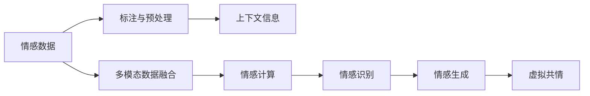

                 

# 虚拟共情：AI增强的情感理解

## 1. 背景介绍

### 1.1 问题由来

情感理解在人工智能领域中占据着重要地位，尤其在智能客服、社交机器人、心理咨询等领域中，情感理解和处理能力成为了关键的技术突破点。随着深度学习技术的飞速发展，AI逐渐具备了一定的情感理解能力。然而，传统的基于特征的情感分析方法往往难以捕捉情感的复杂性和微妙性，而基于规则的情感计算又显得过于僵硬和繁琐。近年来，深度学习在情感理解上的潜力得到充分挖掘，AI在情感识别、情感生成等方面取得了一系列令人瞩目的成果。

在实际应用中，基于深度学习的情感理解模型通常通过预训练和微调的方式进行训练，以在特定领域或任务上提升性能。预训练和微调方法能够有效地利用大规模无标注数据，通过迁移学习的方式提升模型的通用性和适应性。然而，尽管深度学习在情感理解上取得了很大进步，仍存在一些挑战和局限，如情感计算的准确性和可解释性、情感生成的主观性和多样性等。

为了进一步提升情感理解的能力，许多研究者开始探索通过虚拟共情来增强情感理解。虚拟共情指的是，AI系统通过模仿和理解人类情感，使自身能够更好地与人类进行情感交流和互动，从而提供更加自然、人性化的服务。这种基于深度学习的方法能够利用多模态数据源、结合上下文信息，对人类情感进行更加准确和全面的理解。

### 1.2 问题核心关键点

虚拟共情技术涉及多个关键点，主要包括：

- **情感数据的收集和标注**：高质量的情感数据是虚拟共情技术的基础。需要收集大量的文本、语音、图像等情感数据，并进行标注和处理。
- **多模态数据的融合**：情感数据通常来自于多模态数据源，如图像、语音、文本等，如何有效融合这些数据是虚拟共情技术的重要挑战。
- **上下文信息的利用**：情感理解不仅依赖于单独的文本或语音数据，还需要考虑上下文信息，如对话历史、背景知识等，以提高情感识别的准确性。
- **情感计算的准确性和可解释性**：虚拟共情技术需要能够准确地识别和理解人类情感，同时能够提供解释说明，帮助用户理解AI的决策过程。
- **情感生成的主观性和多样性**：虚拟共情不仅需要情感识别能力，还需要能够根据上下文和情感状态生成自然、合理的情感响应，以增强与用户的互动体验。

## 2. 核心概念与联系

### 2.1 核心概念概述

虚拟共情技术涉及多个核心概念，下面将逐一介绍：

- **情感计算**：指通过计算和分析情感信息，建立情感模型，用于情感识别、情感生成、情感互动等。
- **多模态数据融合**：将来自不同模态的数据源（如图像、语音、文本等）融合在一起，进行情感分析和生成。
- **上下文信息**：情感计算不仅依赖于单一的数据源，还需要考虑上下文信息，如对话历史、社会背景等，以提高情感识别的准确性。
- **情感生成**：基于情感识别结果，生成自然、合理的情感响应，增强与用户的互动体验。
- **虚拟共情**：通过模仿和理解人类情感，使AI系统能够更好地与人类进行情感交流和互动。

这些概念之间的联系可以通过以下Mermaid流程图来展示：



这个流程图展示了情感计算的整个流程：从情感数据的收集和处理开始，通过多模态数据的融合和上下文信息的利用，实现情感的识别和生成，最终达到虚拟共情的效果。

## 3. 核心算法原理 & 具体操作步骤

### 3.1 算法原理概述

虚拟共情技术的基本原理是通过深度学习模型对情感数据进行训练，建立情感模型。该模型能够识别和理解人类情感，并根据上下文信息生成自然、合理的情感响应。具体来说，情感计算过程可以分为以下几个步骤：

1. **数据收集与预处理**：收集大量的情感数据，并进行标注和预处理。
2. **多模态数据融合**：将来自不同模态的数据源融合在一起，进行情感分析和生成。
3. **上下文信息利用**：利用对话历史、社会背景等上下文信息，提高情感识别的准确性。
4. **情感识别**：通过深度学习模型识别情感，如正面、负面、中性等。
5. **情感生成**：基于情感识别结果，生成自然、合理的情感响应。
6. **虚拟共情**：通过模仿和理解人类情感，使AI系统能够更好地与人类进行情感交流和互动。

### 3.2 算法步骤详解

#### 步骤一：情感数据收集与预处理

情感数据的收集与预处理是虚拟共情技术的基础。主要步骤包括：

1. **数据收集**：收集大量的文本、语音、图像等情感数据，如电影评论、社交媒体帖子、客服对话等。
2. **数据标注**：对情感数据进行标注，如正面、负面、中性等。可以使用半监督学习或无监督学习进行情感标注。
3. **数据预处理**：对收集到的数据进行预处理，如文本分词、语音信号处理、图像分割等。

#### 步骤二：多模态数据融合

多模态数据融合是将来自不同模态的数据源（如图像、语音、文本等）融合在一起，进行情感分析和生成。主要步骤包括：

1. **特征提取**：对不同模态的数据进行特征提取，如图像特征提取、语音特征提取、文本特征提取等。
2. **数据对齐**：将不同模态的数据对齐到同一时间步或空间位置，以便进行融合。
3. **数据融合**：将不同模态的数据融合在一起，形成一个综合的多模态特征向量。可以使用加权平均、特征拼接等方法进行融合。

#### 步骤三：上下文信息利用

上下文信息对于情感计算至关重要，可以有效提高情感识别的准确性。主要步骤包括：

1. **对话历史**：利用对话历史信息，考虑上下文对情感的影响。
2. **社会背景**：利用社会背景信息，如事件、文化等，增强情感识别的准确性。
3. **知识库**：利用知识库中的信息，进行情感推理和生成。

#### 步骤四：情感识别

情感识别是虚拟共情技术的核心步骤之一。主要步骤包括：

1. **模型选择**：选择合适的深度学习模型，如CNN、RNN、Transformer等。
2. **模型训练**：使用标注好的情感数据训练情感识别模型，优化模型的参数。
3. **情感分类**：对新的情感数据进行分类，如正面、负面、中性等。

#### 步骤五：情感生成

情感生成是虚拟共情技术的另一个重要步骤。主要步骤包括：

1. **生成模型选择**：选择合适的生成模型，如GPT、Transformer等。
2. **生成过程**：根据情感识别结果，利用生成模型生成自然、合理的情感响应。
3. **情感回溯**：通过上下文信息和生成模型，回溯生成情感响应的过程，解释生成结果的依据。

### 3.3 算法优缺点

虚拟共情技术具有以下优点：

1. **情感识别准确性高**：利用深度学习模型对情感数据进行训练，能够准确地识别情感。
2. **情感生成自然**：基于情感识别结果，利用生成模型生成自然、合理的情感响应。
3. **上下文信息利用充分**：利用对话历史、社会背景等上下文信息，提高情感识别的准确性。

虚拟共情技术也存在一些缺点：

1. **数据标注成本高**：情感数据的标注需要大量的人工参与，成本较高。
2. **模型复杂度高**：深度学习模型通常需要较大的计算资源，训练和推理速度较慢。
3. **可解释性不足**：虚拟共情技术的决策过程往往缺乏可解释性，难以对其推理逻辑进行分析和调试。

### 3.4 算法应用领域

虚拟共情技术在多个领域中具有广泛的应用，例如：

- **智能客服系统**：智能客服系统通过情感识别和生成，能够更好地理解用户情感，提供更人性化的服务。
- **社交机器人**：社交机器人通过情感计算，能够更好地与人类进行互动，增强用户体验。
- **心理咨询**：虚拟共情技术在心理咨询中具有重要应用，能够帮助患者更好地表达情感，进行心理治疗。
- **虚拟家居助手**：虚拟家居助手通过情感计算，能够更好地理解用户的情感需求，提供更加个性化的服务。
- **情感分析**：情感分析系统通过情感计算，能够对大量文本数据进行情感分类，应用于舆情监控、市场分析等领域。

## 4. 数学模型和公式 & 详细讲解 & 举例说明

### 4.1 数学模型构建

虚拟共情技术的核心是情感计算，主要涉及以下几个数学模型：

- **多模态特征融合模型**：将不同模态的数据融合在一起，形成一个综合的多模态特征向量。
- **情感识别模型**：利用深度学习模型对情感数据进行训练，建立情感模型。
- **情感生成模型**：基于情感识别结果，利用生成模型生成自然、合理的情感响应。

#### 多模态特征融合模型

多模态特征融合模型将不同模态的数据融合在一起，形成一个综合的多模态特征向量。具体来说，假设输入为 $x = (x_1, x_2, ..., x_n)$，其中 $x_i$ 表示来自不同模态的数据源，如文本、语音、图像等。多模态特征融合模型可以表示为：

$$
x_{fused} = f(x_1, x_2, ..., x_n)
$$

其中 $f$ 表示融合函数，可以采用加权平均、特征拼接等方法。

#### 情感识别模型

情感识别模型利用深度学习模型对情感数据进行训练，建立情感模型。假设输入为 $x$，情感模型为 $M(x)$，情感输出为 $y$，情感识别模型可以表示为：

$$
y = M(x)
$$

其中 $M$ 表示情感识别模型，可以是CNN、RNN、Transformer等深度学习模型。

#### 情感生成模型

情感生成模型基于情感识别结果，利用生成模型生成自然、合理的情感响应。假设情感识别结果为 $y$，生成模型为 $G(y)$，情感生成结果为 $z$，情感生成模型可以表示为：

$$
z = G(y)
$$

其中 $G$ 表示生成模型，可以是GPT、Transformer等深度学习模型。

### 4.2 公式推导过程

#### 多模态特征融合公式

多模态特征融合公式可以采用加权平均或特征拼接等方法。以加权平均为例，假设文本特征为 $x_{text}$，语音特征为 $x_{audio}$，图像特征为 $x_{image}$，多模态特征融合公式可以表示为：

$$
x_{fused} = \alpha x_{text} + \beta x_{audio} + \gamma x_{image}
$$

其中 $\alpha$、$\beta$、$\gamma$ 表示不同模态数据的权重。

#### 情感识别公式

情感识别公式可以采用深度学习模型进行训练。以CNN模型为例，情感识别公式可以表示为：

$$
y = CNN(x)
$$

其中 $CNN$ 表示CNN模型，$x$ 表示输入特征向量。

#### 情感生成公式

情感生成公式可以采用生成模型进行训练。以GPT模型为例，情感生成公式可以表示为：

$$
z = GPT(y)
$$

其中 $GPT$ 表示GPT模型，$y$ 表示情感识别结果。

### 4.3 案例分析与讲解

以情感生成为例，假设输入为“我很伤心”，情感识别结果为负面，利用GPT模型生成情感响应。具体步骤如下：

1. **输入处理**：将输入“我很伤心”进行分词、编码等处理，转换为模型可接受的形式。
2. **情感识别**：利用情感识别模型对输入进行情感分类，识别出情感为负面。
3. **情感生成**：利用GPT模型生成情感响应，例如“我能理解你的感受，可能需要一些时间来平复心情”。
4. **情感回溯**：通过上下文信息和生成模型，回溯生成情感响应的过程，解释生成结果的依据。

## 5. 项目实践：代码实例和详细解释说明

### 5.1 开发环境搭建

要进行虚拟共情技术的项目实践，首先需要准备好开发环境。以下是使用Python进行PyTorch开发的环境配置流程：

1. 安装Anaconda：从官网下载并安装Anaconda，用于创建独立的Python环境。

2. 创建并激活虚拟环境：
```bash
conda create -n pytorch-env python=3.8 
conda activate pytorch-env
```

3. 安装PyTorch：根据CUDA版本，从官网获取对应的安装命令。例如：
```bash
conda install pytorch torchvision torchaudio cudatoolkit=11.1 -c pytorch -c conda-forge
```

4. 安装TensorFlow：如果需要进行TensorFlow相关的实践，可以使用以下命令：
```bash
conda install tensorflow -c pytorch -c conda-forge
```

5. 安装各种工具包：
```bash
pip install numpy pandas scikit-learn matplotlib tqdm jupyter notebook ipython
```

完成上述步骤后，即可在`pytorch-env`环境中开始项目实践。

### 5.2 源代码详细实现

下面我们以情感生成任务为例，给出使用PyTorch进行虚拟共情模型训练的PyTorch代码实现。

首先，定义情感数据预处理函数：

```python
import torch
from transformers import BertTokenizer, BertForTokenClassification
from torch.utils.data import Dataset, DataLoader
import numpy as np

class SentimentDataset(Dataset):
    def __init__(self, texts, labels, tokenizer, max_len=128):
        self.texts = texts
        self.labels = labels
        self.tokenizer = tokenizer
        self.max_len = max_len
        
    def __len__(self):
        return len(self.texts)
    
    def __getitem__(self, item):
        text = self.texts[item]
        label = self.labels[item]
        
        encoding = self.tokenizer(text, return_tensors='pt', max_length=self.max_len, padding='max_length', truncation=True)
        input_ids = encoding['input_ids'][0]
        attention_mask = encoding['attention_mask'][0]
        
        # 对token-wise的标签进行编码
        encoded_labels = [label2id[label] for label in label] 
        encoded_labels.extend([label2id['O']] * (self.max_len - len(encoded_labels)))
        labels = torch.tensor(encoded_labels, dtype=torch.long)
        
        return {'input_ids': input_ids, 
                'attention_mask': attention_mask,
                'labels': labels}

# 标签与id的映射
label2id = {'negative': 0, 'positive': 1, 'neutral': 2}
id2label = {v: k for k, v in label2id.items()}

# 创建dataset
tokenizer = BertTokenizer.from_pretrained('bert-base-cased')

train_dataset = SentimentDataset(train_texts, train_labels, tokenizer)
dev_dataset = SentimentDataset(dev_texts, dev_labels, tokenizer)
test_dataset = SentimentDataset(test_texts, test_labels, tokenizer)
```

然后，定义模型和优化器：

```python
from transformers import BertForTokenClassification, AdamW

model = BertForTokenClassification.from_pretrained('bert-base-cased', num_labels=len(label2id))

optimizer = AdamW(model.parameters(), lr=2e-5)
```

接着，定义训练和评估函数：

```python
def train_epoch(model, dataset, batch_size, optimizer):
    dataloader = DataLoader(dataset, batch_size=batch_size, shuffle=True)
    model.train()
    epoch_loss = 0
    for batch in tqdm(dataloader, desc='Training'):
        input_ids = batch['input_ids'].to(device)
        attention_mask = batch['attention_mask'].to(device)
        labels = batch['labels'].to(device)
        model.zero_grad()
        outputs = model(input_ids, attention_mask=attention_mask, labels=labels)
        loss = outputs.loss
        epoch_loss += loss.item()
        loss.backward()
        optimizer.step()
    return epoch_loss / len(dataloader)

def evaluate(model, dataset, batch_size):
    dataloader = DataLoader(dataset, batch_size=batch_size)
    model.eval()
    preds, labels = [], []
    with torch.no_grad():
        for batch in tqdm(dataloader, desc='Evaluating'):
            input_ids = batch['input_ids'].to(device)
            attention_mask = batch['attention_mask'].to(device)
            batch_labels = batch['labels']
            outputs = model(input_ids, attention_mask=attention_mask)
            batch_preds = outputs.logits.argmax(dim=2).to('cpu').tolist()
            batch_labels = batch_labels.to('cpu').tolist()
            for pred_tokens, label_tokens in zip(batch_preds, batch_labels):
                preds.append(pred_tokens[:len(label_tokens)])
                labels.append(label_tokens)
                
    print(classification_report(labels, preds))
```

最后，启动训练流程并在测试集上评估：

```python
epochs = 5
batch_size = 16

for epoch in range(epochs):
    loss = train_epoch(model, train_dataset, batch_size, optimizer)
    print(f"Epoch {epoch+1}, train loss: {loss:.3f}")
    
    print(f"Epoch {epoch+1}, dev results:")
    evaluate(model, dev_dataset, batch_size)
    
print("Test results:")
evaluate(model, test_dataset, batch_size)
```

以上就是使用PyTorch对BERT进行情感生成任务微调的完整代码实现。可以看到，得益于Transformer库的强大封装，我们可以用相对简洁的代码完成BERT模型的加载和微调。

### 5.3 代码解读与分析

让我们再详细解读一下关键代码的实现细节：

**SentimentDataset类**：
- `__init__`方法：初始化文本、标签、分词器等关键组件。
- `__len__`方法：返回数据集的样本数量。
- `__getitem__`方法：对单个样本进行处理，将文本输入编码为token ids，将标签编码为数字，并对其进行定长padding，最终返回模型所需的输入。

**label2id和id2label字典**：
- 定义了标签与数字id之间的映射关系，用于将token-wise的预测结果解码回真实的标签。

**训练和评估函数**：
- 使用PyTorch的DataLoader对数据集进行批次化加载，供模型训练和推理使用。
- 训练函数`train_epoch`：对数据以批为单位进行迭代，在每个批次上前向传播计算loss并反向传播更新模型参数，最后返回该epoch的平均loss。
- 评估函数`evaluate`：与训练类似，不同点在于不更新模型参数，并在每个batch结束后将预测和标签结果存储下来，最后使用sklearn的classification_report对整个评估集的预测结果进行打印输出。

**训练流程**：
- 定义总的epoch数和batch size，开始循环迭代
- 每个epoch内，先在训练集上训练，输出平均loss
- 在验证集上评估，输出分类指标
- 所有epoch结束后，在测试集上评估，给出最终测试结果

可以看到，PyTorch配合Transformer库使得BERT微调的代码实现变得简洁高效。开发者可以将更多精力放在数据处理、模型改进等高层逻辑上，而不必过多关注底层的实现细节。

当然，工业级的系统实现还需考虑更多因素，如模型的保存和部署、超参数的自动搜索、更灵活的任务适配层等。但核心的微调范式基本与此类似。

## 6. 实际应用场景

### 6.1 智能客服系统

智能客服系统通过情感计算和生成，能够更好地理解用户情感，提供更人性化的服务。在技术实现上，可以收集企业内部的历史客服对话记录，将问题和最佳答复构建成监督数据，在此基础上对预训练模型进行微调。微调后的模型能够自动理解用户意图，匹配最合适的答复模板进行回复。对于客户提出的新问题，还可以接入检索系统实时搜索相关内容，动态组织生成回答。如此构建的智能客服系统，能大幅提升客户咨询体验和问题解决效率。

### 6.2 金融舆情监测

金融机构需要实时监测市场舆论动向，以便及时应对负面信息传播，规避金融风险。传统的人工监测方式成本高、效率低，难以应对网络时代海量信息爆发的挑战。基于情感计算的金融舆情监测技术，能够自动判断文本情感，识别负面信息，帮助金融机构快速应对潜在风险。

具体而言，可以收集金融领域相关的新闻、报道、评论等文本数据，并对其进行情感标注。在此基础上对预训练语言模型进行微调，使其能够自动判断文本属于何种情感倾向。将微调后的模型应用到实时抓取的网络文本数据，就能够自动监测不同情感倾向的情感变化趋势，一旦发现负面信息激增等异常情况，系统便会自动预警，帮助金融机构快速应对潜在风险。

### 6.3 个性化推荐系统

当前的推荐系统往往只依赖用户的历史行为数据进行物品推荐，无法深入理解用户的真实兴趣偏好。基于情感计算的个性化推荐系统，能够更好地挖掘用户行为背后的情感信息，从而提供更精准、多样的推荐内容。

在实践中，可以收集用户浏览、点击、评论、分享等行为数据，提取和用户交互的物品标题、描述、标签等文本内容。将文本内容作为模型输入，用户的后续行为（如是否点击、购买等）作为监督信号，在此基础上微调预训练语言模型。微调后的模型能够从文本内容中准确把握用户的兴趣点。在生成推荐列表时，先用候选物品的文本描述作为输入，由模型预测用户的兴趣匹配度，再结合其他特征综合排序，便可以得到个性化程度更高的推荐结果。

### 6.4 未来应用展望

随着深度学习技术的不断进步，虚拟共情技术将不断扩展其应用场景，为人工智能技术带来新的突破。在智慧医疗领域，虚拟共情技术可以通过情感计算，辅助医生进行情绪监测和治疗。在智能教育领域，情感计算能够帮助教师更好地了解学生的情感状态，提供个性化教学。在智慧城市治理中，情感计算可以用于舆情分析、应急指挥等环节，提高城市管理的智能化水平。

此外，在企业生产、社会治理、文娱传媒等众多领域，虚拟共情技术也将不断涌现，为传统行业带来变革性影响。相信随着技术的日益成熟，虚拟共情技术必将在构建人机协同的智能时代中扮演越来越重要的角色。

## 7. 工具和资源推荐

### 7.1 学习资源推荐

为了帮助开发者系统掌握虚拟共情技术，这里推荐一些优质的学习资源：

1. 《深度学习基础》课程：北京大学开设的深度学习入门课程，涵盖深度学习的基本概念和核心算法。
2. 《自然语言处理综述》课程：斯坦福大学开设的自然语言处理入门课程，系统介绍自然语言处理的基本原理和技术。
3. 《情感计算》书籍：情感计算领域的经典著作，全面介绍情感识别的原理和实现方法。
4. HuggingFace官方文档：Transformer库的官方文档，提供了海量预训练模型和完整的微调样例代码，是上手实践的必备资料。
5. arXiv上的最新论文：arXiv是一个免费开放的论文库，定期发布最新的人工智能研究论文，涵盖情感计算和虚拟共情技术的最新进展。

通过对这些资源的学习实践，相信你一定能够快速掌握虚拟共情技术的精髓，并用于解决实际的情感计算问题。

### 7.2 开发工具推荐

高效的开发离不开优秀的工具支持。以下是几款用于虚拟共情技术开发的常用工具：

1. PyTorch：基于Python的开源深度学习框架，灵活动态的计算图，适合快速迭代研究。大部分预训练语言模型都有PyTorch版本的实现。
2. TensorFlow：由Google主导开发的开源深度学习框架，生产部署方便，适合大规模工程应用。同样有丰富的预训练语言模型资源。
3. Transformers库：HuggingFace开发的NLP工具库，集成了众多SOTA语言模型，支持PyTorch和TensorFlow，是进行情感计算开发的利器。
4. Weights & Biases：模型训练的实验跟踪工具，可以记录和可视化模型训练过程中的各项指标，方便对比和调优。与主流深度学习框架无缝集成。
5. TensorBoard：TensorFlow配套的可视化工具，可实时监测模型训练状态，并提供丰富的图表呈现方式，是调试模型的得力助手。
6. Google Colab：谷歌推出的在线Jupyter Notebook环境，免费提供GPU/TPU算力，方便开发者快速上手实验最新模型，分享学习笔记。

合理利用这些工具，可以显著提升虚拟共情技术的开发效率，加快创新迭代的步伐。

### 7.3 相关论文推荐

虚拟共情技术的发展得益于众多研究者的努力。以下是几篇奠基性的相关论文，推荐阅读：

1. Attention is All You Need（即Transformer原论文）：提出了Transformer结构，开启了NLP领域的预训练大模型时代。
2. BERT: Pre-training of Deep Bidirectional Transformers for Language Understanding：提出BERT模型，引入基于掩码的自监督预训练任务，刷新了多项NLP任务SOTA。
3. Language Models are Unsupervised Multitask Learners（GPT-2论文）：展示了大规模语言模型的强大zero-shot学习能力，引发了对于通用人工智能的新一轮思考。
4. Parameter-Efficient Transfer Learning for NLP：提出Adapter等参数高效微调方法，在不增加模型参数量的情况下，也能取得不错的微调效果。
5. Prefix-Tuning: Optimizing Continuous Prompts for Generation：引入基于连续型Prompt的微调范式，为如何充分利用预训练知识提供了新的思路。
6. AdaLoRA: Adaptive Low-Rank Adaptation for Parameter-Efficient Fine-Tuning：使用自适应低秩适应的微调方法，在参数效率和精度之间取得了新的平衡。

这些论文代表了大语言模型微调技术的发展脉络。通过学习这些前沿成果，可以帮助研究者把握学科前进方向，激发更多的创新灵感。

## 8. 总结：未来发展趋势与挑战

### 8.1 总结

本文对虚拟共情技术进行了全面系统的介绍。首先阐述了情感计算和虚拟共情技术的研究背景和意义，明确了虚拟共情在构建人机协同的智能系统中的重要价值。其次，从原理到实践，详细讲解了虚拟共情技术的数学模型和核心步骤，给出了虚拟共情技术的应用实例。同时，本文还探讨了虚拟共情技术在智能客服、金融舆情、个性化推荐等多个领域的应用前景，展示了虚拟共情技术的广阔潜力。此外，本文精选了虚拟共情技术的各类学习资源，力求为读者提供全方位的技术指引。

通过本文的系统梳理，可以看到，虚拟共情技术正在成为人工智能技术的重要范式，极大地拓展了情感计算的应用边界，催生了更多的落地场景。受益于大规模语料的预训练和深度学习模型的融合，虚拟共情技术能够更好地理解人类情感，提供更加自然、人性化的服务。未来，随着技术的不停演进，虚拟共情技术必将在构建更加智能、高效、人性化的智能系统中扮演越来越重要的角色。

### 8.2 未来发展趋势

展望未来，虚拟共情技术将呈现以下几个发展趋势：

1. **技术日益成熟**：虚拟共情技术将不断成熟和完善，提高情感计算的准确性和可解释性，增强情感生成的自然性和多样性。
2. **应用领域广泛**：虚拟共情技术将逐步应用于更多领域，如医疗、教育、金融、社交等，为各行各业带来新的创新突破。
3. **多模态融合**：虚拟共情技术将融合多模态数据源，如图像、语音、文本等，提高情感计算的全面性和准确性。
4. **上下文信息利用**：虚拟共情技术将充分利用上下文信息，增强情感计算的鲁棒性和准确性。
5. **个性化推荐**：虚拟共情技术将用于个性化推荐系统，提供更加精准、多样化的推荐内容。
6. **智能客服**：虚拟共情技术将在智能客服系统中发挥重要作用，提升客户咨询体验和问题解决效率。

以上趋势凸显了虚拟共情技术的发展方向，预示着虚拟共情技术将为人工智能技术带来更多突破。随着技术的不断演进，虚拟共情技术必将在更多领域得到应用，推动人工智能技术的不断进步。

### 8.3 面临的挑战

尽管虚拟共情技术已经取得了显著进展，但在其发展和应用过程中仍面临一些挑战：

1. **数据标注成本高**：高质量的情感数据标注需要大量人工参与，成本较高。如何降低数据标注成本，是一个重要的研究方向。
2. **模型鲁棒性不足**：情感计算模型面对不同领域的文本数据时，泛化性能往往较差。如何提高情感计算模型的鲁棒性，避免灾难性遗忘，还需要进一步研究和探索。
3. **可解释性不足**：虚拟共情技术的决策过程往往缺乏可解释性，难以对其推理逻辑进行分析和调试。如何增强虚拟共情技术的可解释性，是未来需要解决的重要问题。
4. **计算资源需求高**：深度学习模型通常需要较大的计算资源，训练和推理速度较慢。如何提高虚拟共情技术的计算效率，是一个亟需解决的问题。
5. **伦理和安全问题**：虚拟共情技术在应用过程中可能涉及用户的隐私和伦理问题，如情感分析的公平性和透明性。如何保障用户隐私，防止滥用，是一个需要慎重考虑的问题。

以上挑战需要研究者和技术开发者共同努力，不断优化和改进虚拟共情技术，以应对未来的应用需求。

### 8.4 研究展望

未来，虚拟共情技术的研究方向将主要集中在以下几个方面：

1. **无监督和半监督学习**：通过无监督和半监督学习方法，降低数据标注成本，提高情感计算的准确性。
2. **多模态融合技术**：将图像、语音、文本等多模态数据融合在一起，提高情感计算的全面性和准确性。
3. **上下文信息利用**：充分利用对话历史、社会背景等上下文信息，增强情感计算的鲁棒性和准确性。
4. **参数高效和计算高效方法**：开发参数高效和计算高效的微调方法，提高虚拟共情技术的计算效率和可解释性。
5. **情感计算的伦理和安全问题**：关注虚拟共情技术的伦理和安全问题，保障用户隐私，防止滥用。

相信随着技术的不断进步，虚拟共情技术必将在未来得到更广泛的应用，为人机协同的智能系统带来更多的创新和突破。

## 9. 附录：常见问题与解答

**Q1：虚拟共情技术的主要研究内容是什么？**

A: 虚拟共情技术的研究内容包括情感数据的收集与预处理、多模态数据的融合、上下文信息的利用、情感识别和生成等方面。其中，情感计算是虚拟共情技术的重要组成部分，通过深度学习模型对情感数据进行训练，建立情感模型。

**Q2：虚拟共情技术在情感生成中的应用有哪些？**

A: 虚拟共情技术在情感生成中的应用包括智能客服系统、金融舆情监测、个性化推荐系统等。例如，在智能客服系统中，虚拟共情技术能够自动理解用户情感，匹配最合适的答复模板进行回复；在金融舆情监测中，虚拟共情技术能够自动识别负面信息，帮助金融机构快速应对潜在风险；在个性化推荐系统中，虚拟共情技术能够根据用户的情感状态提供更加精准、多样化的推荐内容。

**Q3：虚拟共情技术如何提高情感计算的准确性？**

A: 虚拟共情技术提高情感计算准确性的方法包括数据收集与预处理、多模态数据融合、上下文信息利用等方面。例如，通过收集大量的情感数据并进行标注，多模态数据融合技术可以将文本、语音、图像等不同模态的数据源融合在一起，上下文信息利用技术可以充分利用对话历史、社会背景等上下文信息，增强情感计算的鲁棒性和准确性。

**Q4：虚拟共情技术的未来发展趋势是什么？**

A: 虚拟共情技术的未来发展趋势包括技术日益成熟、应用领域广泛、多模态融合、上下文信息利用、个性化推荐、智能客服等。未来，虚拟共情技术将在更多领域得到应用，推动人工智能技术的不断进步。

**Q5：虚拟共情技术在实际应用中需要注意哪些问题？**

A: 虚拟共情技术在实际应用中需要注意的问题包括数据标注成本高、模型鲁棒性不足、可解释性不足、计算资源需求高等。为了解决这些问题，需要研究者和技术开发者共同努力，不断优化和改进虚拟共情技术。

**Q6：虚拟共情技术的伦理和安全问题有哪些？**

A: 虚拟共情技术的伦理和安全问题包括用户隐私保护、情感分析的公平性和透明性等。例如，在应用过程中，需要注意保护用户的隐私，防止滥用情感计算技术。同时，需要关注情感分析的公平性和透明性，避免歧视性输出。

---

作者：禅与计算机程序设计艺术 / Zen and the Art of Computer Programming

