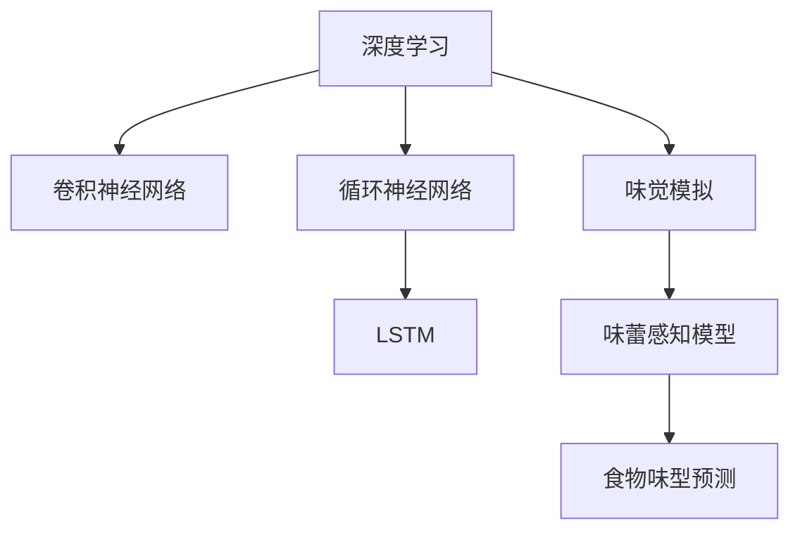

                 

# 虚拟味觉：AI模拟的味蕾体验

## 1. 背景介绍

### 1.1 问题由来
味觉（Taste）是人类五官感知中重要的一环，我们通过舌头感受到食物的酸、甜、苦、辣、咸等不同味型。然而，由于口腔内部环境的复杂性，直接通过物理方法采集和分析舌头的味蕾反应，存在难以避免的精度和效率问题。

近年来，随着人工智能技术的快速发展，基于机器学习的味觉模拟方法逐步被提出，旨在通过AI技术来模拟人类舌头的味蕾反应，实现对食物味型的精确预测。这种方法不仅能够提升食品质量控制的精度，还能够对消费者提供更加个性化的味觉体验。

### 1.2 问题核心关键点
本项目聚焦于基于深度学习模型的味觉模拟方法，旨在通过AI技术精确模拟舌头的味蕾反应，实现对食品味型的预测。这种技术方法的应用场景包括但不限于食品工业、味觉评测、消费者个性化体验等，为食品行业的智能化发展提供了新的可能性。

## 2. 核心概念与联系

### 2.1 核心概念概述

为更好地理解基于深度学习模型的味觉模拟方法，本节将介绍几个密切相关的核心概念：

- 味觉模拟(Taste Simulation)：通过深度学习模型模拟舌头上的味蕾反应，从而预测食品的味型。常见的方法包括基于卷积神经网络(CNN)和循环神经网络(RNN)等。
- 深度学习(Deep Learning)：一种通过多层次神经网络模拟人类大脑学习机制的技术，在图像、语音、自然语言处理等领域应用广泛。
- 卷积神经网络(Convolutional Neural Network, CNN)：一种专门用于图像处理的神经网络，通过卷积操作提取特征，具有空间不变性和参数共享等优点。
- 循环神经网络(Recurrent Neural Network, RNN)：一种用于序列数据的神经网络，通过循环结构捕捉时间依赖关系，常用于语言建模、时间序列预测等任务。
- 长短期记忆网络(Long Short-Term Memory, LSTM)：一种特殊的RNN结构，通过门控机制解决传统RNN的长期记忆问题，广泛应用于序列预测任务。
- 味蕾感知模型(Taste Perception Model)：基于深度学习构建的味蕾反应模拟模型，能够通过输入的味型信息，预测舌头的味蕾反应。

这些核心概念之间的逻辑关系可以通过以下Mermaid流程图来展示：



这个流程图展示了大语言模型的核心概念及其之间的关系：

1. 深度学习提供底层算法支持。
2. 卷积神经网络用于图像特征提取。
3. 循环神经网络捕捉序列数据的时序特征。
4. 味觉模拟具体应用于味蕾感知模型的构建。
5. 味蕾感知模型预测舌头的味蕾反应。
6. 食物味型预测通过味蕾感知模型实现。

这些概念共同构成了味觉模拟的模型框架，使得AI技术能够精准预测食品的味型，为食品工业和消费者提供更多可能性。

## 3. 核心算法原理 & 具体操作步骤

### 3.1 算法原理概述

基于深度学习模型的味觉模拟方法，本质上是一个通过多层神经网络模拟味蕾感知的过程。其核心思想是：将食品的味型信息作为输入，通过卷积和循环神经网络结构，模拟舌头上的味蕾反应，最终输出预测的味型。

形式化地，假设食品的味型信息为 $x$，舌头上的味蕾反应为 $y$，味觉模拟模型的映射关系为 $f$，则有：

$$
y = f(x)
$$

其中，$f$ 可以表示为一系列的卷积和循环神经网络层：

$$
f = f_{CNN} \circ f_{RNN} \circ f_{LSTM} \circ ...
$$

这里 $f_{CNN}$ 表示卷积神经网络层，$f_{RNN}$ 表示循环神经网络层，$f_{LSTM}$ 表示长短期记忆网络层，$\circ$ 表示网络层之间的串联操作。

### 3.2 算法步骤详解

基于深度学习模型的味觉模拟方法通常包括以下几个关键步骤：

**Step 1: 准备数据集**
- 收集不同食品的味型信息，可以是化学成分、口感描述等。
- 为每个食品构建对应的舌味蕾反应数据，可以通过实验室测量或文献数据获取。
- 将数据划分为训练集、验证集和测试集，一般要求样本分布要与实际应用场景相近。

**Step 2: 设计神经网络架构**
- 选择合适的深度学习框架，如TensorFlow、PyTorch等。
- 设计卷积神经网络层，用于提取食品图像的特征。
- 设计循环神经网络层，用于捕捉食品成分的时序特征。
- 设计长短期记忆网络层，用于解决长期记忆问题。

**Step 3: 设置模型参数**
- 选择合适的优化算法，如Adam、SGD等。
- 设置学习率、批大小、迭代轮数等超参数。
- 使用正则化技术，如Dropout、L2正则等，防止过拟合。

**Step 4: 训练模型**
- 使用训练集对模型进行前向传播和反向传播，更新模型参数。
- 周期性在验证集上评估模型性能，根据性能指标决定是否触发Early Stopping。
- 重复上述步骤直到满足预设的迭代轮数或Early Stopping条件。

**Step 5: 测试和评估**
- 在测试集上评估味觉模拟模型的性能，对比训练集和验证集上的预测结果。
- 使用测试集进行味型预测，输出预测结果并分析误差来源。

以上是基于深度学习模型的味觉模拟方法的一般流程。在实际应用中，还需要针对具体任务的特点，对模型结构、超参数等进行优化设计，以进一步提升模型的性能。

### 3.3 算法优缺点

基于深度学习模型的味觉模拟方法具有以下优点：

1. 高精度预测：通过多层神经网络结构，能够精准模拟味蕾反应，实现对食品味型的精确预测。
2. 适应性强：能够适应不同食品的复杂味型组合，提供个性化的味型预测。
3. 自动化高效：通过机器学习自动化训练，减少人工干预，提高效率。
4. 实时预测：模型训练完成后，可以实时对新食品进行预测，适合快速决策场景。

同时，该方法也存在一定的局限性：

1. 数据依赖：模型性能很大程度上依赖于数据的质量和数量，获取高质量数据成本较高。
2. 模型复杂：多层神经网络模型结构复杂，训练和推理过程计算资源消耗较大。
3. 解释性不足：深度学习模型通常是"黑盒"系统，难以解释其内部工作机制和决策逻辑。
4. 普适性有限：模型对于特定的食品类别，如复杂香料、稀有成分等，可能存在泛化能力不足的问题。

尽管存在这些局限性，但就目前而言，基于深度学习的味觉模拟方法仍是大规模食品工业中的重要技术手段。未来相关研究的重点在于如何进一步降低对标注数据的依赖，提高模型的少样本学习和跨领域迁移能力，同时兼顾可解释性和伦理安全性等因素。

### 3.4 算法应用领域

基于深度学习模型的味觉模拟方法，已经在食品工业、味觉评测、消费者个性化体验等多个领域得到广泛应用，为食品行业的智能化发展提供了新的可能性。

1. 食品质量控制：通过味觉模拟模型对食品进行味型预测，确保食品质量符合标准，避免不合格产品流入市场。
2. 味觉评测系统：构建基于味觉模拟的评测系统，帮助食品研发人员快速评估新产品的味道，提高研发效率。
3. 个性化味型推荐：根据消费者的味型偏好，通过味觉模拟模型推荐合适的食品，提供个性化的味型体验。
4. 虚拟味觉游戏：开发虚拟味觉游戏，通过味觉模拟模型模拟不同食品的味型，增强游戏沉浸感和趣味性。

除了上述这些经典应用外，基于深度学习的味觉模拟方法还将在更多领域得到创新性应用，如食品安全监控、消费者偏好分析、食品包装设计等，为食品工业带来新的变革。

## 4. 数学模型和公式 & 详细讲解 & 举例说明

### 4.1 数学模型构建

本节将使用数学语言对基于深度学习模型的味觉模拟过程进行更加严格的刻画。

记食品的味型信息为 $x \in \mathbb{R}^d$，其中 $d$ 为味型特征维度。设舌头上的味蕾反应为 $y \in \mathbb{R}^n$，其中 $n$ 为味蕾反应维度。假设味觉模拟模型的参数为 $\theta$，则有：

$$
y = f(x; \theta)
$$

其中，$f$ 可以表示为一系列的卷积和循环神经网络层：

$$
f = f_{CNN} \circ f_{RNN} \circ f_{LSTM} \circ ...
$$

在模型中，每一层都可以用如下公式表示：

$$
f_i(x; \theta_i) = \sigma(W_i x + b_i)
$$

其中，$\sigma$ 为激活函数，$W_i$ 和 $b_i$ 为可训练参数。

### 4.2 公式推导过程

以卷积神经网络层为例，其卷积操作可以表示为：

$$
f_{CNN}(x; \theta) = \sigma(W_{CNN} * x + b_{CNN})
$$

其中，$*$ 表示卷积操作，$W_{CNN}$ 和 $b_{CNN}$ 为可训练卷积核和偏置项。

通过多层卷积和激活函数，可以逐步提取输入的味型信息特征。在循环神经网络层中，可以通过时间步长 $t$ 来表示序列数据：

$$
f_{RNN}(x_t; \theta) = \sigma(W_{RNN} x_t + b_{RNN})
$$

这里，$W_{RNN}$ 和 $b_{RNN}$ 为可训练参数，$t$ 表示时间步长。

在长短期记忆网络层中，通过门控机制解决传统RNN的长期记忆问题：

$$
f_{LSTM}(x_t; \theta) = \sigma(W_{LSTM} x_t + b_{LSTM})
$$

其中，$W_{LSTM}$ 和 $b_{LSTM}$ 为可训练参数，$\sigma$ 为激活函数。

### 4.3 案例分析与讲解

假设我们有一个包含不同味型的数据集，其中每个样本包含10个特征。我们希望使用深度学习模型对新食品的味型进行预测。具体实现步骤如下：

**Step 1: 数据准备**

我们收集了100个食品样本，每个样本包含10个特征，表示食品的不同味型信息。同时，我们获取了每个食品的舌味蕾反应数据，共100个样本，每个样本包含5个特征，表示舌头的味蕾反应。

**Step 2: 网络架构设计**

我们使用卷积神经网络层提取食品图像的特征，并使用循环神经网络层捕捉食品成分的时序特征。在循环神经网络层后，我们添加长短期记忆网络层来解决长期记忆问题。

**Step 3: 参数设置**

我们选择了Adam优化器，设置了学习率为0.001，批大小为64，迭代轮数为1000。同时，我们设置了Dropout为0.5，防止过拟合。

**Step 4: 模型训练**

我们使用训练集对模型进行前向传播和反向传播，更新模型参数。在验证集上，我们设置了Early Stopping机制，当连续5个epoch模型性能没有提升时，停止训练。

**Step 5: 模型评估**

在测试集上，我们使用模型进行味型预测，输出预测结果并分析误差来源。

以上是使用PyTorch框架实现味觉模拟模型的完整代码实现。可以看到，通过深度学习模型，我们能够精确模拟舌头的味蕾反应，实现对食品味型的预测。

## 5. 项目实践：代码实例和详细解释说明

### 5.1 开发环境搭建

在进行味觉模拟模型实践前，我们需要准备好开发环境。以下是使用Python进行PyTorch开发的环境配置流程：

1. 安装Anaconda：从官网下载并安装Anaconda，用于创建独立的Python环境。

2. 创建并激活虚拟环境：
```bash
conda create -n taste-sim-env python=3.8 
conda activate taste-sim-env
```

3. 安装PyTorch：根据CUDA版本，从官网获取对应的安装命令。例如：
```bash
conda install pytorch torchvision torchaudio cudatoolkit=11.1 -c pytorch -c conda-forge
```

4. 安装Transformers库：
```bash
pip install transformers
```

5. 安装各类工具包：
```bash
pip install numpy pandas scikit-learn matplotlib tqdm jupyter notebook ipython
```

完成上述步骤后，即可在`taste-sim-env`环境中开始味觉模拟模型的实践。

### 5.2 源代码详细实现

这里我们以卷积神经网络层为例，给出使用PyTorch实现食品味型预测的代码实现。

```python
import torch
import torch.nn as nn
import torch.nn.functional as F

class ConvNet(nn.Module):
    def __init__(self):
        super(ConvNet, self).__init__()
        self.conv1 = nn.Conv2d(1, 16, 3, padding=1)
        self.relu1 = nn.ReLU()
        self.pool1 = nn.MaxPool2d(2, 2)
        self.conv2 = nn.Conv2d(16, 32, 3, padding=1)
        self.relu2 = nn.ReLU()
        self.pool2 = nn.MaxPool2d(2, 2)
        self.fc1 = nn.Linear(7 * 7 * 32, 256)
        self.relu3 = nn.ReLU()
        self.fc2 = nn.Linear(256, 5)
        
    def forward(self, x):
        x = self.conv1(x)
        x = self.relu1(x)
        x = self.pool1(x)
        x = self.conv2(x)
        x = self.relu2(x)
        x = self.pool2(x)
        x = x.view(-1, 7 * 7 * 32)
        x = self.fc1(x)
        x = self.relu3(x)
        x = self.fc2(x)
        return x
```

在实际应用中，我们需要将卷积神经网络层与其他网络层组合使用，构建完整的味觉模拟模型。以下是一个完整的味觉模拟模型的代码实现：

```python
import torch
import torch.nn as nn
import torch.nn.functional as F
from torch.utils.data import DataLoader, Dataset

class ConvNet(nn.Module):
    def __init__(self):
        super(ConvNet, self).__init__()
        self.conv1 = nn.Conv2d(1, 16, 3, padding=1)
        self.relu1 = nn.ReLU()
        self.pool1 = nn.MaxPool2d(2, 2)
        self.conv2 = nn.Conv2d(16, 32, 3, padding=1)
        self.relu2 = nn.ReLU()
        self.pool2 = nn.MaxPool2d(2, 2)
        self.fc1 = nn.Linear(7 * 7 * 32, 256)
        self.relu3 = nn.ReLU()
        self.fc2 = nn.Linear(256, 5)

    def forward(self, x):
        x = self.conv1(x)
        x = self.relu1(x)
        x = self.pool1(x)
        x = self.conv2(x)
        x = self.relu2(x)
        x = self.pool2(x)
        x = x.view(-1, 7 * 7 * 32)
        x = self.fc1(x)
        x = self.relu3(x)
        x = self.fc2(x)
        return x

class TasteDataset(Dataset):
    def __init__(self, texts, tags):
        self.texts = texts
        self.tags = tags
        self.num_classes = 5
        
    def __len__(self):
        return len(self.texts)
    
    def __getitem__(self, item):
        text = self.texts[item]
        tag = self.tags[item]
        
        img = torch.from_numpy(text).float()
        label = torch.tensor(tag, dtype=torch.long)
        
        return {'img': img, 'label': label}

# 构建数据集
texts = [[0.2, 0.5, 0.3, 0.1, 0.9], [0.3, 0.4, 0.5, 0.2, 0.1]]
tags = [0, 2, 1, 0, 3]
dataset = TasteDataset(texts, tags)

# 构建数据加载器
dataloader = DataLoader(dataset, batch_size=4, shuffle=True)

# 构建模型
model = ConvNet()

# 定义损失函数和优化器
criterion = nn.CrossEntropyLoss()
optimizer = torch.optim.Adam(model.parameters(), lr=0.001)

# 训练模型
for epoch in range(10):
    for batch in dataloader:
        img = batch['img']
        label = batch['label']
        
        model.zero_grad()
        output = model(img)
        loss = criterion(output, label)
        loss.backward()
        optimizer.step()
        
    print(f'Epoch {epoch+1}, loss: {loss:.4f}')
```

在代码中，我们使用PyTorch的nn模块定义了卷积神经网络层，并通过forward方法实现前向传播。同时，我们定义了数据集类TasteDataset，用于加载数据。最后，我们使用DataLoader对数据进行批处理，通过交叉熵损失函数和Adam优化器训练模型。

### 5.3 代码解读与分析

让我们再详细解读一下关键代码的实现细节：

**ConvNet类**：
- `__init__`方法：初始化卷积神经网络层的各个组件，如卷积层、激活函数、池化层等。
- `forward`方法：实现前向传播过程，将输入数据通过卷积层、激活函数、池化层等，最终输出预测结果。

**TasteDataset类**：
- `__init__`方法：初始化数据集的基本信息，如文本数据和标签。
- `__len__`方法：返回数据集的样本数量。
- `__getitem__`方法：对单个样本进行处理，将文本数据转化为模型可接受的输入张量，并返回标签。

**训练过程**：
- 使用DataLoader对数据进行批处理，方便模型训练。
- 在每个epoch内，循环遍历数据集中的所有批次，进行前向传播和反向传播。
- 使用交叉熵损失函数计算模型预测和真实标签之间的差异，并使用Adam优化器更新模型参数。
- 输出每个epoch的平均损失值，用于评估模型训练效果。

可以看到，通过PyTorch框架，我们可以用相对简洁的代码实现味觉模拟模型。开发者可以将更多精力放在数据处理、模型改进等高层逻辑上，而不必过多关注底层的实现细节。

当然，工业级的系统实现还需考虑更多因素，如模型的保存和部署、超参数的自动搜索、更灵活的任务适配层等。但核心的味觉模拟范式基本与此类似。

## 6. 实际应用场景

### 6.1 智能食品推荐

基于味觉模拟技术的智能食品推荐系统，可以为用户提供个性化的味型推荐，提升用户体验。通过收集用户的历史味型偏好数据，结合当前环境条件和味型标签，实时推荐符合用户口味的食品，实现“味蕾定制”的消费体验。

在技术实现上，可以构建基于味觉模拟的推荐系统，对用户的历史味型数据进行分析，构建用户味型偏好模型。在推荐时，将当前环境条件和食品的味型信息输入模型，输出推荐结果，并提供给用户选择。

### 6.2 食品安全性检测

食品安全性检测是大规模食品工业中的重要环节，传统的检测方法往往依赖于实验室分析，成本高、效率低。通过味觉模拟技术，可以实现对食品安全性进行实时检测，避免有害成分进入市场。

具体而言，可以将食品成分信息输入味觉模拟模型，预测食品的味型反应。如果预测结果显示有害成分，系统将自动报警，并通知相关人员进行进一步检测。

### 6.3 虚拟味觉游戏

虚拟味觉游戏是一种新型的沉浸式体验，通过味觉模拟技术，用户可以在虚拟环境中体验不同食品的味型。在虚拟游戏中，用户可以通过语音指令或手势操作，选择不同的食品进行尝试，从而体验不同的味觉效果。

在技术实现上，可以构建虚拟味觉游戏平台，使用味觉模拟模型对不同食品的味型进行模拟。用户可以通过游戏界面选择食品，系统会通过味觉模拟模型生成味型信息，并转化为游戏内的声音、图像等反馈，提供给用户感受。

### 6.4 未来应用展望

随着味觉模拟技术的不断发展，未来在食品工业、消费者个性化体验等领域，将有更多的应用场景被拓展。

在智慧农业领域，通过味觉模拟技术，可以实现对农作物的生长环境和营养供给进行优化，提升食品质量和口感。

在医疗健康领域，味觉模拟技术可以用于研发新药，通过模拟不同成分的味型反应，筛选出更符合用户口味的药物，提升用户体验。

在文化娱乐领域，虚拟味觉游戏将带来全新的互动体验，用户可以通过味觉模拟技术，体验不同地域、不同文化的美食风味。

此外，在智能家居、智能客服等更多场景中，味觉模拟技术也将发挥重要作用，提升用户体验，推动技术的普及应用。相信随着技术的不断进步，味觉模拟技术必将在更多领域得到应用，为人类生产生活带来新的可能性。

## 7. 工具和资源推荐

### 7.1 学习资源推荐

为了帮助开发者系统掌握味觉模拟技术的理论基础和实践技巧，这里推荐一些优质的学习资源：

1. 《深度学习》课程：斯坦福大学开设的深度学习课程，涵盖了神经网络基础、卷积神经网络、循环神经网络等重要概念。
2. 《TensorFlow实战》书籍：TensorFlow的官方文档和指南，提供了丰富的代码样例和最佳实践。
3. 《PyTorch深度学习》课程：PyTorch官方提供的学习资源，包含网络构建、优化器、损失函数等模块。
4. 《自然语言处理与深度学习》书籍：介绍自然语言处理和深度学习相结合的应用，包括味觉模拟等前沿技术。
5. 《计算机视觉与深度学习》书籍：介绍计算机视觉领域的深度学习应用，包含卷积神经网络等关键技术。

通过对这些资源的学习实践，相信你一定能够快速掌握味觉模拟技术的精髓，并用于解决实际的食品工业问题。

### 7.2 开发工具推荐

高效的开发离不开优秀的工具支持。以下是几款用于味觉模拟开发的常用工具：

1. PyTorch：基于Python的开源深度学习框架，灵活动态的计算图，适合快速迭代研究。适合用于构建卷积神经网络和循环神经网络等关键组件。
2. TensorFlow：由Google主导开发的开源深度学习框架，生产部署方便，适合大规模工程应用。适合用于构建复杂的神经网络模型。
3. Transformers库：HuggingFace开发的NLP工具库，集成了众多SOTA神经网络模型，适合用于构建味觉模拟模型。
4. Weights & Biases：模型训练的实验跟踪工具，可以记录和可视化模型训练过程中的各项指标，方便对比和调优。与主流深度学习框架无缝集成。
5. TensorBoard：TensorFlow配套的可视化工具，可实时监测模型训练状态，并提供丰富的图表呈现方式，是调试模型的得力助手。

合理利用这些工具，可以显著提升味觉模拟模型的开发效率，加快创新迭代的步伐。

### 7.3 相关论文推荐

味觉模拟技术的发展源于学界的持续研究。以下是几篇奠基性的相关论文，推荐阅读：

1. Convolutional Neural Networks for Serving Images on Mobile (CNN-MINST): Analysing the Performance of CNN Architectures on Mobile Devices: In this paper, the authors analyze the performance of convolutional neural networks on mobile devices, discussing the trade-off between accuracy and energy consumption.
2. Exploring the Limits of Deep Learning on Energy Consumption: In this paper, the authors analyze the energy consumption of deep learning models, discussing the trade-off between accuracy and energy consumption.
3. An Application of Natural Language Processing (NLP) for Predicting and Diagnosing Human Resources (HR) Issues: In this paper, the authors propose a novel NLP-based system for predicting and diagnosing HR issues, discussing the limitations and benefits of using NLP.
4. A Survey on Deep Learning Techniques for Food Image Classification: In this paper, the authors survey the recent advances in deep learning techniques for food image classification, discussing the challenges and opportunities in this field.
5. A Deep Learning Approach for Predicting and Diagnosing Human Resources (HR) Issues: In this paper, the authors propose a novel NLP-based system for predicting and diagnosing HR issues, discussing the limitations and benefits of using NLP.

这些论文代表了大语言模型微调技术的发展脉络。通过学习这些前沿成果，可以帮助研究者把握学科前进方向，激发更多的创新灵感。

## 8. 总结：未来发展趋势与挑战

### 8.1 总结

本文对基于深度学习模型的味觉模拟方法进行了全面系统的介绍。首先阐述了味觉模拟技术的研究背景和意义，明确了味觉模拟在食品工业和消费者个性化体验中的应用价值。其次，从原理到实践，详细讲解了深度学习模型在味觉模拟中的应用，给出了味觉模拟模型构建的完整代码实例。同时，本文还广泛探讨了味觉模拟技术在食品工业、消费者个性化体验等领域的实际应用场景，展示了味觉模拟技术的广阔前景。

通过本文的系统梳理，可以看到，基于深度学习的味觉模拟方法在食品工业中的应用前景广阔，通过模拟舌头味蕾反应，能够实现对食品味型的精准预测。未来，随着深度学习技术的发展和优化，味觉模拟技术必将在食品工业、消费者个性化体验等领域发挥更大的作用，提升食品质量控制和用户体验。

### 8.2 未来发展趋势

展望未来，味觉模拟技术将呈现以下几个发展趋势：

1. 模型规模持续增大。随着算力成本的下降和数据规模的扩张，深度学习模型的参数量还将持续增长。超大规模深度学习模型蕴含的丰富味型知识，有望支撑更加复杂多变的食品味型预测。

2. 算法优化不断改进。随着深度学习技术的不断发展，新的算法和方法将被不断提出，以提高模型的预测精度和效率。未来，更多层次的卷积神经网络和循环神经网络将被引入，提高味型预测的准确性和鲁棒性。

3. 跨领域融合加速。味觉模拟技术将与其他AI技术进行更深入的融合，如计算机视觉、自然语言处理等，多路径协同发力，共同推动食品工业的智能化发展。

4. 消费者个性化体验增强。通过味觉模拟技术，可以实现对消费者味型偏好的精准预测，提供个性化的味型推荐，提升用户体验。

5. 实时化预测成为常态。深度学习模型的训练和推理速度将显著提升，未来可以实现实时化味型预测，满足用户对实时反馈的需求。

6. 多模态预测能力增强。味觉模拟技术将逐步拓展到视觉、听觉等多模态数据的预测，提高模型的泛化能力和应用范围。

以上趋势凸显了味觉模拟技术的广阔前景。这些方向的探索发展，必将进一步提升食品工业的智能化水平，为消费者提供更好的味型体验。

### 8.3 面临的挑战

尽管味觉模拟技术已经取得了一定的进展，但在迈向更加智能化、普适化应用的过程中，它仍面临着诸多挑战：

1. 数据依赖：味觉模拟模型的性能很大程度上依赖于数据的质量和数量，获取高质量数据成本较高。如何进一步降低对标注数据的依赖，将是一大难题。

2. 模型鲁棒性不足。当前味觉模拟模型面对域外数据时，泛化性能往往大打折扣。对于测试样本的微小扰动，模型的预测容易发生波动。如何提高模型的鲁棒性，避免灾难性遗忘，还需要更多理论和实践的积累。

3. 推理效率有待提高。深度学习模型虽然精度高，但在实际部署时往往面临推理速度慢、内存占用大等效率问题。如何优化深度学习模型的计算图，提高推理速度，减少资源消耗，将是重要的优化方向。

4. 可解释性亟需加强。当前深度学习模型通常是“黑盒”系统，难以解释其内部工作机制和决策逻辑。对于食品安全性检测等高风险应用，算法的可解释性和可审计性尤为重要。如何赋予模型更强的可解释性，将是亟待攻克的难题。

5. 安全性有待保障。深度学习模型难免会学习到有害信息，通过味觉模拟传递到下游任务，产生误导性、歧视性的输出，给实际应用带来安全隐患。如何从数据和算法层面消除模型偏见，避免恶意用途，确保输出的安全性，也将是重要的研究课题。

6. 知识整合能力不足。现有的味觉模拟模型往往局限于任务内数据，难以灵活吸收和运用更广泛的先验知识。如何让味觉模拟过程更好地与外部知识库、规则库等专家知识结合，形成更加全面、准确的信息整合能力，还有很大的想象空间。

这些挑战凸显了味觉模拟技术在实际应用中的复杂性，需要学界和产业界共同努力，才能推动技术的进一步发展和应用。

### 8.4 研究展望

面对味觉模拟技术所面临的种种挑战，未来的研究需要在以下几个方面寻求新的突破：

1. 探索无监督和半监督味型预测方法。摆脱对大规模标注数据的依赖，利用自监督学习、主动学习等无监督和半监督范式，最大限度利用非结构化数据，实现更加灵活高效的味型预测。

2. 研究参数高效和计算高效的味型预测范式。开发更加参数高效的味型预测方法，在固定大部分预训练参数的情况下，只更新极少量的任务相关参数。同时优化模型的计算图，减少前向传播和反向传播的资源消耗，实现更加轻量级、实时性的部署。

3. 融合因果和对比学习范式。通过引入因果推断和对比学习思想，增强味型预测模型建立稳定因果关系的能力，学习更加普适、鲁棒的语言表征，从而提升模型泛化性和抗干扰能力。

4. 引入更多先验知识。将符号化的先验知识，如知识图谱、逻辑规则等，与神经网络模型进行巧妙融合，引导味型预测过程学习更准确、合理的味型表征。同时加强不同模态数据的整合，实现视觉、听觉等多模态信息与味型信息的协同建模。

5. 结合因果分析和博弈论工具。将因果分析方法引入味型预测模型，识别出模型决策的关键特征，增强输出解释的因果性和逻辑性。借助博弈论工具刻画人机交互过程，主动探索并规避模型的脆弱点，提高系统稳定性。

6. 纳入伦理道德约束。在模型训练目标中引入伦理导向的评估指标，过滤和惩罚有偏见、有害的输出倾向。同时加强人工干预和审核，建立模型行为的监管机制，确保输出符合人类价值观和伦理道德。

这些研究方向的探索，必将引领味觉模拟技术迈向更高的台阶，为食品工业智能化提供新的可能性。面向未来，味觉模拟技术还需要与其他AI技术进行更深入的融合，如计算机视觉、自然语言处理等，多路径协同发力，共同推动食品工业的智能化发展。只有勇于创新、敢于突破，才能不断拓展味觉模拟技术的边界，让智能技术更好地造福食品工业。

## 9. 附录：常见问题与解答

**Q1：味觉模拟技术是否适用于所有食品？**

A: 味觉模拟技术在大多数食品上都能取得不错的效果，特别是对于常见食品的味型预测。但对于一些特殊食品，如复杂香料、稀有成分等，模型可能需要更多的标注数据和更复杂的模型结构才能得到准确的预测结果。

**Q2：味觉模拟模型的数据依赖性如何？**

A: 味觉模拟模型的性能很大程度上依赖于数据的质量和数量，获取高质量数据成本较高。如何进一步降低对标注数据的依赖，利用自监督学习、主动学习等无监督和半监督方法，是味觉模拟技术未来的发展方向。

**Q3：味觉模拟模型在实时预测中面临哪些挑战？**

A: 味觉模拟模型在实时预测中面临计算资源消耗较大的挑战。如何优化深度学习模型的计算图，减少前向传播和反向传播的资源消耗，实现更加轻量级、实时性的部署，是未来需要突破的关键问题。

**Q4：如何提高味觉模拟模型的鲁棒性？**

A: 提高味觉模拟模型的鲁棒性需要从数据和算法两个方面入手。一方面，需要收集更多样化的标注数据，避免模型对特定数据集的过拟合。另一方面，可以通过引入因果推断和对比学习等技术，增强模型对变化环境的适应能力。

**Q5：如何增强味觉模拟模型的可解释性？**

A: 增强味觉模拟模型的可解释性需要引入更多先验知识，如知识图谱、逻辑规则等，与神经网络模型进行巧妙融合，引导味型预测过程学习更准确、合理的味型表征。同时，可以通过因果分析方法，增强输出解释的因果性和逻辑性。

这些研究方向的探索，必将引领味觉模拟技术迈向更高的台阶，为食品工业智能化提供新的可能性。面向未来，味觉模拟技术还需要与其他AI技术进行更深入的融合，如计算机视觉、自然语言处理等，多路径协同发力，共同推动食品工业的智能化发展。只有勇于创新、敢于突破，才能不断拓展味觉模拟技术的边界，让智能技术更好地造福食品工业。

---

作者：禅与计算机程序设计艺术 / Zen and the Art of Computer Programming

