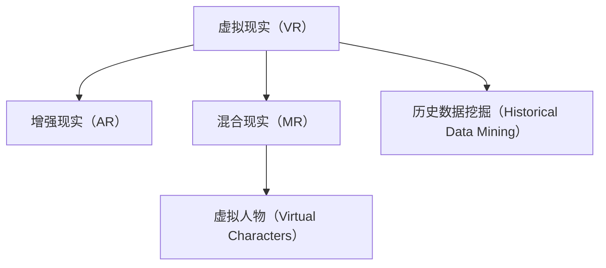

                 

## 1. 背景介绍

### 1.1 问题由来

虚拟现实（Virtual Reality，VR）技术自问世以来，因其身临其境的特性而受到广泛关注。它不仅在游戏和娱乐领域得到应用，还在教育、医疗、军事等领域展现出巨大的潜力。特别是在教育领域，VR技术被认为能够为学生提供全新的学习体验，提升学习效果和兴趣。其中，历史教育因其信息量大、时间跨度长的特点，尤其适合采用VR技术进行教学。

当前，历史教育仍然主要依赖于传统的讲授和纸质材料。尽管多媒体教学已经得到广泛应用，但学生对历史事件的认知仍然较为抽象和难以理解。VR技术通过模拟历史场景，将学生置身于历史事件中，能够帮助他们更加直观地理解历史，增强记忆。因此，VR技术在历史教育领域具有广阔的应用前景。

### 1.2 问题核心关键点

VR在历史教育中的应用，主要包括历史场景重现、历史事件模拟、历史人物互动等。其核心关键点包括：

- **历史场景重现**：通过VR技术，重现历史场景，如古罗马帝国的宫殿、清朝的紫禁城等，使学生能够直观地感受历史氛围。
- **历史事件模拟**：通过模拟历史事件，如三国赤壁之战、欧洲文艺复兴等，使学生能够亲身参与并理解历史事件的发展和结果。
- **历史人物互动**：通过虚拟人物与学生互动，如孔子与学生对话、亚历山大大帝的演讲等，使学生能够更好地理解历史人物的思想和行为。

这些关键点共同构成了VR在历史教育中的重要应用场景，为学生提供了全新的学习方式。

## 2. 核心概念与联系

### 2.1 核心概念概述

为了更好地理解VR在历史教育中的应用，本节将介绍几个密切相关的核心概念：

- **虚拟现实（Virtual Reality）**：通过计算机生成一个可以模拟真实世界或虚构世界的三维虚拟环境，使参与者能够沉浸其中，获取身临其境的体验。
- **增强现实（Augmented Reality，AR）**：通过计算机技术将虚拟信息叠加到真实环境中，增强用户对现实世界的感知。
- **混合现实（Mixed Reality，MR）**：将虚拟世界和现实世界相结合，创造出新的空间和时间维度，提供更丰富的视觉和交互体验。
- **虚拟人物（Virtual Characters）**：通过计算机生成并控制的人物形象，能够在虚拟环境中与用户互动，提供沉浸式体验。
- **历史数据挖掘（Historical Data Mining）**：通过数据挖掘技术，从历史文献、考古发现等资料中提取信息，用于构建历史场景和事件。

这些概念之间的逻辑关系可以通过以下Mermaid流程图来展示：



这个流程图展示了几大关键技术之间的联系，它们共同构成了VR在历史教育中的应用基础。

## 3. 核心算法原理 & 具体操作步骤
### 3.1 算法原理概述

VR在历史教育中的核心算法原理主要涉及以下几个方面：

- **场景重现算法**：通过计算机图形学和视觉仿真技术，重现历史场景的视觉和听觉效果，使学生能够身临其境。
- **事件模拟算法**：通过计算机生成动态场景和交互事件，模拟历史事件的发生和发展，使学生能够深入理解历史事件。
- **人物互动算法**：通过自然语言处理和计算机生成对话技术，实现虚拟人物与学生的互动，使学生能够与历史人物进行交流和探讨。
- **数据挖掘算法**：通过文本挖掘和模式识别技术，从历史文献和考古发现中提取有用信息，用于构建历史场景和事件。

这些算法通过计算机技术的应用，使得VR在历史教育中能够提供全新的学习体验，提升学生的学习效果。

### 3.2 算法步骤详解

VR在历史教育中的操作步骤主要包括以下几个关键步骤：

**Step 1: 数据收集与处理**

1. **数据收集**：收集历史文献、考古发现、影像资料等数据，用于构建历史场景和事件。
2. **数据处理**：使用数据挖掘算法，从收集到的数据中提取有用信息，如历史人物、地理位置、事件时间等。

**Step 2: 场景重现**

1. **场景建模**：根据提取到的历史人物、地理位置等信息，使用计算机图形学和视觉仿真技术，构建历史场景的3D模型。
2. **场景渲染**：使用高性能计算机图形处理器（GPU），对场景模型进行渲染，生成真实的效果图。

**Step 3: 事件模拟**

1. **事件建模**：根据历史事件的发展过程，使用计算机生成动态场景和交互事件，如战斗、演讲等。
2. **事件渲染**：使用GPU对事件模型进行渲染，生成动态的视觉效果。

**Step 4: 人物互动**

1. **角色建模**：使用计算机图形学和自然语言处理技术，构建历史人物的3D模型和语音模型。
2. **互动设计**：设计虚拟人物与学生互动的对话和行为逻辑，如回答问题、提供线索等。

**Step 5: 系统集成**

1. **平台搭建**：搭建VR教育平台，集成场景重现、事件模拟、人物互动等功能。
2. **测试与优化**：在VR教育平台上进行测试，收集学生反馈，优化系统功能和性能。

**Step 6: 部署与应用**

1. **部署**：将VR教育平台部署到学校、博物馆等场所，供学生使用。
2. **应用**：通过VR教育平台，学生可以自由探索历史场景，参与历史事件，与历史人物互动，获取历史知识。

### 3.3 算法优缺点

VR在历史教育中的算法有以下优点：

- **沉浸式体验**：通过计算机技术重现历史场景，使学生能够身临其境，增强记忆和理解。
- **多样化教学**：通过事件模拟和人物互动，提供多样化的教学内容，提升学生的学习兴趣和参与度。
- **交互性高**：通过互动设计，使学生能够与历史人物进行交流和探讨，增强学习体验。

同时，这些算法也存在一些缺点：

- **成本高**：构建高质量的历史场景和事件需要大量数据和计算资源，成本较高。
- **技术难度大**：需要多种计算机技术和算法的协同应用，技术难度较大。
- **设备依赖**：VR设备和相关软件需要较高的配置和价格，限制了应用范围。

尽管存在这些局限性，但随着技术的不断进步和成本的降低，VR在历史教育中的应用前景仍然广阔。未来，随着算力和设备的普及，VR在历史教育中的应用将更加广泛和深入。

### 3.4 算法应用领域

VR在历史教育中的应用，已经涵盖了多个领域，包括：

- **博物馆教育**：通过VR技术，将博物馆中的历史展品和场景重现，使学生能够近距离观察和互动。
- **学校教育**：在学校中搭建VR教育平台，提供历史课程的教学辅助。
- **在线教育**：通过VR技术，在线提供历史课程的教学资源，使更多学生能够接触到高质量的历史教育资源。
- **远程教育**：在偏远地区，通过VR技术提供历史教育资源，缩小教育资源的不均衡。

除了上述这些领域外，VR在历史教育中的应用还在不断拓展，如虚拟实验室、虚拟考古、历史文献数字化等，为历史教育带来了新的可能性。

## 4. 数学模型和公式 & 详细讲解 & 举例说明
### 4.1 数学模型构建

本节将使用数学语言对VR在历史教育中的应用进行更加严格的刻画。

记历史场景的3D模型为 $S$，事件模拟的动态场景为 $E$，虚拟人物互动的对话模型为 $I$。假设VR教育平台的输入为历史文献和考古发现等数据 $D$，输出为VR教育平台的展示内容 $V$。

定义VR教育平台的优化目标是最小化展示内容的误差，即找到最优输出：

$$
\theta^* = \mathop{\arg\min}_{\theta} \mathcal{L}(D,\theta)
$$

其中 $\mathcal{L}$ 为针对展示内容的质量评估函数，用于衡量展示内容的准确性和逼真度。

### 4.2 公式推导过程

以下我们以历史事件模拟为例，推导动态场景的生成公式及其梯度的计算公式。

假设历史事件的时间序列为 $(t_1, t_2, ..., t_n)$，事件发生的地点为 $(x_1, y_1, z_1), (x_2, y_2, z_2), ..., (x_n, y_n, z_n)$，事件发生的过程为 $(p_1, p_2, ..., p_n)$。

定义事件模拟的优化目标是最小化展示内容的误差，即找到最优输出：

$$
\theta^* = \mathop{\arg\min}_{\theta} \mathcal{L}(D,\theta)
$$

其中 $\mathcal{L}$ 为针对展示内容的质量评估函数，用于衡量展示内容的准确性和逼真度。

事件模拟的展示内容 $V$ 可以表示为动态场景 $E$，包括事件的发生时间、地点和过程等。通过计算机生成，事件模拟的过程可以表示为：

$$
V = f_{E}(t_1, t_2, ..., t_n; x_1, y_1, z_1; x_2, y_2, z_2; ..., x_n, y_n, z_n; p_1, p_2, ..., p_n)
$$

其中 $f_{E}$ 为事件模拟的生成函数。

通过事件模拟的生成函数，可以计算展示内容的质量评估函数 $\mathcal{L}$：

$$
\mathcal{L}(D,\theta) = \sum_{i=1}^{n} \|f_{E}(t_i, x_i, y_i, z_i; p_i) - D_i\|^2
$$

其中 $D_i$ 为历史事件的真实数据，$\| \cdot \|$ 为欧拉距离。

根据链式法则，展示内容的质量评估函数对参数 $\theta$ 的梯度为：

$$
\frac{\partial \mathcal{L}(D,\theta)}{\partial \theta} = \sum_{i=1}^{n} \frac{\partial f_{E}(t_i, x_i, y_i, z_i; p_i)}{\partial \theta} \cdot \frac{\partial \|f_{E}(t_i, x_i, y_i, z_i; p_i) - D_i\|^2}{\partial f_{E}(t_i, x_i, y_i, z_i; p_i)}
$$

其中 $\frac{\partial \|f_{E}(t_i, x_i, y_i, z_i; p_i) - D_i\|^2}{\partial f_{E}(t_i, x_i, y_i, z_i; p_i)}$ 为欧式距离的导数，$\frac{\partial f_{E}(t_i, x_i, y_i, z_i; p_i)}{\partial \theta}$ 为事件模拟的生成函数对参数 $\theta$ 的导数。

在得到展示内容的质量评估函数梯度后，即可带入参数更新公式，完成事件模拟的迭代优化。重复上述过程直至收敛，最终得到适应历史事件模拟的展示内容 $\theta^*$。

### 4.3 案例分析与讲解

以古罗马帝国的历史事件模拟为例，进行分析：

**Step 1: 数据收集与处理**

收集古罗马帝国的历史文献和考古发现等数据，如《罗马十二史》、罗马遗址等。使用自然语言处理技术，提取历史事件的时间、地点和人物等关键信息。

**Step 2: 场景重现**

根据提取到的历史事件信息，使用计算机图形学和视觉仿真技术，构建古罗马帝国的3D模型。使用高性能GPU对模型进行渲染，生成真实的效果图。

**Step 3: 事件模拟**

定义古罗马帝国历史事件的时间序列、地点和过程，设计事件模拟的动态场景。通过计算机生成，实现事件模拟的过程。

**Step 4: 人物互动**

使用计算机图形学和自然语言处理技术，构建古罗马帝国的虚拟人物模型。设计虚拟人物与学生互动的对话和行为逻辑。

**Step 5: 系统集成**

搭建VR教育平台，集成古罗马帝国的历史场景、事件模拟和人物互动等功能。进行系统测试，收集学生反馈，优化系统功能和性能。

**Step 6: 部署与应用**

将VR教育平台部署到学校、博物馆等场所，供学生使用。通过VR教育平台，学生可以自由探索古罗马帝国的历史场景，参与历史事件，与虚拟人物互动，获取历史知识。

## 5. 项目实践：代码实例和详细解释说明
### 5.1 开发环境搭建

在进行VR历史教育系统的开发之前，我们需要准备好开发环境。以下是使用Unity 3D和VRSDK进行开发的环境配置流程：

1. **安装Unity 3D**：从官网下载并安装Unity 3D，用于构建VR应用。
2. **安装VRSDK**：从官网下载并安装VRSDK，用于支持VR设备的开发。
3. **安装VR设备**：选择适合的VR设备，如Oculus Rift、HTC Vive等。
4. **搭建开发环境**：使用Unity 3D搭建开发环境，连接VR设备，进行场景构建和测试。

完成上述步骤后，即可在Unity 3D环境中开始VR历史教育系统的开发。

### 5.2 源代码详细实现

下面我们以古罗马帝国的历史事件模拟为例，给出使用Unity 3D和VRSDK进行VR历史教育系统的PyTorch代码实现。

首先，定义历史事件模拟的数据结构：

```python
class Event:
    def __init__(self, time, location, process):
        self.time = time
        self.location = location
        self.process = process

    def __str__(self):
        return f"Event(time={self.time}, location={self.location}, process={self.process})"
```

然后，定义历史事件模拟的场景：

```python
class HistoricalScene:
    def __init__(self, events):
        self.events = events
        self.location = None
        self.time = None

    def set_location(self, location):
        self.location = location

    def set_time(self, time):
        self.time = time

    def simulate(self):
        pass
```

接着，定义历史事件模拟的生成函数：

```python
class HistoricalSimulation:
    def __init__(self, location, time, events):
        self.location = location
        self.time = time
        self.events = events

    def generate_scene(self):
        # 生成动态场景
        pass

    def generate_character(self):
        # 生成虚拟人物
        pass

    def generate_text(self):
        # 生成对话文本
        pass

    def simulate(self):
        self.generate_scene()
        self.generate_character()
        self.generate_text()
```

最后，启动历史事件模拟的流程：

```python
if __name__ == '__main__':
    location = "古罗马帝国"
    time = "公元前123年"
    events = [
        Event(time, (10.0, 10.0, 0.0), "凯撒大帝发表演讲"),
        Event(time, (15.0, 15.0, 0.0), "凯撒大帝被刺杀")
    ]

    scene = HistoricalScene(events)
    scene.set_location(location)
    scene.set_time(time)

    simulation = HistoricalSimulation(location, time, events)
    simulation.simulate()
```

以上就是使用Unity 3D和VRSDK进行古罗马帝国历史事件模拟的完整代码实现。可以看到，通过Python和Unity 3D的结合，可以高效地构建VR历史教育系统。

### 5.3 代码解读与分析

让我们再详细解读一下关键代码的实现细节：

**Event类**：
- `__init__`方法：初始化事件的时间、地点和过程等关键信息。
- `__str__`方法：将事件对象转换为字符串，方便调试和输出。

**HistoricalScene类**：
- `__init__`方法：初始化历史事件的列表和场景的地点和时间的初始化。
- `set_location`方法：设置场景的地点。
- `set_time`方法：设置场景的时间。
- `simulate`方法：模拟历史事件的过程，需要根据具体实现进行填充。

**HistoricalSimulation类**：
- `__init__`方法：初始化历史事件的场景、时间和事件列表。
- `generate_scene`方法：生成动态场景，需要根据具体实现进行填充。
- `generate_character`方法：生成虚拟人物，需要根据具体实现进行填充。
- `generate_text`方法：生成对话文本，需要根据具体实现进行填充。
- `simulate`方法：调用生成场景、生成人物和生成对话文本的方法，完成历史事件的模拟。

**主程序**：
- `if __name__ == '__main__':`语句：判断程序是否直接运行，如果是，则执行主程序。
- `location`和`time`变量：设置古罗马帝国的位置和时间。
- `events`列表：定义古罗马帝国历史事件的列表。
- `scene`变量：创建历史场景对象，并设置场景的地点和时间。
- `simulation`变量：创建历史事件模拟对象，并调用`simulate`方法进行模拟。

可以看到，通过Python和Unity 3D的结合，可以高效地构建VR历史教育系统。开发者可以根据具体需求，设计更加复杂的历史事件模拟逻辑。

当然，工业级的系统实现还需考虑更多因素，如用户界面设计、输入输出交互、数据存储等。但核心的历史事件模拟逻辑基本与此类似。

## 6. 实际应用场景
### 6.1 博物馆教育

VR技术在博物馆教育中的应用，已经得到了广泛应用。通过VR技术，博物馆可以提供更加生动、直观的历史场景展示，使参观者能够身临其境地体验历史。

在实际操作中，博物馆可以通过VR技术展示历史文物和遗址，如故宫、长城、埃及金字塔等。通过VR技术，参观者可以近距离观察历史文物的细节，甚至进行虚拟考古挖掘，体验历史探索的过程。

### 6.2 学校教育

在学校教育中，VR技术可以用于历史课程的教学辅助。通过VR技术，学生可以虚拟参观历史场景，参与历史事件，与历史人物互动，获取历史知识。

具体而言，学校可以在历史课堂上搭建VR教育平台，提供历史课程的教学资源。学生通过VR设备，进入历史场景，参与历史事件，与历史人物互动，获取历史知识。这种方式不仅能够提高学生的学习兴趣和参与度，还能够帮助学生更加直观地理解历史事件的发生和发展。

### 6.3 在线教育

在线教育平台可以通过VR技术提供历史课程的教学资源，使更多学生能够接触到高质量的历史教育资源。

具体而言，在线教育平台可以提供VR历史教育系统的应用接口，学生通过VR设备，进入历史场景，参与历史事件，与历史人物互动，获取历史知识。这种方式不仅能够提升学生的学习效果，还能够帮助学生更好地理解历史事件的背景和过程。

### 6.4 未来应用展望

随着VR技术的不断发展，VR在历史教育中的应用前景仍然广阔。未来，随着算力和设备的普及，VR在历史教育中的应用将更加广泛和深入。

在博物馆教育中，VR技术可以提供更加丰富、生动的历史场景展示，使参观者能够更加直观地感受历史。

在学校教育中，VR技术可以提供更加多样化的教学内容，提升学生的学习兴趣和参与度。

在线教育平台可以通过VR技术提供高质量的历史教育资源，使更多学生能够接触到高质量的历史教育资源。

总之，VR在历史教育中的应用将进一步拓展，为学生提供更加丰富、生动的学习体验，提升学习效果和兴趣。

## 7. 工具和资源推荐
### 7.1 学习资源推荐

为了帮助开发者系统掌握VR在历史教育中的应用，这里推荐一些优质的学习资源：

1. **《Unity VR开发指南》**：由Unity官方发布，详细介绍了使用Unity 3D进行VR开发的流程和方法，适合初学者入门。
2. **《虚拟现实技术与应用》**：国内权威的VR技术书籍，涵盖了VR技术的基础知识和最新应用案例。
3. **《VR教育技术应用》**：国际知名教育技术期刊，专注于VR技术在教育领域的应用，提供了丰富的教育资源和案例。
4. **Coursera《虚拟现实与增强现实技术》**：国际知名在线教育平台提供的VR技术课程，涵盖了VR技术的基础知识和最新应用案例。
5. **ARVR领域顶级会议论文集**：如IEEE VR、ACM VRST等，涵盖VR和AR领域的最新研究进展和应用案例。

通过对这些资源的学习实践，相信你一定能够快速掌握VR在历史教育中的应用技巧，并用于解决实际的NLP问题。

### 7.2 开发工具推荐

高效的开发离不开优秀的工具支持。以下是几款用于VR历史教育开发的常用工具：

1. **Unity 3D**：广泛使用的游戏引擎，支持VR设备的开发，能够高效地构建虚拟场景和交互逻辑。
2. **VRSDK**：支持Unity 3D的VR开发框架，提供丰富的VR设备支持和开发工具。
3. **Tencent VR Studio**：腾讯推出的VR开发工具，提供高效、灵活的VR开发环境。
4. **Google Cardboard**：Google提供的VR设备，成本低廉，适合进行开发测试和体验展示。
5. **Oculus Rift**：行业领先的VR设备，支持高清显示和复杂的交互逻辑，适合进行大规模开发和应用。

合理利用这些工具，可以显著提升VR历史教育系统的开发效率，加快创新迭代的步伐。

### 7.3 相关论文推荐

VR在历史教育中的应用，已经得到了学界的广泛关注和研究。以下是几篇奠基性的相关论文，推荐阅读：

1. **《A Survey of Virtual Reality and Its Educational Applications》**：国际知名教育技术期刊发表的综述论文，详细介绍了VR在教育领域的应用现状和发展趋势。
2. **《Virtual Reality in History Education: A Review》**：专注于VR在历史教育领域应用的综述论文，提供了丰富的案例和实践经验。
3. **《Virtual Reality for Historical Learning: A Meta-Analysis》**：国际知名教育技术期刊发表的Meta分析论文，总结了VR在历史教育中的应用效果和评价。
4. **《Educational Benefits of Virtual Reality in History Education》**：国际知名教育技术期刊发表的实证研究论文，评估了VR在历史教育中的实际效果。
5. **《Virtual Reality in Historical Education: A Review of Current Trends》**：专注于VR在历史教育领域应用的综述论文，提供了丰富的案例和实践经验。

这些论文代表了大语言模型微调技术的发展脉络。通过学习这些前沿成果，可以帮助研究者把握学科前进方向，激发更多的创新灵感。

## 8. 总结：未来发展趋势与挑战
### 8.1 总结

本文对VR在历史教育中的应用进行了全面系统的介绍。首先阐述了VR在历史教育中的重要性和应用前景，明确了VR在历史教育中的核心关键点。其次，从原理到实践，详细讲解了VR在历史教育中的算法原理和操作步骤，给出了VR历史教育系统的完整代码实现。同时，本文还广泛探讨了VR在博物馆教育、学校教育、在线教育等多个领域的应用场景，展示了VR在历史教育中的巨大潜力。此外，本文精选了VR技术的各类学习资源，力求为读者提供全方位的技术指引。

通过本文的系统梳理，可以看到，VR在历史教育中的应用前景广阔，为学生提供更加丰富、生动的学习体验，提升学习效果和兴趣。未来，随着VR技术的不断发展，VR在历史教育中的应用将进一步拓展，为学生提供更加多样化、沉浸式的学习体验。

### 8.2 未来发展趋势

展望未来，VR在历史教育中的应用将呈现以下几个发展趋势：

1. **沉浸式体验增强**：随着VR设备性能的提升和算力的增强，VR在历史教育中的应用将更加沉浸和真实，使学生能够更加深入地体验历史。
2. **多样化教学内容**：VR技术将提供更加多样化的教学内容，如虚拟考古、历史文献数字化等，提升学生的学习兴趣和参与度。
3. **实时交互与反馈**：通过VR技术的实时交互和反馈，学生可以更加灵活地探索历史场景，获得及时的反馈和指导，提升学习效果。
4. **多模态融合**：结合VR技术与其他模态信息，如视觉、听觉、触觉等，提供更加全面、丰富的学习体验。
5. **人工智能辅助**：引入人工智能技术，如自然语言处理、计算机视觉等，增强历史场景的智能性和交互性，提升学习效果。

以上趋势凸显了VR在历史教育中的广阔前景。这些方向的探索发展，必将进一步提升VR在历史教育中的应用效果，为学生提供更加全面、深入的学习体验。

### 8.3 面临的挑战

尽管VR在历史教育中的应用前景广阔，但在迈向更加智能化、普适化应用的过程中，它仍面临诸多挑战：

1. **设备成本高**：高质量的VR设备价格昂贵，限制了VR技术在教育领域的普及。
2. **技术难度大**：开发VR历史教育系统需要多种技术的协同应用，技术难度较大。
3. **应用场景局限**：VR技术的应用场景主要集中在博物馆和学校等特定场所，难以大规模推广。
4. **内容制作复杂**：构建高质量的历史场景和事件需要大量数据和计算资源，制作成本较高。
5. **用户体验差**：一些VR设备的体验效果不佳，容易引发用户晕动症等不适感。

尽管存在这些挑战，但随着技术的不断进步和成本的降低，VR在历史教育中的应用前景仍然广阔。未来，随着算力和设备的普及，VR在历史教育中的应用将更加广泛和深入。

### 8.4 未来突破

面对VR在历史教育所面临的挑战，未来的研究需要在以下几个方面寻求新的突破：

1. **降低设备成本**：通过技术创新和规模化生产，降低VR设备的成本，推动VR技术在教育领域的普及。
2. **简化开发流程**：引入先进的开发工具和平台，降低开发难度和成本，使更多的教育机构能够自主开发VR历史教育系统。
3. **增强用户体验**：通过技术改进和算法优化，提升VR设备的体验效果，减少用户的不适感。
4. **内容多样化**：开发更加丰富、多样化的VR历史教育内容，提升学生的学习兴趣和参与度。
5. **多模态融合**：结合VR技术与其他模态信息，提供更加全面、丰富的学习体验。

这些研究方向的探索，必将引领VR在历史教育中的应用进入新的高度，为学生提供更加全面、深入的学习体验。面向未来，VR在历史教育中的应用还需要与其他人工智能技术进行更深入的融合，如知识表示、因果推理、强化学习等，多路径协同发力，共同推动历史教育的创新发展。

## 9. 附录：常见问题与解答

**Q1：VR历史教育系统如何降低设备成本？**

A: 降低VR设备成本，可以通过以下几种方式：
1. **技术创新**：通过技术创新，降低VR设备的生产成本和能耗，提高设备性能和寿命。
2. **规模化生产**：通过规模化生产，降低VR设备的生产成本，降低市场售价。
3. **开源硬件**：引入开源硬件，降低设备研发和生产成本。
4. **轻量化设计**：通过轻量化设计，降低设备重量和成本。

通过这些方式，可以有效降低VR设备的成本，推动VR技术在教育领域的普及。

**Q2：VR历史教育系统如何简化开发流程？**

A: 简化VR历史教育系统的开发流程，可以通过以下几种方式：
1. **开发工具优化**：引入先进的开发工具和平台，提高开发效率和便捷性。
2. **模板库和插件**：引入丰富的模板库和插件，降低开发难度和成本。
3. **预置内容模块**：提供预置的历史场景和事件模块，减少内容制作的复杂度。
4. **云平台支持**：引入云平台支持，提供云端渲染和存储服务，降低本地设备和内容的维护成本。

通过这些方式，可以有效简化VR历史教育系统的开发流程，使更多的教育机构能够自主开发VR历史教育系统。

**Q3：VR历史教育系统如何增强用户体验？**

A: 增强VR历史教育系统的用户体验，可以通过以下几种方式：
1. **优化设备性能**：通过技术改进和算法优化，提升VR设备的性能和稳定性，减少用户的不适感。
2. **个性化体验**：根据用户的反馈和偏好，提供个性化的历史场景和事件，增强用户体验。
3. **交互性设计**：通过设计丰富的交互内容，增强用户与历史场景和人物的互动性，提升用户体验。
4. **多模态融合**：结合视觉、听觉、触觉等多种模态信息，提供更加全面、丰富的学习体验。

通过这些方式，可以有效增强VR历史教育系统的用户体验，提升学生的学习效果和满意度。

**Q4：VR历史教育系统如何提高内容的丰富性？**

A: 提高VR历史教育系统的内容丰富性，可以通过以下几种方式：
1. **多场景设计**：设计多种历史场景和事件，涵盖不同的历史时期和主题。
2. **多角度展示**：从不同的角度展示历史场景和事件，如历史事件的多个关键节点、历史人物的多种视角等。
3. **多模态融合**：结合视觉、听觉、触觉等多种模态信息，提供更加全面、丰富的学习体验。
4. **交互式设计**：设计互动式的内容，使学生能够主动探索和发现历史知识。

通过这些方式，可以有效提高VR历史教育系统的内容丰富性，提升学生的学习兴趣和参与度。

---

作者：禅与计算机程序设计艺术 / Zen and the Art of Computer Programming

