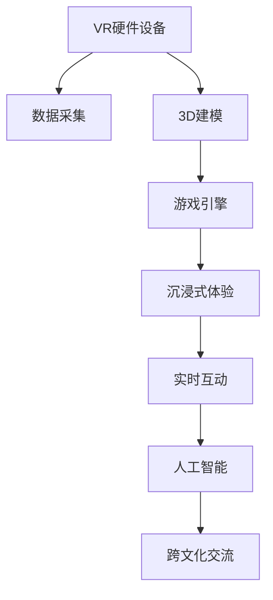

                 

# 虚拟现实文化交流创业：跨国界的沉浸式体验

> 关键词：虚拟现实, 文化交流, 沉浸式体验, 创业, 跨国界, 实时互动, 3D建模, 游戏引擎, 数据处理, 人工智能

## 1. 背景介绍

### 1.1 问题由来
随着全球化的进程加快，各国文化交流日益频繁，但仍存在着文化差异、理解障碍等问题。传统的信息交流方式难以突破时空限制，而新兴的虚拟现实(VR)技术以其沉浸式体验、互动性强等优势，为文化交流提供了新的可能性。通过VR，用户能够身临其境地体验异国文化，与当地居民实时互动，从而实现跨越国界的深入交流。

### 1.2 问题核心关键点
本文聚焦于如何在VR环境中实现高效、沉浸、实时的跨文化交流。核心关键点包括：

- 如何构建沉浸式VR体验，让用户身临其境。
- 如何利用数据处理和人工智能技术，实现实时互动和文化智能推荐。
- 如何在跨国界环境下，构建稳定、高效、可扩展的VR应用平台。

### 1.3 问题研究意义
研究虚拟现实文化交流的创业实践，对于促进不同文化间的理解与融合，拓展国际交流的新渠道，具有重要意义：

1. **增强文化理解**：通过沉浸式体验，用户能够更深刻地理解异国文化，缩小文化差异。
2. **提升交流效率**：VR技术消除了时空限制，使跨国界交流更加便捷。
3. **激发创新创业**：为文化交流领域提供新的商业模式和技术平台。
4. **促进国际合作**：通过技术合作，推动全球文化产业的发展。

## 2. 核心概念与联系

### 2.1 核心概念概述

为更好地理解虚拟现实文化交流的创业实践，本节将介绍几个关键概念：

- **虚拟现实(Virtual Reality, VR)**：通过计算机生成环境，使用户能够身临其境地体验虚拟世界。主要组成部分包括头部显示器(HMD)、手部追踪器等硬件设备，以及相关的软件平台和应用程序。

- **沉浸式体验(Immersive Experience)**：指通过多感官刺激，使用户深度沉浸于虚拟环境中的体验。包括视觉、听觉、触觉等多方面的感官反馈，以及与虚拟环境的互动。

- **跨文化交流(Cross-Cultural Communication)**：指不同文化背景的人们在语言、习俗、价值观等方面进行交流的过程。虚拟现实技术通过沉浸式体验，为跨文化交流提供了新的平台。

- **实时互动(Real-Time Interaction)**：指在虚拟环境中，用户能够即时地与虚拟对象或其他人进行互动。这依赖于强大的数据处理能力和高效的通信协议。

- **3D建模(3D Modeling)**：构建虚拟世界的核心技术，通过建模软件将现实世界物体转化为三维模型。

- **游戏引擎(Game Engine)**：开发虚拟现实应用的主要工具，提供图形渲染、物理模拟等功能。

- **数据处理(Data Processing)**：在虚拟现实应用中，对用户行为、设备状态、环境变化等数据进行处理和分析。

- **人工智能(Artificial Intelligence, AI)**：利用机器学习和深度学习技术，实现用户行为预测、智能推荐等高级功能。

这些概念之间的联系可以通过以下Mermaid流程图来展示：



这个流程图展示了这个系统从硬件设备到最终应用的全流程：

1. VR硬件设备采集用户的输入和环境数据。
2. 3D建模软件将现实世界物体转化为三维模型。
3. 游戏引擎渲染这些模型，生成沉浸式体验。
4. 实时互动技术实现用户与虚拟对象的互动。
5. 人工智能技术提供智能推荐和行为预测。
6. 最终实现跨越国界的文化交流。

## 3. 核心算法原理 & 具体操作步骤
### 3.1 算法原理概述

虚拟现实文化交流的创业实践，核心在于构建一个沉浸式、实时的跨文化交流平台。该平台通过数据处理和人工智能技术，为用户提供沉浸式体验和文化智能推荐，同时利用实时互动技术，实现跨国界的文化交流。

### 3.2 算法步骤详解

#### 3.2.1 用户行为数据处理

用户行为数据是虚拟现实应用中最为关键的信息来源。通过分析用户的行为数据，可以预测用户兴趣，推荐相关文化内容，提升用户体验。以下是数据处理的主要步骤：

1. **数据采集**：收集用户在虚拟环境中的行为数据，如点击、拖拽、语音指令等。

2. **数据清洗**：处理异常数据、缺失数据，确保数据质量。

3. **特征提取**：从行为数据中提取有用的特征，如点击频率、浏览时间等。

4. **数据建模**：使用机器学习模型对用户行为进行建模，预测用户兴趣。

#### 3.2.2 文化内容推荐

根据用户的行为数据，文化内容推荐算法可以实时为用户推荐感兴趣的文化内容。以下是推荐算法的主要步骤：

1. **数据融合**：将用户行为数据与文化内容数据融合，建立用户与内容的关联。

2. **模型训练**：使用推荐算法训练模型，如协同过滤、基于内容的推荐等。

3. **推荐预测**：根据用户行为数据，预测用户对不同文化内容的兴趣。

4. **结果排序**：对预测结果进行排序，提供最相关的文化内容推荐。

#### 3.2.3 实时互动技术

实时互动是虚拟现实文化交流的核心功能，通过技术手段实现用户与虚拟对象之间的互动。以下是实时互动技术的主要步骤：

1. **传感器输入**：通过头部追踪器、手部追踪器等传感器，获取用户的输入信息。

2. **交互逻辑设计**：设计虚拟对象的行为逻辑，根据用户输入进行响应。

3. **物理模拟**：通过游戏引擎进行物理模拟，实现虚拟对象的行为与用户输入的交互。

4. **网络传输**：使用高效的通信协议，保证实时互动的低延迟和稳定传输。

### 3.3 算法优缺点

虚拟现实文化交流的创业实践，有以下优点和缺点：

#### 优点：

1. **沉浸式体验**：用户能够身临其境地体验异国文化，增强了文化理解。
2. **实时互动**：消除了时空限制，提高了交流效率。
3. **智能推荐**：根据用户行为数据，提供个性化推荐，提升用户体验。
4. **多感官反馈**：通过视觉、听觉、触觉等多感官反馈，增强了沉浸感和互动性。

#### 缺点：

1. **技术门槛高**：需要涉及3D建模、游戏引擎、人工智能等多方面技术，开发难度大。
2. **硬件成本高**：VR设备价格较高，普及率较低。
3. **网络带宽要求高**：实时互动需要稳定的网络环境，网络带宽要求较高。
4. **内容创作困难**：高质量的文化内容创作成本高，开发周期长。

### 3.4 算法应用领域

虚拟现实文化交流的创业实践，已经在教育、旅游、文化遗产保护等多个领域得到了应用：

- **教育领域**：通过虚拟现实技术，学生可以在虚拟环境中参观博物馆、历史遗迹，了解不同文化背景下的历史知识。

- **旅游行业**：旅游者可以通过VR技术，体验异国文化，了解目的地风土人情，提升旅游体验。

- **文化遗产保护**：对一些濒临破坏的历史遗迹，通过虚拟现实技术进行数字化保存，实现文化的传承和保护。

- **游戏娱乐**：开发文化主题的虚拟现实游戏，提供沉浸式文化体验。

此外，虚拟现实文化交流还在虚拟展会、文化节、跨文化会议等场景中得到应用，成为促进国际交流的重要工具。

## 4. 数学模型和公式 & 详细讲解 & 举例说明

### 4.1 数学模型构建

本节将使用数学语言对虚拟现实文化交流的创业实践进行更加严格的刻画。

假设用户在虚拟现实环境中的行为数据为 $X=\{x_1, x_2, ..., x_n\}$，其中 $x_i$ 表示用户行为特征。文化内容数据为 $Y=\{y_1, y_2, ..., y_m\}$，其中 $y_i$ 表示文化内容的特征。

定义用户对文化内容 $y_i$ 的兴趣为 $f(x_i, y_i)$，使用一个评分函数 $f$ 来表示。则文化内容推荐的目标是最小化预测误差，即：

$$
\min_{\theta} \sum_{i=1}^{n} \sum_{j=1}^{m} (f(x_i, y_j) - \hat{f}(x_i, y_j))^2
$$

其中 $\hat{f}(x_i, y_j)$ 为使用机器学习模型预测的用户对文化内容 $y_j$ 的兴趣评分。

### 4.2 公式推导过程

以协同过滤推荐算法为例，推导推荐模型的基本公式。

协同过滤算法基于用户行为数据 $X$ 和项目数据 $Y$，通过寻找与用户行为相似的其他用户，预测用户对未评分项目 $y_j$ 的评分 $f(x_i, y_j)$。假设已知用户 $u_k$ 对文化内容 $y_j$ 的评分 $R_{kj}$，则协同过滤算法的目标是最小化预测误差，即：

$$
\min_{\theta} \sum_{i=1}^{n} \sum_{j=1}^{m} (R_{ij} - \hat{R}_{ij})^2
$$

其中 $\hat{R}_{ij}$ 为使用协同过滤算法预测的用户 $u_i$ 对文化内容 $y_j$ 的评分。

使用矩阵分解方法，将用户行为数据和项目数据表示为矩阵 $R \in \mathbb{R}^{n \times m}$，其中 $R_{ij}$ 表示用户 $u_i$ 对文化内容 $y_j$ 的评分。则协同过滤算法可以表示为：

$$
\hat{R} = W \times V^T
$$

其中 $W \in \mathbb{R}^{n \times r}$ 和 $V \in \mathbb{R}^{m \times r}$ 分别为用户行为矩阵和项目矩阵的低秩逼近，$r$ 为矩阵分解的秩。

根据矩阵分解的性质，可以进一步推导预测评分的公式为：

$$
\hat{R}_{ij} = \sum_{k=1}^{r} W_{ik} \times V_{kj}
$$

其中 $W_{ik}$ 和 $V_{kj}$ 分别为用户行为矩阵和项目矩阵的低秩逼近的元素。

### 4.3 案例分析与讲解

以文化遗产保护为例，展示虚拟现实技术的应用。

在文化遗产保护项目中，通过虚拟现实技术，用户可以在虚拟环境中参观古迹，了解历史知识。为了实现高效的文化遗产推荐，可以采用协同过滤推荐算法。具体步骤如下：

1. **数据收集**：收集用户行为数据，如浏览时长、点击位置等。收集文化遗产的数据，如地点、历史背景、文化遗产保护状态等。

2. **数据预处理**：对行为数据进行清洗和特征提取，对文化遗产数据进行标准化处理。

3. **协同过滤**：使用矩阵分解方法，对用户行为数据和文化遗产数据进行协同过滤，得到用户对不同文化遗产的兴趣评分。

4. **推荐排序**：根据用户的兴趣评分，对文化遗产进行排序，推荐最感兴趣的文化遗产。

## 5. 项目实践：代码实例和详细解释说明
### 5.1 开发环境搭建

在进行虚拟现实文化交流的创业实践时，需要搭建相应的开发环境。以下是使用Unity 3D进行VR开发的环境配置流程：

1. **安装Unity 3D**：从Unity官网下载并安装Unity 3D，创建一个新的VR项目。

2. **配置开发环境**：安装必要的插件，如VR插件、游戏引擎等。

3. **安装VR设备**：连接VR头显和手部追踪器，并进行初始化设置。

4. **安装开发工具**：安装Visual Studio等IDE，用于编写和调试VR应用代码。

完成上述步骤后，即可在Unity 3D中进行虚拟现实应用的开发。

### 5.2 源代码详细实现

下面我们以一个虚拟现实文化遗产展示平台为例，给出使用Unity 3D开发VR应用的代码实现。

首先，定义文化遗产的虚拟模型：

```csharp
using UnityEngine;

public class CulturalHeritage : MonoBehaviour
{
    public GameObject model;
    public float scaleFactor = 1f;
    
    private void Start()
    {
        model.transform.localScale = new Vector3(scaleFactor, scaleFactor, scaleFactor);
    }
}
```

然后，定义用户行为数据处理脚本：

```csharp
using UnityEngine;
using System.Collections;

public class BehaviorData : MonoBehaviour
{
    public GameObject userBehavior;
    
    private void Update()
    {
        if (userBehavior.activeSelf)
        {
            // 处理用户行为数据
            // ...
        }
    }
}
```

接着，定义文化内容推荐算法：

```csharp
using UnityEngine;
using System.Collections;

public class ContentRecommendation : MonoBehaviour
{
    public GameObject[] culturalHeritages;
    public GameObject recommendation;
    
    private void Start()
    {
        // 协同过滤推荐算法
        // ...
        // 推荐排序
        // ...
        // 显示推荐内容
        recommendation.SetActive(true);
        recommendation.transform.position = recommendation.transform.position + new Vector3(0, 1.5f, 0);
    }
}
```

最后，启动VR应用并进行测试：

```csharp
using UnityEngine;
using UnityEngine.XR.Interaction.Toolkit;

public class MainScene : MonoBehaviour
{
    public GameObject culturalHeritagePrefab;
    
    private void Start()
    {
        // 创建文化遗产模型
        GameObject[] culturalHeritages = new GameObject[10];
        for (int i = 0; i < 10; i++)
        {
            culturalHeritages[i] = Instantiate(culturalHeritagePrefab);
        }
        
        // 显示文化遗产模型
        foreach (GameObject heritage in culturalHeritages)
        {
            heritage.SetActive(false);
        }
    }
}
```

以上就是使用Unity 3D开发虚拟现实文化遗产展示平台的基本代码实现。可以看到，Unity 3D提供了丰富的开发工具和组件，可以方便地实现虚拟现实应用的开发。

### 5.3 代码解读与分析

让我们再详细解读一下关键代码的实现细节：

**CulturalHeritage类**：
- `model`属性：用于加载文化遗产的虚拟模型。
- `Start`方法：初始化模型规模。

**BehaviorData类**：
- `userBehavior`属性：用于处理用户行为数据的对象。
- `Update`方法：实时处理用户行为数据。

**ContentRecommendation类**：
- `culturalHeritages`属性：文化遗产数据数组。
- `recommendation`属性：推荐内容的对象。
- `Start`方法：执行协同过滤推荐算法，排序推荐内容，并显示推荐内容。

**MainScene类**：
- `culturalHeritagePrefab`属性：文化遗产模型的预制体。
- `Start`方法：创建文化遗产模型，并显示。

可以看到，Unity 3D提供了强大的引擎支持，通过简单的代码编写，即可实现虚拟现实应用的开发。开发者可以将更多精力放在场景设计、模型优化等方面，而不必过多关注底层的实现细节。

当然，在实际应用中，还需要考虑更多的技术细节，如用户行为数据的实时采集、文化内容的高质量创作等。但核心的开发流程和关键技术，与上述代码实现类似。

## 6. 实际应用场景
### 6.1 智能教育

虚拟现实技术在智能教育中有着广泛的应用。通过虚拟现实平台，学生可以在虚拟环境中参观博物馆、历史遗迹，了解不同文化背景下的历史知识。这不仅能够提升学生的学习兴趣，还能通过沉浸式体验，加深对知识点的理解。

### 6.2 虚拟旅游

虚拟旅游是虚拟现实文化交流的重要应用场景之一。用户可以通过VR设备，身临其境地体验异国文化，了解目的地风土人情，提升旅游体验。虚拟旅游平台可以提供实时的互动体验，用户可以与虚拟导游互动，获取更多信息。

### 6.3 文化遗产保护

虚拟现实技术在文化遗产保护中也发挥了重要作用。对于一些濒临破坏的历史遗迹，通过虚拟现实技术进行数字化保存，实现文化的传承和保护。虚拟现实平台可以提供沉浸式体验，让用户能够近距离观察文化遗产的细节，从而增强保护意识。

### 6.4 未来应用展望

随着虚拟现实技术的不断进步，未来的虚拟现实文化交流将呈现出更多新的应用场景：

1. **虚拟展会**：通过VR技术，用户可以在虚拟展会上参观各类文化展品，获取详细信息。虚拟展会可以提供更加沉浸、互动的参观体验。

2. **虚拟会议**：通过虚拟现实技术，用户可以跨越国界进行跨文化交流，举办虚拟会议。虚拟会议平台可以提供实时的互动和沟通，增强交流效果。

3. **虚拟讲座**：通过VR技术，用户可以在虚拟环境中参加各类讲座、论坛，与专家互动，获取专业知识。虚拟讲座可以提供更加沉浸、互动的体验，提升学习效果。

4. **虚拟图书馆**：通过VR技术，用户可以在虚拟图书馆中浏览各类文化书籍，获取详细信息。虚拟图书馆可以提供更加沉浸、互动的阅读体验。

5. **虚拟博物馆**：通过VR技术，用户可以在虚拟博物馆中参观各类文化展品，获取详细信息。虚拟博物馆可以提供更加沉浸、互动的参观体验。

这些应用场景展示了虚拟现实技术在文化交流中的巨大潜力，未来将会有更多的创新应用出现。

## 7. 工具和资源推荐
### 7.1 学习资源推荐

为了帮助开发者系统掌握虚拟现实文化交流的创业实践，这里推荐一些优质的学习资源：

1. **Unity 3D官方文档**：Unity官网提供的官方文档，详细介绍了Unity 3D的开发环境和API，是Unity开发的重要参考资料。

2. **Unity Asset Store**：Unity官方提供的资源市场，提供丰富的VR应用资源和插件，帮助开发者快速开发应用。

3. **Coursera VR课程**：Coursera提供的虚拟现实技术课程，涵盖虚拟现实开发、游戏引擎、人工智能等多个方面，适合初学者入门。

4. **VR开发者社区**：如SteamVR开发者社区、Unity论坛等，聚集了大量的VR开发者，可以分享经验和资源，获取技术支持。

5. **《虚拟现实技术指南》书籍**：介绍虚拟现实技术的全面指南，涵盖硬件、软件、开发流程等多个方面，适合开发者系统学习。

通过对这些资源的学习实践，相信你一定能够快速掌握虚拟现实文化交流的创业实践，并用于解决实际的VR问题。

### 7.2 开发工具推荐

高效的开发离不开优秀的工具支持。以下是几款用于虚拟现实应用开发的常用工具：

1. **Unity 3D**：Unity 3D是最流行的游戏引擎之一，支持虚拟现实应用开发，提供丰富的VR插件和组件。

2. **Blender**：Blender是一款免费的三维建模软件，支持VR模型创建和导入。

3. **SteamVR**：SteamVR是Steam平台提供的VR设备支持系统，支持多种VR设备，提供实时的空间追踪和控制器支持。

4. **Unity VR Asset Store**：Unity官方提供的资源市场，提供丰富的VR应用资源和插件，帮助开发者快速开发应用。

5. **VRID**：VRID是一个VR数据交换平台，支持多种VR设备，提供实时的数据传输和共享。

合理利用这些工具，可以显著提升虚拟现实应用的开发效率，加快创新迭代的步伐。

### 7.3 相关论文推荐

虚拟现实文化交流的创业实践，得益于学界的持续研究。以下是几篇奠基性的相关论文，推荐阅读：

1. **《虚拟现实技术进展》**：综述了虚拟现实技术的发展历程和应用领域，适合全面了解虚拟现实技术。

2. **《虚拟现实教育应用研究》**：探讨了虚拟现实技术在教育领域的应用，提出了虚拟现实教育的框架和实现方法。

3. **《虚拟现实文化遗产保护研究》**：研究了虚拟现实技术在文化遗产保护中的应用，提出了虚拟现实保护的文化遗产保护方法。

4. **《虚拟现实社交平台设计》**：探讨了虚拟现实社交平台的设计和实现，提出了虚拟现实社交的框架和实现方法。

5. **《虚拟现实游戏设计》**：介绍了虚拟现实游戏的开发流程和设计方法，适合游戏开发者参考。

这些论文代表了大语言模型微调技术的发展脉络。通过学习这些前沿成果，可以帮助研究者把握学科前进方向，激发更多的创新灵感。

## 8. 总结：未来发展趋势与挑战

### 8.1 总结

本文对虚拟现实文化交流的创业实践进行了全面系统的介绍。首先阐述了虚拟现实技术在文化交流中的重要作用，明确了VR文化交流创业的目标和方向。其次，从原理到实践，详细讲解了虚拟现实应用开发的核心技术，给出了虚拟现实应用的完整代码实例。同时，本文还广泛探讨了VR应用在教育、旅游、文化遗产保护等多个领域的应用前景，展示了VR技术的广阔潜力。此外，本文精选了VR技术的各类学习资源，力求为读者提供全方位的技术指引。

通过本文的系统梳理，可以看到，虚拟现实技术在文化交流中的巨大潜力。这些技术的不断发展，将为文化交流领域带来新的变革，促进不同文化间的理解和融合。

### 8.2 未来发展趋势

展望未来，虚拟现实文化交流的创业实践将呈现以下几个发展趋势：

1. **硬件设备普及**：随着VR硬件设备的不断完善和价格下降，VR设备的普及率将显著提高。更多的用户能够享受沉浸式体验。

2. **内容创作丰富**：VR内容的创作成本将逐步降低，高质量的文化内容将更加丰富，用户的选择范围将更加广泛。

3. **技术不断进步**：VR技术将不断进步，提供更加沉浸、互动、实时的体验。多感官反馈、实时互动等技术将进一步发展。

4. **跨领域融合**：虚拟现实技术将与其他技术进行更深入的融合，如人工智能、物联网、大数据等，提供更加全面的应用场景。

5. **国际合作加强**：虚拟现实技术将成为国际交流的重要工具，各国将加强合作，共同推动文化交流的发展。

以上趋势凸显了虚拟现实文化交流的巨大潜力，这些方向的探索发展，必将进一步推动虚拟现实技术的普及和应用。

### 8.3 面临的挑战

尽管虚拟现实文化交流的创业实践已经取得了瞩目成就，但在迈向更加智能化、普适化应用的过程中，它仍面临着诸多挑战：

1. **技术瓶颈**：VR技术仍存在诸多技术瓶颈，如图像渲染、物理模拟、网络传输等，需要进一步优化和提升。

2. **内容创作的困难**：高质量的文化内容创作成本高，开发周期长，需要更多的人才和技术支持。

3. **用户接受度**：VR设备价格较高，普及率较低，用户对虚拟现实的接受度有待提高。

4. **数据隐私和安全**：VR平台需要处理大量的用户行为数据，如何保护用户隐私和数据安全是一个重要问题。

5. **跨平台兼容性**：VR设备种类繁多，如何实现跨平台兼容，提供统一的体验，也是一个技术挑战。

6. **商业模式的不确定性**：VR文化交流平台的商业模式尚未成熟，需要进一步探索和验证。

正视这些挑战，积极应对并寻求突破，将是大语言模型微调走向成熟的必由之路。相信随着学界和产业界的共同努力，这些挑战终将一一被克服，虚拟现实文化交流必将在构建人机协同的智能时代中扮演越来越重要的角色。

### 8.4 研究展望

面对虚拟现实文化交流所面临的挑战，未来的研究需要在以下几个方面寻求新的突破：

1. **技术优化和提升**：进一步优化VR硬件设备和软件技术，提升图像渲染、物理模拟、网络传输等关键技术。

2. **内容创作的创新**：探索新的内容创作方法和工具，降低创作成本，提高创作效率，增加高质量的文化内容。

3. **用户体验的优化**：通过用户行为数据分析，优化用户体验，提供个性化推荐和互动体验。

4. **数据隐私和安全**：研究数据隐私和安全保护技术，确保用户数据的安全和隐私保护。

5. **跨平台兼容性的实现**：开发跨平台兼容的技术方案，实现不同VR设备的无缝对接和数据互通。

6. **商业模式的创新**：探索新的商业模式和盈利方式，如订阅制、广告、增值服务等，为VR文化交流平台提供可持续发展的动力。

这些研究方向的探索，必将引领虚拟现实文化交流的创业实践迈向更高的台阶，为构建安全、可靠、可解释、可控的智能系统铺平道路。面向未来，虚拟现实文化交流需要与其他人工智能技术进行更深入的融合，如知识表示、因果推理、强化学习等，多路径协同发力，共同推动虚拟现实技术的发展。只有勇于创新、敢于突破，才能不断拓展VR技术的边界，让虚拟现实技术更好地造福人类社会。

## 9. 附录：常见问题与解答

**Q1：虚拟现实技术如何与人工智能结合？**

A: 虚拟现实技术可以通过人工智能技术提升用户体验和应用效果。例如，使用人工智能进行用户行为预测和推荐，提供个性化体验；利用人工智能进行虚拟对象的行为逻辑设计，提高互动性；使用人工智能进行实时渲染和物理模拟，提升画面质量和互动效果。

**Q2：虚拟现实文化交流平台需要哪些关键技术？**

A: 虚拟现实文化交流平台需要以下关键技术：

1. 3D建模技术：用于创建虚拟环境和对象。
2. 游戏引擎：提供渲染、物理模拟等功能，支持虚拟现实应用开发。
3. 数据处理技术：用于处理用户行为数据和设备状态数据，实现智能推荐和实时互动。
4. 人工智能技术：用于用户行为预测、智能推荐等高级功能。
5. 实时互动技术：实现用户与虚拟对象的互动。
6. 数据传输和通信技术：支持实时的数据传输和通信。

**Q3：如何保证虚拟现实平台的安全和隐私？**

A: 保证虚拟现实平台的安全和隐私需要从多个方面入手：

1. 数据加密：对用户数据进行加密处理，防止数据泄露。
2. 访问控制：对用户数据进行访问控制，确保只有授权用户可以访问数据。
3. 隐私保护：制定隐私保护政策，明确数据使用范围和目的。
4. 安全审计：定期进行安全审计，发现和修复潜在的安全漏洞。
5. 用户教育：教育用户了解隐私保护知识，提高用户的安全意识。

通过这些措施，可以有效地保护虚拟现实平台的数据安全和用户隐私。

**Q4：如何提高虚拟现实应用的普及率？**

A: 提高虚拟现实应用的普及率需要从以下几个方面入手：

1. 降低设备成本：通过技术进步和规模化生产，降低VR设备的成本，提高普及率。
2. 优化用户体验：提升虚拟现实应用的体验，吸引用户使用。
3. 推广宣传：通过广告、营销等手段，宣传虚拟现实应用，吸引用户关注。
4. 教育培训：提供虚拟现实应用的相关教育培训，提高用户的使用能力。
5. 跨平台兼容：开发跨平台兼容的虚拟现实应用，提供统一的体验。

这些措施可以有效地提高虚拟现实应用的普及率，推动虚拟现实技术的发展。

**Q5：虚拟现实文化交流平台需要考虑哪些关键因素？**

A: 虚拟现实文化交流平台需要考虑以下关键因素：

1. 用户行为数据：用于用户行为预测和推荐。
2. 文化内容数据：用于文化内容的推荐和展示。
3. 硬件设备：支持虚拟现实应用的设备。
4. 实时互动技术：实现用户与虚拟对象的互动。
5. 数据传输和通信技术：支持实时的数据传输和通信。
6. 用户体验：提供沉浸式、互动性强的用户体验。
7. 安全性：保障数据安全和用户隐私。
8. 稳定性：确保平台的高可用性和稳定性。

这些因素对虚拟现实文化交流平台的成功至关重要，开发者需要全面考虑这些因素，才能构建成功的平台。

---

作者：禅与计算机程序设计艺术 / Zen and the Art of Computer Programming

